# VUE3-JavaWeb

# VUE3

## 概述

> Vue (发音为 /vjuː/，类似 **view**) 是一款用于构建用户界面的 JavaScript 框架。它基于标准 HTML、CSS 和 JavaScript 构建，并提供了一套声明式的、组件化的编程模型，帮助你高效地开发用户界面。无论是简单还是复杂的界面，Vue 都可以胜任。官网为: [https://cn.vuejs.org/](https://cn.vuejs.org/)

Vue为渐进式JavaScript框架

* 渐进式：只需要导入需要功能的部分
* 非渐进式：需要导入全部内容

Vue的两个核心功能：

* **声明式渲染**：Vue 基于标准 HTML 拓展了一套模板语法，使得我们可以**声明式**地描述最终输出的 HTML 和 JavaScript 状态之间的关系。
* **响应性**：Vue 会自动跟踪 JavaScript 状态并在其发生变化时响应式地更新 DOM

## 非工程化实现

```HTML
<!DOCTYPE html>
<html lang="en">
    <head>
        <meta charset="UTF-8">
        <meta http-equiv="X-UA-Compatible" content="IE=edge">
        <meta name="viewport" content="width=device-width, initial-scale=1.0">
        <title>Document</title>
    </head>
    <body>
        <!-- 这里也可以用浏览器打开连接,然后将获得的文本单独保存进入一个vue.js的文件,导入vue.js文件即可 -->
        <script src="https://unpkg.com/vue@3/dist/vue.global.js"></script>
        <div id="app">
            <!-- 给style属性绑定colorStyle数据 -->
            <!-- {{插值表达式 直接将数据放在该位置}} -->
           <h1 v-bind:style="colorStyle">{{headline}}</h1>
           <!-- v-text设置双标签中的文本 -->
           <p v-text="article"></p>
           <!-- 给type属性绑定inputType数据 -->
           <input v-bind:type ="inputType" value="helloVue3"> <br>
           <!-- 给按钮单击事件绑定函数 -->
           <button  @click="sayHello()">hello</button>
        </div>

        <script>
            //组合api
            const app = Vue.createApp({
                // 在setup内部自由声明数据和方法即可!最终返回!
                setup(){
                    //定义数据
                    //在VUE中实现DOM的思路是: 通过修改修数据而影响页面元素
                    // vue3中,数据默认不是响应式的,需要加ref或者reactive处理,后面会详细讲解
                    let inputType ='text'
                    let headline ='hello vue3'
                    let article ='vue is awesome'  
                    let colorStyle ={'color':'red'}  
                    // 定义函数
                    let sayHello =()=>{
                        alert("hello Vue")
                    }
                    //在setup函数中,return返回的数据和函数可以在html使用
                    return {
                       inputType,
                       headline,
                       article,
                       colorStyle,
                       sayHello
                    }
                }
            });
            //挂载到视图
            app.mount("#app");  // #后跟随id值
        </script>
    </body>
</html>
```

1. 框架文件需要自行下载和导入
2. app的实现有语法冗余

# 通过Vite实现工程化

Vite + npm = Maven

## 操作

​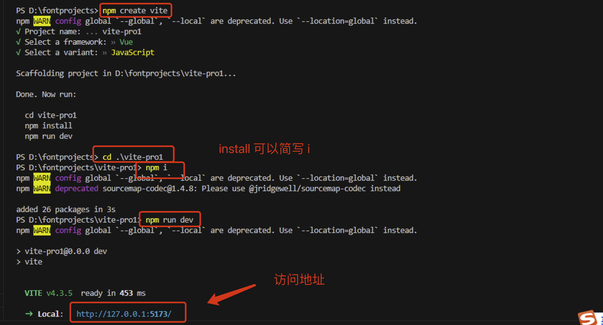​

### 创建项目

> 使用命令行创建工程

* 在磁盘的合适位置上,创建一个空目录用于存储多个前端项目
* 用vscode打开该目录
* 在vocode中打开命令行运行如下命令

```shell
npm create vite@latest
```

* 第一次使用vite时会提示下载vite,输入y回车即可,下次使用vite就不会出现了

​​

* 注意： 选择vue+JavaScript选项即可

​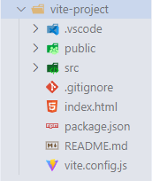​

### 安装依赖

* 此时只是在package.json中含有依赖信息，但是还没有下载，还要手动下载
* cd进入刚刚创建的项目目录
* npm install命令安装基础依赖

```shell
cd ./vue3-demo1
npm install
```

​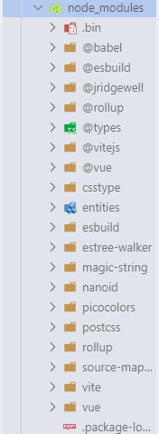​

### 启动项目

> 研发模式运行

```shell
npm run dev
```

​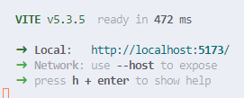​

#### 可执行的命令

通过查看package.json可以获得可执行的命令

```json
{
  "name": "vite-project",
  "private": true,
  "version": "0.0.0",
  "type": "module",
  "scripts": {
    "dev": "vite",
    "build": "vite build",
    "preview": "vite preview"
  },
  "dependencies": {
    "vue": "^3.4.31"
  },
  "devDependencies": {
    "@vitejs/plugin-vue": "^5.0.5",
    "vite": "^5.3.4"
  }
}
```

### 停止项目

​`Ctrl + C`​

## 目录结构

​​

* node_modules：存放下载的依赖文件
* **public/** ：用于存放公共资源，如HTML文件、图像、字体等，这些资源会被直接复制到构建出的目标目录中
* **src/** ：存放项目的源代码，包括JavaScript、CSS、Vue组件、图像和字体等资源。开发过程中，这些文件会被Vite实时编译和处理，并在浏览器中进行实时预览和调试

  * **assets/** ：用于存放一些项目中使用的**静态资源**，如图片、字体、样式文件等
  * **components/** ：用于存放**组件相关**的文件。组件是代码复用的一种方式，用于抽象出一个可复用的UI部件，方便在不同的场景中进行重复使用
  * **layouts/** ：用于存放**页面级别**的组件文件，通常是路由对应的组件文件。在这个目录下，可以创建对应的文件夹，用于存储不同的页面组件
  * **plugins/** ：用于存放 Vite **插件相关**的文件，可以按需加载不同的插件来实现不同的功能，如自动化测试、代码压缩等
  * **router/** ：用于存放 **Vue.js 的路由配置文件**，负责管理视图和 URL 之间的映射关系，方便实现页面之间的跳转和数据传递
  * **store/** ：用于存放 **Vuex 状态管理相关**的文件，负责管理应用程序中的数据和状态，方便统一管理和共享数据，提高开发效率
  * **utils/** ：用于存放一些**通用的工具函数**，如日期处理函数、字符串操作函数等
* **vite.config.js**：**Vite 的配置文件**，可以通过该文件配置项目的参数、插件、打包优化等。该文件可以使用 CommonJS 或 ES6 模块的语法进行配置
* **package.json**：标准的 **Node.js 项目配置文件**，包含了项目的基本信息和依赖关系。其中可以通过 scripts 字段定义几个命令，如 dev、build、serve 等，用于启动开发、构建和启动本地服务器等操作

Vite 项目的入口为 **src/main.js** 文件，这是 Vue.js 应用程序的启动文件，也是整个前端应用程序的入口文件。在该文件中，通常会引入 Vue.js 及其相关插件和组件，同时会创建 Vue 实例，挂载到 HTML 页面上指定的 DOM 元素中

### 默认npm scripts

* 在安装了 Vite 的项目中，可以在 npm scripts 中使用 `vite`​ 可执行文件，或者直接使用 `npx vite`​ 运行它。下面是通过脚手架创建的 Vite 项目中默认的 npm scripts：(package.json)

```json
{
  "scripts": {
    "dev": "vite", // 启动开发服务器，别名：`vite dev`，`vite serve`
    "build": "vite build", // 为生产环境构建产物
    "preview": "vite preview" // 本地预览生产构建产物
  }
}
```

### vite.config.js 设置端口号

```javascript
//修改vite项目配置文件 vite.config.js
export default defineConfig({
  plugins: [vue()],
  server:{
    port:3000
  }
})
```

## 单文件组件（SFC）

### VUE的组件

* 一个页面作为整体,是由多个部分组成的,每个部分在这里就可以理解为一个组件
* 每个.vue文件就可以理解为一个组件,多个.vue文件可以构成一个整体页面
* 组件化给我们带来的另一个好处就是组件的复用和维护非常的方便

​​

### .vue文件

* 传统的页面有.html文件.css文件和.js文件三个文件组成(多文件组件)
* vue将这文件合并成**一个.vue文件**(Single-File Component，简称 SFC,**单文件组件**)
* .vue文件对js/css/html统一封装,这是VUE中的概念 该文件由三个部分组成 `<script> <template> <style>`​

  * template标签 代表组件的**html**部分代码 代替传统的.html文件
  * script标签 代表组件的**js**代码 代替传统的.js文件
  * style标签 代表组件的**css**样式代码 代替传统的.css文件

> 工程化VUE项目组织组件

* **index.html**是项目的入口,其中 `<div id ='app'></div>`​是用于挂载所有组建的元素
* index.html中的script标签引入了一个**main.js**文件,具体的挂载过程在main.js中执行
* **main.js**是vue工程中非常重要的文件,他决定这项目使用哪些依赖,导入的第一个组件
* **App.vue**是vue中的核心组件,所有的其他组件都要通过该组件进行导入,该组件通过路由可以控制页面的切换

​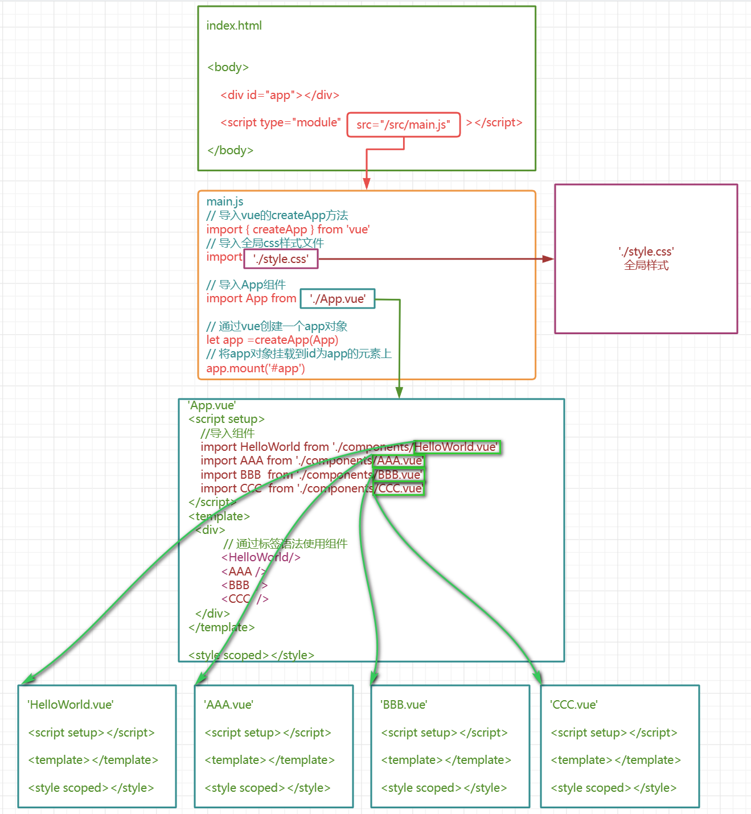​

注：

* 语法上，要求template只能有一个一级子标签；但是也不会报错，最好加上div进行包裹

```HTML
<script>
    //存储vue页面逻辑js代码
</script>

<template>
    <!-- 页面的样式的是html代码-->
</template>

<style scoped>
    /** 存储的是css代码! <style scoped> 是 Vue.js 单文件组件中用于设置组件样式的一种方式。
    它的含义是将样式局限在当前组件中，不对全局样式造成影响。 */
</style>
```

## 样式导入

1. 在.vue文件中的<style>中
2. 将css样式保存到独立的.css文件中，哪个.vue文件需要，就在哪里导入即可

> 导入方式

1. 在<script>中导入

    ```javascript
    <script setup>
    import './style/test.css';
    </script>
    ```

2. 在<style>中导入

    ```javascript
    <style scoped>
    @import './style/test.css';
    </style>
    ```
3. 如果某个样式需要在全局使用，则在main.js中引入

    ```javascript
    import { createApp } from "vue";
    import "./style.css";
    import "./style/test.css"; //此处插入
    import App from "./App.vue";
    createApp(App).mount("#app");
    ```

## 响应式和非响应式

> 响应式数据

在数据变化时，VUE框架会将变量最新的值更新到DOM树中，页面数据就是实时更新的

> 非响应式数据

在数据变化时，VUE框架不会将变量最新的值更新到DOM树中，页面数据不是实时更新的

* VUE2中，数据不做特殊处理，默认就是响应式的
* VUE3中，数据要经过ref/reactive函数的处理才是响应式的

  * ref/reactive函数是VUE框架提供的方法，需要导入使用

### ref处理

* ref处理的响应式数据，在操作时：

  * 在<script>中：操作ref的响应式数据需要通过`.value`​的形式操作
  * 在<template>中：操作ref的响应式数据无需通过上述形式操作

```HTML
<script type="module">
import { ref } from "vue";
export default {
    setup() {
        // 定义要展示到html上的一些数据
        let counter = ref(0);

        // 绑定按钮事件
        function counterIncr() {
            counter.value++;
        }
        function counterDecr() {
            counter.value--;
        }
        function showCounter() {
            alert(counter.value);
        }
        return { counter, counterIncr, counterDecr, showCounter };
    },
};
</script>

<template>
    <div>
        <button @click="counterIncr()">+</button>
        <span v-text="counter"></span>
        <button @click="counterDecr()">-</button>
        <button @click="showCounter()">show</button>
    </div>
</template>

<style scoped></style>
```

### setup关键字

> 不使用setup关键字

需要在内部书写`export default`​/`setup()`​/`return{}`​

```HTML
<script type="module">
export default {
    setup() {
        return { };
    },
};
```

> 使用setup关键字

只需要在<script>后添加`setup`​**语法糖**，就可以省略上述需要再内部书写的内容

```HTML
<script setup>
import { ref } from "vue";
</script>
```

# 视图渲染

## 模板语法

Vue 使用一种基于 HTML 的模板语法，使我们能够声明式地将其组件实例的数据**绑定到呈现的 DOM** 上。  
所有的 Vue 模板都是语法层面合法的 HTML，可以被符合规范的浏览器和 HTML 解析器解析。在底层机制中，Vue 会将模板编译成高度优化的 JavaScript 代码。结合响应式系统，当应用状态变更时，Vue 能够智能地推导出需要重新**渲染**的组件的最少数量，并应用最少的 DOM 操作。

### 文本渲染

#### 插值表达式

插值表达式：最基本的数据类型绑定形式是文本差值，使用双大括号语法：

​`{{数据名字/函数/对象调用API}}`​

* 插值表达式是将数据渲染到元素的指定位置的手段之一
* 插值表达式不绝对依赖标签，没有标签也可以单独使用，其位置相对自由
* 插值表达式中支持javascript的运算表达式
* 插值表达式中也支持函数的调用

```HTML
<script setup>
let msg = "hello vue3";
let getMsg = () => {
    return "hello vue3 message";
};
let age = 19;
let bee = "b e e";
let carts = [
    { name: "Cola", price: 3, number: 10 },
    { name: "Tomato", price: 6, number: 3 },
];
// 获取商品总金额的一个方法
function compute() {
    let count = 0;
    for (let index in carts) {
        count += carts[index].price * carts[index].number;
    }
    return count;
}
</script>

<template>
    <div>
        <!-- 绑定数据到标签中 -->
        <h1>{{ msg }}</h1>
        <!-- 不依赖标签 -->
        msg: {{ msg }} <br />
        <!-- 可调用函数，将函数的返回值进行渲染 -->
        getMsg: {{ getMsg() }} <br />
        <!-- 支持一些常见的运算符 -->
        Is adult?: {{ age >= 18 ? "True" : "False" }} <br />
        <!-- 支持对象调用一些API -->
        反转：{{ bee.split(" ").reverse().join("-") }} <br />
        购物车总金额：{{ compute() }} <br />
        购物车总金额：{{
            carts[0].price * carts[0].number + carts[1].price * carts[1].number
        }}
    </div>
</template>

<style scoped></style>
```

​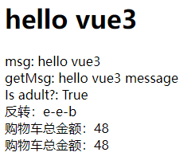​

#### v-text/v-html

* v-\*\*\* 这种写法的方式使用的是vue的命令
* v-\*\*\*的命令**必须依赖元素**,并且要写在元素的**开始标签**中
* v-\*\*\*指令支持ES6中的字符串模板
* 插值表达式中支持javascript的**运算表达式**
* 插值表达式中也支持函数的调用
* v-text可以将数据渲染成双标签中间的文本,但是**不识别html**元素结构的文本
* v-html可以将数据渲染成双标签中间的文本,**识别html**元素结构的文本

```HTML
<script setup>
let msg = "hello vue3";
let haha = "hh";
let msg2 = `hello ${haha}`;
let age = 19;
let bee = "b e e";
function fun() {
    return "abc";
}
let redMsg = "<font color='red'>msg</font>";
</script>

<template>
    <div>
        <span v-text="msg"></span> <br />
        <!-- 支持模板字符串 -->
        <span v-text="msg2"></span> <br />
        <!-- 可以直接写入模版字符串 -->
        <span v-text="`你好 ${haha}`"></span> <br />
        <!-- 支持常见运算符 -->
        <span v-text="age >= 18 ? '成年' : '未成年'"></span> <br />
        <!-- 支持常见对象的API调用 -->
        <span v-text="bee.split(' ').reverse().join('-')"></span> <br />
        <!-- 支持函数的调用-->
        <span v-text="fun()"></span> <br />
        <span v-text="redMsg"></span> <br />
        <span v-html="redMsg"></span> <br />
    </div>
</template>

<style scoped></style>
```

​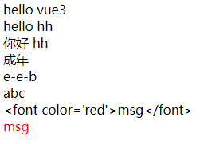​

### Attribute属性渲染

使用`v-bind`​进行绑定

* 由于插值表达式不能直接放在标签的属性中,所有要渲染元素的属性就应该使用v-bind
* v-bind可以用于渲染任何元素的属性,语法为 `v-bind:属性名='数据名'`​, 可以简写为 `:属性名='数据名'`​

```HTML
<script setup>
const data = {
    name:'尚硅谷',
    url:"http://www.atguigu.com",
    logo:"http://www.atguigu.com/images/index_new/logo.png"
  }
</script>

<template>
    <div>
        <a v-bind:href="data.url">
        
    </a>
    </div>
</template>

<style scoped></style>
```

### 事件绑定

> 使用 `v-on`​ 来监听 DOM 事件，并在事件触发时执行对应的 Vue的JavaScript代码。

* 用法：`v-on:click="handler"`​ 或简写为 `@click="handler"`​
* vue中的事件名\=原生事件名去掉`on`​ 前缀 如:`onClick --> click`​

  * onclick ondbclick onblur onfocus ->
  * click dbclick blur focus
* handler的值可以是方法事件处理器,也可以是内联事件处理器
* 绑定事件时,可以通过一些绑定的修饰符,常见的事件修饰符如下

  * ​`.once：只触发一次事件。[重点]`​
  * ​`.prevent：阻止默认事件。[重点]`​
  * .stop：阻止事件冒泡。
  * .capture：使用事件捕获模式而不是冒泡模式。
  * .self：只在事件发送者自身触发时才触发事件。

```HTML
<script setup>
import { ref } from "vue";
function fun1() {
    alert("hi");
}
function fun2(event) {
    let flag = confirm("确定要访问吗");
    if (!flag) {
        // 原生js编码方式阻止组件的默认行为
        event.preventDefault(); // 需要传入event
    }
}

function fun3() {
    alert("超链接被点击了");
}

let counter = ref(0);
</script>

<template>
    <div>
        <!-- 事件的绑定函数 -->
        <button v-on:click="fun1()">hello</button> <br />
        <!-- 内联事件处理器，需要注意ref处理的变量在template中不需要用.value -->
        <button v-on:click="counter++">+</button> <br />
        <!-- 事件的修饰符 .once 事件只绑定一次 -->
        <button v-on:click.once="counter++">++</button> <br />
        {{ counter }}
        <!-- 事件的修饰符 .prevent 阻止组件的默认行为，但是会一直阻止，不会提供选项 -->
        <a href="http://www.atguigu.com" v-on:click="fun2($event)">atguigu</a>
        <br />
        <a href="http://www.atguigu.com" v-on:click.prevent="fun3()">atguigu</a>
    </div>
</template>

<style scoped></style>
```

## 响应式

此处的响应式是指 : 数据模型发生变化时 **,自动更新DOM树内容**,页面上显示的内容会进行同步变化,vue3的数据模型不是自动响应式的,需要我们做一些特殊的处理

1. ref()：适合单个变量

    1. 在<script>中操作ref响应式数据要通过`.value`​
    2. 在<template>中就不需要，直接使用

        ```HTML
        <script setup>
        import { ref } from "vue";

        let counter = ref(10);
        function incr() {
            counter.value++;
        }
        </script>

        <template>
            <div>
                <button @click="incr()">+</button>
                <button @click="counter--">-</button>
                {{ counter }}
            </div>
        </template>

        <style scoped></style>
        ```
2. reactive()：适合对象

    1. 直接通过`对象名.属性值`​就可以访问，不需要.value

        ```HTML
        <script setup>
        import { reactive } from "vue";
        let person = reactive({
            name: "Exusiai",
            age: 18,
        });

        function incr() {
            person.age++;
        }
        </script>

        <template>
            <div>
                <button @click="incr()">+</button>
                <button @click="person.age--">-</button>
                {{ person.age }}
            </div>
        </template>

        <style scoped></style>
        ```

### 对比

* 使用 `ref`​ 适用于以下开发场景：

  * 包装基本类型数据：`ref`​ 主要用于包装基本类型数据（如字符串、数字等），即只有一个值的数据，如果你想监听这个值的变化，用 `ref`​ 最为方便。在组件中使用时也很常见。
  * 访问方式简单：`ref`​ 对象在访问时与普通的基本类型值没有太大区别，只需要通过 `.value`​ 访问其实际值即可。
* 使用 `reactive`​ 适用于以下开发场景：

  * 包装复杂对象：`reactive`​ 可以将一个普通对象转化为响应式对象，这样在数据变化时会自动更新界面，特别适用于处理复杂对象或者数据结构。
  * 需要递归监听的属性：使用 `reactive`​ 可以递归追踪所有响应式对象内部的变化，从而保证界面的自动更新。
* 综上所述，`ref`​ 适用与简单情形下的数据双向绑定，对于只有一个字符等基本类型数据或自定义组件等情况，建议可以使用 `ref`​；而对于对象、函数等较为复杂的数据结构，以及需要递归监听的属性变化，建议使用 `reactive`​。当然，在实际项目中根据需求灵活选择也是十分必要的。

### toRef()/toRefs()

* **toRef()** 基于reactive响应式对象上的一个属性，创建一个对应的ref响应式数据。这样创建的 ref 与其源属性保持同步：改变源属性的值将更新 ref 的值，反之亦然。
* **toRefs()** 将一个响应式对象多个属性转换为一个多个ref数据，这个普通对象的每个属性都是指向源对象相应属性的 ref。每个单独的 ref 都是使用 toRef() 创建的。其实就是同时使用多个toRef()

```HTML
<script setup>
import { ref, reactive, toRef, toRefs } from "vue";
let person = reactive({
    name: "Exusiai",
    age: 18,
});
let personAge = toRef(person, "age");

function incr() {
    person.age++;
}
function incrRefAge() {
    personAge.value++;
}
function incrRefsAge() {
    age.value++;
}

let { name, age } = toRefs(person);
</script>

<template>
    <div>
        <button @click="incr()">+</button>
        <button @click="incrRefAge()">+</button>
        <button @click="incrRefsAge()">+</button>
        personAge: {{ personAge }} 
        person.age: {{ person.age }}
        age: {{ age }}
    </div>
</template>

<style scoped></style>
```

## 条件渲染

### v-if

* ​`v-if='表达式'`​只会在指令的表达式返回真值时才被渲染
* 也可以使用 `v-else`​ 为 `v-if`​ 添加一个“else 区块”。
* 一个 `v-else`​ 元素必须跟在一个 `v-if`​ 元素后面，否则它将不会被识别。

```HTML
<script setup>
import {ref} from 'vue';
let flag = ref(true);
</script>

<template>
    <div>
        <span v-if="flag">hello vue!</span>
        <span v-else>bye vue!</span>
        <button @click="flag = !flag">Switch</button>
    </div>
</template>

<style scoped></style>
```

### v-show

* 另一个可以用来按条件显示一个元素的指令是 `v-show`​。其用法基本一样
* 不同之处在于 `v-show`​ 会在 DOM 渲染中保留该元素，仅切换了该元素上名为 `display`​ 的 CSS 属性；而`v-if`​会使元素不在DOM树中
* ​`v-show`​ 不支持在 `<template>`​ 元素上使用，也不能和 `v-else`​ 搭配使用。

```HTML
<script setup>
import {ref} from 'vue';
let flag = ref(true);
</script>

<template>
    <div>
        <span v-show="flag">hello world!</span>
        <button @click="flag = !flag">Switch</button>
    </div>
</template>

<style scoped></style>
```

### 对比

* ​`v-if`​ 是“真实的”按条件渲染，因为它确保了在切换时，条件区块内的事件监听器和子组件都会被销毁与重建。
* ​`v-if`​ 也是**惰性**的：如果在初次渲染时条件值为 false，则不会做任何事。条件区块只有当条件首次变为 true 时才被渲染。
* 相比之下，`v-show`​ 简单许多，元素无论初始条件如何，始终会被渲染，只有 CSS `display`​ 属性会被切换。
* 总的来说，`v-if`​ 有更高的切换开销，而 `v-show`​ 有更高的初始渲染开销。因此，如果需要频繁切换，则使用 `v-show`​ 较好；如果在运行时绑定条件很少改变，则 `v-if`​ 会更合适。

## 列表渲染

使用`v-for`​基于一个数组渲染一个列表

* ​`v-for`​ 指令的值需要使用 `item in items`​ 形式的特殊语法，其中 `items`​ 是源数据的数组，而 `item`​ 是迭代项的**别名**：
* 在 `v-for`​ 块中可以完整地访问父作用域内的属性和变量。`v-for`​ 也支持使用可选的第二个参数表示当前项的位置索引。

```HTML
<script setup>
import { ref, reactive } from "vue";

let items = reactive([
    { id: "i1", name: "Exusiai" },
    { id: "i2", name: "Texas" },
    { id: "i3", name: "Skadi" },
]);

let appendix = ref("No.");
</script>

<template>
    <div>
        <ur>
            <!-- v-bind:key可以不写 -->
            <li v-for="(item, index) in items" v-bind:key="item.id">
                {{ appendix }}{{ index + 1 }} {{ item.name }}
            </li>
        </ur>
    </div>
</template>

<style scoped></style>
```

### 练习：购物车

```HTML
<script setup>
import { ref, reactive } from "vue";
let carts = reactive([
    {
        name: "Cola",
        price: 3,
        number: 10,
    },
    {
        name: "Toufu",
        price: 6,
        number: 9,
    },
]);

function compute() {
    let count = 0;
    for (let index in carts) {
        count += carts[index].price * carts[index].number;
    }
    return count;
}

function removeCart(index) {
    carts.splice(index, 1);
}

function clearCart() {
    carts.splice(0, carts.length);
    // 不能直接指向一个新的空数组，会导致循环出错
    // carts = []  x
    // carts = reactive([]) x
}
</script>

<template>
    <div>
        <table>
            <thead>
                <tr>
                    <th>序号</th>
                    <th>商品名</th>
                    <th>价格</th>
                    <th>数量</th>
                    <th>小计</th>
                    <th>操作</th>
                </tr>
            </thead>
            <tbody v-if="carts.length > 0">
                <!-- 有数据显示-->
                <tr v-for="(cart, index) in carts" :key="index">
                    <td v-text="index + 1"></td>
                    <td v-text="cart.name"></td>
                    <td v-text="cart.price"></td>
                    <td v-text="cart.number"></td>
                    <td v-text="cart.price * cart.number"></td>
                    <td>
                        <button @click="removeCart(index)">删除</button>
                    </td>
                </tr>
                购物车总金额:
                {{
                    compute()
                }}
                元
            </tbody>
            <tbody v-else>
                购物车为空
            </tbody>
        </table>
        <button @click="clearCart()">一键清空购物车</button>
    </div>
</template>

<style scoped></style>

```

## 双向绑定

* 单向绑定: 响应式数据的变化**会**更新dom树,但是dom树上用户的操作造成的数据改变**不会**同步更新到响应式数据
* 双向绑定: 响应式数据的变化**会**更新dom树,但是dom树上用户的操作造成的数据改变**会**同步更新到响应式数据，也称呼为收集表单信息的命令

  * 用户通过表单标签才能够输入数据,所以双向绑定都是应用到**表单标签**上的,其他标签不行
  * v-model专门用于双向绑定表单标签的value属性,语法为 `v-model:value=''`​,可以简写为 `v-model=''`​
  * v-model还可以用于各种不同类型的输入，`<textarea>`​、`<select>`​ 元素。

### 单项绑定

```HTML
<script setup>
import { ref } from "vue";
let message = ref("Exusiai")

</script>

<template>
    <div>
        <input type="text" :value="message"> <br>
        {{ message }}
    </div>
</template>

<style scoped></style>

```

​​

改变输入框中的数据不会影响响应数据

### 双向绑定

```HTML
<script setup>
import { ref } from "vue";
let message = ref("Exusiai")

</script>

<template>
    <div>
        <input type="text" v-model="message"> <br>
        {{ message }}
    </div>
</template>

<style scoped></style>

```

​​

### 应用场景

```HTML
<script setup>
import { ref, reactive } from "vue";
let user = reactive({
    username: "",
    userPwd: "",
    gender:"",
    intro:"",
    pro:"",
});
let hbs = ref([]);

function clearForm() {
    // 不能使用指向新对象，只能一个一个删除或重置
    user.username = "";
    user.userPwd = "";
    user.gender = "";
    user.intro = "";
    user.pro = "",
    hbs.value.splice(0, hbs.value.length)  // 因为hbs是由ref()转换的，所以hbs需要加.value
}
</script>

<template>
    <div>
        <input type="text" v-model="user.username" /> <br />
        <input type="password" v-model="user.userPwd" /> <br />
        <!-- 多选框 -->
        爱好: 
        唱 <input type="checkbox" v-model="hbs" value="sing" /> 
        跳 <input type="checkbox" v-model="hbs" value="dance" /> 
        rap <input type="checkbox" v-model="hbs" value="rap" /> <br />
        <!-- 单选框 -->
        性别： 
        男 <input type="radio" name="gender" v-model="user.gender" value="male" /> 
        女 <input type="radio" name="gender" v-model="user.gender" value="female" />
        <br />
        简介：<textarea v-model="user.intro"></textarea> <br />
        籍贯：
        <select v-model="user.pro">
            <option value="1">京</option>
            <option value="2">沪</option>
            <option value="3">浙</option>
        </select> <br />
        <button @click="clearForm()">清空表单</button>
        {{ user }} <br />
        {{ hbs }} <br />
    </div>
</template>

<style scoped></style>

```

## 属性计算

模板中的表达式虽然方便，但也只能用来做简单的操作。如果在模板中写太多逻辑，会让模板变得臃肿，难以维护。因此我们推荐使用**计算属性**来描述依赖响应式状态的复杂逻辑

1. 通过方法返回数据，每使用一次，都要执行一次
2. 通过计算属性获得属性，每次使用时如果数据源没有被修改，则直接使用上一次的结果

​​

* 我们在这里定义了一个计算属性 `bookMessage`​。`computed()`​ 方法期望接收一个 getter 函数，返回值为一个**计算属性 ref**。和其他一般的 ref 类似，你可以通过 `bookMessage.value`​ 访问计算结果。计算属性 ref 也会在模板中自动解包，因此在模板表达式中引用时无需添加 `.value`​。
* Vue 的计算属性会自动追踪响应式依赖。它会检测到 `bookMessage`​ 依赖于 `author.books`​，所以当 `author.books`​ 改变时，任何依赖于 `bookMessage`​ 的绑定都会同时更新。

> 计算属性缓存 vs 方法

* 若我们将同样的函数定义为一个方法而不是计算属性，两种方式在结果上确实是完全相同的，然而，不同之处在于**计算属性值会基于其响应式依赖被缓存**。一个计算属性仅会在其响应式依赖更新时才重新计算。这意味着只要 `author.books`​ 不改变，无论多少次访问 `bookMessage`​ 都会立即返回先前的计算结果!

## 数据监听器

> 计算属性允许我们声明性地计算衍生值。然而在有些情况下，我们需要在状态变化时执行一些“副作用”：例如更改 DOM，或是根据异步操作的结果去修改另一处的状态。我们可以使用 **watch** 函数在每次响应式状态发生变化时触发回调函数：

* watch主要用于以下场景：

  * 当数据发生变化时需要执行相应的操作
  * 监听数据变化，当满足一定条件时触发相应操作
  * 在异步操作前或操作后需要执行相应的操作

但是可以通过双向绑定来实现，应用场景不多

### watch

```HTML
<script setup>
import { ref, reactive, watch } from "vue";
let fullname = ref("");
let firstname = ref("");
let lastname = reactive({
    name: "",
});

/* 监听ref响应式数据 */
watch(firstname, (newValue, oldValue) => {
    console.log(`${oldValue}变为${newValue}`);
    fullname.value = newValue + lastname.name;
});

/* 监听reactive中的一个数据 */
watch(
    () => lastname.name,
    (newValue, oldValue) => {
        console.log(`${oldValue}变为${newValue}`);
        fullname.value = firstname.value + newValue;
    }
);

/* 监听reactive对象数据 */
watch(
    () => lastname,
    (newValue, oldValue) => {
        console.log(`${oldValue}变为${newValue}`);
        fullname.value = firstname.value + newValue.name;
    },
    { deep: true, immediate: true } // deep表示实时监测 immediate表示是否在刚访问页面时就执行
);
</script>

<template>
    <div>
        姓<input type="text" v-model="firstname" /> 名<input
            type="text"
            v-model="lastname.name"
        />
        <span>姓名{{ fullname }}</span>
    </div>
</template>

<style scoped></style>

```

### watchEffect

```HTML
<script setup>
import { ref, reactive, watchEffect } from "vue";
let fullname = ref("");
let firstname = ref("");
let lastname = reactive({
    name: "",
});

/*
 * 任何的响应式数据都可以直接进行监听，无需作为参数进行传递
 * 注意，当函数中没有对被监听数据进行使用时，只会进行一次调用
 */
watchEffect(() => {
    // 当firstname发生改变时，就会调用一次方法
    console.log(firstname.value)
    // 但是此时没有使用fullname和lastname，当它们两个发生改变时，该方法不会被调用
    // fullname.value = firstname.value + lastname.name;
});
</script>

<template>
    <div>
        姓<input type="text" v-model="firstname" /> 名
        <input type="text" v-model="lastname.name" />
        <span>姓名{{ fullname }}</span>
    </div>
</template>

<style scoped></style>

```

## VUE生命周期

每个 Vue 组件实例在创建时都需要经历一系列的初始化步骤，比如设置好数据侦听，编译模板，挂载实例到 DOM，以及在数据改变时更新 DOM。在此过程中，它也会运行被称为**生命周期钩子的函数**，让开发者有机会在特定阶段运行自己的代码

### 图示

​​

### 生命周期钩子

#### beforeCreate

在组件实例初始化完成之后立即调用

​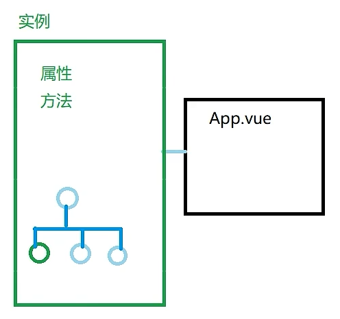​

* 在实例初始化完成并且 props 被解析后立即调用。
* 接着 props 会被定义成响应式属性，`data()`​ 和 `computed`​ 等选项也开始进行处理。
* 注意，组合式 API 中的 `setup()`​ 钩子会在所有选项式 API 钩子之前调用，`beforeCreate()`​ 也不例外。

选项式：不在<script>中写入setup，而是使用`setup(){}`​的方式

#### created

在组件实例处理完所有与状态相关的选项后调用。当这个钩子被调用时，以下内容已经设置完成:

* 响应式数据
* 计算属性
* 方法
* 监听器

然而，此时挂载阶段还未开始，因此 `$el`​ 属性仍不可用

#### beforeMount

在组件被**挂载**之前调用。

​​

当这个钩子被调用时，组件已经完成了其响应式状态的设置，但还没有创建 DOM 节点。它即将首次执行 DOM 渲染过程。

这个钩子在服务端渲染时**不会**被调用。

#### mounted

在组件被挂载之后调用

组件在以下情况下被视为已挂载：

* 所有同步子组件都已经被挂载。(不包含异步组件或 `<Suspense>`​ 树内的组件)
* 其自身的 DOM 树已经创建完成并插入了父容器中。注意仅当根容器在文档中时，才可以保证组件 DOM 树也在文档中。

这个钩子通常用于执行需要访问组件所渲染的 DOM 树相关的副作用，或是在服务端渲染应用中用于确保 DOM 相关代码仅在客户端被调用。

这个钩子在服务端渲染时**不会**被调用。

#### beforeUpdate

在组件即将因为一个**响应式状态变更**（如双向绑定、监听器）而更新其 DOM 树之前调用

这个钩子可以用来在 Vue 更新 DOM 之前访问 DOM 状态。在这个钩子中更改状态也是安全的。

这个钩子在服务端渲染时**不会**被调用。

#### updated

在组件因为一个响应式状态变更而更新其 DOM 树之后调用

这个钩子会在组件的任意 DOM 更新后被调用，这些更新可能是由不同的状态变更导致的。如果需要在某个特定的状态更改后访问更新后的 DOM，使用 [nextTick()](https://cn.vuejs.org/api/general.html#nexttick) 作为替代

注意：不要打updated钩子中更改组件的状态，否则可能导致无限的更新循环

#### beforeUnmount

在一个组件实例被**卸载之前**调用

​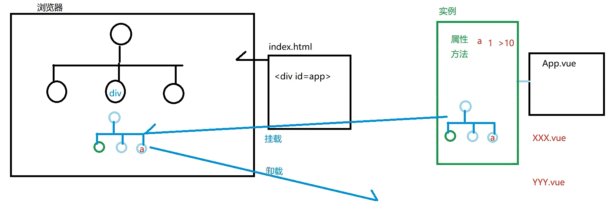​

当这个钩子被调用时，组件实例依然还保有全部的功能。

这个钩子在服务端渲染时**不会**被调用

#### unmounted

在一个组件实例被**卸载之后**调用（比如切换.vue文件，原来的文件相当于被卸载了）

一个组件在以下情况下被视为已卸载：

* 其所有子组件都已经被卸载。
* 所有相关的响应式作用 (渲染作用以及 `setup()`​ 时创建的计算属性和侦听器) 都已经停止。

可以在这个钩子中手动清理一些副作用，例如计时器、DOM 事件监听器或者与服务器的连接。

这个钩子在服务端渲染时不会被调用。

### 钩子函数

使用**组合式**VUE可以使用的API：

|API|作用|
| -------------------| -------------------------------------------------------------------|
|onMounted()|注册一个回调函数，在组件挂载完成后执行|
|onBeforeMount()|注册一个钩子，在组件被挂载之前被调用|
|onUpdated()|注册一个回调函数，在组件因为响应式状态变更而更新其 DOM 树之后调用|
|onBeforeUpdate()|注册一个钩子，在组件即将因为响应式状态变更而更新其 DOM 树之前调用|
|onUnmounted()|注册一个回调函数，在组件实例被卸载之后调用|
|onBeforeUnmount()|注册一个钩子，在组件实例被卸载之前调用|

```HTML
<script setup>
import { ref, onBeforeMount, onMounted, onBeforeUpdate, onUpdated } from "vue";

// 挂载之前
onBeforeMount(() => {
    console.log("========onBeforeMount========");
    console.log(document.getElementById("s1"));
});

// 挂载完成
onMounted(() => {
    console.log("========onMounted========");
    console.log(document.getElementById("s1"));
});

// 更新之前
onBeforeUpdate(() => {
    console.log("========onBeforeUpdate========");
    let element = document.getElementById("s1");
    console.log(message.value, element.innerText);
});

// 更新完成
onUpdated(() => {
    console.log("========onUpdated========");
    let element = document.getElementById("s1");
    console.log(message.value, element.innerText);
});

let message = ref(0);
</script>

<template>
    <div>
        <span id="s1">{{ message }}</span>
        <button @click="message++">+</button>
    </div>
</template>

<style scoped></style>
```

​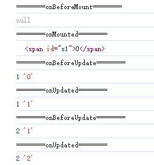​

## VUE组件

组件允许我们将 UI 划分为**独立的、可重用**的部分，并且可以对每个部分进行单独的思考。组件就是实现应用中局部功能代码和资源的集合！在实际应用中，组件常常被组织成层层嵌套的树状结构：

​这与嵌套HTML元素的方式类似，VUE实现了自己的组件模型，可以在每个组件内封装自定义内容与逻辑

> 传统方式编写应用

​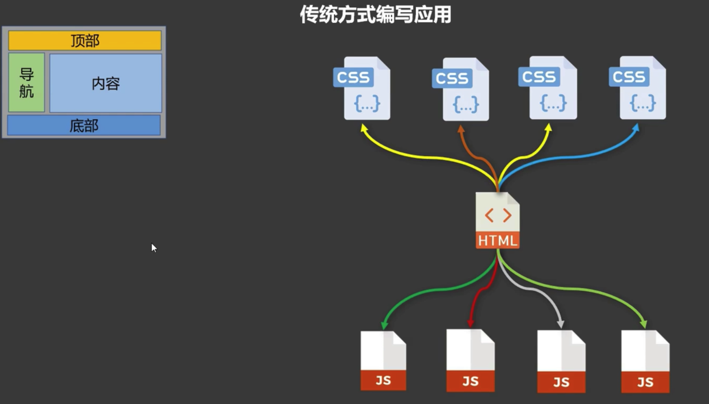​

> 组件方式编写应用：

​​

* 组件化：对js/css/html统一封装,这是VUE中的概念
* 模块化：对js的统一封装,这是ES6中的概念
* 组件化中,对js部分代码的处理使用ES6中的模块化

### 组件开发案例

> 案例需求： 创建一个页面，包含头部和菜单以及内容显示区域，每个区域使用独立组建！

​​

> 1 准备vue项目

```shell
npm create vite
cd vite项目
npm install
```

> 2 安装相关依赖

```shell
npm install sass
npm install bootstrap
```

> 3 创建子组件 在src/components文件下 vscode需要安装Vetur插件，这样vue文件有快捷提示

* Header.vue

```html
<script setup type="module">
</script>

<template>
    <div>
        欢迎： xx <a href="#">退出登录</a>
    </div>
</template>

<style>
</style>
```

* Navigator.vue

```html
<script setup type="module">
</script>

<template>
    <!-- 推荐写一个根标签-->
    <div>
       <ul>
          <li>学员管理</li>
          <li>图书管理</li>
          <li>请假管理</li>
          <li>考试管理</li>
          <li>讲师管理</li>
       </ul>
    </div>
</template>

<style>
</style>
```

* Content.vue

```html
<script setup type="module">
</script>

<template>
    <div>
        展示的主要内容！
    </div>
</template>

<style>
</style>
```

* App.vue 入口组件App引入组件

```html
<script setup>
    import Header  from './components/Header.vue'
    import Navigator  from './components/Navigator.vue'
    import Content  from './components/Content.vue'
</script>

<template>
  <div>
     <Header class="header"></Header>
     <Navigator class="navigator"></Navigator>
     <Content class="content"></Content>
  </div>
</template>

<style scoped>
    .header{
       height: 80px;
       border: 1px solid red;
    }

    .navigator{
      width: 15%;
      height: 800px;
      display: inline-block;
      border: 1px blue solid;
      float: left;
    }

    .content{
      width: 83%;
      height: 800px;
      display: inline-block;
      border: 1px goldenrod solid;
      float: right;
    }

</style>
```

> 4 启动测试

```shell
npm run dev
```

​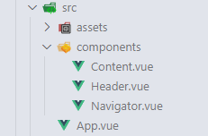​

### 参数传递

#### 父传子

​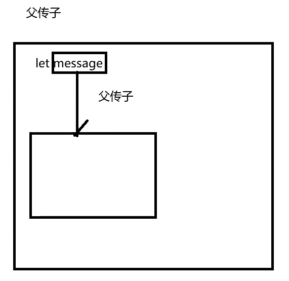​

Vue3 中父组件向子组件传值可以通过 **props** 进行，具体操作如下:

1. 首先，在父组件中**定义需要传递给子组件的值**
2. 接着，在父组件的模板中引入子组件，同时在引入子组件的标签中添加 props 属性并为其设置需要传递的值。
3. 在 Vue3 中，父组件通过 props 传递给子组件的值是**响应式**的。也就是说，如果在父组件中的传递的值发生了改变，子组件中的值也会**相应地更新**。

#### 子传父

​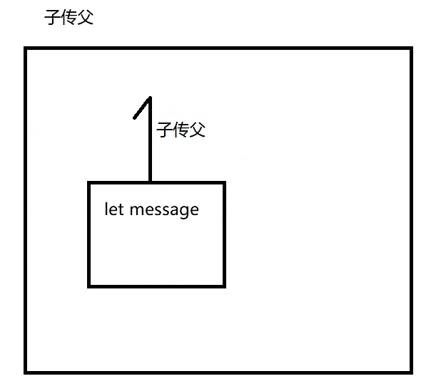​

#### 兄弟传参

​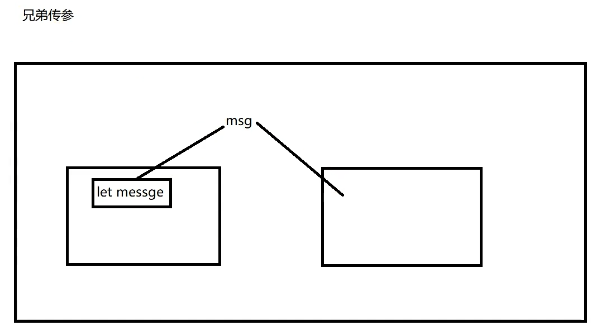​

通过一个父传子和一个子传父实现

> 父

```HTML
<script setup>
/* 引入编写的组件 */
import { ref } from "vue";
import Header from "./components/Header.vue";
import Navigator from "./components/Navigator.vue";
import Content from "./components/Content.vue";

let menu = ref("");
function receiver(data) {
    menu.value = data;
}
</script>

<template>
    <div>
        {{ message }}
        <Header class="header"> </Header>
		<!-- 接收来自子组件的信息@SonFunctionName="ParentFunctionName"不带() -->
        <Navigator @sendMenu="receiver" class="navigator"></Navigator>
		<!-- 向子组件发送内容v-bind:message:"name" -->
        <Content class="content" :message="menu"></Content>
    </div>
</template>

<style scoped>
.header {
    height: 80px;
    border: 1px solid rgb(27, 148, 218);
}
.navigator {
    width: 15%;
    height: 300px;
    border: 1px solid salmon;
    float: left;
}
.content {
    width: 84%;
    height: 300px;
    border: 1px solid blue;
    float: right;
}
</style>


```

> 传出子

```HTML
<script setup>
// 接收父组件的参数
import { defineProps } from "vue";

defineProps = {
    message: String,
};
</script>

<template>
    <div>
        {{ message }}
    </div>
</template>

<style scoped></style>


```

> 传入子

```HTML
<script setup>
// 向父组件发送参数
// defineEmits用于定义向父组件提交数据的事件以及正式地提交数据
import { defineEmits } from "vue";
// 定义一个向父组件提交数据的事件，事件名称自定义
const emits = defineEmits(["sendMenu"]); // 本质上是一个方法，只不过JS中方法以对象的形式存在

// 提交数据的方法
function send(data) {
    emits("sendMenu", data);
}
</script>

<template>
    <div>
        <ul>
            <li @click="send('学员管理')">学员管理</li>
            <li @click="send('图书管理')">图书管理</li>
            <li @click="send('请假管理')">请假管理</li>
            <li @click="send('考试管理')">考试管理</li>
            <li @click="send('讲师管理')">讲师管理</li>
        </ul>
    </div>
</template>

<style scoped></style>

```

# 路由机制router

## 概述

* 定义：路由就是根据不同的 URL 地址展示不同的内容或页面。
* 通俗理解：路由就像是一个地图，我们要去不同的地方，需要通过不同的路线进行导航。

​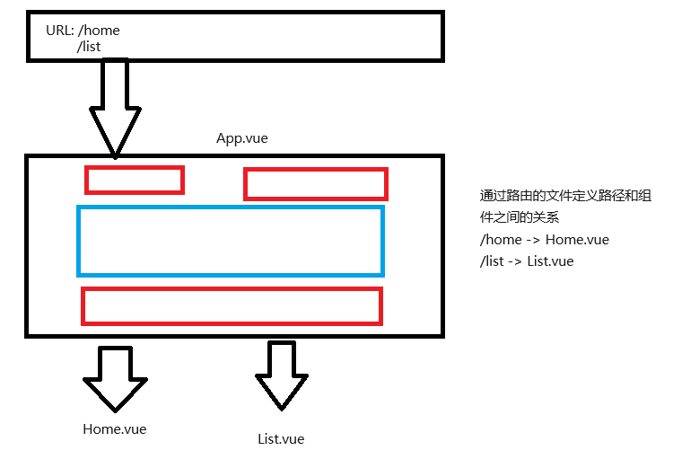​

## 作用

* 单页应用程序（SPA）中，路由可以实现不同视图之间的无刷新切换，提升用户体验；
* 路由还可以实现页面的认证和权限控制，保护用户的隐私和安全；
* 路由还可以利用浏览器的前进与后退，帮助用户更好地回到之前访问过的页面。

## 案例

```shell
npm create vite //创建项目cd 项目文件夹 //进入项目文件夹
npm install //安装项目需求依赖
npm install vue-router@4 --save //安装全局的vue-router 4版本
```

> App.vue

一个视图上可以同时存在多个router-view，每个router-view都快可以设置专门展示哪个组件，通过name属性设置

但是一般一个.vue文件中只会使用一个router-view标签

```HTML
<script setup>
</script>

<template>
    <div>
      <h1>App页面</h1>
      <hr/>
        <!-- 路由的连接 -->
        <router-link to="/">home页</router-link> <br>
        <router-link to="/list">list页</router-link> <br>
        <router-link to="/add">add页</router-link> <br>
        <router-link to="/update">update页</router-link> <br>
      <hr/>
      <!-- 路由连接对应视图的展示位置 -->
      <hr>  <!-- 相当于name="default" -->
      默认展示位置:<router-view></router-view>
      <hr>
      Home视图展示:<router-view name="homeView"></router-view>
      <hr>
      List视图展示:<router-view name="listView"></router-view>
      <hr>
      Add视图展示:<router-view name="addView"></router-view>
      <hr>
      Update视图展示:<router-view name="updateView"></router-view>
    </div>
</template>

<style scoped>
</style>
```

> src/routers/router.js

```javascript
import {createRouter,createWebHashHistory} from 'vue-router'

// 导入vue组件
import Home from '../components/Home.vue'
import List from '../components/List.vue'
import Add from '../components/Add.vue'
import Update from '../components/Update.vue'

// 创建路由对象,声明路由规则
const router = createRouter({
    //createWebHashHistory() 是 Vue.js 基于 hash 模式创建路由的工厂函数。在使用这种模式下，路由信息保存在 URL 的 hash 中，
    //使用 createWebHashHistory() 方法，可以创建一个路由历史记录对象，用于管理应用程序的路由。在 Vue.js 应用中，
    //通常使用该方法来创建路由的历史记录对象。
    //就是路由中缓存历史记录的对象，vue-router提供
    history: createWebHashHistory(),
    routes:[
        {
            path:'/',
            /* 
                component指定组件在默认的路由视图位置展示
                components:Home
                components指定组件在name为某个值的路由视图位置展示
                components:{
                    default:Home,// 默认路由视图位置
                    homeView:Home// name为homeView的路由视图位置
                }   
            */
            components:{
                default:Home,
                homeView:Home
            }  
        },
        {
            path:'/list',
            component: List
        },
        {
            path:'/add',
            component: Add
        },
        {
            path:'/update',
            component: Update
        },
    ]

})

// 对外暴露路由对象
export default router;
```

注意：之后实践的时候发现全写components可能会失效，建议写成现在这样的形式

> main.js

引入router配置

```javascript
import { createApp } from 'vue'
import './style.css'
import App from './App.vue'
//导入router模块
import router from './routers/router.js'
let app = createApp(App)
//绑定路由对象
app.use(router)
//挂在视图
app.mount("#app")
```

​​

## 路由重定向

重定向作用：将一个路由重定向到另一个路由上

如：访问/list和/showAll都定向到List.vue

## 编程式路由(userRouter)

> 普通路由

```HTML
<template>
    <div>
        <!-- 声明式路由 -->
        <router-link to="/home">home</router-link> <br />
        <router-link to="/list">list</router-link> <br />
        <router-link to="/add">add</router-link> <br />
        <router-link to="/update">update</router-link>
        <hr />
        <router-view></router-view>
    </div>
</template>
```

> 编程式路由

```HTML
<script setup>
import { useRouter } from "vue-router";
import { ref } from "vue";
const router = useRouter();
function showList() {
    // 编程式路由实现页面跳转
    // router.push("/list");
    // 也可以传入一个对象
    router.push({ path: "/list" });
}

let myPath = ref("");
function goMyPage() {
    router.push({ path: myPath.value });
}
</script>

<template>
    <div>
        <!-- 编程式路由 -->
        <!-- 通过函数进行跳转 -->
        <button @click="showList()">list</button>
        <hr />
        <!-- 通过输入进行自由跳转 -->
        <button @click="goMyPage()">Go</button
        ><input type="text" v-model="myPath" />
        <hr />
        <router-view></router-view>
    </div>
</template>

<style scoped></style>

```

* 通过useRouter,动态决定向那个组件切换的路由
* 在 Vue 3 和 Vue Router 4 中，可以使用 `useRouter()`​ 来实现动态路由(编程式路由)
* 这里的 `useRouter()`​ 方法返回的是一个 router 对象，可以用它来做如导航到新页面、返回上一页面等操作

## 路由传参

### 路径参数

* 在路径中使用一个动态字段来实现，称为路径参数

  * 例如： 查看数据详情 `/showDetail/1`​ ,`1`​就是要查看详情的id,可以动态添值！

#### 案例

> router.js

```javascript
import { createRouter, createWebHashHistory } from "vue-router";

import ShowDetail from "../components/ShowDetail.vue";

const router = createRouter({
    history: createWebHashHistory(),
    routes: [
        {
            path: "/showdetail/:id/:language",  // :占位符
            component: ShowDetail,
        },
    ],
});

export default router;

```

> showDetail.vue

```HTML
<script setup>
// 接收传递过来的路径参数
// useRoute()用来接收参数
import { useRoute } from "vue-router";
import { ref, onUpdated } from "vue";
let route = useRoute();

let languageId = ref(0);
let languageName = ref("");
// route.params 表示路径参数
// 如果不使用生命周期，则页面只会更新一次，这样就可以在每次接收路径参数后进行页面更新
onUpdated(() => {
    languageId.value = route.params.id;
    languageName.value = route.params.language;
})
</script>

<template>
    <div>
        <h1>接收路径参数</h1>
        <h2>{{ languageId }}</h2>
        <h2>{{ languageName }}</h2>
    </div>
</template>

<style scoped></style>

```

> App.vue

```HTML
<script setup>
import { useRouter } from "vue-router";
import { ref } from "vue";
const router = useRouter();

function showDetail(id, language) {
    router.push(`/showDetail/${id}/${language}`);
}
</script>

<template>
    <div>
        <router-link to="/showdetail/1/Java">声明式路由路径传参</router-link>
        <br />
        <button @click="showDetail(2, 'C++')">编程式路由路径传参</button>
        <hr />
        <router-view></router-view>
    </div>
</template>

<style scoped></style>

```

### 键值对参数

* 类似与get请求通过url传参,数据是键值对形式的

  * 例如: 查看数据详情`/showDetail?hid=1`​,`hid=1`​就是要传递的键值对参数
  * 在 Vue 3 和 Vue Router 4 中，你可以使用 `useRoute()`​ 这个函数从 Vue 的组合式 API 中获取路由对象。
  * ​`useRoute()`​ 方法返回的是当前的 router 对象，你可以用它来获取关于当前路由的信息，如当前的路径、查询参数等。

注意：编程式路由使用`useRouter()`​；路由传参使用`useRoute()`​。不是打错了！

#### 案例

> router.js

```javascript
import { createRouter, createWebHashHistory } from "vue-router";

import ShowKeyValue from "../components/ShowKeyValue.vue";

const router = createRouter({
    history: createWebHashHistory(),
    routes: [
        {
            path: "/ShowKeyValue",
            component: ShowKeyValue,
        },
    ],
});

export default router;

```

> ShowKeyValue.vue

```HTML
<script setup>
import { useRoute } from "vue-router";
import { ref, onUpdated } from "vue";

let languageId = ref(0);
let languageName = ref("");

let route = useRoute();
onUpdated(() => {
    languageId.value = route.query.id; // 需要与传入的键名对应
    languageName.value = route.query.language;
});

// route.query 表示键值对参数
</script>

<template>
    <div>
        <h2>{{ languageId }}</h2>
        <h2>{{ languageName }}</h2>
    </div>
</template>

<style scoped></style>

```

> App.vue

```HTML
<script setup>
import { useRouter } from "vue-router";
import { ref } from "vue";
const router = useRouter();

function showKeyValue(pamram_id, pamram_language) {
    router.push(`/ShowKeyValue?id=${pamram_id}&language=${pamram_language}`);
    // router.push({path:'/showKeyValue', query:{id:pamram_id, language:pamram_language}});
}
</script>

<template>
    <div>
        <router-link to="/ShowKeyValue?id=1&language=Java">声明式路由键值对传参</router-link>
        <br />
        <router-link v-bind:to="{path:'/showKeyValue', query:{id:2, language:'C++'}}">声明式路由键值对传参（传对象）</router-link>
        <br />
        <button @click="showKeyValue(3, 'Python')">编程式路由键值对传参</button>
        <hr />
        <router-view></router-view>
    </div>
</template>

<style scoped></style>

```

## 路由守卫

> 路由守卫是用于在路由切换期间进行一些特定任务的回调函数。路由守卫可以用于许多任务，例如验证用户是否已登录、在路由切换前提供确认提示、请求数据等

1. **全局前置守卫**：在路由切换前被调用，可以用于验证用户是否已登录、中断导航、请求数据等。
2. **全局后置守卫**：在路由切换之后被调用，可以用于处理数据、操作 DOM 、记录日志等。

**守卫代码的位置**: 在router.js中

```javascript
import { createRouter, createWebHashHistory } from "vue-router";

const router = createRouter({
    history: createWebHashHistory(),
    routes: []
});

// 设置全局前置守卫
// 每次路由切换页面前，都会执行beforeEach()中的回调函数
router.beforeEach((to, from, next) => {
    /*  from 表示上一个页面，从哪里来
     to 表示下一个页面，到哪里去
     next 表示放行的方法，只有执行了该方法，才会放行路由 
        next() 放行
        next("/路径") 路由重定向，容易导致死循环，要放在if中
     */
    console.log("beforeEach");
    console.log("from: " + from.path);
    console.log("to: " + to.path);
    next();
});

// 设置全局后置守卫
// 每次路由切换页面后，都会执行afterEach()中的回调函数
router.afterEach((to, from) => {
    console.log("afterEach");
});

export default router;

```

### 案例

> 让用户只有在登录后才能进入home页，否则进入login页

> Login.vue

```HTML
<script setup>
import { ref } from "vue";
import { useRouter } from "vue-router";
let router = useRouter();

let username = ref("");
let password = ref("");

function login() {
    if (username.value == "root" && password.value == "123456") {
        // 将用户名保存在浏览器上，这样在home页也可以使用用户名信息了
        window.sessionStorage.setItem("username", username.value);
        // 路由跳转 /home
        router.push("/home");
    } else {
        alert("登录失败");
    }
}
</script>

<template>
    <div>
        <h1>Login</h1>
        <span>账号：</span> <input type="text" v-model="username" /> <br />
        <span>密码：</span> <input type="password" v-model="password" /> <br />
        <button @click="login()">登录</button>
    </div>
</template>

<style scoped></style>

```

> Home.vue

```HTML
<script setup>
import {useRouter} from 'vue-router';
let router = useRouter();

// 通过浏览器获取用户名
let username = window.sessionStorage.getItem("username");

function logout() {
    // 清除seesionStorage中的用户信息
    window.sessionStorage.removeItem("username");
    // 跳转回login页面
    router.push("/login");
}
</script>

<template>
    <div>
        <h1>Home</h1>
        <span>欢迎{{ username }}登录</span> <br>
        <button @click="logout()">退出登录</button>
    </div>
</template>

<style scoped></style>

```

> router.js

```javascript
import { createRouter, createWebHashHistory } from "vue-router";

import Home from "../components/Home.vue";
import Login from "../components/Login.vue";

const router = createRouter({
    history: createWebHashHistory(),
    routes: [
        {
            path: "/home",
            component: Home,
        },
        {
            path: "/login",
            component: Login,
        },
    ],
});

// 通过路由的前置守卫校验登录，防止用户直接访问home页
router.beforeEach((to, from, next) => {
    if (to.path == "/login") {
        // 判断如果要去登录页面，直接放行
        next();
    } else {
        // 如果是其他资源，都需要先判断有无登录。如果登录了正常进行访问；如果没有登录需要重定向到login页面
        const username = sessionStorage.getItem("username");
        if (null != username) {
            next();
        } else {
            next("/login");
        }
    }
});

export default router;

```

# 数据交互axios

## promise

### 普通函数和回调函数

> 普通函数：正常调用的函数,一般函数执行完毕后才会继续执行下一行代码

```html
<script>
    let fun1 = () =>{
        console.log("fun1 invoked")
    }
    // 调用函数
    fun1()
    // 函数执行完毕,继续执行后续代码
    console.log("other code processon")
</script>
```

> 回调函数：一种基于事件的自动调用函数，表示未来才会执行的一些功能，后续代码**不会**等待该函数执行完毕就开始执行了

```html
<script>
    // 设置一个2000毫秒后会执行一次的定时任务
    setTimeout(function (){
        console.log("setTimeout invoked")
    },2000)
    console.log("other code processon")
</script>
```

### 概述

> 前端中的异步编程技术，类似Java中的多线程+线程结果回调！

* Promise 是异步编程的一种解决方案，比传统的解决方案——回调函数和事件——更合理和更强大。它由社区最早提出和实现，ES6将其写进了语言标准，统一了用法，原生提供了`Promise`​对象。
* 所谓`Promise`​，简单说就是一个容器，里面保存着某个未来才会结束的事件（通常是一个异步操作）的结果。从语法上说，Promise 是一个对象，从它可以获取异步操作的消息。Promise 提供统一的 API，各种异步操作都可以用同样的方法进行处理。

​`Promise`​对象有以下两个特点：

1. Promise对象代表一个异步操作，有三种状态：

    1. ​`Pending`​（进行中）：其它代码继续执行
    2. ​`Resolved`​（已完成，又称 Fulfilled）：准备成功时处理的方案
    3. ​`Rejected`​（已失败）：准备失败时处理的方案

    只有异步操作的结果，可以决定当前是哪一种状态，任何其他操作**都无法改变这个状态**。这也是`Promise`​这个名字的由来，它的英语意思就是“承诺”，表示其他手段无法改变。
2. 一旦状态改变，就不会再变，**任何时候都可以得到这个结果**。Promise对象的状态改变，只有两种可能：从`Pending`​变为`Resolved`​和从`Pending`​变为`Rejected`​。只要这两种情况发生，状态就凝固了，不会再变了，**会一直保持这个结果**。

### 使用

#### 基本用法

```HTML
<!DOCTYPE html>
<html lang="en">
    <head>
        <meta charset="UTF-8" />
        <meta name="viewport" content="width=device-width, initial-scale=1.0" />
        <title>Document</title>
        <script>
            /* 
            resolve 函数，在回调函数中如果调用resolve方法，promise状态会由pending转换为resolved
            reject 函数，在回调函数中如果调用reject方法，promise状态会由pending转换为rejected
            两个变量随意命名，但是默认为这两个
			可以看成开启了一个多线程，括号内的代码和括号外的代码同步运行
        */
            let promise = new Promise(function (resolve, reject) {
                // 这个函数就是回调函数
                console.log("function invoked");
                resolve("Link start!");  // 如果发生状态转换，就不会再变化了
                // reject("Damn");  // 可以传递参数
            });
            console.log("other code1"); // 不会等待回调函数执行完毕
            promise.then(
                function (value) {
                    // promise转换为resolved状态时会执行的函数
                    console.log("promise success: " + value);
                },
                function (value) {
                    // promise转换为rejected状态时会执行的函数
                    console.log("promise fail: " + value);
                }
            ); // 等待promise对象状态发生改变时才会执行的代码

            console.log("other code2");
        </script>
    </head>
    <body></body>
</html>

```

#### catch()

​`.then()`​返回的还是一个promise，可以使用链式编程进行连接，实现一个类似try{}catch{}的功能

```HTML
<!DOCTYPE html>
<html lang="en">
    <head>
        <meta charset="UTF-8" />
        <meta name="viewport" content="width=device-width, initial-scale=1.0" />
        <title>Document</title>
        <script>
            /* 
            resolve 函数，在回调函数中如果调用resolve方法，promise状态会由pending转换为resolved
            reject 函数，在回调函数中如果调用reject方法，promise状态会由pending转换为rejected
            两个变量随意命名，但是默认为这两个
			可以看成开启了一个多线程，括号内的代码和括号外的代码同步运行
        */
            let promise = new Promise(function (resolve, reject) {
                // 这个函数就是回调函数
                console.log("function invoked");
                resolve("Link start!"); // 如果发生状态转换，就不会再变化了
                // reject("Damn");  // 可以传递参数
                // throw new Error("error message");
            });
            console.log("other code1"); // 不会等待回调函数执行完毕

            // 等待promise对象状态发生改变时才会执行的代码
            promise
                .then(function (value) {
                    // promise转换为resolved状态时会执行的函数
                    console.log("promise success: " + value);
                })
                .catch(function (value) {
                    // 当promise状态是rejected或者promise出现异常时会执行的函数，此时上方reject对应的方法可以删去
                    console.log("promise catch: " + value);
                });

            console.log("other code2");
        </script>
    </head>
    <body></body>
</html>

```

### async/await

#### async

可以使用简洁的语法获得promise对象

1. async标识函数后,async函数的返回值会变成一个**promise**对象
2. 如果函数内部返回的数据是一个非promise对象,async函数的结果会返回一个**成功状态 promise对象**
3. 如果函数内部返回的是一个promise对象,则async函数返回的状态与结果由该对象决定
4. 如果函数内部抛出的是一个异常,则async函数返回的是一个**失败的promise对象**

```HTML
<!DOCTYPE html>
<html lang="en">
    <head>
        <meta charset="UTF-8" />
        <meta name="viewport" content="width=device-width, initial-scale=1.0" />
        <title>Document</title>
        <script>
            // let fun1 = async () => {};
            async function fun1() {
                // return 10;  // 方法如果正常return结果，返回状态为resolved的promise
                // throw new Error("Wrong!");  // 如果方法中出现了异常，返回状态为rejected的promise
                let promise = Promise.resolve("Link5");  // Promise.reject("Link3")
                return promise;  // 如果方法返回一个promise，则根据promise的状态来决定返回值的状态
            }

            let promise = fun1();

            promise
                .then(function (value) {
                    console.log("success: " + value);
                })
                .catch(function (value) {
                    console.log("fail: " + value);
                });
        </script>
    </head>
    <body></body>
</html>
```

#### await

1. await右侧的表达式一般为一个**promise**对象,但是也可以是一个其他值
2. 如果表达式是promise对象,await返回的是**promise成功的值**
3. await会等右边的**promise对象执行结束**,然后再获取结果,后续代码（在该async function内）也**会等待**await的执行，在该方法外的仍然在运行
4. 如果表达式是其他值,则直接返回该值
5. await**必须在async函数中**,但是async函数中可以没有await
6. 如果await右边的promise失败了,就会抛出异常,需要通过 try ... catch捕获处理

```HTML
<!DOCTYPE html>
<html lang="en">
    <head>
        <meta charset="UTF-8" />
        <meta name="viewport" content="width=device-width, initial-scale=1.0" />
        <title>Document</title>
        <script>
            async function fun1() {
                return 10;
            }

            async function fun2() {
                // let res = await fun1();
                let res;
                try {
                    res = await Promise.reject("Wrong!");
                } catch (e) {
                    console.log("catch got: " + e);
                }
                console.log("await got: " + res);
            }
            fun2();
        </script>
    </head>
    <body></body>
</html>

```

​​

## Ajax与Axios

> Ajax

* AJAX \= Asynchronous JavaScript and XML（异步的 JavaScript 和 XML）。
* AJAX 不是新的编程语言，而是一种使用现有标准的新方法。
* AJAX 最大的优点是在不重新加载整个页面的情况下，可以与服务器交换数据并更新部分网页内容。
* AJAX 不需要任何浏览器插件，但需要用户允许 JavaScript 在浏览器上执行。
* XMLHttpRequest 只是实现 Ajax 的一种方式。

​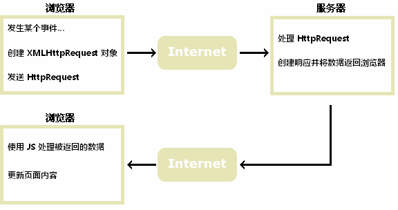​

> Axios

* Axios 是一个基于 *[promise](https://javascript.info/promise-basics "promise")* 网络请求库，作用于[node.js](https://nodejs.org/ "node.js") 和浏览器中。 它是 *[isomorphic](https://www.lullabot.com/articles/what-is-an-isomorphic-application "isomorphic")* 的(即同一套代码可以运行在浏览器和node.js中)。在服务端它使用原生 node.js `http`​ 模块, 而在客户端 (浏览端) 则使用 XMLHttpRequests。它有如下特性

  * 从浏览器创建 [XMLHttpRequests](https://developer.mozilla.org/en-US/docs/Web/API/XMLHttpRequest "XMLHttpRequests")
  * 从 node.js 创建 [http](http://nodejs.org/api/http.html "http") 请求
  * 支持 [Promise](https://developer.mozilla.org/en-US/docs/Web/JavaScript/Reference/Global_Objects/Promise "Promise") API
  * 拦截请求和响应
  * 转换请求和响应数据
  * 取消请求
  * 自动转换JSON数据
  * 客户端支持防御[XSRF](http://en.wikipedia.org/wiki/Cross-site_request_forgery "XSRF")

## 案例：请求后端随机数据进行展示

### 案例需求

> 1 案例需求:请求后台获取随机土味情话

#### 请求的url

```http
https://api.uomg.com/api/rand.qinghua?format=json    或者使用  http://forum.atguigu.cn/api/rand.qinghua?format=json
```

#### 请求的方式

```http
GET/POST
```

#### 数据返回的格式

```json
{"code":1,"content":"我努力不是为了你而是因为你。"}
```

### 准备项目

```javascript
npm create vite
npm install 
/*npm install vue-router@4 --save
npm install pinia */
```

#### 安装axios

```shell
npm install axios
```

#### 设计页面（App.Vue）

```html
<script setup type="module">
  import axios from 'axios'
  import { onMounted,reactive } from 'vue';
  
  let jsonData =reactive({code:1,content:'我努力不是为了你而是因为你'})

  let getLoveMessage =()=>{
    axios({
      method:"post", // 请求方式
      url:"https://api.uomg.com/api/rand.qinghua?format=json",  // 请求的url
      data:{ // 当请求方式为post时,data下的数据以JSON串放入请求体,否则以key=value形式放url后
        username:"123456"
      }
    }).then( function (response){//响应成功时要执行的函数
      console.log(response)
      Object.assign(jsonData,response.data)
    }).catch(function (error){// 响应失败时要执行的函数
      console.log(error)
    })
  }

  /* 通过onMounted生命周期,自动加载一次 */
  onMounted(()=>{
    getLoveMessage()
  })
</script>

<template>
    <div>
      <h1>今日土味情话:{{jsonData.content}}</h1>
      <button  @click="getLoveMessage">获取今日土味情话</button>
    </div>
</template>

<style scoped>
</style>

```

#### 启动测试

```shell
npm run dev
```

### 异步响应的数据结构

* 响应的数据是经过包装返回的！一个请求的响应包含以下信息。

```json
{
  // `data` 由服务器提供的响应
  data: {},
  // `status` 来自服务器响应的 HTTP 状态码
  status: 200,
  // `statusText` 来自服务器响应的 HTTP 状态信息
  statusText: 'OK',
  // `headers` 是服务器响应头
  // 所有的 header 名称都是小写，而且可以使用方括号语法访问
  // 例如: `response.headers['content-type']`
  headers: {},
  // `config` 是 `axios` 请求的配置信息
  config: {},
  // `request` 是生成此响应的请求
  // 在node.js中它是最后一个ClientRequest实例 (in redirects)，
  // 在浏览器中则是 XMLHttpRequest 实例
  request: {}
}
```

* then取值

```javascript
then(function (response) {
    console.log(response.data);
    console.log(response.status);
    console.log(response.statusText);
    console.log(response.headers);
    console.log(response.config);
});
```

### 通过async和await处理异步请求

```html
<script setup type="module">
  import axios from 'axios'
  import { onMounted,reactive } from 'vue';
  
  let jsonData =reactive({code:1,content:'我努力不是为了你而是因为你'})

  let getLoveWords = async ()=>{
    return await axios({
      method:"post",
      url:"https://api.uomg.com/api/rand.qinghua?format=json",
      data:{
        username:"123456"
      }
    })
  }

  let getLoveMessage =()=>{
   	 let {data}  = await getLoveWords()
     Object.assign(message,data)
  }

  /* 通过onMounted生命周期,自动加载一次 */
  onMounted(()=>{
    getLoveMessage()
  })
</script>

<template>
    <div>
      <h1>今日土味情话:{{jsonData.content}}</h1>
      <button  @click="getLoveMessage">获取今日土味情话</button>
    </div>
</template>

<style scoped>
</style>

```

#### axios在发送异步请求时的可选配置：

```json
{
  // `url` 是用于请求的服务器 URL
  url: '/user',
  // `method` 是创建请求时使用的方法
  method: 'get', // 默认值
  // `baseURL` 将自动加在 `url` 前面，除非 `url` 是一个绝对 URL。
  // 它可以通过设置一个 `baseURL` 便于为 axios 实例的方法传递相对 URL
  baseURL: 'https://some-domain.com/api/',
  // `transformRequest` 允许在向服务器发送前，修改请求数据
  // 它只能用于 'PUT', 'POST' 和 'PATCH' 这几个请求方法
  // 数组中最后一个函数必须返回一个字符串， 一个Buffer实例，ArrayBuffer，FormData，或 Stream
  // 你可以修改请求头。
  transformRequest: [function (data, headers) {
    // 对发送的 data 进行任意转换处理
    return data;
  }],
  // `transformResponse` 在传递给 then/catch 前，允许修改响应数据
  transformResponse: [function (data) {
    // 对接收的 data 进行任意转换处理
    return data;
  }],
  // 自定义请求头
  headers: {'X-Requested-With': 'XMLHttpRequest'},
  // `params` 是与请求一起发送的 URL 参数
  // 必须是一个简单对象或 URLSearchParams 对象
  params: {
    ID: 12345
  },
  // `paramsSerializer`是可选方法，主要用于序列化`params`
  // (e.g. https://www.npmjs.com/package/qs, http://api.jquery.com/jquery.param/)
  paramsSerializer: function (params) {
    return Qs.stringify(params, {arrayFormat: 'brackets'})
  },
  // `data` 是作为请求体被发送的数据
  // 仅适用 'PUT', 'POST', 'DELETE 和 'PATCH' 请求方法
  // 在没有设置 `transformRequest` 时，则必须是以下类型之一:
  // - string, plain object, ArrayBuffer, ArrayBufferView, URLSearchParams
  // - 浏览器专属: FormData, File, Blob
  // - Node 专属: Stream, Buffer
  data: {
    firstName: 'Fred'
  },
  // 发送请求体数据的可选语法
  // 请求方式 post
  // 只有 value 会被发送，key 则不会
  data: 'Country=Brasil&City=Belo Horizonte',
  // `timeout` 指定请求超时的毫秒数。
  // 如果请求时间超过 `timeout` 的值，则请求会被中断
  timeout: 1000, // 默认值是 `0` (永不超时)
  // `withCredentials` 表示跨域请求时是否需要使用凭证
  withCredentials: false, // default
  // `adapter` 允许自定义处理请求，这使测试更加容易。
  // 返回一个 promise 并提供一个有效的响应 （参见 lib/adapters/README.md）。
  adapter: function (config) {
    /* ... */
  },
  // `auth` HTTP Basic Auth
  auth: {
    username: 'janedoe',
    password: 's00pers3cret'
  },
  // `responseType` 表示浏览器将要响应的数据类型
  // 选项包括: 'arraybuffer', 'document', 'json', 'text', 'stream'
  // 浏览器专属：'blob'
  responseType: 'json', // 默认值
  // `responseEncoding` 表示用于解码响应的编码 (Node.js 专属)
  // 注意：忽略 `responseType` 的值为 'stream'，或者是客户端请求
  // Note: Ignored for `responseType` of 'stream' or client-side requests
  responseEncoding: 'utf8', // 默认值
  // `xsrfCookieName` 是 xsrf token 的值，被用作 cookie 的名称
  xsrfCookieName: 'XSRF-TOKEN', // 默认值
  // `xsrfHeaderName` 是带有 xsrf token 值的http 请求头名称
  xsrfHeaderName: 'X-XSRF-TOKEN', // 默认值
  // `onUploadProgress` 允许为上传处理进度事件
  // 浏览器专属
  onUploadProgress: function (progressEvent) {
    // 处理原生进度事件
  },
  // `onDownloadProgress` 允许为下载处理进度事件
  // 浏览器专属
  onDownloadProgress: function (progressEvent) {
    // 处理原生进度事件
  },
  // `maxContentLength` 定义了node.js中允许的HTTP响应内容的最大字节数
  maxContentLength: 2000,
  // `maxBodyLength`（仅Node）定义允许的http请求内容的最大字节数
  maxBodyLength: 2000,
  // `validateStatus` 定义了对于给定的 HTTP状态码是 resolve 还是 reject promise。
  // 如果 `validateStatus` 返回 `true` (或者设置为 `null` 或 `undefined`)，
  // 则promise 将会 resolved，否则是 rejected。
  validateStatus: function (status) {
    return status >= 200 && status < 300; // 默认值
  },
  // `maxRedirects` 定义了在node.js中要遵循的最大重定向数。
  // 如果设置为0，则不会进行重定向
  maxRedirects: 5, // 默认值
  // `socketPath` 定义了在node.js中使用的UNIX套接字。
  // e.g. '/var/run/docker.sock' 发送请求到 docker 守护进程。
  // 只能指定 `socketPath` 或 `proxy` 。
  // 若都指定，这使用 `socketPath` 。
  socketPath: null, // default
  // `httpAgent` and `httpsAgent` define a custom agent to be used when performing http
  // and https requests, respectively, in node.js. This allows options to be added like
  // `keepAlive` that are not enabled by default.
  httpAgent: new http.Agent({ keepAlive: true }),
  httpsAgent: new https.Agent({ keepAlive: true }),
  // `proxy` 定义了代理服务器的主机名，端口和协议。
  // 您可以使用常规的`http_proxy` 和 `https_proxy` 环境变量。
  // 使用 `false` 可以禁用代理功能，同时环境变量也会被忽略。
  // `auth`表示应使用HTTP Basic auth连接到代理，并且提供凭据。
  // 这将设置一个 `Proxy-Authorization` 请求头，它会覆盖 `headers` 中已存在的自定义 `Proxy-Authorization` 请求头。
  // 如果代理服务器使用 HTTPS，则必须设置 protocol 为`https`
  proxy: {
    protocol: 'https',
    host: '127.0.0.1',
    port: 9000,
    auth: {
      username: 'mikeymike',
      password: 'rapunz3l'
    }
  },
  // see https://axios-http.com/zh/docs/cancellation
  cancelToken: new CancelToken(function (cancel) {
  }),
  // `decompress` indicates whether or not the response body should be decompressed 
  // automatically. If set to `true` will also remove the 'content-encoding' header 
  // from the responses objects of all decompressed responses
  // - Node only (XHR cannot turn off decompression)
  decompress: true // 默认值
}
```

‍

1. GET：即使使用了data，数据也不会放入data中；需要使用`params`​将数据以键值对形式放在url后
2. POST：如果有使用data，则数据会以JSON形式放入请求体（也可以使用params，同样也是放在url之后）

##### get配置

```javascript
function getLoveMessage() {
    let promise = axios({
        method: "get",
        url: "https://api.uomg.com/api/rand.qinghua",
        params: { format: "json", username: "Exusiai" },
    });
```

​​

get请求：数据以键值对形式在路径中传递

##### post配置

```javascript
function getLoveMessage() {
    let promise = axios({
        method: "post",
        url: "https://api.uomg.com/api/rand.qinghua",
        data: { format: "json", username: "Exusiai" },
    });
```

​​

post请求：数据以JSON串形式传递

##### get()/post()

##### get()

```javascript
<script setup>
import axios from "axios"; // 在源码中使用了默认导出的形式，所以不加{}
import { ref, reactive } from "vue";

let message = ref("");
let objMessage = reactive({
    code: "",
    content: "",
});

function getLoveWords() {
    // 发送GET请求的方式
    // axios.get(url, {其他信息}); url必填，其他可不填
    return axios.get("https://api.uomg.com/api/rand.qinghua", {
        params: {
            format: "json",
            username: "Exusiai",
        },
        header: {
            Accept: "application/json, text/plain, */*",
        },
    });
}

async function getLoveMessage() {
    // 简化1
    let response = await getLoveWords();
    message.value = response.data.content;

    // 简化2
    let { data } = await getLoveWords(); // 解构表达式
    Object.assign(objMessage, data);
}
</script>

<template>
    <div>
        <h1>{{ message }}</h1>
        <hr />
        <h1 v-text="objMessage.content"></h1>
        <button @click="getLoveMessage()">Change</button>
    </div>
</template>

<style scoped></style>

```

##### post()

```javascript
<script setup>
import axios from "axios"; // 在源码中使用了默认导出的形式，所以不加{}
import { ref, reactive } from "vue";

let message = ref("");
let objMessage = reactive({
    code: "",
    content: "",
});

function getLoveWords() {
    // POST请求
    // axios.post(url, {要放入请求体中的JSON串}, {请求的其他信息})  url必填，其余两项可不填
	// 最简形式
    // return axios.post("https://api.uomg.com/api/rand.qinghua?format=json");
    return axios.post(
        "https://api.uomg.com/api/rand.qinghua",
        { username: "八奈见", userpwd: "杏菜" },
        {
            params: {
                format: "json",
            },
            header: {
                Accept: "application/json, text/plain, text/html, */*",
            },
        }
    );
}

async function getLoveMessage() {
    // 简化1
    let response = await getLoveWords();
    message.value = response.data.content;

    // 简化2
    let { data } = await getLoveWords(); // 解构表达式
    Object.assign(objMessage, data);
}
</script>

<template>
    <div>
        <h1>{{ message }}</h1>
        <hr />
        <h1 v-text="objMessage.content"></h1>
        <button @click="getLoveMessage()">Change</button>
    </div>
</template>

<style scoped></style>
```

## 拦截器

如果想在axios发送请求**之前**,或者是数据响应回来在**执行then方法之前**做一些额外的工作,可以通过拦截器完成

​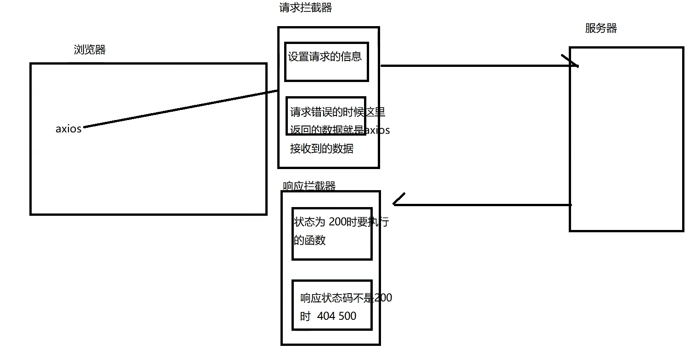​

### 分离实例对象

> axios.js

```javascript
import axios from "axios";

// 使用axios函数创建一个可以发送请求的实例对象
const instance = axios.create({});

// 使用默认导出暴露instance
export default instance;
```

> App.vue

```javascript
<script setup>
import request from "./axios.js";
</script>
```

### 配置拦截器

> axios.js

```javascript
import axios from "axios";

// 使用axios函数创建一个可以发送请求的实例对象
const instance = axios.create({
    // 请求的基础路径：之后的任何请求都会在URL前面将下面的baseURL进行拼接
    baseURL: "https://api.uomg.com/",
    // 超时时间
    timeout: 10000,
});

// 设置请求拦截器
instance.interceptors.request.use(
    // 请求之前，设置请求信息的方法
    (config) => {
        console.log("请求前拦截器");
        config.headers.Accept = "application/json, text/plain, text/html, */*";
        // 设置完毕之后，必须返回config
        return config;
    },
    // 请求之前，拦截器拦截到异常方法
    (error) => {
        console.log("请求前拦截器拦截到异常方法");
        console.log("错误信息：" + error);
        // 返回一个失败状态的promise
        return Promise.reject("Something wrong!");
    }
);

// 设置响应拦截器
instance.interceptors.response.use(
    // 响应状态码为200要执行的方法
    (response) => {
        // 处理响应数据
        console.log("response success");
        console.log(response);
        // 最后要返回response
        return response; // 和App.vue中的response是同一个
    },
    (error) => {
        console.log("response fail:");
        console.log(error);
        // 最后一定要响应一个promise
        return Promise.reject("Something wrong!");
    }
);

// 使用默认导出暴露instance
export default instance;

```

## 跨域

### 概述

同源策略（Sameoriginpolicy）是浏览器最核心也最基本的安全功能，如果缺少了同源策略，则浏览器的正常功能可能都会受到影响。可以说Web是构建在同源策略基础之上的，浏览器只是针对同源策略的一种实现。**同源策略**会阻止一个域的javascript脚本和另外一个域的内容进行交互。所谓同源（即指在同一个域）就是两个页面具有相同的**协议（protocol）** ，**主机（host）** 和**端口号**

> 前后端分离模式下,客户端请求前端服务器获取视图资源,然后客户端自行向后端服务器获取数据资源,前端服务器的 协议,IP和端口和后端服务器很可能是不一样的,这样就产生了跨域

​​

### 处理

> 前端项目代理模式处理

​​

> 后端跨域过滤器方式处理

​​

* CrosFilter过滤器

```java
package com.atguigu.schedule.filter;

import com.atguigu.schedule.common.Result;
import com.atguigu.schedule.util.WebUtil;
import jakarta.servlet.*;
import jakarta.servlet.annotation.WebFilter;
import jakarta.servlet.annotation.WebServlet;
import jakarta.servlet.http.HttpServletRequest;
import jakarta.servlet.http.HttpServletResponse;

import java.io.IOException;

@WebFilter("/*")
public class CrosFilter implements Filter {
    @Override
    public void doFilter(ServletRequest servletRequest, ServletResponse servletResponse, FilterChain filterChain) throws IOException, ServletException {

        HttpServletRequest request = (HttpServletRequest) servletRequest;
        System.out.println(request.getMethod());
        HttpServletResponse response = (HttpServletResponse) servletResponse;
        response.setHeader("Access-Control-Allow-Origin", "*");
        response.setHeader("Access-Control-Allow-Methods", "POST, GET, PUT,OPTIONS, DELETE, HEAD");
        response.setHeader("Access-Control-Max-Age", "3600");
        response.setHeader("Access-Control-Allow-Headers", "access-control-allow-origin, authority, content-type, version-info, X-Requested-With");
        // 如果是跨域预检请求,则直接在此响应200业务码
        if(request.getMethod().equalsIgnoreCase("OPTIONS")){
            WebUtil.writeJson(response, Result.ok(null));
        }else{
            // 非预检请求,放行即可
            filterChain.doFilter(servletRequest, servletResponse);
        }
    }
}

```

使用框架,直接用一个@CrossOrigin 就可以解决跨域问题了

# 状态管理Pinia

## 概述

> 如何实现多个组件之间的数据传递?

1. 组件传参
2. 路由传参
3. 通过pinia状态管理定义共享数据

​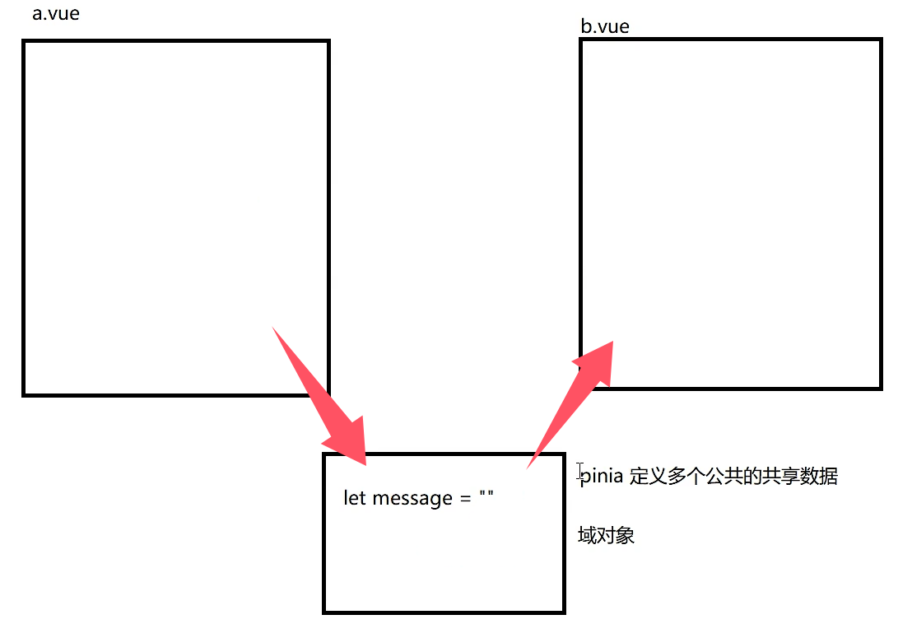​

Pinia数据无法进行持久化

Pinia结合sessionStorage和localStorage实现持久化

> 当我们有**多个组件共享一个共同的状态(数据源)** 时，多个视图可能都依赖于同一份状态。来自不同视图的交互也可能需要更改同一份状态。虽然我们的手动状态管理解决方案（props,组件间通信,模块化）在简单的场景中已经足够了，但是在大规模的生产应用中还有很多其他事项需要考虑：

* 更强的团队协作约定
* 与 Vue DevTools 集成，包括时间轴、组件内部审查和时间旅行调试
* 模块热更新 (HMR)
* 服务端渲染支持

[Pinia](https://pinia.vuejs.org/zh/ "Pinia") 就是一个实现了上述需求的状态管理库

## 基本用法

> 1 准备vite项目

```javascript
npm create vite
npm install 
npm install vue-router@4 --save
```

> 2 安装pinia

```javascript
npm install pinia
```

> 3 定义pinia store对象 src/store/store.js [推荐这么命名不是强制]

```javascript
// 定义共享的Pinia数据
import { defineStore } from "pinia";

// 定义数据并且对外暴露
// store就是定义共享状态的包装对象
// 内部包含四个属性： id 唯一标识 state 完整类型推理，推荐使用箭头函数 存放的数据 getters 类似属性计算，存储放对数据
// 操作的方法  actions 存储数据的复杂业务逻辑方法
// 理解： store类似Java中的实体类， id就是类名， state 就是装数据值的属性  getters就是get方法，actions就是对数据操作的其他方法
export const definedPerson = defineStore({
    id: "personPinia", // 当前数据的id，必须全局唯一
    state: () => {
        // 状态，其实就是响应式数据
        return {
            username: "Exusiai",
            age: 18,
            hobbies: ["Eat", "Sleep", "Work"],
        };
    },
    getters: {
        // 专门定义一个获得数据或者是使用数据计算结果的一些函数，getters中的方法可以当做属性值方式使用
        // 这里的函数只能使用数据，不能修改数据（数据对象为state）
        getAge() {
            return this.age;
        },
        getFavorate() {
            return this.favorate;
        },
    },
    actions: {
        // 专门定义一些修改数据的函数
        doubleAge() {
            this.age = this.age * 2;
        },
    },
});
```

> 4 在main.js配置pinia组件到vue中

```javascript
import { createApp } from "vue";
import router from "./routers/router.js";
import App from "./App.vue";

// 开启全局的Pinia功能
import { createPinia } from "pinia";
let pinia = createPinia();

let app = createApp(App);
app.use(router);
// 使用Pinia数据
app.use(pinia);
app.mount("#app");
```

> 5 Operate.vue 中操作Pinia数据

```html
<script setup>
// 导入Pinia定义的数据
// 导入自己写的数据
import { definedPerson } from "../store/store.js";
let person = definedPerson(); // JS中函数也是一个对象
</script>

<template>
    <div>
        <h1>修改Pinia数据</h1>
        <span>名字：</span>
        <input type="text" v-model="person.username" /> <br />
        <span>年龄：</span>
        <input type="text" v-model="person.age" /> <br />
        <span>{{ person.getAge }}</span> <br />
        <span>爱好：</span>
        <span>Eat</span>
        <input type="checkbox" value="Eat" v-model="person.hobbies" />
        <span>Sleep</span>
        <input type="checkbox" value="Sleep" v-model="person.hobbies" />
        <span>Work</span>
        <input type="checkbox" value="Work" v-model="person.hobbies" />
        <span>Drink</span>
        <input type="checkbox" value="Drink" v-model="person.hobbies" /> <br />
        <button @click="person.doubleAge()">年龄加倍</button>
        <!-- 恢复默认值 -->
        <button @click="person.$reset()">重置</button>
        <!-- 一次性修改多个属性值 -->
        <button
            @click="
                person.$patch({
                    username: 'Skadi',
                    age: 32,
                    hobbies: ['Swim', 'Run'],
                })
            "
        >
            Switch
        </button>
        <hr />
        <span>person: {{ person }}</span>
    </div>
</template>

<style scoped></style>
```

> 6 List.vue中展示Pinia数据

```html
<script setup>
import { definedPerson } from "../store/store.js";
let person = definedPerson();
</script>

<template>
    <div>
        <h1>展示Pinia数据</h1>
        读取姓名:{{ person.username }} <br />
        读取年龄:{{ person.age }} <br />
        通过get年龄:{{ person.getAge }} <br />
        爱好数量:{{ person.getHobbiesCount }} <br />
        所有的爱好:
        <ul>
            <li
                v-for="(hobby, index) in person.hobbies"
                :key="index"
                v-text="hobby"
            ></li>
        </ul>
    </div>
</template>

<style scoped></style>
```

> 7 定义组件路由router.js

```javascript
// 导入路由创建的相关方法
import { createRouter, createWebHashHistory } from "vue-router";

// 导入vue组件
import List from "../components/List.vue";
import Operate from "../components/Operate.vue";
// 创建路由对象,声明路由规则
const router = createRouter({
    history: createWebHashHistory(),
    routes: [
        {
            path: "/opearte",
            component: Operate,
        },

        {
            path: "/list",
            component: List,
        },
    ],
});

// 对外暴露路由对象
export default router;
```

> 8 App.vue中通过路由切换组件

```html
<script setup></script>

<template>
    <div>
        <router-link to="/operate">operate</router-link>
        <br />
        <router-link to="/list">list</router-link>
        <hr />
        <router-view></router-view>
    </div>
</template>

<style scoped></style>
```

> 9 启动测试

```javascript
npm run dev
```

## 其它细节

### State

**State** (状态) 在大多数情况下，都是store的核心。人们通常会先定义能代表他们 APP 的 state。在 Pinia 中，state 被定义为一个返回初始状态的函数。

> store.js

```javascript
import {defineStore} from 'pinia'

export const definedPerson = defineStore('personPinia',
    {
        state:()=>{
            return {
                username:'',
                age:0,
                hobbies:['唱歌','跳舞']
            }
        },
        getters:{
            getHobbiesCount(){
                return this.hobbies.length
            },
            getAge(){
                return this.age
            }
        },
        actions:{
            doubleAge(){
                this.age=this.age*2
            }
        }
    }
)
```

> Operate.vue

```javascript
<script setup type="module">
import { ref } from "vue";
import { definedPerson } from "../store/store";
// 读取存储的数据
let person = definedPerson();

let hobby = ref("");
let addHobby = () => {
    console.log(hobby.value);
    person.hobbies.push(hobby.value);
};
// 监听状态
person.$subscribe((mutation, state) => {
    console.log("---subscribe---");
    /* 
        mutation.storeId
            person.$id一样
        mutation.payload
            传递给 cartStore.$patch() 的补丁对象。
        state 数据状态,其实是一个代理
        */
    console.log(mutation);
    console.log(mutation.type);
    console.log(mutation.payload);
    console.log(mutation.storeId);
    console.log(person.$id);
    // 数据 其实是一个代理对象
    console.log(state);
});
</script>

<template>
    <div>
        <h1>operate视图,用户操作Pinia中的数据</h1>
        请输入姓名:<input type="text" v-model="person.username" /> <br />
        请输入年龄:<input type="text" v-model="person.age" /> <br />
        请增加爱好:
        <input type="checkbox" value="吃饭" v-model="person.hobbies" /> 吃饭
        <input type="checkbox" value="睡觉" v-model="person.hobbies" /> 睡觉
        <input type="checkbox" value="打豆豆" v-model="person.hobbies" /> 打豆豆
        <br />
        <input type="text" @change="addHobby" v-model="hobby" /> <br />
        <!-- 事件中调用person的doubleAge()方法 -->
        <button @click="person.doubleAge()">年龄加倍</button> <br />
        <!-- 事件中调用pinia提供的$reset()方法恢复数据的默认值 -->
        <button @click="person.$reset()">恢复默认值</button> <br />
        <!-- 事件中调用$patch方法一次性修改多个属性值 -->
        <button
            @click="
                person.$patch({
                    username: '奥特曼',
                    age: 100,
                    hobbies: ['晒太阳', '打怪兽'],
                })
            "
        >
            变身奥特曼
        </button>
        <br />
        person:{{ person }}
    </div>
</template>
<style scoped></style>

```

### Getter

Getter 完全等同于 store 的 state 的[计算值](https://cn.vuejs.org/guide/essentials/computed.html "计算值")。可以通过 `defineStore()`​ 中的 `getters`​ 属性来定义它们。推荐使用箭头函数，并且它将接收 `state`​ 作为第一个参数：

```javascript
export const useStore = defineStore('main', {
  state: () => ({
    count: 0,
  }),
  getters: {
    doubleCount: (state) => state.count * 2,
  },
})
```

### Action

Action 相当于组件中的 [method](https://v3.vuejs.org/guide/data-methods.html#methods "method")。它们可以通过 `defineStore()`​ 中的 `actions`​ 属性来定义，并且它们也是定义业务逻辑的完美选择。类似 [getter](https://pinia.vuejs.org/zh/core-concepts/getters.html "getter")，action 也可通过 `this`​ 访问整个 store 实例，并支持完整的类型标注(以及自动补全)。不同的是，`action`​ 可以是异步的，你可以在它们里面 `await`​ 调用任何 API，以及其他 action！

```javascript
export const useCounterStore = defineStore('main', {
  state: () => ({
    count: 0,
  }),
  actions: {
    increment() {
      this.count++
    },
    randomizeCounter() {
      this.count = Math.round(100 * Math.random())
    },
  },
})
```

# Element-plus组件库

## Element-plus介绍

> Element Plus 是一套基于 Vue 3 的开源 UI 组件库，是由饿了么前端团队开发的升级版本 Element UI。Element Plus 提供了丰富的 UI 组件、易于使用的 API 接口和灵活的主题定制功能，可以帮助开发者快速构建高质量的 Web 应用程序。

* Element Plus 支持按需加载，且不依赖于任何第三方 CSS 库，它可以轻松地集成到任何 Vue.js 项目中。Element Plus 的文档十分清晰，提供了各种组件的使用方法和示例代码，方便开发者快速上手。
* Element Plus 目前已经推出了大量的常用 UI 组件，如按钮、表单、表格、对话框、选项卡等，此外还提供了一些高级组件，如日期选择器、时间选择器、级联选择器、滑块、颜色选择器等。这些组件具有一致的设计和可靠的代码质量，可以为开发者提供稳定的使用体验。
* 与 Element UI 相比，Element Plus 采用了现代化的技术架构和更加先进的设计理念，同时具备更好的性能和更好的兼容性。Element Plus 的更新迭代也更加频繁，可以为开发者提供更好的使用体验和更多的功能特性。
* Element Plus 可以在支持 [ES2018](https://caniuse.com/?feats=mdn-javascript_builtins_regexp_dotall,mdn-javascript_builtins_regexp_lookbehind_assertion,mdn-javascript_builtins_regexp_named_capture_groups,mdn-javascript_builtins_regexp_property_escapes,mdn-javascript_builtins_symbol_asynciterator,mdn-javascript_functions_method_definitions_async_generator_methods,mdn-javascript_grammar_template_literals_template_literal_revision,mdn-javascript_operators_destructuring_rest_in_objects,mdn-javascript_operators_spread_spread_in_destructuring,promise-finally "ES2018") 和 [ResizeObserver](https://caniuse.com/resizeobserver "ResizeObserver") 的浏览器上运行。 如果您确实需要支持旧版本的浏览器，请自行添加 [Babel](https://babeljs.io/ "Babel") 和相应的 Polyfill
* 官网[https://element-plus.gitee.io/zh-CN/](https://element-plus.gitee.io/zh-CN/)
* 由于 Vue 3 不再支持 IE11，Element Plus 也不再支持 IE 浏览器。

​​

## Element-plus入门案例

> 1 准备vite项目

注意要使用TypeScript

```shell
npm create vite  // 注意选择 vue+typeScript
npm install 
npm install vue-router@4 --save
npm install pinia
npm install axios
```

> 2 安装element-plus

```shell
npm install element-plus
```

> 3 完整引入element-plus

* main.js

```javascript
import { createApp } from 'vue'
//导入element-plus相关内容
import ElementPlus from 'element-plus'
import 'element-plus/dist/index.css'

import App from './App.vue'

const app = createApp(App)

app.use(ElementPlus)
app.mount('#app')
```

> 4 入门案例

* App.vue

```html
<script setup>
  import { ref } from 'vue'

  const value = ref(true)
</script>

<template>
  <div>
    <!-- 直接使用element-plus组件即可 -->
    <el-button>按钮</el-button>
    <br>
    <el-switch
      v-model="value"
      size="large"
      active-text="Open"
      inactive-text="Close"
    />
    <br />
    <el-switch v-model="value" active-text="Open" inactive-text="Close" />
    <br />
    <el-switch
      v-model="value"
      size="small"
      active-text="Open"
      inactive-text="Close"
    />
  </div>
</template>

<style scoped>

</style>

```

> 5 启动测试

```shell
npm run dev
```

## Element-plus常用组件

[Element Plus](https://element-plus.org/zh-CN/)
