# Algorithms

# Developing a usable algorithm

**Mathematical analysis.**

1. Model the problem.
2. Find an algorithm to solve it.
3. Fast enough? Fits in memory?
4. If not, figure out why.
5. Find a way to address the problem.
6. Iterate until satisfied.

# Union-find

并查集

## Dynamic connectivity

### Question

​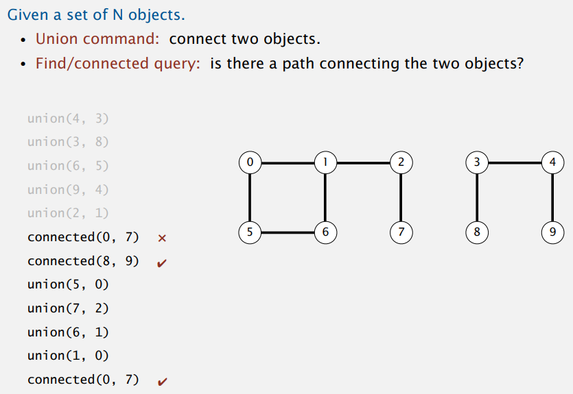​

### Modeling the connections

* Reflexive: *p* is connected to *q*.
* Sysmmetric: if *p* is connected to *q*, then *q* is connected to *p*.
* Transitive: if *p* is connected to *q* and *q* is connected to *r*, then *p* is connected to *r.*

**Conncected components**: Maximal set of objects that are mutually connected.

​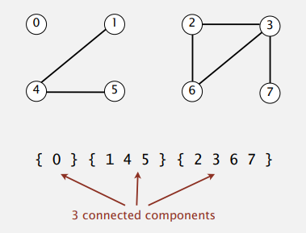​

### Implementint the operations

**Find query**: Check if two objects are in the same component.

**Union command**: Replace components containing two objects with their union.

​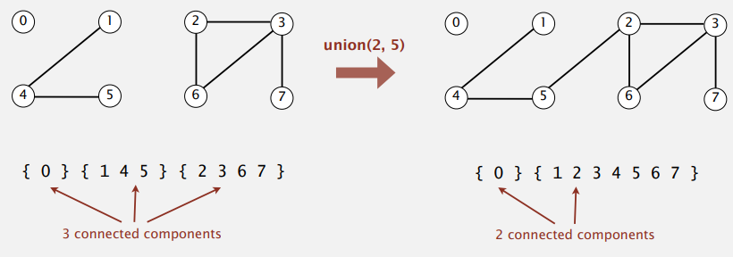​

### Data type (API)

**Caution:**

* Number of objects *N* can be huge.
* Number of operations *M* can be huge.
* Find queries and union commands may be intermixed.

```JAVA
import edu.princeton.cs.algs4.StdIn;
import edu.princeton.cs.algs4.StdOut;

public abstract class UF {
    int N;

    public UF() {
    }

    /*
     * Initialize union-find data structure with N objects
     * 0 to N - 1
     * */
    public UF(int N) {
        this.N = N;
    }

    /*
     * Add connection between p and q
     * */
    public abstract void union(int p, int q);

    /*
     * Check whether p and q are in the same component
     * */
    public abstract boolean connected(int p, int q);
}
```

### Main part

```JAVA
public static void main(String[] args) {
    int N = StdIn.readInt();  //Read the number of objects
    UF uf = new UF(N);  //Initialize the Union-find data type
    while (!StdIn.isEmpty()) {  //Read in a pair of object
        int p = StdIn.readInt();
        int q = StdIn.readInt();
        if (!uf.connected(p, q)) {  //Check whether they are connected
            uf.union(p, q);  //If they are not connected, then union them.
            StdOut.println(p + " " + q);  //Output
        }
    }
}
```

## Quick find (Eager algorithm)

### Data structure

* Integer array *id[]*  of length *N.*
* *p* and *q* are connected iff (if and only if) they have the **same id**.

​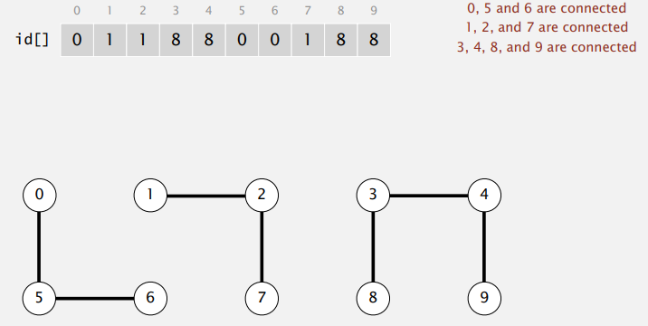​

### Find

Check if *p* and *q* **have the same id.**

### Union

To merge components containing *p* and *q*, change all entrie **whose id == id[p] to id[q]**

​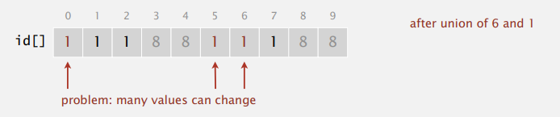​

### Implement

```JAVA
public class QuickFindUF extends UF {
    private int[] id;

    /*
    * Set id of each object to itself
    * */
    public QuickFindUF(int N) {
        super(N);
        id = new int[N];
        for (int i = 0; i < N; i++) {
            id[i] = i;
        }
    }

    /*
    * Change all entries with id[p] to id[q]
    * */
    @Override
    public void union(int p, int q) {
        int pid = id[p];  //There should store the id[p], otherwise it will be change below and cause insidious bug!
        int qid = id[q];
        for (int i = 0; i < N; i++) {
            if (pid == id[i]) {
                id[i] = qid;
            }
        }
    }

    /*
    * Check whether p and q are in the same component
    * */
    @Override
    public boolean connected(int p, int q) {
        return id[p] == id[q];
    }
}
```

### Cost model

Number of array accesses:

​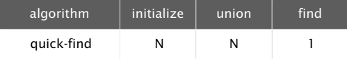​

The whole cost: **N**​<sup>**2**</sup>  (*N* union commands on *N* objects)

It is too slow!

## Quick union (Lazy algorithm)

### Data stucture

* Integer array id[] of length *N*.
* *id[i]*  is parent of *i*​.
* **Root** of *i* is *id[id[...[i]...]]*  (Keep going until it doesn't change)

​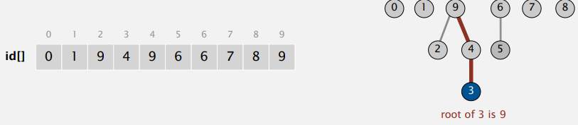​

### Find

Check if *p* and *q* have the **same root**.

### Union

To merge components containing *p* and *q*, set the id of ***p***​ **'s root** to the id of ***q***​ **'s root**.

​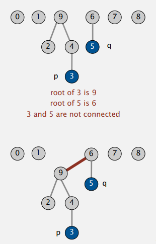​

only one value changes

### Implement

```JAVA
public class QuickUnionUF extends UF{
    private int[] id;

    /*
    * Set id of each object to itself
    * */
    public QuickUnionUF(int N) {
        super(N);
        id = new int[N];
        for (int i = 0; i < N; i++) {
            id[i] = i;
        }
    }

    /*
    * Chase parent pointers until reach root
    * */
    private int root(int i) {
        while (i != id[i]) {
            i = id[i];
        }
        return i;
    }

    /*
    * Change root of p to point to root of q
    * */
    @Override
    public void union(int p, int q) {
        int rootp = root(p);
        int rootq = root(q);
        id[rootp] = rootq;
    }

    /*
    * Check if p and q have the same root
    * */
    @Override
    public boolean connected(int p, int q) {
        return root(p) == root(q);
    }
}
```

### Cost model

​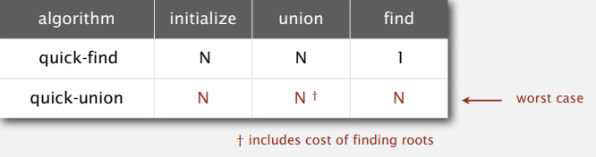​

Quick-find:

* Union too expensive.
* Trees are flat, byt too expensive to keep them flat.

Quick-union:

* Trees can get tall.
* Find too expensive (N)

## Improvements

### Weghting

1. Modify quick-union to **avoid tall trees**.
2. Keep track of **size(or height) of each tree**.
3. Balance by linking root of smaller tree to root of larger tree.

​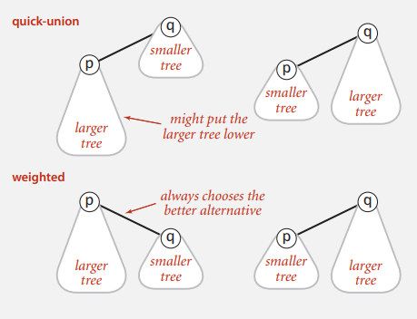​

​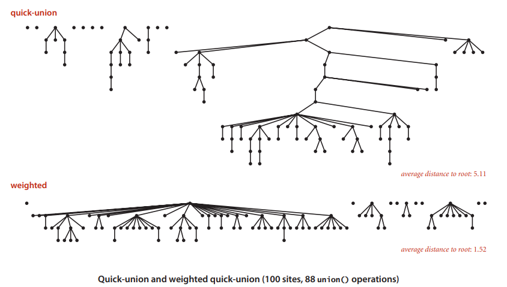​

#### Data structure

Extra array *sz[i]*  to count number of objects in the tree rooted at *i.*

#### Find

Identical to quick-union

#### Union

Modify quick-union to:

1. Link root of smaller tree to root of larger tree.
2. Update the sz[] array.

#### Implement

```JAVA
public class WeightedQuickUnionUF extends QuickUnionUF{
    private int[] sz;
    public WeightedQuickUnionUF(int N) {
        super(N);
        sz = new int[N];
        for (int i = 0; i < N; i++) {
            sz[i] = 1;
        }
    }

    /*
     * Change root of p to point to root of q
     * */
    @Override
    public void union(int p, int q) {
        int rootp = root(p);
        int rootq = root(q);
        if (rootp == rootq) return;
        if (sz[rootp] < sz[rootq]) {  //Link root of smaller rank tree to root of larger rank tree
            id[rootp] = rootq;
            sz[rootq] += sz[rootp];
        } else {
            id[rootq] = rootp;
            sz[rootp] += sz[rootq];
        }
    }
}
```

#### Cost model

​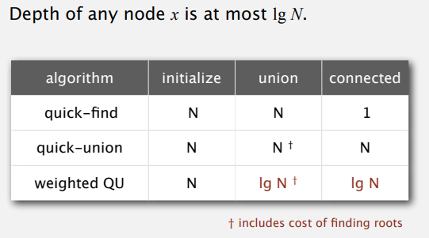​

​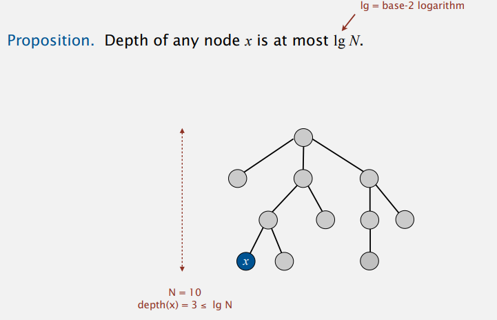​

##### Proof

​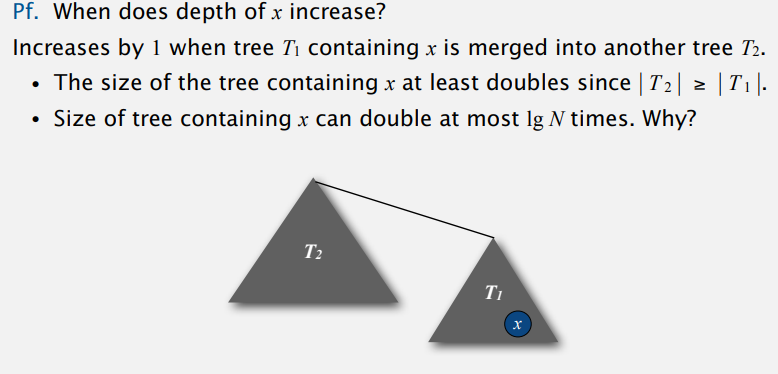​

The depth of x only increases 1 once.

The total number of the sites is N, so the size of tree can **double log**​<sub>**2**</sub>​**N times at most**.

Tip: The **lg** here means **log**​<sub>**2**</sub>

### Path compression

After computing the root of *p,*  set the id of each examined ndoe to point to its root.

​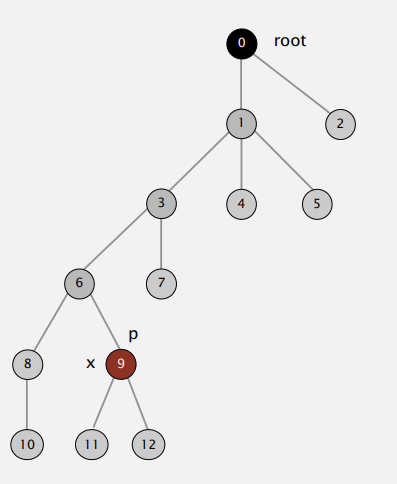​

​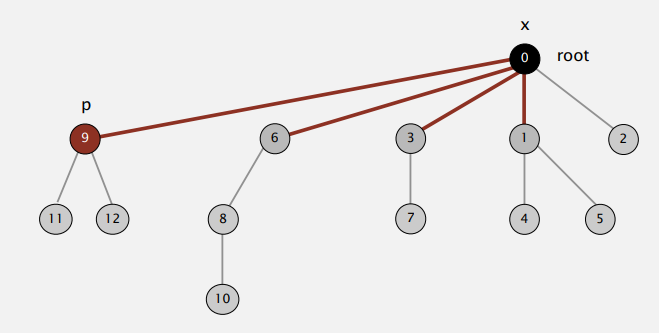​

It can keep tree completelt flat.

#### Implement

```JAVA
private int root(int i) {
    while (i != id[i]) {
        id[i] = id[id[i]];  //Make every other node in path point to its grandparent
        i = id[i];
    }
    return i;
}
```

#### Cost model

​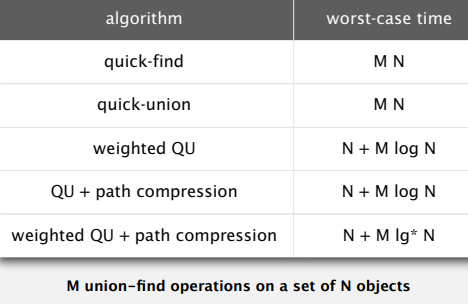​

### Summary

No linear-time algorithm for union-find.

# Analysis of Algorithm

Use scientific method to understand performance.

1. **Observe** some feature of the natural world.
2. **Hypothesize** a model that is consistent with the observations.
3. **Predict** events using the hypothesis.
4. **Verify** the predictions by making further observations.
5. **Validate** by repeating until the hypothesis and observations agree.

## Example: 3-Sum

​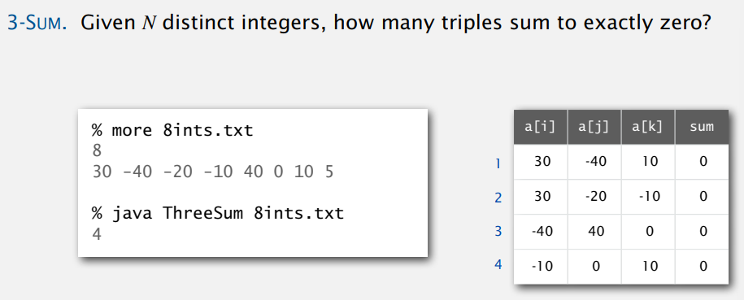​

### Brute-force

```Java
public class ThreeSumBruteForce {
    public static int count(int[] a) {
        int N = a.length;
        int count = 0;

        for (int i = 0; i < N; i++) {
            for (int j = i + 1; j < N; j++) {
                for (int k = j + 1; k < N; k++) {
                    if (a[i] + a[j] + a[k] == 0) {
                        count++;
                    }
                }
            }
        }
        return count;
    }
}
```

## Measuring the running time

Using the class **Stopwatch** from **stdlib.jar**

1. Run the program for various input sizes and measure running time.

    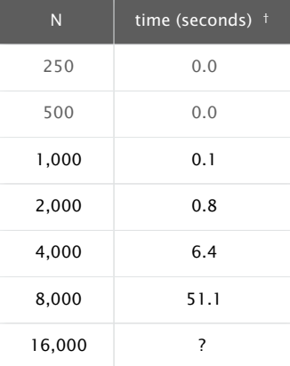​
2. Plot running time T(N) vs. input size N.

    ​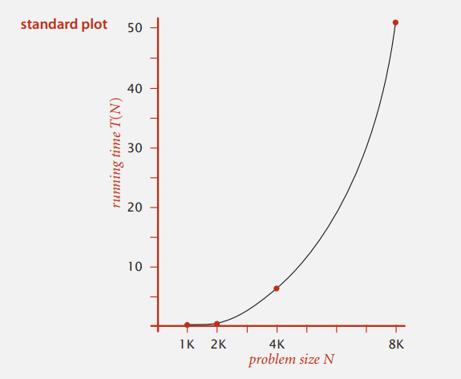​
3. Plot running time T(N) vs. input size N using **log-log scale**.

    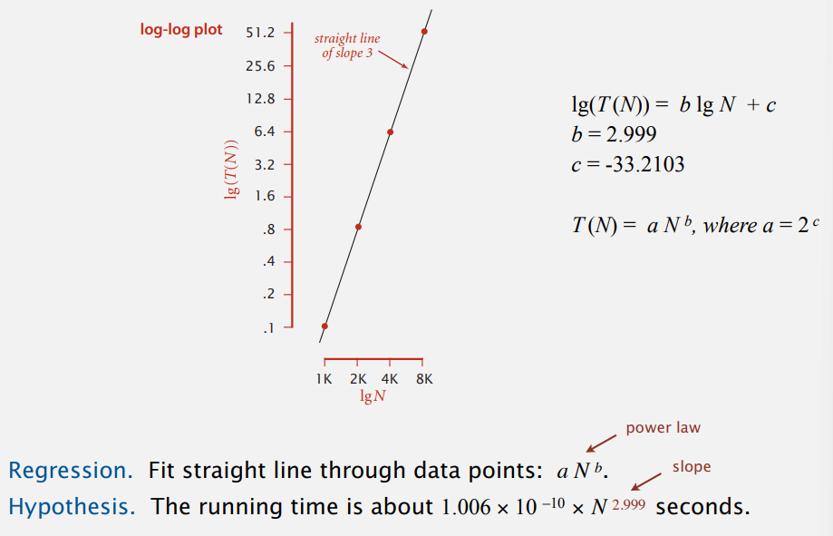​
4. Hypothesis: The running time is about ... * N seconds.

    Predict and observe.

    ​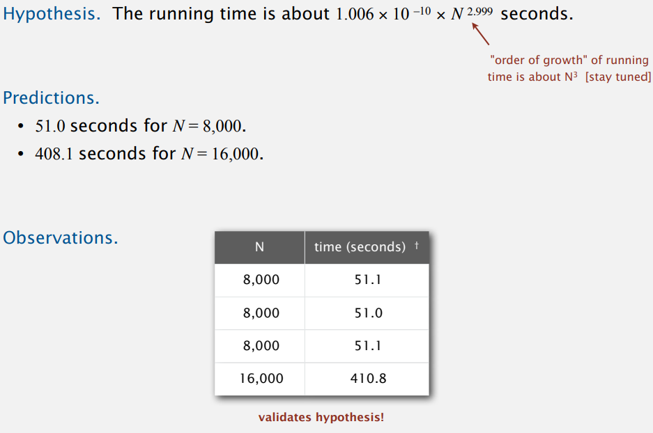​
5. Estimate *b* and *a.*

    ​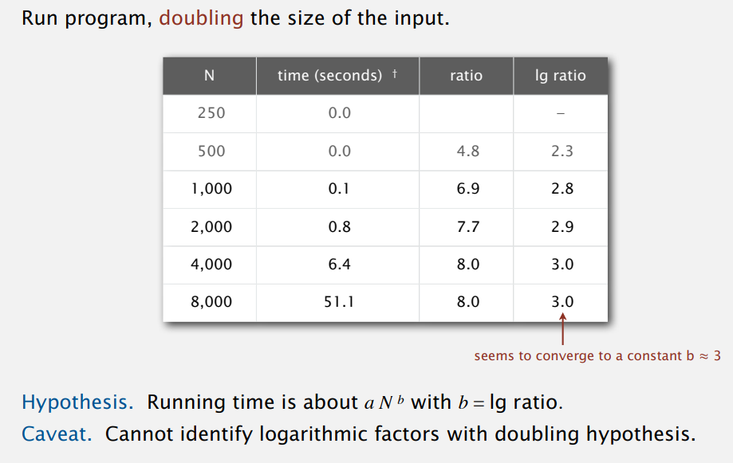​

    ​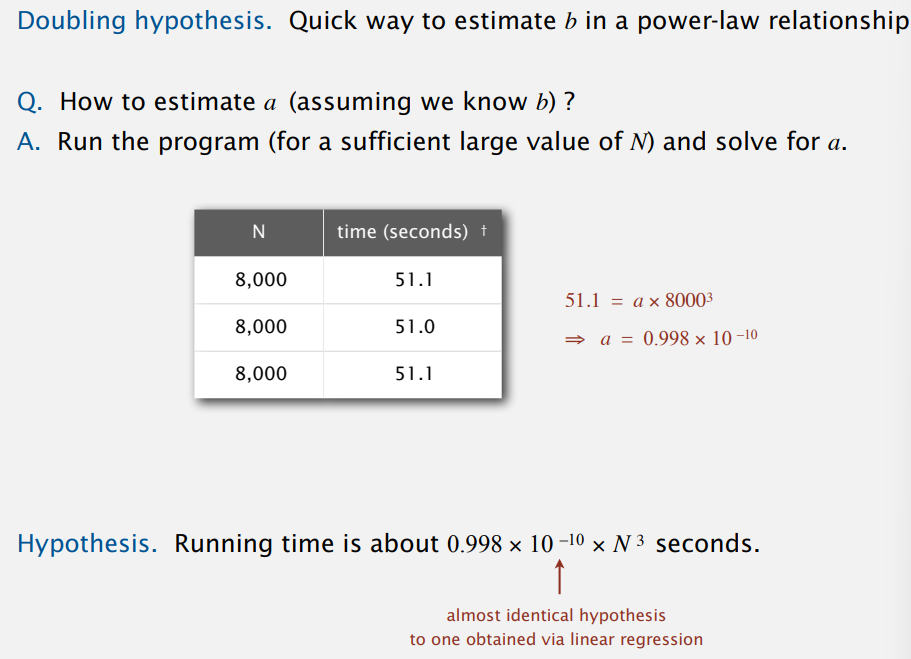​

### What effects

​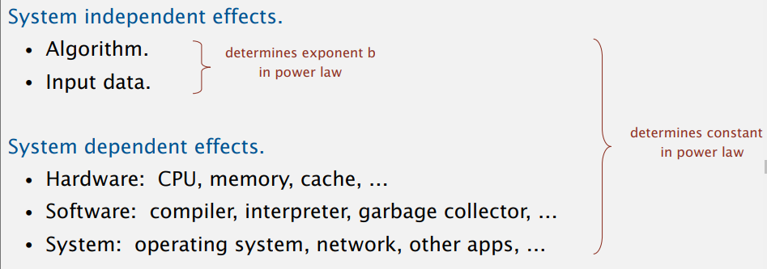​

## Mathematical models

### Total running time

**Total running time**: sum of cost * frequency for all operations.

1. Cost: depends on machine, compiler.
2. Frequency: depends on algorithm, input data.
3. Operations: depends on program.

### Cost of basic operations

​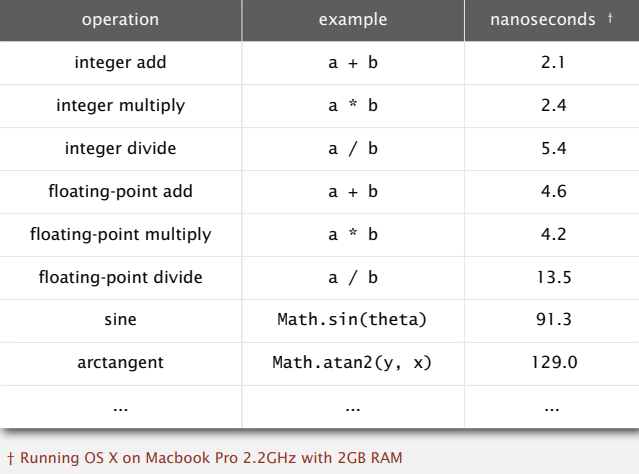​

​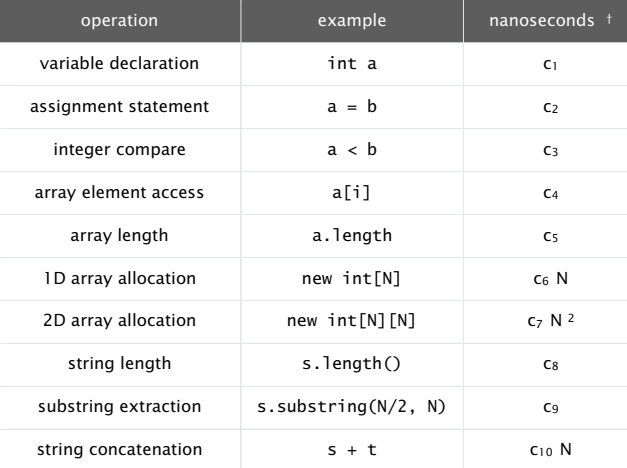​

Novice mistake: abusive string concatenation.

### Example: 1-Sum

​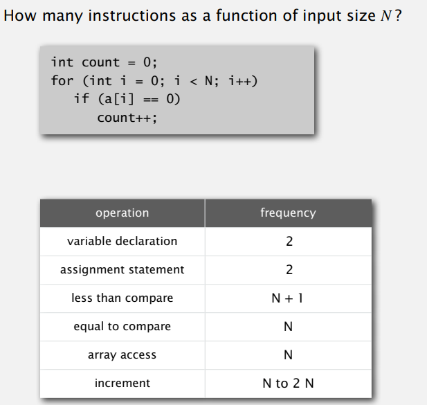​

Increment: *i* will increase N times and *count* will increase between 0 and N.

### Example: 2-Sum

​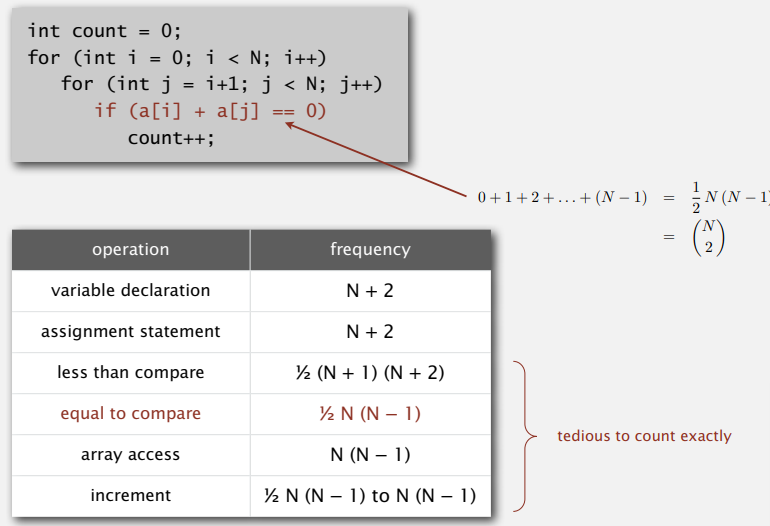​

### Simplify the calculations

1. Use some basic operation as a proxy(cost model) for running time.
2. Use tilde notation to simplify counts.

#### Cost model

​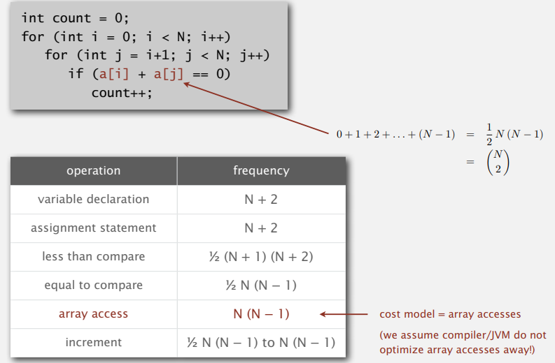​

#### tilde notation

Ignore lower-order terms.

​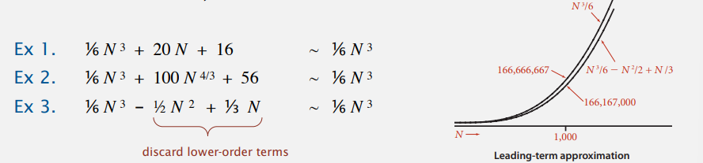​

​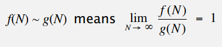​

So the table becomes:

​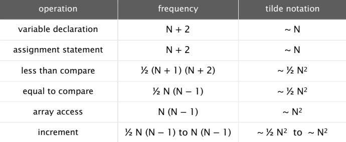​

### Example: 3-Sum

​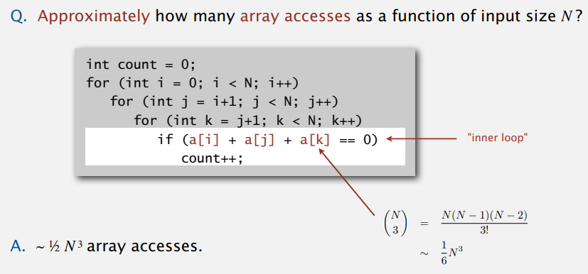​

### Estimate a discrete sum

​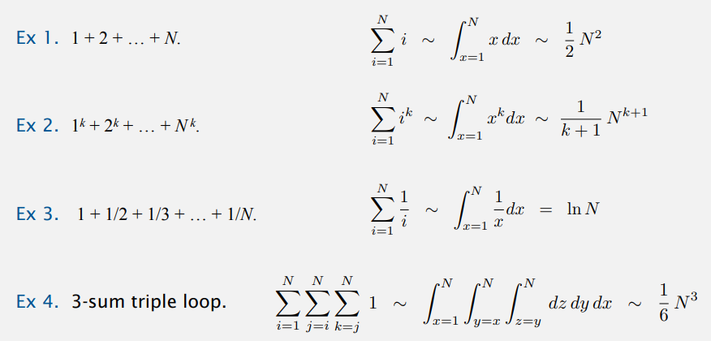​

In principle: accurate mathematical models are available.

In practice:

* Formulas can be complicated.
* Advanced mathematics might be required.
* Exact models best left for experts.

### Mathematical models

​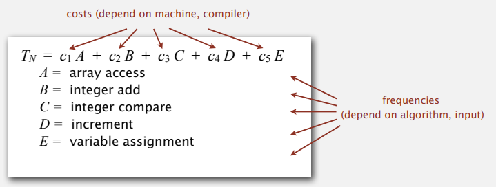​

## Order-of-growth classifications

### Common order-of-growth classifications

​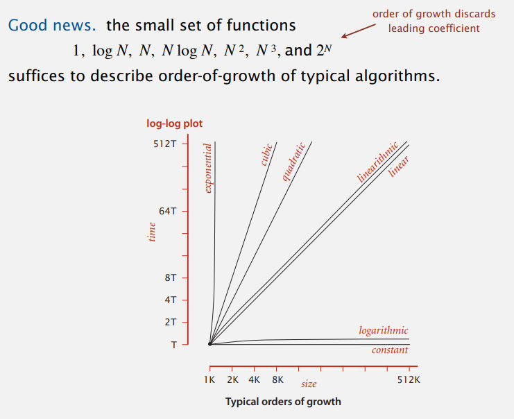​

​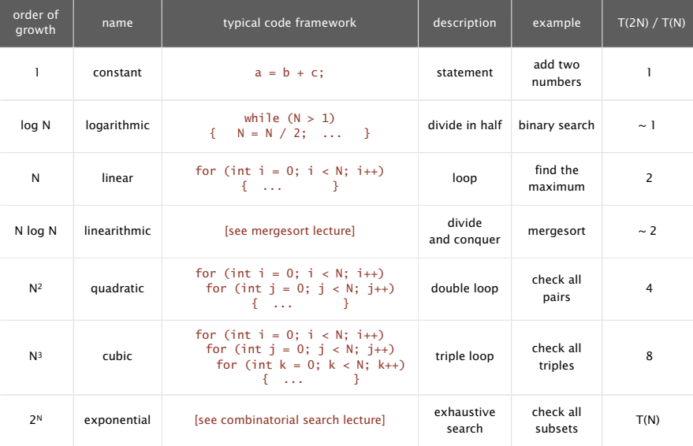​

### Example: Binary search

```Java
public static int binarySearch(int[] a, int key) {
    int lo = 0, hi = a.length - 1;
    while (lo <= hi) {
        int mid = lo + (hi - lo) / 2;
        if (key < a[mid]) hi = mid - 1;
        else if (key > a[mid]) lo = mid + 1;
        else return mid;
    }
    return -1;
}
```

If key appears in the array *a[]* . then *a[lo]*  <= key <= *a[hi].*

#### Mathematical analysis

​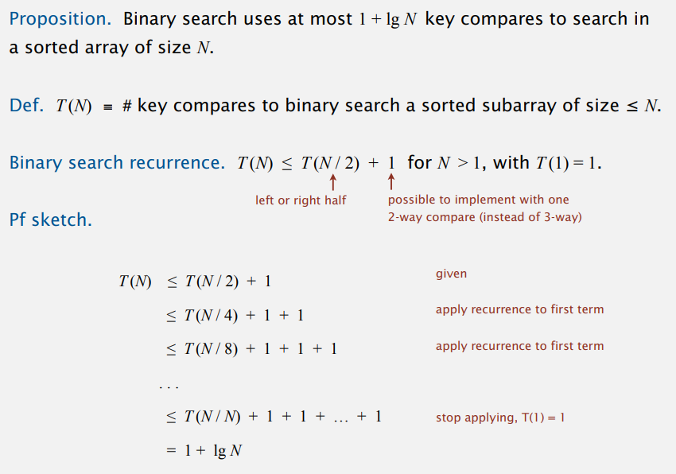​

### N<sup>2</sup>logN for 3-Sum

1. Sort the *N* numbers.
2. For each pair of numbers *a[i]*  and *a[j]* , binary search for -(*a[i]*  + *a[j]* ).

​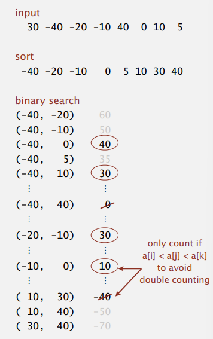​

* N<sup>2</sup> with insertion sort (or NlogN with merge sort and quick sort).
* N<sup>2</sup> logN with binary search.

## Theory of algorithms

### Types of analyses

1. **Best case**

    1. Lower bound on cost.
    2. Determined by "easiest" input.
    3. Provides a goal for all inputs.
2. **Worst case**

    1. Upper bound on cost.
    2. Determined by "most difficult" input.
    3. Provides a guarantee for all inputs.
3. **Average case**​

    1. Expected cost for random input.
    2. Need a model for "random" input.
    3. Provides a way to predict performance.

​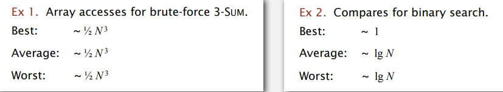​

### Commonly-used notations

​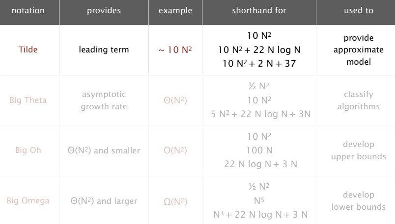​

Tips: Do not interpret big-Oh as an approximate model.

big-Oh notation provides only an *upper bound* on the growth rate of a function as 𝑛 gets large.

If the big-Oh equals to the big-Omega, then big-theta equals to them.

### Theory of algorithms

**Goals**:

* Establish "difficulty" of a problem.
* Develop "optimal" algorithms.

**Approach**

* Suppress details in analysis: analyse "to within a constant factor".
* Eliminate variability in input model by focusing on the worst case.

**Optimal algorithm**

* Performance guarantee (to within a constant factor) for any input.
* No algorithm can provide a better performance guarantee.

#### Example: 1-Sum

​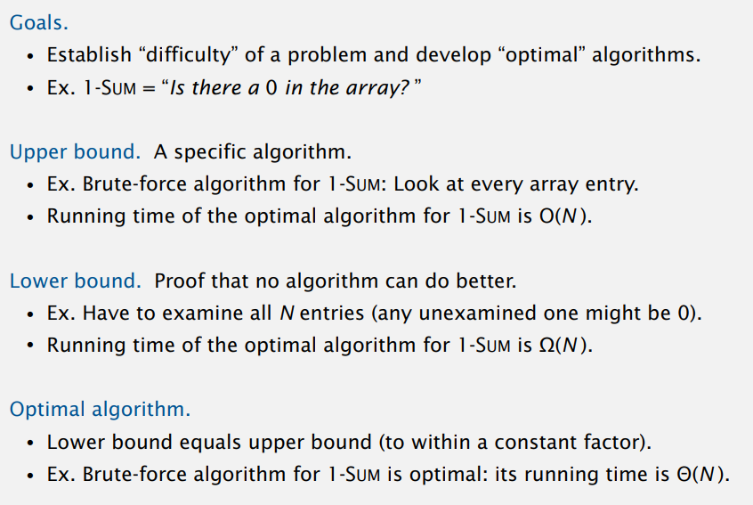​

#### Example: 3-Sum

**Brute-force algorithm**

​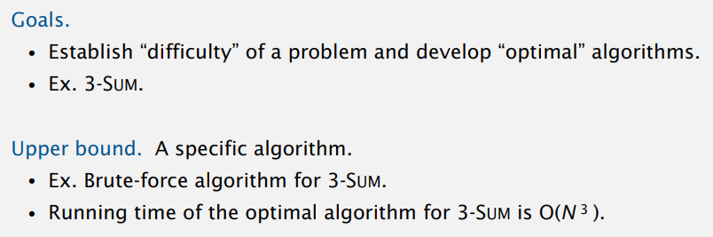​

**Improved algorithm**

​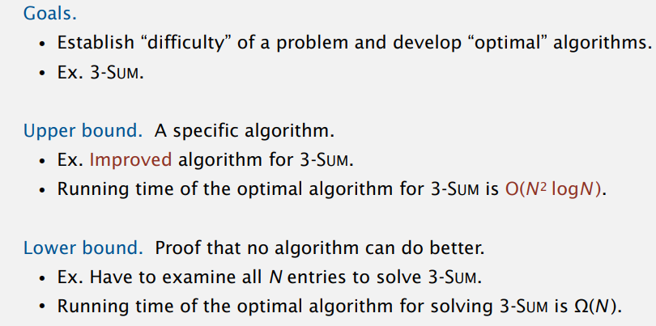​

### Design an algorithm

1. Develop an algorithm.
2. Prove a lower bound.
3. If there is a gap:

    1. Lower the upper bound (discover a new algorithm).
    2. Raise the lower bound (more difficult).

## Memory

​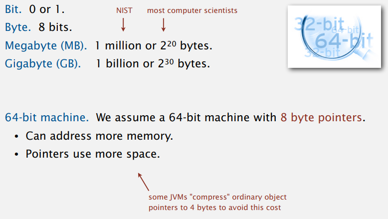​

### Typical memory usage

​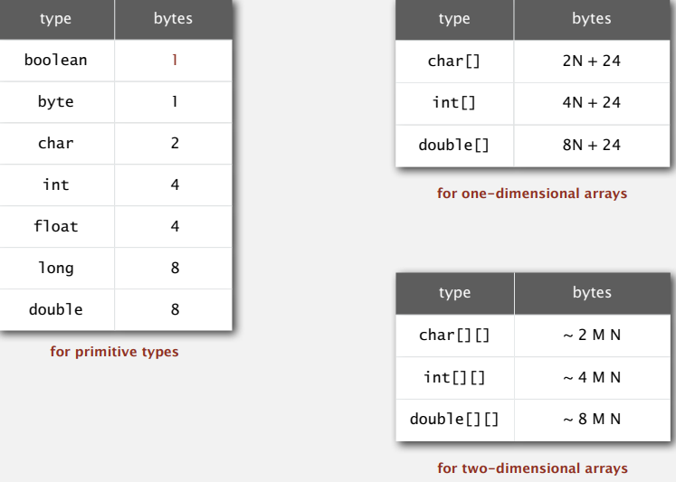​

​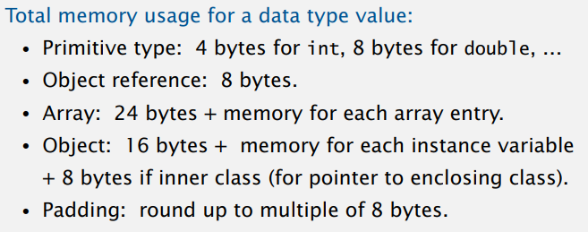​

**Shallow memory usage:**  Don't count referenced objects.

**Deep memory usage:**  If array entry or instance variable is a reference, add memory for referenced object.

#### Objects in Java

* **Object overhead:**  16 bytes.
* **Reference:**  8 bytes.
* **Padding:**  Each object rounds up to multiple of 8 bytes.

#### Examples

​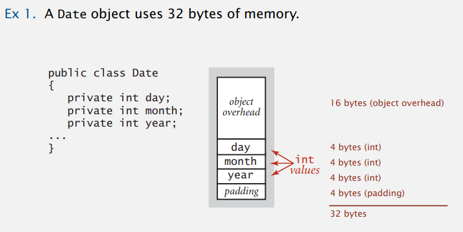​

​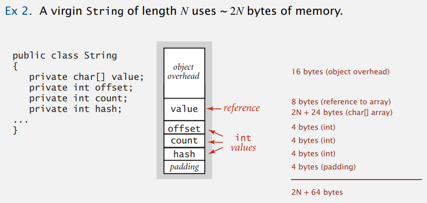​

​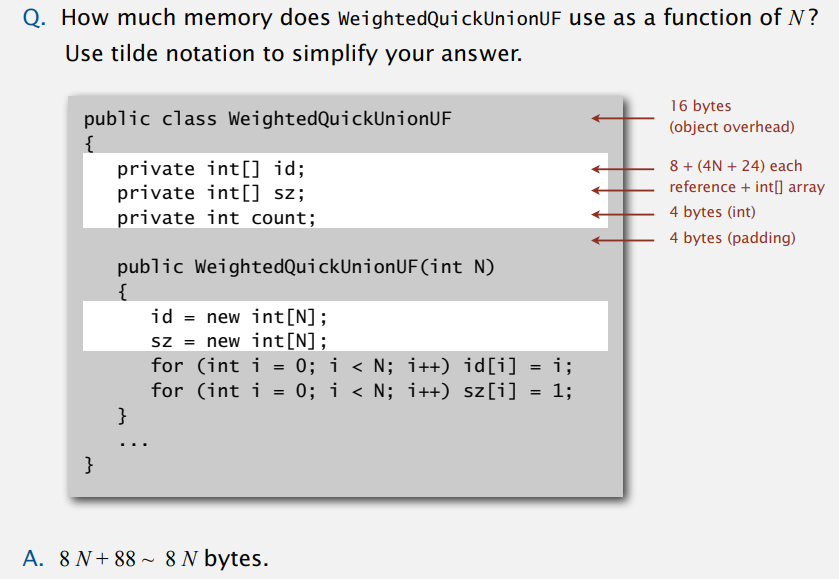​

A pointer needs 8 bytes.

# Bags, Queues, Stacks

**Fundamental data types:**

1. Value: colleaction of objects.
2. Operations: 

    * insert
    * remove
    * iterate
    * test if empty

## Modular program

**Completely separate interface and implemantation**

* Client: program using operations defined in interface.
* Implementation: actual code implementing operations.
* Interface: description of data type, basic operations.

​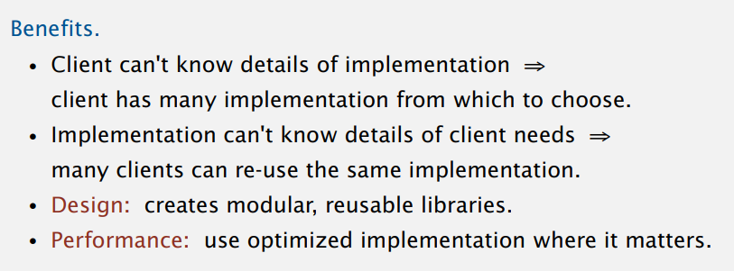​

## Stacks

**FILO:**  First in last out.

### API

​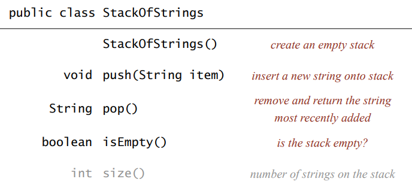​

### Linked-list repersentation

**Maintain pointer to first node in a linked list**

​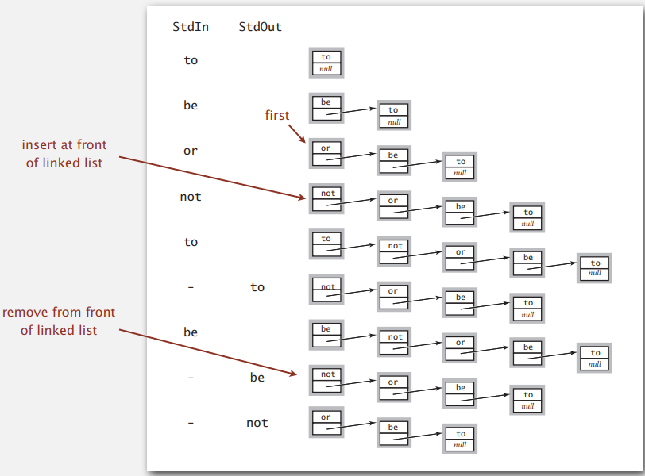​

Insert/remove from front.

> Inner class: node

```Java
private class Node {
    String item;
    Node next;
}
```

> Pop()

Delete the item at beginning of the list.

1. Save the item which will be popped from stack.
2. Advance the pointer and make it point to the next item.
3. Return the item saved.

​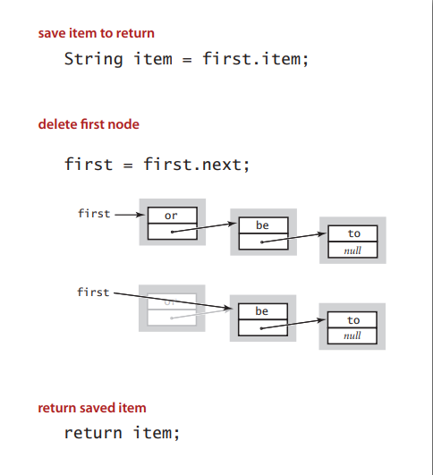​

```Java
public String pop() {
    String item = first.item;
    first = first.next;
    return item;
}
```

> push()

Add an item to the beginning of the list.

1. Create a temp pointer to point to the old *first*.
2. Create a new node for the new *first*.
3. Then make *first* point to *oldFirst* (use the temp pointer).

​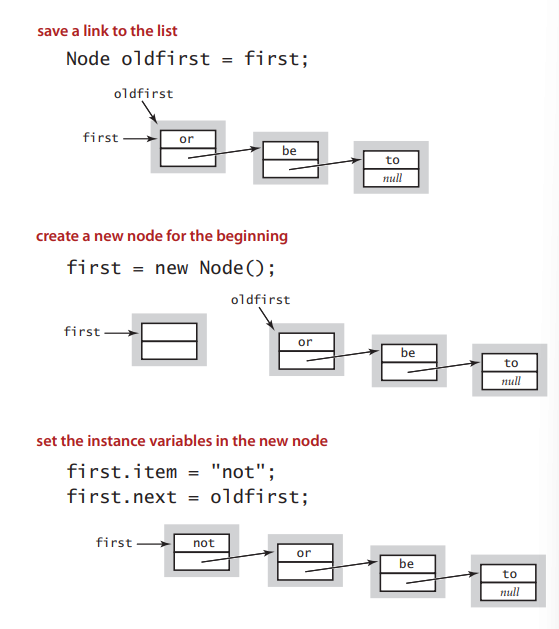​

```Java
public void push(String item) {
    Node oldFirst = first;
    first = new Node(item, oldFirst);
}
```

> isEmpty()

```Java
public boolean isEmpty() {
    return first == null;
}
```

> Whole implementations

```Java
package myImplementation;

public class LinkedStackOfString {
    private Node first;

    private class Node {
        String item;
        Node next;

        public Node() {
        }

        public Node(String item, Node next) {
            this.item = item;
            this.next = next;
        }
    }

    public LinkedStackOfString() {
        first = null;
    }

    public String pop() {
		// When using link-list implemetation, no need to loiter. JVM will do that.
        String item = first.item;
        first = first.next;
        return item;
    }

    public void push(String item) {
        Node oldFirst = first;
        first = new Node(item, oldFirst);
    }

    public boolean isEmpty() {
        return first == null;
    }
}

```

#### Analysis

1. Time: every operation takes constant time in the worst case.
2. Memory: a stack with *N* items uses ~40*N* bytes (not include the memory for strings)

    ​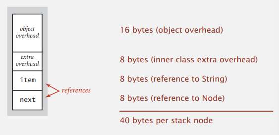​

### Array implementation

* Use array s[] to store *N* items on stack.
* push(): add new item at s[N].
* pop(): remove item from s[N-1].

Tip: Stack overflows when *N* exceeds capacity.

```Java
package myImplementation;

public class FixedCapacityStackOfStrings {
    private String[] s;
    private int N;  // N points at the next position of the array.
    private int capacity;  // The max number of items the array can store.

    public FixedCapacityStackOfStrings() {
        this(10);
    }

    public FixedCapacityStackOfStrings(int capacity) {
        this.capacity = capacity;
        N = 0;
        s = new String[capacity];
    }

    public boolean isEmpty() {
        return N == 0;
    }

    public void push(String item) {
        if (N >= capacity) {
            throw new IndexOutOfBoundsException();
        }
        s[N++] = item;
    }

    /*
    *  Avoids "loitering"
    * */
    public String pop() {
        if (isEmpty()) {
            throw new IndexOutOfBoundsException();
        }
        String item = s[--N];
        s[N] = null;
        return item;
    }
}
```

**Loitering:**  Holding a reference to an object when it is no longer needed.

#### Overflow & underflow

* Overflow: use resizing array for array implementation.
* Underflow: throw exception if pop from an empty stack.

### Resizing arrays implementation

To grow and shrink array.

#### Insert

> Increase size by 1

But it's too expensive.

Need to copy all items to a new array for *N* times, which causes 1 + 2 + ... + N ~ N<sup>2</sup> / 2

So we should ensure the array **resizing happens infrequently.**

> Repeated doubling

If array is full, create a new array of **twice** the size, and copy items.

```Java
package myImplementation;

public class ResizingArrayStackOfString {
    String[] s;
    int N = 0;

    public ResizingArrayStackOfString() {
        s = new String[1];
    }

    public void push(String item) {
        if (N == s.length) {
            resize(2 * s.length);
        }
        s[N++] = item;
    }

    private void resize(int capacity) {
        String[] copy = new String[capacity];
        for (int i = 0; i < N; i++) {
            copy[i] = s[i];
        }
        s = copy;
    }
}

```

​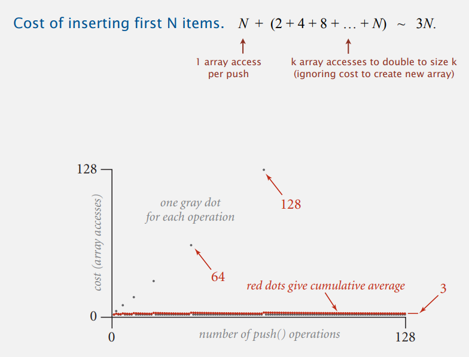​

#### Shrink

> Halve when one-half full

​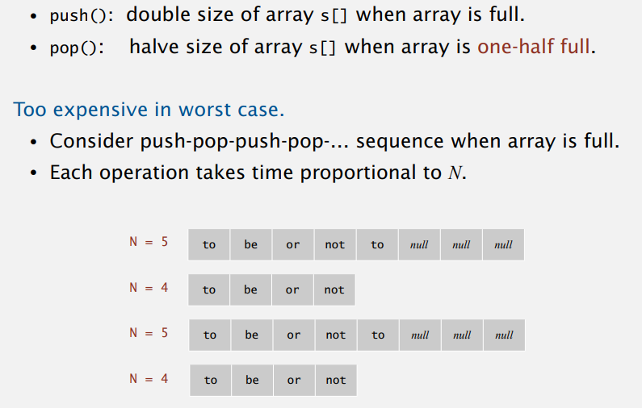​

> Halve when one-quarter full

Ensure that array is between 25% and 100 % full.

```Java
package myImplementation;

public class ResizingArrayStackOfString {
    String[] s;
    int N = 0;

    public ResizingArrayStackOfString() {
        s = new String[1];
    }

    public String pop() {
        String item = s[--N];
        s[N] = null; // loiter
        if (N > 0 && N == s.length / 4) {
            resize(s.length / 2);
        }
        return item;
    }
    private void resize(int capacity) {
        String[] copy = new String[capacity];
        for (int i = 0; i < N; i++) {
            copy[i] = s[i];
        }
        s = copy;
    }
}

```

#### Cost

> Running time

​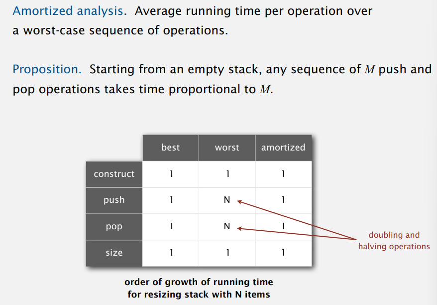​

Even the worst case causes *N*, accessing array and incrementing is very efficient for most operations.

> Memory usage

​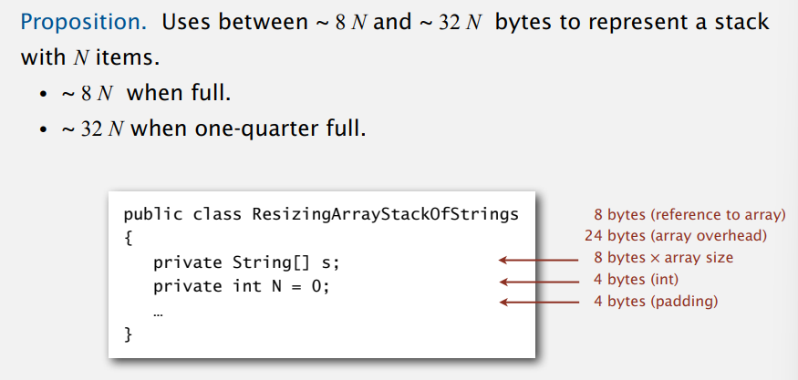​

Remark: This accounts for the memory for the **stack**, not the memory for strings themselves.

### Comparsion

​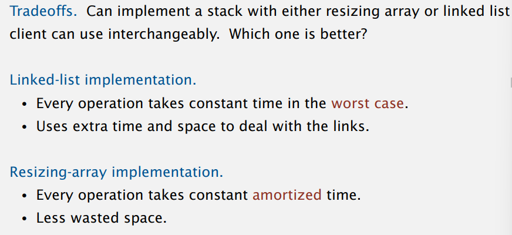​

Linked-list: ensure the single operation will be fast

Resizing-array: ensure the total time will be less.

## Queues

### API

​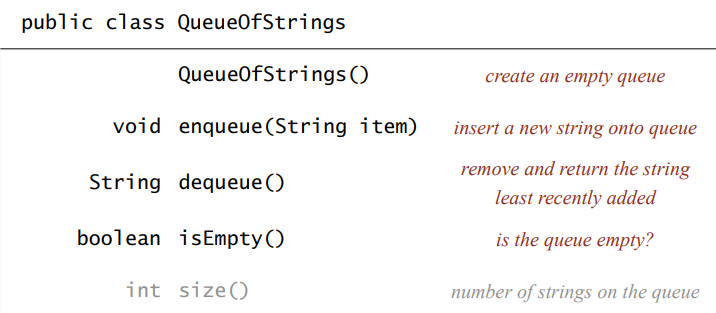​

### Linked-list implementation

Maintain pointer to first and last nodes in a linked list

insert/remove from opposite ends.

> Dequeue

1. save item to return
2. delete first node
3. return saved item

```Java
package myImplementation;

public class LinkedQueueOfString {
    Node first;
    Node last;

    private class Node {
        String item;
        Node next;

        public Node() {
        }

        public Node(String item, Node next) {
            this.item = item;
            this.next = next;
        }
    }

    public String dequeue() {
        String item = first.item;
        first = first.next;
        return item;
    }

}

```

> Enqueue

1. save a link to the last node
2. create a new node for the end
3. link the new node to the end of the list

```Java
package myImplementation;

public class LinkedQueueOfString {
    Node first;
    Node last;

    private class Node {
        String item;
        Node next;

        public Node() {
        }

        public Node(String item, Node next) {
            this.item = item;
            this.next = next;
        }
    }

    public void enqueue(String item) {
        Node oldLast = last;
        last = new Node(item, null);
        oldLast.next = last;
    }
}

```

> Whole implementation

```Java
package myImplementation;

public class LinkedQueueOfString {
    Node first;
    Node last;

    private class Node {
        String item;
        Node next;

        public Node() {
        }

        public Node(String item, Node next) {
            this.item = item;
            this.next = next;
        }
    }

    public LinkedQueueOfString() {
        first = null;
        last = null;
    }

    public String dequeue() {
        String item = first.item;
        first = first.next;
        if (isEmpty()) {  // special cases for empty queue
            last = null;
        }
        return item;
    }

    public void enqueue(String item) {
        Node oldLast = last;
        last = new Node(item, null);
        if (isEmpty()) {  // special cases for empty queue
            first = last;
        } else {
            oldLast.next = last;
        }
    }

    public boolean isEmpty() {
        return first == null;
    }
}
```

### Resizing array implementation

```Java
package myImplementation;

public class ResizingArrayQueueOfString {
    String[] q;
    int head;
    int tail;
    int capacity;
    int N;

    private class Node {
        String item;

        public Node() {

        }

        public Node(String item) {
            this.item = item;
        }
    }

    public ResizingArrayQueueOfString() {
        capacity = 1;
        head = 0;
        tail = 0;
        N = 0;
        q = new String[capacity];
    }

    public void enqueue(String item) {
        if (N == capacity) {
            resize(capacity * 2);
        }
        q[tail] = item;
        tail = (tail + 1) % capacity;
    }

    public String dequeue() {
        if (isEmpty()) {
            return null;
        }
        String item = q[head];
        head = (head + 1) % capacity;
        if (N == capacity / 4) {
            resize(capacity / 2);
        }
        return item;
    }

    public boolean isEmpty() {
        return head == tail;
    }

    private void resize(int capacity) {
        String[] copy = new String[capacity];
        for (int i = 0, j = head; i < N; i++, j = (j + 1) % capacity) {
            copy[i] = q[j];
        }
        q = copy;
        head = 0;
        tail = N;
        this.capacity = capacity;
    }
}

```

## Generics

Above content we only implemented stack or queue of *String*, but if we want more kinds of data?

1. Implement a separate stack class for each type. (Obviously wasteful)
2. Implement a stack with items of type *Object*. Client should cast the type.
3. Java generics

    1. Avoid casting in client
    2. Discover type mismatch errors at compile-time instead of run-time(Welcome compile-time errors; avoid run-time errors)

### Linked-list implementation

```Java
package myImplementation;

public class LinkedListStack<Item> {
    private Node first = null;

    private class Node {
        Item item;
        Node next;

        public Node() {
        }

        public Node(Item item, Node next) {
            this.item = item;
            this.next = next;
        }
    }
  
    public Item pop() {
        Item item = first.item;
        first = first.next;
        return item;
    }

    public void push(Item item) {
        Node oldFirst = first;
        first = new Node(item, oldFirst);
    }

    public boolean isEmpty() {
        return first == null;
    }
}
```

### Array implementation

```Java
package myImplementation;

public class FixedArrayStack<Item> {
    private Item[] s;
    private int N = 0;

    public FixedArrayStack(int capacity) {
        // s = new Item[capacity];  Java can not do like this
        s = (Item[]) new Object[capacity];  // should do like this
    }

    public boolean isEmpty() {
        return N == 0;
    }

    public void push(Item item) {
        s[N++] = item;
    }

    public Item pop() {
        return s[--N];
    }

}
```

Remark: Creating a generic array can not use `new Item[]`​, we must use a cast.

### Primitive types -> autoboxing

Each primitive type has a wrapper object type:

int -> Integer   double -> Double...

So client code can use generic stack for **any** type of data!

## Iterators

Support **iteration** over stack items by client, without revealing the internal representation of the stack.

Java solution: make satck implement the `java.lang.Iterable`​ interface.

​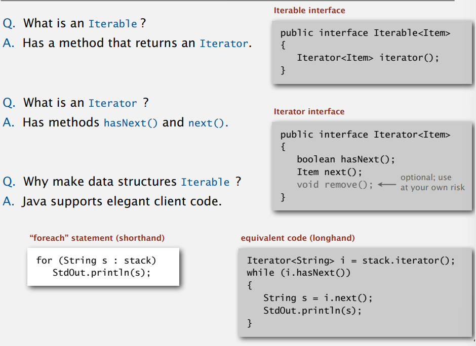​

### Linked-list implementation

​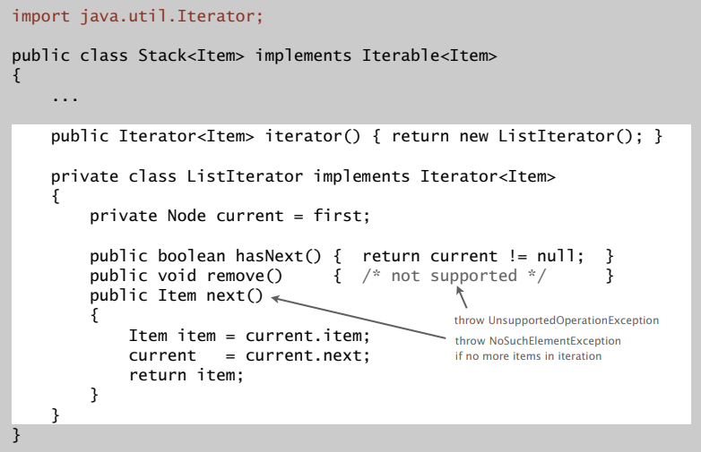​

```Java
package myImplementation;

import java.util.Iterator;
import java.util.ListIterator;

public class LinkedListStack<Item> implements Iterable<Item> {
    private Node first;

    @Override
    public Iterator<Item> iterator() {
        return new ListIterator();
    }

    private class ListIterator implements Iterator<Item> {
        private Node current = first;

        @Override
        public boolean hasNext() {
            return current != null;
        }

        @Override
        public Item next() {
            Item item = current.item;
            current = current.next;
            return item;
        }

        @Override
        public void remove() {
            throw new UnsupportedOperationException();
        }
    }

    private class Node {
        Item item;
        Node next;

        public Node() {
        }

        public Node(Item item, Node next) {
            this.item = item;
            this.next = next;
        }
    }

    public Item pop() {
        Item item = first.item;
        first = first.next;
        return item;
    }

    public void push(Item item) {
        Node oldFirst = first;
        first = new Node(item, oldFirst);
    }

    public boolean isEmpty() {
        return first == null;
    }
}
```

### Array implementation

```Java
package myImplementation;


import java.util.Iterator;

public class FixedArrayStack<Item> implements Iterable<Item> {
    private Item[] s;
    private int N = 0;

    public FixedArrayStack(int capacity) {
        // s = new Item[capacity];  Java can not do like this
        s = (Item[]) new Object[capacity];  // should do like this
    }

    @Override
    public Iterator<Item> iterator() {
        return new ReverseArrayIterator();
    }

    private class ReverseArrayIterator implements Iterator<Item> {
        private int i = N;

        @Override
        public boolean hasNext() {
            return i > 0;
        }

        @Override
        public Item next() {
            return s[--i];
        }

        @Override
        public void remove() {
            throw new UnsupportedOperationException();
        }
    }

    public boolean isEmpty() {
        return N == 0;
    }

    public void push(Item item) {
        s[N++] = item;
    }

    public Item pop() {
        return s[--N];
    }

}
```

## Bag

Adding items to a collection and iterating(order doesn't matter).

​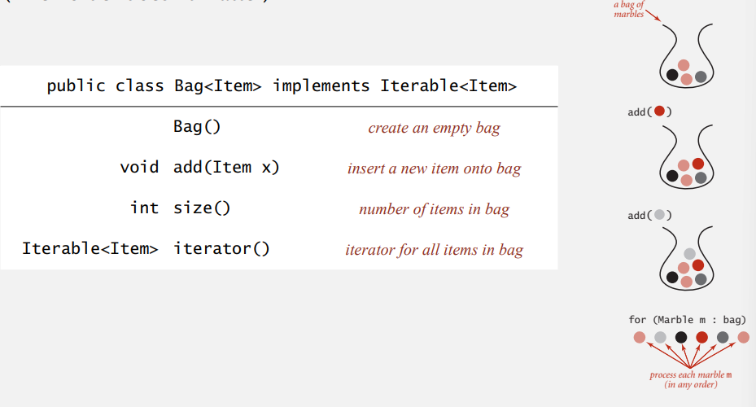​

Implementation: Stack without pop() or queue without dequeue.

## Applications

### Collections library

#### List

​`java.util.List`​ is API for an sequence of items.

​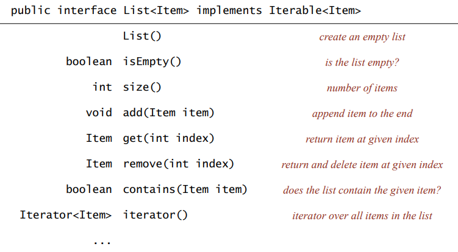​

* ​`java.util.ArrayList`​ uses resizing array
* ​`java.util.LinkedList`​ uses linked list.

#### Stack

* Supports push(), pop() and iteration
* Extends `java.util.Vector`​, which implements `java.util.List`​
* Bloated and poorly-designed API

​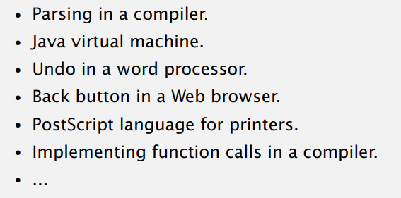​

> Function calls

​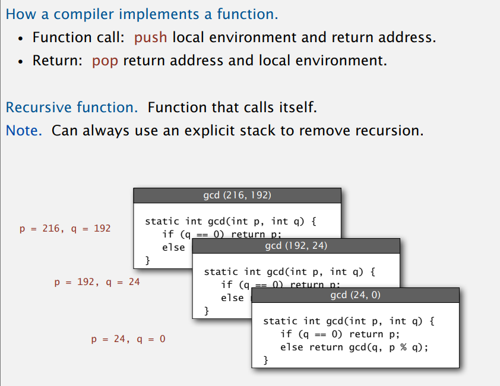​

> Arithemetic expression evaluation

Dijkstra's tow-stack algorithm

​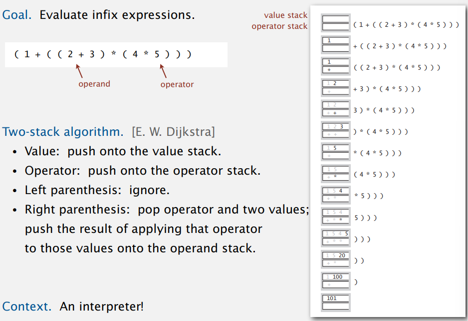​

​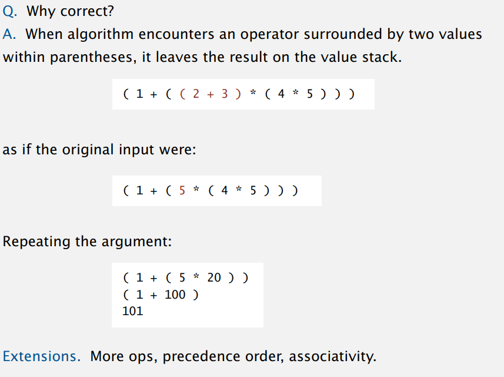​

#### Queue

An interface, not an implementation of a queue.

# Elementary Sorts

## Callbacks

Our goal is sorting any type of data. But how can `sort()`​ know how to compare data of different types **without any information** about the type of an item's key?

**Callback** = reference to executable code

* Client passes array of objects to `sort()`​ function.
* The `sort()`​ function calls back object's `compareTo()`​ method as needed.
* In Java, using interfaces to implement callbacks.

​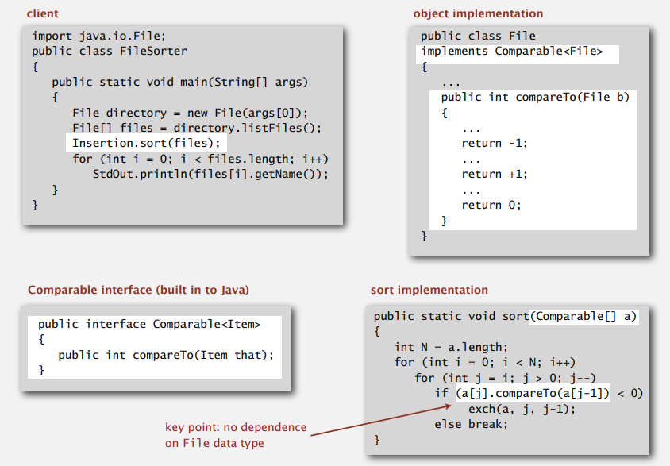​

### Total order

A total order is a binary relation `<=`​ that satisfies:

* Antisymmetry: if `v <= w`​ and `w <= v`​, then `v == w`​.
* Transitivity: if `v <= w`​ and `x <= x`​, then `v <= x`​.
* Totality: either `v <= w`​ or `w <= v`​ or both

It means for most type of data, they can be sorted (Excepting **double**, because `Double.NaN <= Double.NaN`​ is false).

### Comparable API

Implement `compareTo()`​ so that `v.compareTo(w)`​:

* Is a total order.
* Returns a negative integer, zero, or positive integer.
* Throws an exception if incompatible types (or either is *null*).

​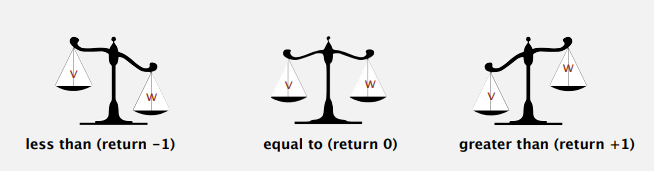​

Some data type like Integer, Double, String ... have already implemented the API, we called them **Built-in comparable types**.

The **user-defined comparable types** need client implement the comparable interface by themselves.

### Implementing the Comparable interface

​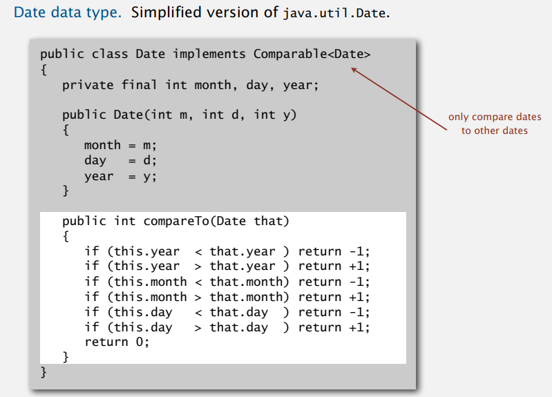​

Keep the type of two data corresponding.

### Two useful sorting abstactions

> Less: Is item *v* less than *w* ?

​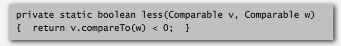​

> Exchange: Swap item in array *a[]*  at index *i* with the one at index *j*

​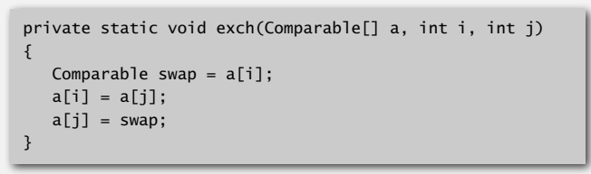​

### Testing

​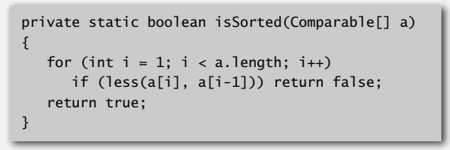​

If the sorting algorithm passes the test and it only use the two function above, we can say it sort the array correctly !

## Selection sort

* In iteration *i*, find index *min* of smallest remaining entry (scans from left to right).
* Swap *a[i]*  and *a[min].*

> Invariants

​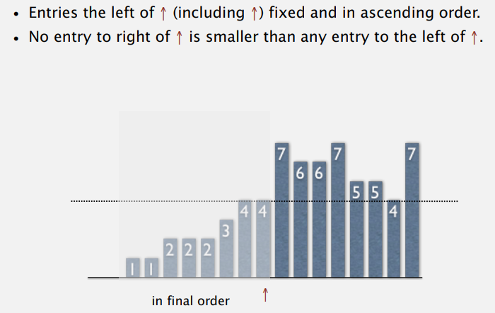​

### Analysis

​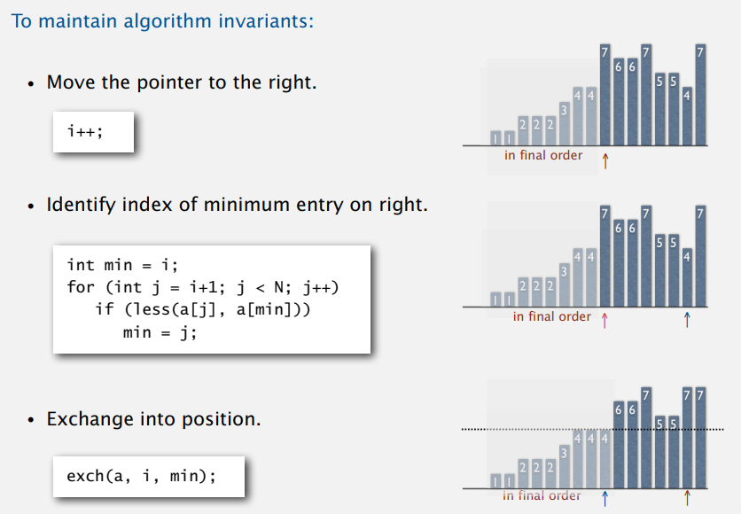​

### Implementation

```Java
public class Selection {
    public static boolean less(Comparable v, Comparable w) {
        return v.compareTo(w) < 0;
    }

    public static void exchange(Comparable[] a, int i, int j) {
        Comparable temp = a[i];
        a[i] = a[j];
        a[j] = temp;
    }

    public static void sort(Comparable[] a) {
        int N = a.length;
        for (int i = 0; i < N; i++) {
            int min = i;
            for (int j = i + 1; j < N; j++) {
                if (less(a[i], a[j])) {
                    exchange(a, i, min);
                }
            }
        }
    }
}
```

### Cost

* Proposition: Selection sort uses  *(N - 1) + (N - 2) + ... + 1 + 0 ~ ½N*​<sup>*2*</sup> compares and *N* exchanges.
* Running time: Is insensitive to input, whether the input is sorted.
* Data movement: Is minimal, linear number of exchanges.

## Insertion sort

* In iteration *i*, swap *a[i]*  with each larger entry to its left (scans from left to right).

> Invariants

​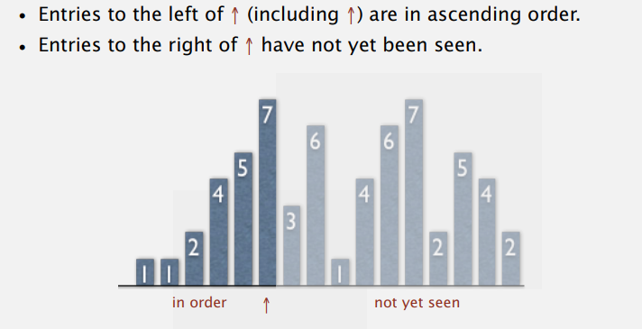​

### Analysis

​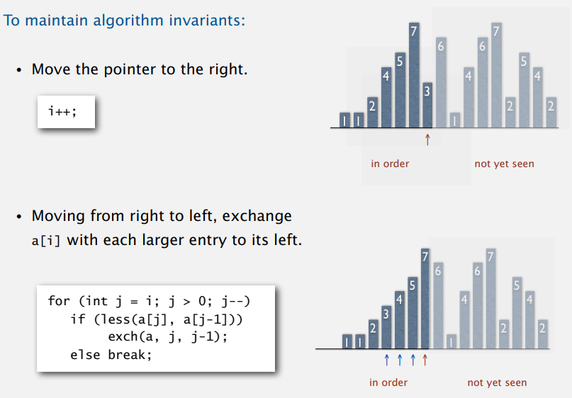​

### Implementation

```Java
public class Insertion {
    public static boolean less(Comparable v, Comparable w) {
        return v.compareTo(w) < 0;
    }

    public static void exchange(Comparable[] a, int i, int j) {
        Comparable temp = a[i];
        a[i] = a[j];
        a[j] = temp;
    }

    public static void sort(Comparable[] a) {
        int N = a.length;
        for (int i = 0; i < N; i++) {
            for (int j = i; j > 0; j--) {
                if (less(a[j], a[j - 1])) {
                    exchange(a, j, j - 1);
                } else {
                    break;
                }
            }
        }
    }
}
```

### Cost

* Proposition: uses  *~¼N*​*<sup>2</sup>* compares and  *~¼N*​*<sup>2</sup>*  exchanges on average. (Expect each entry to move halfway back). Insertion sort is about twice faster than Selection sort
* Running time:

  * Best case: If the array is in ascending order, insertion sort makes *N - 1* compares and 0 exchanges.
  * Worst case: If the array is in descending order (and no duplicates), inserton sort makes  *~*  *½ N*​*<sup>2</sup>* compares and  *~*  *½ N*​*<sup>2</sup>* exchanges.
  * On average:  *~¼N*​*<sup>2</sup>* compares and  *~¼N*​*<sup>2</sup>*  exchanges.

### Partially-sorted arrays

**Inversion**: An inversion is a pair of keys that are out of order.

​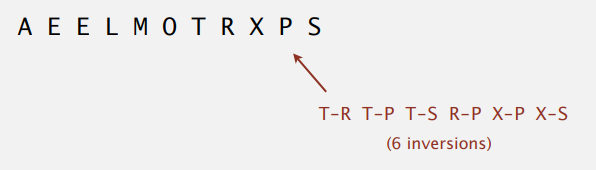​

**Partially sorted**: An array is partially sorted if the number of inversions is  *&lt;= c N*

* Ex 1. A subarray of size 10 appended to a sorted subarray of size *N*.
* Ex 2. An array of size *N* with only 10 entrie out of place.

Proposition: For partially-sorted arrays, insertion sort runs in linear time.

*  Number of exchanges == the number of inversions
* number of compares == exchanges + (N - 1)

## Shellsort

Move entrie more than one position at a time by *h-sorting* the array.

**h-sort**: An h-sorted array is *h* interleaved sorted subsequences.

​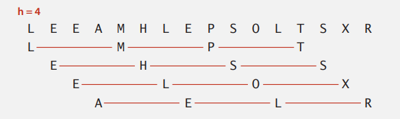​

**Shellosort**: **h-sort** array for decreasing sequence of values of *h*.

​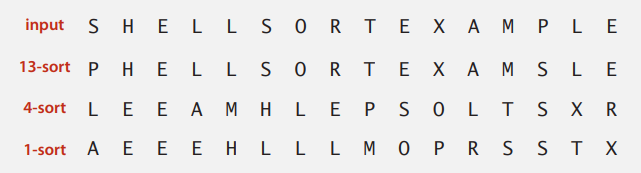​

​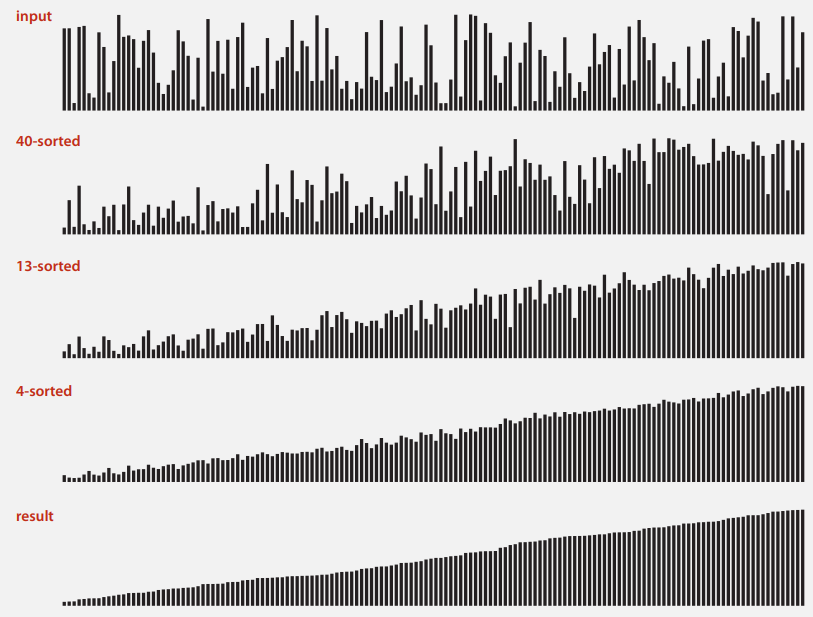​

### h-sort

How: Insertion sort, with stride length *h*.

* Big increments: small subarray.
* Small increments: nearly in order.

Proposition: A *g*-sorted array remains *g*-sorted after *h*-sorting it.

​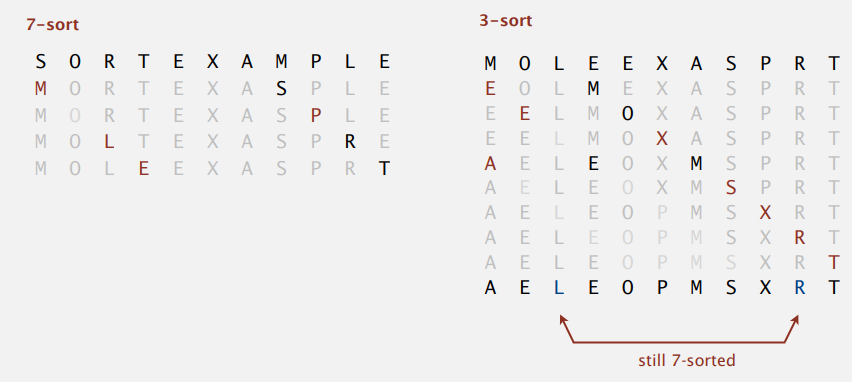​

### Increment sequence

​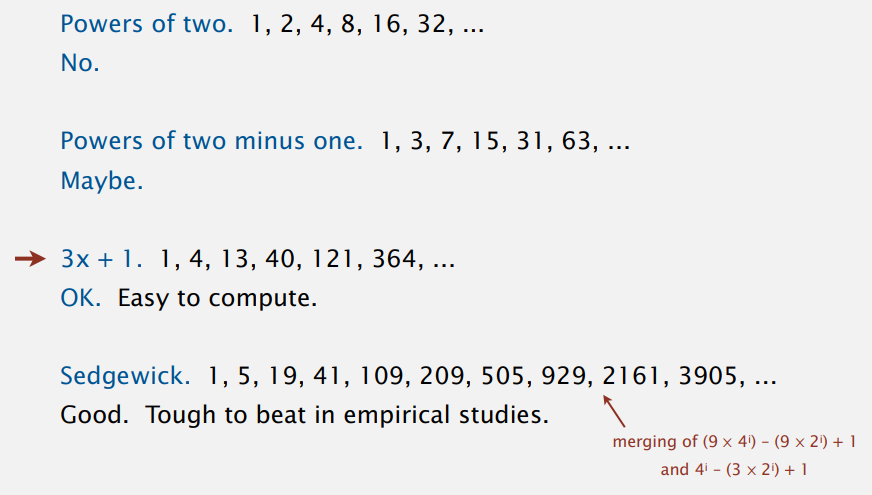​

Knuth's: 3x + 1

### Implementation

```Java
public class Shell {
    public static boolean less(Comparable v, Comparable w) {
        return v.compareTo(w) < 0;
    }

    public static void exchange(Comparable[] a, int i, int j) {
        Comparable temp = a[i];
        a[i] = a[j];
        a[j] = temp;
    }

    public static void sort(Comparable[] a) {
        int N = a.length;

        int h = 1;
        while (h < N / 3) {  // 3x + 1 increment sequence
            h = 3 * h + 1;  // find the max number
        }

        while (h >= 1) {
            // h-sort the array
            for (int i = h; i < N; i++) {  // insertion sort
                for (int j = i; j >= h && less(a[j], a[j - h]); j -= h) {
                    exchange(a, j, j - h);
                }
            }
            h /= 3;  // move to next increment
        }
    }
}
```

### Cost

* Proposition: The worst-case number of compares used by shellsort with the **3x + 1** increments is O(*N*​<sup>3/2</sup>).
* Property: Number of compares used by shellsort with the *3x + 1* increments is at most by  a small multiple of *N* times the  *#*  of increments used.

​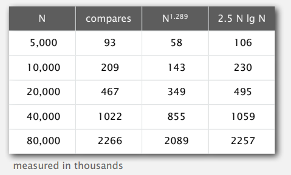​

Remark: Accurate model has not yet been discovered.

### Applications

* used for small subarrays (fast unless array size if huge).
* Tiny, fixed footprint for code.
* Hardware sort prototype.

## Shuffling

**Shuffle**: Rearrange array so that result is a **uniformly random** permutation.

### Shuffle sort

* Generate a random real number for each array entry.
* Sort the array.

​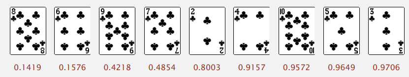​

Proposition: Shuffle sort produces a uniformly random permutation of the input array, provided no duplicate values. But we need to **sort an array**.

### Knuth shuffle

* In iteration *i*, pick integer *r* betwwen 0 and *i* uniformly at random. (between *i* and *N - 1* is OK, but between 0 and *N - 1* will not work (in the whole array)).
* Swap *a[i]*  and *a[r]* .

Proposition: Knuth shuffling algorithm produces a uniformly random permutation of the input array in **linear time**.

#### Implementation

```Java
import edu.princeton.cs.algs4.StdRandom;

public class Random {
    public static void exchange(Comparable[] a, int i, int j) {
        Comparable temp = a[i];
        a[i] = a[j];
        a[j] = temp;
    }

    public static void shuffle(Comparable[] a) {
        int N = a.length;
        for (int i = 0; i < N; i++) {
            int r = StdRandom.uniform(i + 1);
            exchange(a, i, r);
        }
    }
}
```

## Convex hull

The **convex hull** of a set of *N* points is the **smallest perimeter fence** enclosing the points.

​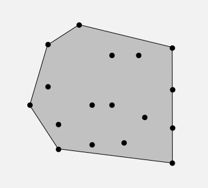​

> Equivalent definitions

​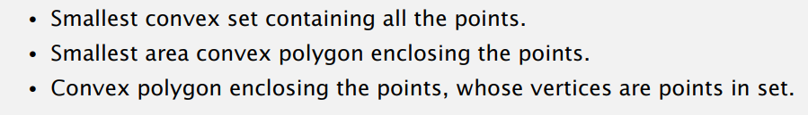​

> Mechanical algorithm

Hammer nails perpendicular to plane; stretch elastic rubber band around points.

​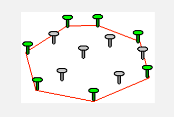​

### Aplication

> Robot motion planning

​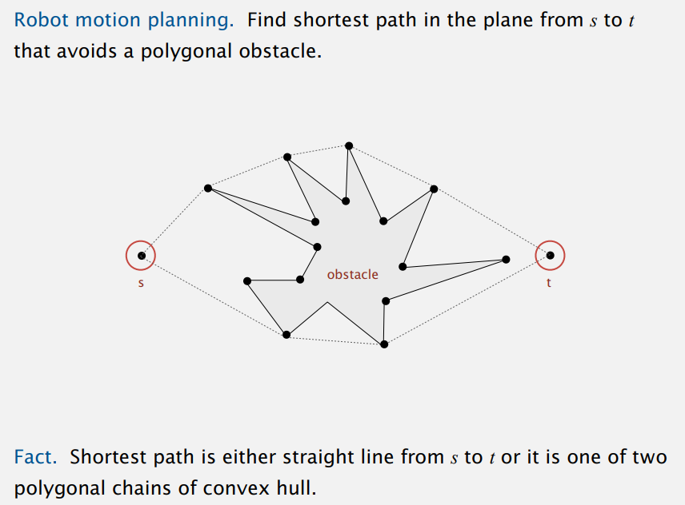​

> Farthers pair

​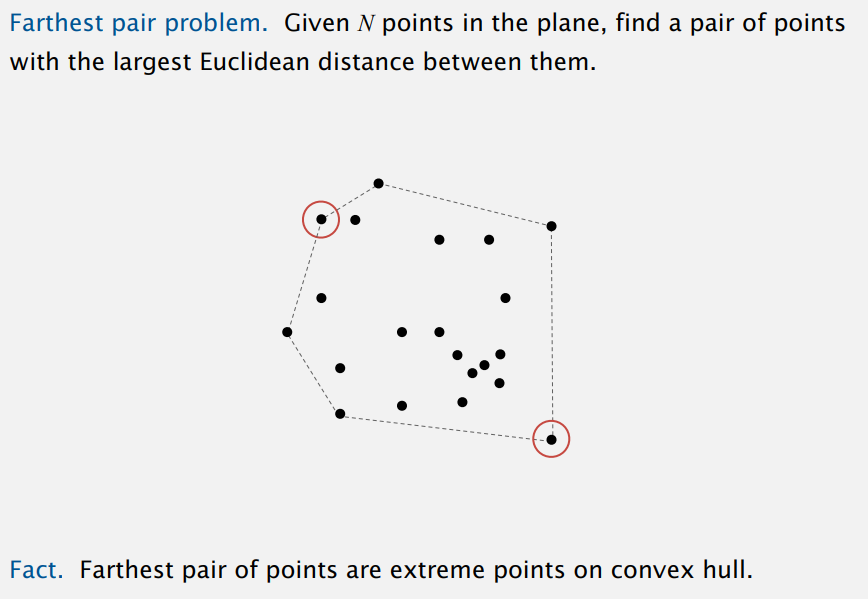​

> Geometric properties

​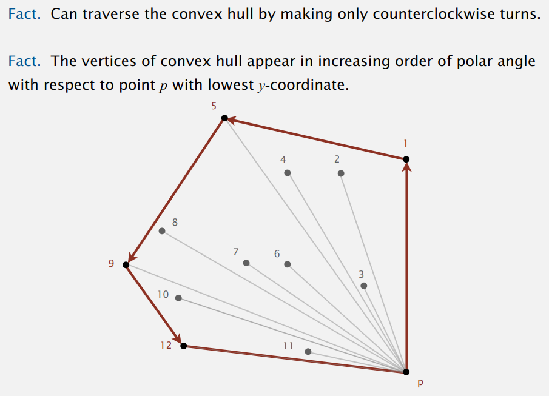​

### Graham scan

* Choose point *p* with **smallest** *y*-coordinate.
* Sort points by **polar angle** with *p*.
* Consider points in order; discard unless it create a **CCW**​ turn. (CCW: counterclockwise)

#### Implementation challenges

​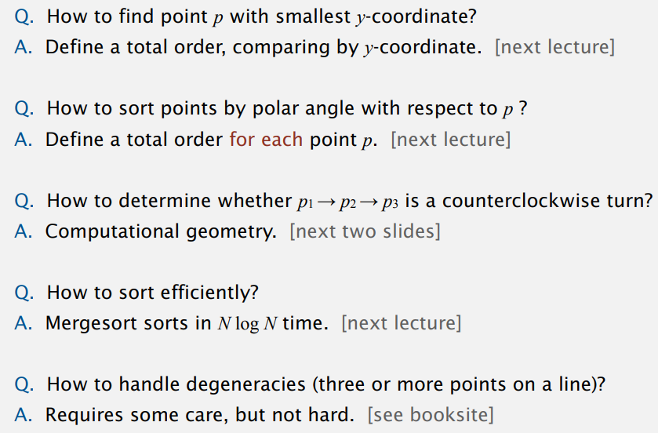​

#### Implementing CCW

Given three points *a*, *b*, and *c*, is *a* -> *b* -> *c* a counterclockwise turn?

-> is *c* to the **left** of the ray *a* -> *b* ?

​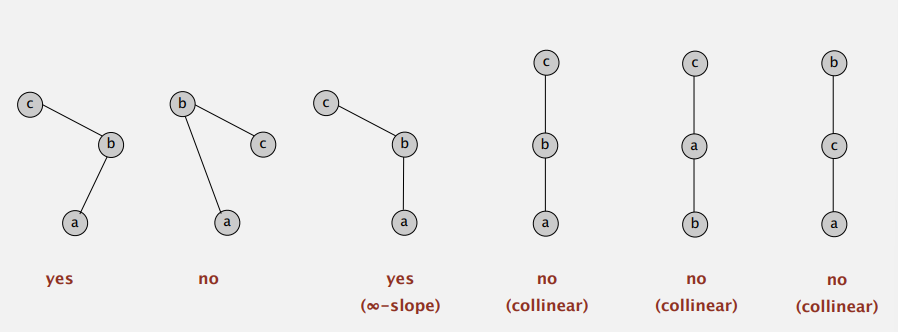​

* Dealing with degenerate cases.
* Coping with floating-point precision.

​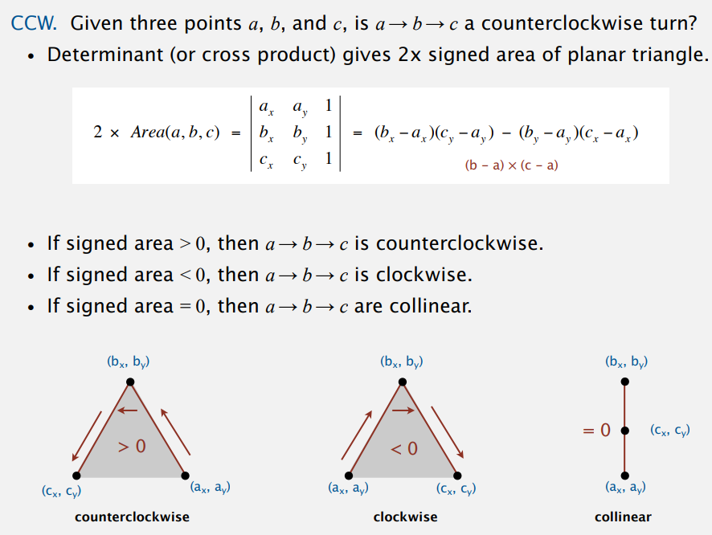​

#### Point data type

​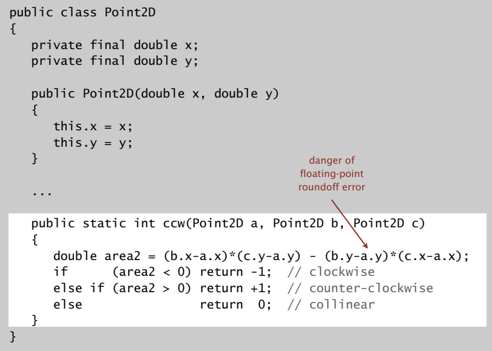​

# Mergesort

Java sort for objects.

## Mergesort

Dividing and conquer

### Basic plan

* Divide array into two halves.
* **Recursively** sort each half.
* Merge two halves.

### merge

```Java
public class Mergesort {
    private static boolean less(Comparable v, Comparable w) {
        return v.compareTo(w) < 0;
    }

    private static boolean isSorted(Comparable[] a, int lo, int hi) {
        for (int i = lo; i < hi; i++) {
            if (!less(a[i], a[i + 1])) {
                return false;
            }
        }
        return true;
    }

    public static void merge(Comparable[] a, Comparable[] aux, int lo, int mid, int hi) {
        assert isSorted(a, lo, mid);
        assert isSorted(a, mid + 1, hi);

        for (int k = lo; k <= hi; k++) {  // copy
            aux[k] = a[k];
        }

        int i = lo, j = mid + 1;  // merge
        for (int k = lo; k <= hi; k++) {
            if (i > mid) a[k] = aux[j++];  // aux[lo] to aux[mid] is sorted
            else if (j > hi) a[k] = aux[i++];  // aux[mid + 1] to aux[hi] is sorted
            else if (less(aux[j], aux[i])) a[k] = aux[j++];  // aux[j] < aux[i]
            else a[k] = aux[i++];  // aux[j] >= aux[i]
        }

        assert isSorted(a, lo, hi);
    }


}

```

### Assertions

**Assertion**: Statement to test assumptions about your program.

* Helps detect logic bugs.
* Documents code.

> Java assert statement

Throws exception unless boolean condition is true.

```Java
assert isSorted(a, lo, hi);
```

​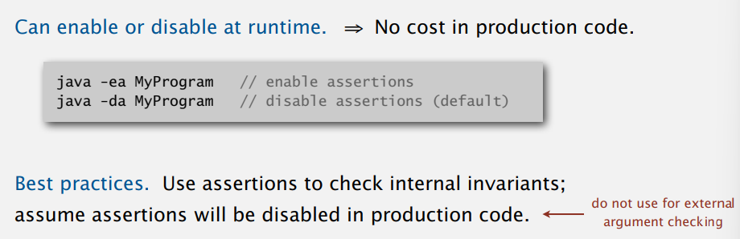​

### Implementation

```Java
public class Mergesort {
    private static boolean less(Comparable v, Comparable w) {
        return v.compareTo(w) < 0;
    }

    private static boolean isSorted(Comparable[] a, int lo, int hi) {
        for (int i = lo; i < hi; i++) {
            if (!less(a[i], a[i + 1])) {
                return false;
            }
        }
        return true;
    }

    public static void merge(Comparable[] a, Comparable[] aux, int lo, int mid, int hi) {
        assert isSorted(a, lo, mid);
        assert isSorted(a, mid + 1, hi);

        for (int k = lo; k <= hi; k++) {  // copy
            aux[k] = a[k];
        }

        int i = lo, j = mid + 1;  // merge
        for (int k = lo; k <= hi; k++) {
            if (i > mid) a[k] = aux[j++];  // aux[lo] to aux[mid] is sorted
            else if (j > hi) a[k] = aux[i++];  // aux[mid + 1] to aux[hi] is sorted
            else if (less(aux[j], aux[i])) a[k] = aux[j++];  // aux[j] < aux[i]
            else a[k] = aux[i++];  // aux[j] >= aux[i]
        }

        assert isSorted(a, lo, hi);
    }

    private static void sort(Comparable[] a, Comparable[] aux, int lo, int hi) {
        if (hi <= lo) {
            return;
        }
        int mid = lo + (hi - lo) / 2;
        sort(a, aux, lo, mid);
        sort(a, aux, mid + 1, hi);
        merge(a, aux, lo, mid, hi);
    }

    public static void sort(Comparable[] a) {
        Comparable[] aux = new Comparable[a.length];  // do not create auxiliary array in the recursive routine
		// or it will cause extensive cost of extra array creation.
        sort(a, aux, 0, a.length - 1);
    }
}
```

### Analysis

* Proposition: Mergesort uses at most *N*lg*N* (linearithmic) compares and 6*N*lg*N* array accesses to sort any array of size *N*.
* Running time: Will not be influenced by reverse-sorted items.

  ​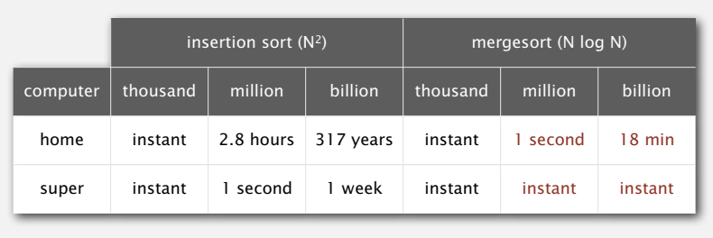​
* Memory: Mergesort uses extra space proportinal to *N*​

  ​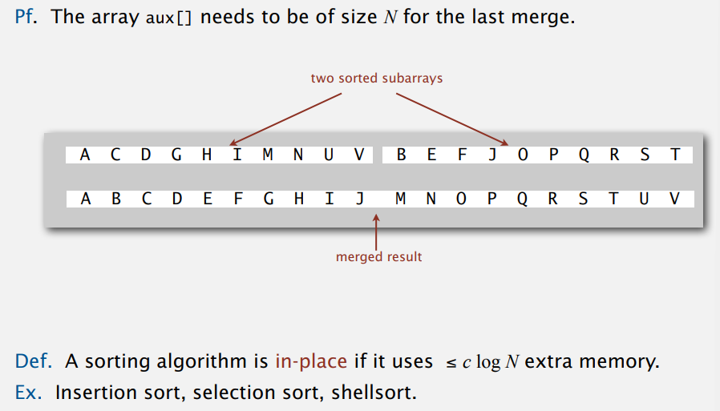​

#### Proof

​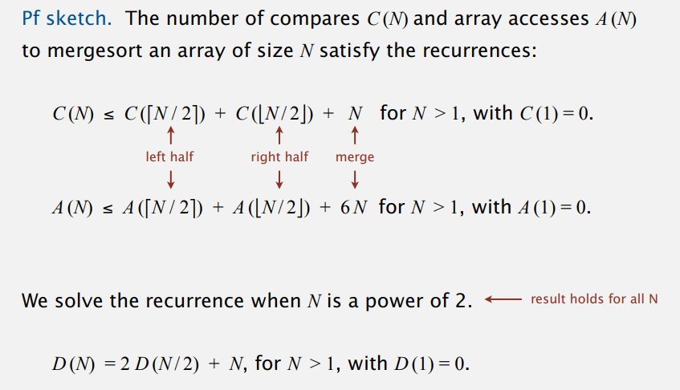​

​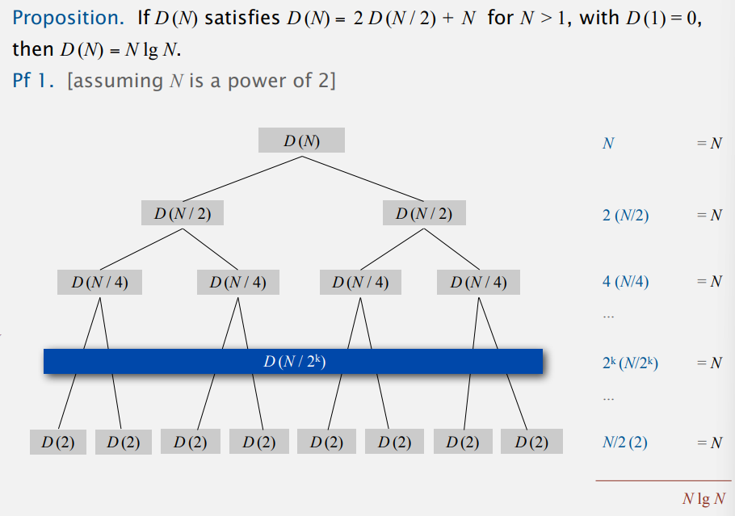​

​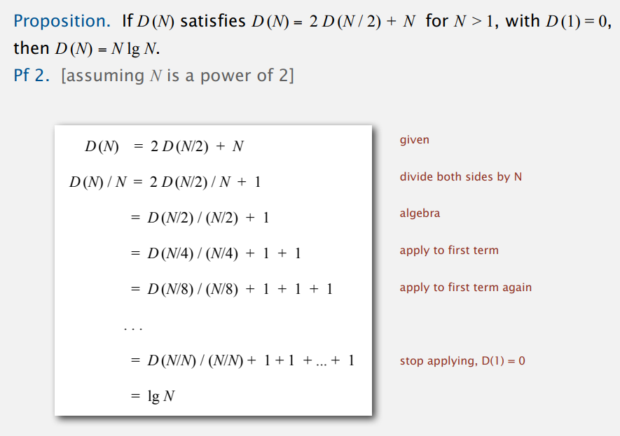​

​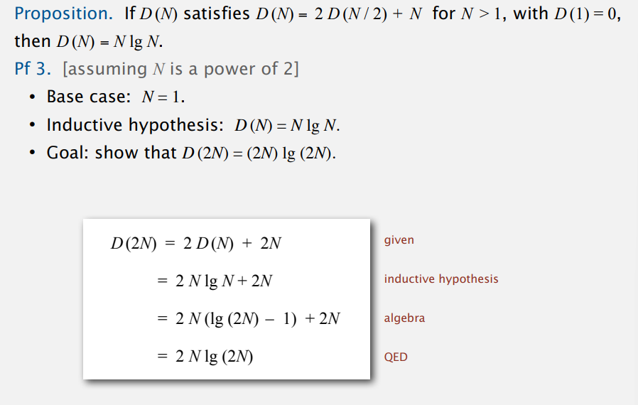​

### Practical improvements

> Use insertion sort for small subarrays.

* Mergesort has too much overhead for tiny subarrays.
* Cutoff to insertion sort for about 7 tiems

```Java
public class Mergesort {
    private static final int CUTOFF = 7;
	...
    private static void sort(Comparable[] a, Comparable[] aux, int lo, int hi) {
        if (hi <= lo + CUTOFF - 1) {  // use insertion sort
            Insertion.sort(a, lo, hi);
            return;
        }
        int mid = lo + (hi - lo) / 2;
        sort(a, aux, lo, mid);
        sort(a, aux, mid + 1, hi);
        merge(a, aux, lo, mid, hi);
    }
}
```

> Stop if already sorted

* Is biggest item in first half <= smallest item in second half?
* Helps for partially-ordered arrays.

Requires only *n - 1* compares.

```Java
public class Mergesort {
	...
    private static void sort(Comparable[] a, Comparable[] aux, int lo, int hi) {
        if (hi <= lo + CUTOFF - 1) {
            Insertion.sort(a, lo, hi);
            return;
        }
        int mid = lo + (hi - lo) / 2;
        sort(a, aux, lo, mid);
        sort(a, aux, mid + 1, hi);
        if (!less(a[mid + 1], a[mid])) return;  // stop if already sorted
        merge(a, aux, lo, mid, hi);
    }
}
```

> Eliminate the copy to the auxiliary array.

* Save time (but not space) by switching the role of the input and auxiliary array in each recursive call.

​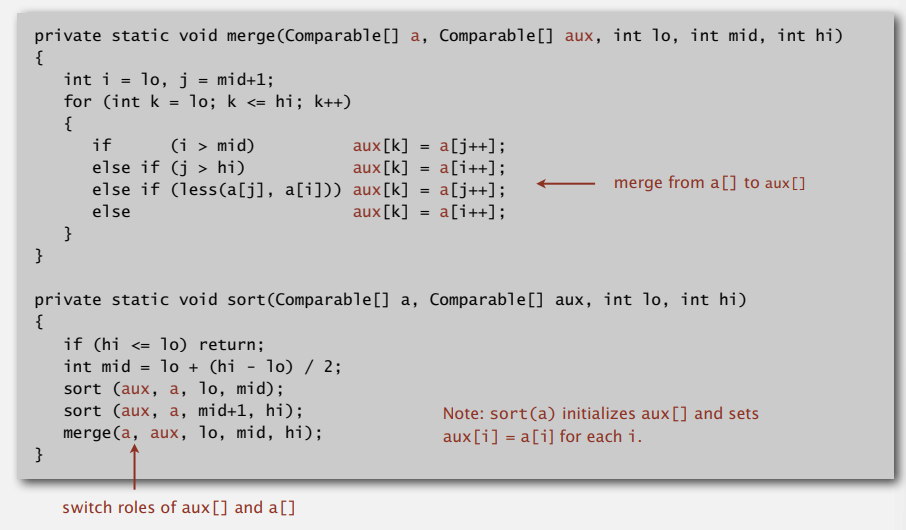​

## Bottom-up mergesort

### Basic plan

* Pass through array, merging subarrays of size 1.
* Repeat for subarrays of size 2, 4, 8, 16, ....

​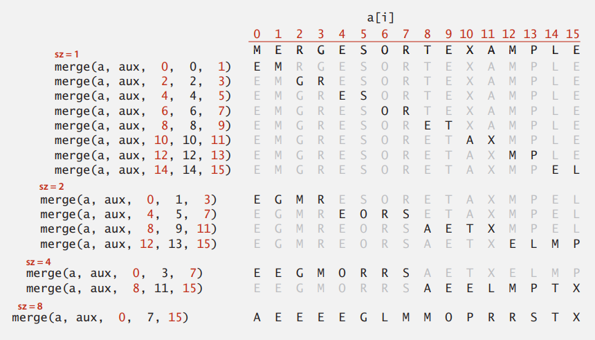​

Simple and non-recursive version of mergesort, but about 10% slower than recursive, top-down mergesort on typical systems.

### Implementation

```Java
public class MergeBU {
    private static boolean less(Comparable v, Comparable w) {
        return v.compareTo(w) < 0;
    }

    private static boolean isSorted(Comparable[] a, int lo, int hi) {
        for (int i = lo; i < hi; i++) {
            if (!less(a[i], a[i + 1])) {
                return false;
            }
        }
        return true;
    }

    public static void merge(Comparable[] a, Comparable[] aux, int lo, int mid, int hi) {
        assert isSorted(a, lo, mid);
        assert isSorted(a, mid + 1, hi);

        for (int k = lo; k <= hi; k++) {  // copy
            aux[k] = a[k];
        }

        int i = lo, j = mid + 1;  // merge
        for (int k = lo; k <= hi; k++) {
            if (i > mid) a[k] = aux[j++];  // aux[lo] to aux[mid] is sorted
            else if (j > hi) a[k] = aux[i++];  // aux[mid + 1] to aux[hi] is sorted
            else if (less(aux[j], aux[i])) a[k] = aux[j++];  // aux[j] < aux[i]
            else a[k] = aux[i++];  // aux[j] >= aux[i]
        }

        assert isSorted(a, lo, hi);
    }

    public static void sort(Comparable[] a) {
        int N = a.length;
        Comparable[] aux = new Comparable[N];
        for (int sz = 0; sz < N; sz = sz + sz) {
            for (int lo = 0; lo < N - sz; lo += sz + sz) {
                merge(a, aux, lo, lo + sz - 1, Math.min(lo + sz + sz - 1, N - 1));
            }
        }
    }
}

```

## Sorting complexity

**Computational complexity**: Framework to study efficiency of algorithms for solving a particular problem *X*.

* Model  of computation: Allowable operations.
* Cost model: Operation counts.
* Upper bound: Cost guarantee provided by **some** algorithm for *X*.
* Lower bound: Proven limit on cost guarantee of **all** algorithms for *X.*
* Optimal algorithm: Algorithm with best possible cost guarantee for *X*. (lower bound ~ upper bound)

​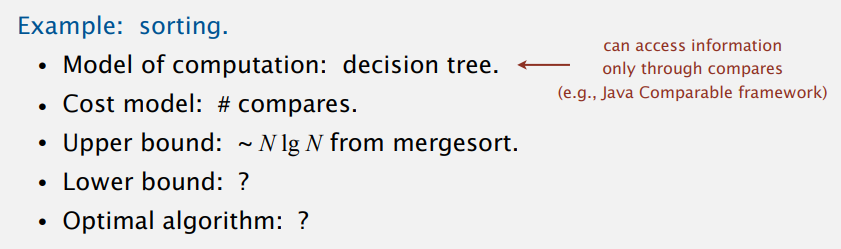​

### Decision tree

For 3 distinct items a, b, and c.

​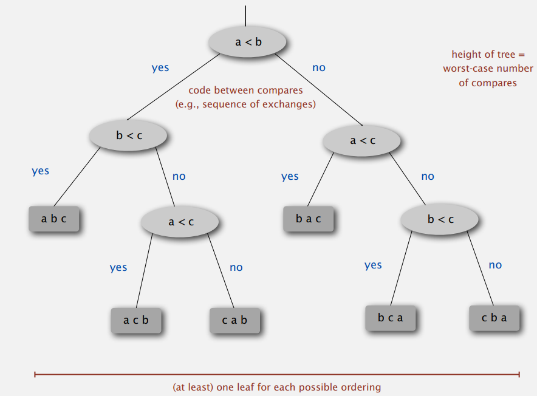​

### Compare-based lower bound for sorting

* Proposition: Any compare-based sorting algorithm must use at least **lg(**​***N***  **!) ~**  ***N*** **lg** ***N***  ****  compares in the worst-case

> Proof

​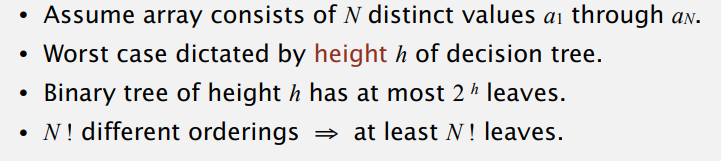​

​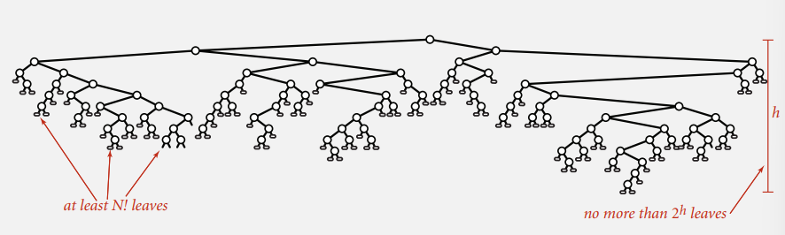​

​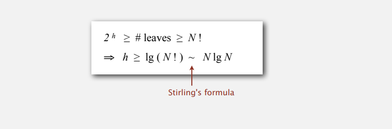​

### Complexity of sorting

​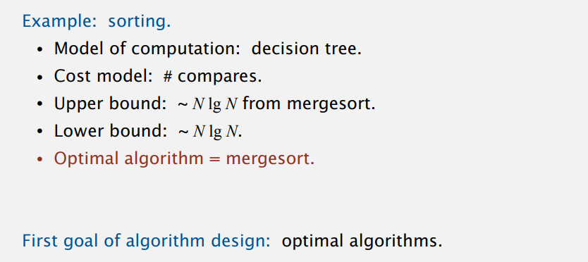​

### Complexity results in context

* Compares: Mergesort is optimal with respect to number compares.
* Space: Mergesort is not optimal with respect to space usage.

> **Lessions**: Use theory as a guide.

* Ex. Design sorting algorithm that guarantees ½ *N* lg *N* compares?
* Ex. Design sorting algorithm that is both time- and space-optimal?

Lower bound may not hold if the algorithm has information about:

* The initial order of the input

  * **Partially-ordered arrays**: Depending on the initial order of the input, we may not need *N* lg *N* compares. (insertion sort requires only *N - 1* compares if input array is sorted)
* The distribution of key values

  * **Duplicate keys**: Depending on the input distribution of duplicates, we may not need *N* lg *N* compares. (quicksort)
* The representation of the keys

  * **Digital properties of keys**: We can use digit/character compares instead of key compares for numbers and strings. (radix sorts)

## Comparator

**Comparable interface**: sort using a type's **natural order**.

**Comparator interface**: sort using an **alternate order**.

```Java
public interface Comparator<Key> {
	int compare(Key v, Key w);  // compare keys v and w
}
```

Required property: Must be a **total order**.

​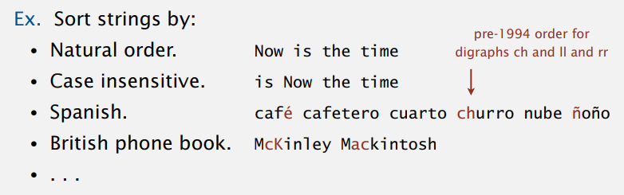​

> To use with Java system sort:

* Crteate Comparator object.
* Pass as second argument to `Arrays.sort()`​.

​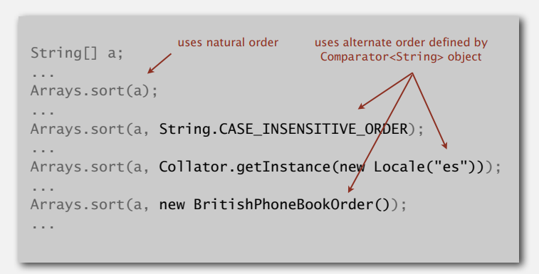​

Decouples the definition of the data type from the definiton of what it means to compare two objects of that type.

> To support comparators in out sort implementations:

* Use `Object`​ instead of `Comparable`​.
* Pass `Comparator`​ to `sort()`​ and `less()`​ and use it in `less()`​.

```Java
import java.util.Comparator;

public class Insertion {
    private static boolean less(Comparator c, Object v, Object w) {
        return c.compare(v, w) < 0;
    }

    private static void exchange(Object[] a, int i, int j) {
        Object swap = a[i];
        a[i] = a[j];
        a[j] = swap;
    }

    public static void sort(Object[] a, Comparator comparator) {
        int N = a.length;
        for (int i = 0; i < N; i++) {
            for (int j = i; j > 0 && less(comparator, a[j], a[j - 1]); j--) {
                exchange(a, j, j - 1);
            }
        }
    }
}
```

### Implementation

To implement a comparator:

* Define a (nested) class that implements the `Comparator`​ interface.
* Implement the `compare()`​ method.

One `Comparator`​ for the class, so there should be `static`​

```Java
import java.util.Comparator;

public class Student {
    public static final Comparator<Student> BY_NAME = new ByName();
    public static final Comparator<Student> BY_SECTION = new BySection();

    private final String name;
    private final int section;

    public Student(String name, int section) {
        this.name = name;
        this.section = section;
    }

    private static class ByName implements Comparator<Student> {
        @Override
        public int compare(Student v, Student w) {
            return v.name.compareTo(w.name);
        }
    }

    private static class BySection implements Comparator<Student> {
        @Override
        public int compare(Student v, Student w) {
            return v.section - w.section;  // ensure here is no danger of overflow.
        }
    }
}

```

```Java
Arrays.sort(a, Student.BY_NAME);
Arrays.sort(a, Student.BU_SECTION);
```

### Aplication

> Polar order

​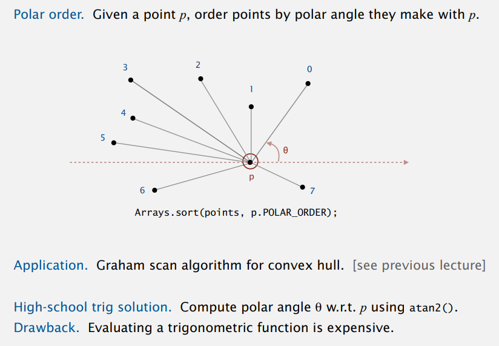​

​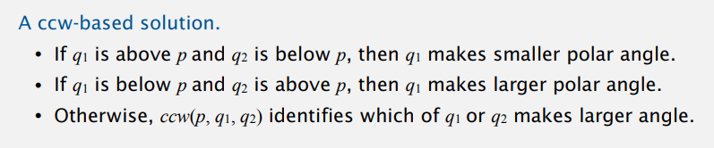​

One `Comparator`​ for each point, so there is no `static`​.

```Java
import java.util.Comparator;

public class Point2D {
    public final Comparator<Point2D> POLAR_ORDER = new PolarOrder();
    private final double x, y;

    public Point2D(double x, double y) {
        this.x = x;
        this.y = y;
    }

    private static int ccw(Point2D a, Point2D b, Point2D c) {
        // danger of floating-point round off error
        double area2 = (b.x - a.x) * (c.y - a.y) - (b.y - a.y) * (c.x - a.x);
        if (area2 < 0) return -1;  // cw
        else if (area2 > 0) return +1;  // ccw
        else return 0;  // collinear
    }

    private class PolarOrder implements Comparator<Point2D> {
        @Override
        public int compare(Point2D q1, Point2D q2) {
            double dy1 = q1.y - y;
            double dy2 = q2.y - y;

            if (dy1 == 0 && dy2 == 0) {
                ...  // p, q1, q2 horizontal
            } else if (dy1 >= 0 && dy2 < 0) {
                return -1;  // q1 above p; q2 below p
            } else if (dy2 >= 0 && dy1 < 0) {
                return +1;  // q1 below p; q2 above p
            } else {
                return -ccw(Point2D.this, q1, q2);
				// Point2D.this is to access invoking point from within inner class
            }
        }
    }
}

```

## Stability

​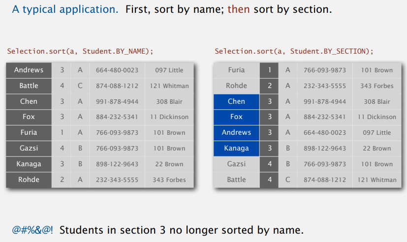​

* A **stable** sort preserves the relative order of items with equal keys.

> Which sorts are stable?

* Insertion sort
* Mergesort

but not selection sort or shellsort.

Note: Need to carefully check code **less than** / **less than or equal to**.

### Insertion sort

Propostition: Insertion sort is **stable**.

​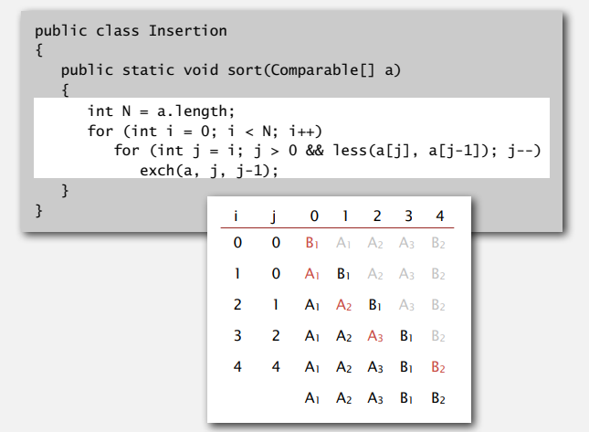​

Pf. Equal items never move past each other.

### Mergesort

Propostition: Mergesort is **stable**.

​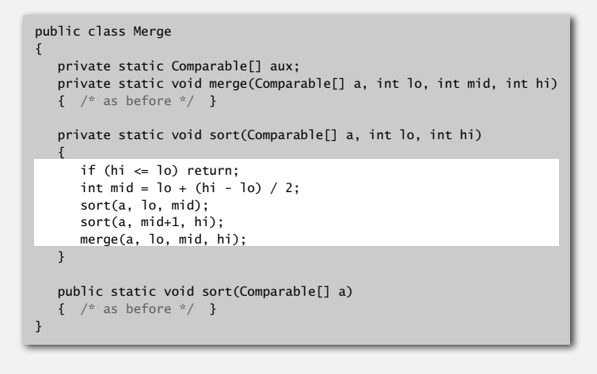​

Pf. Suffices to verify that merge operation is stable.

​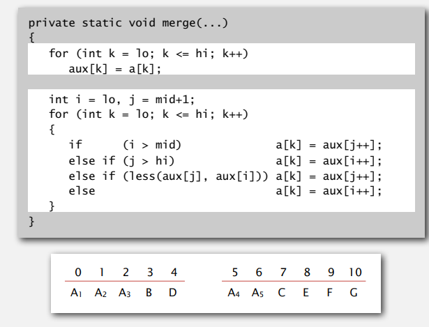​

Pf. Takes from **left** subarray if equal keys.

### Selection sort

Proposition: Selection sort is **not stable**.

​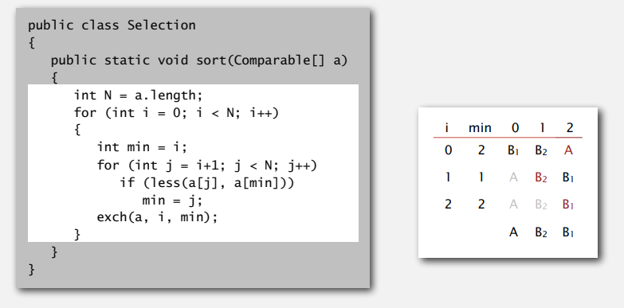​

Pf by counterexample. Long-distance exchange might move an item past some equal item.

### Shellsort

Proposition: Shellsort sort is **not stable**.

​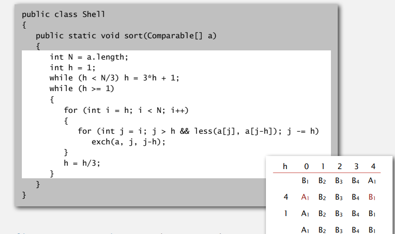​

Pf by counterexample. Long-distance exchange might move an item past some equal item.

# Quicksort

Java sort for primitive types.

## Quicksort

### Basic plan

* **Shuffle** the array.
* **Partition** so that, for some *j*​

  * entry *a[j]*  is in place
  * no larger entry to the left of *j*​
  * no smaller entry to the right of *j*​
* **Sort** each piece recursively.

​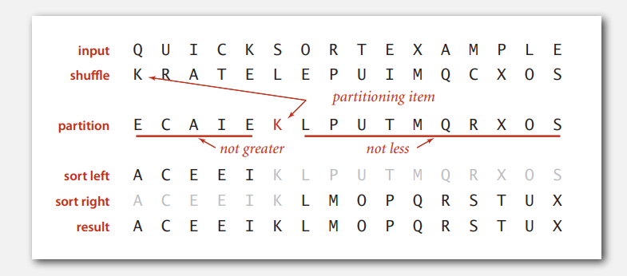​

### Partition

Repeat until *i* and *j* pointers cross.

* Scan *i* from left to right so long as (*a[i]*  < *a[lo]* ).
* Scan *j* from right to left so long as (*a[j]*  > *a[lo]* ).
* Exchange *a[i]*  with *a[j]* .

When pointers cross.

* Exchange *a[lo]*  with *a[j]* .

### Implementation

​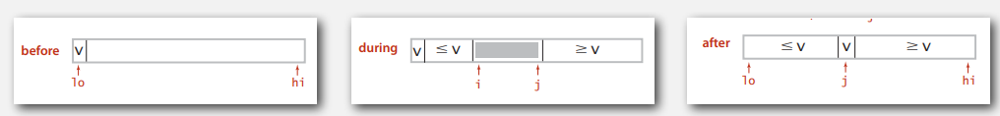​

```Java
import edu.princeton.cs.algs4.StdRandom;

public class Quicksort {
    private static boolean less(Comparable v, Comparable w) {
        return v.compareTo(w) < 0;
    }

    private static void exchange(Object[] a, int i, int j) {
        Object swap = a[i];
        a[i] = a[j];
        a[j] = swap;
    }

    private static int partition(Comparable[] a, int lo, int hi) {
        int i = lo, j = hi + 1;
        while (true) {
            while (less(a[++i], a[lo]))  // find item on left to swap
                if (i == hi)
                    break;

            while (less(a[lo], a[--j]))  // find item on right to swap
                if (j == lo)
                    break;

            if (i >= j)  // check if pointer cross
                break;
            exchange(a, i, j);
        }
        exchange(a, lo, j);  // swap with partitioning item
        return j;  // return index of item now known to be in place
    }

    public static void sort(Comparable[] a) {
        StdRandom.shuffle(a);
        sort(a, 0, a.length - 1);
    }

    private static void sort(Comparable[] a, int lo, int hi) {
        if (hi <= lo) return;
        int j = partition(a, lo, hi);
        sort(a, lo, j - 1);
        sort(a, j + 1, hi);
    }
}

```

### Details

* Partitioning in-place: Using an extra array makes partitioning easier and stable, but is not worth the cost.
* Terminating the loop: Testing whether th epointers cross is a bit trickier than it might seem
* Staying in bounds: The (*j* == *lo*) test is redundant, but the (*i* == *hi*) test is not. Because the *i* pointer is running firstly,  (*i* == *hi*) or (*i* >= *j*) must be satisfied before (*j* == *lo*) becoming true.
* Preserving randomness: **Shuffling is needed for performance guarantee.**
* Equal keys: When duplicates are present, it is (counter-intuitively) better to stop on keys euqal to the partitioning item's key.

### Cost

​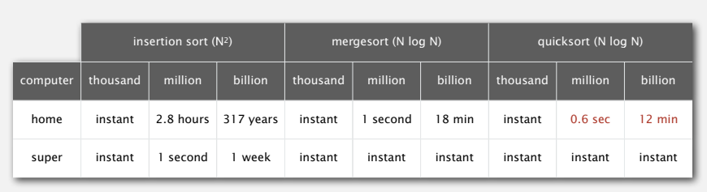​

Good algorithms are better than supercomputers.

Great algorithms are better than good ones.

> Best case

Number of compares is ~*N* lg *N.*

> Worst case

Number of compares is ~ ½ *N*​<sup>2</sup>.

So it's necessary to randomly shuffle the array.

> Average case

* Proposition: The average number of compares *C*​<sub>*N*</sub> to quicksort an array of *N* distinct keys is ~2*N* ln *N*, and the number of exchanges is ~⅓*N* ln *N*.

Note: *C*​<sub>*N*</sub>  is a expectation.

​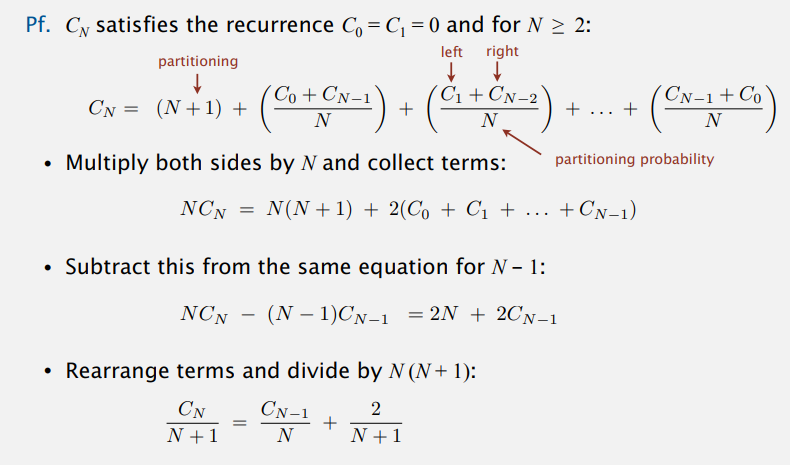​

​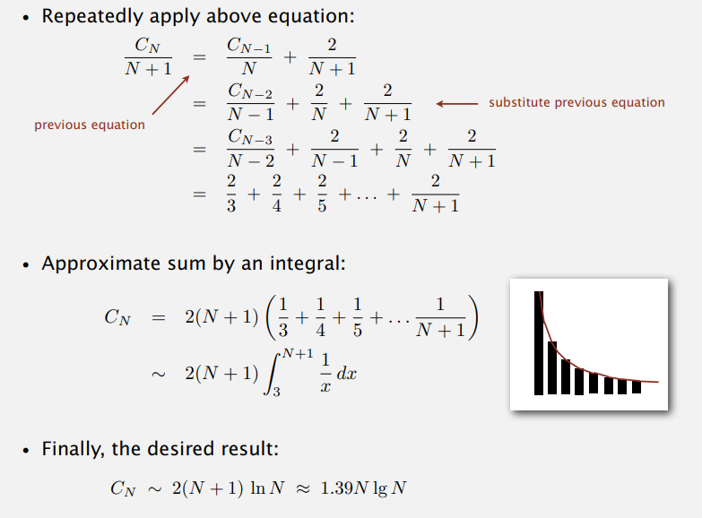​

> Summary

* Worst case: Number of compares is quadratic.

  * *N* + (*N* - 1) + (*N* - 2) + ... + 1 ~ ½*N*​<sup>2</sup>.
  * More likely that your computer is struck by lightning bolt.
* Average case: Number of compares is ~1.39 *N* lg *N*.

  * 39% more compares than mergesort.
  * But faster than mergesort in practice because of less data movement.
* Random shuffle.

  * Probabilistic guarantee against worst case.
  * Basis for math model that can be validated with experiments.
* Caveat emptor: Many textbook implementations go **quadratic** if array

  * is sorted or reverse sorted.
  * has many duplicates (even if randomized)

### Properties

* Proposition: Quicksort is an **in-place** sorting algorithm.

​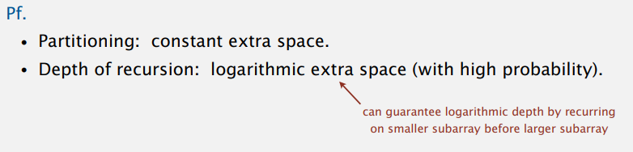​

* Proposition: Quicksort is **not stable**.

### Practical improvements

> Insertion sort small subarrays.

* Enven quicksort has too much overhead for tiny subarrays.
* Cutoff to insertion sort for ≈ 10 items.
* Note: could delay insertion sort until one pass at end.

```Java
import edu.princeton.cs.algs4.Insertion;
import edu.princeton.cs.algs4.StdRandom;

public class Quicksort {
    public static final int CUTOFF = 10;

    private static boolean less(Comparable v, Comparable w) {
        return v.compareTo(w) < 0;
    }

    private static void exchange(Object[] a, int i, int j) {
        Object swap = a[i];
        a[i] = a[j];
        a[j] = swap;
    }

    private static int partition(Comparable[] a, int lo, int hi) {
        int i = lo, j = hi + 1;
        while (true) {
            while (less(a[++i], a[lo]))  // find item on left to swap
                if (i == hi)
                    break;

            while (less(a[lo], a[--j]))  // find item on right to swap
                if (j == lo)
                    break;

            if (i >= j)  // check if pointer cross
                break;
            exchange(a, i, j);
        }
        exchange(a, lo, j);  // swap with partitioning item
        return j;  // return index of item now known to be in place
    }

    public static void sort(Comparable[] a) {
        StdRandom.shuffle(a);
        sort(a, 0, a.length - 1);
    }

    private static void sort(Comparable[] a, int lo, int hi) {
        if (hi <= lo + CUTOFF - 1) {
            Insertion.sort(a, lo, hi);
            return;
        }
        int j = partition(a, lo, hi);
        sort(a, lo, j - 1);
        sort(a, j + 1, hi);
    }
}

```

> Median of sample.

* Best choice of pivot item = median.
* Estimate true median by taking median of sample.
* Median-of-3 (random) items.

​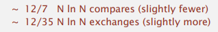​

```Java
import edu.princeton.cs.algs4.Insertion;
import edu.princeton.cs.algs4.StdRandom;

public class Quicksort {
    public static final int CUTOFF = 10;

    private static boolean less(Comparable v, Comparable w) {
        return v.compareTo(w) < 0;
    }

    private static void exchange(Object[] a, int i, int j) {
        Object swap = a[i];
        a[i] = a[j];
        a[j] = swap;
    }

    private static int partition(Comparable[] a, int lo, int hi) {
        int i = lo, j = hi + 1;
        while (true) {
            while (less(a[++i], a[lo]))  // find item on left to swap
                if (i == hi)
                    break;

            while (less(a[lo], a[--j]))  // find item on right to swap
                if (j == lo)
                    break;

            if (i >= j)  // check if pointer cross
                break;
            exchange(a, i, j);
        }
        exchange(a, lo, j);  // swap with partitioning item
        return j;  // return index of item now known to be in place
    }

    public static void sort(Comparable[] a) {
        StdRandom.shuffle(a);
        sort(a, 0, a.length - 1);
    }

    private static int medianOf3(Comparable[] a, int lo, int mi, int hi) {
        // totally 6 kinds
        if (less(a[lo], a[mi])) {  // a[lo] < a[mi]
            if (less(a[hi], a[lo])) {  // a[hi] < a[lo] < a[mi]
                return lo;
            }
            if (less(a[mi], a[hi])) {  // a[lo] < a[mi] < a[hi]
                return mi;
            }
            // a[lo] < a[hi] < a[mi]
            return hi;
        } else {  // a[mi] < a[lo]  
            if (less(a[lo], a[hi])) {  // a[mi] < a[lo] < a[hi]
                return lo;
            }
            if (less(a[hi], a[mi])) {  // a[hi] < a[mi] < a[lo]
                return mi;
            }
            // a[mi] < a[hi] < a[lo]
            return hi;
        }
    }

    private static void sort(Comparable[] a, int lo, int hi) {
        if (hi <= lo + CUTOFF - 1) {
            Insertion.sort(a, lo, hi);
            return;
        }

        int m = medianOf3(a, lo, lo + (hi - lo) / 2, hi);
        exchange(a, lo, m);

        int j = partition(a, lo, hi);
        sort(a, lo, j - 1);
        sort(a, j + 1, hi);
    }
}
```

## Selection

### Introduction

​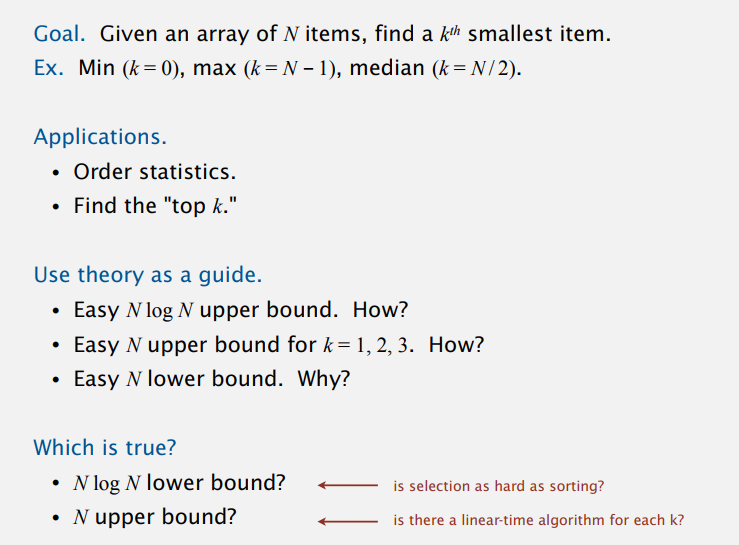​

### Quick-select

> Partition array:

* Entry *a[j]*  is in place.
* No larger entry to the left of *j.*
* No smaller entry to the right of *j*.

Repeat in one subarray, depending on *j*; finished when *j* equals *k*.

​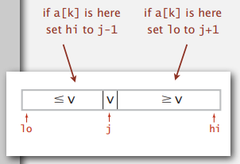​

```Java
import edu.princeton.cs.algs4.StdRandom;

public class QuickSelect {
    private static boolean less(Comparable v, Comparable w) {
        return v.compareTo(w) < 0;
    }

    private static void exchange(Object[] a, int i, int j) {
        Object swap = a[i];
        a[i] = a[j];
        a[j] = swap;
    }

    private static int partition(Comparable[] a, int lo, int hi) {
        int i = lo, j = hi + 1;
        while (true) {
            while (less(a[++i], a[lo]))  // find item on left to swap
                if (i == hi)
                    break;

            while (less(a[lo], a[--j]))  // find item on right to swap
                if (j == lo)
                    break;

            if (i >= j)  // check if pointer cross
                break;
            exchange(a, i, j);
        }
        exchange(a, lo, j);  // swap with partitioning item
        return j;  // return index of item now known to be in place
    }

    public static Comparable select(Comparable[] a, int k) {
        StdRandom.shuffle(a);
        int lo = 0, hi = a.length - 1;
        while (hi > lo) {  // it's not a recursive
            int j = partition(a, lo, hi);
            if (j < k) {  // find in the right part
                lo = j + 1;
            } else if (j > k) {  // find in the left part
                hi = j - 1;
            } else {  // the a[j] is the kth smallest item
                return a[k];
            }
        }
        return a[k];
    }
}

```

### Cost

* Proposition: Quick-select takes **linear** time on average.

​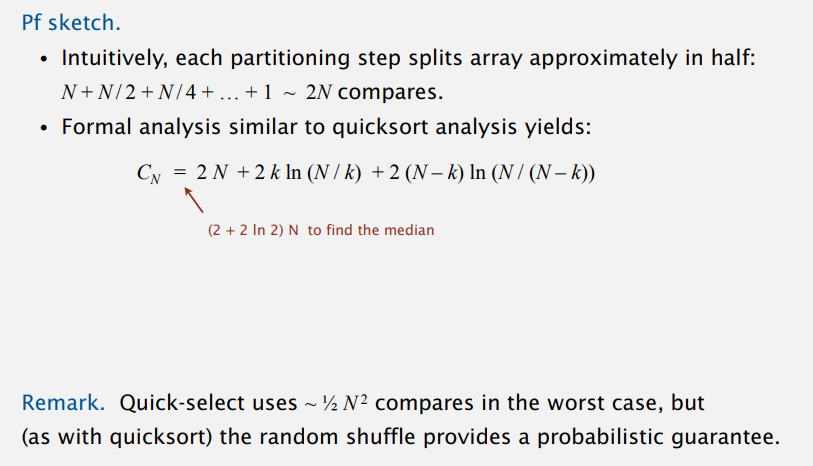​

### Theoretical context for selection

​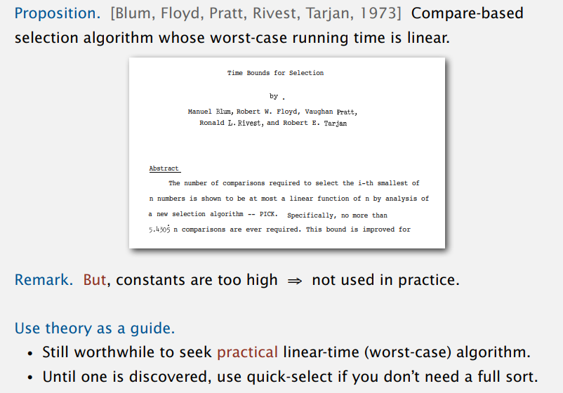​

## Duplicate keys

### How duplicates

Often, purpose of sort is to bring items with equal keys together.

* Sort population by age.
* Remove duplicates from mailing list.
* Sort job applicants by college attended.

Typical characteristics of such applicatons:

* Huge array.
* Small number of key values.

### Sort

​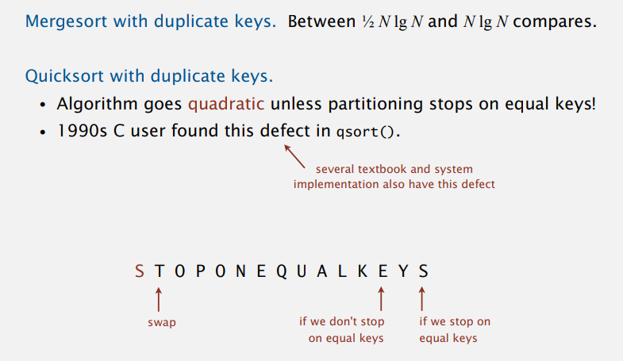​

### The problem

​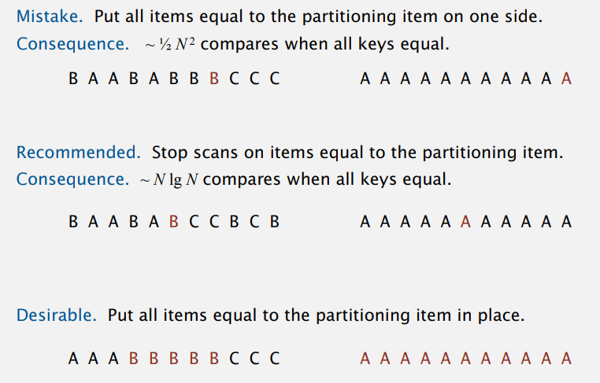​

### Dijkstra 3-way partitioning

**Partition array into 3 parts** so that:

* Entrie between *lt* and *gt* equal to partition item *v*.
* No larger entrie to left of *lt*.
* No smaller entrie to right of *gt*.

​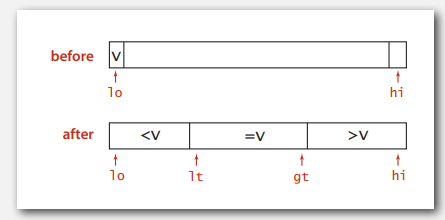​

* Let *v* be partitioning item *a[lo]* .
* Scan *i* from left to right.

  * (*a[i]*  < *v*): exchange *a[lt]*  with *a[i]* ; increment both *lt* and *i*. (do increment *i*)
  * (*a[i]*  > *v*): exchange *a[gt]*  with *a[i]* ; decrement *gt*. (do not increment *i*)
  * (*a[i]*  == *v*): increment *i*.

> trace

​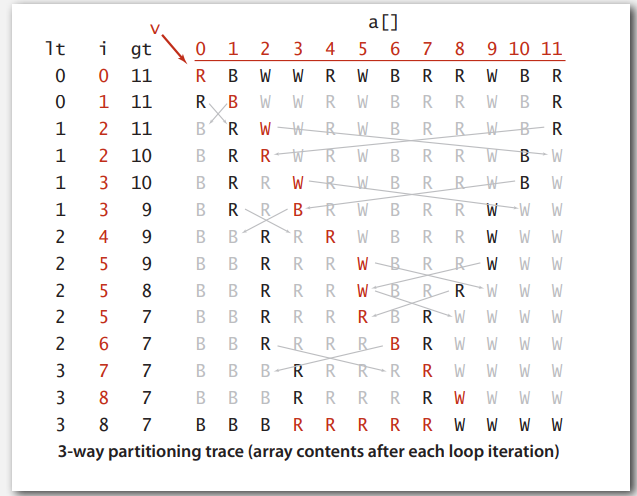​

#### Implementation

```Java
import edu.princeton.cs.algs4.Insertion;
import edu.princeton.cs.algs4.StdRandom;

public class QuickSort3Way {
    private static void exchange(Object[] a, int i, int j) {
        Object swap = a[i];
        a[i] = a[j];
        a[j] = swap;
    }

    public static void sort(Comparable[] a) {
        StdRandom.shuffle(a);
        sort(a, 0, a.length - 1);
    }

    private static void sort(Comparable[] a, int lo, int hi) {
        if (hi <= lo) return;
        int lt = lo, gt = hi;
        Comparable v = a[lo];
        int i = lo;
        while (i <= gt) {
            int cmp = a[i].compareTo(v);
            if (cmp < 0) {
                // a[i] < v
                exchange(a, lt++, i++);
            } else if (cmp > 0) {
                // a[i] > v
                exchange(a, gt--, i);
            } else {
                // a[i] == v
                i++;
            }
        }

        sort(a, lo, lt - 1);
        sort(a, gt + 1, hi);
    }
}

```

​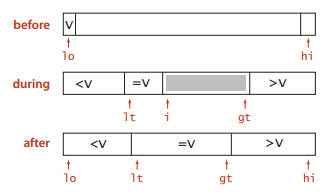​

### Low bound

​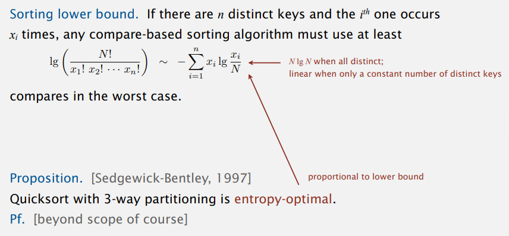​

Randomized quicksort with 3-way partitioning reduces running time from linearithmic to linear in broad class of applications.

## System sorts

### Sorting applications

​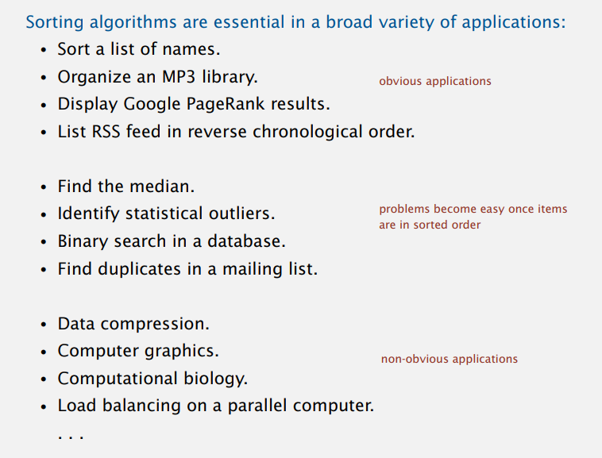​

### Java system sorts

​`Arrays.sort()`​

* Has different method for each primitive type.
* Has a method for data types that implement `Comparable`​.
* Has a method that uses a `Comparator`​.
* Uses tuned quicksort for primitive types; tuned mergesort for objects. (Why?)

  * The designer may think when programmer sorts the reference types, it will be enough space for mergesort. And mergesort is stable.
  * When sorting the primitive types, maybe performance is the most important thing, so use the quicksort while it is unstable but will not influence the consequence.

### Engineering

​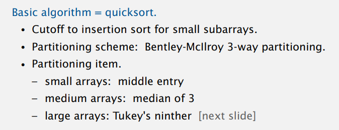​

​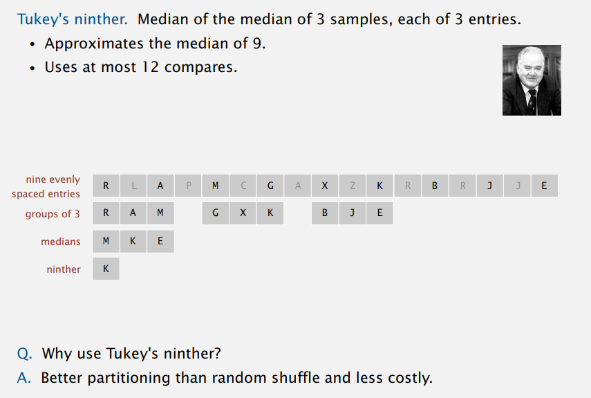​

​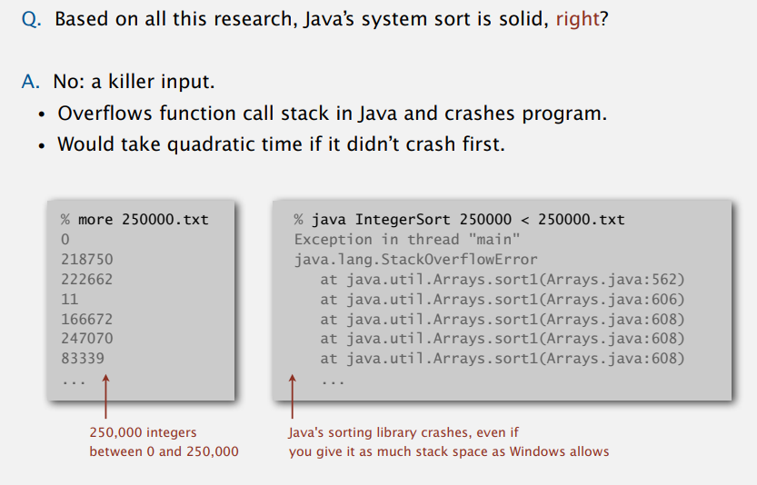​

​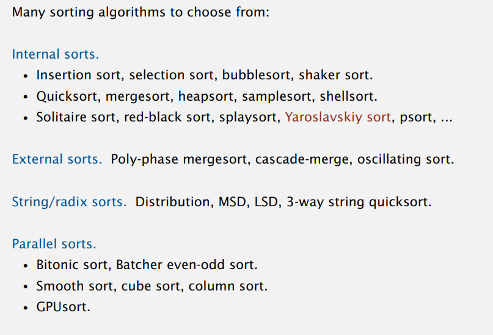​

## Sorting summary

‍

​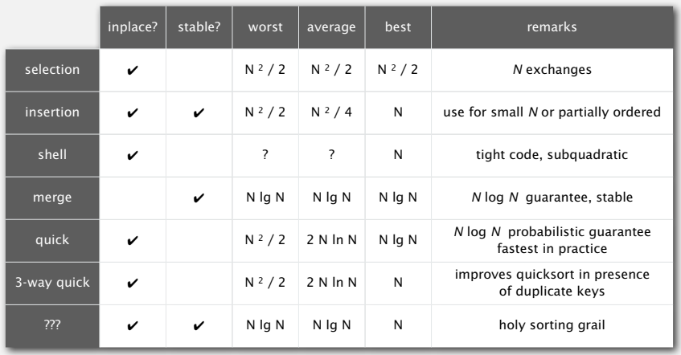​

# Priority Queues

Insert and delete items. Which item to delete?

* **Stack**: Remove the item most recently added.
* **Queue**: Remove the item least recently added.
* **Randomized queue**: Remove a random item.
* **Priority queue**: Remove the **largest** (or **smallest**) item.

> Applications

​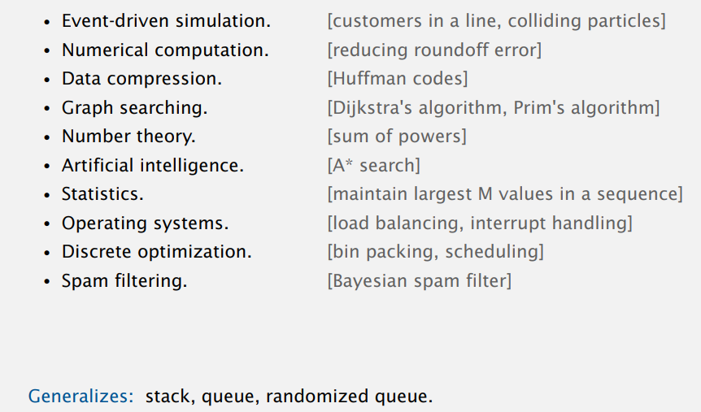​

## API and elementary implementations

### API

Requirement: Generic  items are `Comparable`​.

​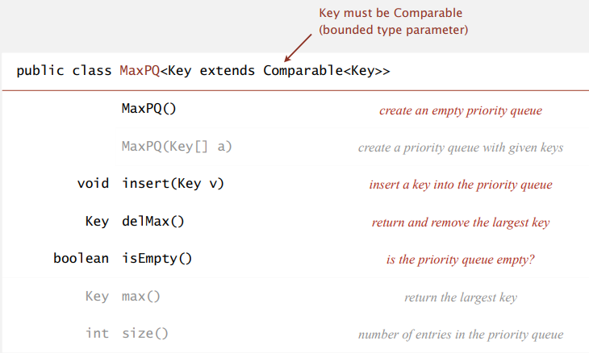​

### Challenge

Find the largest *M* items in a stream of *N* items. (*N* huge, *M* large)

**Constraint**: Not enough memory to store *N* items.

​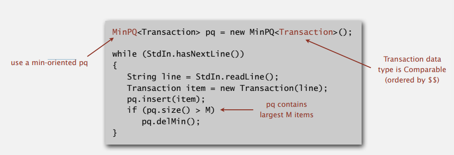​

The items remaining after all data have been read are the largest *M* items.

​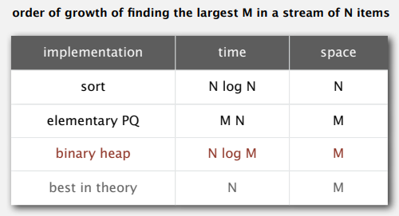​

**sort** is fast, but there is not enough space for it.

### Elementary Implementation

* ordered or unordered
* array or link list

​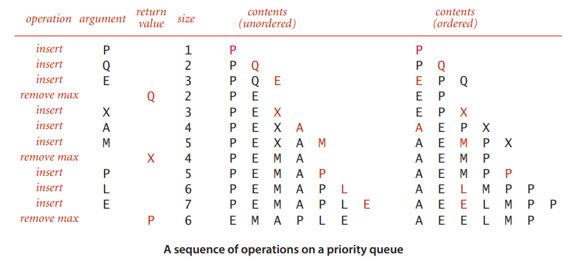​

​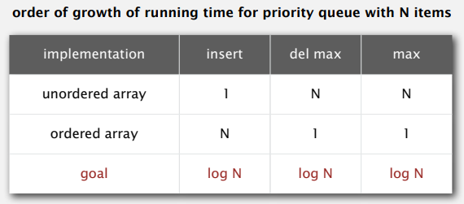​

#### Unordered array

```Java
public class UnorderedMaxPQ<Key extends Comparable<Key>> {
    private Key[] pq;  // pq[i] == ith element on pq
    private int N;  // number of elements on pq

    public UnorderedMaxPQ(int capacity) {
        pq = (Key[]) new Comparable[capacity];
    }

    public boolean isEmpty() {
        return N == 0;
    }

    public void insert(Key x) {
        pq[N++] = x;
    }

    public Key delMax() {
        int max = 0;
        for (int i = 1; i < N; i++) {
            if (less(max, i)) {
                max = i;
            }
        }
        exchange(max, N - 1);  // move the largest item to the end
        return pq[--N];  // remove the end
    }

    private boolean less(int max, int i) {
        return pq[max].compareTo(pq[i]) < 0;
    }

    private void exchange(int v, int w) {
        Key temp = pq[v];
        pq[v] = pq[w];
        pq[w] = temp;
    }
}

```

## Binary heaps

### Binary tree

* **Binary tree**: Empty or node with links to left and right binary trees.
* **Complete tree**: Perfectly balanced, except for bottom level.

​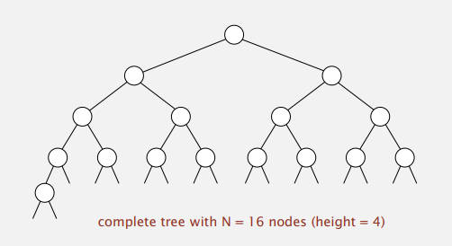​

**Property**: Height of complete tree with *N* nodes is ⎣lg *N*⎦.

**Pf**. Height only increases when *N* is a power of 2.

### Binary heap

* **Binary heap**: Array representation of a heap-ordered complete binary tree.
* **Heap-ordered binary tree**.

  * Keys in nodes.
  * Parent's key **no smaller** than children's keys
* **Array representation**.

  * Indices start at 1.
  * Take nodes in level order.
  * No explicit links needed.

​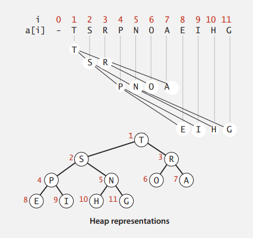​

#### Properties

* **Proposition**: Largest key is *a[1]* , which is **root** of binary tree.
* **Proposition**: Can use array indices to move through tree.

  * Parent of node at *k* is at *k* / 2.
  * Children of node at *k* are at 2*k* and 2*k* + 1

#### Promotion

Scenario: Child's key becomes **larger** key than its parent's key.

**To eliminate the violation**:

* Exchange key in child with key in parent.
* Repeat until heap order restored.

​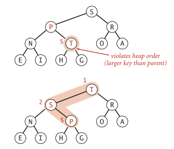​

```Java
private void swim(int k) {
    while (k > 1 && less(k / 2, k)) {  // parent of node at k is at k / 2
        exchange(k, k / 2);
        k = k / 2;
    }
}
```

**Peter principle**: Node promoted to level of incompetence. (A node gets promoted to a level where it finally can't be better than its boss.)

#### Insertion

* **Insert**: Add node at end, then swim it up.
* **Cost**: At most 1 + lg *N* compares.

```Java
public void insert(Key x) {
    pq[++N] = x;
    swim(N);
}
```

#### Demotion

**Scenario**: Parent's key becomes **smaller** than one (or both) of ites children's.

**To eliminate the violation**:

* Exchange key in parent with key in larger child. (should ensure the parent larger than both of its children)
* Repeat until heap order restored.

​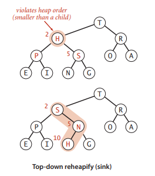​

```Java
private void sink(int k) {
    while (2 * k <= N) {
        int j = 2 * k;
        if (j < N && less(j, j + 1)) {  // children of node at k are 2k and 2k + 1
            j++;
        }
        if (!less(k, j)) {
            break;
        }
        exchange(k, j);
        k = j;
    }
}
```

#### Delete

* **Delete max**: Exchange root with node at end, then sink it down.
* **Cost**: At most 2 lg *N* compares.

​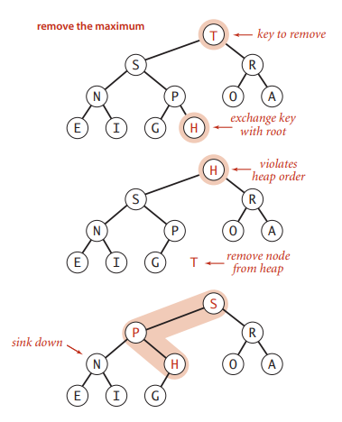​

```Java
public Key delMax() {
    Key max = pq[1];
    exchange(1, N--);
    sink(1);
    pq[N + 1] = null;  // prevent loitering
    return max;
}
```

#### Implementation

​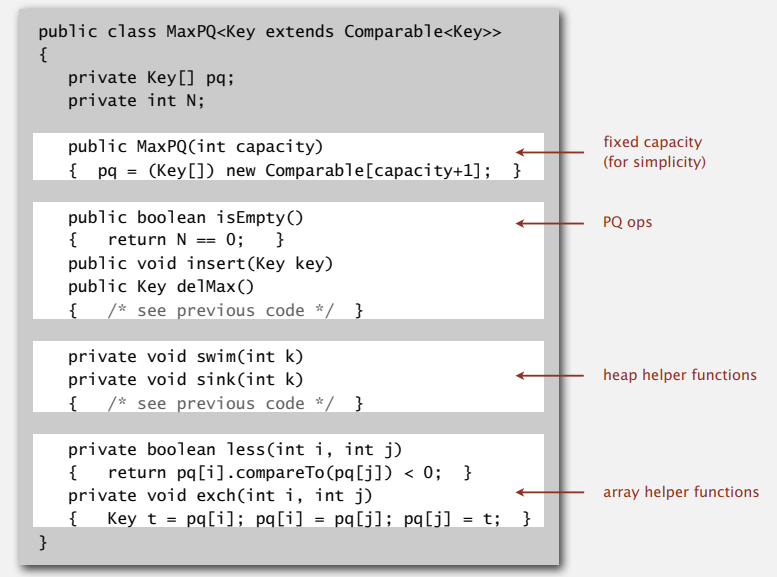​

```Java
public class MaxPQ<Key extends Comparable<Key>> {
    private Key[] pq;  // pq[i] == ith element on pq
    private int N;  // number of elements on pq

    public MaxPQ(int capacity) {
        pq = (Key[]) new Comparable[capacity];
    }


    private void swim(int k) {
        while (k > 1 && less(k / 2, k)) {
            exchange(k, k / 2);
            k = k / 2;
        }
    }

    private void sink(int k) {
        while (2 * k <= N) {
            int j = 2 * k;
            if (j < N && less(j, j + 1)) {
                j++;
            }
            if (!less(k, j)) {
                break;
            }
            exchange(k, j);
            k = j;
        }
    }

    public boolean isEmpty() {
        return N == 0;
    }

    public void insert(Key x) {
        pq[N++] = x;
        swim(N);
    }
  
    public Key delMax() {
        Key max = pq[1];
        exchange(1, N--);
        sink(1);
        pq[N + 1] = null;  // prevent loitering
        return max;
    }

    private boolean less(int max, int i) {
        return pq[max].compareTo(pq[i]) < 0;
    }

    private void exchange(int v, int w) {
        Key temp = pq[v];
        pq[v] = pq[w];
        pq[w] = temp;
    }
}
```

#### Cost

​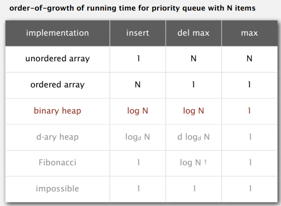​

#### Considerations

* **Immutability of keys**.

  * Assumption: Client does not change keys while they're on the PQ.
  * Best practice: Use **immutable** keys.
* **Underflow and overflow**.

  * Underflow: Throw exception if deleting from empty PQ.
  * Overflow: add no-arg constructor and use resizing array. (leads to log *N* amortized time per operation)
* **Minimum-oriented priority queue**.

  * Replace `less()`​ with `greater()`​.
  * Implement `greater()`​.
* **Other operations**.

  * Remove an arbitrary item.
  * Change the priority of an item.

### Immutability

* Data type: Set of values and operations on those values.
* Immutable data type: Can't change the data type value once created.

​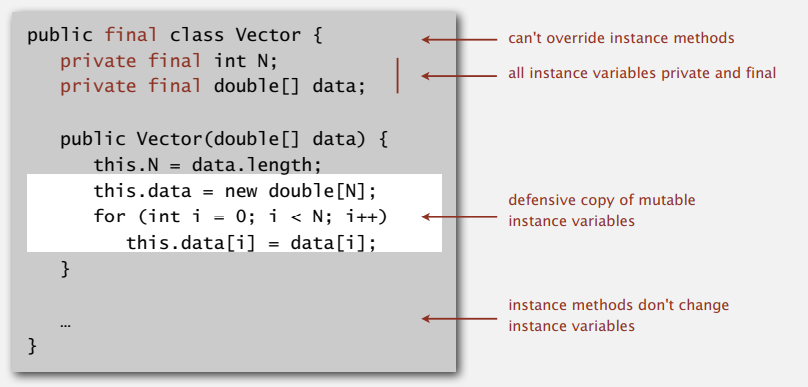​

> Advantages:

* Simplifies debugging.
* Safer in presence of hostile code.
* Simplifies concurrent programming.
* Safe to use as key in priority queue or symbol table.

> Disadvantage:

* Must create new object for each data type value.

Classes should be immutable unless there's a very good reason to make them mutable.… If a class cannot be made immutable, you should still limit its mutability as much as possible. 

## Heapsort

### Basic plan

* Create max-heap with all *N* keys.
* Repeatedly remove the maximum key.

​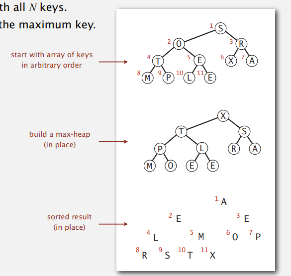​

### Implementation

* Heap construction: Build max heap using bottom-up method.

​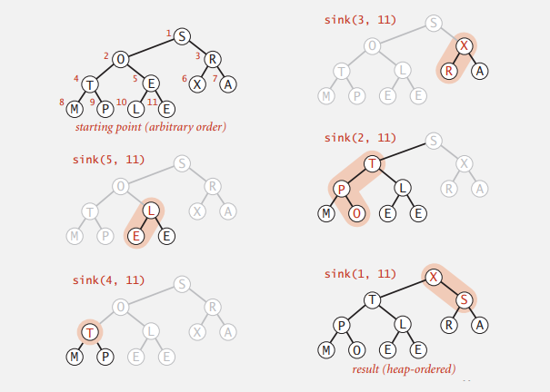​

Start at the half.

* Sortdown: Repeatedly delete the largest remaining item.

  * Remove the maximum, one at a time.
  * Leave in array, instead of nulling out.

​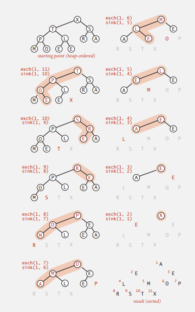​

```Java
public class Heapsort {
    public static void sort(Comparable[] a) {
        int N = a.length;
        for (int k = N / 2; k >= 1; k--) {
            sink(a, k, N);
        }
        while (N > 1) {
            exchange(a, 1, N);
            sink(a, 1, --N);
        }
    }

    private static void sink(Comparable[] a, int k, int N) {
        while (2 * k <= N) {
            int j = 2 * k;
            if (j < N && less(a, j, j + 1)) {
                j++;
            }
            if (!less(a, k, j)) {
                break;
            }
            exchange(a, k, j);
            k = j;
        }
    }

    private static boolean less(Comparable[] a, int i, int j) {
        return a[i].compareTo(a[j]) < 0;
    }

    private static void exchange(Comparable[] a, int v, int w) {
        Comparable temp = a[v];
        a[v] = a[w];
        a[w] = temp;
    }
}

```

### Cost

* Proposition: Heap construction uses <= 2*N* compares and exchanges.
* Proposition: Heapsort uses <= 2*N* lg *N* compares and exchanges.

In-place sorting algorithm with *N* log *N* worst-case.

* Mergesort: no, linear extra space.
* Quicksort: no, quadratic time in worst case.
* Heapsort: yes.

Heapsort is optimal for both time and space, but:

* Inner loop longer than quicksort's.
* Makes poor use of cache memory.
* Not stable.

​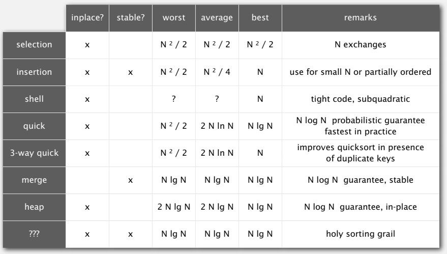​

# Symbol Tables

**Key-value pair abstraction**:

* **Insert** a value with specified key.
* Given a key, **search** for the corresponding value.

## API

Associate one value with each key.

​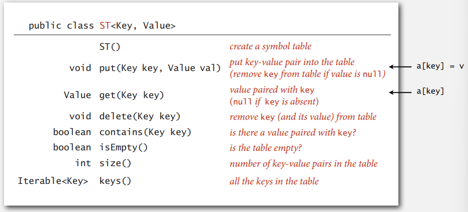​

**Conventions**:

* Values are not `null`​.
* Method `get()`​ returns `null`​ if key not present.
* Method `put()`​ overwrites old value with new value.

### Keys and values

* Key type: Several natural assumptions

  1. Assume keys are `Comparable`​, use `compareTo()`​.
  2. Assume keys are any generic type, use `equals()`​ to test **equality**.
  3. Assume keys are any generic type, use `equals()`​ to test **equality**;  ****  use `hashCode()`​ to scramble key.
* Value: Any generic type.

Best practices: Use immutable types for symbol table keys.

### Equality test

All Java classes inherit a method `equals()`​.

Java requirements: For any references *x*, *y* and *z*:

* Reflexive: `x.equals(x)`​ is always **true**.
* Sysmmetric: `x.equals(y)`​ is **true** if and only if `y.equals(x)`​ is **true**.
* Transitive: if `x.equals(y)`​ and `y.equals(x)`​, then `x.equals(z)`​.
* Non-null: `x.equals(null)`​ is **false**.

Remark: `(x == y)`​ is checking whether the *x* and *y* refer to the same object.

> Implementing equals for user-defined types

​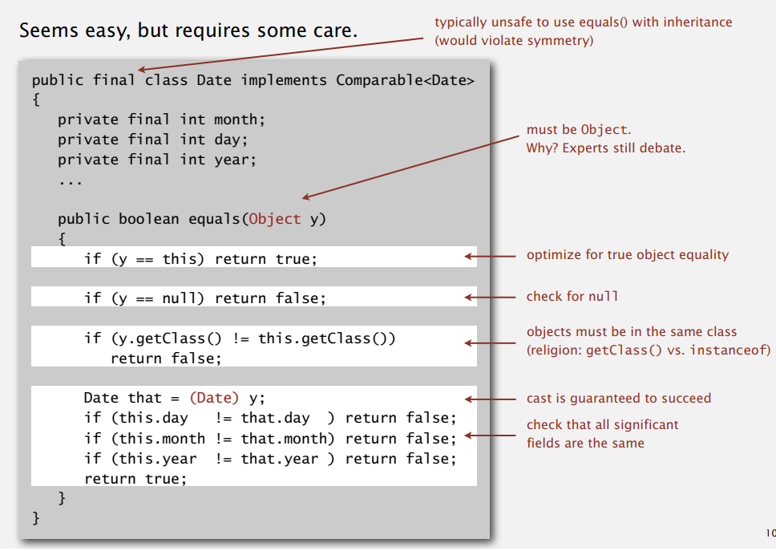​

"Standard" recipe for user-defined types:

* Optimization for reference equality.
* Check against `null`​.
* Check that two objects are of the same type and cast.
* Compare each significant field:

  * if field is a primitive type, use `==`​
  * if field is an object, use `equals()`​
  * if field is an array, apply to each entry (use `Arrays.equals(a,b)`​ or `Arrays.deepEquals(a, b)`​ but not `a.equals(b)`​)

Best practices:

* No need to use calculated fields that depend on other fields.
* Compare fields mostly likely to differ first.
* Make `compareTo()`​ consistent with `equals()`​ (`x.equals(y)`​ if and only if `(x.compareTo(y) == 0)`​)

### Frequency counter

Read a sequence of strings from standard input and print out one that occurs with highest frequency.

​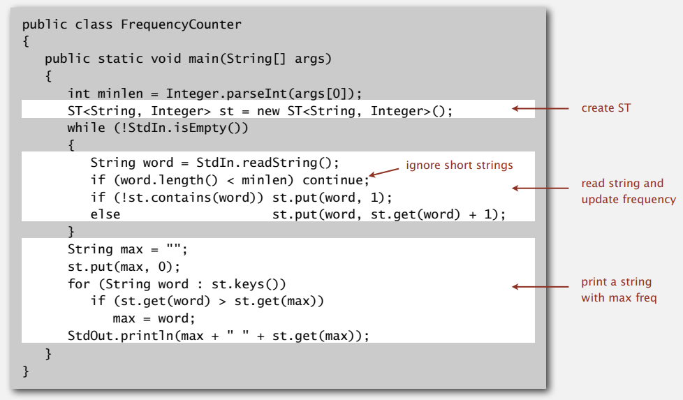​

## Elementary implementations

### Linked list

Maintain an (unordered) linked list of key-value pairs.

* **Search**​: Scan through all keys until find a match.
* **Insert**: Scan through all keys until find a match; if no match add to front.

​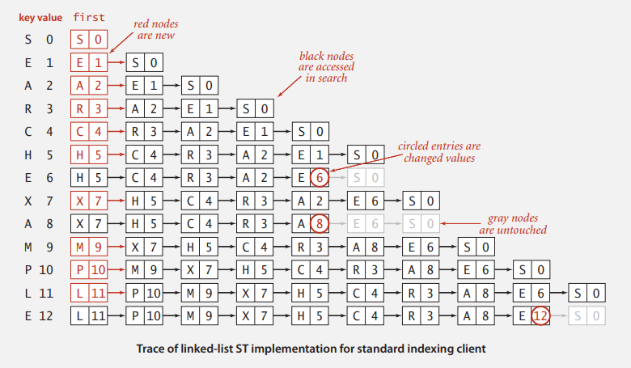​

​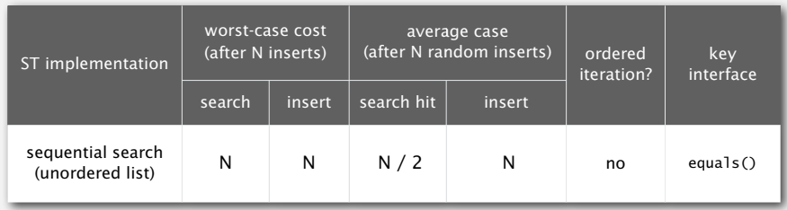​

Challenge: Efficient implementations of both search and insert.

### Binary search in an ordered array

Maintain an ordered array of key-value pairs.

​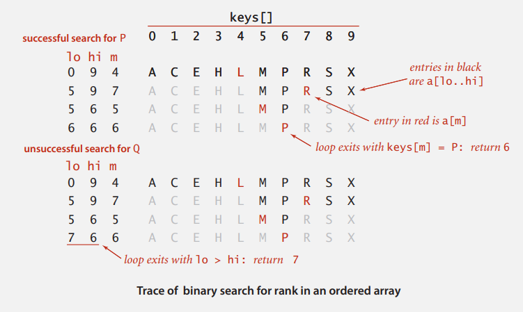​

> Implementation

```Java
public class ST<Key extends Comparable<Key>, Value> {
    private Key[] keys;
    private Value[] vals;
    private int N;

    private boolean isEmpty() {
        return N == 0;
    }

    public Value get(Key key) {
        if (isEmpty()) return null;
        int i = rank(key);
        if (i < N && keys[i].compareTo(key) == 0) {
            return vals[i];
        } else return null;
    }

    private int rank(Key key) {
        int lo = 0, hi = N - 1;
        while (lo <= hi) {
            int mid = lo + (hi - lo) / 2;
            int cmp = key.compareTo(keys[mid]);
            if (cmp < 0) hi = mid - 1;
            else if (cmp > 0) lo = mid + 1;
            else return mid;
        }
        return lo;
    }
}
```

#### Analysis

Problem: To insert, need to shift all greater keys over.

​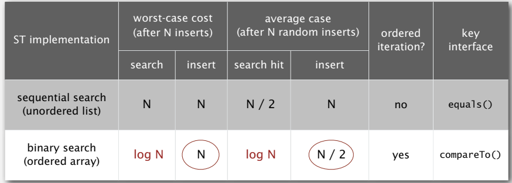​

Good in search, but insertion is still slow.

## Ordered operations

### API

​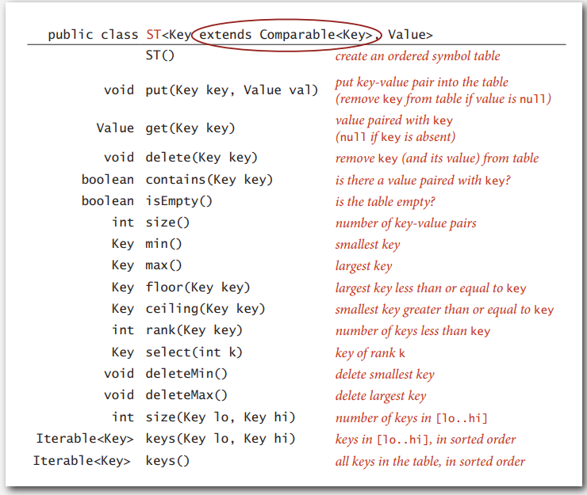​

### Cost

​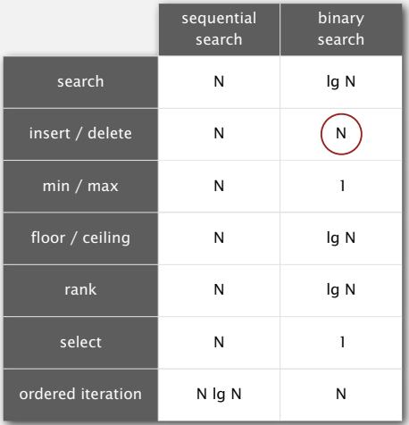​

# Binary Search Trees

## BSTs

### Definition

**Definition**: A BST is a **binary tree** in **symmetric order**.

A binary tree is either:

* Empty.
* Two disjoint binary tress (left and right).

​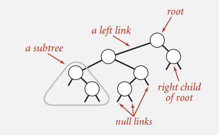​

**Symmetric order**: Each node has a key, and every node's key is:

* Larger than all keys in its left subtree.
* Smaller than all keys in its right subtree.

​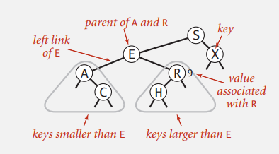​

### Implementation

**Java definition**: A BST is a reference to a root `Node`​.

A `Node`​ is comprised of 4 fields:

* A `Key`​.
* A `Value`​.
* A reference to the left subtree (smaller keys)
* A reference to the right subtree (larger keys)

```Java
public class BST<Key extends Comparable<Key>, Value> {
    private class Node {
        private Key key;
        private Value value;
        private Node left, right;

        public Node(Key key, Value value) {
            this.key = key;
            this.value = value;
        }
    }
}
```

​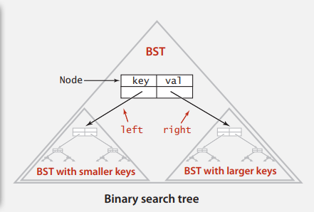​

#### Search

* If less, go left;
* If greater, go right;
* If equal, search hit.

```Java
public Value get(Key key) {
    Node x = root;
    while (x != null) {
        int cmp = key.compareTo(x.key);
        if (cmp < 0) x = x.left;
        else if (cmp > 0) x = x.right;
        else return x.value;
    }
    return null;
}
```

**Cost**: Number of compares is equal to *1 + depth of node*.

#### Insertion

Search for key, then two cases:

* Key in tree -> reset value.
* Key not in tree -> add new node.

```Java
public void put(Key key, Value value) {
    root = put(root, key, value);
}

private Node put(Node node, Key key, Value value) {
    if (node == null) {  // if this key is not exist, then create it (can deal with empty BST)
        return new Node(key, value);
    }
    int cmp = key.compareTo(node.key);
    if (cmp < 0) node.left = put(node.left, key, value);  // key is smaller than root
    else if (cmp > 0) node.right = put(node.right, key, value);  // key is greater than root
    else node.value = value;
    return node;  // most time the function will return node itself, but for the bottom node it will be different
}
```

**Cost**: Number of compares is equal to *1 + depth of node*.

#### Tree shape

* Many BSTs correspond to same set of keys.
* Number of compares for search/insert is equal to *1 + depth of node.*

​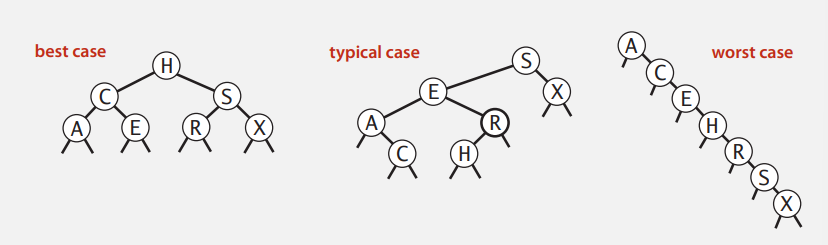​

Tree shape depends on **order of insertion**.

### Analysis

* **Proposition**: If *N* distinct keys are inserted into a BST in **random** order, the expected number of compares for a search/insert is ~ 2 ln *N*.
* Pf. 1-1 correspondence with quicksort paritioning (if array has no duplicate keys).

* **Proposition**: if *N* distinct keys are inserted in random order, expected height of tree is ~ 4.311 ln *N*.

But worst-case height is *N* (exponentially small chance when keys are inserted in random order).

> Summary

​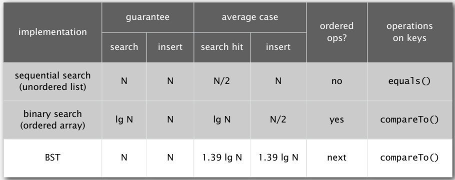​

## Ordered operations

* Minimun: Smallest key in table.
* Maximum: Largest key in table.

​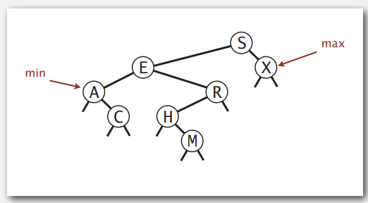​

* Floor: Largest key <= a given key.
* Ceiling: Smallest key >= a given key.

​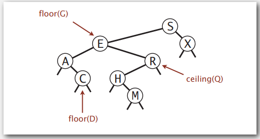​

### Floor

* *k* == root

  * The floor of *k* is *k*.
* *k* < root

  * The floor of *k* is in the left subtree.
* *k* > root

  * The floor of *k* is in the right subtree. (if there is any key <= *k* in right subtree)
  * otherwise it is the key in the root

​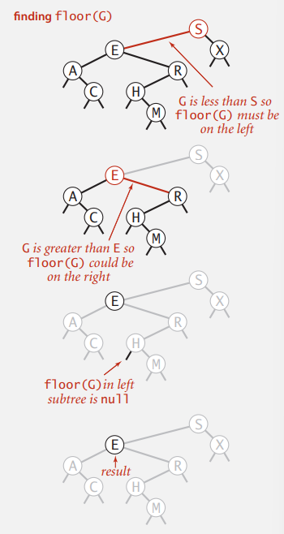​

```Java
public Key floor(Key key) {
    Node x = floor(root, key);
    if (x == null) return null;
    return x.key;
}

private Node floor(Node node, Key key) {
    if (node == null) return null;
    int cmp = key.compareTo(node.key);
    if (cmp == 0) return node;  // k equals the key at root
    else if (cmp < 0) return floor(node.left, key);  // k is less than the key at root
  
    // k is greater than the key at root
    Node t = floor(node.right, key);
    if (t != null) return t;
    else return node;
}
```

### Count

In each node, we store the number of nodes in the subtree rooted at that node;

to implement `size()`​, return the count at the root.

​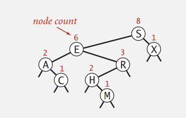​

This facilitates efficient implementation of `rank()`​ and `select()`​

```Java
private class Node {
    private Key key;
    private Value value;
    private Node left, right;
    private int count;

    public Node(Key key, Value value) {
        this.key = key;
        this.value = value;
    }
}

private Node put(Node node, Key key, Value value) {
    if (node == null) {  // if the BST is empty, create a new root node
        return new Node(key, value);
    }
    int cmp = key.compareTo(node.key);
    if (cmp < 0) node.left = put(node.left, key, value);  // key is smaller than root
    else if (cmp > 0) node.right = put(node.right, key, value);  // key is greater than root
    else node.value = value;
    node.count = 1 + size(node.left) + size(node.right);  // counts
    return node;
}

public int size() {
    return size(root);
}

private int size(Node node) {   
    if (node == null) return 0;
    return node.count;
}
```

### Rank

**Rank**: How many keys < *k*

​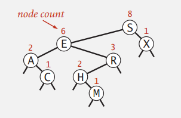​

* *k* is less than root

  * recursive the left of root
* *k* is larger than root

  * add the left of root and the root itself, then recursive the right of root
* *k* is equal to root

  * return the left of root

```Java
public int rank(Key key) {
    return rank(key, root);
}

private int rank(Key key, Node node) {
    if (node == null) return 0;
    int cmp = key.compareTo(node.key);

    if (cmp < 0) return rank(key, node.left);
    else if (cmp > 0) return 1 + size(node.left) + rank(key, node.right);
    else return size(node.left);
}
```

### Inorder traversal

Left-Middle-Right.

* Traverse left subtree.
* Enqueue key.
* Traverse right subtree.

```Java
public Iterable<Key> keys() {
    Queue<Key> q = new Queue<>();
    inorder(root, q);
    return q;
}

private void inorder(Node node, Queue<Key> q) {
    if (node == null) return;
    inorder(node.left, q);
    q.enqueue(node.key);
    inorder(node.right, q);
}
```

### Level-order traversal

a breadth-first traversal where the root is visited first, then all nodes at depth 1 (going from left to right), then all nodes at depth 2 (going from left to right), and so forth.

To code up a level-order traversal, you would use a **queue** instead of a (function-call) **stack**. (BFS)

### Analysis

​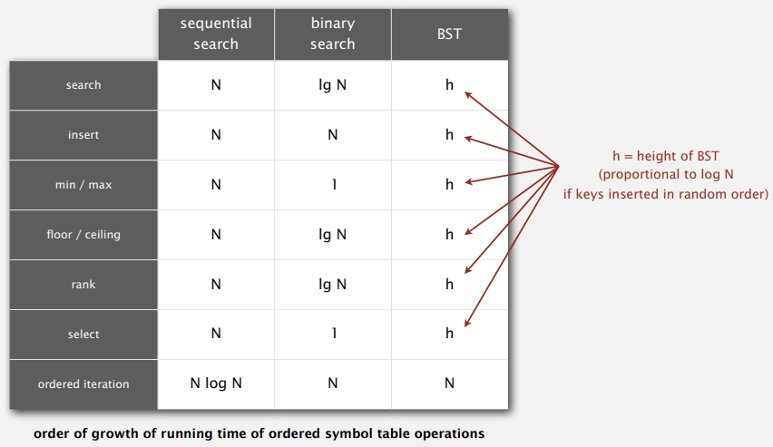​

## Deletion

### Lazy approach

To remove a node with a given key:

* Set its value to `null`​.
* Leave key in tree to guide search (but don't consider it equal in search)

​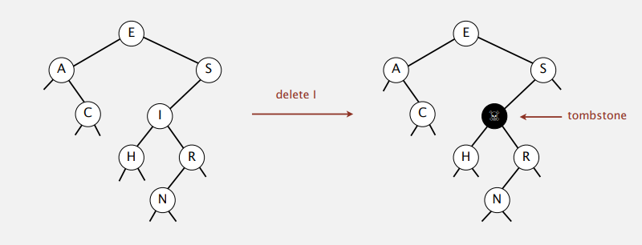​

Cost:  \~ 2 ln *N'*  per insert, search, and delete (if keys in random order), where *N'*  is the number of key-value pairs ever inserted in the BST.

Unsatisfactory solution: Tombstone (memory) overload

### Deleting the minumum

To delete the minimum key:

* Go left until finding a node with a null left link.
* Replace that node by its right link.
* Update subtree counts.

​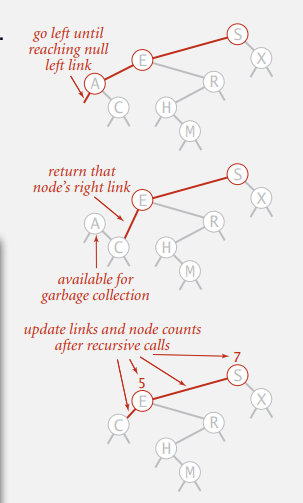​

```Java
public void deleteMin() {
    root = deleteMin(root);
}

private Node deleteMin(Node node) {
    if (node.left == null) return node.right;
    node.left = deleteMin(node.left);
    node.count = 1 + size(node.left) + size(node.right);
    return node;
}
```

### Hibbard deletion

To delete a node with key *k*: search for node *t* containing key *k*.

* 0 children: Delete *t* by setting parent link to null.

  ​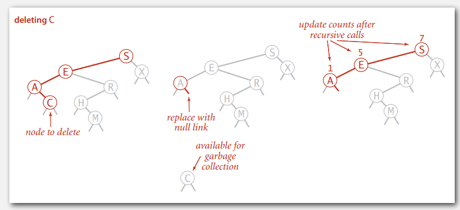​
* 1 children: Delete *t* by replacing parent link. (like delete the minimum)
  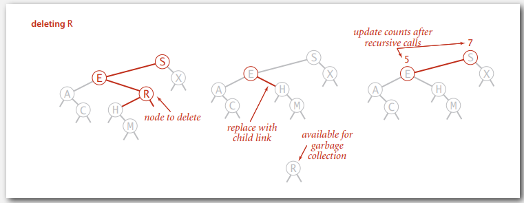​
* 2 children: 

  * Find successor *x* of *t*. (*x* has no left child)
  * Delete the minimum in *t*'s right subtree. (but don't garbage collect *x*​)
  * Put *x* in *t*'s spot. (still a BST)

  ​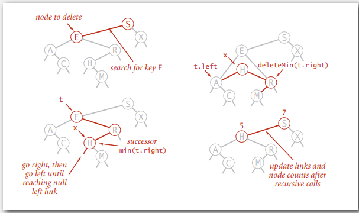​

#### Analysis

Unsatisfactory solution: Not symmertic

Trees not random, but `sqrt(N)`​ per operation.

​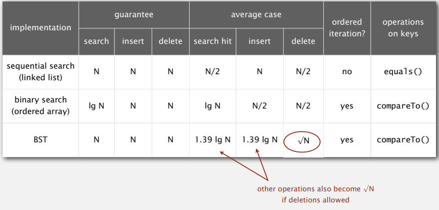​

## Implementation

```Java
import edu.princeton.cs.algs4.Queue;

public class BST<Key extends Comparable<Key>, Value> {
    private class Node {
        private Key key;
        private Value value;
        private Node left, right;
        private int count;

        public Node(Key key, Value value) {
            this.key = key;
            this.value = value;
        }
    }

    private Node root;

    public void put(Key key, Value value) {
        root = put(root, key, value);
    }

    private Node put(Node node, Key key, Value value) {
        if (node == null) {  // if the BST is empty, create a new root node
            return new Node(key, value);
        }
        int cmp = key.compareTo(node.key);
        if (cmp < 0) node.left = put(node.left, key, value);  // key is smaller than root
        else if (cmp > 0) node.right = put(node.right, key, value);  // key is greater than root
        else node.value = value;
        node.count = 1 + size(node.left) + size(node.right);
        return node;
    }

    public Value get(Key key) {
        Node x = root;
        while (x != null) {
            int cmp = key.compareTo(x.key);
            if (cmp < 0) x = x.left;
            else if (cmp > 0) x = x.right;
            else return x.value;
        }
        return null;
    }

    public void delete(Key key) {
        root = delete(root, key);
    }

    private Node delete(Node node, Key key) {
        if (node == null) return null;

        int cmp = key.compareTo(node.key);
        if (cmp < 0) node.left = delete(node.left, key);  // search for key
        else if (cmp > 0) node.right = delete(node.right, key);
        else {
            // has 0 or 1 child, if it has 0 child, then it will return null
            if (node.right == null) return node.left;  // no right child
            if (node.left == null) return node.right;  // no left child

            // has 2 children
            Node t = node;  // replace with successor
            node = min(t.right);
            node.right = deleteMin(t.right);
            node.left = t.left;
        }
        node.count = 1 + size(node.left) + size(node.right);
        return node;
    }

    private Node min(Node node) {
        if (node.left == null) return node;
        return min(node.left);
    }

    public void deleteMin() {
        root = deleteMin(root);
    }

    private Node deleteMin(Node node) {
        if (node.left == null) return node.right;
        node.left = deleteMin(node.left);
        node.count = 1 + size(node.left) + size(node.right);
        return node;
    }

    public Iterable<Key> keys() {
        Queue<Key> q = new Queue<>();
        inorder(root, q);
        return q;
    }

    private void inorder(Node node, Queue<Key> q) {
        if (node == null) return;
        inorder(node.left, q);
        q.enqueue(node.key);
        inorder(node.right, q);
    }

    public Key floor(Key key) {
        Node x = floor(root, key);
        if (x == null) return null;
        return x.key;
    }

    private Node floor(Node node, Key key) {
        if (node == null) return null;
        int cmp = key.compareTo(node.key);
        if (cmp == 0) return node;  // k equals the key at root
        else if (cmp < 0) return floor(node.left, key);  // k is less than the key at root

        // k is greater than the key at root
        Node t = floor(node.right, key);
        if (t != null) return t;
        else return node;
    }

    public int size() {
        return size(root);
    }

    private int size(Node node) {
        if (node == null) return 0;
        return node.count;
    }

    public int rank(Key key) {
        return rank(key, root);
    }

    private int rank(Key key, Node node) {
        if (node == null) return 0;
        int cmp = key.compareTo(node.key);

        if (cmp < 0) return rank(key, node.left);
        else if (cmp > 0) return 1 + size(node.left) + rank(key, node.right);
        else return size(node.left);
    }

}

```

# Balanced Search Tree

​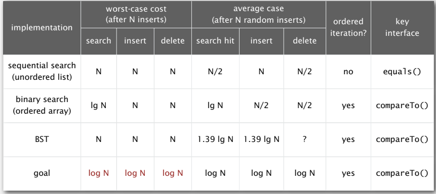​

Challenge: Guarantee performance.

## 2-3 search trees

Allow 1 or 2 keys per node.

* 2-node: one key, two children.
* 3-node: two key, three children.

Sysmetric order: inorder traversal yields keys in ascending order.

Perfect balance: Every path from root to null link has same length.

​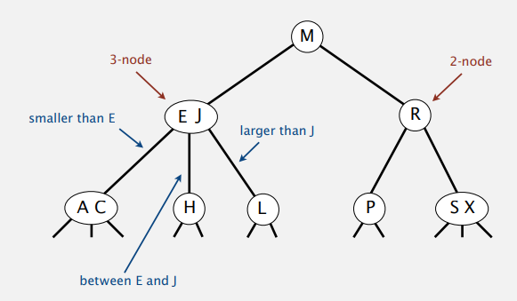​

### Search

* Compare search key against keys in node.
* Find interval containing search key.
* Follow associated link (recursively).

### Insetion

> Insertion into a 2-node at bottom:

* Search for keys, as usual.
* Replace 2-node with 3-node.

> Insertion into a 3-node at bottom:

* Add new key to 3-node to create temporary 4-node.
* Move middle key in 4-node into parent.
* Repeat up the tree, as necessary.
* If you reach the root and it's a 4-node, split it into three 2-nodes.

The height of a 2–3 tree increases only when the root node splits, and this happens only when every node on the search path from the root to the leaf where the new key should be inserted is a 3-node.

### Local transformations

Splitting a 4-node is a **local** transformation: constant number of operations.

​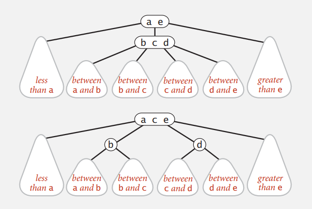​

Those local transformation convert a 2-node to 3-node or 3-node to 4-node, and then split and pass a node up.

### Global properties

**Invariants**: Maintains symmetric order and perfect balance.

Pf. Each transformation maintains symmetric order and perfect balance

​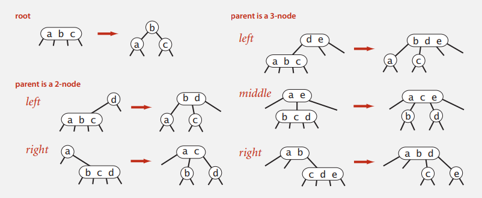​

### Analysis

**Perfect balance**: Every path from root to null link has same length.

​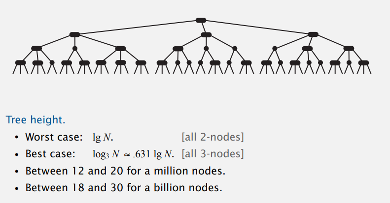​

Guaranteed **logarithmic** performance for search and insert.

​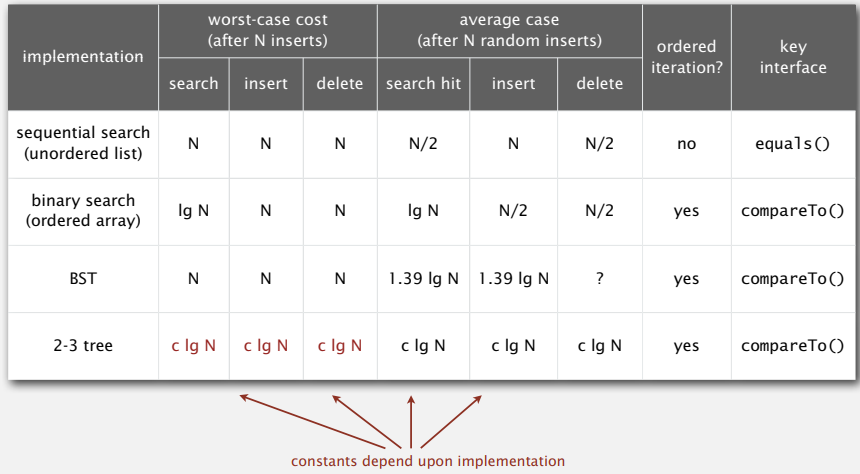​

### Implementation

Direct implementation is complicated, because:

* Maintaining multiple node types is cumbersome.
* Need multiple compares to move down tree.
* Need to move back up the tree to split 4-nodes.
* Large number of cases for splitting.

Could do it, but there's a better way!

## Red-black BSTs

### Left-learning red-black BSTs

1. Represent 2-3 tree as a BST.
2. Use "internal" left-learning links as "glue" for 3-nodes.

​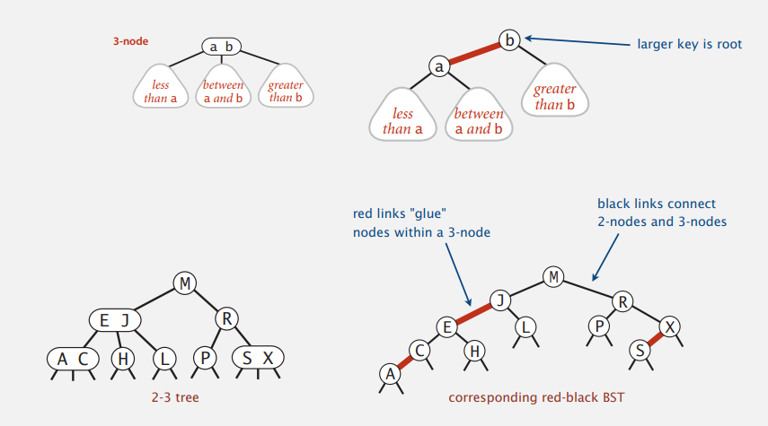​

A BST such that:

* No node has two red link connected to it.
* Every path from root to null link has the same number of **black links**. (perfect blank balance)
* Red links lean left.

​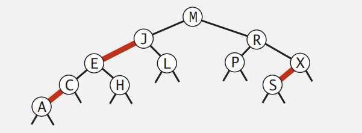​

**Key property**: 1-1 correspondence between 2-3 and LLRB.

​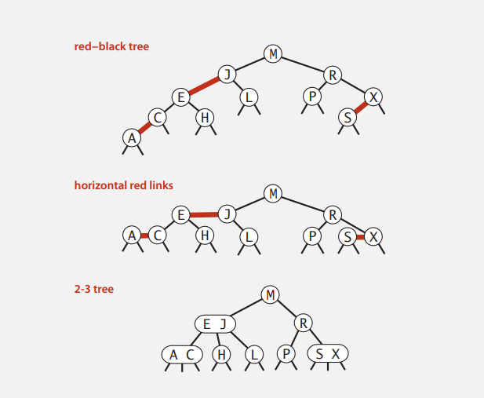​

### **Observation**

Search is the same as for elementary BST (ignore color). (But runs faster because of better balance)

```Java
public Value get(Key key) {
    Node x = root;
    while (x != null) {
        int cmp = key.compareTo(x.key);
        if (cmp < 0) x = x.left;
        else if (cmp > 0) x = x.right;
        else return x.value;
    }
    return null;
}
```

Most other ops (e.g., floor, iteration, selection) are also identical.

### Representation

Each node is pointed to by precisely one link (from its parent) -> can encode color of links in nodes.

```Java
private static final boolean RED = true;
private static final boolean BLACK = false;
private Node root;

private class Node {
    private Key key;
    private Value value;
    private Node left, right;
    boolean color;  // color of parent link

    public Node(Key key, Value value) {
        this.key = key;
        this.value = value;
    }
}

private boolean isRed(Node x) {
    if (x == null) return false;  // null links are black
    return x.color == RED;
}
```

​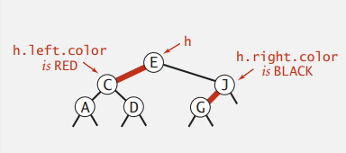​

### Basic Operations

#### Left rotation

Orient a (temporarily) right-leaning red link to lean left.

```Java
private Node rotateLeft(Node h) {
    assert isRed(h.right);
    Node x = h.right;
    h.right = x.left;
    x.left =  h;
    x.color = h.color;
    h.color = RED;
    return x;  // set x as new root
}
```

​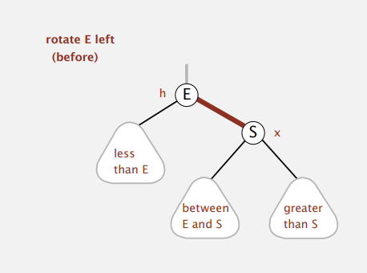​

​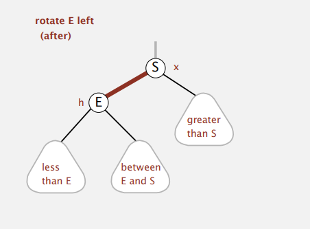​

**Invariants**: Maintains symmetric order and perfect black balance.

#### Right rotation

Orient a left-leaning red link to (temporarily) lean right.

```Java
private Node rotateRight(Node h) {
    assert isRed(h.left);
    Node x = h.left;
    h.left = x.right;
    x.right = h;
    x.color = h.color;
    h.color = RED;
    return x;
}
```

​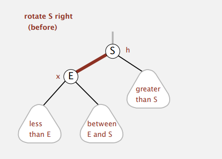​

​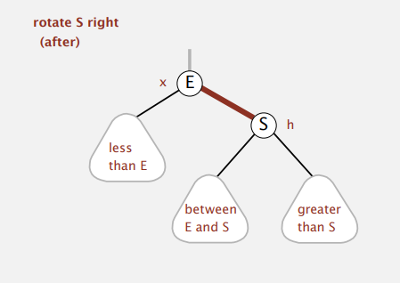​

#### Color flip

Recolor to split a (temporary) 4-node.

```Java
private void flipColors(Node h) {
    assert !isRed(h);
    assert isRed(h.left);
    assert isRed(h.right);
    h.color = RED;
    h.left.color = BLACK;
    h.right.color = BLACK;
}
```

​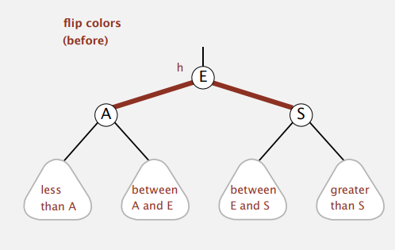​

​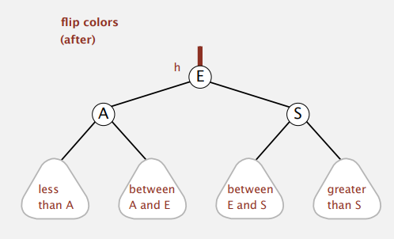​

### Insertion

**Basic strategy**: Maintain 1-1 correspondence with 2-3 trees by applying elementary red-black BST operations.

​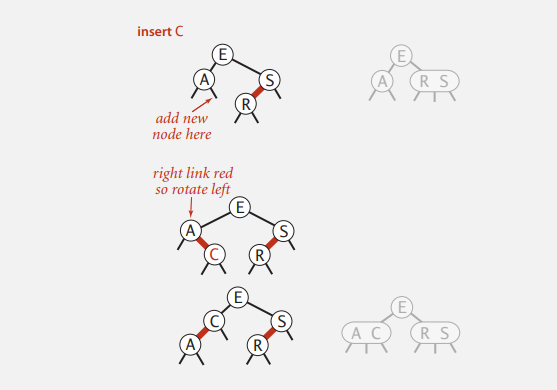​

> 1. Insert into a tree with exactly 1 node.

​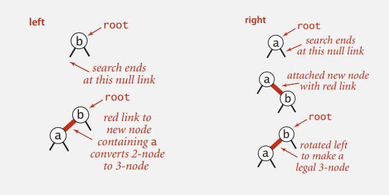​

> Case1: Insert into a 2-node at the bottom

* Do standard BST insert; color new link red.
* If new red link is a right link, rotate letf.

​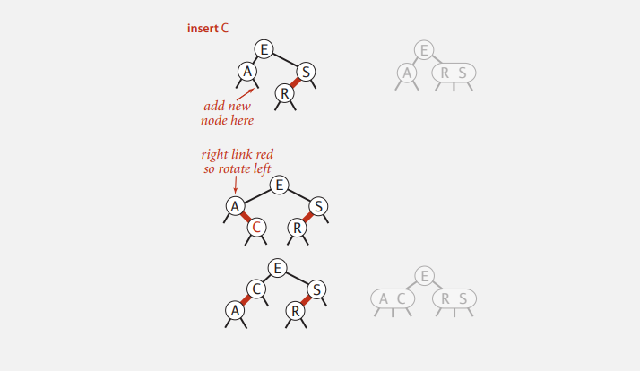​

> 2. Insert into a tree with exactly 2 nodes.

​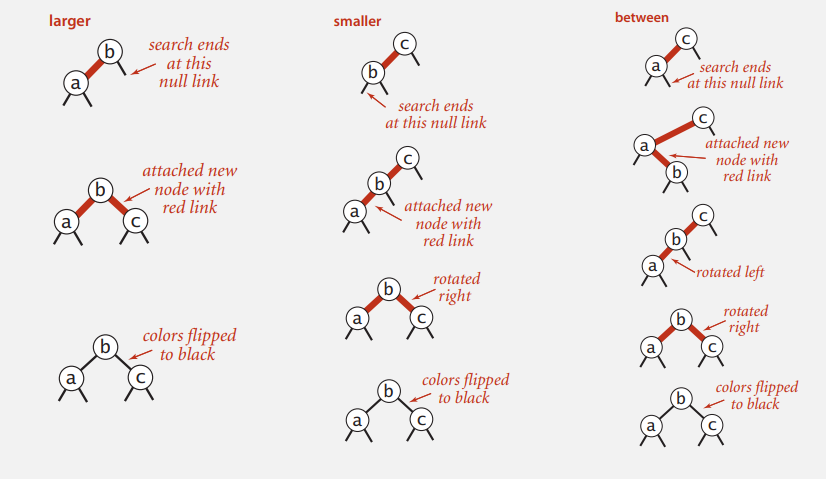​

> Case2: Insert into a 3-node at the bottom.

* Do standard BST insert; color new link red.
* Rotate to balance the 4-node (if needed).
* Flip colors to pass red link up one level.
* Rotate to make lean left (if needed).
* Repeat case 1 or case 2 up the tree (if needed).

​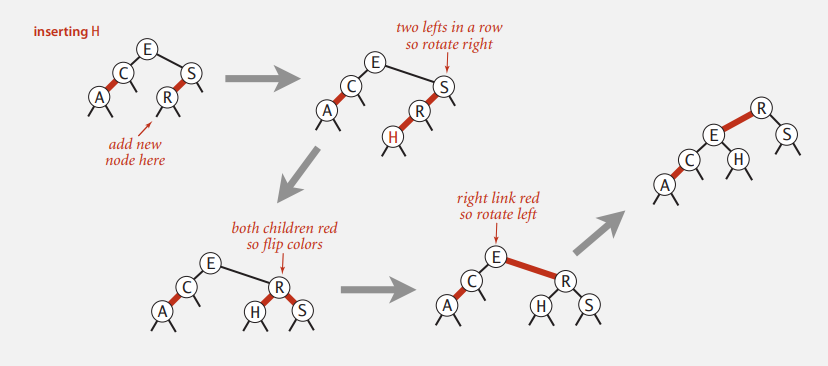​

### Implementation

​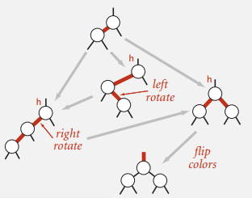​

**Same code for all cases**:

* Right child red, left child black: **rotate left**.
* Left child, left-left grandchild red: **rotate right**.
* Both children red: **flip colors**.

```Java
public class RBBST<Key extends Comparable<Key>, Value> {
    private static final boolean RED = true;
    private static final boolean BLACK = false;
    private Node root;

    private class Node {
        private Key key;
        private Value value;
        private Node left, right;
        boolean color;

        public Node(Key key, Value value, boolean color) {
            this.key = key;
            this.value = value;
            this.color = color;
        }
    }

    private boolean isRed(Node x) {
        if (x == null) return false;
        return x.color == RED;
    }

    private Node rotateLeft(Node h) {
        assert isRed(h.right);
        Node x = h.right;
        h.right = x.left;
        x.left = h;
        x.color = h.color;
        h.color = RED;
        return x;
    }

    private Node rotateRight(Node h) {
        assert isRed(h.left);
        Node x = h.left;
        h.left = x.right;
        x.right = h;
        x.color = h.color;
        h.color = RED;
        return x;
    }

    private void flipColors(Node h) {
        assert !isRed(h);
        assert isRed(h.left);
        assert isRed(h.right);
        h.color = RED;
        h.left.color = BLACK;
        h.right.color = BLACK;
    }

    private Node put(Node h, Key key, Value value) {
        if (h == null) return new Node(key, value, RED);  // insert at bottom and color it red

        int cmp = key.compareTo(h.key);
        if (cmp < 0) h.left = put(h.left, key, value);
        else if (cmp > 0) h.right = put(h.right, key, value);
        else h.value = value;

        if (isRed(h.right) && !isRed(h.left)) h = rotateLeft(h);  // lean left
        if (isRed(h.left) && !isRed(h.right)) h = rotateRight(h);  // balance 4-node
        if (isRed(h.right) && isRed(h.left)) flipColors(h);  // split 4-node

        return h;
    }

    public void put(Key key, Value value) {
        root = put(root, key, value);
    }

    public Value get(Key key) {
        Node x = root;
        while (x != null) {
            int cmp = key.compareTo(x.key);
            if (cmp < 0) x = x.left;
            else if (cmp > 0) x = x.right;
            else return x.value;
        }
        return null;
    }

}

```

### Analysis

* **Proposition**: Height of tree is <= 2 lg *N* in the worst case.
* Pf.

  * Every path from root to null link has same number of black links.
  * Never two red links in-a-row.

* **Property**: Height of tree is ~ 1.00 lg *N* in typical applications.

​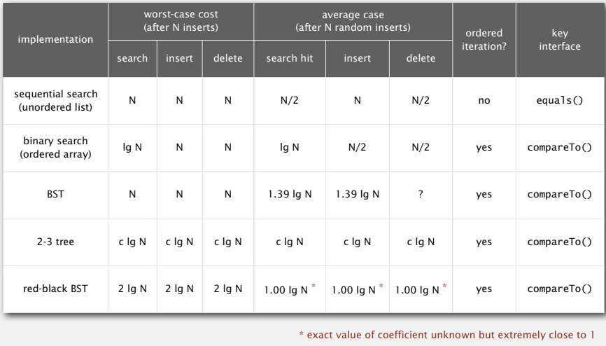​

The height of any red–black BST on *n* keys (regardless of the order of insertion) is guaranteed to be between log⁡<sub>2</sub> *n* and 2 log<sub>2</sub> *n*.

## B-trees

### File system model

​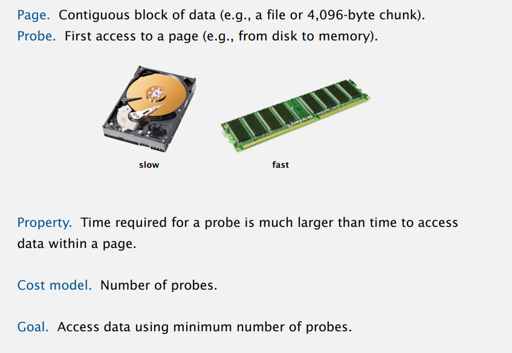​

### B-trees

Generalize 2-3 trees by allowing up to *$M$*​$- 1$ key-link pairs per node (rest one for temporary key). (choose *$M$* as large as possible so that $M$ links fit in a page)

* At least 2 key-link pairs at root.
* At least *$M$*​$/ 2$ key-link pairs in other nodes.
* External nodes contain client keys.
* Internal nodes contain copies of keys to guide search.

​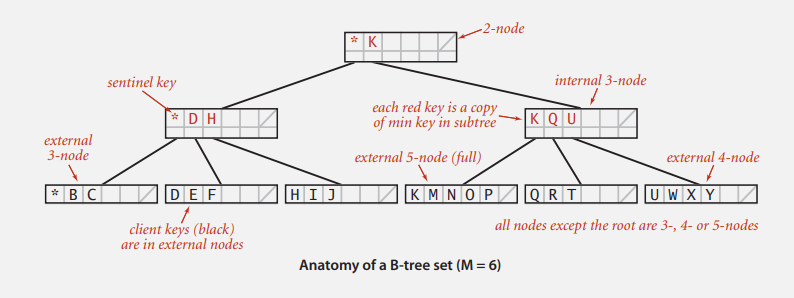​

#### Search

* Start at root.
* Find interval for search key and take corresponding link.
* Search terminates in external node.

​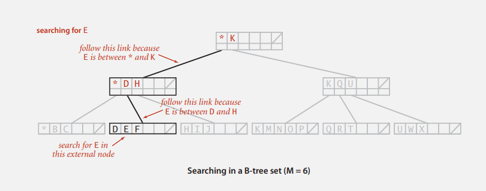​

#### Insertion

* Search for new key.
* Insert at bottom.
* Split nodes with *$M$* key-link pairs on the way up the tree.

​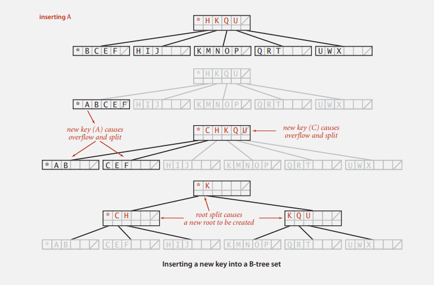​

#### Analysis

* **Proposition**: A search or an insertion in a B-tree of order *$M$* with *$N$* keys requires between $log_{M-1}N$ and $log_{M/2}N$ probes.
* Pf. All internal nodes (besides root) have between *$M$*​$/ 2$ and *$M$*​$- 1$ links.

In practice: Number of probes is at most 4.

Optimization: Always keep root page in memory.

​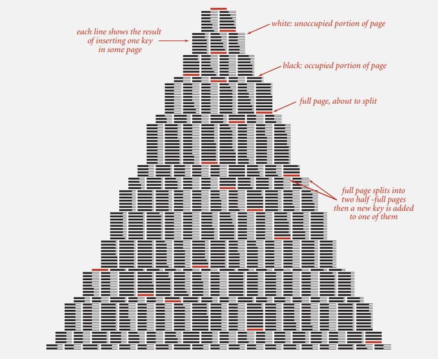​

### Balanced trees in the wild

​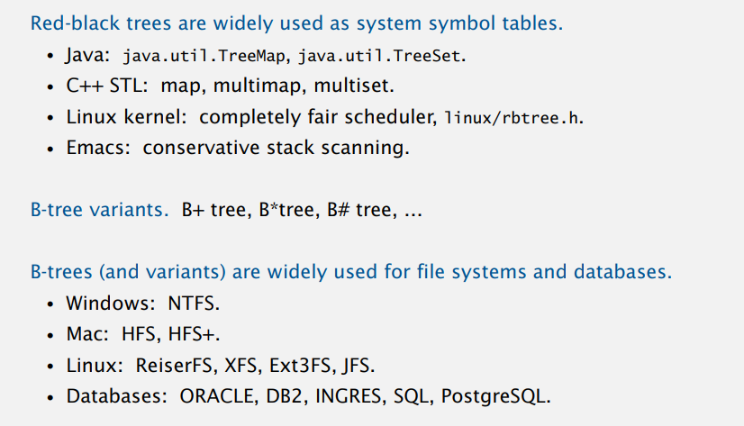​

# Geometric Application Of BSTs

​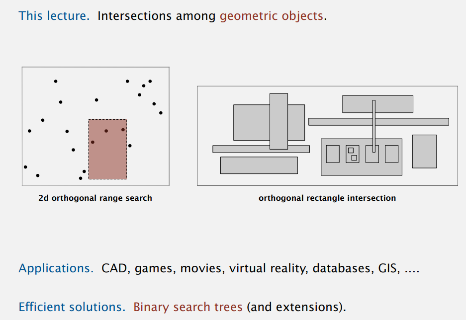​

## 1d range search

Extension of ordered symbol table.

* Insert key-value pair.
* Search for key *k*.
* Delete key *k*.
* Range search: find all keys between *k*​*<sub>1</sub>* and *k*​*<sub>2</sub>*.
* Range count: number of keys between *k*​*<sub>1</sub>* and *k*​*<sub>2</sub>*.

**Geometric interpretation**:

* Keys are point on a **line**.
* Find / count points in a given **1d interval**.

​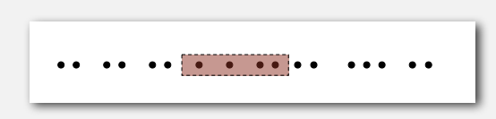​

### Elementary implementation

* Unordered list: Fast insert (O(1)), slow range search (O(n)).
* Ordered array: Slow insert (O(n)), binary search for *k*​*<sub>1</sub>* and *k*​*<sub>2</sub>*  to do range search (O(log n)).

​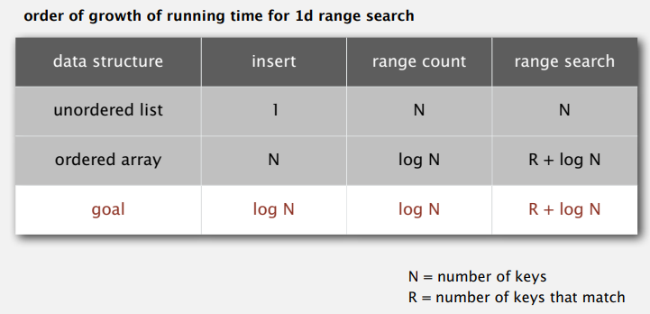​

### BST implementation

#### 1d range count

​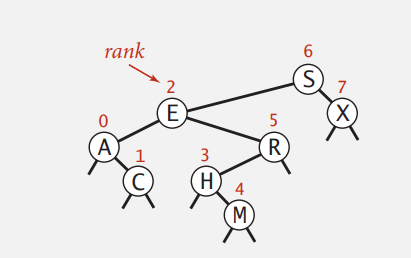​

```Java
public int size(Key lo, Key hi) {
    if (contains(hi)) return rank(hi) - rank(lo) + 1;
    else return rank(hi) - rank(lo);
}
```

* Proposition: Running time proportional to log *N*.
* Pf: Nodes examined = search path to *lo* + search path to *hi*.

#### 1d range search

Find all keys between *lo* and *hi*:

* Recursively find all keys in left subtree (if any could fall in range).
* Check key in current node.
* Recursively find all keys in right subtree (if any could fall in range).

​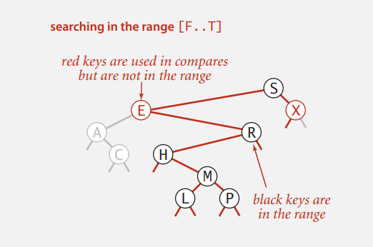​

* Proposition: Running time proportional to *R* + log *N*.
* Pf: Nodes examines = search path to *lo* + search path to *hi* + matches.

## Line segment intersection

​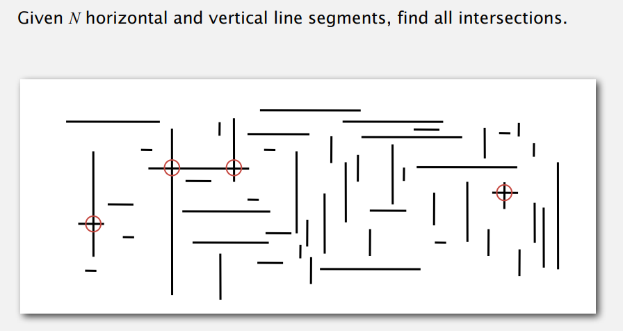​

* Quadratic algorithm: Check all pairs of line segments for intersection.
* Nondegeneracy assumption: All *x*- and *y*-coordinates are distinct.

### Sweep-line algorithm

**Sweep verical line from left to right**:

* *x*-coordinates define events.
* *h*-segment (left endpoint): insert *y*-coordinate into BST.

  ​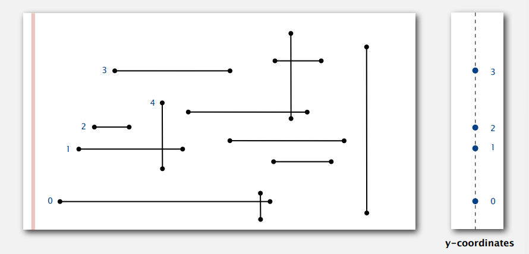​
* *h*-segment (right endpoint): remove *y*-coordinate from BST.

  ​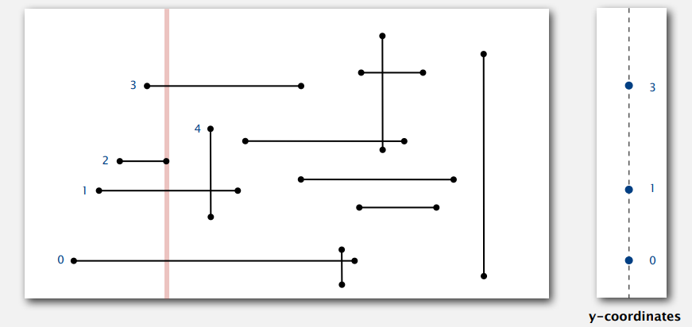​
* *v*-segment: range search for interval of *y*-endpoints.

  ​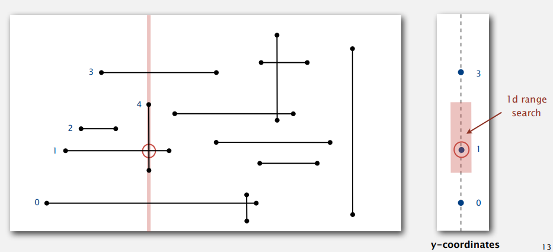​

* Proposition: The sweep-line algorithm takes time proportional to *N* log *N* + *R* to find all *R* intersections among *N* orthogonal line segements.

​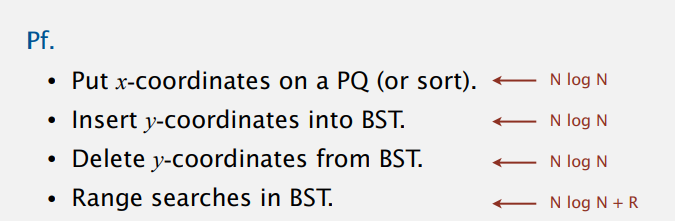​

Sweep line reduces 2d orthogonal line segment intersection search to 1d range search.

## kd trees

### 2-d orthogonal range search

Extension of ordered symbol-table to 2d keys:

* Insert a 2d key.
* Delete a 2d key.
* Search for a 2d key.
* Range search: find all keys that lie in a 2d range.
* Range count: number of keys that lie in a 2d range.

​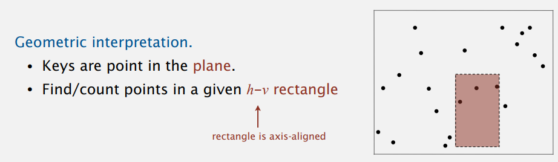​

Appications:

* Networking
* circuit design
* databases

#### Grid implementation

* Divide space into *M*-by-*M* grid of squares.
* Create list of points contained in each square.
* Use 2d array to directly index relevant square.
* Insert: add(x, y) to list for corresponding square.
* Range search: examine only squares that intersect 2d range query.

​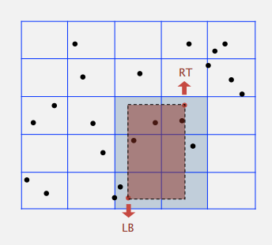​

##### Analysis

**Space-time tradeoff**:

* Space: *M*​<sup>*2*</sup> + *N.*
* Time: 1 + *N / M*​*<sup>2</sup>* per square examined, on average.

​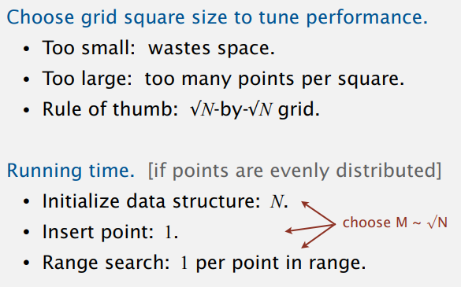​

Fast, simple solution for evenly-distributed points.

> Problem

* List are too long, even though average length is short.

  ​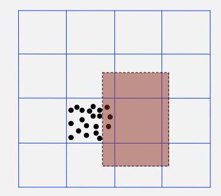​
* Need data structure that adapts gracefully to data.
* ​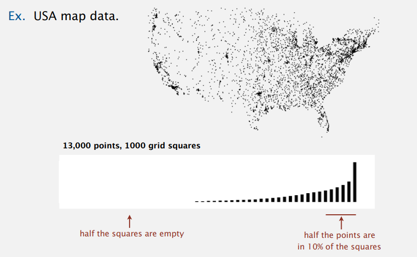​

#### Space-partitioning trees

use a **tree** to represent a recursive subdivison of 2d space.

* Grid: Divide space uniformly into squares.
* 2d tree: Recursively divide space into two halfplanes.
* Quadtree: Recursively divide space into four quadrants.
* BSP tree: Recursively divide space into two regions.

​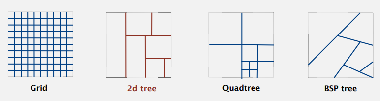​

#### 2d tree

##### Construction

Recursively divide space into two halfplanes.

​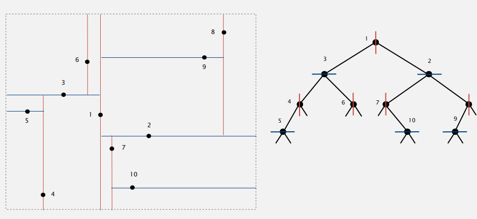​

> Data stucture

BST, but alternate using *x*- and *y*-coordinates as key. (change the compareTo())

* Search gives rectangle containing point.
* Insert further subdivides the plane.

​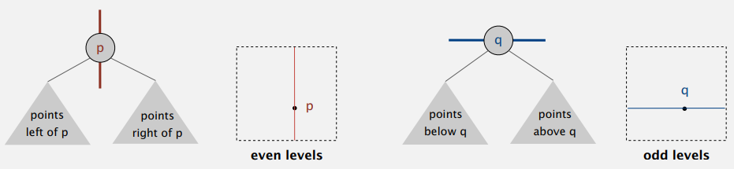​

##### Search

Goal: Find all points in a query axis-aligned rectangle.

* Check if point in node lies in given rectangle.
* Recursively search left/bottom (if any could fall in rectangle).
* Recursively search right/top (if any could fall in rectangle).

Don't always go down just one branch. If the splitting line hits the rectangle, we have to go down both branches.

​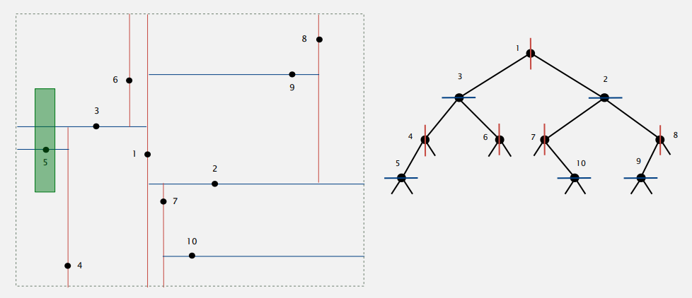​

​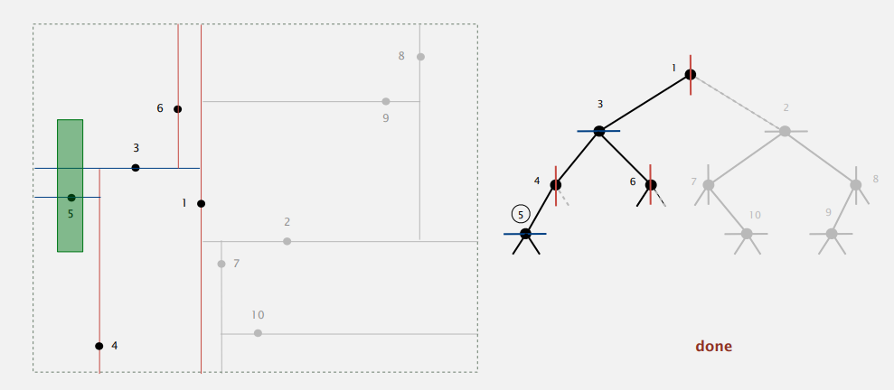​

> Analysis

* Typical case: *R* + log *N*.
* Worst case (assuming tree is balanced): *R* + √*N*.

##### Nearest neighbour search

Goal: Find closest point to query point.

* Check distance from point in node to query point.
* Recursively search left/bottom (if it could contain a closer point).
* Recursively search right/top (if it could contain a closer point).
* Organise method so that it begins by searching for query point.

Firstly, we will ready to look at two subtrees, but if we find a closer point, then we can only find one.

we always choose *the subtree that is on the same side of the splitting line as the query point* as the first subtree to explore

​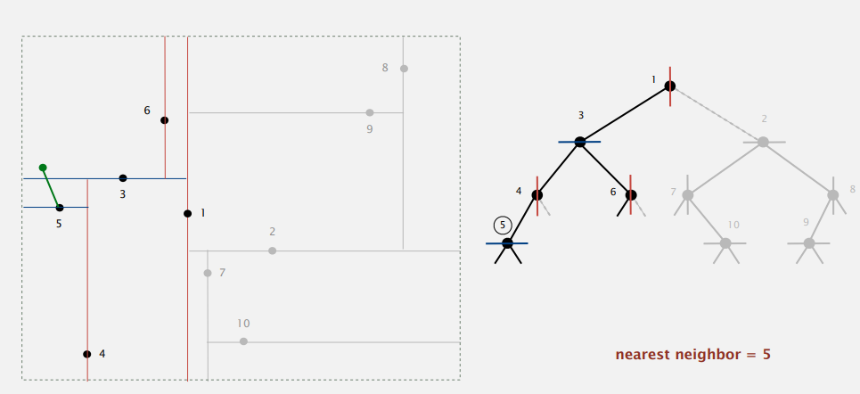​

> Analysis

* Typical case: log *N*.
* Worst case (even if tree is balanced): *N*.

#### kd tree

Recursively partition *k*-dimensional space into 2 halfspaces.

**Implementation**: BST, but cycle through dimensions ala 2d trees.

​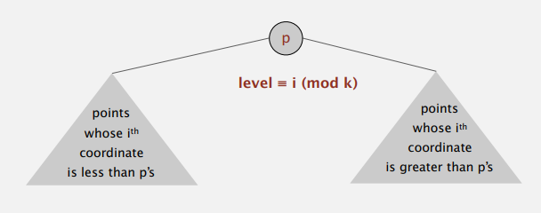​

## Interval search trees

### 1d interval search

Data structure to hold set of (overlapping) intervals.

* Insert an interval (*lo*, *hi*).
* Search for an interval (*lo*, *hi*).
* Delete an interval (*lo*, *hi*).
* Interval intersection query: given an interval (*lo*, *hi*), find all intervals (or one interval) in data structure that intersects (*lo*, *hi*).

​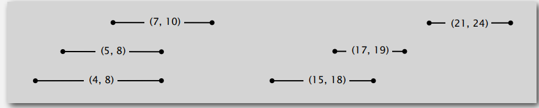​

#### API

​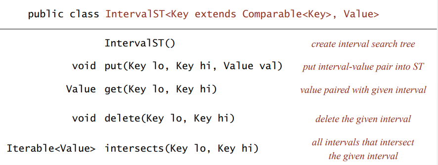​

Assume that no two intervals have the same left endpoint.

#### Interval search trees

##### Create

Create BST, where each node stores an interval (*lo*, *hi*).

* Use left endpoint as BST **key**.
* Store **max endpoint** in subtree rooted at node.

​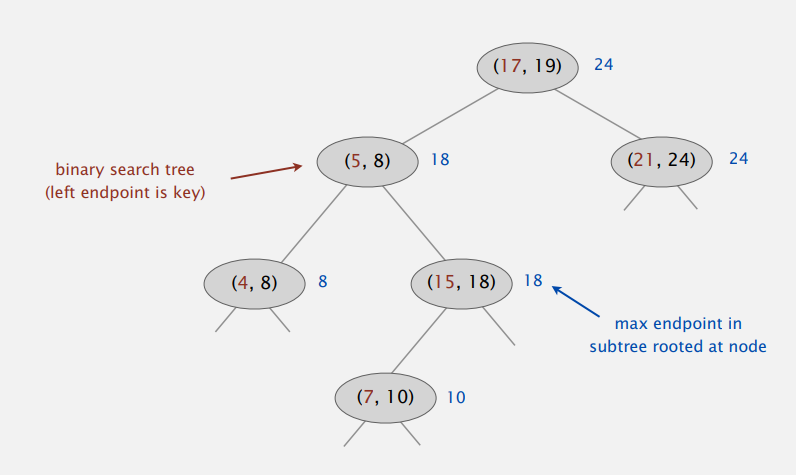​

##### Insertion

To insert an interval (*lo*, *hi*):

* Insert into BST, using *lo* as the key.
* Update max in each node on search path.

##### Search

To search for any one interval that intersects query interval (*lo*, *hi*):

* If interval in node intersects query interval, return it.
* Else if left subtree is null, go right.
* Else if max endpoint in lefy subtree is less than *lo*, go right.
* Else go left.

The interval intersection goes along the tree to check.

​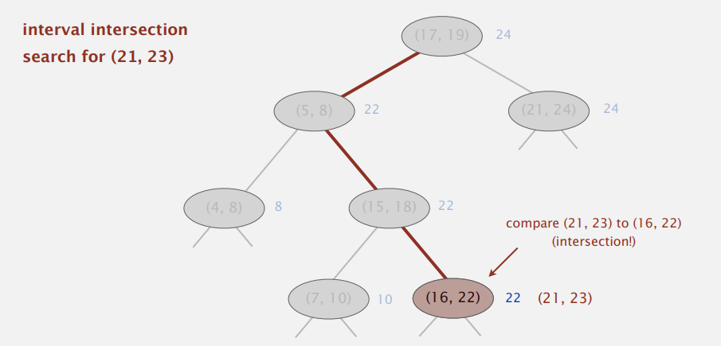​

​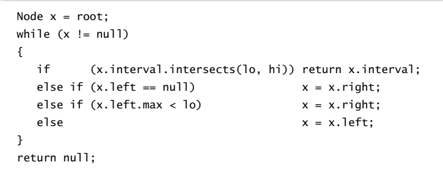​

##### Analysis

1. If search goes **right**, then no intersection in left.

    Pf. Suppose search goes right and left subtree is non empty.

    * Max endpoint *max* in left subtree is less than *lo*.
    * For any interval (*a*, *b*) in left subtree of *x*, we have *b* (definition of max) ≤ *max* \< *lo* (reason for going right).

    ​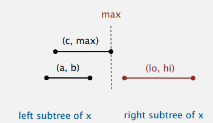​
2. If search goes **left**, then there is either an intersection in left subtree or no intersections in either.

    Pf. Suppose no intersection in left.

    * Since went left, we have *lo* ≤ *max*.
    * Then for any interval (*a*, *b*) in right subtree of *x*, *hi*  (no intersections in left subtree)\< *c* ≤ *a* (intervals sorted by left endpoint) ⇒ no intersection in right.

    ​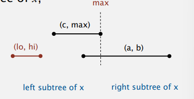​

Implementation: Use a **red-black BST** (easy to maintain auxiliary information using log *N* extra work per operation) to guarantee performance.

​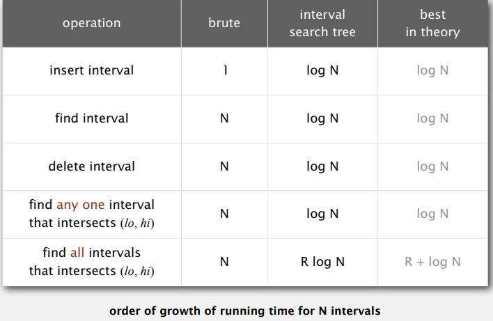​

## Rectangle intersection

Goal: Find all intersections among a set of *N* orthogonal rectangles.

**Quadratic algorithm**: Check all pairs of rectangles for intersection.

(Assume: All *x*- and *y*- coordinates are distinct).

### Sweep-line algorithm

Sweeo vertical line from left to right,

* *x*-coordinates of left and right endpoints define events.
* Maintain set of rectangles that intersect the sweep line in an interval search tree (using *y*-intervals of rectangle).
* Left endpoint: interval search for *y*-interval of rectangle; insert *y*-interval.
* Right endpoint: remove *y*-interval.

​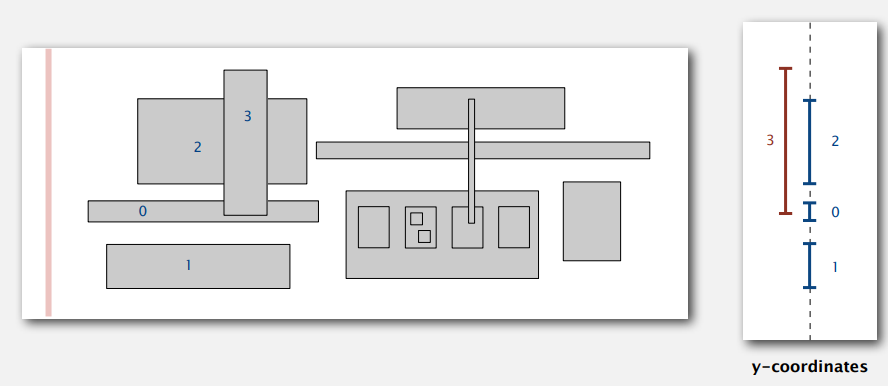​

#### Analysis

* Proposition: Sweep line algorithm takes time proportional to *N* log *N* + *R* log *N* to find *R* intersections among a set of *N* rectangles.

​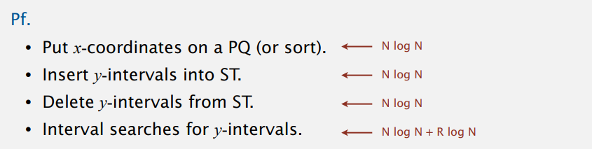​

Sweep line reduces 2d orthogonal rectangle intersection search to 1d interval search.

## Summary

​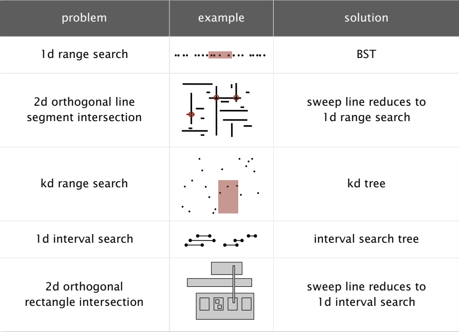​

‍

# Hash Tables

**Basic Plan**: Save items in a key-indexed table (index is a function of the key).

**Hash Function**: Method for computing array index from key.

**Issues:**

* Computing the hash function.
* Equality test: Method for checking whether two keys are equal.
* Collision resolution: Algorithm and data structure to handle two keys that has to the same array index.

## Hash Function

Idealistic Goal: Scramble the keys uniformly to produce a table index.

* Efficiently computable.
* Each table index equally likely for each key.

Need different approach for each key type.

​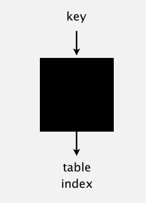​

### Java's hash code

All Java classes inherit a method `hashCode()`​, which returns a 32-bits `int`​.

* Requirement: If `x.equals(y)`​, then `(x.hashCode() == y.hashCode())`​.
* Highly desirable: If `!x.equals(y)`​, then `(x.hashCode() != y.hashCode()`​.

#### Java library implementations

> Integer Double Boolean

​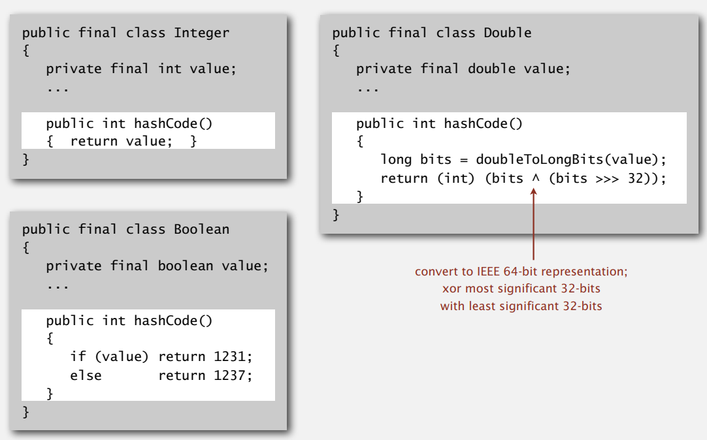​

> String

​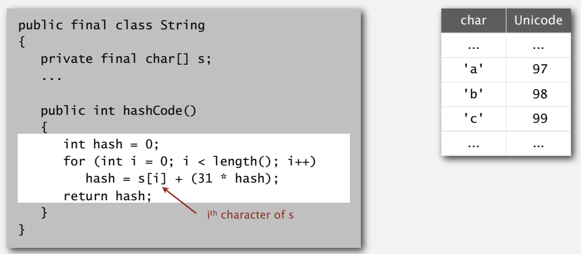​

* Horner's method to hash string of length *L*: *L* multiplies / adds.
* Equivalent to *h* = *s*[0] * 31<sup>L-1</sup> + ... + *s*[*L* - 2] * 31<sup>1</sup> + *s*[*L* - 1] * 31<sup>0</sup>.

#### Performance optimization

* Cache the hash value in an instance variable.
* Return cached value.

​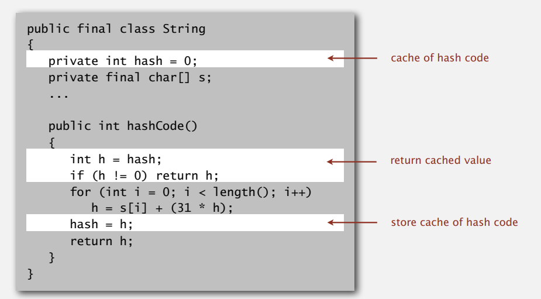​

#### User-designed types

​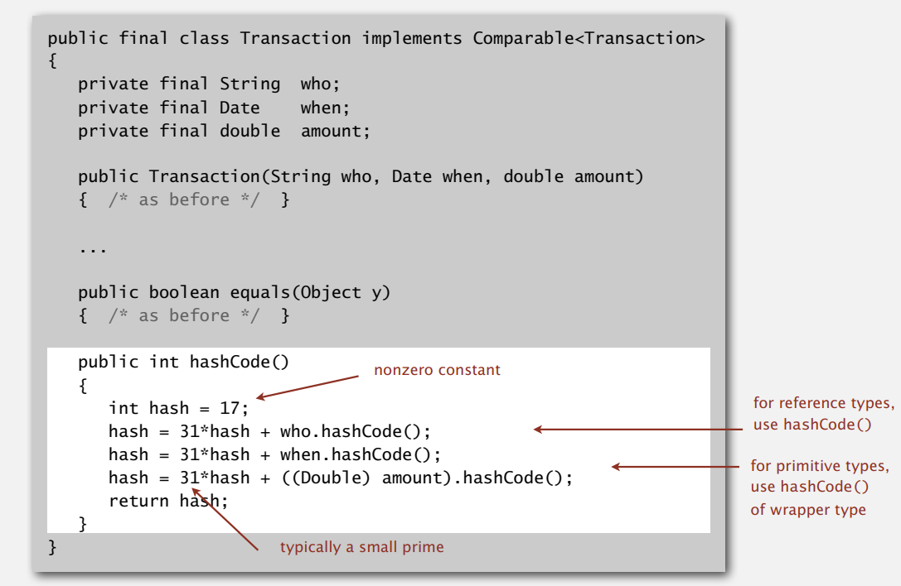​

"Standard" recipe for user-defined types.

* Combine each significant filed using the 31*x* + *y* rule.
* If field is a primitive type, use wrapper type `hashCode()`​.
* If field is null, return 0.
* If field is a reference type, use `hashCode()`​. (applies rule recursively)
* If field is an array, apply to each entry. (or use `Arrays.deepHashCode()`​).

**Basic rule**: Need to use the whole key to compute hash code; consult an expert for sate-of-the-art hash codes.

### Modular hashing

* Hash code: An `int`​ between -2<sup>31</sup> and 2<sup>31</sup> - 1.
* Hash function: An `int`​ between 0 and *M* - 1 (for use as array index. *M* is typically a prime or power of 2).

​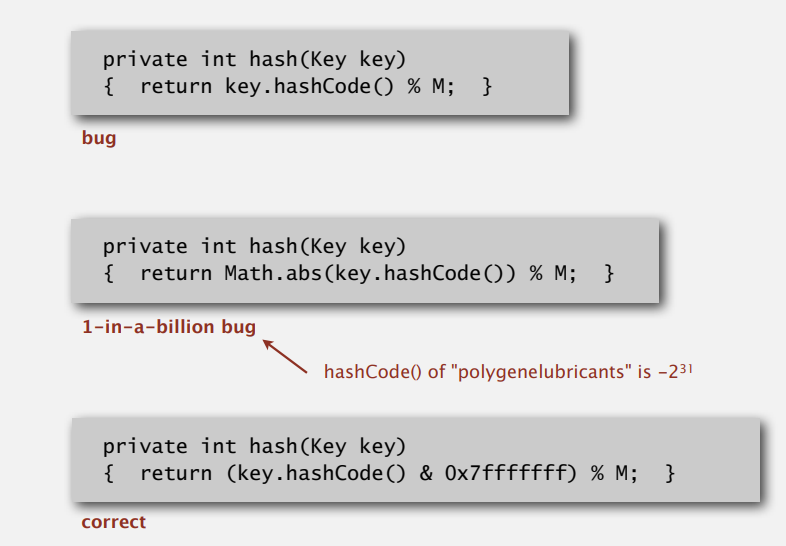​

### Uniform hashing assumption

Uniform hashing assumption: Each key is equally likely to hash to an integer between 0 and *M* - 1.

​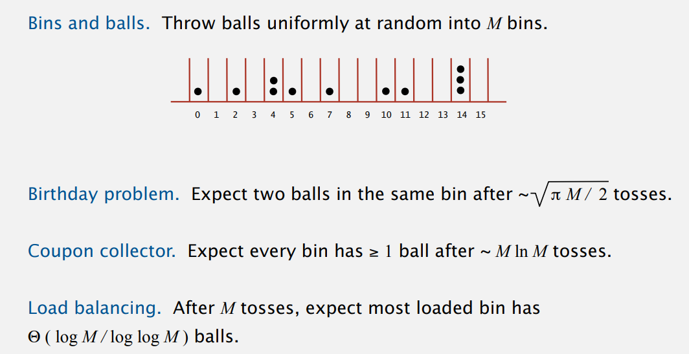​

## Separate Chaining

### Collision

Collision: Two distinct keys hashing to same index.

* Birthday problem: can't avoid collisions unless you have a ridiculous (quadratic) amount of memory.
* Coupon collector + load balancing -> collisons are evenly distuibuted.

### Separate chaining symbol table

**Use an array of** ***M***  ***&lt; N***  ***linked list.***

* Hash: map key to integer *i* between 0 and *M* - 1.
* Insert: put at **front** of *i*​<sup>th</sup> chain (if not already here).
* Search: need to search only *i*​<sup>th</sup> chain.

​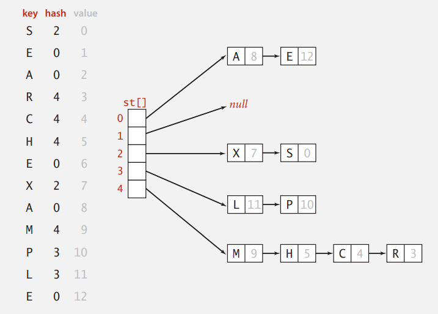​

#### Implementation

```Java
/**
 * @author : Zephyrtoria
 * @CreateTime: 2024-09-21
 * @Description:
 * @Version: 1.0
 */
public class SeparateChainingHashST<Key, Value> {
    private final int M = 97;  // number of chains (array doubling and halving code omitted)
    private Node[] st;

    private static class Node {  // must be static
        private final Object key;  // can't create a generic array, so it must be Object.
        private Object val;
        private Node next;

        public Node(Object key, Object val, Node next) {
            this.key = key;
            this.val = val;
            this.next = next;
        }
    }

    public SeparateChainingHashST() {
        st = new Node[M];
    }

    private int hash(Key key) {
        return (key.hashCode() & 0x7fffffff) % M;
    }

    public Value get(Key key) {
        int i = hash(key);
        for (Node x = st[i]; x != null; x = x.next) {
            if (key.equals(x.key)) {
                return (Value) x.val;
            }
        }
        return null;
    }

    public void put(Key key, Value val) {
        int i = hash(key);
        for (Node x = st[i]; x != null; x = x.next) {
            if (key.equals(x.key)) {
                x.val = val;
                return;
            }
        }
        st[i] = new Node(key, val, st[i]);

    }
}

```

#### Analysis

* Proposition: Under uniform hashing assumption, the number of keys in a list is within a constant factor of *N* / *M* is extremely close to 1.
* Pf. Distuibution of list size obeys a binomial distuibution.

  ​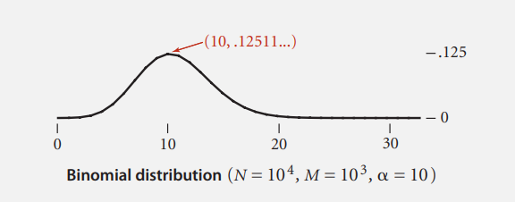​
* Consequence: Number of preobes for search/insert is proportional to *N* / *M*. (*M* times faster than sequential search).

  * *M* too large -> too many empty chains.
  * *M* too small -> chains too long.
  * Typical choice: *M* ~ *N* / 5 -> constant-time operation cost.

​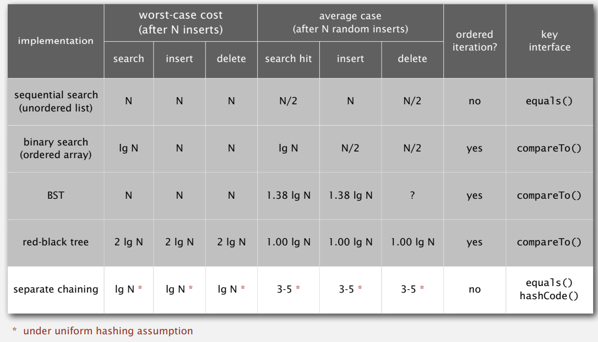​

## Linear Probing

### Open addressing

Open addressing: When a new key collides, find next empty slot, and put it there.

* Hash: Map key to integer *i* between 0 and *M* - 1.
* Insert: Put at table index *i* if free; if not, try *i* + 1, *i* + 2, etc.
* Search: Search table index *i*; if occupied but no match, try *i* + 1, *i* + 2, etc.

Array size *M* must be greater than number of key-value pairs *N*.

#### Implementation

```Java
/**
 * @Author: Zephyrtoria
 * @CreateTime: 2024-09-21
 * @Description:
 * @Version: 1.0
 */
public class LinearProbingHashST<Key, Value> {
    private int M = 30001;
    private Key[] keys = (Key[]) new Object[M];
    private Value[] vals = (Value[]) new Object[M];

    private int hash(Key key) {
        return (key.hashCode() & 0x7fffffff) % M;
    }

    public Value get(Key key) {
        for (int i = hash(key); keys[i] != null; i = (i + 1) % M) {
            if (key.equals(keys[i])) {
                return vals[i];
            }
        }
        return null;
    }


    public void put(Key key, Value val) {
        int i;
        for (i = hash(key); keys[i] != null; i = (i + 1) % M) {
            if (keys[i].equals(key)) {
                break;
            }
        }
        keys[i] = key;
        vals[i] = val;
    }
}

```

#### Clustering

* Cluster: A contiguous block of items.
* Observation: New keys likely to hash into middle of big clusters.

> Knuth's parking problem

​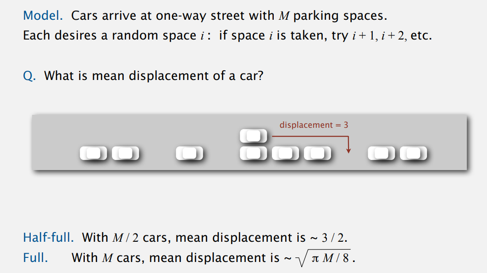​

#### Analysis

* Proposition: Under uniform hashing assumption, the average of probes in a linear probing hash table of size *M* that contains *N* = α *M* keys is:

  ​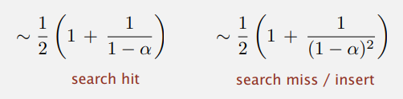​
* Parameters:

  * *M* too large -> too many empty array entrie.
  * *M* too small -> search time blows up.
  * Typical choice : α = *N* / *M* ~ ½

    * probes for search hit is about 3/2
    * probes for search miss is about 5/2

​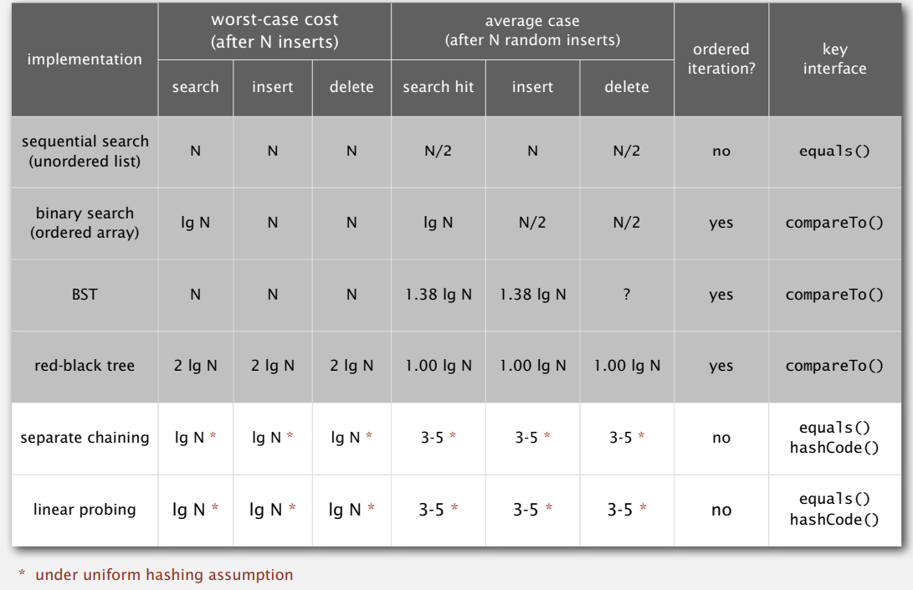​

#### Delete

The easiest way to implement delete is to find and remove the key–value pair and then to reinsert all of the key–value pairs in the same cluster that appear after the deleted key–value pair. If the hash table doesn't get too full, the expected number of key–value pairs to reinsert will be a small constant.

An alternative is to flag the deleted linear-probing table entry so that it is skipped over during a search but is used for an insertion. If there are too many flagged entrie, create a new hash table and rehash all key–value pairs.

## Context

​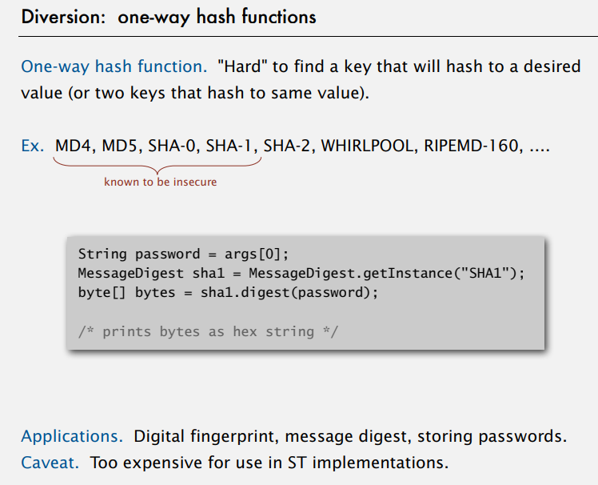​

​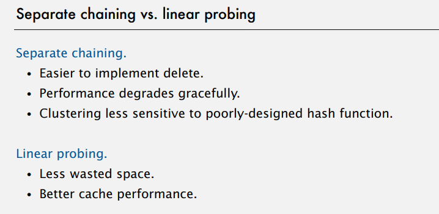​

​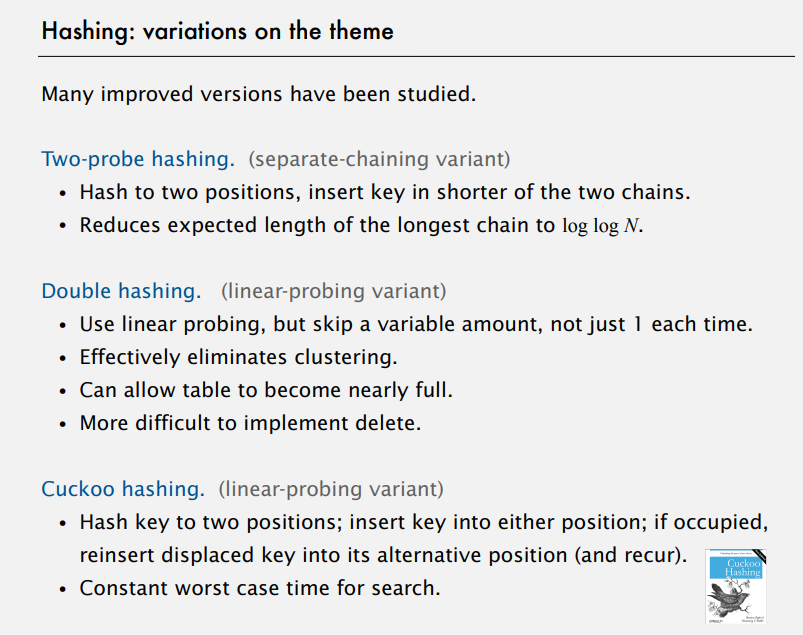​

​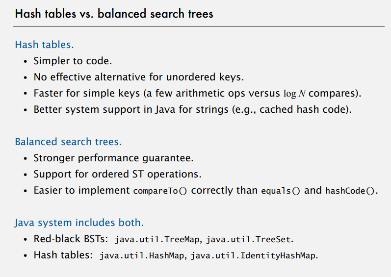​

# Undirected Graphs

## Introduction

**Graph**: Set of **vertices** connected pairwise by edges.

* **Path**: Sequence of vertices connected by edges.
* **Cycle**: Path whose first and last vertices are the same.

Two vertices are **connected** if there is a path between them.

​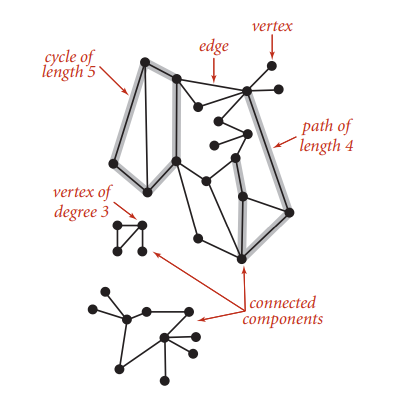​

### Graph-Processing problems

* Path: Is there a path between *s* and *t*?

  * Shortest path: What is the shortest path between *s* and *t*?
* Cycle: Is there a cycle in the graph?

  * Euler tour: Is there a cycle that uses each edge exactly once?
  * Hamilton tour: Is there a cycle that uses each vertex exactly once?
* Connectivity: Is there a way to connect all of the vertices?

  * MST: What is the best way to connect all of the vertices?
  * Biconnectivity: Is there a vertex whose removal disconnects the graph?
* Planarity: Can you draw the graph in the plane with no crossing edges?

  * Graph isomorphism: Do two adjacency lists representt the same graph?

## Graph API

### API

​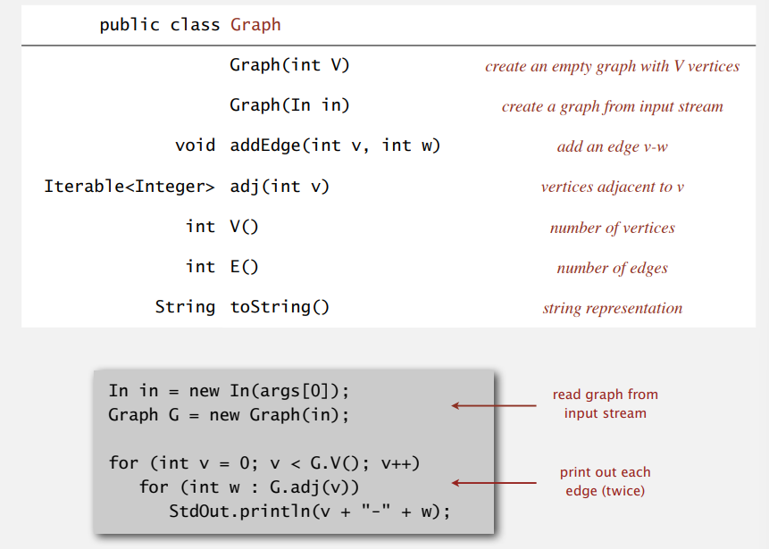​

### Graph-processing Code

```Java
/**
 * @Author: Zephyrtoria
 * @CreateTime: 2024-10-14
 * @Description:
 * @Version: 1.0
 */
public class GraphProcessing {
    // compute the degree of v
    public static int degree(Graph G, int v) {
        int degree = 0;
        for (int w : G.adj(v)) {
            degree++;
        }
        return degree;
    }

    // compute maximum degree
    public static int maxDegree(Graph G) {
        int max = 0;
        for (int v = 0, size = G.V(); v < size; v++) {
            int degree = degree(G, v);
            if (degree > max) {
                max = degree;
            }
        }
        return max;
    }

    // compute average degree
    public static double averageDegree(Graph G) {
        return 2.0 * G.E() / G.V();
    }

    // count self-loops
    public static int numberOfSelfLoops(Graph G) {
        int count = 0;
        for (int v = 0, size = G.V(); v < size; v++) {
            for (int w : G.adj(v)) {
                if (v == w) {
                    count++;
                }
            }
        }
        return count / 2;
    }
}

```

‍

### Graph Representation

**Vertex representation**:

* Use integers between 0 and *V* - 1.
* Convert between names and integers with symbol table.

​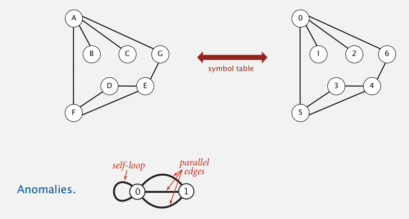​

#### Set-of-edges Graph Representation

Maintain a list of the edges (linked list or array).

​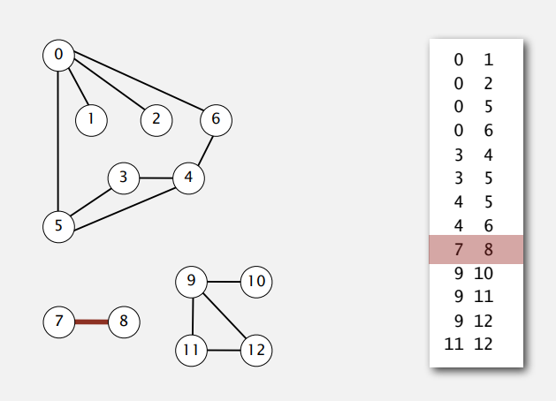​

Inefficient.

#### Adjacency-matrix Graph Representation

* Maintain a two-dimensional *V*-by-*V* boolean array;
* for each eedge *v-w* in graph: `adj[v][w] = adj[w][v] == true`​

​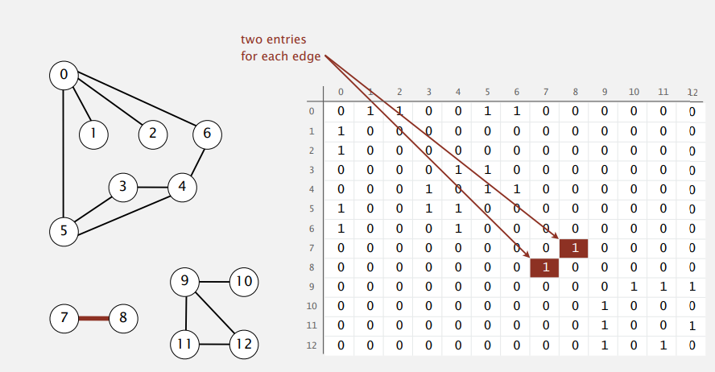​

For huge graph, there are millions of vertices and too big for computing.

#### Adjacency-list Graph Representation

* Maintain vertex-indexed array of lists.

​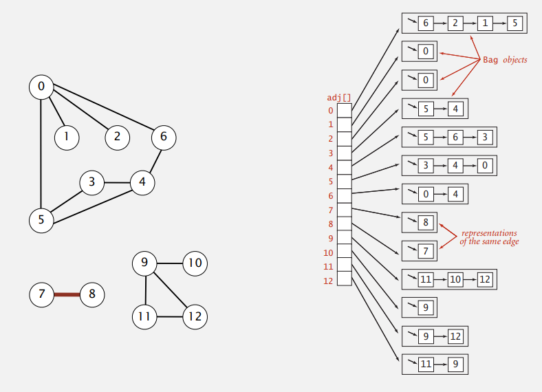​

### Implementation

```Java
import edu.princeton.cs.algs4.Bag;
import edu.princeton.cs.algs4.In;

/**
 * @Author: Zephyrtoria
 * @CreateTime: 2024-10-14
 * @Description:
 * @Version: 1.0
 */
public class Graph {
    private final int V;
    // adjacency lists using Bag data type (a stack without pop() or a queue without dequeue())
    private Bag<Integer>[] adj;

    // create empty graph with V vertices
    public Graph(int V) {
        this.V = V;
        adj = (Bag<Integer>[]) new Bag[V];
        for (int v = 0; v < V; v++) {
            adj[v] = new Bag<Integer>();
        }
    }

    public Graph(In in) {
        this(in.readInt());
    }

    // add edge v-w (parallel edges and self-loops allowed)
    public void addEdge(int v, int w) {
        adj[v].add(w);
        adj[w].add(v);
    }

    // iterator for vertices adjacency to v
    public Iterable<Integer> adj(int v) {
        return adj[v];
    }

    public int V() {
        return V;
    }

    public int E() {
        int count = 0;
        for (Bag<Integer> bag : adj) {
            count += bag.size();
        }
        return count / 2;
    }

    public String toString() {
        StringBuilder sb = new StringBuilder();
        for (int v = 0; v < V; v++) {
            for (int w : adj[v]) {
                sb.append(v).append("->").append(w).append("\n");
            }
        }
        return sb.toString();
    }
}
```

### Analysis

In practice: User adjacency-lists representation.

* Algorithms based on iterating over vertices adjacent to *v*.
* Real-world graphs tend to be sparse (huge number of vertices, small average vertex degree.)

​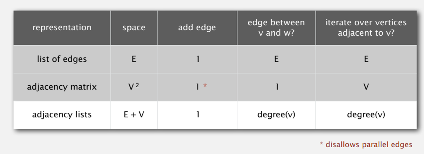​

Space is to be *2E + V.*

## Depth-first Search

### Maze Exploration

* Vertex = intersection
* Edge = passage

Goal: Explore every intersection in the maze.

* Unroll a ball of string behind you.
* Mark each visited intersection and each visited passage.
* Retrace steps when no unvisited options.

​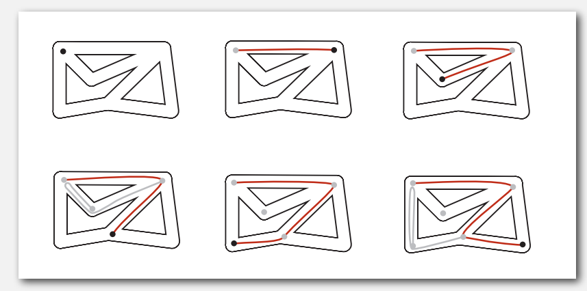​

The key thing is that the ball will not arrive at a place twice.

### Depth-first search

**DFS**:

* Mark *v* as visited.
* Recursively visit all unmarked vertices *w* adjacent to *v*.

Application:

1. Find all vertices connected to a given source vertex.
2. Find a path between two vertices.

Algorithm:

* User recursion (ball of string).
* Mark each visited vertex (and keep track of edge taken to visit it).
* Return (retrace steps) when no unvistied options.

Data structure:

* ​`boolean[] marked`​ to mark visited vertices.
* ​`int[] edgeTo`​ to keep tree of path.

  * ​`edgeTo[w] == v`​ means that edge *v*-*w* taken to visit *w* for first time.

### Design Pattern for Graph Processing

**Design pattern**: Decouple graph data type from graph processing.

* Create a `Graph`​ object.
* Pass the `Graph`​ to a graph-processing routine.
* Query the graph-processing routine for information..

​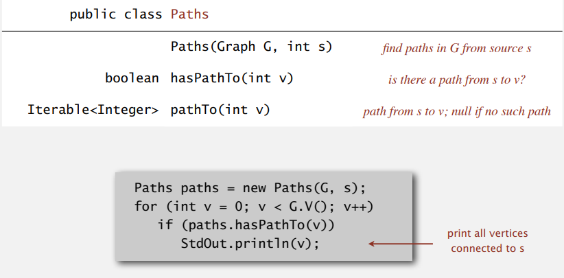​

We decouple the graph representation from the processing of it. So the object will be used only when it is needed.

### Implementation

```Java
import edu.princeton.cs.algs4.Stack;

/**
 * @Author: Zephyrtoria
 * @CreateTime: 2024-10-14
 * @Description:
 * @Version: 1.0
 */
public class DepthFirstPaths {
    // marked[v] == true if v connected to s
    private boolean[] marked;
    // edgeTo[v] == s (previous vertex) on path from s to v
    private int[] edgeTo;
    private int s;

    public DepthFirstPaths(Graph G, int s) {
        marked = new boolean[G.V()];
        edgeTo = new int[G.V()];
        this.s = s;

        dfs(G, s);
    }

    private void dfs(Graph G, int v) {
        marked[v] = true;
        for (int w : G.adj(v)) {
            if (!marked[w]) {
                dfs(G, w);
                edgeTo[w] = v;
            }
        }
    }

    public boolean hasPathTo(int v) {
        return marked[v];
    }

    public Iterable<Integer> pathTo(int v) {
        if (!hasPathTo(v)) {
            return null;
        }
        Stack<Integer> path = new Stack<>();
        for (int x = v; x != s; x = edgeTo[x]) {
            path.push(x);
        }
        path.push(s);  // the source
        return path;
    }
}
```

### Analysis

* Proposition: DFS marks all vertices connected to *s* in time proporional to the sum of their degree.

​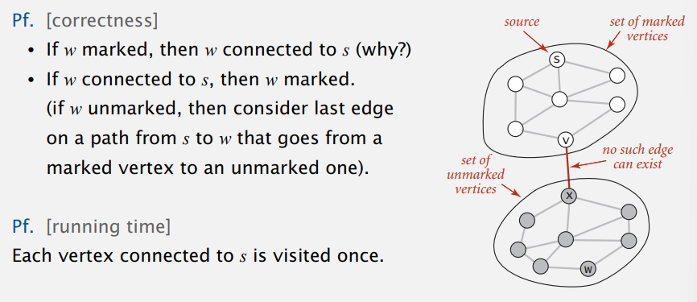​

* Proposition: After DSF, can find verticecs connected to *s* in constant time and can find a path to *s* (if one exists) in time propotional to its length.

​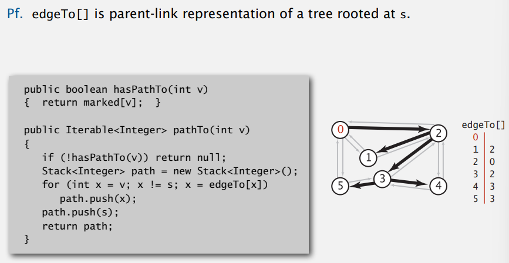​

## Breadth-first Search

Repeat until queue is empty:

* Remove vertex *v* from queue.
* Add to queue all unmarked vertices adjacent to *v* and mark them.

​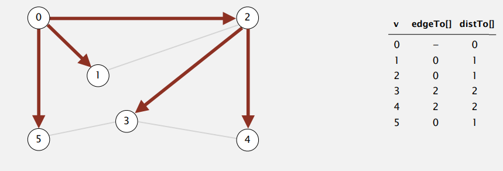​

### Breadth-first Search

* Depth-first search: Put unvisited vertices on a **stack**.
* Breadth-first search: Put unvisited vertices on a **queue**.

**Shortest Path**: Find path from *s* to *t* that uses *fewest number of edges*.

​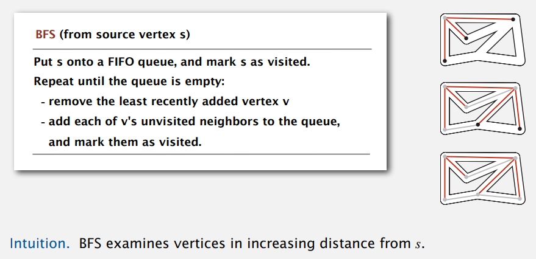​

### Properties

* Proposition: BFS computes shortest paths from *s* to all other vertices in a graph in time proportional to *E* + *V*.

​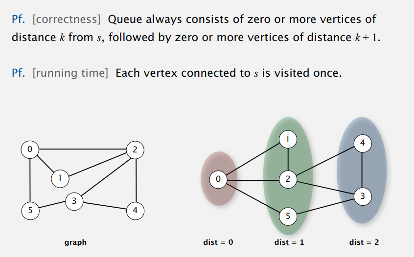​

### Implementaion

```Java
import edu.princeton.cs.algs4.Queue;

import java.util.Arrays;

/**
 * @Author: Zephyrtoria
 * @CreateTime: 2024-10-14
 * @Description:
 * @Version: 1.0
 */
public class BreadthFirstPaths {
    private int[] distTo;
    private int[] edgeTo;

    public BreadthFirstPaths(Graph G, int s) {
        distTo = new int[G.V()];
        Arrays.fill(distTo, -1);
        edgeTo = new int[G.V()];

        bfs(G, s);
    }

    private void bfs(Graph G, int s) {
        Queue<Integer> q = new Queue<>();
        q.enqueue(s);
        distTo[s] = 0;
        while (!q.isEmpty()) {
            int v = q.dequeue();
            for (int w : G.adj(v)) {
                if (distTo[w] != -1) {
                    q.enqueue(w);
                    distTo[w] = distTo[v] + 1;
                    edgeTo[w] = v;
                }
            }
        }
    }
}
```

## Connected Components

### Connectivity queries

* Define: Vertices *v* and *w* are **connected** if there is a path between them.
* Goal: Preprocess graph to answer queries of the form "is *v* connected to *w*?" in **constant** time.

​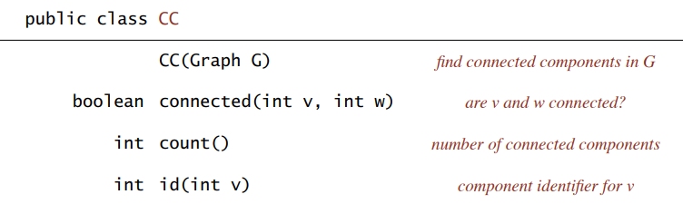​

Union-find is not appropraite. (not constant time)

### Connected Components

The relation "is connected to" is an **equivalence relation**:

* Reflexive: *v* is connected to *v*.
* Symmetric: if *v* is connected to *w*, then *w* is connected to *v*.
* Transitive: if *v* is connected to *w* and *w* connected to *x*, then *v* connected to *x*.

Define: A **connected component** is a maximal set of connected vertices.

​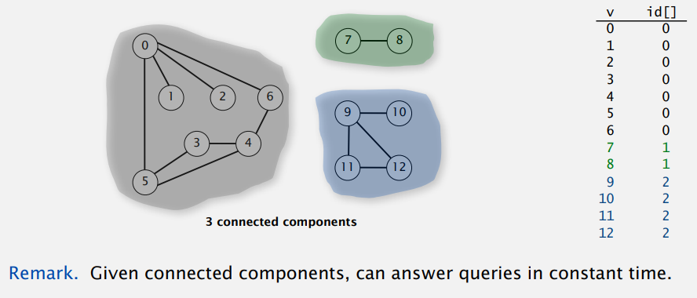​

### Implementation

Goal: Partition vertices into connected components.

* Initialize all vertices *v* as unmarked.
* For each unmarked vertex *v,*  run DFS to identify all vertices discovered as part of the same component.

  * Mark vertex *v* as visited. Set the `id[v]`​ to the previous id.
  * Recursively visit all unmarked vertices adjacent to *v*.

```Java
/**
 * @Author: Zephyrtoria
 * @CreateTime: 2024-10-14
 * @Description:
 * @Version: 1.0
 */
public class CC {
    private boolean[] marked;
    private int[] id;
    private int count;

    public CC(Graph G) {
        marked = new boolean[G.V()];
        id = new int[G.V()];
        for (int v = 0; v < G.V(); v++) {
            if (!marked[v]) {
                dfs(G, v);
                count++;
            }
        }
    }

    private void dfs(Graph G, int v) {
        marked[v] = true;
        id[v] = count;
        // all vertices discovered in same call of dfs have same id
        for (int w : G.adj(v)) {
            if (!marked[w]) {
                dfs(G, w);
            }
        }
    }

    public int count() {
        return count;
    }

    public int id(int v) {
        return id[v];
    }
}

```

## Challenges

How difficult?

* Any programmer could do it.
* Typical diligent algorithms student could do it.
* Hire an expert.
* Intractable.
* No one knows.
* Impossible.

### Bipartite

​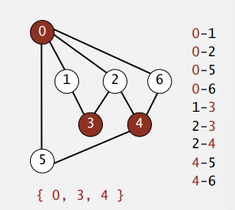​

DFS

### Find A Cycle

​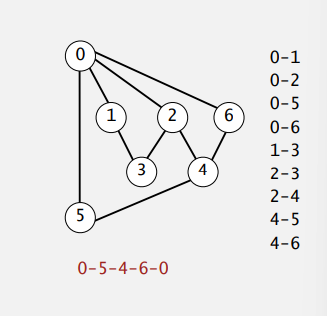​

DFS

### Eulerian Tour

Find a (general) cycle that uses every edge exactly once

​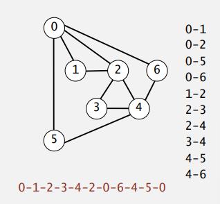​

​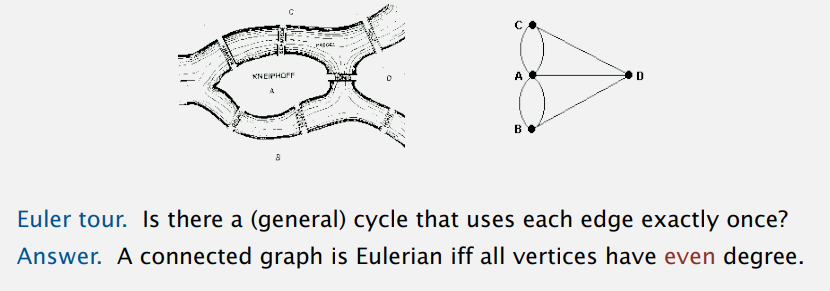​

### Hamiltonian Cycle

Find a cycle that visits every vertex exactly once.

​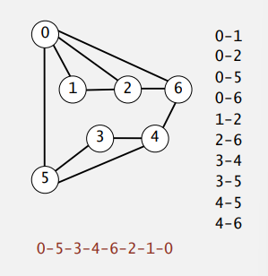​

NP-complete problem.

### Graph Isomorphism

Are two graphs identical except for vertex names?

​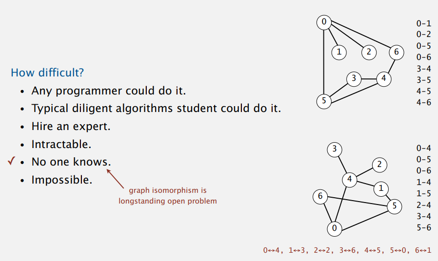​

### Planarity

Lay out a graph in the plane without crossing edges?

​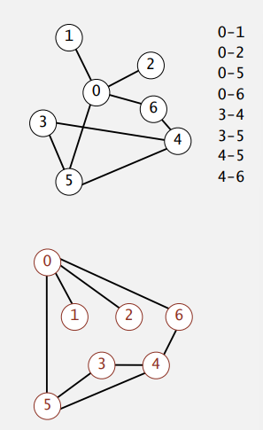​

Linear-time DFS-based planarity algorithm discovered by Tarjan in 1970s.

# Directed Graphs

## Introduction

**Digraph**: Set of vertices connected pairwise by **directed** edges.

​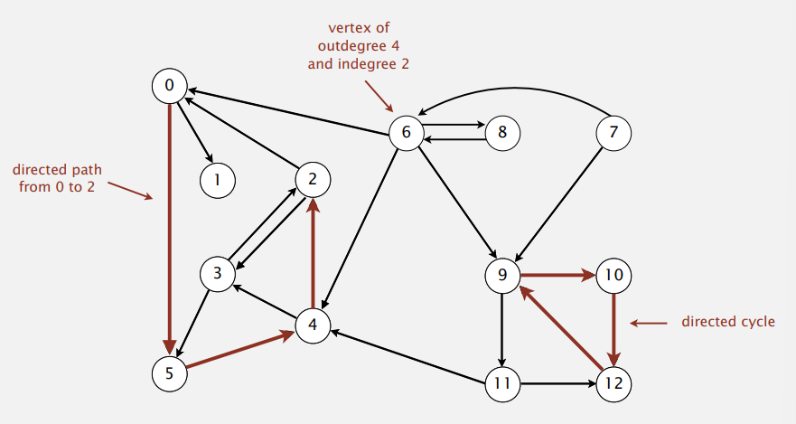​

## Problems

​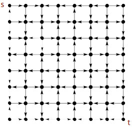​

* Path: Is there a directed path from *s* to *t* ?
* Shortest path: What is the shortest directed path from *s* to *t* ?
* Topological sort: Can you draw a digraph so that all edges point upwards?
* Strong connectivity: Is there a directed path between all pairs of vertices?
* Transitive closure: For which vertices *v* and *w* is there a path from *v* to *w* ?
* PageRank: What is the importance of a web page?

## Digraph API

​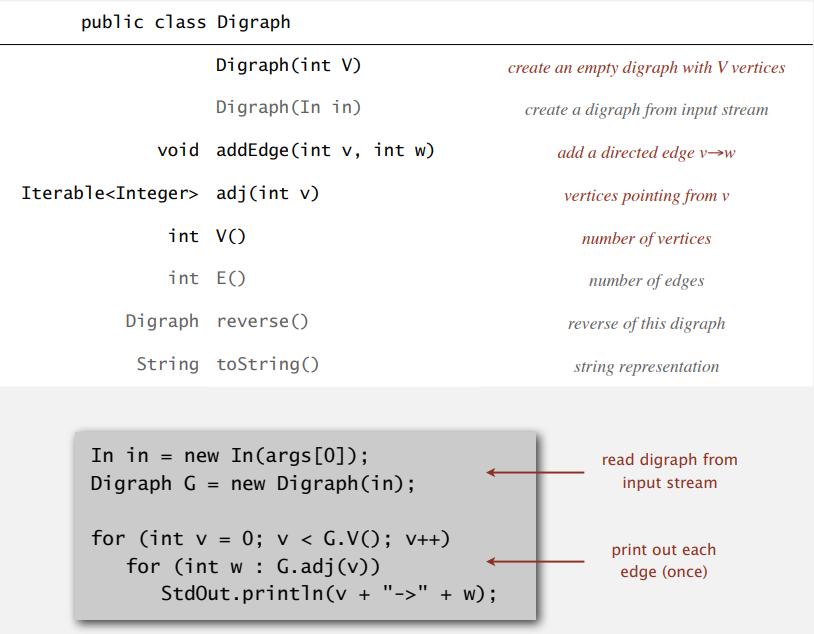​

### Adajancy-list Digraph Representation

​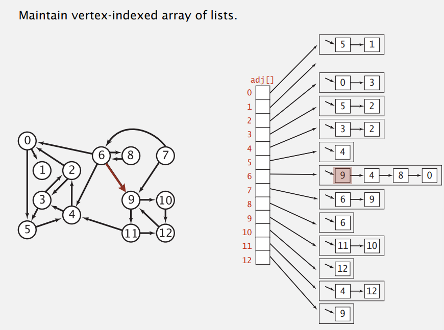​

### Implementation

```Java
import edu.princeton.cs.algs4.Bag;
import edu.princeton.cs.algs4.In;

/**
 * @Author: Zephyrtoria
 * @CreateTime: 2024-10-16
 * @Description:
 * @Version: 1.0
 */
public class Digraph {
    private final int V;
    // adjacency lists using Bag data type (a stack without pop() or a queue without dequeue())
    private Bag<Integer>[] adj;

    // create empty diraph with V vertices
    public Digraph(int V) {
        this.V = V;
        adj = (Bag<Integer>[]) new Bag[V];
        for (int v = 0; v < V; v++) {
            adj[v] = new Bag<Integer>();
        }
    }

    public Digraph(In in) {
        this(in.readInt());
    }

    // add edge v->w (parallel edges and self-loops allowed)
    public void addEdge(int v, int w) {
        adj[v].add(w);
    }

    // iterator for vertices pointing from v
    public Iterable<Integer> adj(int v) {
        return adj[v];
    }

    public int V() {
        return V;
    }

    public int E() {
        int count = 0;
        for (Bag<Integer> bag : adj) {
            count += bag.size();
        }
        return count / 2;
    }

    public String toString() {
        StringBuilder sb = new StringBuilder();
        for (int v = 0; v < V; v++) {
            for (int w : adj[v]) {
                sb.append(v).append("->").append(w).append("\n");
            }
        }
        return sb.toString();
    }
}

```

### Analysis

​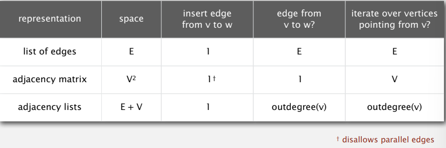​

## Digraph Search

### DFS

* Problem: Find all vertices reachable from *s* along a directed path.

​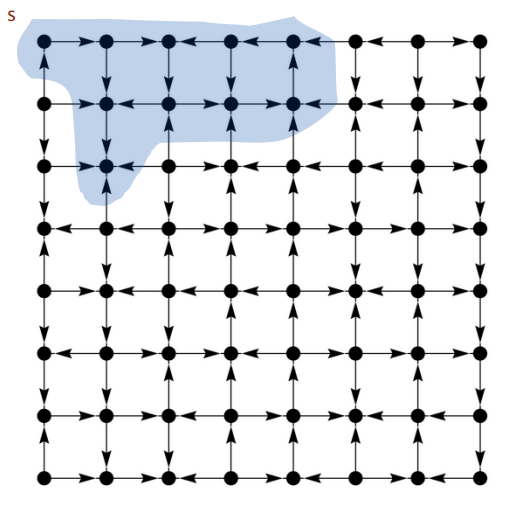​

Same method as for undirected graphs:

* Every undirected graph is a digragh (with edges in both directions).
* DFS is a **digraph** algorithm.

  * Mark *v* as visited.
  * Recursively visit all unmarked vertices *w* pointing from *v*.

#### Implementation

```Java
/**
 * @Author: Zephyrtoria
 * @CreateTime: 2024-10-16
 * @Description:
 * @Version: 1.0
 */
public class DirectedDFS {
    // true if path from s
    private boolean[] marked;

    // constructor marks vertices reachable from s
    public DirectedDFS(Digraph G, int s) {
        marked = new boolean[G.V()];
        dfs(G, s);
    }

    private void dfs(Digraph G, int v) {
        marked[v] = true;
        for (int w : G.adj(v)) {
            if (!marked[w]) {
                dfs(G, w);
            }
        }
    }

    public boolean visited(int v) {
        return marked[v];
    }
}
```

Code for directed graphs identical to undirected one.

#### Reachability Application

* Program control-flow analysis

  * Every program is a digraph.

    * Vertex = basic block of instructions
    * Edge = jump
  * Dead-code elimination

    * Find and remove unreachable code.
  * Infinite-loop detection

    * Determine whether exit is unreachable.

* Mark-sweep garbage collector

  * Every data structure is a digraph

    * Vertex = object
    * Edge = reference
  * Root: Objects known to be directly accessible by program.
  * Reachable objects

    * Objects indirectly accessible by program (starting at a root and following a chain of pointers).
  * Mark-sweep algorithm

    * Mark: mark all reachable objects
    * Sweep: if object is unmarked, it is garbage
  * Memory cost

    * Uses 1 extra mark bit per object

### BFS

Same method as for undirected graphs.

*  

  * Every undirected graph is a digragh (with edges in both directions).
  * BFS is a **digraph** algorithm.

    * Put *s* onto a FIFO queue, and mark *s* as visited.
    * Repeat until the queue is empty

      * Remove the least recently added vertext *v*.
      * for each unmarked vertex pointing from *v* add to queue and mark as visited.

BFS computes **shortest paths** (fewest number of edges) from *s* to all other vertices in a digraph in time proportional to *E + V*.

#### Multiple-source Shortest Paths

**Multiple-source Shortest Paths**: Given a digraph and a **set** of source vertices, find shortest path from any vertex in the set to each other vertex.

​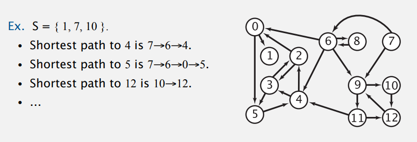​

Use BFS, but initialize by enqueuing all source vertices.

#### Application

* Web crawler

  * Crawl web, starting from some root web page

    ​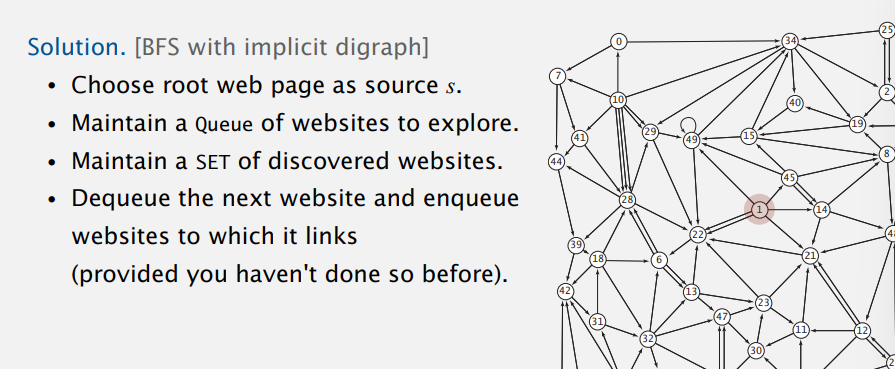​

## Topological Sort

### Precedence Scheduling

Goal: Given a set of tasks to be completed with precedence constaints, in which order should we schedule the tasks?

Digraph model

* vertex = task
* edge = precedence constraint

​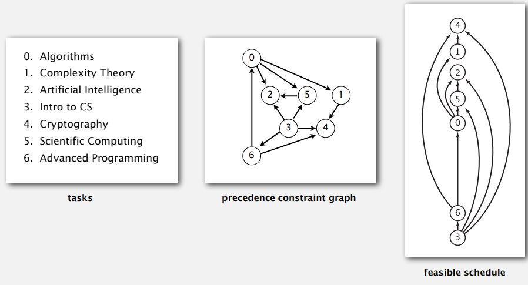​

* DAG: Directed acyclic graph
* Topological sort: Redraw DAG so all edges point upwards.

​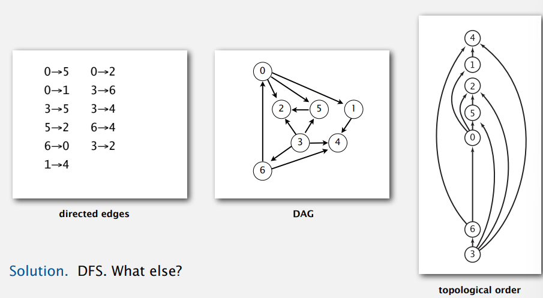​

### DFS Implementation

* Run DFS.
* Return vertices in reverse postorder.

​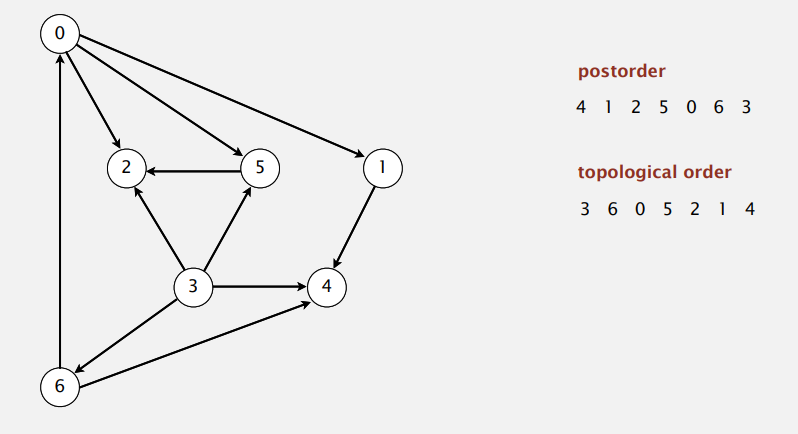​

Check all vertices. If a vertice is at the end of a path, then add it into postorder.

### Implementation

```Java
import edu.princeton.cs.algs4.Stack;

/**
 * @Author: Zephyrtoria
 * @CreateTime: 2024-10-16
 * @Description:
 * @Version: 1.0
 */
public class DepthFirstOrder {
    private boolean[] marked;
	// using stack to implement reverse
    private Stack<Integer> reversePost;

    public DepthFirstOrder(Digraph G) {
        reversePost = new Stack<>();
        marked = new boolean[G.V()];
        for (int v = 0; v < G.V(); v++) {
            if (!marked[v]) {
                dfs(G, v);
            }
        }
    }

    private void dfs(Digraph G, int v) {
        marked[v] = true;
        for (int w : G.adj(v)) {
            if (!marked[w]) {
                dfs(G, w);
            }
        }
        reversePost.push(v);
    }

    public Iterable<Integer> reversePost() {
        return reversePost;
    }
}

```

### Correctness Proof

* Proposition: Reverse DFS postorder of a DAG is a topological order.

​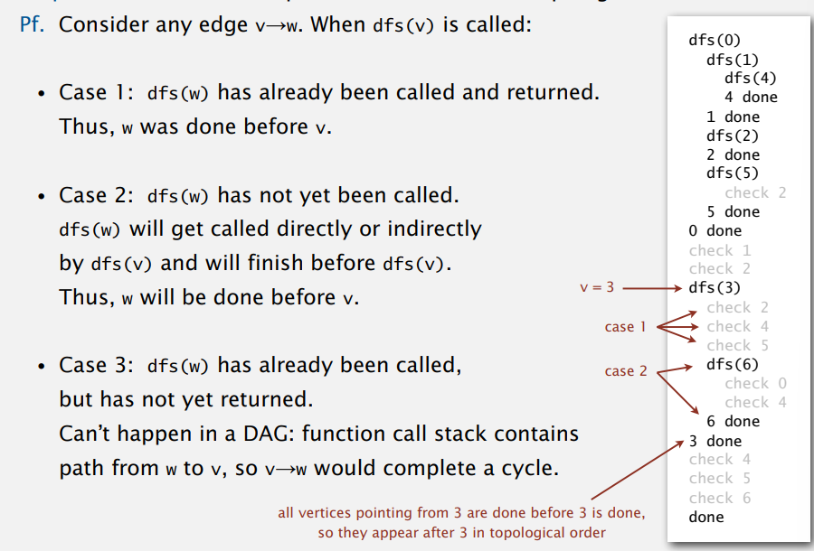​

* Proposition: A digraph has a topological order iff no directed cycle.

​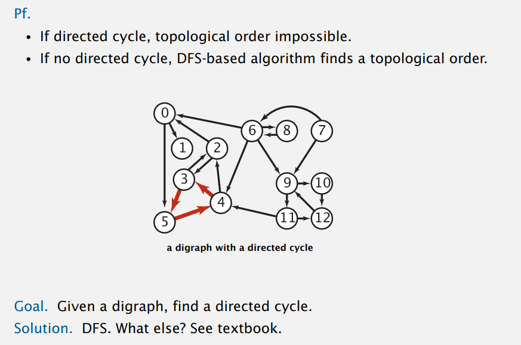​

## Strong Components

### Strongly-connected Components

* Define: vertices *v* and *w* are **strongly connected** if there is both a directed path from *v* to *w* and a directed path from *w* to *v*.
* Key property: Strong connectivity is an **equivalence relation**​

  * *v* is strongly connected to *v*. (That is, a DAG would have *V* strong components)
  * If *v* is strongly connected to *w*, then *w* is strongly connected to *v*.
  * If *v* is strongly connected to *w* and *w* to *x*, then *v* is strongly connected to *x*.
* Define: A **strong component** is a maximal subset of strongly-connected vertices.

​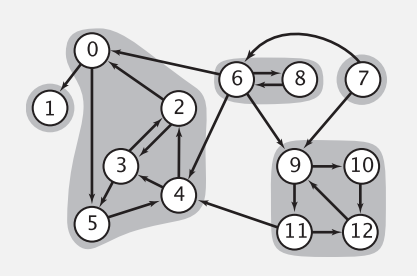​

### Connected Components vs. Strongly-connected Components

Connected Components

​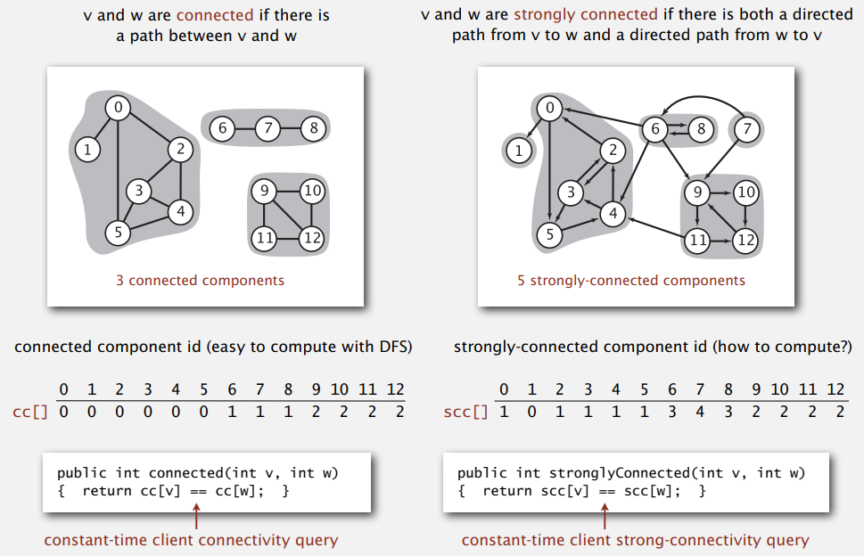​

### Kosaraju-Sharir Algorithm

* Reverse graph: Strong components in *G* are same as in *G*​*<sup>R</sup>*.
* Kernel DAG: Contract each strong component into a single vertex.
* Idea:

  * Compute topological order in kernel DAG.
  * Run DFS, considering vertices in reverse topological order.

​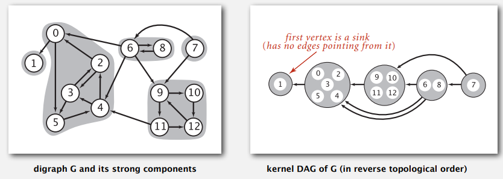​

1. Run DFS in *G*​*<sup>R</sup>*, computing reverse postorder in *G*​*<sup>R</sup>*​ *.*

    ​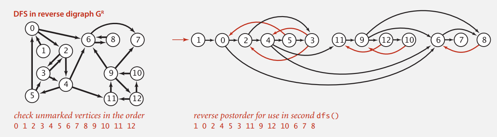​
2. Run DFS in *G*, visiting unmarked vertices in reverse postorder of *G*​*<sup>R</sup>*​ *.*

    ​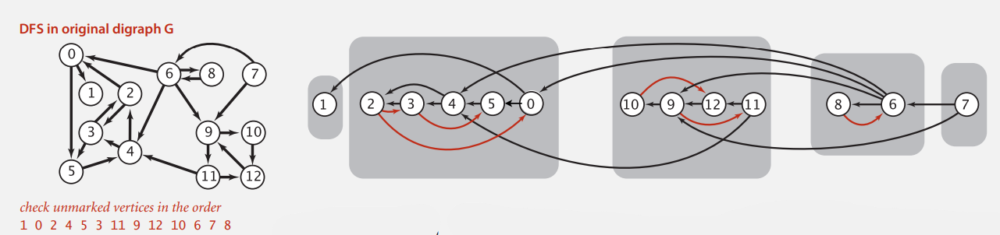​

### Analysis

* Proposition: Kosaraju-Sharir algorithm computes the strong component a digraph in time propotional to E + V.
* Pf.

  * Running time: bootleneck is running DFS twice and computing *G*​*<sup>R</sup>*.
  * Correctness
  * Implementation

```Java
/**
 * @Author: Zephyrtoria
 * @CreateTime: 2024-10-19
 * @Description:
 * @Version: 1.0
 */
public class KosarajuSharirSCC {
    private boolean[] marked;
    private int[] id;
    private int count;

    public KosarajuSharirSCC(Digraph G) {
        marked = new boolean[G.V()];
        id = new int[G.V()];
        DepthFirstOrder dfs = new DepthFirstOrder(G.reverse());
        for (int v : dfs.reversePost()) {
            if (!marked[v]) {
                dfs(G, v);
                count++;
            }
        }
    }

    private void dfs(Digraph G, int v) {
        marked[v] = true;
        id[v] = count;
        for (int w : G.adj(v)) {
            if (!marked[w]) {
                dfs(G, w);
            }
        }
    }

    public boolean stronglyConnected(int v, int w) {
        return id[v] == id[w];
    }
}

```

The DFS in the first phase (to compute the reverse postorder) is crucial; in the second phase, any algorithm that marks the set of vertices reachable from a given vertex will do.

# Minimum Spanning Trees

## Introduction

* Given. Undirected graph G with positive edge weights (connected).
* Def. A spanning tree of *G* is a subgraph *T* that is both a tree (**connected** and **acyclic**) and spanning (includes **all of the vertices**).
* Goal. Find a min weight spanning tree.

Let *G* be a connected, edge-weighted graph with *V* vertices and *E* edges. There will be *V* - 1 edges in a minimum spanning tree of *G*.

​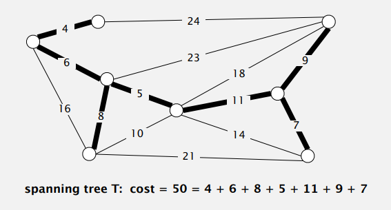​

## Greedy Algorithm

Simplifying Assumptions

* Edge weights are distinct.
* Graph is connected.

Consequence: MST exists and is unique.

​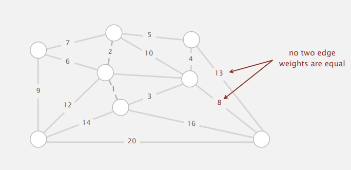​

### Cut Property

* Def. A **cut** in a graph is a partition of its vertices into two (nonempty) sets.
* Def. A **crossing edge** connects a vertex in one set with a vertex in the other.

* Cut property. Given any cut, the crossing edge of min weight is in the MST.

​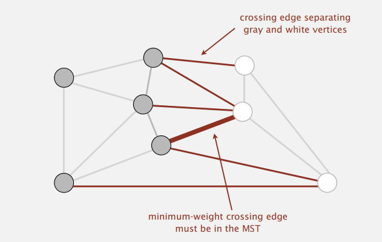​

Pf. Suppose min-weight crossing edge *e* is not in the MST.

* Adding *e* to the MST creates a cycle.
* Some other edge *f* in cycle must be a crossing edge.
* Removing *f* and adding *e* is also a spanning tree.
* Since weight of *e* is less than the weight of *f*, that spanning tree is lower weight.
* Contradiction.

​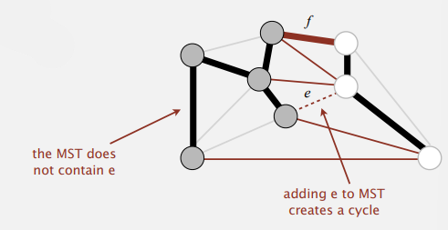​

### Implementation

* Start with all edges colored gray.
* Find cut with no black crossing edges; color its min-weight edge black.
* Repeat until *V* - 1 edges are colored black.

Note: needn't care about the order.

​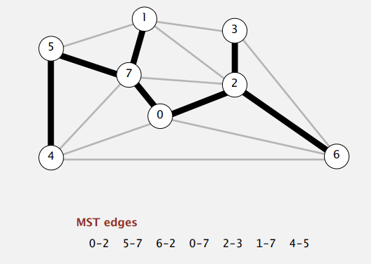​

### Analysis

* Proposition: The greedy algorithm computes the MST.

Pf.

* Any edge colored black is in the MST (cut property).
* Fewer that *V - 1* black edges -> cut with no black crossing edges.

Q: If edge weights are not all distinct

* A. Greedy MST algorithm still correct if equal weights are present

Q: If graph is not connected

* A. Compute minimum spanning forest = MST of each component

## Edge-weighted Graph API

### Edge

​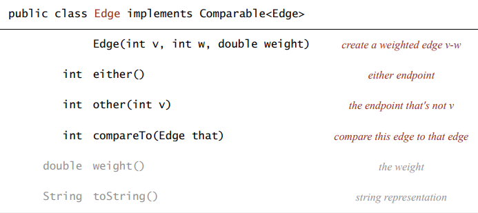​

v-w: `v = e.either(); w = e.other(v)`​

#### Implementation

```Java
/**
 * @Author: Zephyrtoria
 * @CreateTime: 2024-10-22
 * @Description:
 * @Version: 1.0
 */
public class Edge implements Comparable<Edge> {
    private final int v, w;
    private final double weight;

    public Edge(int v, int w, double weight) {
        this.v = v;
        this.w = w;
        this.weight = weight;
    }

    public int either() {
        return v;
    }

    public int other(int vertex) {
        if (vertex == v) {
            return w;
        }
        return v;
    }

    @Override
    public int compareTo(Edge o) {
        if (this.weight < o.weight) {
            return -1;
        } else if (this.weight > o.weight) {
            return 1;
        } else {
            return 0;
        }
    }
}
```

### Edge-weighted graph

​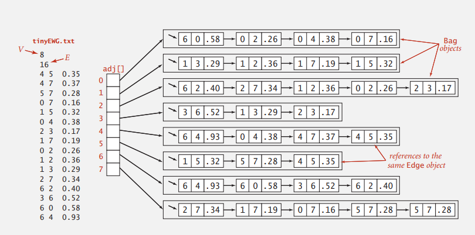​

#### Implementation

```Java
import edu.princeton.cs.algs4.Bag;

/**
 * @Author: Zephyrtoria
 * @CreateTime: 2024-10-22
 * @Description:
 * @Version: 1.0
 */
public class EdgeWeightedGraph {
    private Bag<Edge>[] adj;
    private int V;

    public EdgeWeightedGraph(int V) {
        this.V = V;
        adj = (Bag<Edge>[]) new Bag[V];
        for (int v = 0; v < V; v++) {
            adj[v] = new Bag<Edge>();
        }
    }

    // add weighted edge e to this graph, just like undirected graph
    public void addEdge(Edge e) {
        int v = e.either();
        int w = e.other(v);
        adj[v].add(e);
        adj[w].add(e);
    }

    // edges incident to v
    public Iterable<Edge> adj(int v) {
        return adj[v];
    }
}
```

### MST

​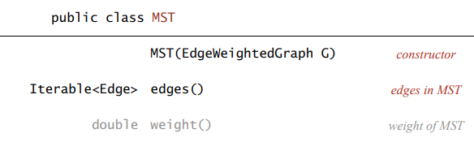​

## Kruskal's Algorithm

Consider edges in ascending order of weight.

* Add next edge to tree *T* unless doing so would create a cycle.

Pf.

* Suppose Kruskal's algorithm colors the edge *e = v - w* black.
* Cut = set of vertices connected to *v* in tree *T*.
* No crossing edge is black.
* No crossing edge has lower weight.

### Challenge

Would adding edge *v-w* to tree *T* create a cycle?

* O(*V*): run DFS from *v*, check if *w* is reachable.
* O(log*V*): use the union-find data structure.

### Implementation

User the **union-find** data structure:

* Maintain a set for each connected component in *T*.
* If *v* and *w* are in same set, then adding *v-w* would create a cycle. (should be ignored)
* To add *v-w* to *T*, merge sets containing *v* and *w*.

​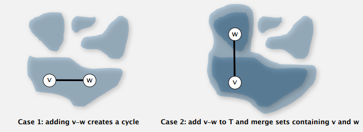​

```Java
import edu.princeton.cs.algs4.*;
import edu.princeton.cs.algs4.Edge;
import edu.princeton.cs.algs4.EdgeWeightedGraph;

/**
 * @Author: Zephyrtoria
 * @CreateTime: 2024-10-22
 * @Description:
 * @Version: 1.0
 */
public class KruskalMST {
    private Queue<Edge> mst = new Queue<>();

    public KruskalMST(EdgeWeightedGraph G) {
		// put all the edges into the priority queue, sorting in ascending order
        MinPQ<Edge> pq = new MinPQ<>();
        for (Edge e : G.edges()) {
            pq.insert(e);
        }

		// create MST
        UF uf = new UF(G.V());
        while (!pq.isEmpty() && mst.size() < G.V() - 1) {
            Edge e = pq.delMin();
            int v = e.either();
            int w = e.other(v);
			// check whether the adding will cause cycle with union-find
            if (!uf.connected(v, w)) {
                uf.union(v, w);
                mst.enqueue(e);
            }
        }
    }

    public Iterable<Edge> edges() {
        return mst;
    }
}

```

### Analysis

* Proposition: Kruskal's algorithm computes MST in time proportional to *E* log *E* (in the worst case).

Pf.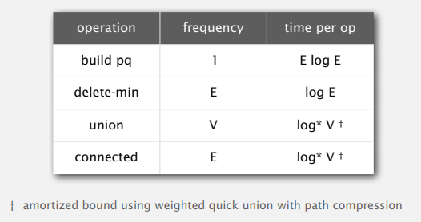​

Remark. If edges are already sorted, order of growth is *E* log* *V*.

## Prim's Algorithm

* Start with vertex 0 and greedily grow tree *T*.
* Add to *T* the min weight edge with **exactly one endpoint in** ***T***.
* Repeat until *V - 1* edges.

Pf.

* Suppose edge *e* = min weight edge connecting a vertex on the tree to a vertex not on the tree.
* Cut = set of vertices connected on tree.
* No crossing edge is black.
* No crossing edge has lower weight.

### Challenge

Find the min weight edge with exactly one endpoint in *T*.

* O(*E*): try all edges.
* O(log *E*): use a priority queue

### Lazy Implementation

Lazy solution: Maintain a PQ of **edges** with (at least) one endpoint in *T*.

* Key = edge, priority = weight of edge.
* Delete-min to determine next edge *e = v-w* to add to *T*.
* Disregard if **both endpoints** ***v*** **and** ***w*** **are marked** (both in *T*).
* Otherwise, let *w* be the unmarked vertex (not in *T*):

  * add to PQ any edge incident to *w* (assuming other endpoint not in *T*).
  * add *e* to *T* and mark *w*.

The priority queue contains all of the edges that cross the cut, plus possibly some edges with both endpoints in the tree.

```Java
import edu.princeton.cs.algs4.Edge;
import edu.princeton.cs.algs4.EdgeWeightedGraph;
import edu.princeton.cs.algs4.MinPQ;
import edu.princeton.cs.algs4.Queue;

/**
 * @Author: Zephyrtoria
 * @CreateTime: 2024-10-23
 * @Description:
 * @Version: 1.0
 */
public class LazyPrimeMST {
    private boolean[] marked;
    private Queue<Edge> mst;
    private MinPQ<Edge> pq;

    public LazyPrimeMST(EdgeWeightedGraph G) {
        pq = new MinPQ<>();
        mst = new Queue<>();
        marked = new boolean[G.V()];
        visit(G, 0);

        while (!pq.isEmpty() && mst.size() < G.V() - 1) {
            Edge e = pq.delMin();
            int v = e.either();
            int w = e.other(v);
            // ignore if both endpoints in T
            if (marked[v] && marked[w]) {
                continue;
            }
            // add edge e to tree
            mst.enqueue(e);
            // add v or w to tree
            if (!marked[v]) {
                visit(G, v);
            }
            if (!marked[w]) {
                visit(G, w);
            }
        }
    }

    private void visit(EdgeWeightedGraph G, int v) {
        marked[v] = true;
        for (Edge e : G.adj(v)) {
            if (!marked[e.other(v)]) {
                pq.insert(e);
            }
        }
    }

    public Iterable<Edge> mst() {
        return mst;
    }
}
```

#### Analysis

* Proposition: Lazy Prim's algorithm computes the MST in time proportional to *E* log *E* and extra space proporional to *E* (in the worst case)

​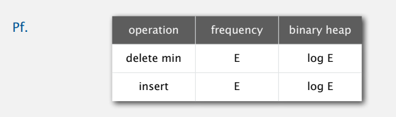​

### Eager Implementation

Eager solution: Maintain a PQ of **vertices** connected by en edge to *T*, where priority of vertex *v* - weight of shortest edge connecting *v* to *T*.

* Delete min vertex *v* and add its associated edge *e* = *v-w* to *T*.
* Update PQ by considering all edges *e* = *v*-*x* incident to *v*.

  * ignore if *x* is already in *T* (if there are no better choice).
  * add *x* to PQ if not already on it.
  * **decrease priority** of *x* if *v-x* becomes shortest edge connecting *x* to *T*.

​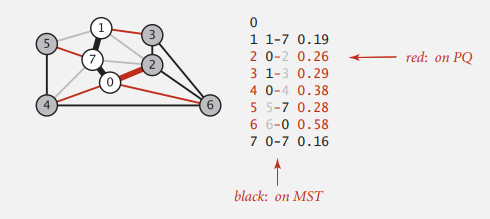​

For each non-tree vertex *v*, the eager version of Prim's algorithm maintains at most one entry in the priority queue (with key equal to the weight of the cheapest edge from *v* to the tree)

#### Indexed Priority Queue

Associate an index between 0 and *N - 1* with each key in a priority queue.

* Client can insert and delete the minimum.
* Client can change the key by specifying the index.

​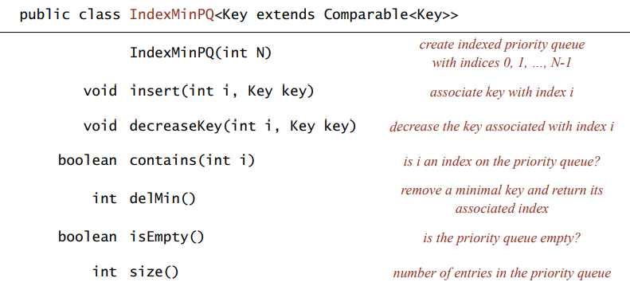​

Implementation.

* Start with same code as `MinPQ`​.
* Maintain parallel arrays `keys[]`​, `pq[]`​, and `qp[]`​ so that:

  * ​`keys[i]`​ is the priority of *i*.
  * ​`pq[i]`​ is the index of the key in heap position *i*.
  * ​`qp[i]`​ is the heap position of the key with index *i*.
* Use `swim(qp[i])`​ implement `decreaseKey(i, key)`​.

​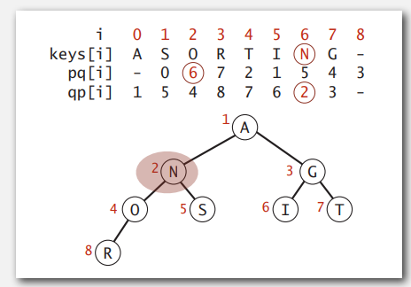​

#### Analysis

​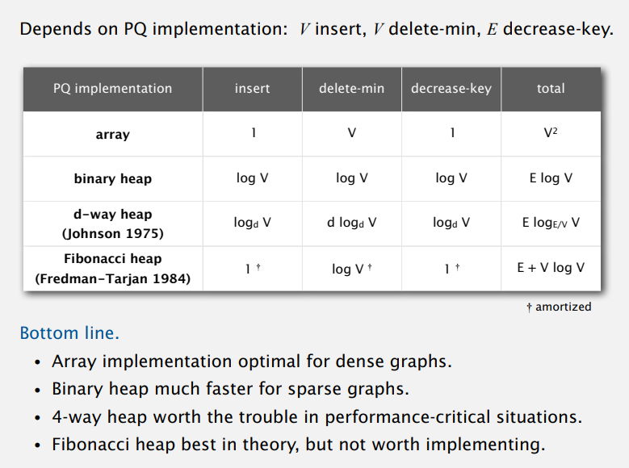​

# Shorest Paths

Given an edge-weighted digraph, find the shortest path from *s* to *f*.

​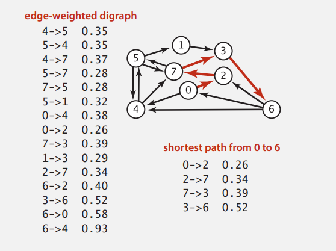​

* Vertices

  * Single-source: from one vertex *s* to every other vertex.
  * Source-sink: from one vertex *s* to another *t*.
  * All pairs: between all pairs of vertices.
* Restrictions on edge weights:

  * Nonnegative weights.
  * Euclidean weights.
  * Arbitrary weights.
* Cycles:

  * No directed cycles.
  * No negative cycles.

## APIs

### Edge

​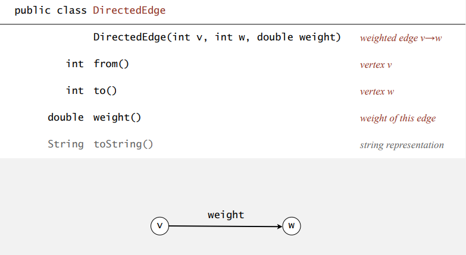​

Processing an edge: `int v = e.from(), w = e.to()`​

```Java
/**
 * @Author: Zephyrtoria
 * @CreateTime: 2024-10-26
 * @Description:
 * @Version: 1.0
 */
public class DirectedEdge {
    private final int v, w;
    private final double weight;

    public DirectedEdge(int v, int w, double weight) {
        this.v = v;
        this.w = w;
        this.weight = weight;
    }

    public int from() {
        return v;
    }

    public int to() {
        return w;
    }

    public double weight() {
        return weight;
    }
}

```

### Graph

​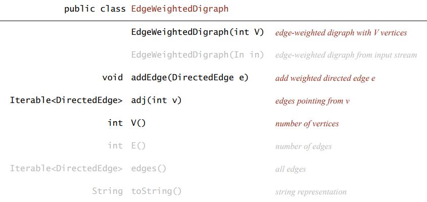​

Allow self-loops and parallel edges.

```Java
import edu.princeton.cs.algs4.Bag;

/**
 * @Author: Zephyrtoria
 * @CreateTime: 2024-10-26
 * @Description:
 * @Version: 1.0
 */
public class EdgeWeightedDigraph {
    private final int V;
    private final Bag<DirectedEdge>[] adj;

    public EdgeWeightedDigraph(int V) {
        this.V = V;
        adj = (Bag<DirectedEdge>[]) new Bag[V];
        for (int i = 0; i < V; i++) {
            adj[i] = new Bag<>();
        }
    }

    // add edge v -> w
    public void addEdge(DirectedEdge e) {
        int v = e.from();
        adj[v].add(e);
    }

    public Bag<DirectedEdge> adj(int v) {
        return adj[v];
    }
}

```

### Single-source Shortest Paths

Goal: Find the shortest path form *s* to every other vertex.

​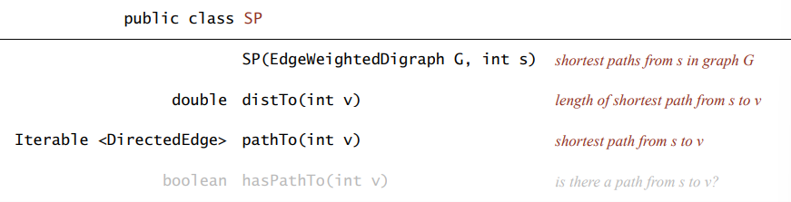​

The API requires the algorithm to compute the shortest path from *s* to every other vertex.

## Shortest-paths Properties

* Goal: Find the shortest path from *s* to every other vertex.
* Observation: A **shortest-paths tree (SPT)**  solution exists.
* Consequence: Can represent the SPT with two vertex-indexed arrays:

  * ​`distTo[v]`​ is length of shortest path from *s* to *v*.
  * ​`edgeTo[v]`​ is last edge on shortest path from *s* to *v*.

​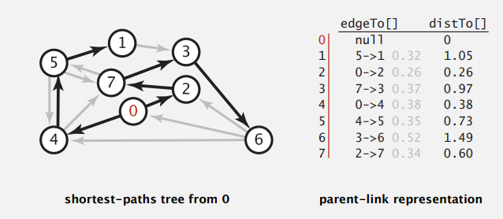​

```Java
public double distTo(int v) {
    return distTo[v];
}

public Iterable<DirectedEdge> pathTo(int v) {
    Stack<DirectedEdge> path = new Stack<>();
    for (DirectedEdge e = edgeTo[v]; e != null; e = edgeTo[e.from()]) {
        path.push(e);
    }
    return path;
}
```

### Edge Relaxation

Relax edge *e = v-&gt;w:*

* ​`distTo[v]`​ is length of shortest **known** path from *s* to *v*.
* ​`distTo[w]`​ is length of shortest **known** path from *s* to *w*.
* ​`edgeTo[w]`​ is last edge on shortest **known** path from *s* to *w*.
* If *e = v-&gt;w* gives shorter path to *w* through *v*, update both `distTo[w]`​ and `edgeTo[w]`​

​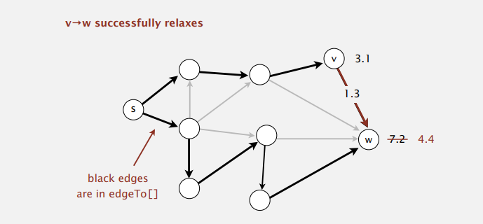​

```Java
private void relax(DirectedEdge e) {
    int v = e.from();
    int w = e.to();
    // a shorter path
    if (distTo[w] > distTo[v] + e.weight()) {
        distTo[w] = distTo[v] + e.weight();
        edgeTo[w] = e;
    }
}
```

### Shortest-paths Optimality Conditions

* Proposition: Let *G* be an edge-weighted digraph.

  Then `distTo[]`​ are the shortest path distances from *s* iff:

  * ​`distTo[s] = 0`​
  * For each vertex *v*, `distTo[v]`​ is the length of some path from *s* to *v*.
  * For each edge *e = v-&gt;w*, `distTo[w] <= distTo[v] + e.weight()`​
* Pf. necessary

  * Suppose that `distTo[w] > distTo[v] + e.weight()`​ for some edge *e = v-&gt;w*.
  * Then, *e* gives a path from *s* to *w* (through *v*) of length less than `distTo[w]`​.
* Pf. sufficient

  ​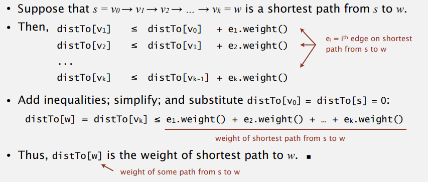​

### Generic Shortest-paths Algorithm

* Initialize `distTo[s] = 0`​ and `distTo[v] = ∞`​ for all other vertices.
* Repeat until optimality conditions are satisfied:

  * Relax and edge.

* Proposition: Generic algorithm computes SPT (if it exists) from *s*.
* Pf.

  * Throughout algorithm, `distTo[v]`​ is the length of a simple path from *s* to *v*, and `edgeTo[v]`​ is last edge on path.
  * Each successful relaxation decreases `distTo[v]`​ for some *v*.
  * The entry `distTo[v]`​ can decreases at most a finite number of times.

### Efficient Implementaions

* Dijkstra's algorithm: nonnegative weights.
* Topological sort algorithm: no directed cycles.
* Bellman-Ford algorithm: no negavtive cycles.

## Dijkstra's Algorithm

* Consider vertices in increasing order of distance from *s*.

  * non-tree vertex with the lowest `distTo[]`​ value.
* Add vertex to tree and relax all edges pointing from that vertex.

### Correctness Proof

* Proposition: Dijkstra's algorithm computes a SPT in any edge-weighted digraph with nonnegative weights.
* Pf.

  * Each edge *e = v-&gt;w* is relaxed exactly once (when *v* is relaxed), leaving `distTo[w] <= distTo[v] + e.weight()`​.
  * Inequality holds until algorithm terminates because:

    * ​`distTo[w]`​ connot increase (monotone decreasing)
    * ​`distTo[v]`​ will not change (choose lowest `distTo[v]`​ value at each step and edge weights are nonnegative).

### Implementation

```Java
import edu.princeton.cs.algs4.IndexMinPQ;

/**
 * @Author: Zephyrtoria
 * @CreateTime: 2024-10-26
 * @Description:
 * @Version: 1.0
 */
public class DijkstraSP {
    private DirectedEdge[] edgeTo;
    private double[] distTo;
    private IndexMinPQ<Double> pq;

    public DijkstraSP(EdgeWeightedDigraph G, int s) {
        edgeTo = new DirectedEdge[G.V()];
        distTo = new double[G.V()];
        pq = new IndexMinPQ<Double>(G.V());

        for (int v = 0; v < G.V(); v++) {
            distTo[v] = Double.POSITIVE_INFINITY;  // infinity
        }
        distTo[s] = 0.0;

        pq.insert(s, 0.0);
        while (!pq.isEmpty()) {
            int v = pq.delMin();
			// check all edge adjacent to this vertex
            for (DirectedEdge e : G.adj(v)) {
                relax(e);
            }
        }
    }

    private void relax(DirectedEdge e) {
        int v = e.from(), w = e.to();
        if (distTo[w] > distTo[v] + e.weight()) {
            distTo[w] = distTo[v] + e.weight();
            edgeTo[w] = e;
            if (pq.contains(w)) {
                pq.decreaseKey(w, distTo[w]);  // update PQ
            } else {
                pq.insert(w, distTo[w]);
            }
        }
    }
}
```

### Computing Spanning Trees

* Prim's algorithm is essentially the same algorithm

  * Closest vertex to the **tree**​
* Dijkstra's algorithm

  * Cloest vertex to the **source**​

DFS and BFS are also the same.

### Analysis

Depends on PQ implementatoin:

* *V* insert
* *V* delete-min
* *E* decrease-key

​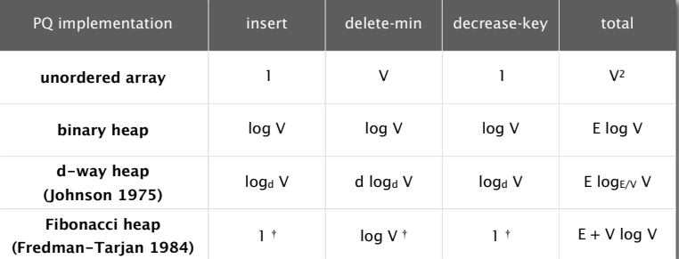​

* Array implementatioin optimal for dense graphs.
* Binary heap much faster for sparse graphs.
* 4-way heap worth the trouble in performance-critical situation.
* Fibonacci heap best in theory, but not worth implementing.

## Edge-weighted DAGs

If this edge-weighted digraph has no directed cycles, it is a easier way to find shortest path.

* Consider vertices in topological order.
* Relax all edges pointing from that vertex.

### Analysis

* Proposition: Topological sort algorithm computes SPT in any edge-weighted DAG in time propotional to *E + V*.
* Pf.

  * Each edge *e = v-&gt;w* is relaxed exactly once (when *v* is relaxed), leaving `distTo[w] <= distTo[v] + e.weight()`​.
  * Inequality holds until algorithm terminates because:

    * ​`distTo[w]`​ cannot increase
    * ​`distTo[v]`​ will not change (because of topological order, no edge pointing to *v* will be relaxed after *v* is relaxed.)

Negative edges will not influence the consequence.

### Implementation

```Java
import edu.princeton.cs.algs4.DirectedEdge;
import edu.princeton.cs.algs4.EdgeWeightedDigraph;
import edu.princeton.cs.algs4.Topological;

/**
 * @Author: Zephyrtoria
 * @CreateTime: 2024-10-27
 * @Description:
 * @Version: 1.0
 */
public class AcyclicSP {
    private DirectedEdge[] edgeTo;
    private double[] distTo;

    public AcyclicSP(EdgeWeightedDigraph G, int s) {
        edgeTo = new DirectedEdge[G.V()];
        distTo = new double[G.V()];

        for (int v = 0; v < G.V(); v++) {
            distTo[v] = Double.POSITIVE_INFINITY;
        }
        distTo[s] = 0.0;

        Topological topological = new Topological(G);
        for (Integer v : topological.order()) {
            for (DirectedEdge e : G.adj(v)) {
                relax(e);
            }
        }
    }

    private void relax(DirectedEdge e) {
        int v = e.from(), w = e.to();
        if (distTo[w] > distTo[v] + e.weight()) {
            distTo[w] = distTo[v] + e.weight();
            edgeTo[w] = e;
        }
    }
}

```

### Longest Paths

Formulate as a shortest paths problem in edge-weighted DAGs.

* Negate all weights.
* Find shortest paths.
* Nagate weights in result.

Should reverse sense of equality in `relax()`​.

#### Application

**Parallel job scheduling**: Given a set of jobs with durations and precedence constraints, schedule the jobs (by finding a start time for each) so as to achieve the minimum completion time, while respecting the constraints.

* Critical path method

  * Source and sink vertices
  * Two vertices begin and end for each job.
  * Three edges for each job

    * begin to end (weighted by duration)
    * source to begin (0 weight)
    * end to sink (0 weight)
  * One edge for each precedence constraint  (0 weight).

​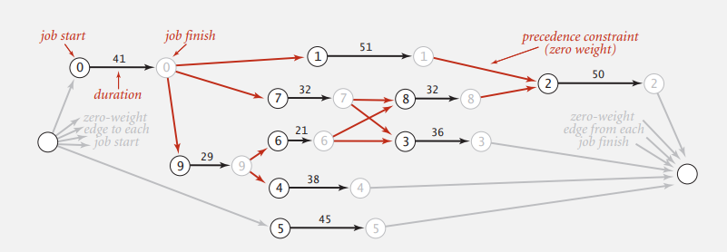​

## Negative Weights

### Failed Attempt

​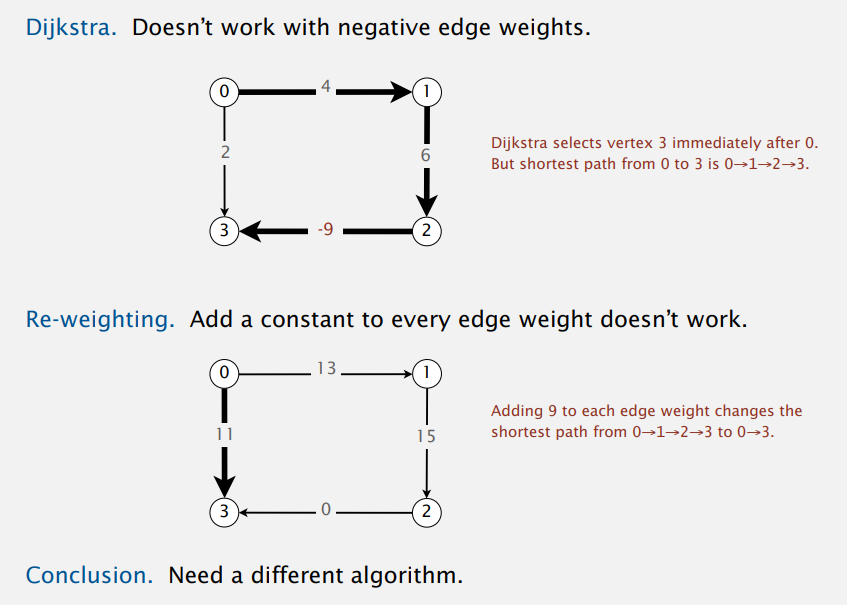​

### Negative Cycles

* Define: A **negative cycle** is a directed whose sum of edge weight is negative.
* Proposition: A SPT exists iff no negative cycles.

### Bellman-Ford Algorithm

* Initialize `distTo[s] = 0`​ and `distTo[v] = ∞`​ for all other vertices.
* Repeat *V* times:

  * Relax each edge.

​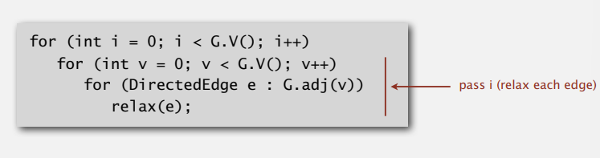​

The code below trie to relax edge from every vertex in one time, then connect in second or more round.

#### Analysis

* Proposition: Dynamic programming algorithm computes SPT in any edge-weighted digraph with no negative cycles in time proportional to *E * V*.
* Pf. After pass *i*, found shortest path containing at most *i* edges.

#### Improvement

* Obervation. If `distTo[v]`​ does not change during pass *i*, no need to relax any edge pointing from *v* in pass *i*  *+ 1.*
* FIFO implementation: Maintain **queue** of vertices whose `distTo[]`​ changed.
* Overall effect

  * The running time is still proportional to *E * V* in worst case.
  * But much faster than that in practice.

### Summary

​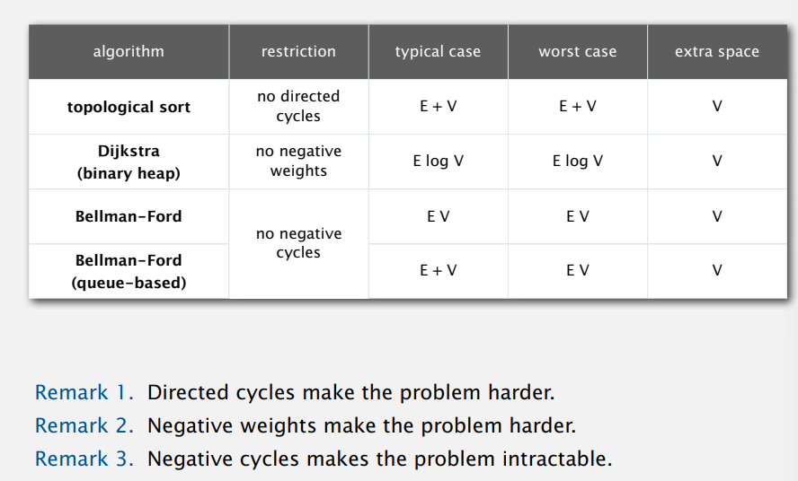​

### Find A Negative Cycle

* Observation: If there is a negative cycle, Bellman-Ford gets stuck in loop, updating `distTo[]`​ and `edgeTo[]`​ entrie of vertices in the cycle.
* Proposition: If any vertex *v* is updated in phase *v*, there exists a neagtive cycle (and can trace back `edgeTo[v]`​ entrie to find it).

## Summary

* Dijkstra’s algorithm.

  * Nearly linear-time when weights are nonnegative.
  * Generalization encompasses DFS, BFS, and Prim.
* Acyclic edge-weighted digraphs. 

  * Arise in applications.
  * Faster than Dijkstra’s algorithm.
  * Negative weights are no problem.
* Negative weights and negative cycles. 

  * Arise in applications.
  * If no negative cycles, can find shortest paths via Bellman-Ford.
  * If negative cycles, can find one via Bellman-Ford.

# Maximum Flow

## Introduction

### Mincut Problem

Input: An edge-weighted digraph, source vertex *s*, and target vertex *t*.

Each edge has a positive capacity.

​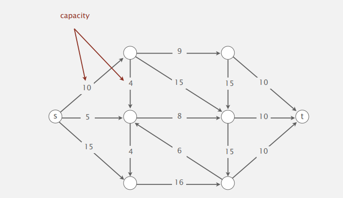​

* Def. A **st-cut (cut)**  is a partition of the vertices into two disjoint sets, with *s* in one set *A* and *t* in the other set *B*.
* Def. Its **capacity** is the sum of the capacities of the edges from *A* to *B*. (don't count edges from *B* to *A*)

​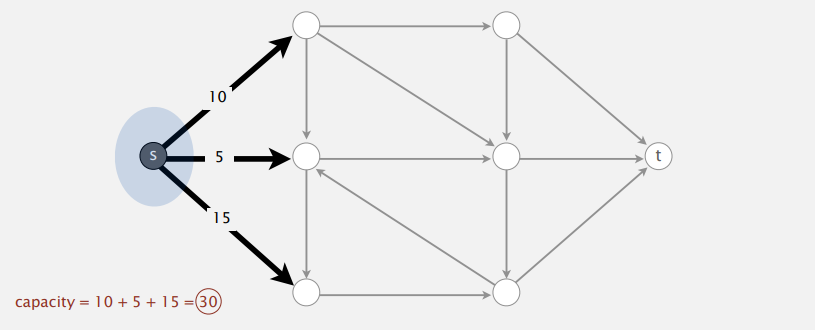​

* **Minimum st-cut (mincut) problem**: Find a cut of minimum capacity.

### Maxflow Problem

Input: An edge-weighted digraph, source vertex *s*, and target vertex *t*.

Each edge has a positive capacity.

* Def. An **st-flow (flow)**  is an assignment of values to the edges such that:

  * Capacity constraint: 0 <= edge's flow <= edge's capacity.
  * Local equilibrium: inflow = outflow at every vertex (exxcept *s* and *t*).

​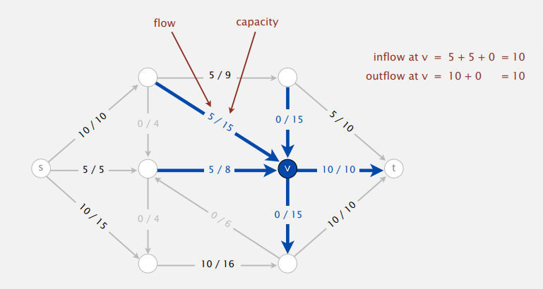​

* Def. The **value** of a flow is the inflow at *t*. (Assume no edge points to *s* or from *t*)

​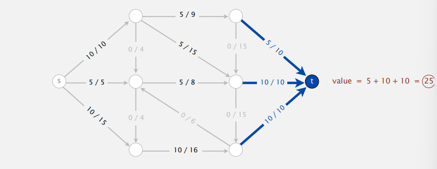​

* **Maximum st-flow (maxflow) problem**: Find a flow of maximum value.

## Ford-Fulkerson Algorithm

1. Initialization: Start with 0 flow.

​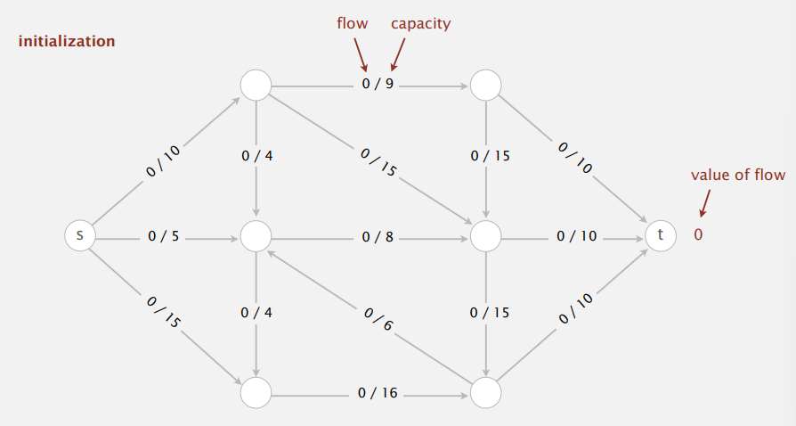​

2. Augmenting path: Find an undirected path from *s* to *t* such that:

    1. Can increase flow on forward edges. (not full).
    2. Can decrease flow on backward edge. (not empty).​

​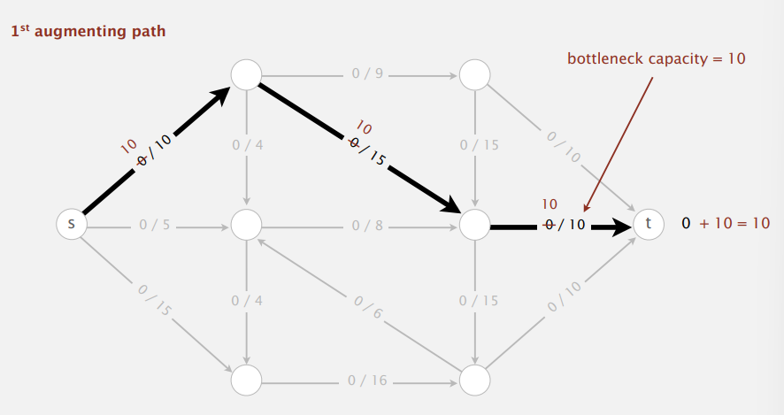​

​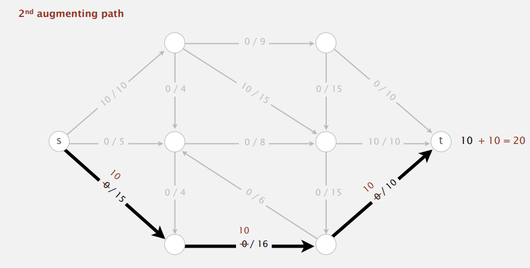​

​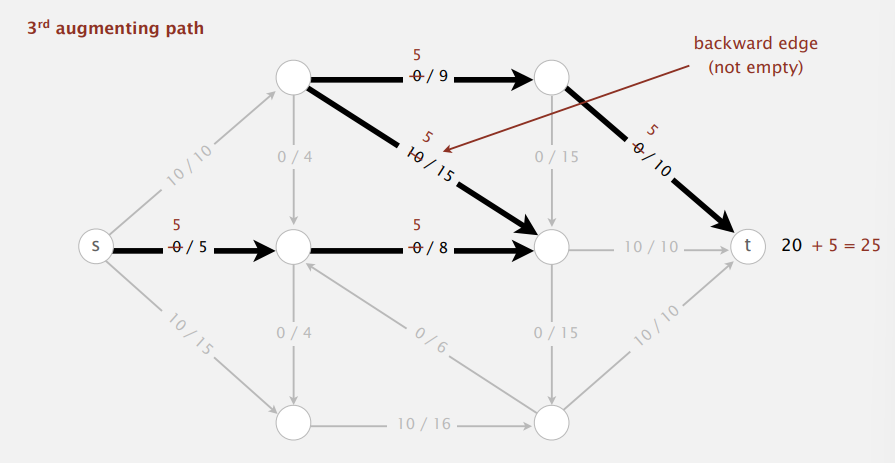​

​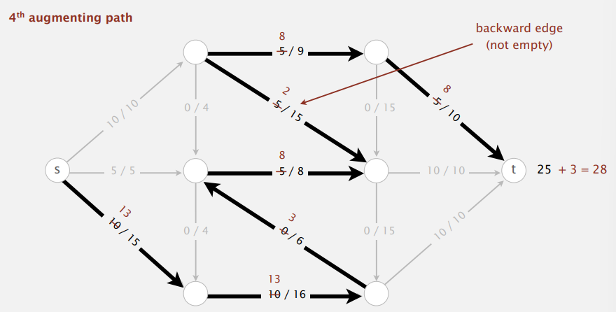​

**Termination**: All paths from *s* to *t* are blocked by either a:

* Full forward edge.
* Empty backward edge.

​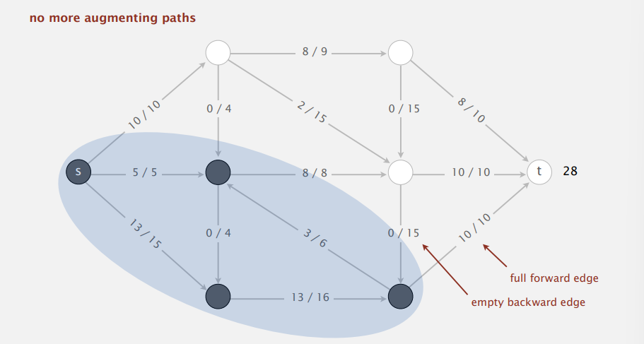​

### Idea

* Start with 0 flow.
* While there exists an augmenting path:

  * Find an augmenting path.
  * Compute bottleneck capacity.
  * Increase flow on that path by bottleneck capacity.

Q:

* How to compute a mincut?
* How to find an augmenting path?
* Correctness?
* Does the algorithm always terminate? After how many augmentations?

## Maxflow-mincut Theorem

### Relationship between flows and cuts

* Def. The **net flow** across a cut (*A*, *B*) is the sum of the flows on its edges from *A* to *B* minus the sum of the flows on its edges from *B* to *A*.
* **Flow-value lemma**: Let *f* be any flow and let (*A*, *B*) be any cut. Then, the **net flow** across (*A*, *B*) equals the value of *f*.

​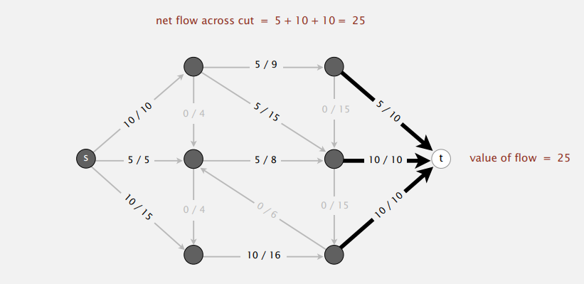​

* Pf. By induction on the size of *B*.

  * Base case: *B* = { *t* }.
  * Induction step: remains true by local equilibrium when moving any vertex from *A* to *B*.
* Corollary: Outflow from *s* == inflow to *t* == value of flow.

Weak duality: The value of the flow <= the capacity of the cut.

* Pf. Value of flow *f* == net flow across cut (*A*, *B*) <= capacity of cut (*A*, *B*).

  * flow-value lemma
  * flow bounded by capacity.

### Maxflow-mincut Theorem

* Augmenting path theorem: A flow *f* is a maxflow iff no augmenting paths.
* Maxflow-mincut theorem: Value of the maxflow == capacity of mincut.

Pf. The following three conditions are equivalent for any flow *f*:

1. There exists a cut whose capacity equals the value of the flow *f*.
2. *f* is a maxflow.
3. There is no augmenting path with respect to *f*.

### Computing a mincut from a maxflow

* By augmenting path theorem, no augmenting paths wiith respect to *f*.
* Compute *A* = set of vertices connected to *s* by an undirected path with no full forward or empty backward edges.

​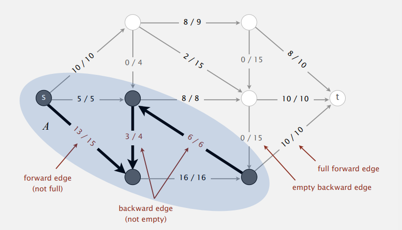​

## Running Time Analysis

### Q&A

* How to compute a mincut?

  * FF
* How to find an augmenting path?

  * BFS
* Correctness?

  * Yes
* Does the algorithm always terminate? After how many augmentations?

  * (1) Yes, provided edge capacities are integers or augmenting paths are chosen carefully. (2) requires analysis.

### With Integer Capacities

Special case: Edge capacities are integers between 1 and *U*.

* Invariant. The flow is **integer-valued** (flow on each edge is an integer) throughout FF.
* Pf.

  * Bottleneck capacity is an integer.
  * Flow on an edge increases/decreases by bottleneck capacity.

* Proposition: Number of augmentations <= the value of the maxflow.
* Pf. Each augmentation increases the value by at least 1.

**Integrality theorem**: There exists an integer-valued maxflow (and FF finds one).

Pf. FF terminates and maxflow that it finds is integer-valued.

* Bad case: Even when edge capacities are integers, number of augmenting paths could be equal to the value of the maxflow.

​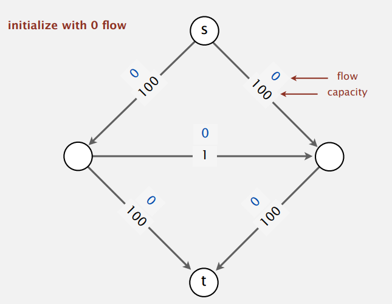​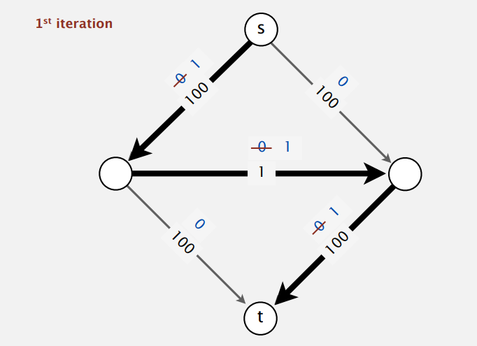​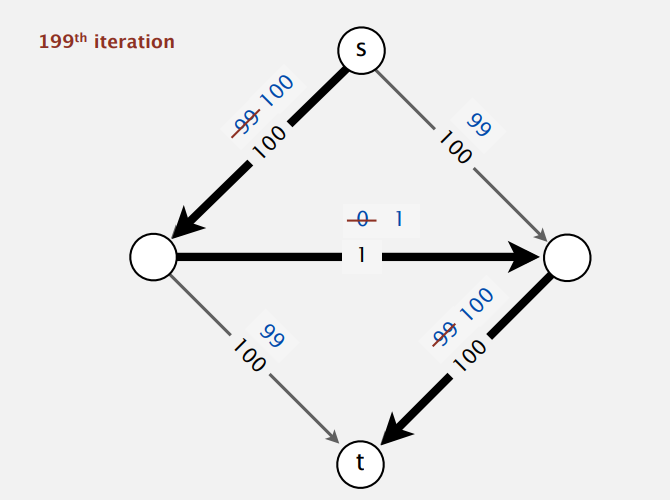​

This case should be avoided. (use shortest/fattest path)

### Choose Augmenting Paths

FF performance depends on choice of augmenting paths.

​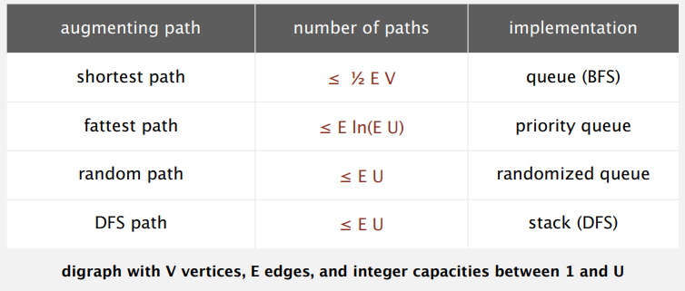​

​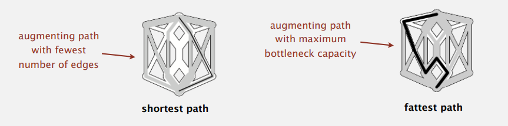​

## Implementation

### Flow Network Representation

* Flow egde data type: Associate flow *f*​*<sub>e</sub>* and capacity *c*​*<sub>e</sub>* with edge *e = v-&gt;w*.

  ​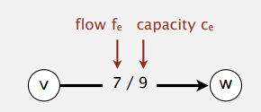​
* Flow network data type: Need to precess edge *e = v-&gt;w* in either direction: include *e* in both *v* and *w*'s adjacency lists.
* Residual capacity:

  * Forward edge: residual capacity = *c*​*<sub>e</sub>*  - *f*​*<sub>e</sub>*
  * Backward edge: residual capacity = *f*​*<sub>e</sub>*

  ​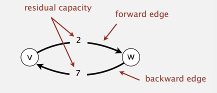​
* Augment flow:

  * Forward edge: add
  * Backward edge: subtract
* Residual network

  ​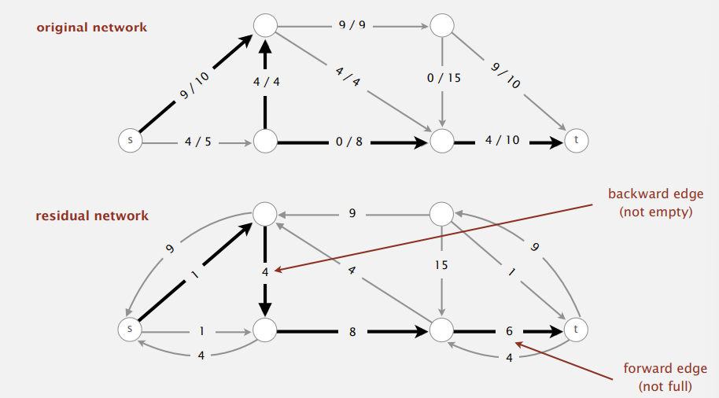​

  Augmenting path in original network is equivalent to directed path in residual network.

### FlowEdge

​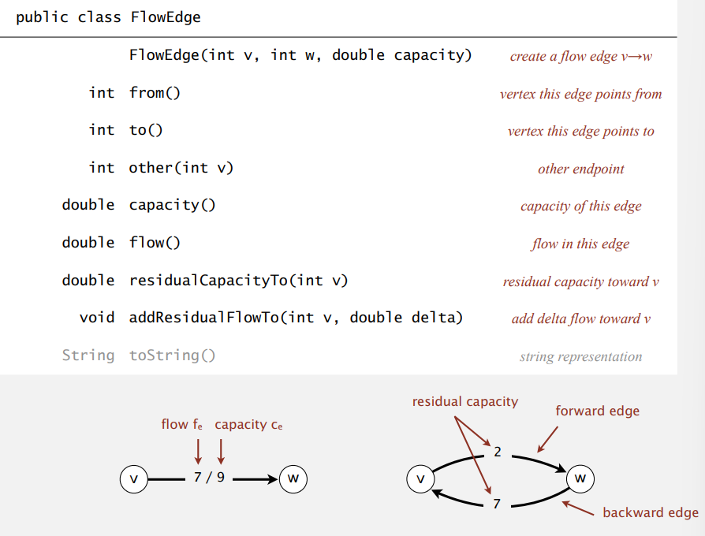​

```Java
/**
 * @Author: Zephyrtoria
 * @CreateTime: 2024-10-30
 * @Description:
 * @Version: 1.0
 */
public class FlowEdge {
    private final int v, w;  // from and to
    private final double capacity;
    private double flow;

    public FlowEdge(int v, int w, double capacity) {
        this.v = v;
        this.w = w;
        this.capacity = capacity;
    }

    public int from() {
        return v;
    }

    public int to() {
        return w;
    }

    public double capacity() {
        return capacity;
    }

    public double flow() {
        return flow;
    }

    public int other(int vertex) {
        if (vertex == v) {
            return w;
        } else if (vertex == w) {
            return v;
        }
        throw new RuntimeException("Illegal endpoint");
    }

    public double residualCapacityTo(int vertex) {
        if (vertex == v) {
            return flow;                // backward edge
        } else if (vertex == w) {
            return capacity - flow;     // forward edge
        }
        throw new IllegalArgumentException();
    }

    public void addResidualFlowTo(int vertex, double delta) {
        if (vertex == v) {
            flow -= delta;      // backward edge
        } else if (vertex == w) {
            flow += delta;      // forward edge
        }
        throw new IllegalArgumentException();
    }
}

```

### FlowNetwork

Allow self-loops and paraller edges.

​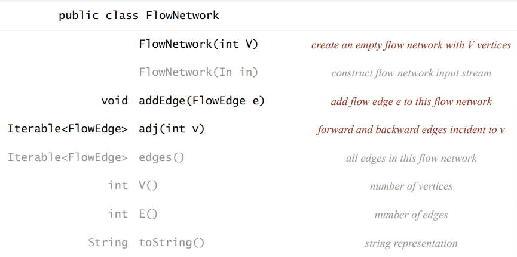​

```Java
import edu.princeton.cs.algs4.Bag;

/**
 * @Author: Zephyrtoria
 * @CreateTime: 2024-10-30
 * @Description:
 * @Version: 1.0
 */
public class FlowNetwork {
    private final int V;
    private Bag<FlowEdge>[] adj;

    public FlowNetwork(int V) {
        this.V = V;
        adj = (Bag<FlowEdge>[]) new Bag[V];
        for (int v = 0; v < V; v++) {
            adj[v] = new Bag<>();
        }
    }

    public void addEdge(FlowEdge e) {
        int v = e.from();
        int w = e.to();
        adj[v].add(e);
        adj[w].add(e);
    }

    public Iterable<FlowEdge> adj(int v) {
        return adj[v];
    }

    public int V() {
        return V;
    }
}
```

### Ford-Fulkerson

```Java
import edu.princeton.cs.algs4.Queue;

/**
 * @Author: Zephyrtoria
 * @CreateTime: 2024-10-30
 * @Description: BFS
 * @Version: 1.0
 */
public class FordFulkerson {
    private boolean[] marked;   // true if s->v path in residual network
    private FlowEdge[] edgeTo;  // last edge on s->v path
    private double value;       // value of flow

    public FordFulkerson(FlowNetwork G, int s, int t) {
        value = 0.0;
        while (hasAugmentingPath(G, s, t)) {    // if there has augmenting path
            double bottle = Double.POSITIVE_INFINITY;
            // compute bottleneck capacity
            for (int v = t; v != s; v = edgeTo[v].other(v)) {
                bottle = Math.min(bottle, edgeTo[v].residualCapacityTo(v));
            }

            // augment flow
            for (int v = t; v != s; v = edgeTo[v].other(v)) {
                edgeTo[v].addResidualFlowTo(v, bottle);
            }

            value += bottle;
        }
    }

    // BFS
    private boolean hasAugmentingPath(FlowNetwork G, int s, int t) {
        edgeTo = new FlowEdge[G.V()];
        marked = new boolean[G.V()];

        Queue<Integer> queue = new Queue<>();
        queue.enqueue(s);
        marked[s] = true;
        while (!queue.isEmpty()) {
            int v = queue.dequeue();

            for (FlowEdge e : G.adj(v)) {
                int w = e.other(v);
                // find path from s to w in the residual network
                if (e.residualCapacityTo(w) > 0 && !marked[w]) {
                    edgeTo[w] = e;      // save last edge on path to w
                    marked[w] = true;   // mark w
                    queue.enqueue(w);   // add w to the queue
                }
            }
        }
        return marked[t];   // whether t reachable from s in residual network
    }

    public double value() {
        return value;
    }

    public boolean inCut(int v) {
        return marked[v];
    }
}
```

# String Sort

## String in Java

**String**: Sequence of characters.

### The `char`​

* C char data type: Typically an 8-bit integer.

  * Supports 7-bit ASCII.
  * Can represent only 256 characters.
* Java char data type: A 16-bit unsigned integer.

  * Supports original 16-bit Unicode.
  * Supports 21-bit Unicode 3.0.

### The `String`​

 String data type in Java: Sequence of characters (immutable).

* Length: Number of characters.
* Indexing: Get the *i*​<sup>*th*</sup> character.
* Substring extracion: Get a contiguous subsequence of characters.
* String concatenation: Append one character to end of another string.

​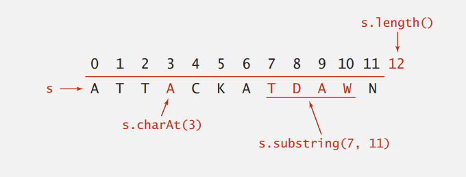​

#### Java Implementation

​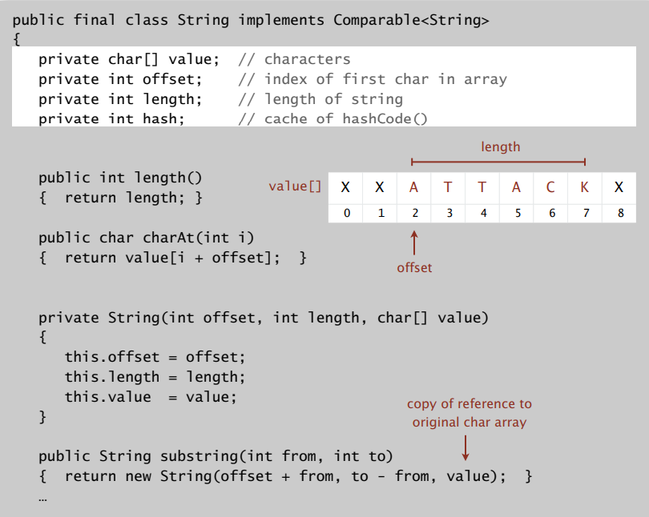​

The `substring()`​ will use the char[] together with the original string.

#### Performance

​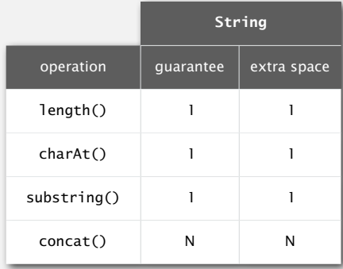​

**Memory**: 40 + 2*N* bytes for a virgin `String`​ of length *N*. (Can use `byte[]`​ or `char[]`​ instead of `String`​ to save space but lose convenince of `String`​ data type.)

### The `StringBuilder`​

* StringBuilder data type: Sequence of mutable characters.
* Underlying implementation: Resizing `char[]`​ array and length.

​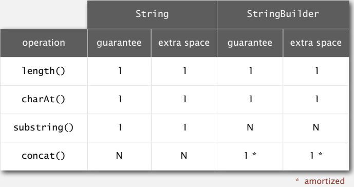​

​`StringBuffer`​ date type is similar, but thread safe (and slower).

### `String`​ vs. `StringBuilder`​

#### Reverse a string

​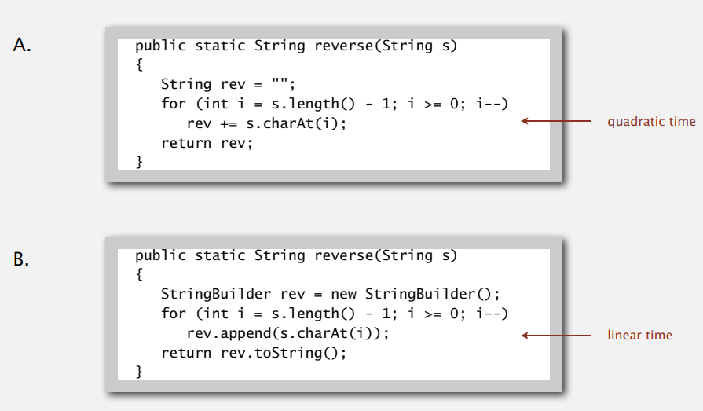​

#### Form array of suffixes

​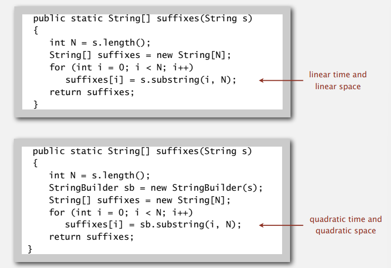​

Oracle and OpenJDK changed their representation of the `String`​ data type in Java 7, Update 6 so that the underlying `char[]`​ array is no longer shared! Now, it takes linear extra space and time to extract a substring (instead of constant extra space and time).

### Longest Common Prefix

```Java
public static int lcp(String s, String t) {
    int N = Math.min(s.length(), t.length());
    for (int i = 0; i < N; i++) {
        if (s.charAt(i) != t.charAt(i)) {
            return i;
        }
    }
    return N;
}
```

**Running time**: Proportional to length *D* of longest common prefix.

Also can compute `compareTo()`​ in sublinear time.

### Alphabets

* Digital key: Sequence of digits over fixed alphabet.
* Radix: Number of digits *R* in alphabet.

​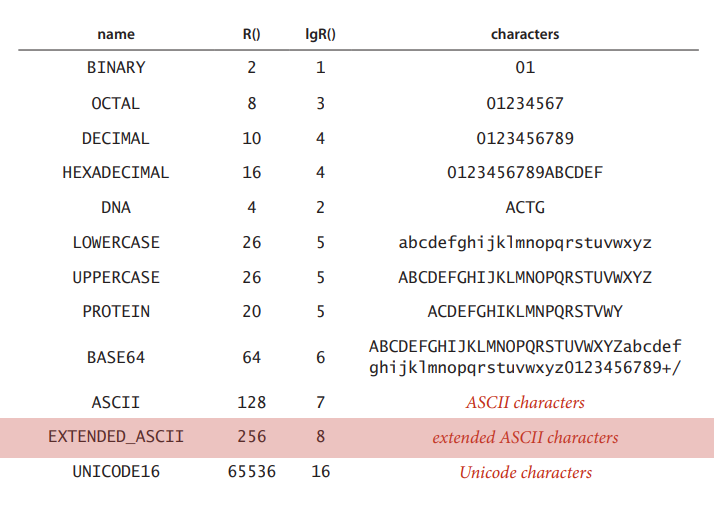​

## Key-indexed Counting

* Assumption: Keys are integers between 0 and *R* - 1.
* Implication: Can use key as an array index.

​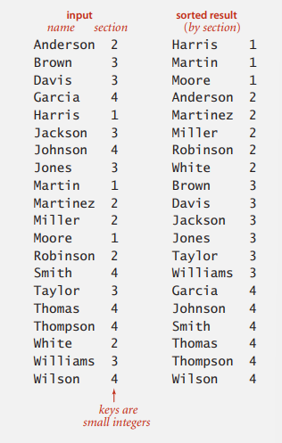​

Keys may have associated data -> can't just count up number of keys of each value.

### Implementation

* Count frequencies of each letter using key as index.
* Compute frequency cumulates which specify destinations.
* Access cumulates using key as index to move items.
* Copy back into original array.

```Java
public static void keyIndexedCounting(int[] a, int R) {
    int N = a.length;
    int[] count = new int[R + 1];
    int[] aux = new int[N];

    for (int i = 0; i < N; i++) {
        count[a[i] + 1]++;
    }

    for (int r = 0; r < R; r++) {
        count[r + 1] += count[r];
    }

    for (int i = 0; i < N; i++) {
        aux[count[a[i]]++] = a[i];
    }

    for (int i = 0; i < N; i++) {
        a[i] = aux[i];
    }
}
```

### Analysis

* Proposition: Key-indexed counting uses ~ 11 *N* + 4 *R* array access to sort *N* items whose keys are integers between 0 and *R* - 1.
* Proposition: Key-indexed counting uses extra space proportional to *N* + *R*.
* Key-indexed counting is stable.

## LSD Radix Sort

* Least-significant-digit-first string sort

  * Consider characters from right to left.
  * Stably sort using *d*​*<sup>th</sup>* character as the key (using key-indexed counting).

​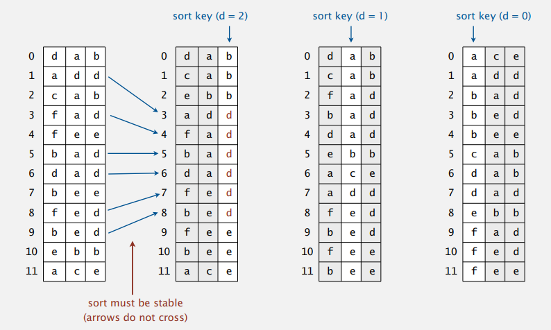​

### Correctness

* Proposition: LSD sorts fixed-length strings in ascending order.
* Pr. After pass *i*, strings are sorted by last *i* characters.

  * If two strings differ on sort key, key-indexed sort puts them in proper relative order.
  * If two strings agree on sort key, stability keeps them in proper relative order.
* Proposition: LSD sort is stable.

### Implementation

```Java
/**
 * @Author: Zephyrtoria
 * @CreateTime: 2024-11-01
 * @Description:
 * @Version: 1.0
 */
public class LSD {
    public static void sort(String[] a, int W) {
        int R = 256;    // radix R (ASCII)
        int N = a.length;
        String[] aux = new String[N];

        for (int d = W - 1; d >= 0; d--) {
            int[] count = new int[R + 1];
            for (int i = 0; i < N; i++) {
                count[a[i].charAt(d) + 1]++;
            }
            for (int r = 0; r < R; r++) {
                count[r + 1] += count[r];
            }
            for (int i = 0; i < N; i++) {
                aux[count[a[i].charAt(d)]++] = a[i];
            }
            for (int i = 0; i < N; i++) {
                a[i] = aux[i];
            }
        }
    }
}
```

### Analysis

​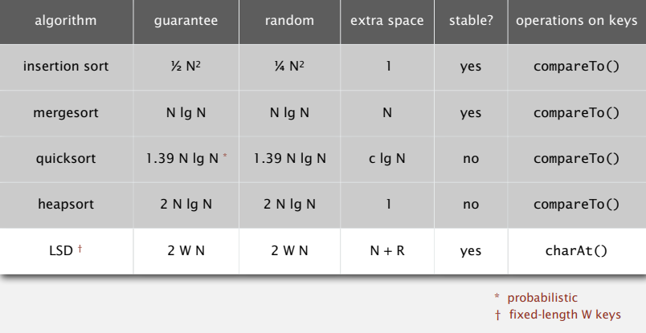​

## MSD Radix Sort

* Most-significant-digit-first string sort
* Partition array in *R* pieces according to first character use key-indexed counting.
* Recursively sort all strings that start with each character (key-indexed counts delineate subarrays to sort).

​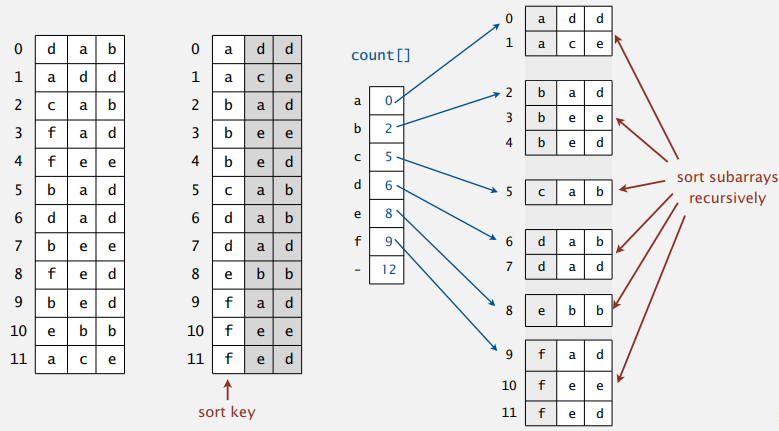​

### Variable-length strings

Treat strings as if they had extra char at end (smaller than any char (to maintain stable)).

```Java
private static int charAt(String s, int d) {
    if (d < s.length()) {
        return s.charAt(d);
    }
    return -1;
}
```

In C string: Have extra char `'\0'`​ at end, so no extra work needed.

### Implementation

```Java
/**
 * @Author: Zephyrtoria
 * @CreateTime: 2024-11-01
 * @Description:
 * @Version: 1.0
 */
public class MSD {
    private static String[] aux;
    private static final int R = 256;

    public static void sort(String[] a) {
        aux = new String[a.length];     // aux[] can be recycle
        sort(a, aux, 0, a.length - 1, 0);
    }

    private static void sort(String[] a, String[] aux, int lo, int hi, int d) {
        if (hi <= lo) {
            return;
        }
        int[] count = new int[R + 2];   // we need an extra char
        for (int i = lo; i <= hi; i++) {
            count[charAt(a[i], d) + 2]++;
        }
        for (int r = 0; r < R + 1; r++) {
            count[r + 1] += count[r];
        }
        for (int i = lo; i <= hi; i++) {
            aux[count[charAt(a[i], d) + 1]++] = a[i];
        }
        for (int i = lo; i <= hi; i++) {
            a[i] = aux[i - lo];
        }

        // sort R subarrays recursively
        for (int r = 0; r < R; r++) {
            sort(a, aux, lo + count[r], lo + count[r + 1] - 1, d + 1);
        }
    }

    private static int charAt(String s, int d) {
        if (d < s.length()) {
            return s.charAt(d);
        }
        return -1;
    }
}

```

### Analysis

* Observation 1. Much too slow for small subarrays.

  * Each function call needs its own `count[]`​ array.
  * ASCII (256 counts): 100x slower than copy pass for *N* = 2.
  * Unicode (65536 counts): 32000x slower for *N* = 2.
* Observation 2: Huge number of small subarrays because of recursion.

* Solution: Cutoff to insertion sort for small subarrays.

  * Insertion sort, but start at *d*​*<sup>th</sup>* character.
  * Implement `less()`​ so that it compares starting at *d*​*<sup>th</sup>* character.

​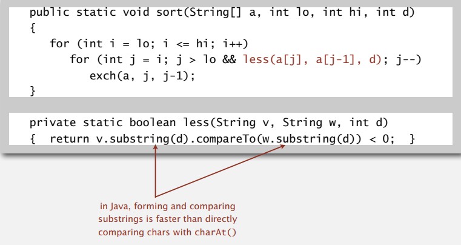​

* Number of characters examined.

  * MSD examines just enough characters to sort the keys.
  * Number of characters examined depends on keys.
  * Can be sublinear in input size.

​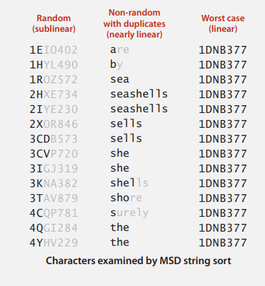​

​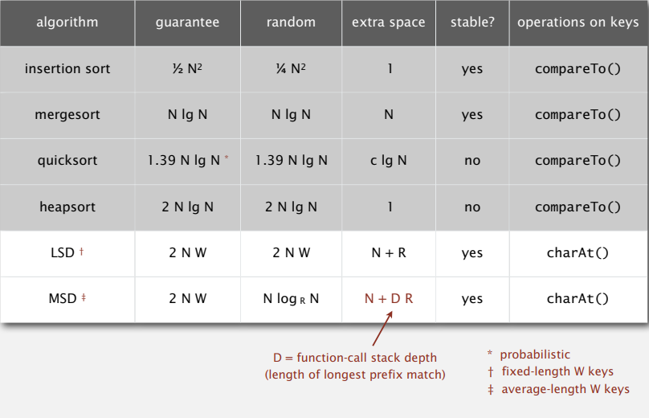​

### MSD sort vs. Quicksort

* Disadvantages of MSD string sort.

  * Extra space for `aux[]`​
  * Extra space for `count[]`​ (primary reason not to use MSD radix sort to sort strings)
  * Inner loop has a lot of instructions.
  * Accesses memory randomly (cache inefficient).
* Disadvantages of quicksort.

  * Linearithmic number of string compares (not linear)
  * Has to rescan many characters in keys with long prefix matches.

## 3-way Radix Quicksort

Do 3-way partitioning on the *d*​*<sup>th</sup>* character.

* Less overhead than *R*-way partitioning in MSD string sort.
* Does not re-examine characters equal to the partitioning char (but does re-examine characters not equal to the partitioning char).

​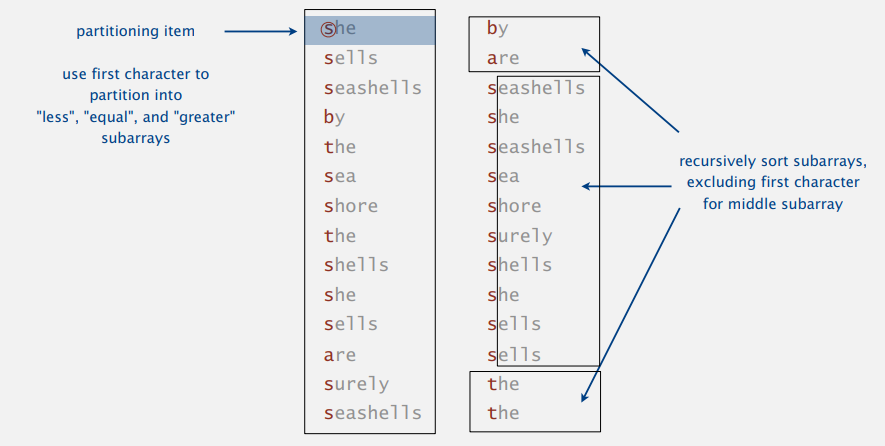​

​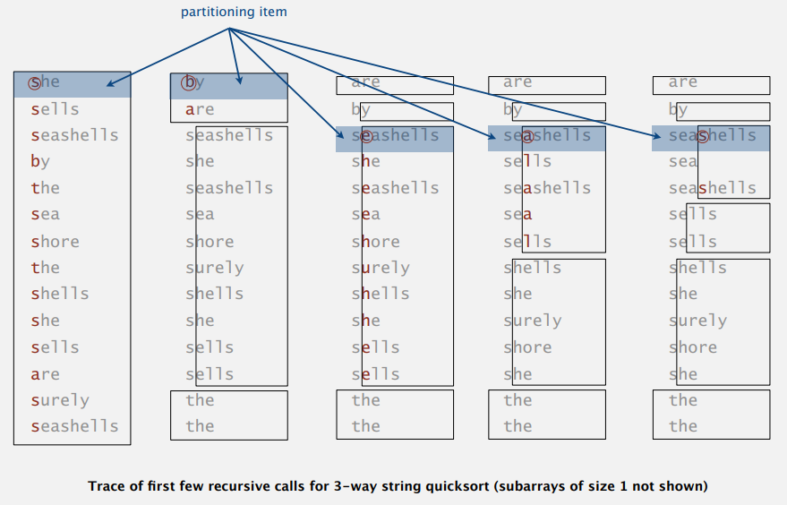​

### Implementation

```Java
/**
 * @Author: Zephyrtoria
 * @CreateTime: 2024-11-01
 * @Description:
 * @Version: 1.0
 */
public class StringQuicksort3Way {
    public static void sort(String[] a) {
        sort(a, 0, a.length - 1, 0);
    }

    private static void sort(String[] a, int lo, int hi, int d) {
        if (hi <= lo) {
            return;
        }
        int lt = lo, gt = hi;
        int v = charAt(a[lo], d);
        int i = lo + 1;
        while (i <= gt) {
            int t = charAt(a[i], d);    // handle variable-length strings
            if (t < v) {
                exch(a, lt++, i++);
            } else if (t > v) {
                exch(a, i, gt--);
            } else {
                i++;
            }
        }
        // sort 3 subarrays recursively
        sort(a, lo, lt - 1, d);
        if (v >= 0) {
            sort(a, lt, gt, d + 1);
        }
        sort(a, gt + 1, hi, d);
    }

    private static int charAt(String s, int d) {
        if (d < s.length()) {
            return s.charAt(d);
        }
        return -1;
    }

    private static void exch(Object[] a, int x, int y) {
        Object temp = a[x];
        a[x] = a[y];
        a[y] = temp;
    }
}

```

### 3-way string quicksort vs. standard quicksort

Standard quicksort

* Uses ~ 2*N* ln *N* **string compares** on average.
* Costly for keys with long common prefixes (and this is a common case).

3-way string radix quicksort

* Uses ~ 2*N* ln *N* **character compares** on average for random strings.
* Avoids re-comparing long common prefixes. (*d*​*<sup>th</sup>*​)

### 3-way string quicksort vs. MSD string sort

MSD string sort

* Is cache-inefficient.
* Too much memory storing `count[]`​
* Too much overhead reinitializing `count[]`​ and `aux[]`​

3-way string quicksort

* Has a short inner loop.
* Is cache-friendly.
* Is in-place.

### Analysis

​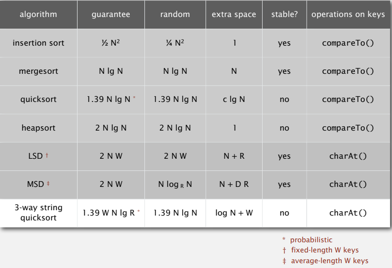​

## Suffix Arrays

### Suffix Sort

​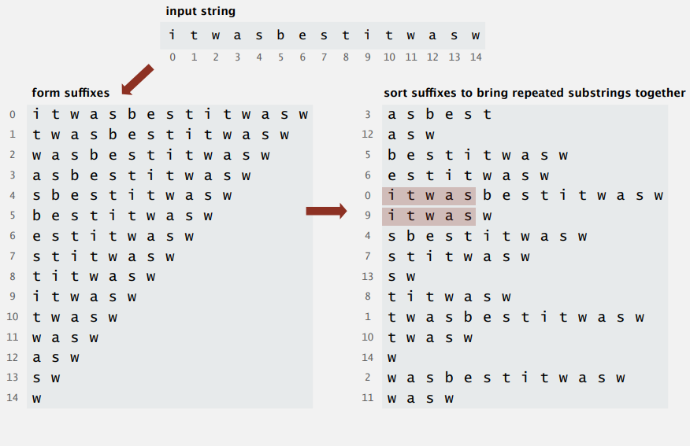​

### Keyword-in-context Search

Given a text of *N* characters, preprocess it to enable fast substring search (find all occurrences of query string context).

​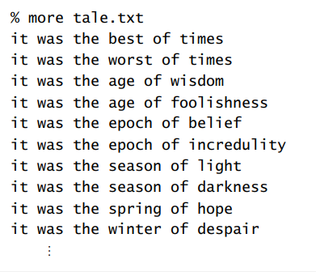​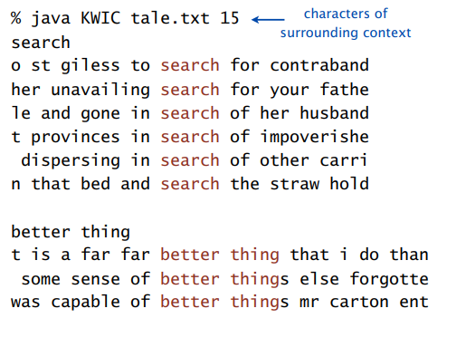​

Application. Linguistics, databases, web search, word processing, ….

#### Suffix-sorting Solution

* Preprocess: **suffix sort** the text.
* Query: **binary search** for query; scan until mismatch.

### Longest Repeated Substring

Given a string of *N* characters, find the longest repeated substring.

​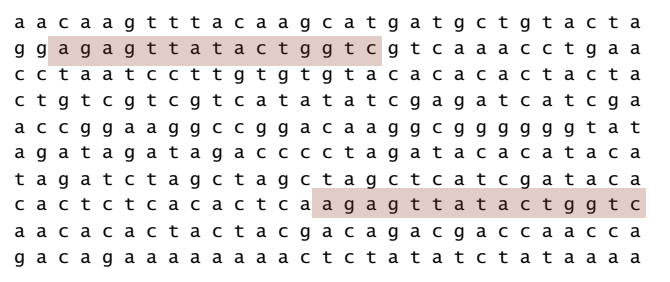​

Applications. Bioinformatics, cryptanalysis, data compression, ...

#### Brute-force Algorithm

* Try all indices *i* and *j* for start of possible match.
* Compute longest common prefix (LCP) for each pair.
* Running time <= *D* *N*​<sup>2</sup>, where *D* is length of longest match.

​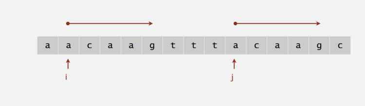​

#### Sorting Solution

​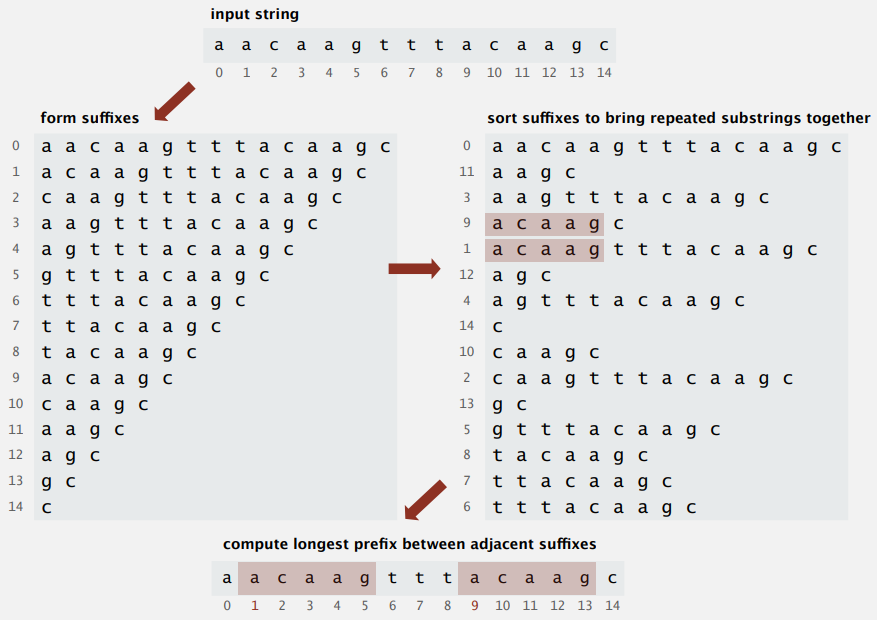​

```Java
import java.util.Arrays;

/**
 * @Author: Zephyrtoria
 * @CreateTime: 2024-11-01
 * @Description:
 * @Version: 1.0
 */
public class LongestRepeatedSubstring {
    public String lrs(String s) {
        int N = s.length();

        // create suffixes (linear time and space)
        String[] suffixes = new String[N];
        for (int i = 0; i < N; i++) {
            suffixes[i] = s.substring(i, N);
        }

        // sort suffixes
        Arrays.sort(suffixes);

        // find LCP between adjacent suffixes in sorted order
        String lrs = "";
        for (int i = 0; i < N - 1; i++) {
            int len = lcp(suffixes[i], suffixes[i + 1]);
            if (len > lrs.length()) {
                lrs = suffixes[i].substring(0, len);
            }
        }
        return lrs;
    }

    public static int lcp(String s, String t) {
        int N = Math.min(s.length(), t.length());
        for (int i = 0; i < N; i++) {
            if (s.charAt(i) != t.charAt(i)) {
                return i;
            }
        }
        return N;
    }
}

```

#### Analysis

​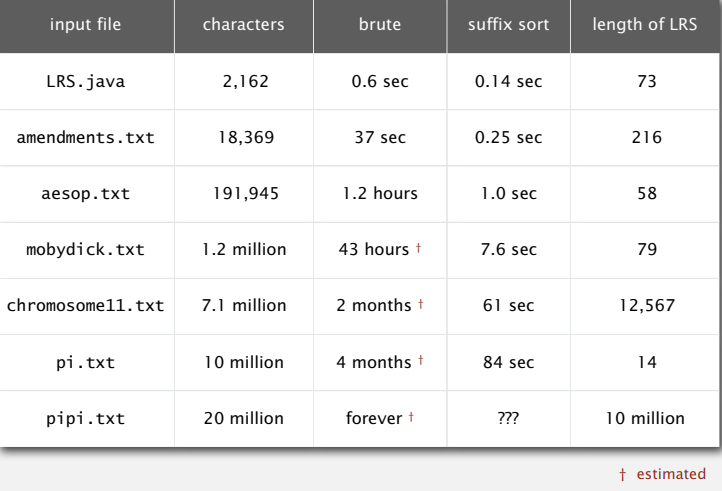​

### Worst-case Input

Bad input: Longest repeated substring very long.

​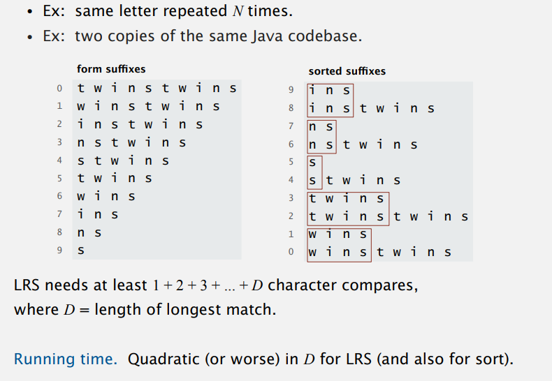​

### Sorting Challenge

Problem. Suffix sort an arbitrary string of length *N*.

​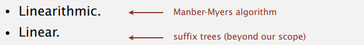​

### Manber-Myers Algorithm

* Phase 0: sort on first character using key-indexed counting sort.
* Phase *i*: given array of suffixes sorted on first 2<sup>i-1</sup> characters, create array of suffixes sorted on first 2*<sup>i</sup>* characters.

Worst-case running time: *N* lg *N*.

* Finishes after lg *N* phases.
* Can perform a phase in linear time.

> Phase 0

​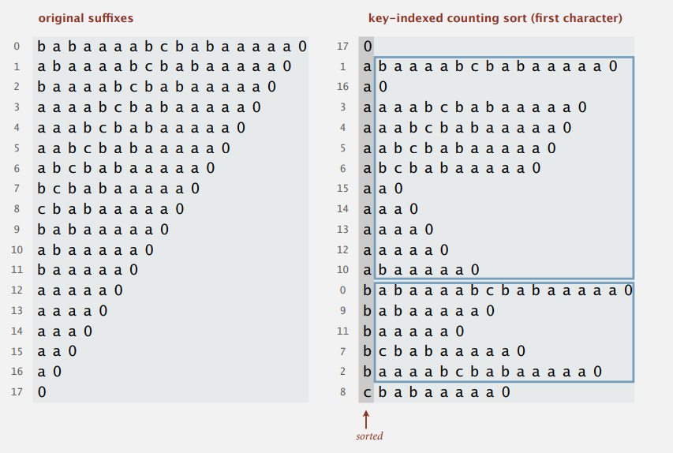​

> Phase 1

​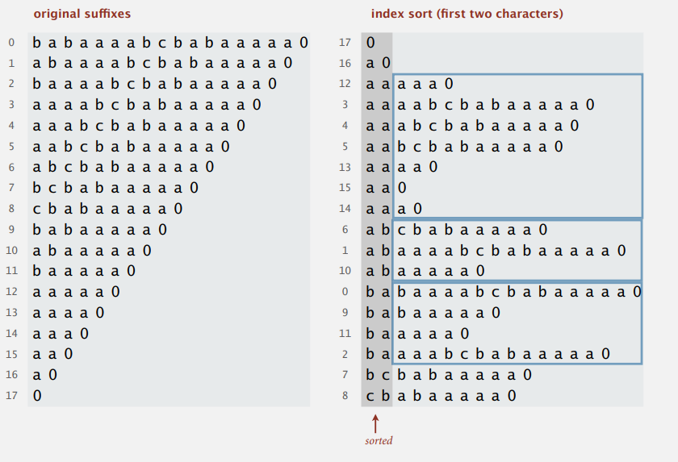​

> Phase 2

​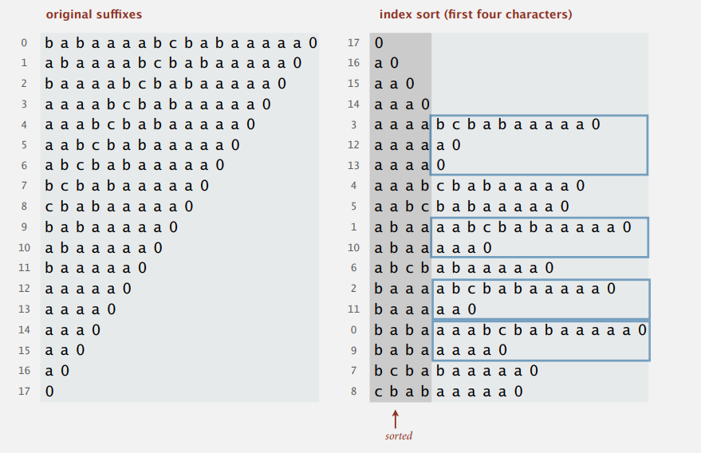​

> Phase 3

​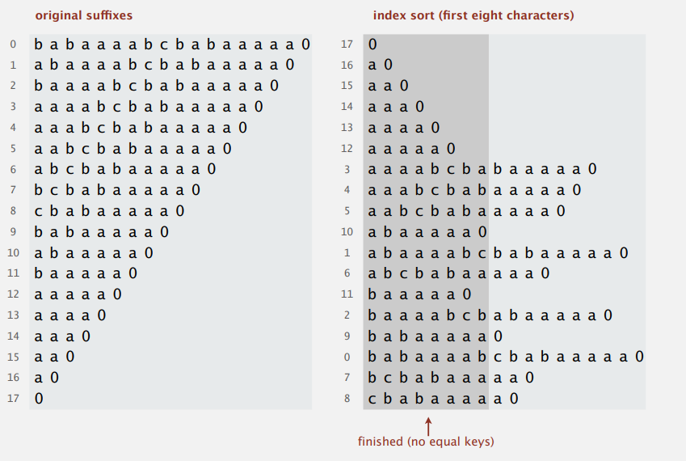​

#### String Compare

Constant-time string compare by indexing into inverse.

​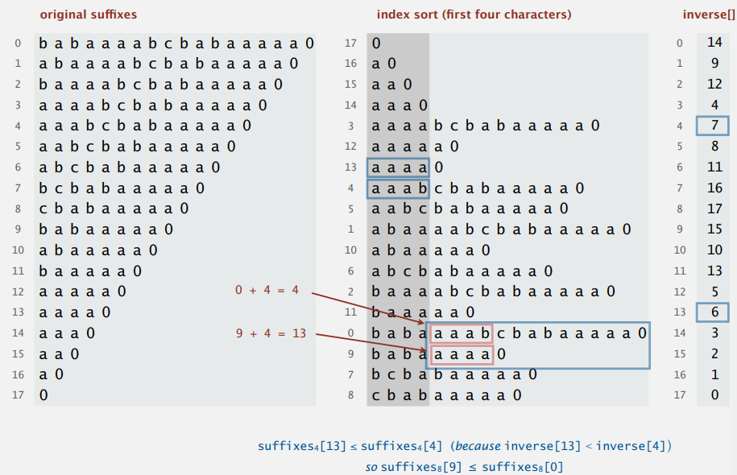​

While 3-way radix quicksort runs faster than Manber-Myers on typical inputs, the Manber-Myers algorithm has a worst-case running time of *N* log ⁡*N*, which is superior to that of 3-way radix quicksort. The Manber-Myers algorithm requires several auxiliary arrays and uses more extra space than 3-way radix quicksort. Stability is not a relevant concept for suffix sorting.

# Trie

## Symbol-table

​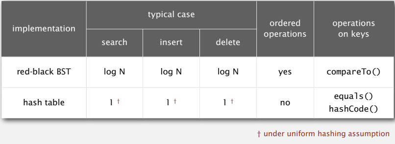​

If we can avoid examining the entire key, as with string sorting, we can do it better.

### String Symbol Table

String symbol table: Symbol table specialized to string keys.

​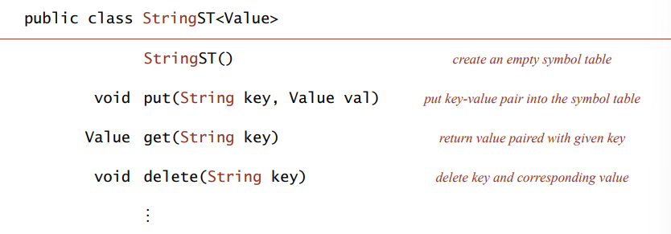​

Goal: Faster than hashing, more flexible than BSTs.

​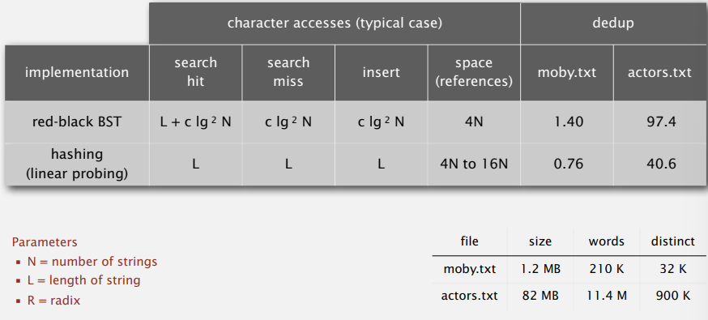​

## R-way Trie

### trie

**Trie**: (retrieval)

* Store characters in nodes (not keys).
* Each node has *R* children, one for each possible character.
* Store values in nodes corresponding to last characters in keys.

​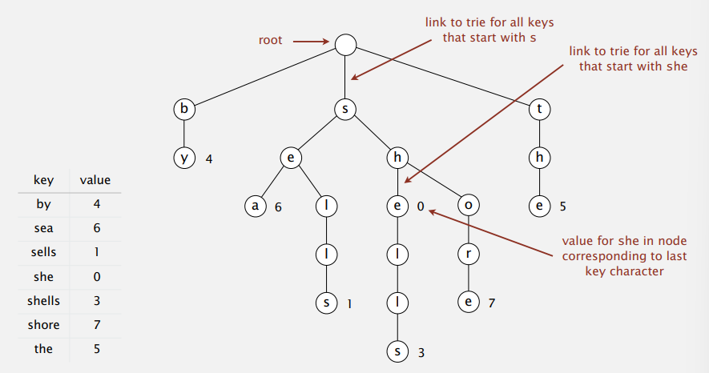​

### Search In trie

Follow links corresponding to each character in the key.

* Search hit: node where search ends has a non-null value.

  ​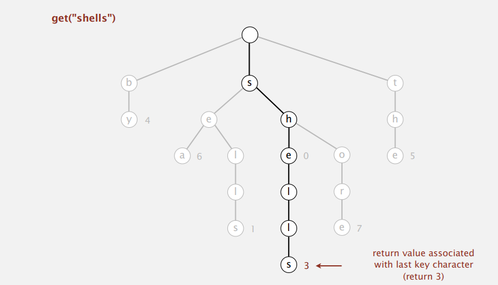​

  ​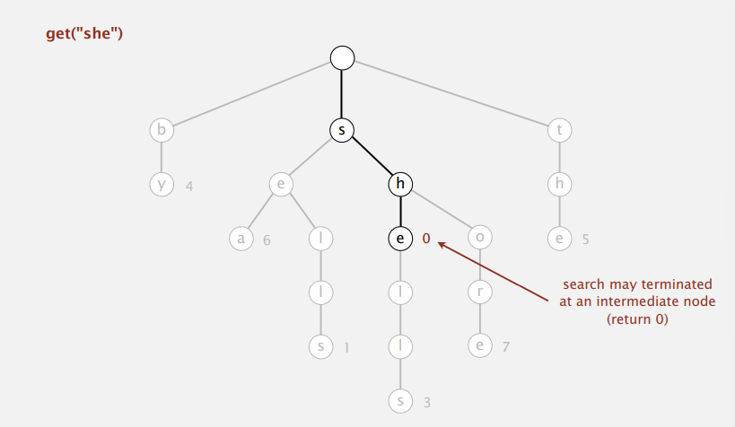​
* Search miss: reach null link or node where search ends has null value.

  ​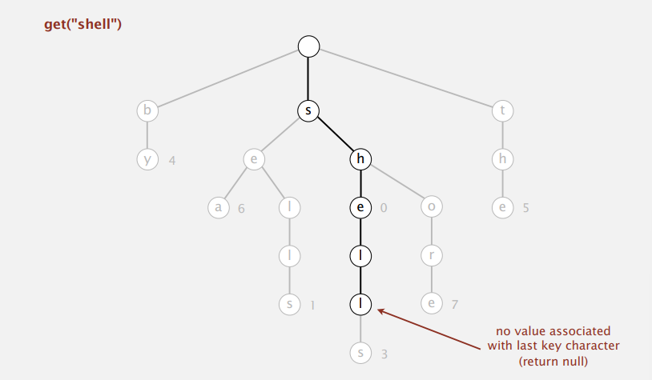​

  ​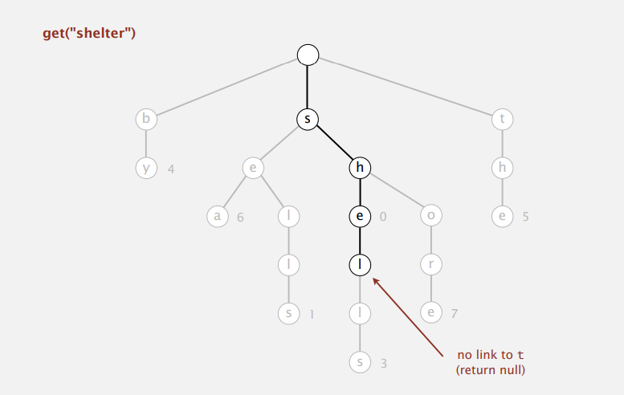​

### Insertion into trie

Follow links corresponding to each character in the key.

* Encounter a null link: create new node.
* Encounter the last character of the key: set value in that node.

​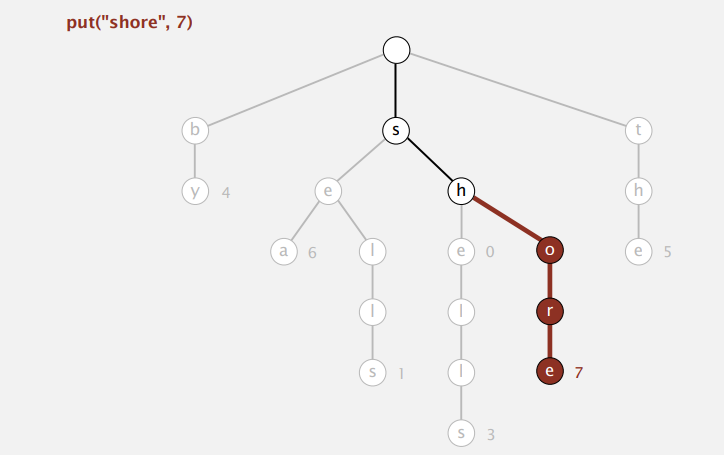​

Overwrite old value with new value with same key.

### Representation

#### Node

A value, plus references to *R* nodes.

​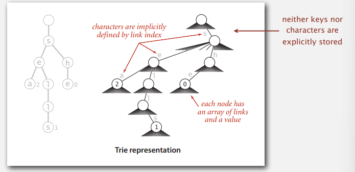​

```Java
private static class Node {
    private Object value;   // use Object instead of Value since no generic array creation in Java
    private Node[] next = new Node[R];
}
```

#### R-way trie

```Java
/**
 * @Author: Zephyrtoria
 * @CreateTime: 2024-11-02
 * @Description:
 * @Version: 1.0
 */
public class TrieST<Value> {
    private static final int R = 256;
    private Node root = new Node();

    private static class Node {
        private Object value;   // use Object instead of Value since no generic array creation in Java
        private Node[] next = new Node[R];
    }

    public void put(String key, Value val) {
        root = put(root, key, val, 0);
    }

    private Node put(Node x, String key, Value val, int d) {
        if (x == null) {
            x = new Node();
        }
        if (d == key.length()) {
            x.value = val;
            return x;
        }
        char c = key.charAt(d);
        x.next[c] = put(x.next[c], key, val, d + 1);
        return x;
    }

    public boolean contains(String key) {
        return get(key) != null;
    }

    public Value get(String key) {
        Node x = get(root, key, 0);
        if (x == null) {
            return null;
        }
        return (Value) x.value;     // cast needed
    }

    private Node get(Node x, String key, int d) {
        if (x == null) {
            return null;
        }
        if (d == key.length()) {
            return x;
        }
        char c = key.charAt(d);
        return get(x.next[c], key, d + 1);
    }
}
```

### Deletion

To delete a key-value pair:

* Find the node corresponding to key and set value to null.

  ​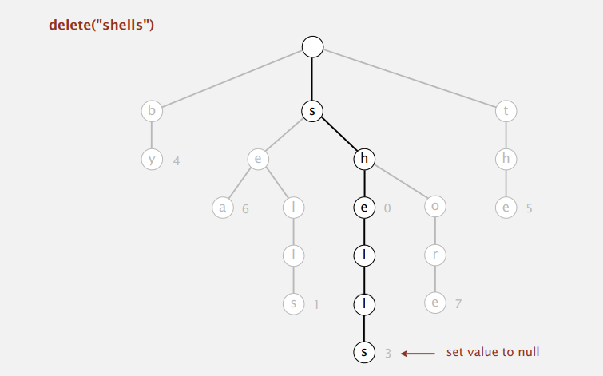​
* If node has null value and all null links, remove that node (and recur).

  ​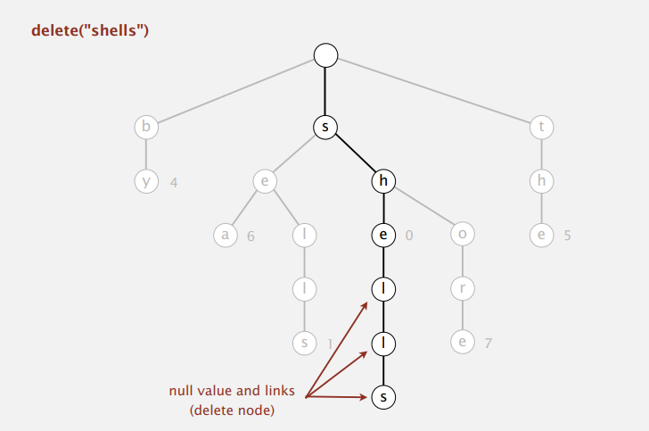​

### Analysis

* Search hit. Need to examine all *L* characters for quality.
* Search miss.

  * Could have mismatch on first character.
  * Typical case: examine only a few characters (sublinear).
* Space: *R* null links at each leaf.

  * but sublinear space possible if many short strings share common prefixes.

Fast search hit and even faster search miss, but wastes space.

​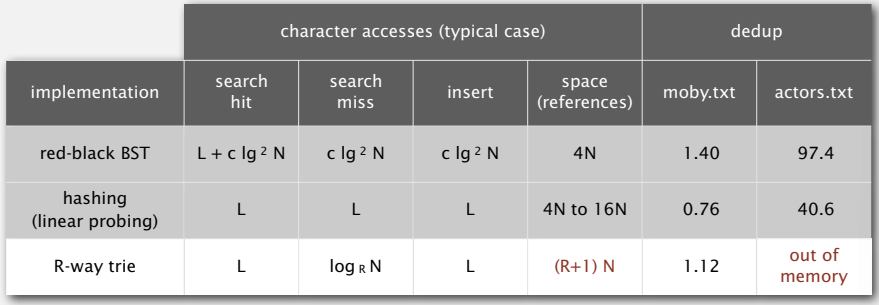​

R-way trie

* Method of choice for small *R*.
* Too much memory for large *R*.

Challenge: Use less memory. (e.g., 65536 way trie for Unicode).

## Ternary Search Trie

* Store characters and values in nodes (not keys).
* Each node has 3 children:

  * smaller (left)
  * equal (middle)
  * larger (right)

​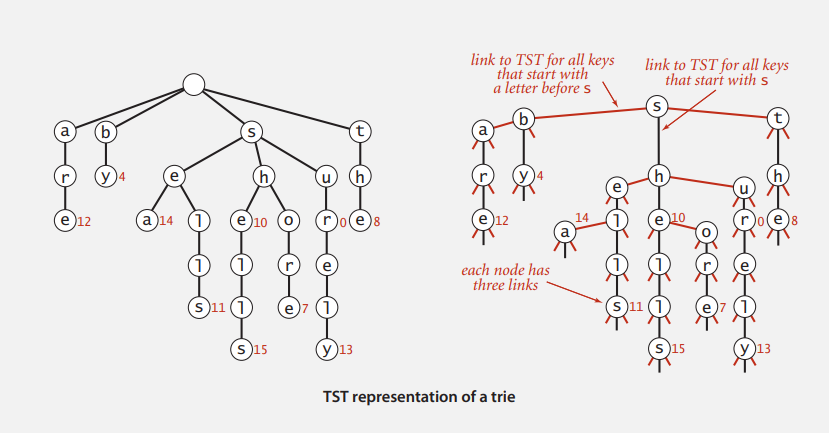​

### Search in TST

Follow links corresponding to each character in the key.

* If less, take left link
* If greater, take right link.
* If equal, take the middle link and move to the next key character.

* Search hit: Node where search ends has a non-null value.
* Search miss: Reach a null link or node where search ends has null value.

​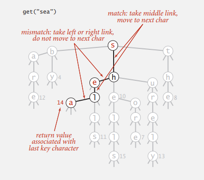​

### 26-way trie vs. TST

​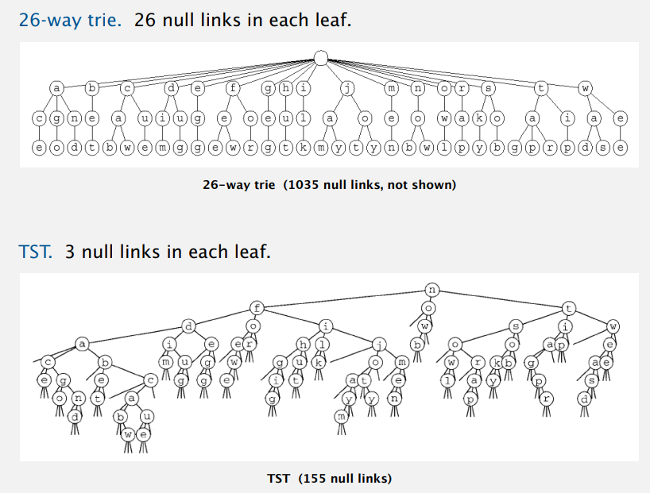​

### Representation

A TST node is five fields:

* A value.
* A character *c*.
* A reference to a left TST.
* A reference to a middle TST.
* A reference to a right TST.

```Java
private class Node {
    private Value val;
    private char c;
    private Node left, mid, right;
}
```

​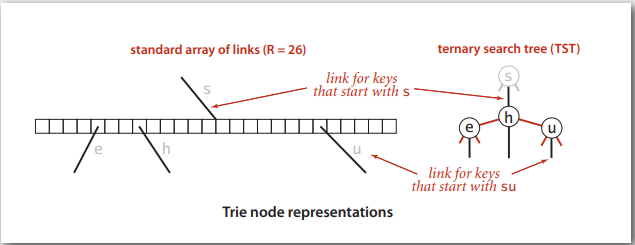​

### Implementation

```Java
/**
 * @Author: Zephyrtoria
 * @CreateTime: 2024-11-04
 * @Description:
 * @Version: 1.0
 */
public class TST<Value> {
    private Node root;

    private class Node {
        private Value val;
        private char c;
        private Node left, mid, right;
    }

    public void put(String key, Value val) {
        root = put(root, key, val, 0);
    }

    private Node put(Node x, String key, Value val, int d) {
        char c = key.charAt(d);
        if (x == null) {
            x = new Node();
            x.c = c;
        }

        if (c < x.c) {
            x.left = put(x.left, key, val, d);		// without go forward the key
        } else if (c > x.c) {
            x.right = put(x.right, key, val, d);
        } else if (d < key.length() - 1) {
            x.mid = put(x.mid, key, val, d + 1);
        } else {
            x.val = val;
        }
        return x;
    }

    public boolean contains(String key) {
        return get(key) != null;
    }

    public Value get(String key) {
        Node x = get(root, key, 0);
        if (x == null) {
            return null;
        }
        return x.val;
    }

    private Node get(Node x, String key, int d) {
        if (x == null) {
            return null;
        }
        char c = key.charAt(d);
        if (c < x.c) {
            return get(x.left, key, d);
        } else if (c > x.c) {
            return get(x.right, key, d);
        } else if (d < key.length() - 1) {
            return get(x.mid, key, d + 1);
        } else {
            return x;
        }
    }
}
```

### Analysis

​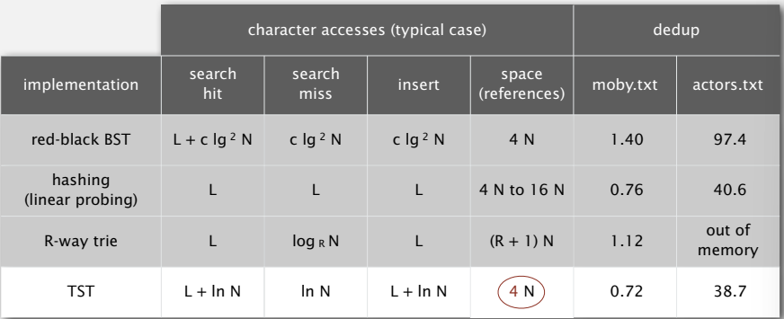​

Can build balanced TSTs via rotations to achieve *L* + log *N* worst-case guarantees.

TST is as fast as hashing (for string keys), and space efficient.

### Hybrid of R-way Tires and TST

TST with *R*​<sup>2</sup> branching at root.

* Do *R*​<sup>2</sup>-way branching at root.
* Each of *R*​<sup>2</sup> root nodes points to a TST.

​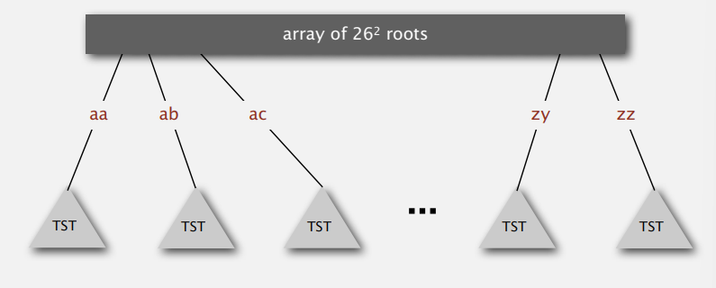​

Because all the words (except *a*) have the length bigger than 2.

​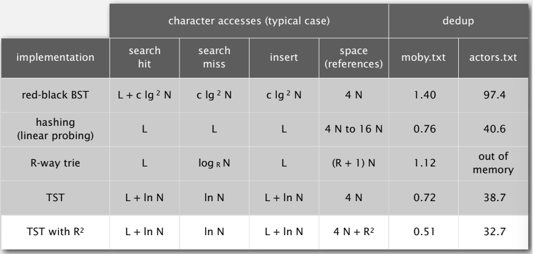​

### TST vs. Hashing

Hashing:

* Need to examine entire key.
* Search hits and misses cost about the same.
* Performance relies on hash function.
* Does not support ordered symbol table operations.

TSTs:

* Works only for strings (or digital keys).
* Only examines just enough key characters.
* Search miss may involve only a few characters.
* Supports ordered symbol table operations.

TSTs are:

* Faster than hashing (especially for search misses).
* More flexible than red-black BSTs.

## Character-based Operations

### String Symbol Table API

**Character-based operations**: The string symbol table API supports several useful character-based operations.

* Prefix match: Keys with prefix `xx`​.
* Wildcard match: Keys that match `.xx`​
* Longest prefix: Key that is the longest prefix of `xx`​

​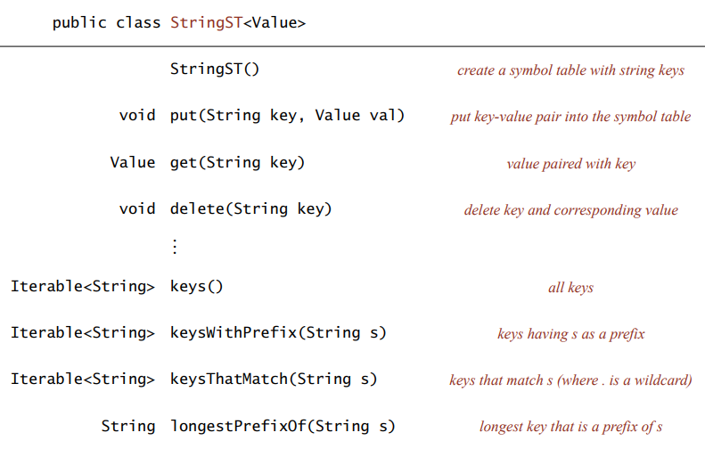​

Can also add other ordered ST methods like `floor()`​ and `rank()`​.

### Ordered Iteration

To iterate through all keys in sorted order:

* Do inorder traversal of trie; add keys encountered to a queue.

  * inorder: check the node from left to middle and to right one by one.
* Maintain sequence of characters on path from root to node.

```Java
Iterable<String> keys() {
    Queue<String> queue = new Queue<>();
    collect(root, "", queue);
    return queue;
}

private void collect(Node x, String prefix, Queue<String> q) {
    if (x == null) {
        return;
    }
    if (x.value != null) {
        q.enqueue(prefix);
    }
    for (char c = 0; c < R; c++) {
        collect(x.next[c], prefix + c, q);
    }
}
```

### Prefix Matches

Find all keys in a symbol table starting with a given prefix.

​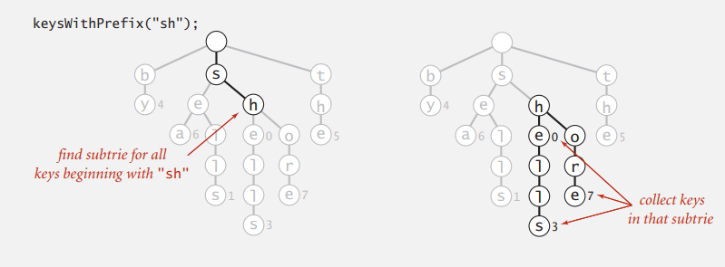​

```Java
public Iterable<String> keysWithPrefix(String prefix) {
    Queue<String> queue = new Queue<>();
    Node x = get(root, prefix, 0);	// root of subtrie for all strings beginning with given prefix
    collect(x, prefix, queue);
    return queue;
}

private void collect(Node x, String prefix, Queue<String> q) {
    if (x == null) {
        return;
    }
    if (x.value != null) {
        q.enqueue(prefix);
    }
    for (char c = 0; c < R; c++) {
        collect(x.next[c], prefix + c, q);
    }
}
```

### Longest Prefix

Find longest key in symbol table that is a prefix of query string.

* Search for query string.
* Keep track of longest key encountered.

​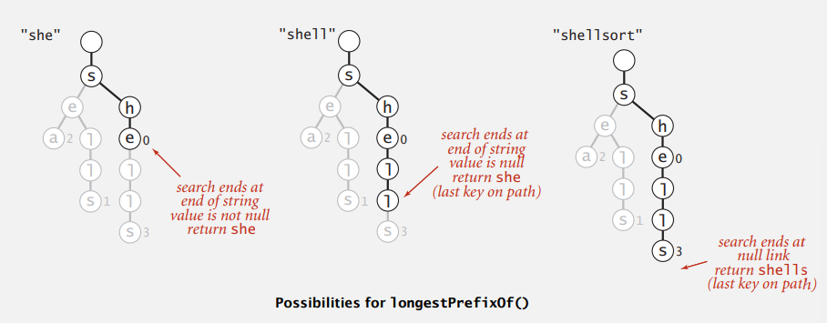​

```Java
public String longestPrefixOf(String query) {
    int length = search(root, query, 0, 0);
    return query.substring(0, length);
}

private int search(Node x, String query, int d, int length) {
    if (x == null) {
        return length;
    }
    if (x.value != null) {
        length = d;
    }
    if (d == query.length()) {
        return length;
    }
    char c = query.charAt(d);
    return search(x.next[c], query, d + 1, length);
}
```

### Patricia Trie

**Patricia trie**

* Remove one-way branching.
* Each node represents a sequence of characters.

​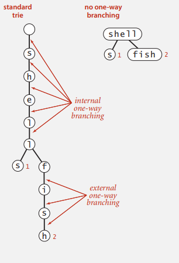​

### Suffix Tree

**Suffix tree**:

* Patricia trie of suffixes of a string.
* Linear-time construction: beyond this course.

​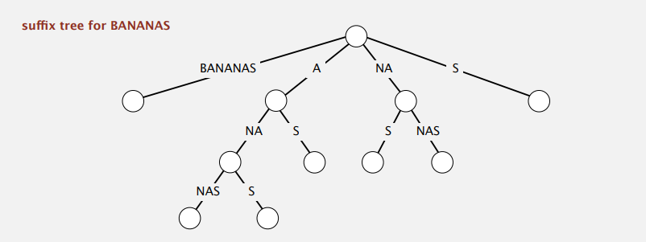​

### String Symbol Tables Summary

Red-black BST.

* Performance guarantee: log *N* key compares.
* Supports ordered symbol table API.

Hash tables.

* Performance guarantee: constant number of probes.
* Requires good hash function for key type.

trie. R-way, TST.

* Performance guarantee: log *N* characters accessed.
* Supports character-based operations.

# Substring Search

## Introduction

Goal: Find pattern of length *M* in a text of length *N*. (N >> M)

​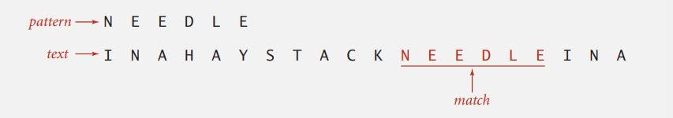​

### Java Library

The `indexOf()`​ method in Java's string library returns the index of the first occurrence of a given string, starting at a given offset.

## Brute Force

Check for pattern starting at each text position.

​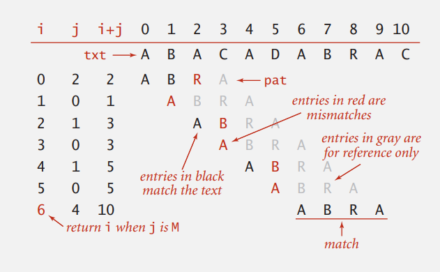​

```Java
public static int search(String pat, String txt) {
    int M = pat.length();
    int N = txt.length();
    for (int i = 0; i <= N - M; i++) {
        int j;
        for (j = 0; j < M; j++) {
            if (txt.charAt(i + j) != pat.charAt(j)) {
                break;
            }
        }
        if (j == M) {
            return i;   // index in text where pattern starts
        }
    }
    return N;   // not found
}
```

### Worst Case

Brute-force algorithm can be slow if text and pattern are repetitive.

​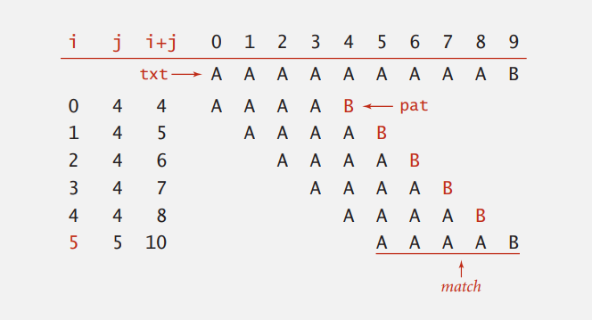​

~ *M* *N* char compares.

Brute-force algorithm needs backup for every mismatch.

​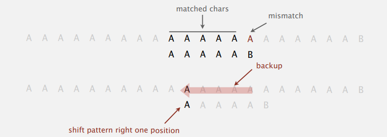​

### Alternate Implementation

* *i* points to end of sequence of already-matched chars in text.
* *j* stores # of already-matched chars (end of sequence in pattern).

```Java
public static int search(String pat, String txt) {
    int i, j;
    int N = txt.length();
    int M = pat.length();
    for (i = 0, j = 0; i < N && j < M; i++) {
        if (txt.charAt(i) == pat.charAt(j)) {
            j++;
        } else {
            i -= j;     // there are j chars matching.
            j = 0;
        }
    }
    if (j == M) {
        return i - M;
    } else {
        return N;
    }
}
```

## KMP

### Deterministic Finite State Automaton

DFA is abstract string-searching machine.

* Finite number of state (including start and halt).
* Exactly one trasition for each char in alphabet.
* Accept if sequence of transitions leads to halt state.

​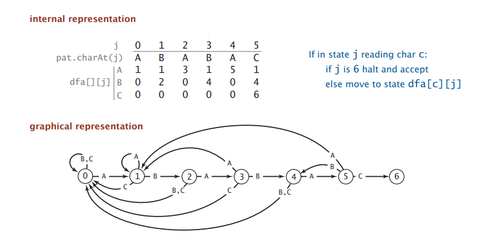​

### Interpretation of KMP DFA

* State = number of characters in pattern that have been matched.

  * Length of longest prefix of `pat[]`​ that is a suffix of `txt[0..i]`​

​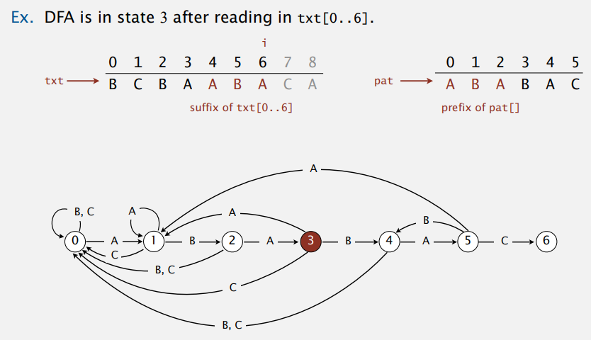​

### KMP Implementation

Key differences from brute-force implementation.

* Need to precompute `dfa[][]`​ from pattern.
* Text pointer *i* never decrements.
* Could use input stream. `in.readChar()`​

​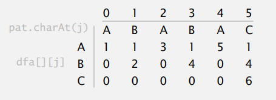​

```Java
public int search(String pat, String txt) {		// In in, String pat
    int i, j;
    int N = txt.length();
    int M = pat.length();
    for (i = 0, j = 0; i < N && j < M; i++) {	// !in.isEmpty() && j < M
        j = dfa[txt.charAt(i)][j];		// no backup
		// the dfa[][] is built from pattern
		// j = dfa[in.readChar()][j];
    }
    if (j == M) {
        return i - M;
    } else {
        return N;	// return NOT_FOUND;
    }
}
```

**Running time**:

* Simulate DFA on text: at most *N* character accesses.
* Build DFA: how to do efficiently?

### Building DFA from Pattern

Include one state for each character in pattern (plus accept state).

* **Match transition**: If in state *j* and next char `c == pat.charAt(j)`​, go to *j* + 1.

  * *j*: first *j* characters of pattern have already been matched.​
  * `c == pat.charAt(j)`​: next char matches.
  * *j* + 1: now first *j* + 1 characters pattern have been matched.​

  ​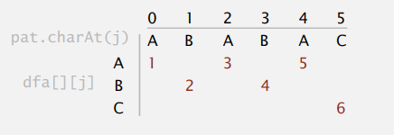​

  ​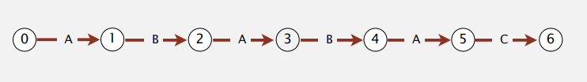​
* **Mismatch transition**: If in state *j* and next char `c != pat.charAt(j)`​, then the last *j* - 1 characters of input are `pat[1..j - 1]`​, followed by *c*.

  * To compute `dfa[c][j]`​: Simulate `pat[1..j - 1]`​ on DFA and take transition *c*.
  * For each state *j* and char `c != pat.charAt(i)`​, set `dfa[c][j] = dfa[c][X]`​; then update `X = dfa[pat.charAt(j)][X]`​.

  ​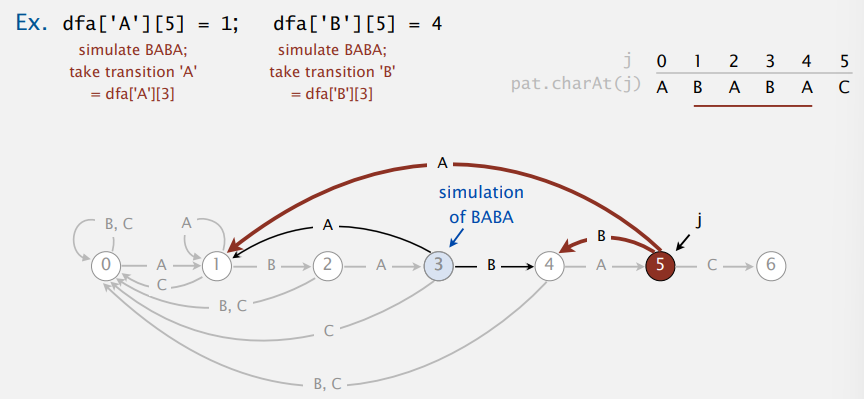​

  ​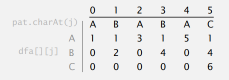​

  ​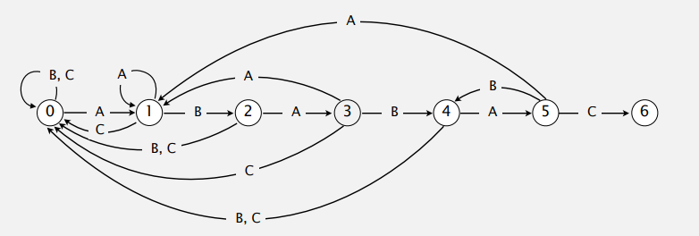​

  * from state *X*, take transition `Y = dfa[Y][X]`​

### Implementation

For each state *j:*

* Copy `dfa[][X]`​ to `dfa[][j]`​ for mismatch case.
* Set `dfa[pat.charAt(j)][j]`​ to `j + 1`​ for match case.
* Update `X`​.

```Java
 /**
 * @Author: Zephyrtoria
 * @CreateTime: 2024-11-06
 * @Description:
 * @Version: 1.0
 */
public class KMP {
    private final static int R = 26;
    private final String pat;
    private final int M;
    private final int[][] dfa;

    public KMP(String pat) {
        this.pat = pat;
        M = pat.length();

        dfa = new int[R][M];
        dfa[pat.charAt(0)][0] = 1;

        for (int X = 0, j = 1; j < M; j++) {
            for (int c = 0; c < R; c++) {
                dfa[c][j] = dfa[c][X];      // copy mismatch cases
            }
            dfa[pat.charAt(j)][j] = j + 1;  // set match case
            X = dfa[pat.charAt(j)][X];      // update restart state
        }
    }
}
```

Running time: *M* character accesses (but space/time proportional to *R* *M*).

### Analysis

* Proposition. KMP substring search accesses no more than *M + N* chars to search for a pattern of length *M* in a text of length *N*. 

  * Pf. Each pattern char accessed once when constructing the DFA; each text char accessed once (in the worst case) when simulating the DFA.
* Proposition. KMP constructs `dfa[][]`​ in time and space proportional to *R M*.
* Larger alphabets. Improved version of KMP constructs `nfa[]`​ in time and space proportional to *M*.

​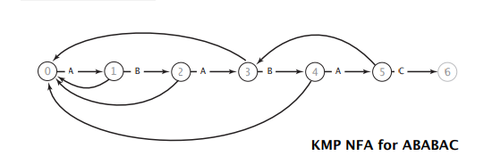​

## Boyer-Moore

### Mismatched Character Heuristic

Intuition.

* Scan characters in pattern from right to left.
* Can skip as many as *M* text chars when finding one not in the pattern.

​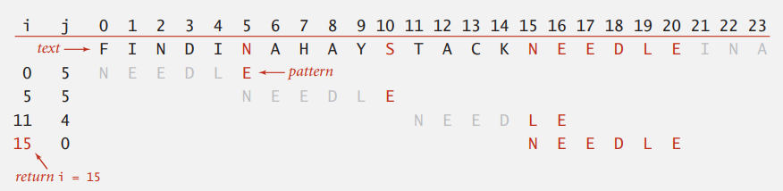​

> How much to skip?

1. Mismatch character not in pattern.

    ​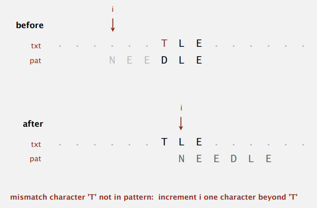​
2. Mismatch character in pattern.

    1. ​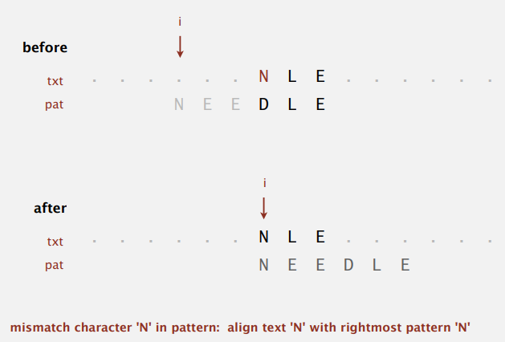​
    2. heuristic no help

        ​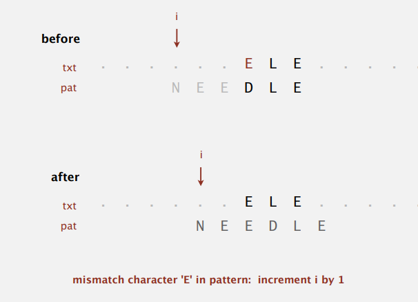​

### Implementation

Precompute index of rightmost occurrence of character *c* in pattern (-1 if character not in pattern).

​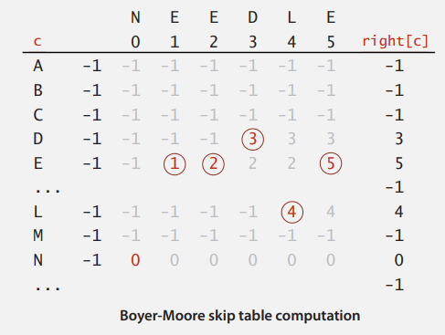​

```Java
/**
 * @Author: Zephyrtoria
 * @CreateTime: 2024-11-07
 * @Description:
 * @Version: 1.0
 */
public class BoyerMoore {
    private final int R = 256;
    private final String pat;
    private final int M;
    private final int[] right;


    public BoyerMoore(String pat) {
        this.pat = pat;
        M = pat.length();
        right = new int[R];

        for (int c = 0; c < R; c++) {
            right[c] = -1;
        }
        for (int j = 0; j < M; j++) {
            right[pat.charAt(j)] = j;
        }
    }

    public int search(String txt) {
        int N = txt.length();
        int skip = 0;
        for (int i = 0; i < N - M; i += skip) {
            skip = 0;
            for (int j = M - 1; j > 0; j--) {
                if (pat.charAt(j) != txt.charAt(i + j)) {
                    // compute skip value
                    skip = Math.max(1, j - right[txt.charAt(i + j)]);
                    // the 1 is in case other term is non-positive
                    break;
                }
            }
            if (skip == 0) {
                return i;
            }
        }
        return N;
    }
}
```

### Analysis

* Property: Substring search with the Boyer-Moore mismatched character heuristic takes about \~ *N / M* (sublinear) character compares to search for a pattern of length *M* in a text of length *N*.
* Worse-case. Can be as ban as ~ *M N*.

  ​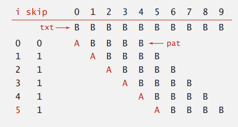​

Can improve worst case to ~ 3 *N* character compares by adding a KMP-like rule to gurad against repetitive patterns.

## Rabin-Karp

### Rabin-Karp Fingerprint Search

Basic iead: modular hashing.

* Compute a hash of pattern charaters 0 to *M* - 1.
* For each *i*, compute a hash of text characters *i* to *M + i - 1*.
* If `pattern hash = text substring hash`​, check for a match.

​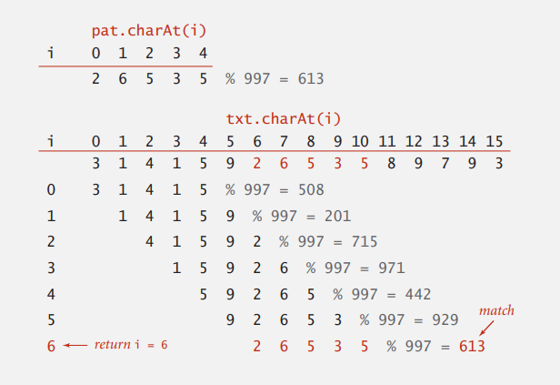​

### Computing the Hash Function

Modular hash function: Using the notation *t*​*<sub>i</sub>* for `txt.charAt(i)`​, we wish to compute:

$$
x_{i} = t_{i}R^{M-1} + t_{i+1}R^{M-2} + ... + t_{i + M - 1}R^{0} (mod Q)
$$

Intuition: *M*-digit, base-*R* integer, modulo *Q*.

**Horner's method**: Linear-time method to evaluate degree-*M* polynomial.

​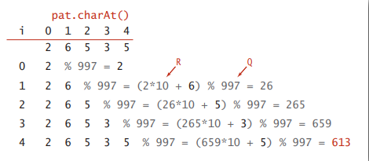​

```Java
private final static int R = 10;    // compare for digit
private final static int Q = 997;

// Compute hash for M-digit key
private long hash(String key, int M) {
    long h = 0;
    for (int j = 0; j < M; j++) {
        h = (R * h + key.charAt(j)) % Q;
    }
    return h;
}
```

* Challenge: How to compute *x*​*<sub>i+1</sub>* given that we know *x*​*<sub>i</sub>*.

$$
x_{i} = t_{i}R^{M-1} + t_{i+1}R^{M-2} + ... + t_{i + M - 1}R^{0} (mod Q)
$$

$$
x_{i+1} = t_{i+1}R^{M-1} + t_{i+2}R^{M-2} + ... + t_{i + M}R^{0} (mod Q)
$$

* Key property: Can update hash function in constant time!

$$
x_{i+1} = (x_{i} - t_{i}R^{M-1})R +t_{i+M}(mod Q)
$$

* current value - leading digit.
* multiply by radix.
* add new trailing digit.

### Implementation

```Java
/**
 * @Author: Zephyrtoria
 * @CreateTime: 2024-11-07
 * @Description:
 * @Version: 1.0
 */
public class RabinKarp {
    private final int R;    // compute for ASCII
    private final long Q;
    private long patHash;
    private int M;
    private long RM;    // R ^ (M-1) % Q

    public RabinKarp(String pat) {
        M = pat.length();
        R = 256;
        Q = longRandomPrime();      // get a large prime but avoid overflow

        RM = 1;
        for (int i = 1; i <= M - 1; i++) {
            RM = (R * RM) % Q;
        }
        patHash = hash(pat, M);
    }

    // Compute hash for M-digit key
    private long hash(String key, int M) {
        long h = 0;
        for (int j = 0; j < M; j++) {
            h = (R * h + key.charAt(j)) % Q;
        }
        return h;
    }

    public int search(String txt) {
        int N = txt.length();
        long txtHash = hash(txt, M);
        if (patHash == txtHash) {
            return 0;
        }
        for (int i = M; i < N; i++) {
            txtHash = (txtHash + Q - RM * txt.charAt(i - M) % Q) % Q;
            txtHash = (txtHash * R + txt.charAt(i)) % Q;
            if (patHash == txtHash) {
                return i - M + 1;
            }
        }
        return N;

    }
}

```

* Monte Carlo version: Return match if hash match.
* Las Vegas version: Check for substring match if hash match; continue search if false collision.

### Analysis

* Theory: If *Q* is a sufficiently large random prime (about *M N* *<sup>2</sup>*), then the probability of a false collision is about 1 / *N*.
* Practice. Choose *Q* to be a large prime (but not so large to cause overflow). Under reasonable assumptions, probability of a collision is about 1 / *Q*.

* Monte Carlo version. 

  * Always runs in **linear time**.
  * Extremely likely to return correct answer (but not always!).
* Las Vegas version. 

  * Always returns correct answer.
  * Extremely likely to run in linear time (but worst case is *M N*).

Advantages.

* Extends to 2d patterns.
* Extends to finding multiple patterns.

Disadvantages.

* Arithmetic ops slower than char compares.
* Las Vegas version requires backup.
* Poor worst-case guarantee.

## Summary

Cost of searching for an *M*-character pattern in an *N*-character text

​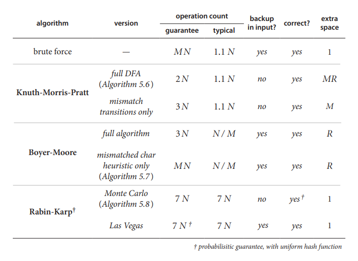​

# Regular Expressions

## Regular Expressions

* Substring search: Find a single string in text.
* Pattern matching: Find one of a **specified set** of strings in text.

A **regular expression** is a notation to specify a set (possibly infinite) of strings.

​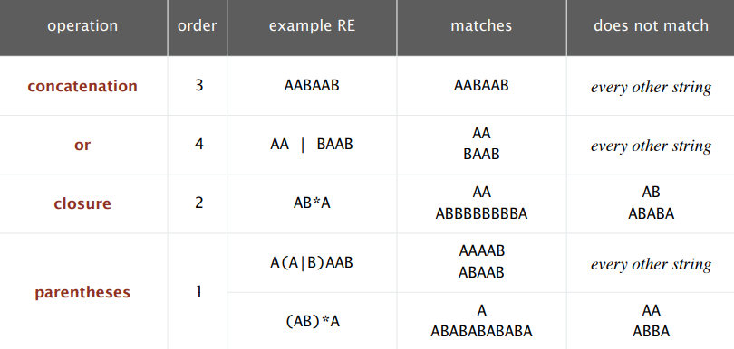​

Additional operations are often added for convenience.

​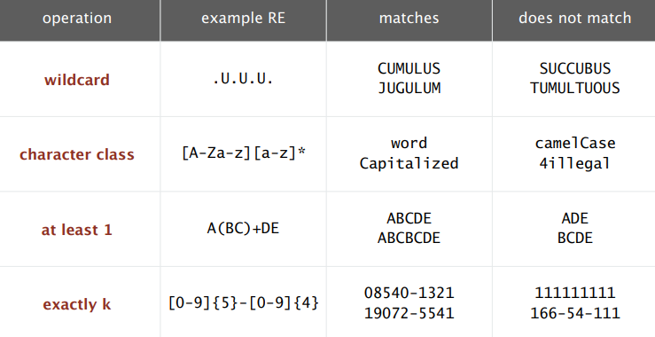​

## REs and NFAs

### Duality between REs and DFAs

* RE. Concise way to describe a set of strings.
* DFA. Machine to recognize whether a given string is in a given set.

Kleene's theorem.

* For any DFA, there exists a RE that describes the same set of strings.
* For any RE, there exists a DFA that recognizes the same set of strings.

​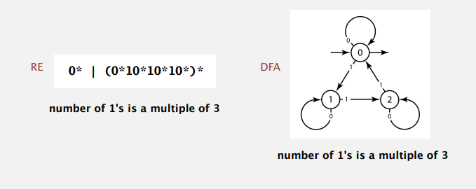​

### Pattern Matching

> DFA: Deterministic finite state automata

* No backup in text input stream.
* Linear-time guarantee.

Basic plan:

* Build DFA from RE.
* Simulate DFA with text as input.

​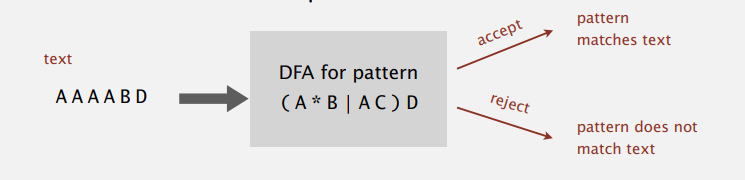​

It is infeasible.

> NFA: Nondeterministic finite state automata

* No backup in text input stream.
* **Quadratic-time guarantee.**  (linear-time typical)

Basic plan:

* Build NFA from RE.
* Simulate NFA with text as input.

​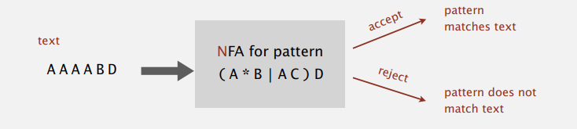​

### NFA

**Regular-expression-matching NFA**:

* Assume RE enclosed in parenthese.
* One state per RE character (start = 0, accept = M).
* Red **ε-transition** (change state, but don't scan text).
* Black match transition (change state and scan to next text char).
* Accept if **any** sequence of transitions ends in accept state. (after scanning all text characters)

**Nondeterminism**:

1. Machine can guess hte proper sequence of state transitions.
2. Sequence is a proof that the machine accepts the text.

​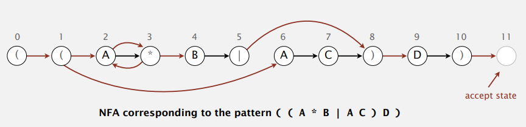​

​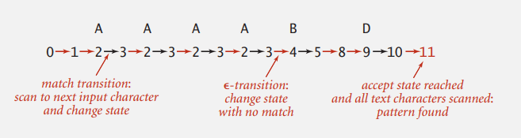​

> `AAAABD`​ is matched by NFA because:

* Some sequence of legal transitions ends in the last state.
* Even though some sequences end in wrong state or stall.

​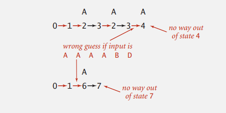​

> `AAAC`​ isn't matched by NFA because:

* No sequence of legal transitions ends in the last state.

​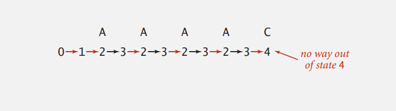​

### Nondeterminism

Q. How to determine whether a string is matched by an automaton?

* DFA. Deterministic ⇒ easy because exactly one applicable transition.
* NFA. Nondeterministic ⇒ can be several applicable transitions; need to select the right one!

Q. How to simulate NFA?

* Systematically consider **all** possible transition sequences.

## NFA Simulation

### NFA Representation

* State names. Integers from 0 to *M* (number of symbols in RE).
* Match-transitions: Keep regular expression in array `re[]`​.
* ε-transitions. Store in a **digraph** *G*.

​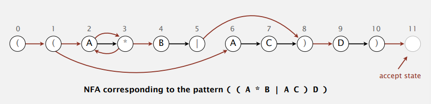​

### NFA Simulation

Q. How to efficiently simulate an NFA?

A. Maintain set of **all** possible states that NFA could be in after reading in the first *i* text characters.

​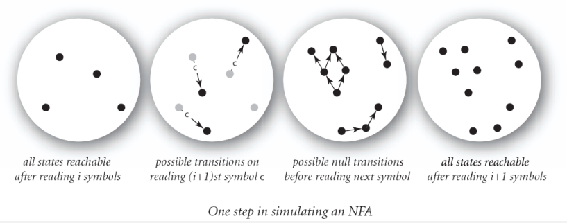​

Goal: Check whether input matches pattern.

* Read next input character:

  * Find states reachable by match transitions.
  * Find states reachable by ε-transitions.
* When no more input characters:

  * Accept if any state reachable is an accept state.
  * Reject otherwise.

### Digraph Reachability

Digraph reachability: Find all vertices reachable from a given source or **set** of vertices.

​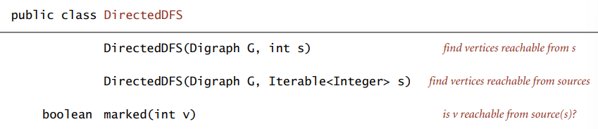​

* Solution: Run DFS from each source, without unmarking vertices.
* Performance: Runs in time proporional to *E + V*.

### Implementation

```Java
import edu.princeton.cs.algs4.Bag;
import edu.princeton.cs.algs4.Digraph;
import edu.princeton.cs.algs4.DirectedDFS;

/**
 * @Author: Zephyrtoria
 * @CreateTime: 2024-11-11
 * @Description:
 * @Version: 1.0
 */
public class NFA {
    private final char[] re;
    private final Digraph G;
    private final int M;

    public NFA(String regexp) {
        M = regexp.length();
        re = regexp.toCharArray();
        G = buildEpsilonTransitionDigraph();
    }

    public boolean recognizes(String txt) {
        // states reachable from start by ε-transitions
        Bag<Integer> pc = new Bag<>();
        DirectedDFS dfs = new DirectedDFS(G, 0);
        for (int v = 0; v < G.V(); v++) {
            if (dfs.marked(v)) {
                pc.add(v);
            }
        }

        // set of states reachable after scanning past txt.charAt(i)
        for (int i = 0; i < txt.length(); i++) {
            Bag<Integer> states = new Bag<>();
            for (Integer v : pc) {
                // not necessarily a match (RE needs to match full text)
                if (v == M) {
                    continue;
                }
                if ((re[v] == txt.charAt(i)) || re[v] == '.') {
                    states.add(v + 1);
                }
            }

            // follow ε-transitions
            dfs = new DirectedDFS(G, states);
            pc = new Bag<>();
            for (int v = 0; v < G.V(); v++) {
                if (dfs.marked(v)) {
                    pc.add(v);
                }
            }
        }

        // accept if it can end in state M
        for (Integer v : pc) {
            if (v == M) {
                return true;
            }
        }
        return false;
    }

    private Digraph buildEpsilonTransitionDigraph() {
		// next segment
    }
}
```

### Analysis

* Proposition: Determining whether an *N*-character text is recognized by the NFA corresponding to an *M*-character pattern takes time proportional to *M N* in the worst case.
* Pf. For each of the *N* text characters, we iterate through a set of states of size no more than *M* and run DFS on the graph of ε-transitions. 

  * The NFA construction we will consider ensures the number of edges ≤ 3M

## NFA Construction

### Building an NFA

* States: Include a state for each symbol in the RE, plus an accept state.
* Concatenation: Add match-transition edge from state corresponding to characters in the alphabet to next state.
* Alphabet: may be A~Z, a~Z, 0~9, etc...
* Metacharacters: `()`​ `.`​ `*`​ `|`​

  * Parentheses `()`​: Add ε-transition edge from parentheses to next state.

    ​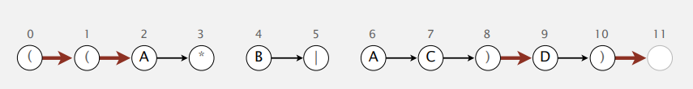​
  * Closure `*`​: Add 3 ε-transition edges for each `*`​ operator.

    ​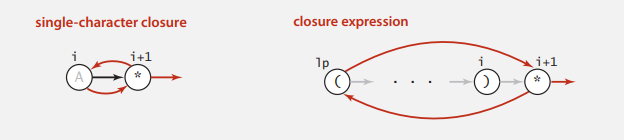​
  * Or `|`​: Add 2 ε-transition edges for each `|`​ operator.

    ​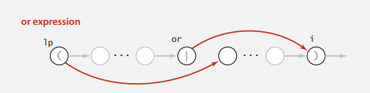`

### Implementation

Goal: Write a program to build the ε-transition digraph.

Challenges:

* Remember left parentheses to implement closure and or.
* Remember `|`​ to implement or.

Solution: Maintain a stack.

* Alphabet symbol

  * Add match transition to next state.
  * Do one-character lookahead:

    * Add ε-transition if next character is `*`​
* `(`​

  * Add ε-transition to next state.
  * push index of state corresponding to `(`​ onto stack.
* ​`|`​

  *  push index of state corresponding to `|`​ onto stack.
* ​`*`​

  * Add ε-transition to next state.
* ​`)`​

  * Add ε-transition to next state.
  * Pop corresponding `(`​ and any intervening `|`​

    * Add ε-transition edges for closure/or.
  * Do  one-character lookahead:

    * Add ε-transition if next character is `*`​
* End of regular expression

  * Add accept state.

```Java
import edu.princeton.cs.algs4.Bag;
import edu.princeton.cs.algs4.Digraph;
import edu.princeton.cs.algs4.DirectedDFS;
import edu.princeton.cs.algs4.Stack;

public class NFA {
    private final char[] re;
    private final Digraph G;
    private final int M;

    public NFA(String regexp) {
        M = regexp.length();
        re = regexp.toCharArray();
        G = buildEpsilonTransitionDigraph();
    }

    public boolean recognizes(String txt) {
        // states reachable from start by ε-transitions
        Bag<Integer> pc = new Bag<>();
        DirectedDFS dfs = new DirectedDFS(G, 0);
        for (int v = 0; v < G.V(); v++) {
            if (dfs.marked(v)) {
                pc.add(v);
            }
        }

        // set of states reachable after scanning past txt.charAt(i)
        for (int i = 0; i < txt.length(); i++) {
            Bag<Integer> states = new Bag<>();
            for (Integer v : pc) {
                // not necessarily a match (RE needs to match full text)
                if (v == M) {
                    continue;
                }
                if ((re[v] == txt.charAt(i)) || re[v] == '.') {
                    states.add(v + 1);
                }
            }

            // follow ε-transitions
            dfs = new DirectedDFS(G, states);
            pc = new Bag<>();
            for (int v = 0; v < G.V(); v++) {
                if (dfs.marked(v)) {
                    pc.add(v);
                }
            }
        }

        // accept if it can end in state M
        for (Integer v : pc) {
            if (v == M) {
                return true;
            }
        }
        return false;
    }

    private Digraph buildEpsilonTransitionDigraph() {
        Digraph G = new Digraph(M + 1);
        Stack<Integer> ops = new Stack<>();
        for (int i = 0; i < M; i++) {
            int lp = i;

            // left parentheses and | will be push into stack
            if (re[i] == '(' || re[i] == '|') {
                ops.push(i);
            } else if (re[i] == ')') {
                int or = ops.pop();
                // intervening 'or'
                if (re[or] == '|') {    // it thinks the | will only appear at most once
                    lp = ops.pop();
                    G.addEdge(lp, or + 1);
                    G.addEdge(or, i);
                } else {
                    lp = or;
                }
            }

            // closure (needs 1-character lookahead)
            if (i < M - 1 && re[i + 1] == '*') {
                G.addEdge(lp, i + 1);
                G.addEdge(i + 1, lp);
            }

            // meta-symbols
            if (re[i] == '(' || re[i] == '*' || re[i] == ')') {
                G.addEdge(i, i + 1);
            }
        }
        return G;
    }
}
```

### Analysis

* Proposition: Building the NFA corresponding to an *M*-character RE takes time and space proportional to *M*.
* Pf. For each of the *M* characters in the RE, we add at most three ε-transitions and execute at most two stack operations.

We can support the `+`​ (one or more repetitions) the same as for the `*`​ but remove the ε-transition edge from *i* to *i + 1*; for a parenthesized closure, remove the edge from *lp* to *i + 1*.

# Data Compression

## Introduction

Compression reduces the size of a file:

* To save space when storing it.
* To save time when transmitting it.
* Most files have lots of redundancy.

### Lossless compression and expansion

* Message. Binary data B we want to compress.
* Compress. Generates a "compressed" representation *C(B)* . （uses fewer bits）
* Expand. Reconstructs original bitstream *B*.

​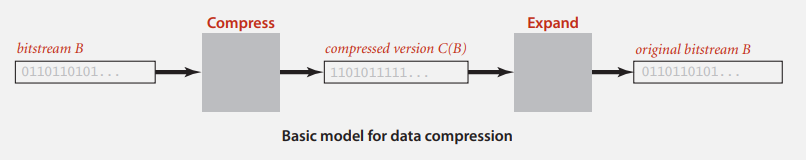​

$$
Compression\_ratio = \frac{Bits\_in\_C(B)}{bits\_in\_B}
$$

### Representation: Genomic code

​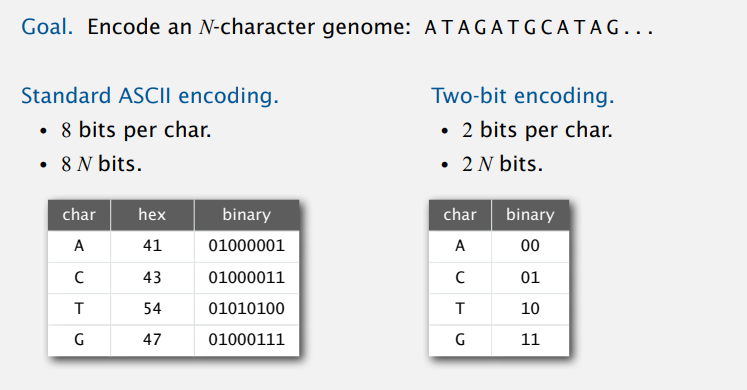​

Fixed-length code. *k*-bit code supports alphabet of size 2<sup>*k*</sup>

### Reading and writing binary data

> Reading

​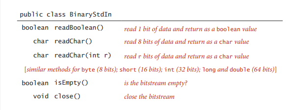​

> Writing

​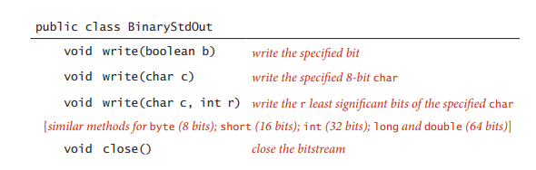​

### Universal data compression

Proposition. No algorithm can compress every bitstring.

Pf 1. [by contradiction]

* Suppose you have a universal data compression algorithm U that can compress every bitstream.
* Given bitstring B0, compress it to get smaller bitstring B1.
* Compress B1 to get a smaller bitstring B2.
* Continue until reaching bitstring of size 0.
* Implication: all bitstrings can be compressed to 0 bits!

Pf 2. [by counting]

* Suppose your algorithm that can compress all 1,000-bit strings.
* 2<sup>1000</sup> possible bitstrings with 1,000 bits.
* Only 1 + 2 + 4 + … + 2<sup>998</sup> + 2<sup>999</sup> can be encoded with ≤ 999 bits.
* Similarly, only 1 in 2<sup>499</sup> bitstrings can be encoded with ≤ 500 bits!

## Run-length Coding

* Simple type of redundancy in a bitstream. Long runs of repeated bits.

  ​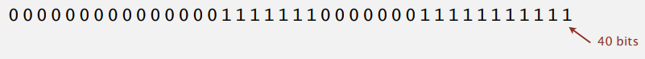​
* Representation. 4-bit counts to represent alternating runs of 0s and 1s:

  ​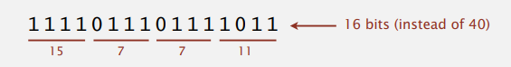​
* Applications. JPEG, ITU-T T4 Group 3 Fax, ...

### Implementation

```Java
public class RunLength {
    private final static int R = 256;	// maximum run-length count
    private final static int lgR = 8;	// number of bits per count

    public static void compress() {
    }

    public static void expand() {
        boolean bit = false;
        while (!BinaryStdIn.isEmpty()) {
            int run = BinaryStdIn.readInt(lgR);
            for (int i = 0; i < run; i++) {
                BinaryStdOut.write(bit);
            }
            bit = !bit;
        }
        BinaryStdOut.close();
    }
}
```

## Huffman Compression

### Variable-length Codes

Use different number of bits to encode different chars.

* Q. How do we avoid ambiguity?
* A. Ensure that no codeword is a **prefix** of another.
* Ex1. Fixed-length code.
* Ex2. Append special stop char to each codeword.
* Ex3. General prefix-free code.

### Prefix-free code

To representation the predix-free code:

* A binary trie.
* chars in leaves.
* codeword is path from root to leaf.

​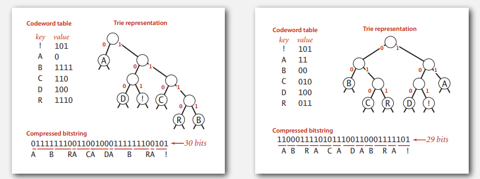​

### Compression and Expansion

> Compression

* Method 1: start at leaf; follow path up the root; print bits in revserse.
* Method 2: create ST of key-value pairs.

> Expansion

* Start at root.
* Go left if bit is 0; go right if 1.
* If leaf node, print char and return to root.

### Node

```Java
private static class Node implements Comparable<Node> {
    private final char ch;
    private final int freq;
    private final Node left, right;

    public Node(char ch, int freq, Node left, Node right) {
        this.ch = ch;
        this.freq = freq;
        this.left = left;
        this.right = right;
    }

    public boolean isLeaf() {
        return left == null && right == null;
    }

    @Override
    public int compareTo(Node that) {
        return this.freq - that.freq;
    }
}
```

### Transmit

> Write the trie.

Write preorder traversal of trie; mark leaf and internal nodes with a bit.

​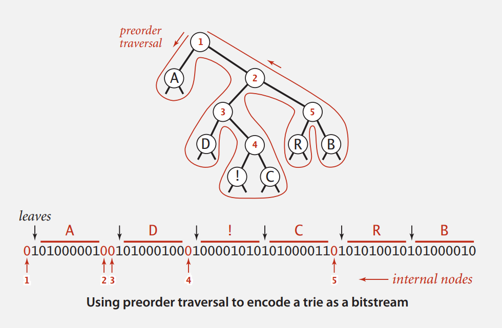​

If message is long, overhead of transmitting trie is small.

```Java
// Write preorder traversal of trie; mark leaf and internal nodes with a bit.
private static void writeTrie(Node x) {
    if (x.isLeaf()) {
        BinaryStdOut.write(true);
        BinaryStdOut.write(x.ch, 8);
        return;
    }
    BinaryStdOut.write(false);
    writeTrie(x.left);
    writeTrie(x.right);
}
```

> Read in the trie.

Reconstruct from preorder traversal of trie.

​​

```Java
private static Node readTrie() {
    if (BinaryStdIn.readBoolean()) {
        char c = BinaryStdIn.readChar(8);
        return new Node(c, 0, null, null);
    }
    Node x = readTrie();
    Node y = readTrie();
    return new Node('\0', 0, x, y);     // '\0' used only for leaf nodes
}
```

### Expansion

```Java
public void expand() {
    Node root = readTrie();     // read in encoding trie
    int N = BinaryStdIn.readInt();  // read in number of chars

    for (int i = 0; i < N; i++) {
        Node x = root;
        while (!x.isLeaf()) {
            if (!BinaryStdIn.readBoolean()) {
                x = x.left;
            } else {
                x = x.right;
            }
        }
        BinaryStdOut.write(x.ch, 8);
    }
    BinaryStdOut.close();
}
```

### Compression

#### Shannon-Fano codes

* Q. How to find best prefix-free code

Shannon-Fano algorithm:

* Partition symbol *S* into two subset *S*​*<sub>0</sub>* and *S*​*<sub>1</sub>* of (roughly) equal freq.
* Codewords for symbols in *S*​*<sub>0</sub>* start with 0; for symbols in *S*​*<sub>1</sub>*  start with 1.
* Recur in *S*​*<sub>0</sub>* and *S*​*<sub>1</sub>*.

​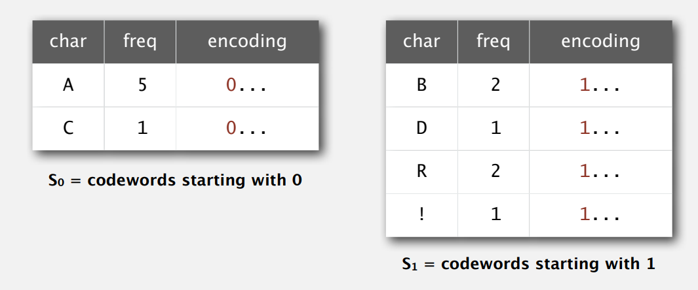​

Problem

* How to divide up symbols?
* Not optimal.

#### Huffman Algorithm

* Count frequency `freq[i]`​ for each character `i`​ in input.
* Start with one node corresponding to each character `i`​ with weight equal to `freq[i]`​.

  * Select two trie with min weight. `freq[i]`​ and `freq[j]`​
  * Merge into single trie with cumulative weight. `freq[i] + freq[j]`​

​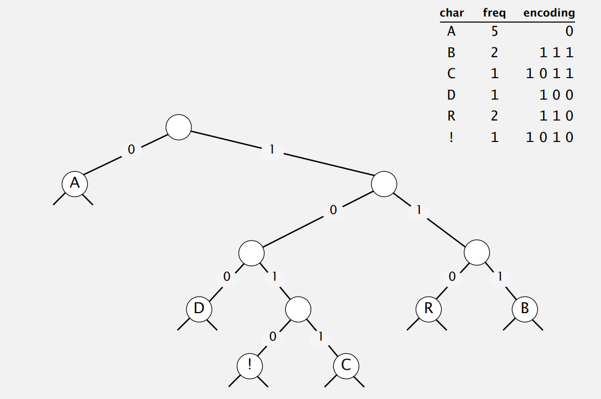​

```Java
private static Node buildTrie(int[] freq) {
    MinPQ<Node> pq = new MinPQ<>();
    for (char i = 0; i < R; i++) {
        if (freq[i] > 0) {
            pq.insert(new Node(i, freq[i], null, null));
        }
    }
    while (pq.size() > 1) {
        Node x = pq.delMin();
        Node y = pq.delMin();
        Node parent = new Node('\0', x.freq + y.freq, x, y);
        pq.insert(parent);
    }
    return pq.delMin();
}
```

Proposition. [Huffman 1950s] Huffman algorithm produces an optimal prefix-free code.

Running time. Using a binary heap ⇒ *N* + *R* log *R* .

* *N*: input size
* *R*: alphabet size

## LZW Compression

### Statistical methods

Static model. Same model for all texts.

* Fast.
* Not optimal: different texts have different statistical properties.
* Ex: ASCII, Morse code.

Dynamic model. Generate model based on text.

* Preliminary pass needed to generate model.
* Must transmit the model.
* Ex: Huffman code.

Adaptive model. Progressively learn and update model as you read text.

* More accurate modeling produces better compression.
* Decoding must start from beginning.
* Ex: LZW.

### LZW Compression

​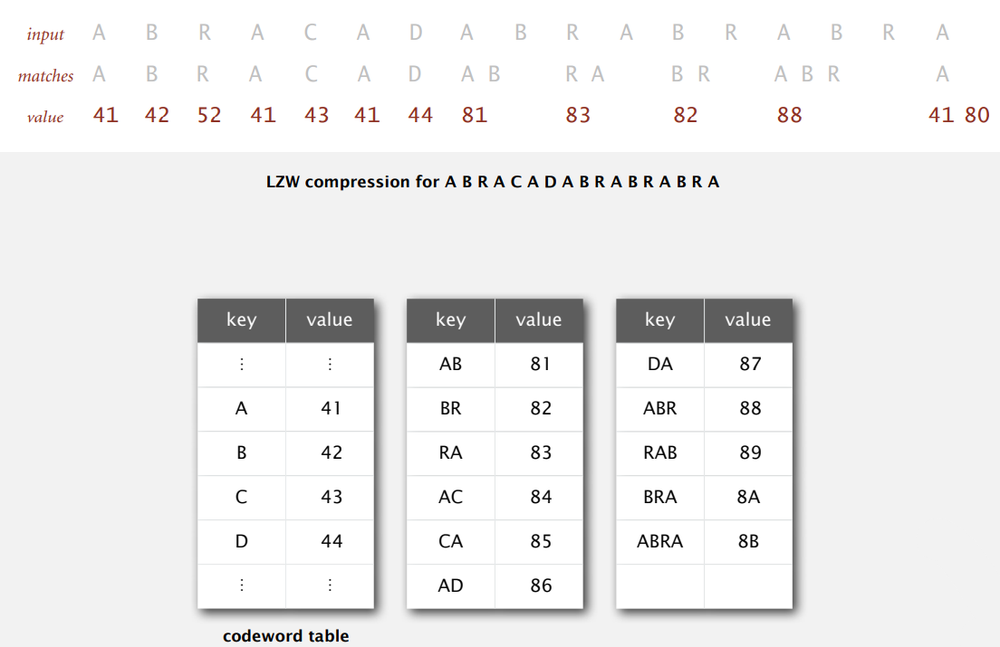​

* Create ST associating *W*-bit codewords with string keys.
* Initialize ST with codewords for single-char keys.
* Find longest string *s* in ST that is a prefix of unscanned part of input.  (longest prefix match)
* Write the *W*-bit codeword associated with *s*.
* Add *s* + *c* to ST, where *c* is next char in the input.

No need to transmit the table!

​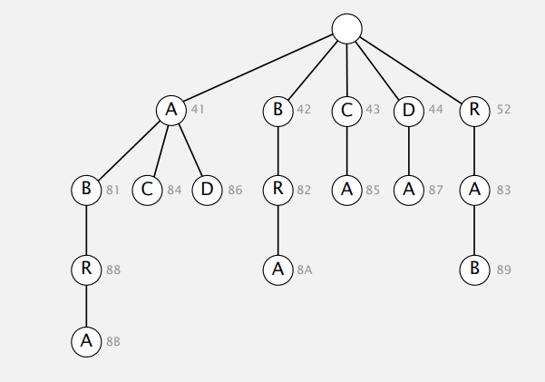​

```Java
import edu.princeton.cs.algs4.BinaryStdIn;
import edu.princeton.cs.algs4.BinaryStdOut;
import edu.princeton.cs.algs4.TST;

/**
 * @Author: Zephyrtoria
 * @CreateTime: 2024-11-24
 * @Description:
 * @Version: 1.0
 */
public class LZWCompression {
    private static final int R = 26;    // the number of alphabet
    private static final int W = 8;     // bits the codeword used
    private static final int L = 256;   // the largest code number

    public static void compression() {
        String input = BinaryStdIn.readString();    // read in input as a string

        TST<Integer> st = new TST<>();      // codewords for single-char, radix R keys
        for (int i = 0; i < R; i++) {
            st.put("" + (char) i, i);
        }
        int code = R + 1;

        while (!input.isEmpty()) {
            // Returns the string in the symbol table that is the longest prefix of query, or null, if no such string.
            String s = st.longestPrefixOf(input);   // find the longest prefix match s
            BinaryStdOut.write(st.get(s), W);   // write W-bit codeword for s
            int t = s.length();
            if (t < input.length() && code < L) {
                st.put(input.substring(0, t + 1), code++);      // add new codeword
            }
            input = input.substring(t);     // scan past s in input
        }

        BinaryStdOut.write(R, W);       // write "stop" codeword and close input stream
        BinaryStdOut.close();
    }
}
```

### LZW Expansion

* Create ST associating string values with W-bit keys.
* Initialize ST to contain single-char values.
* Read a *W*-bit key.
* Find associated string value in ST and write it out.
* Update ST.

An array of size 2<sub><sup>*w*</sup></sub> represents LZW expansion code table.

​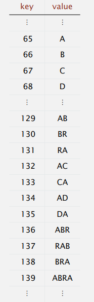​

#### Tricy Case

​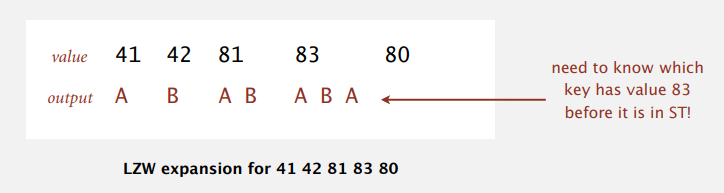​

When it comes to 83, we didn't know what 83 represents.

Can be solved.

### Implementation

How big to make ST?

* How long is message?
* Whole message similar model?
* [many other variations]

What to do when ST fills up?

* Throw away and start over. [GIF]
* Throw away when not effective. [Unix compress]
* [many other variations]

Why not put longer substrings in ST?

* [many variations have been developed]

# Reductions

* Reduction: design algorithms, establish lower bounds, classify problems.
* Linear programming: the ultimate practical problem-solving model.
* Intractability: problems beyond our reach.

## Introduction

Desiderate: Classify problems according to computational requirements.

​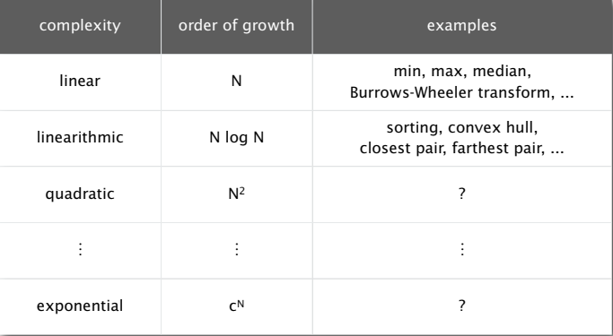​

### Reduction

Def. Problem *X* **reduces to** problem *Y* if you can use an algorithm that solves *Y* to help solve *X*.

​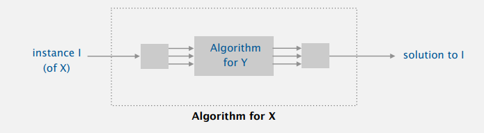​

$$
Cost\_of\_solving\_X = total\_cost\_of\_solving\_Y + cost\_of\_reduction
$$

* Ex 1. "Find the median" reduces to "sorting"
* Ex 2. "Element distinctness" reduces to "sorting"

## Designing Algorithm

Design algorithm. Given algorithm for *Y*, can also solve *X*.

### Convex hull

* Sorting. Given N distinct integers, rearrange them in ascending order.
* Convex hull. Given N points in the plane, identify the extreme points of the convex hull (in counterclockwise order).

​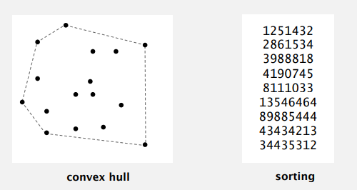​

* Proposition. Convex hull reduces to sorting.
* Pf. Graham scan algorithm.
* Cost of convex hull. N log N + N. (cost of sorting + reduction)

### Shortest Paths

* Proposition. Undirected shortest paths (with nonnegative weights) reduces to directed shortest path.
* Pf. Replace each undirected edge by two directed edges.
* Cost of undirected shortest paths. E log V + E. (cost of shortest paths in digraph + cost of reduction)

​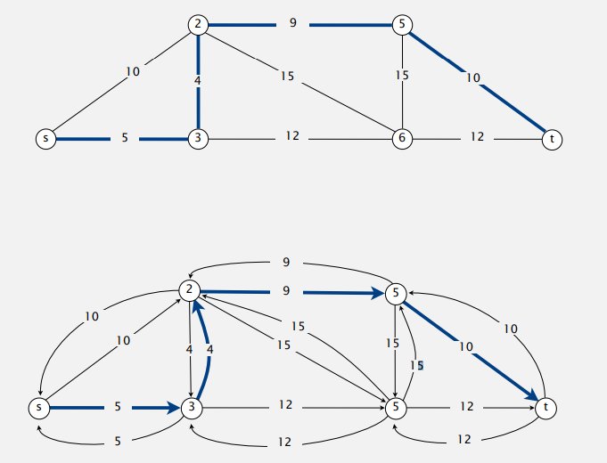​

### Linear-time reductions

​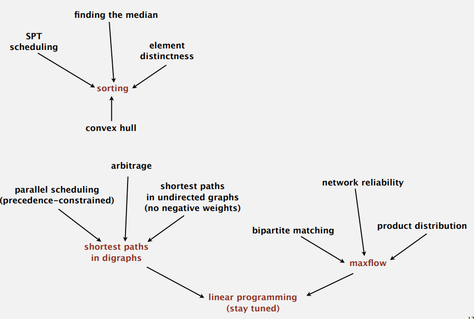​

## Establishing Lower Bounds

Goal. Prove that a problem requires a certain number of steps.

Ex. In decision tree model, any compare-based sorting algorithm requires Ω(*N* log *N*) compares in the worst case.

​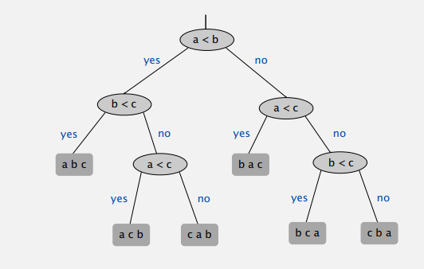​

* Very difficult to establish lower bounds from scratch. (argument must apply to all conceivable algorithms)
* Spread Ω(*N* log *N*) lower bound to *Y* by reducing sorting to *Y*. (assuming cost of reduction is not too high)

### Linear-time Reductions

Def. Problem *X* **linear-time reduces** to problem *Y* if *X* can be solved with:

* Linear number of standard computational steps.
* Constant number of calls to *Y*.

Establish lower bound:

* If *X* takes Ω(*N* log *N*) steps, then so does *Y*.
* If *X* takes Ω(*N*​<sup>2</sup>) steps, then so does *Y*.

Mentality.

* If I could easily solve Y, then I could easily solve X.
* I can’t easily solve X. 

  * Therefore, I can’t easily solve Y.

## Classifying Problems

* Desiderata. Problem with algorithm that matches lower bound.
* Desiderata'. Prove that two problems *X* and *Y* have the same complexity. 

  * First, show that problem *X* linear-time reduces to *Y*.
  * Second, show that *Y* linear-time reduces to *X*.
  * Conclude that *X* and *Y* have the same complexity. (even if we don't know what it is)

### Integer Arithmetic Reductions

* Integer multiplication. Given two N-bit integers, compute their product.
* Brute force. *N*​<sup>2</sup> bit operations.

​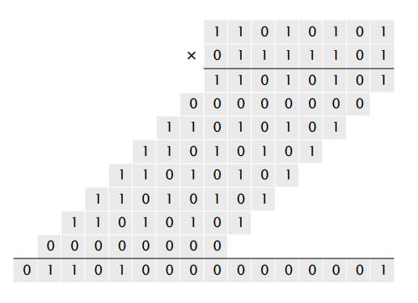​

​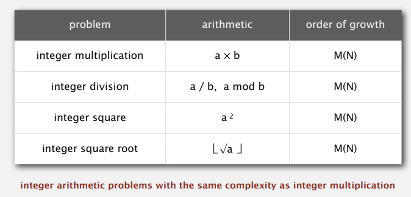​

​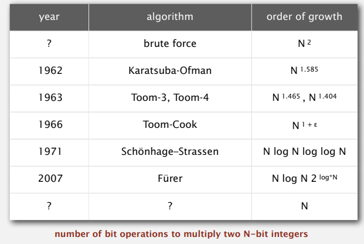​

### Linear Algebra Reductions

* Matrix multiplication. Given two N-by-N matrices, compute their product.
* Brute force. *N*​<sup>3</sup> flops.

​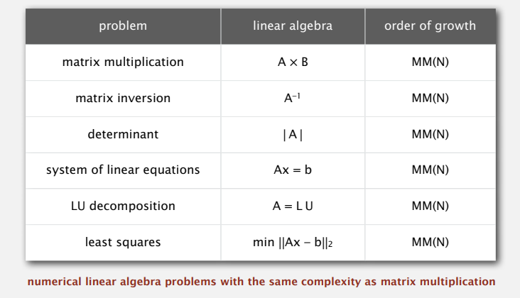​

​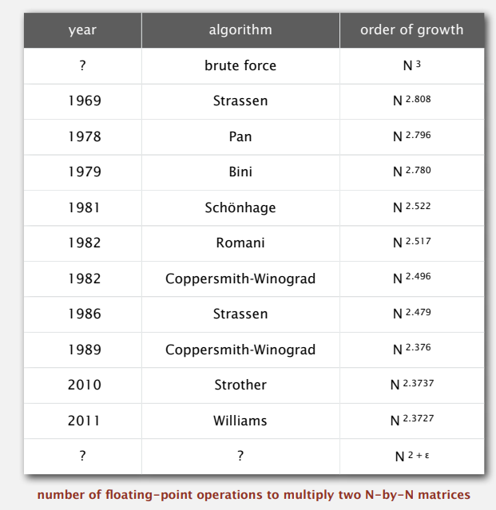​

### Summary

* Reductions are important in theory to: 

  * Design algorithms.
  * Establish lower bounds.
  * Classify problems according to their computational requirements.
* Reductions are important in practice to: 

  * Design algorithms.
  * Design reusable software modules. 

    * stacks, queues, priority queues, symbol tables, sets, graphs
    * sorting, regular expressions, Delaunay triangulation
    * MST, shortest path, maxflow, linear programming
  * Determine difficulty of your problem and choose the right tool.
