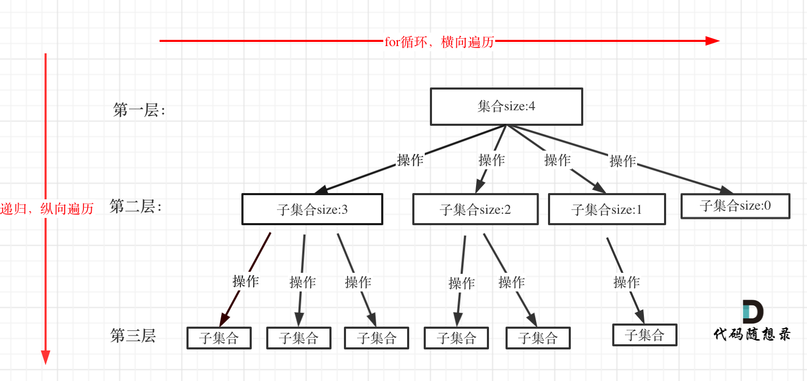
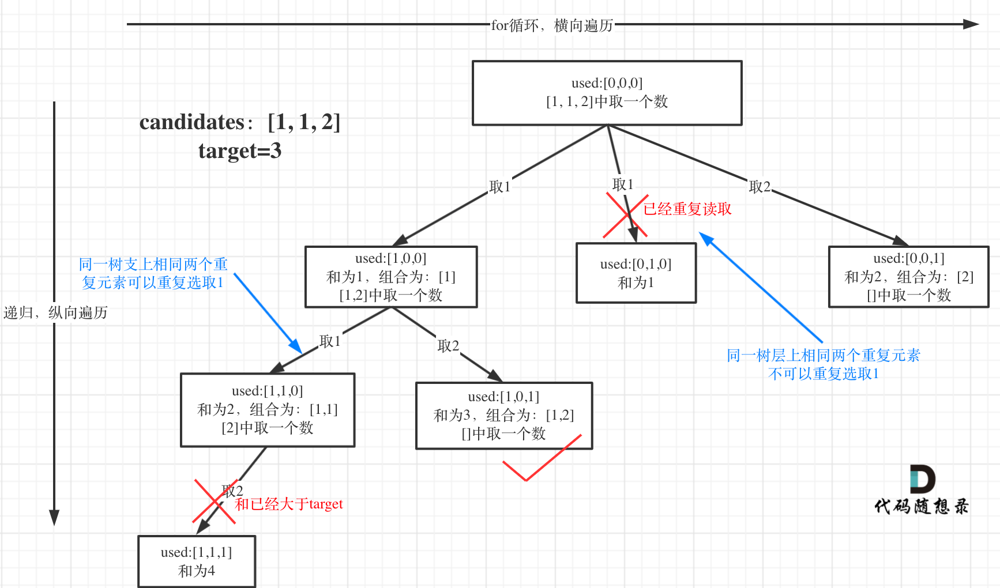
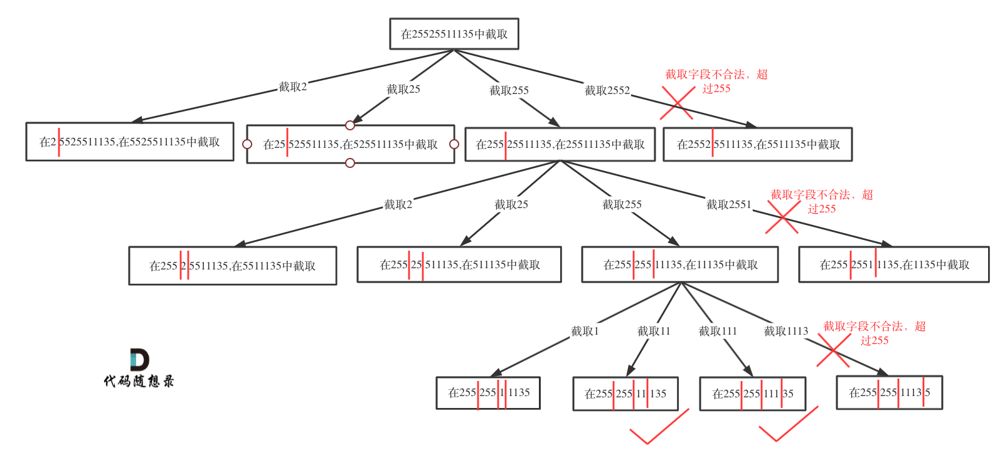

# 回溯算法

# 概述

​​

实际上就是深搜的细分应用

回溯法，一般可以解决如下几种问题：

* 组合问题：N 个数里面按一定规则找出 k 个数的集合（组合不强调元素顺序）
* 切割问题：一个字符串按一定规则有几种切割方式
* 子集问题：一个 N 个数的集合里有多少符合条件的子集
* 排列问题：N 个数按一定规则全排列，有几种排列方式（排列强调元素顺序）
* 棋盘问题：N 皇后，解数独等等

> **回溯法解决的问题都可以抽象为树形结构**

* 因为回溯法解决的都是在集合中递归查找子集，**集合的大小就构成了树的宽度，递归的深度就构成了树的深度**。
* 递归就要有终止条件，所以必然是一棵高度有限的树（N 叉树）。

​​

> 三要素

1. 函数返回值以及参数
2. 函数终止条件（叶子结点）
3. 搜索的遍历过程

```Java
void backtracking(参数) {
    if (终止条件) {
        存放结果;
        return;
    }

    for (选择：本层集合中元素（树中结点的子结点数量就是集合的大小）) {
        处理节点;			// 开
        backtracking(路径，选择列表); // 递归
        回溯，撤销处理结果	// 关
    }
}
```

**for 循环可以理解是横向遍历，backtracking（递归）就是纵向遍历**

# 组合

## 组合问题

### 组合

[leetcode.cn/problems/combinations/description/](https://leetcode.cn/problems/combinations/description/)

> 给定两个整数 `n`​ 和 `k`​，返回范围 `[1, n]`​ 中所有可能的 `k`​ 个数的组合。
>
> 你可以按 **任何顺序** 返回答案。

递归来做层叠嵌套（可以理解是开 k 层 for 循环），**每一次的递归中嵌套一个 for 循环，那么递归就可以用于解决多层嵌套循环的问题了**。

```Java
import java.util.List;
import java.util.ArrayList;
class Solution {
    private List<List<Integer>> results;
    public List<List<Integer>> combine(int n, int k) {
        results = new ArrayList<>();
        backtracking(n, k, 1, new ArrayList<>());
        return results;
    }

    private void backtracking(int n, int k, int startIndex, List<Integer> path) {
        if (path.size() == k) {
            results.add(new ArrayList<>(path));
            return;
        }
        for (int i = startIndex; i <= n; i++) {
            path.add(i);
            backtracking(n, k, i + 1, path);
            path.remove(path.size() - 1);
        }
    }
}
```

### 剪枝优化

检查待取的元素集合大小是否大于等于还需要取的数量，否则进行剪枝

​​

如果 for 循环选择的起始位置之后的元素个数已经不足需要的元素个数了，就没有必要搜索

```Java
private void backtracking(int n, int k, int startIndex, List<Integer> path) {
    if (path.size() == k) {
        results.add(new ArrayList<>(path));
        return;
    }
    // path.size()是已经加入元素个数，k是需要加入的元素个数
    // k - path.size() 是仍然还需要选取的元素个数
    // n - (k - path.size()) + 1是本次选取，起点可以选取的最大的值，+1是因为索引从1开始
    for (int i = startIndex; i <= n - (k - path.size()) + 1; i++) {
        path.add(i);
        backtracking(n, k, i + 1, path);
        path.remove(path.size() - 1);
    }
}
```

### 组合总和 III

[leetcode.cn/problems/combination-sum-iii/description/](https://leetcode.cn/problems/combination-sum-iii/description/)

> 找出所有相加之和为 `n`​  的 `k`​  个数的组合，且满足下列条件：
>
> * 只使用数字 1 到 9
> * 每个数字 **最多使用一次**
>
> 返回 *所有可能的有效组合的列表* 。该列表不能包含相同的组合两次，组合可以以任何顺序返回。

​​

```Java
import java.util.List;
import java.util.ArrayList;
class Solution {
    private List<List<Integer>> results;
    private static final int N = 9;
    public List<List<Integer>> combinationSum3(int k, int n) {
        results = new ArrayList<>();
        backTracking(k, n, 1, 0, new ArrayList<Integer>());
        return results;
    }

    private void backTracking(int k, int n, int startIndex, int sum, List<Integer> path) {
        if (path.size() == k) {
            if (sum == n) {
                results.add(new ArrayList<>(path));
            }
            return;
        }

        for (int i = startIndex; i <= N && i <= N - (k - path.size()) + 1; i++) {
            if (sum + i > n) {
                break;	// return 作用一致
            }
            path.add(i);
            backTracking(k, n, i + 1, sum + i, path);
            path.remove(path.size() - 1);
        }
    }
}
```

### 电话号码的字母组合

https://leetcode.cn/problems/letter-combinations-of-a-phone-number/description/

> 给定一个仅包含数字 `2-9`​ 的字符串，返回所有它能表示的字母组合。答案可以按 **任意顺序** 返回。
>
> 给出数字到字母的映射如下（与电话按键相同）。注意 1 不对应任何字母。
>
> ​​

普通的回溯算法，再加上数字和字符的映射即可

```Java
import java.util.List;
import java.util.ArrayList;

class Solution {
    private final static char[][] keyboard=
    {{}, {}, {'a', 'b', 'c'}, {'d', 'e', 'f'}, {'g', 'h', 'i'}, {'j', 'k', 'l'}, {'m', 'n', 'o'}, {'p', 'q', 'r', 's'}, {'t', 'u', 'v'}, {'w', 'x', 'y', 'z'}};
    private List<String> results;
    public List<String> letterCombinations(String digits) {
        results = new ArrayList<>();
        if (digits.length() != 0) {
            backTracking(0, digits, new ArrayList<Character>());
        }
        return results;
    }

    private void backTracking(int u, String digits, List<Character> path) {
        if (path.size() == digits.length()) {
            StringBuilder sb = new StringBuilder();
            for (Character c : path) {
                sb.append(c);
            }
            results.add(sb.toString());
            return;
        }
        char[] group = keyboard[digits.charAt(u) - '0'];
        for (int i = 0; i < group.length; i++) {
            path.add(group[i]);
            backTracking(u + 1, digits, path);
            path.remove(path.size() - 1);
        }
    }
}
```

### 组合总和

[leetcode.cn/problems/combination-sum/description/](https://leetcode.cn/problems/combination-sum/description/)

> 给你一个 **无重复元素** 的整数数组 `candidates`​ 和一个目标整数 `target`​ ，找出 `candidates`​ 中可以使数字和为目标数 `target`​ 的 所有  **不同组合** ，并以列表形式返回。你可以按 **任意顺序** 返回这些组合。
>
> ​`candidates`​ 中的 **同一个** 数字可以 **无限制重复被选取** 。如果至少一个数字的被选数量不同，则两种组合是不同的。
>
> 对于给定的输入，保证和为 `target`​ 的不同组合数少于 `150`​ 个。
>
> * ​`1 <= candidates.length <= 30`​
> * ​`2 <= candidates[i] <= 40`​
> * ​`candidates`​ 的所有元素 **互不相同**
> * ​`1 <= target <= 40`​

* 只需要不对 `startIndex` ​进行 +1 即可，相当于设置为可以选择自己
* 先对 `candidates` ​进行排序，便于剪枝

```Java
import java.util.List;
import java.util.ArrayList;
import java.util.Arrays;
class Solution {
    private List<List<Integer>> results;
    public List<List<Integer>> combinationSum(int[] candidates, int target) {
        results = new ArrayList<>();
        Arrays.sort(candidates);
        backTracking(candidates, candidates.length, 0, target, 0, new ArrayList<Integer>());
        return results;
    }

    private void backTracking(int[] candidates, int n, int startIndex, int target, int sum, List<Integer> path) {
        if (sum == target) {
            results.add(new ArrayList<>(path));
            return;
        }

        for (int i = startIndex; i < n; i++) {
            if (sum + candidates[i] > target) {
                return;
            }
            path.add(candidates[i]);
            backTracking(candidates, n, i, target, sum + candidates[i], path);
            path.remove(path.size() - 1);
        }
    }
}
```

### 组合总和 II

[leetcode.cn/problems/combination-sum-ii/description/](https://leetcode.cn/problems/combination-sum-ii/description/)

> 给定一个候选人编号的集合 `candidates`​ 和一个目标数 `target`​ ，找出 `candidates`​ 中所有可以使数字和为 `target`​ 的组合。
>
> ​`candidates`​ 中的每个数字在每个组合中只能使用 **一次** 。
>
> **注意：** 解集不能包含重复的组合。
>
> * ​`1 <= candidates.length <= 100`​
> * ​`1 <= candidates[i] <= 50`​
> * ​`1 <= target <= 30`​

关键点在于**去重**

将去重分为**树层去重**与**树枝去重**

​​

本题中实际上就是要进行树层去重，如果两次取的元素相同的话，那么后面取的组合必然是前面取的组合的子集

```Java
import java.util.List;
import java.util.ArrayList;
import java.util.Arrays;
class Solution {
    private List<List<Integer>> results;
    public List<List<Integer>> combinationSum2(int[] candidates, int target) {
        Arrays.sort(candidates);
        results = new ArrayList<>();
        boolean[] used = new boolean[candidates.length];
        backtracking(candidates, target, 0, new ArrayList<Integer>(), used, 0);
        return results;
    }

    private void backtracking(int[] candidates, int target, int sum, List<Integer> path, boolean[] used, int startIndex) {
        if (sum > target) {
            return;
        }
        if (sum == target) {
            results.add(new ArrayList<>(path));
            return;
        }

        for (int i = startIndex; i < candidates.length; i++) {
            if (i > 0 && candidates[i] == candidates[i - 1] && !used[i - 1]) {
                continue;   // used[] 用于指示是树层还是树枝
            }
            path.add(candidates[i]);
            used[i] = true;
            backtracking(candidates, target, sum + candidates[i], path, used, i + 1);
            path.remove(path.size() - 1);
            used[i] = false;
        }
    }
}
```

## 切割问题

### 分割回文串

[leetcode.cn/problems/palindrome-partitioning/description/](https://leetcode.cn/problems/palindrome-partitioning/description/)

> 给你一个字符串 `s`​，请你将 `s`​ 分割成一些子串，使每个子串都是 回文串
>
> 。返回 `s`​ 所有可能的分割方案。

​​

1. 选取分割的位置

   1. ​`startIndex` ​即前一次分割的位置，要从该分割之后一个字符开始选取
   2. 传递 `startIndex + 1` ​即进行分割
   3. 切割线到最后 `n` ​即切割到末尾，需要收集结果
2. 最后纳入结果集还需要判断当前分割方式中的每个子串是否为回文串

   1. 剪枝：在当前划分时，就判断是否为回文串

```Java
import java.util.List;
import java.util.ArrayList;
class Solution {
    private List<List<String>> results;
    public List<List<String>> partition(String s) {
        results = new ArrayList<>();
        backtracking(s, s.length(), 0, new ArrayList<String>());
        return results;
    }

    private void backtracking(String s, int length, int startIndex, List<String> path) {
        if (startIndex == length) {
            results.add(new ArrayList<>(path));
            return;
        }

        for (int i = startIndex; i < length; i++) {
            // 判断当前分割方式下，新分出来的子串是否为回文串
            if (!isPalindromes(s, startIndex, i)) {
                continue;
            }
            // 搜索
            path.add(s.substring(startIndex, i + 1));   // substring(startIndex) or substring(startIndex, endIndex) -> [startIndex, endIndex)
            backtracking(s, length, i + 1, path);
            path.remove(path.size() - 1);
        }
    }

    private boolean isPalindromes(String s, int left, int right) {
        while (left < right) {
            if (s.charAt(left) != s.charAt(right)) {
                return false;
            }
            left++;
            right--;
        }
        return true;
    }
}
```

* 切割问题可以抽象为组合问题
* 如何模拟那些切割线
* 切割问题中递归如何终止
* 在递归循环中如何截取子串
* 如何判断回文

### 复原 IP 地址

[leetcode.cn/problems/restore-ip-addresses/description/](https://leetcode.cn/problems/restore-ip-addresses/description/)

> **有效 IP 地址** 正好由四个整数（每个整数位于 `0`​ 到 `255`​ 之间组成，且不能含有前导 `0`​），整数之间用 `'.'`​ 分隔。
>
> * 例如：`"0.1.2.201"`​ 和 ` "192.168.1.1"`​ 是 **有效** IP 地址，但是 `"0.011.255.245"`​、`"192.168.1.312"`​ 和 `"192.168@1.1"`​ 是 **无效** IP 地址。
>
> 给定一个只包含数字的字符串 `s`​ ，用以表示一个 IP 地址，返回所有可能的**有效 IP 地址**，这些地址可以通过在 `s`​ 中插入 `'.'`​ 来形成。你 **不能** 重新排序或删除 `s`​ 中的任何数字。你可以按 **任何** 顺序返回答案。

​​

字段合法性：

* 段位以 0 为开头的数字不合法
* 段位里有非正整数字符不合法
* 段位如果大于 255 了不合法

```Java
import java.util.List;
import java.util.ArrayList;
public class Solution {
    private List<String> results;
    public List<String> restoreIpAddresses(String s) {
        results = new ArrayList<>();
        if (s.length() < 4 || s.length() > 12) {
            return results;
        }
        backtracking(s, s.length(), 0, new ArrayList<>());
        return results;
    }

    private void backtracking(String s, int length, int startIndex, List<String> path) {
        // 当已有三段合法的字段时，判断第四段是否合法来决定是否放入结果集中
        if (path.size() == 3) {
            if (isValid(s, startIndex, length - 1)) {
                StringBuilder sb = new StringBuilder();
                for (String each : path) {
                    sb.append(each);
                }
                sb.append(s.substring(startIndex));
                results.add(sb.toString());
            }
            return;
        }

        // 每个分隔中至多包含3位数字
        for (int i = startIndex; i < length; i++) {
            // 不可大于255，无前导零
            if (!isValid(s, startIndex, i)) {
                return;
            }
            path.add(s.substring(startIndex, i + 1) + ".");
            backtracking(s, length, i + 1, path);
            path.remove(path.size() - 1);
        }
    }

    private boolean isValid(String s, int left, int right) {
        if (left > right) {
            return false;
        }
        // 判断有无前导零
        if (s.charAt(left) == '0' && left != right) {
            return false;
        }
        int result = 0;
        for (int i = left; i <= right; i++) {
            char c = s.charAt(i);
            if (!('0' <= c && c <= '9')) {
                return false;
            }
            result = result * 10 + c - '0';
            if (result > 255) {
                return false;
            }
        }
        return true;
    }

    public static void main(String[] args) {
        Solution s = new Solution();
        System.out.println(s.restoreIpAddresses("25525511135"));
    }
}
```

## 子集问题

### 子集

[leetcode.cn/problems/subsets/description/](https://leetcode.cn/problems/subsets/description/)

> 给你一个整数数组 `nums`​ ，数组中的元素 **互不相同** 。返回该数组所有可能的
>
> 子集
>
> （幂集）。解集 **不能** 包含重复的子集。你可以按 **任意顺序** 返回解集。

​​

组合问题和分割问题都是收集树的**叶子节点**，而子集问题是找树的**所有节点**

```Java
import java.util.ArrayList;
import java.util.List;
class Solution {
    private List<List<Integer>> results;
    public List<List<Integer>> subsets(int[] nums) {
        results = new ArrayList<>();
        List<Integer> path = new ArrayList<>();
        backtracking(nums, 0, path);
        return results;
    }

    private void backtracking(int[] nums, int startIndex, List<Integer> path) {
        results.add(new ArrayList<>(path));
		/* if (startIndex >= nums.length) {
			return;
		} // 可以省略，startIndex超出nums.length后自然会停止 */
        for (int i = startIndex; i < nums.length; i++) {
            path.add(nums[i]);
            backtracking(nums, i + 1, path);
            path.remove(path.size() - 1);
        }
    }
}
```

### 子集 II

[leetcode.cn/problems/subsets-ii/](https://leetcode.cn/problems/subsets-ii/)

> 给你一个整数数组 `nums`​ ，其中可能包含重复元素，请你返回该数组所有可能的
>
> 子集
>
> （幂集）。解集 **不能** 包含重复的子集。返回的解集中，子集可以按 **任意顺序** 排列。

**子集 + 组合总和 II**

```Java
import java.util.List;
import java.util.ArrayList;
import java.util.Arrays;
class Solution {
    private List<List<Integer>> results;
    public List<List<Integer>> subsetsWithDup(int[] nums) {
        Arrays.sort(nums);
        results = new ArrayList<>();
        boolean[] visited = new boolean[nums.length];
        backtracking(nums, visited, 0, new ArrayList<>());
        return results;
    }

    private void backtracking(int[] nums, boolean[] visited, int startIndex, List<Integer> path) {
        results.add(new ArrayList<>(path));

        for (int i = startIndex; i < nums.length; i++) {
			// 树层去重
            if (i > 0 && nums[i - 1] == nums[i] && !visited[i - 1]) {
                continue;
            }
            path.add(nums[i]);
            visited[i] = true;
            backtracking(nums, visited, i + 1, path);
            visited[i] = false;
            path.remove(path.size() - 1);
        }
    }
}
```

### 非递减子序列

[leetcode.cn/problems/non-decreasing-subsequences/description/](https://leetcode.cn/problems/non-decreasing-subsequences/description/)

> 给你一个整数数组 `nums`​ ，找出并返回所有该数组中不同的递增子序列，递增子序列中 **至少有两个元素** 。你可以按 **任意顺序** 返回答案。
>
> 数组中可能含有重复元素，如出现两个整数相等，也可以视作递增序列的一种特殊情况。

* 注意：不能进行排序，因为是要找出子序列，要在给定的数组顺序下
* 树层上进行去重，又因为涉及到负数，所以得使用`Set`​

  * 当然也可以构造一个哈希函数来映射负数，就可以使用数组实现了
* 在节点上搜集结果，同时对子集大小有要求

​​

```Java
import java.util.ArrayList;
import java.util.List;
import java.util.Set;
import java.util.HashSet;

class Solution {
    private List<List<Integer>> results;

    public List<List<Integer>> findSubsequences(int[] nums) {
        results = new ArrayList<>();
        backtracking(nums, 0, new ArrayList<>());
        return results;
    }

    private void backtracking(int[] nums, int startIndex, List<Integer> path) {
        if (path.size() > 1) {
            results.add(new ArrayList<>(path));
        }

        Set<Integer> visited = new HashSet<>();		// 关键在于visited的理解，只负责本层
        for (int i = startIndex; i < nums.length; i++) {
            // 1. 取的数要大于等于已选子集中的最后一个数
            // 2. 树层去重，在从父节点走向子节点时，不会走重复的路，所以visited应该在每个节点处新建
            if ((!path.isEmpty() && path.get(path.size() - 1) > nums[i]) || visited.contains(nums[i])) {
                continue;
            }
            visited.add(nums[i]);
            path.add(nums[i]);
            backtracking(nums, i + 1, path);
			// visited不需要恢复状态
            path.remove(path.size() - 1);
        }
    }
}
```

# 排列

* 组合通过控制 `startIndex`​ 来实现不出现重复的集合
* 排列通过 `visited[]`​ 来判断是否访问

## 全排列

[leetcode.cn/problems/permutations/description/](https://leetcode.cn/problems/permutations/description/)

> 给定一个不含重复数字的数组 `nums`​ ，返回其 *所有可能的全排列* 。你可以 **按任意顺序** 返回答案。

​​

```Java
import java.util.ArrayList;
import java.util.List;

class Solution {
    private List<List<Integer>> results;
    public List<List<Integer>> permute(int[] nums) {
        results = new ArrayList<>();
        boolean[] visited = new boolean[nums.length];
        backtracking(nums, visited, new ArrayList<>());
        return results;
    }

    private void backtracking(int[] nums, boolean[] visited, List<Integer> path) {
        if (path.size() == nums.length) {
            results.add(new ArrayList<>(path));
            return;
        }
        for (int i = 0; i < nums.length; i++) {
            if (!visited[i]) {
                path.add(nums[i]);
                visited[i] = true;
                backtracking(nums, visited, path);
                visited[i] = false;
                path.remove(path.size() - 1);
            }
        }
    }
}
```

## 全排列 II

# 棋盘问题

‍

## N 皇后

‍

## 解数独
