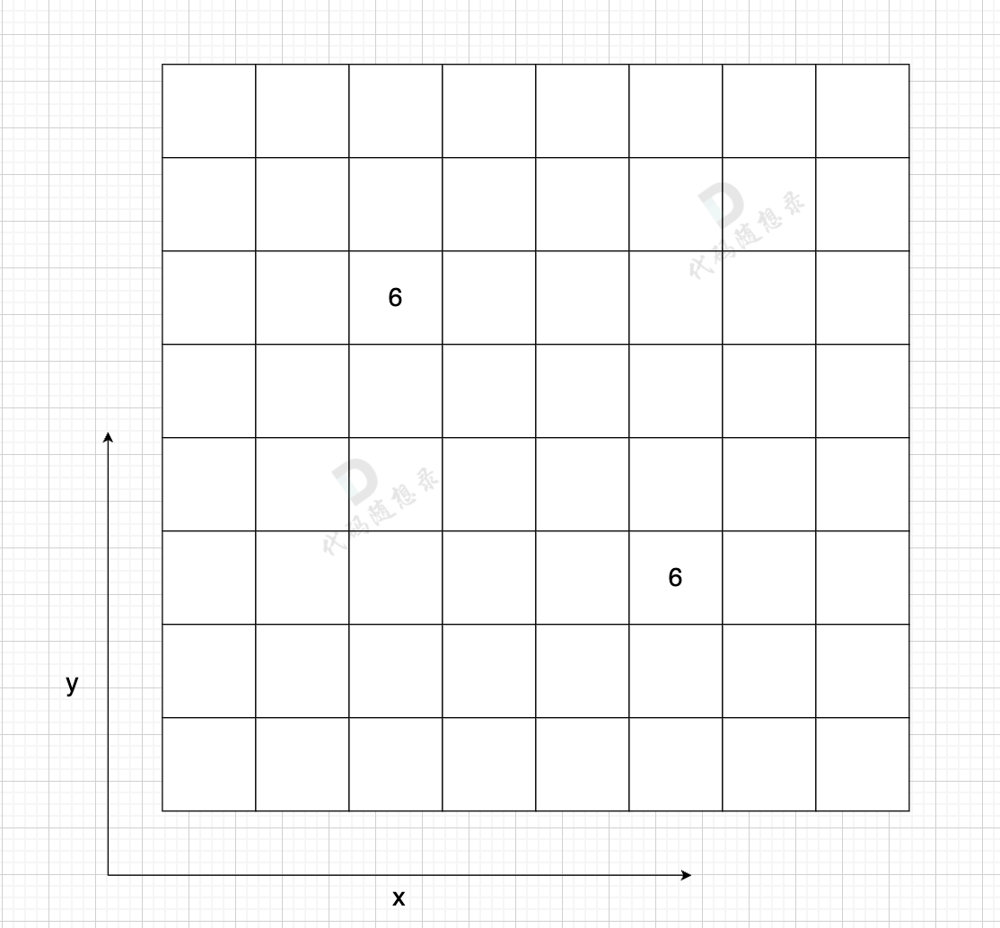

# 图论

# 基本概念

## 分类

* 无向图
* 有向图

## 定义

> 基本图

* 顶点
* 边
* 路径

  * 路径长度
* 连通

  * 连通分量
* 回路（环）

> 无向图

* 相邻
* 完全无向图
* 连通

  * 连通分量：无向图中的极大连通子图

    ​​
* 无向回路
* 顶点的度

> 有向图

* 头顶点
* 尾顶点
* 完全有向图
* 强连通：任何两个节点可以相互到达

  * 强连通分量：有向图中极大强连通子图

    ​​

    1 可以到 5，但 5 不能到 1，不是强连通图
* 弱连通：任何两个节点可以单向到达

  * 弱连通分量
* 有向回路
* 顶点的入度
* 顶点的出度

## 存储结构

> 邻接矩阵

使用**二维数组**来表示图结构。

从**节点**的角度来表示图，有多少节点就申请多大的二维数组

​`grid[x][y]` ​表示节点 *x* 指向节点 *y*（单向），当同时有 `grid[y][x]` ​时，有双向

​​

邻接矩阵在**边少，节点多**的情况下，会导致申请过大的二维数组，造成空间浪费。

而且在寻找节点连接情况的时候，需要遍历整个矩阵，即 `n * n`​ 的时间复杂度，同样造成时间浪费。

优点：

* 表达方式简单，易于理解
* 检查任意两个顶点间是否存在边的操作非常快
* 适合稠密图，在边数接近顶点数平方的图中，邻接矩阵是一种空间效率较高的表示方法。

缺点：

* 遇到稀疏图，会导致申请过大的二维数组造成空间浪费 且遍历 边 的时候需要遍历整个 n \* n 矩阵，造成时间浪费

> 邻接表

邻接表使用**数组 + 链表**的方式来表示。

从**边的数量**来表示图，有多少边才会申请对应大小的链表。

​​

优点：

* 对于稀疏图的存储，只需要存储边，空间利用率高
* 遍历节点连接情况相对容易

缺点：

* 检查任意两个节点间是否存在边，效率相对低，需要 O(V)时间，V 表示某节点连接其他节点的数量。
* 实现相对复杂，不易理解

## 基本操作

* 遍历

  * BFS
  * DFS
* 求连通分量

## 基本算法

* 有向图的最短路径

  * Dijkstra
  * Floyd
* 无向图的最小生成树

  * Prim
  * Kruskal
* AOV-网络 定点表示活动的有向图

  * 拓扑排序
* AOE-网络 边表示活动的有向图

  * 关键路径
  * 关键活动
  * 最大流/最小切

# DFS

## 所有可达路径

[kamacoder.com/problempage.php?pid=1170](https://kamacoder.com/problempage.php?pid=1170)

> 给定一个有 n 个节点的有向无环图，节点编号从 1 到 n。请编写一个函数，找出并返回所有从节点 1 到节点 n 的路径。每条路径应以节点编号的列表形式表示。

### 邻接矩阵实现

```Java
import java.util.List;
import java.util.ArrayList;
import java.util.Scanner;

public class Solution {
    private List<List<Integer>> results;
    private boolean[] status;
    private int[][] graph;
    private final int N;

    public static void main(String[] args) {
        Scanner sc = new Scanner(System.in);
        int N = sc.nextInt();
        int M = sc.nextInt();
        Solution s = new Solution(N);
        int[][] graph = new int[N + 1][N + 1];
        for (int i = 0; i < M; i++) {
            int x = sc.nextInt();
            int y = sc.nextInt();
            graph[x][y] = 1;
        }

        List<List<Integer>> results = s.allPathsSourceTarget(graph);
        if (results.isEmpty()) {
            System.out.print("-1");
            return;
        }

        int r = 0;
        for (int resultSize = results.size(); r < resultSize; r++) {
            int i = 0;
            List<Integer> each = results.get(r);
            for (int size = each.size() - 1; i < size; i++) {
                System.out.print(each.get(i));
                System.out.print(" ");
            }
            System.out.print(each.get(i));
            if (r != resultSize - 1) {
                System.out.println();
            }
        }
  
        sc.close();
    }

    public Solution(int N) {
        this.N = N;
    }

    public List<List<Integer>> allPathsSourceTarget(int[][] graph) {
        this.results = new ArrayList<>();
        this.graph = graph;
        this.status = new boolean[N + 1];
        List<Integer> vec = new ArrayList<>();
        vec.add(1);
        dfs(vec, 1, N);
        return results;
    }

    private void dfs(List<Integer> result, int from, int to) {
        if (from == to) {
            results.add(new ArrayList<>(result));	// 注意添加对象的情况
            return;
        }
        for (int i = 1; i <= N; i++) {
            if (graph[from][i] == 1 && !status[i]) {
                status[i] = true;		// 开
                result.add(i);
                dfs(result, i, to);
                result.remove(result.size() - 1);		// 关
                status[i] = false;
            }
        }
    }
}
```

### 邻接表实现

```Java
import java.util.ArrayList;
import java.util.LinkedList;
import java.util.List;
import java.util.Scanner;
public class Main {
    private List<Integer> path;
    private List<List<Integer>> results;
    private LinkedList<Integer>[] graph;
    private int N;
    private boolean[] status;


    public static void main(String[] args) {
        Scanner sc = new Scanner(System.in);
        int N = sc.nextInt();
        int M = sc.nextInt();

        LinkedList<Integer>[] graph = new LinkedList[N + 1];
        for (int i = 0; i <= N; i++) {
            graph[i] = new LinkedList<>();
        }
        for (int i = 0; i < M; i++) {
            int s = sc.nextInt();
            int t = sc.nextInt();
            graph[s].add(t);
        }

        Main m = new Main();
        List<List<Integer>> lists = m.allPathsSourceTarget(graph);
        if (lists.isEmpty()) {
            System.out.print("-1");
            return;
        }

        for (int r = 0; r < lists.size(); r++) {
            List<Integer> list = lists.get(r);
            int i = 0;
            for (int size = list.size() - 1; i < list.size() - 1; i++) {
                System.out.print(list.get(i));
                System.out.print(" ");
            }
            System.out.print(list.get(i));
            if (r != lists.size() - 1) {
                System.out.println();
            }
        }
    }

    public List<List<Integer>> allPathsSourceTarget(LinkedList<Integer>[] graph) {
        results = new ArrayList<>();
        this.graph = graph;
        N = graph.length - 1;
        status = new boolean[graph.length];
        path = new ArrayList<>();

        status[1] = true;
        path.add(1);
        dfs(1);
        return results;
    }

    private void dfs(int cur) {
        if (cur == N) {
            results.add(new ArrayList<>(path));
            return;
        }

        for (Integer next : graph[cur]) {
            if (!status[next]) {
                status[next] = true;
                path.add(next);
                dfs(next);
                path.remove(path.size() - 1);
                status[next] = false;
            }
        }
    }
}

```

## 岛屿数量（DFS）

[kamacoder.com/problempage.php?pid=1171](https://kamacoder.com/problempage.php?pid=1171)

> 给定一个由 1（陆地）和 0（水）组成的矩阵，你需要计算岛屿的数量。岛屿由水平方向或垂直方向上相邻的陆地连接而成，并且四周都是水域。你可以假设矩阵外均被水包围。

```Java
import java.util.Scanner;
public class Main {
    private int[][] graph;
    private boolean[][] status;
    private int N;
    private int M;
    private static final int[] fx = {1, -1, 0, 0};
    private static final int[] fy = {0, 0, -1, 1};

    public static void main(String[] args) {
        Scanner sc = new Scanner(System.in);
        int N = sc.nextInt();
        int M = sc.nextInt();
        int[][] graph = new int[N][M];
        for (int i = 0; i < N; i++) {
            for (int j = 0; j < M; j++) {
                graph[i][j] = sc.nextInt();
            }
        }
        Main m = new Main();
        System.out.println(m.getIslandNumber(graph, N, M));
    }

    public int getIslandNumber(int[][] graph, int N, int M) {
        this.graph = graph;
        this.N = N;
        this.M = M;
        status = new boolean[N][M];

        int result = 0;
        for (int i = 0; i < N; i++) {
            for (int j = 0; j < M; j++) {
                if (checkValid(i, j)) {
                    dfs(i, j);
                    result++;
                }
            }
        }
        return result;
    }

    private void dfs(int x, int y) {
        status[x][y] = true;
        for (int i = 0; i < 4; i++) {
            int dx = fx[i] + x, dy = fy[i] + y;
            if (checkValid(dx, dy)) {
                dfs(dx, dy);
            }
        }
    }

    private boolean checkValid(int x, int y) {
        return x >= 0 && x < N && y >= 0 && y < M && graph[x][y] == 1 && !status[x][y];
    }


}
```

## 岛屿的最大面积（DFS）

[kamacoder.com/problempage.php?pid=1172](https://kamacoder.com/problempage.php?pid=1172)

> 给定一个由 1（陆地）和 0（水）组成的矩阵，计算岛屿的最大面积。岛屿面积的计算方式为组成岛屿的陆地的总数。岛屿由水平方向或垂直方向上相邻的陆地连接而成，并且四周都是水域。你可以假设矩阵外均被水包围。

```Java
import java.util.Scanner;
public class Main {
    private int[][] graph;
    private boolean[][] status;
    private int N;
    private int M;
    private static final int[] fx = {1, -1, 0, 0};
    private static final int[] fy = {0, 0, -1, 1};

    public static void main(String[] args) {
        Scanner sc = new Scanner(System.in);
        int N = sc.nextInt();
        int M = sc.nextInt();
        int[][] graph = new int[N][M];
        for (int i = 0; i < N; i++) {
            for (int j = 0; j < M; j++) {
                graph[i][j] = sc.nextInt();
            }
        }
        Main m = new Main();
        System.out.println(m.getIslandNumber(graph, N, M));
    }

    public int getIslandNumber(int[][] graph, int N, int M) {
        this.graph = graph;
        this.N = N;
        this.M = M;
        status = new boolean[N][M];

        int result = 0;
        for (int i = 0; i < N; i++) {
            for (int j = 0; j < M; j++) {
                if (checkValid(i, j)) {
                    result = Math.max(result, dfs(i, j));
                }
            }
        }
        return result;
    }

    private int dfs(int x, int y) {
        status[x][y] = true;
        int result = 1;
        for (int i = 0; i < 4; i++) {
            int dx = fx[i] + x, dy = fy[i] + y;
            if (checkValid(dx, dy)) {
                result += dfs(dx, dy);
            }
        }
        return result;
    }

    private boolean checkValid(int x, int y) {
        return x >= 0 && x < N && y >= 0 && y < M && graph[x][y] == 1 && !status[x][y];
    }


}
```

## 孤岛的总面积

[kamacoder.com/problempage.php?pid=1173](https://kamacoder.com/problempage.php?pid=1173)

> 给定一个由 1（陆地）和 0（水）组成的矩阵，岛屿指的是由水平或垂直方向上相邻的陆地单元格组成的区域，且完全被水域单元格包围。孤岛是那些位于矩阵内部、所有单元格都不接触边缘的岛屿。
>
> 现在你需要计算所有孤岛的总面积，岛屿面积的计算方式为组成岛屿的陆地的总数。

本题要求找到不靠边的陆地面积，那么我们只要从周边找到陆地然后 通过 dfs 或者 bfs 将周边靠陆地且相邻的陆地都变成海洋，然后再去重新遍历地图 统计此时还剩下的陆地就可以了。

```Java
import java.util.Scanner;

public class Main {
    private int N;
    private int M;
    private int[][] graph;
    private boolean[][] status;
    private static final int[] fx = {1, -1, 0, 0};
    private static final int[] fy = {0, 0, 1, -1};
    private int result;
  
    public static void main(String[] args) {
        Scanner sc = new Scanner(System.in);
        int N = sc.nextInt();
        int M = sc.nextInt();
        int[][] graph = new int[N][M];
        for (int i = 0; i < N; i++) {
            for (int j = 0; j < M; j++) {
                graph[i][j] = sc.nextInt();
            }
        }
      
        Main m = new Main(N, M, graph);
        System.out.print(m.getIsolateIslandsArea());
    }
  
    public Main(int N, int M, int[][] graph) {
        this.N = N;
        this.M = M;
        this.graph = graph;
    }
  
    public int getIsolateIslandsArea() {
        status = new boolean[N][M];
        // 去除非孤岛
        for (int x = 0; x < N; x++) {
            getIsolateIslands(x, 0);
            getIsolateIslands(x, M - 1);
        }
        for (int y = 1; y < M - 1; y++) {
            getIsolateIslands(0, y);
            getIsolateIslands(N -1, y);
        }
        // 计算孤岛面积
        result = 0;
        for (int x = 1; x < N - 1; x++) {
            for (int y = 1; y < M - 1; y++) {
                getArea(x, y);
            }
        }
        return result;
    }
  
    private void getIsolateIslands(int x, int y) {
        if (!checkValid(x, y) || status[x][y] || graph[x][y] == 0) {
            return;
        }
      
        graph[x][y] = 0;
        status[x][y] = true;  
        for (int i = 0; i < 4; i++) {
            int dx = x + fx[i], dy = y + fy[i];
            if (checkValid(dx, dy) && !status[dx][dy] && graph[dx][dy] == 1) {
                getIsolateIslands(dx, dy);
            }
        }
    }
  
    private void getArea(int x, int y) {
        if (!checkValid(x, y) || status[x][y] || graph[x][y] == 0) {
            return;
        }
        result++;
        status[x][y] = true;
        for (int i = 0; i < 4; i++) {
            int dx = x + fx[i], dy = y + fy[i];
            if (checkValid(dx, dy) && !status[dx][dy] && graph[dx][dy] == 1) {
                getArea(dx, dy);
            }
        }      
    }
  
    private boolean checkValid(int x, int y) {
        return 0 <= x && x < N && 0 <= y && y < M;
    }
}
```

# BFS

其实，我们仅仅需要一个容器，能保存我们要遍历过的元素就可以，**那么用队列，还是用栈，甚至用数组，都是可以的**。

* **用队列的话，就是保证每一圈都是一个方向去转，例如统一顺时针或者逆时针**。

  * 因为队列是先进先出，加入元素和弹出元素的顺序是没有改变的。
* **如果用栈的话，就是第一圈顺时针遍历，第二圈逆时针遍历，第三圈顺时针遍历**。

  * 因为栈是先进后出，加入元素和弹出元素的顺序改变了。

那么广搜需要注意转圈搜索的顺序吗？ 不需要！

所以用队列，还是用栈都是可以的，但大家都习惯用队列了。

## 岛屿数量（BFS）

```Java
import java.util.Scanner;
import java.util.Queue;
import java.util.LinkedList;
public class Main {
    private int[][] graph;
    private boolean[][] status;
    private int N;
    private int M;
    private static final int[] fx = {1, -1, 0, 0};
    private static final int[] fy = {0, 0, -1, 1};
  
    private static class Node {
        public int x;
        public int y;
    
        public Node(int x, int y) {
            this.x = x;
            this.y = y;
        }
    }

    public static void main(String[] args) {
        Scanner sc = new Scanner(System.in);
        int N = sc.nextInt();
        int M = sc.nextInt();
        int[][] graph = new int[N][M];
        for (int i = 0; i < N; i++) {
            for (int j = 0; j < M; j++) {
                graph[i][j] = sc.nextInt();
            }
        }
        Main m = new Main();
        System.out.println(m.getIslandNumber(graph, N, M));
    }

    public int getIslandNumber(int[][] graph, int N, int M) {
        this.graph = graph;
        this.N = N;
        this.M = M;
        status = new boolean[N][M];

        int result = 0;
        for (int i = 0; i < N; i++) {
            for (int j = 0; j < M; j++) {
                if (graph[i][j] == 1 && !status[i][j]) {
                    bfs(i, j);
                    result++;
                }
            }
        }
        return result;
    }

    private void bfs(int x, int y) {
        Queue<Node> q = new LinkedList<>();
        q.add(new Node(x, y));
        status[x][y] = true;
    
        while (!q.isEmpty()) {
            Node cur = q.remove();
            for (int i = 0; i < 4; i++) {
                int dx = cur.x + fx[i];
                int dy = cur.y + fy[i];
                if (checkValid(dx, dy)) {
                    q.add(new Node(dx, dy));	// 注意先标记走过，而不是走进去之后再标记
                    status[dx][dy] = true;
                }
            }
        }
    }

    private boolean checkValid(int x, int y) {
        return x >= 0 && x < N && y >= 0 && y < M && graph[x][y] == 1 && !status[x][y];
    }


}
```

## 岛屿的最大面积（BFS）

```Java
import java.util.Scanner;
import java.util.Queue;
import java.util.LinkedList;
public class Main {
    private int[][] graph;
    private boolean[][] status;
    private int N;
    private int M;
    private static final int[] fx = {1, -1, 0, 0};
    private static final int[] fy = {0, 0, -1, 1};
  
    private static class Node {
        public int x;
        public int y;
    
        public Node(int x, int y) {
            this.x = x;
            this.y = y;
        }
    }

    public static void main(String[] args) {
        Scanner sc = new Scanner(System.in);
        int N = sc.nextInt();
        int M = sc.nextInt();
        int[][] graph = new int[N][M];
        for (int i = 0; i < N; i++) {
            for (int j = 0; j < M; j++) {
                graph[i][j] = sc.nextInt();
            }
        }
        Main m = new Main();
        System.out.println(m.getIslandNumber(graph, N, M));
    }

    public int getIslandNumber(int[][] graph, int N, int M) {
        this.graph = graph;
        this.N = N;
        this.M = M;
        status = new boolean[N][M];

        int result = 0;
        for (int i = 0; i < N; i++) {
            for (int j = 0; j < M; j++) {
                if (graph[i][j] == 1 && !status[i][j]) {
                    result = Math.max(result, bfs(i, j));
                }
            }
        }
        return result;
    }

    private int bfs(int x, int y) {
        Queue<Node> q = new LinkedList<>();
        q.add(new Node(x, y));
        status[x][y] = true;
  
        int result = 1;
        while (!q.isEmpty()) {
            Node cur = q.remove();
            for (int i = 0; i < 4; i++) {
                int dx = cur.x + fx[i];
                int dy = cur.y + fy[i];
                if (checkValid(dx, dy)) {
                    q.add(new Node(dx, dy));
                    status[dx][dy] = true;
                    result++;
                }
            }
        }
        return result;
    }

    private boolean checkValid(int x, int y) {
        return x >= 0 && x < N && y >= 0 && y < M && graph[x][y] == 1 && !status[x][y];
    }


}
```

## 沉没孤岛

[kamacoder.com/problempage.php?pid=1174](https://kamacoder.com/problempage.php?pid=1174)

> 给定一个由 1（陆地）和 0（水）组成的矩阵，岛屿指的是由水平或垂直方向上相邻的陆地单元格组成的区域，且完全被水域单元格包围。孤岛是那些位于矩阵内部、所有单元格都不接触边缘的岛屿。
>
> 现在你需要将所有孤岛“沉没”，即将孤岛中的所有陆地单元格（1）转变为水域单元格（0）。

和<span data-type="text" id="">孤岛的总面积</span>思路类似，使用特殊值标记非孤岛即可

```Java
import java.util.Scanner;
import java.util.Queue;
import java.util.LinkedList;

public class Main {
    private int N;
    private int M;
    private int[][] graph;
    private final int[] fx = {0, 0, 1, -1};
    private final int[] fy = {1, -1, 0, 0};
  
    public static void main(String[] args) {
        Scanner sc = new Scanner(System.in);
        int N = sc.nextInt();
        int M = sc.nextInt();
        int[][] graph = new int[N][M];
        for (int i = 0; i < N; i++) {
            for (int j = 0; j < M; j++) {
                graph[i][j] = sc.nextInt();
            }
        }
      
        Main m = new Main(N, M, graph);
        int[][] resultGraph = m.sinkIsolateIslands();
        for (int i = 0; i < N; i++) {
            for (int j = 0; j < M - 1; j++) {
                System.out.print(resultGraph[i][j]);
                System.out.print(' ');
            }
            System.out.print(resultGraph[i][M - 1]);
            if (i != N - 1) {
                System.out.println();
            }
        }
    }
  
    public Main(int N, int M, int[][] graph) {
        this.N = N;
        this.M = M;
        this.graph = graph;
    }
  
    public int[][] sinkIsolateIslands() {
        for (int x = 0; x < N; x++) {
            if (graph[x][0] == 1) {
                bfs(x, 0);
            }
            if (graph[x][M - 1] == 1) {
                bfs(x, M - 1);
            }
        }
        for (int y = 1; y < M - 1; y++) {
            if (graph[0][y] == 1) {
                bfs(0, y);
            }
            if (graph[N - 1][y] == 1) {
                bfs(N - 1, y);
            }
        }
        for (int i = 0; i < N; i++) {
            for (int j = 0; j < M; j++) {
                if (graph[i][j] == 1) {
                    graph[i][j] = 0;
                } else if (graph[i][j] == 2) {
                    graph[i][j] = 1;
                }
            }
        }
      
        return graph;
    }
  
    private void bfs(int x, int y) {
        Queue<int[]> q = new LinkedList<>();
        q.add(new int[] {x, y});
        while (!q.isEmpty()) {
            int[] cur = q.poll();
            int curX = cur[0], curY = cur[1];
            graph[curX][curY] = 2;
            for (int i = 0; i < 4; i++) {
                int nextX = curX + fx[i], nextY = curY + fy[i];
                if (0 <= nextX && nextX < N && 0 <= nextY && nextY < M && graph[nextX][nextY] == 1) {
                    q.add(new int[] {nextX, nextY});
                }
            }
        }
    }
}
```

## 水流问题

[kamacoder.com/problempage.php?pid=1175](https://kamacoder.com/problempage.php?pid=1175)

> 现有一个 N × M 的矩阵，每个单元格包含一个数值，这个数值代表该位置的相对高度。矩阵的左边界和上边界被认为是第一组边界，而矩阵的右边界和下边界被视为第二组边界。
>
> 矩阵模拟了一个地形，当雨水落在上面时，水会根据地形的倾斜向低处流动，但只能从较高或等高的地点流向较低或等高并且相邻（上下左右方向）的地点。我们的目标是确定那些单元格，从这些单元格出发的水可以达到第一组边界和第二组边界。

### 暴力搜索

```Java
import java.util.Scanner;
import java.util.Queue;
import java.util.LinkedList;
import java.util.ArrayList;

public class Main {
    private int N;
    private int M;
    private int[][] graph;
    private boolean[][] visited;
    private static final int[] fx = {1, -1, 0, 0};
    private static final int[] fy = {0, 0, 1, -1};
    private ArrayList<int[]> result;

    public static void main(String[] args) {
        Scanner sc = new Scanner(System.in);
        int N = sc.nextInt();
        int M = sc.nextInt();
        int[][] graph = new int[N][M];
        for (int i = 0; i < N; i++) {
            for (int j = 0; j < M; j++) {
                graph[i][j] = sc.nextInt();
            }
        }
        Main m = new Main(N, M, graph);
        ArrayList<int[]> result = m.streamProblem();
        for (int[] each : result) {
            System.out.print(each[0]);
            System.out.print(' ');
            System.out.println(each[1]);
        }
    }

    public Main(int N, int M, int[][] graph) {
        this.N = N;
        this.M = M;
        this.graph = graph;
    }

    public ArrayList<int[]> streamProblem() {
        result = new ArrayList<>();
        for (int i = 0; i < N; i++) {
            for (int j = 0; j < M; j++) {
                visited = new boolean[N][M];
                bfs(i, j);
            }
        }
        return result;
    }

    private void bfs(int x, int y) {
        Queue<int[]> queue = new LinkedList<>();
        queue.add(new int[]{x, y});
        boolean flag1 = false, flag2 = false;
        while (!queue.isEmpty()) {
            int[] cur = queue.poll();
            int curX = cur[0], curY = cur[1];
            visited[curX][curY] = true;
            if (curX == 0 || curY == 0) {
                flag1 = true;
            }
            if (curX == N - 1 || curY == M - 1) {
                flag2 = true;
            }
            if (flag1 && flag2) {
                result.add(new int[]{x, y});
                return;
            }

            for (int i = 0; i < 4; i++) {
                int dx = curX + fx[i], dy = curY + fy[i];
                if (0 <= dx && dx < N && 0 <= dy && dy < M && !visited[dx][dy] && graph[curX][curY] >= graph[dx][dy]) {
                    queue.add(new int[]{dx, dy});
                }
            }
        }
    }
}
```

遍历每一个节点，是 m \* n，遍历每一个节点的时候，都要做搜索，搜索的时间复杂度是： m \* n

那么整体时间复杂度 就是 O(m\^2 \* n\^2) ，这是一个四次方的时间复杂度。

### 优化

从第一组边界上的节点**逆流而上**，将遍历过的节点都标记上。

同样从第二组边界的边上节点**逆流而上**，将遍历过的节点也标记上。

然后**两方都标记过的节点就是满足题意的节点**。

```Java
import java.util.Scanner;
import java.util.Queue;
import java.util.LinkedList;
import java.util.ArrayList;

public class Main {
    private int N;
    private int M;
    private int[][] graph;
    private static final int[] fx = {1, -1, 0, 0};
    private static final int[] fy = {0, 0, 1, -1};
    private ArrayList<int[]> result;

    public static void main(String[] args) {
        Scanner sc = new Scanner(System.in);
        int N = sc.nextInt();
        int M = sc.nextInt();
        int[][] graph = new int[N][M];
        for (int i = 0; i < N; i++) {
            for (int j = 0; j < M; j++) {
                graph[i][j] = sc.nextInt();
            }
        }
        Main m = new Main(N, M, graph);
        ArrayList<int[]> result = m.streamProblem();
        for (int[] each : result) {
            System.out.print(each[0]);
            System.out.print(' ');
            System.out.println(each[1]);
        }
    }

    public Main(int N, int M, int[][] graph) {
        this.N = N;
        this.M = M;
        this.graph = graph;
    }

    public ArrayList<int[]> streamProblem() {
        boolean[][] firstGroup = new boolean[N][M];
        boolean[][] secondGroup = new boolean[N][M];
      
        for (int x = 0; x < N; x++) {
            bfs(x, 0, firstGroup);
            bfs(x, M - 1, secondGroup);
        }
      
        for (int y = 0; y < M; y++) {
            bfs(0, y, firstGroup);
            bfs(N - 1, y, secondGroup);
        }
      
        result = new ArrayList<>();
        for (int i = 0; i < N; i++) {
            for (int j = 0; j < M; j++) {
                if (firstGroup[i][j] && secondGroup[i][j]) {
                    result.add(new int[] {i, j});
                }
            }
        }
        return result;
    }

    private void bfs(int x, int y, boolean[][] visited) {
        Queue<int[]> queue = new LinkedList<>();
      
        queue.add(new int[] {x, y});
        while (!queue.isEmpty()) {
            int[] cur = queue.poll();
            int curX = cur[0], curY = cur[1];
            visited[curX][curY] = true;
            for (int i = 0; i < 4; i++) {
                int dx = fx[i] + curX, dy = fy[i] + curY;
                if (0 <= dx && dx < N && 0 <= dy && dy < M && !visited[dx][dy] && graph[curX][curY] <= graph[dx][dy]) {
                    queue.add(new int[] {dx, dy});
                }
            }
        }
    }
}
```

# 并查集

​​

## 模板

### 路径压缩

```Java
// 并查集初始化
void init() {
    for (int i = 0; i < n; ++i) {
        father[i] = i;
    }
}
// 并查集里寻根的过程
int find(int u) {
    return u == father[u] ? u : father[u] = find(father[u]); // 路径压缩
}

// 判断 u 和 v是否找到同一个根
boolean isSame(int u, int v) {
    u = find(u);
    v = find(v);
    return u == v;
}

// 将v->u 这条边加入并查集
void join(int u, int v) {
    u = find(u); // 寻找u的根
    v = find(v); // 寻找v的根
    if (u == v) return ; // 如果发现根相同，则说明在一个集合，不用两个节点相连直接返回
    father[v] = u;
}
```

### 维护集合大小

​`sizes[i]` ​为第 i 个集合所拥有的结点数量

```Java
public class DSU {
    private final int n;
    private int[] parents;
    private int[] sizes;

    public DSU(int n) {
        this.n = n;
        parents = new int[n + 1];
        sizes = new int[n + 1];
        for (int i = 1; i <= n; i++) {
            parents[i] = i;
            sizes[i] = 1;
        }
    }

    public int find(int x) {
        if (x != parents[x]) {
            parents[x] = find(parents[x]);
        }
        return parents[x];
    }

    public void unite(int a, int b) {
        int fa = find(a), fb = find(b);
        if (fa == fb) {
            return;
        }
        parents[fa] = fb;
        sizes[fb] += sizes[fa];		// 核心
    }
}
```

### 并查集的删除

在并查集中，我们一般做的操作是，把一个集合加入到另一个集合中，从而在查询时，可以高效的查询两个元素的关系。但是有的时候，我们希望可以进行删除操作，就是把一个

点，从一个集合中删除，但是并不影响跟这个点有关系的其他点之间的关系。如图：

​​

当我们删除2号节点后，2号节点成为一个独立的集合，但是，1,3,4号点仍然在一个集合中，如图：

​​

显然，常规的并查集并不能实现这一操作，因此需要另一种写法

常规并查集的初始化的方法是把每个节点的父节点初始化成自己，`parent[u] = u`​，`u`​这个节点就是整个集合的祖宗，此时，`u`​就有了两重身份：既是一个**节点的名字**，也是这个集合**祖宗的名字**，而删除操作的关键就是**只改变这一个点的祖宗**，而不能改变这个点所在集合的祖宗

因此要把每个节点名字的两重身份分离开，`u`​只表示这个节点的名字，然后找一个祖宗（建立虚点），而且，`u`​永远不会是`u`​的祖宗

* 首先每个节点不再指向自己而是另一个比不会出现的节点，类似于将每个节点放到一个盒子中
* 这样，删除时只需要把这个节点从当前盒子拿出来，放到另一个盒子中
* 由于节点之间都是通过盒子来确定关系的，所以盒子中元素是否存在并不影响节点之间的关系

```Java
public class DSU {
    private final int n;
    private int index;
    private List<Integer> parents;

    public DSU(int n) {
        this.n = n;
        index = n + 1;
        parents = new ArrayList<>(2 * n + 1);
        // 1 - n表示节点的名字；n+1 - 2n表示父节点，t的父节点为t+n
        for (int i = 1; i <= n; i++) {
            parents.set(i, index++);
        }
        for (int i = n + 1; i <= n * 2; i++) {
            parents.set(i, i);
        }
    }

    public void delete(int x) {
        // 新的父节点指向自己
		parents.add(index);
        // 将要删除的节点指向一个新的父节点
        parents.set(x, index++);
    }

    public int find(int x) {
        if (x != parents.get(x)) {
            parents.set(x, find(parents.get(x)));
        }
        return parents.get(x);
    }

    public void unite(int a, int b) {
        parents.set(find(a), find(b));
    }
}
```

## 敌对关系

> 小强生日到了，他的朋友旺才都来参加他的生日了，而且都来了，超级的多，有 n (n ≤ 10<sup>5</sup>) 个旺才，这么多的旺才，必然会出现很多矛盾，使得这些旺才分为很多团伙，现在给你 m (m ≤ 10<sup>5</sup>) 条信息，让你来对每条信息做处理，一共有 2 种信息：
>
> 1. ​`A x y`​，就是添加一条信息旺才 x 和旺才 y 是敌对的团伙。数据保证不会是 x y 已经是同一团伙的情况。
> 2. ​`Q x y`​，询问旺才 x 和旺才 y 之间的关系，有三种关系：
>
>    * 属于同一团伙。
>    * 属于敌对的团伙。
>    * 两者之间的关系不确定。

思路：

* 使用一个**扩展的**并查集

  * 即添加 n 个虚拟节点（1 + n, 2 + n ... n + n），表示对应节点的**敌对团伙**​
* 当添加敌对关系时

  * ​`dsu.unite(a, b + n), dsu.unite(b, a + n)`​
  * 即将各个点与虚拟的敌对节点进行连接
* 当查询时

  * 若 `dsu.same(a, b) == true`​，则说明 a 和 b 连接到了同一个虚拟的敌对节点，则在同一组
  * 若 `dsu.same(a, b + n) == true`​，则说明 a 连接到了 b 的虚拟敌对节点，即 a，b 敌对（注意始终有 `dsu.same(a, b + n)== dsu.same(a + n, b)`​）
  * 否则，无法确定关系

```cpp
#include <iostream>
using namespace std;

class DSU {
private:
    int n;
    int* parent;

public:
    DSU(int n) {
        this->n = n;
        int size = n * 2;
        parent = new int[size + 1];
        for (int i = 1; i <= size; i++) {
            parent[i] = i;
        }
    }

    int find(int x) {
        if (x != parent[x]) {
            parent[x] = find(parent[x]);
        }
        return parent[x];
    }

    bool same(int a, int b) {
        return find(a) == find(b);
    }

    void unite(int a, int b) {
        int fa = find(a), fb = find(b);
        if (fa == fb) {
            return;
        }
        parent[fa] = fb;
    }
};

int main(void) {
    int T;
    cin >> T;
    while (T--) {
        int n, m;
        cin >> n >> m;
        DSU dsu(n);

        while (m--) {
            char choice;
            int a, b;
            cin >> choice >> a >> b;
            if (choice == 'Q') {
                // 查询团伙
                if (dsu.same(a, b)) {
                    cout << "In the same gang." << endl;
                } else if (dsu.same(a, b + n)) {
                    // dsu.same(a, b + n) == dsu.same(a + n, b)
                    cout << "In different gangs." << endl;
                } else {
                    cout << "Not sure yet." << endl;
                }
            } else {
                // 添加敌对关系
                dsu.unite(a, b + n);
                dsu.unite(b, a + n);
            }
        }
    }

    return 0;
}
```

# 最短路

## 单源无环无负权边 Dijkstra

### 邻接矩阵模板

#### 朴素版

```Java
```

#### 堆优化版

```Java
```

### 邻接表模板

#### 朴素版

```Java
```

#### 堆优化版

```Java
```

### 最短路径上的节点

用户在使用路径导航的时候，总是希望可以找到两个城市之间的最短路径。

> 于此同时，用户可能更加关心的是这条最短路径该怎么走。
>
> 所以希望编写一个程序，最后输出最短路径。
>
> **输入格式**
>
> 第一行为两个整数 n 和 m，n 表示有多少个城市，m 表示有多少条连通两个城市的道路。道路是双向的。
>
> (2⩽n⩽100,1⩽m⩽1000)
>
> 接下来 m 行每行 3 个整数 u,v,w，表示城市 u 到城市 v 的道路长度为 w，城市编号为 1 至 n。
>
> **输出格式**
>
> 求城市 1 到城市 n 的最短路径。
>
> 输出 3 行。
>
> 第 1 行是一个整数，表示最短路径的路径长度。如果城市之间不可到达，输出 `-1`​。
>
> 第 2 行是一个整数，表示最短路径有多少条。如果城市之间不可到达，输出 `0`​。
>
> 第 3 行是若干个整数，表示最短路径。若存在最短路径，将路径上的结点依次输出，若存在多条路径，输出任意一条，包括起点和终点，结点之间以空格分隔，若不存在路径，输出 `-1`​。

1. ​`prev[]` ​记录每个节点的前一个节点
2. ​`count[]` ​记录到达每一个节点的路径数量
3. ​`duplicatePath[]` ​记录重复路径（即起点终点和权重均相同）

   1. 其实使用邻接表就可以省略这个变量，这里使用邻接矩阵则需要另外记录

#### 邻接矩阵实现

```cpp
class Graph {
private:
    int n;
    int** graph;
    int* count;
    vector<int> path;
    int** duplicatePath;  // 记录重复路径，虽然要丢弃小的边，但是要考虑相同权重的边

public:
    Graph(int n, int m) {
        graph = new int*[n + 1];
        duplicatePath = new int*[n + 1];
        for (int i = 1; i <= n; i++) {
            graph[i] = new int[n + 1];
            duplicatePath[i] = new int[n + 1];
            memset(graph[i], 0x3f, sizeof(int) * (n + 1));
            for (int j = 1; j <= n; j++) {
                duplicatePath[i][j] = 1;
            }
        }

        for (int i = 0; i < m; i++) {
            int u, v, w;
            cin >> u >> v >> w;
            if (graph[u][v] == w) {
                duplicatePath[u][v]++;
                duplicatePath[v][u]++;
            } else if (graph[u][v] > w) {
                duplicatePath[u][v] = duplicatePath[v][u] = 1;
                graph[u][v] = w;
                graph[v][u] = w;
            }
        }

        this->n = n;
        count = new int[n + 1];
        memset(count, 0, sizeof(int) * (n + 1));
        count[1] = 1;
    }

    // 返回最短路径数量
    int dijkstra() {
        int result = 0;
        bool* visited = new bool[n + 1];
        int* dist = new int[n + 1];
        int* prev = new int[n + 1];
        memset(visited, false, sizeof(bool) * (n + 1));
        memset(dist, 0x3f, sizeof(int) * (n + 1));

        prev[1] = -1;
        dist[1] = 0;
        for (int i = 0; i < n; i++) {
            int t = -1;
            for (int j = 1; j <= n; j++) {
                if (!visited[j] && (t == -1 || dist[j] < dist[t])) {
                    t = j;
                }
            }

            if (t == -1) {
                return -1;
            }

            result += dist[t];
            for (int j = 1; j <= n; j++) {
                int nextDist = dist[t] + graph[t][j];
                if (dist[j] > nextDist) {
                    prev[j] = t;
                    dist[j] = nextDist;
                    count[j] = count[t] * duplicatePath[t][j];
                } else if (dist[j] == nextDist) {  // 有边相连，而且可以到达
                    // 处理权重相同的边
                    count[j] += count[t] * duplicatePath[t][j];
                }
            }

            visited[t] = true;
        }

        if (dist[n] == INF) {
            return -1;
        }

        // 计算路径
        int cur = n;
        while (cur != -1) {
            path.push_back(cur);
            cur = prev[cur];
        }

        return dist[n];
    }

    int getCount() {
        return count[n];
    }

    vector<int> getPath() {
        return path;
    }
};
```

### 统计最短路径数量

> 给定一个有向连通图G, 请输出从源点S到图中每个点的**最短路径长度**以及**最短路径条数**。

```cpp
class Graph {
private:
    int n;
    list<Node*> graph[MAXN];
    vector<LL> counts;
    vector<int> dist;

public:
    void dijkstra(int s) {
        // 朴素版
        priority_queue<pair<int, int>> q;  // 按照离集合的距离存放
        bool* visited = new bool[n + 1];
        memset(visited, false, sizeof(bool) * (n + 1));

        q.push({0, s});
        dist[s] = 0;
        counts[s] = 1;
        while (!q.empty()) {
            int cur = q.top().second;
            q.pop();
            if (visited[cur]) {
                continue;
            }
            visited[cur] = true;

            for (auto edge : graph[cur]) {
                int next = edge->dest;
                int nextDist = edge->weight;
                if (nextDist + dist[cur] < dist[next]) {
                    dist[next] = nextDist + dist[cur];
                    counts[next] = counts[cur];
					// 默认为大根堆，存入相反数转变为小根堆
                    q.push({-dist[next], next});
                } else if (nextDist + dist[cur] == dist[next]) {
                    counts[next] += counts[cur];
                }
            }
        }
    }

    void show(int s) {
        for (int i = 1; i <= n; i++) {
            if (i == s) {
                continue;
            }
            cout << dist[i] << " " << counts[i] << endl;
        }
    }
};
```

### 双重约束的最短路

#### 旅游规划

> 有了一张自驾旅游路线图，你会知道城市间的高速公路长度、以及该公路要收取的过路费。现在需要你写一个程序，帮助前来咨询的游客找一条出发地和目的地之间的最短路径。如果有若干条路径都是最短的，那么需要输出最便宜的一条路径。
>
> **输入格式**
>
> 输入说明：输入数据的第1行给出4个正整数N、M、S、D，其中N(2⩽N⩽500)是城市的个数，顺便假设城市的编号为0−(N−1)；M是高速公路的条数；S是出发地的城市编号；D是目的地的城市编号。随后的M行中，每行给出一条高速公路的信息，分别是：城市1、城市2、高速公路长度、收费额，中间用空格分开，数字均为整数且不超过500。输入保证解的存在。
>
> **输出格式**
>
> 在一行里输出路径的长度和收费总额，数字间以空格分隔，输出结尾不能有多余空格。

核心处理：

```cpp
for (int j = 0; j < n; j++) {
    if (dist[j] > dist[t] + graph[t][j]) {
        dist[j] = dist[t] + graph[t][j];
        minCost[j] = minCost[t] + costs[t][j];
    } else if (dist[j] == dist[t] + graph[t][j]) {
        minCost[j] = min(minCost[j], minCost[t] + costs[t][j]);
    }
}
```

#### 城市间紧急救援

> 每个城市的救援队数量和每一条连接两个城市的快速道路长度都标在地图上。
>
> 当其他城市有紧急求助电话给你的时候，你的任务是带领你的救援队尽快赶往事发地，同时，一路上召集尽可能多的救援队。
>
> **输入格式**
>
> 输入第一行给出4个正整数N、M、S、D，其中N（2⩽N⩽500）是城市的个数，顺便假设城市的编号为1 \~ N；M是快速道路的条数；S是出发地的城市编号；D是目的地的城市编号。
>
> 第二行给出N个正整数，其中第i个数是第i个城市的救援队的数目，数字间以空格分隔。
>
> 随后的M行中，每行给出一条快速道路的信息，分别是：城市1、城市2、快速道路的长度，中间用空格分开，数字均为整数且不超过500。
>
> 地图上可能存在多条最短路径，但需要找到一条可以召集最多救援队的道路。
>
> 输入保证救援可行且最优解唯一。
>
> **输出格式**
>
> 第一行输出最短路径的条数和能够召集的最多的救援队数量。
>
> 第二行输出从S到D的路径中经过的城市编号。数字间以空格分隔，输出结尾不能有多余空格。

```cpp
for (int j = 1; j <= n; j++) {
    int nextDist = dist[t] + graph[t][j];
    if (dist[j] > nextDist) {
        dist[j] = nextDist;
        counts[j] = counts[t];
        maxPartner[j] = maxPartner[t] + partner[j];
        pre[j] = t;
    } else if (dist[j] == nextDist) {
        counts[j] += counts[t];
        if (maxPartner[j] < maxPartner[t] + partner[j]) {
            maxPartner[j] = maxPartner[t] + partner[j];
            pre[j] = t;
        }
    }
}
```

## 有环有负权边 Bellman-Ford

### 模板

‍

```Java
```

### 货币套利问题

> Arbitrage is the use of discrepancies in currency exchange rates to transform one unit of a currency into more than one unit of the same currency. For example, suppose that 1 US Dollar buys 0.5 British pound, 1 British pound buys 10.0 French francs, and 1 French franc buys 0.21 US dollar. Then, by converting currencies, a clever trader can start with 1 US dollar and buy 0.5 \* 10.0 \* 0.21 \= 1.05 US dollars, making a profit of 5 percent.
>
> Your job is to write a program that takes a list of currency exchange rates as input and then determines whether arbitrage is possible or not.

* 货币是图的顶点，汇率是边的权重。
* 为了**将乘法问题转化为加法问题，我们取边权的对数（负对数）** 。例如，如果汇率是 $r$，那么边权为 $-\log(r)$。
* 如果存在从某个节点 $u$ 到 $u$ 的负权环（即总权重和为负的环），就可以实现套利喵。
* 使用 **Bellman-Ford 算法** 检测负权环。对于每个顶点，松弛所有边 $n-1$ 次。如果在第 $n$ 次还能松弛边，则说明存在负权环喵。

```cpp
#include <cmath>
#include <iostream>
#include <string>
#include <unordered_map>
#include <vector>
using namespace std;
const int INF = 0x3f3f3f3f;

typedef struct Edge {
    int source;
    int dest;
    double rate;
    Edge(int source, int dest, double rate) {
        this->source = source;
        this->dest = dest;
        this->rate = rate;
    }
} Edge;

class Graph {
private:
    int n;
    vector<Edge*> edges;
    unordered_map<string, int> nameToId;

public:
    Graph(int n) {
        for (int i = 0; i < n; i++) {
            string name;
            cin >> name;
            nameToId[name] = i;
        }
        this->n = n;
    }

    int getIdByName(string& name) {
        return nameToId[name];
    }

    void insertEdge(string& source, string& dest, double rate) {
        // 将边权转为-log(rate):乘法->加法
        rate = -log(rate);
        edges.push_back(new Edge(getIdByName(source), getIdByName(dest), rate));
    }

    int bellmanFord() {
        double* dist = new double[n];
        for (int i = 0; i < n; i++) {
            dist[i] = INF;
        }

        // 松弛边n - 1次
        for (int i = 0; i < n - 1; i++) {
            for (auto edge : edges) {
                int source = edge->source, dest = edge->dest;
                double weight = edge->rate;
                if (dist[source] + weight < dist[dest]) {
                    dist[dest] = dist[source] + weight;
                }
            }
        }

        // 尝试第n次松弛边，如果还能松弛就说明有负权环
        for (auto edge : edges) {
            int source = edge->source, dest = edge->dest;
            double weight = edge->rate;
            if (dist[source] + weight < dist[dest]) {
                return true;
            }
        }
        return false;
    }
};

int main(void) {
    int n, m;
    int t = 1;
    while (cin >> n && n != 0) {
        Graph g(n);
        cin >> m;
        for (int i = 0; i < m; i++) {
            string source, dest;
            double rate;
            cin >> source >> rate >> dest;
            g.insertEdge(source, dest, rate);
        }

        if (g.bellmanFord()) {
            cout << "Case " << t << ": Yes" << endl;
        } else {
            cout << "Case " << t << ": No" << endl;
        }
        t++;
    }
    return 0;
}
```

## 多源 Floyd

# 最小生成树

最小生成树是所有节点的最小连通子图， 即：以最小的成本（边的权值）将图中所有节点链接到一起。

图中有 n 个节点，那么一定可以用 n - 1 条边将所有节点连接到一起。

那么如何选择 这 n - 1 条边 就是 最小生成树算法的任务所在。

> 判断最小生成树是否唯一

设 G 是一个连通加权图，T 是 G 的最小生成树。T 是 G 的唯一最小生成树的充要条件：如果 G 中每一条不属于 T 的边 e  的权重都大于 T+e 中环上的其他边的权重。

## Prim

### 模板

适合稠密图，时间复杂度为$O(n^2)$  

Prim 算法是从节点的角度，采用贪心的策略，每次寻找距离最小生成树最近的节点，并加入到最小生成树中。

1. 选距离生成树的最近节点
2. 最近节点加入生成树
3. 更新非生成树节点到生成树的距离（即更新 minDist 数组）

相当于将图分为两个集合（Partition），一个是生成树，另一个是未被遍历的节点

‍

### 虚拟节点

> 次元大陆上有 n 个乡村，乡村编号为 1,2,3,…,n。 乡村之间一共有 m 条道路。次元大陆的管理员正在实施村村光明工程，让每个村的居民都能用上电。每个村可以选择建设一个电站，也可以选择不建电站，从其它村沿着道路拉电缆过来，使用其它村的电站。
>
> 已知乡村之间拉输电电缆的成本是每公里 c 元，而在第 i 个乡村修建电站的成本为 v<sub>i</sub>。
>
> 请问所有乡村都能用上电的最低成本是多少？

1. 设立一个虚拟节点，该虚拟节点与其他节点都有一条边，这条边的权重为对应的 v<sub>i</sub>​
2. 接着直接求最小生成树即可

```cpp
#include <cstring>
#include <iostream>
using namespace std;

const int INF = 0x3f3f3f3f;
class Graph {
private:
    int n;
    int** graph;

public:
    Graph(int n, int m, int c) {
        this->n = n;
        graph = new int*[n + 1];
        // graph[n] 作为虚拟节点
        for (int i = 0; i <= n; i++) {
            graph[i] = new int[n + 1];
            memset(graph[i], 0x3f, sizeof(int) * (n + 1));
        }
        for (int i = 0; i < n; i++) {
            int v;
            cin >> v;
            graph[n][i] = v;
            graph[i][n] = v;
        }
        for (int i = 0; i < m; i++) {
            int from, to, weight;
            cin >> from >> to >> weight;
            graph[from - 1][to - 1] = min(graph[from - 1][to - 1], weight * c);
            graph[to - 1][from - 1] = min(graph[to - 1][from - 1], weight * c);
        }
    }

    int prim() {
        int result = 0;
        bool* visited = new bool[n + 1];
        memset(visited, false, sizeof(bool) * (n + 1));
        int* dist = new int[n + 1];
        memset(dist, 0x3f, sizeof(int) * (n + 1));

        // n + 1 个点
        dist[0] = 0;
        for (int i = 0; i <= n; i++) {
            int t = -1;
            for (int j = 0; j <= n; j++) {
                if (!visited[j] && (t == -1 || dist[t] > dist[j])) {
                    t = j;
                }
            }

            if (t == -1) {
                return INF;
            }

            result += dist[t];
            for (int j = 0; j <= n; j++) {
                dist[j] = min(dist[j], graph[t][j]);
            }
            visited[t] = true;
        }
        return result;
    }
};

int main() {
    int n, m, c;
    cin >> n >> m >> c;
    Graph g(n, m, c);
    cout << g.prim() << endl;
    return 0;
}
```

### 寻宝

[kamacoder.com/problempage.php?pid=1053](https://kamacoder.com/problempage.php?pid=1053)

> 在世界的某个区域，有一些分散的神秘岛屿，每个岛屿上都有一种珍稀的资源或者宝藏。国王打算在这些岛屿上建公路，方便运输。
>
> 不同岛屿之间，路途距离不同，国王希望你可以规划建公路的方案，如何可以以最短的总公路距离将 所有岛屿联通起来（注意：这是一个无向图）。
>
> 给定一张地图，其中包括了所有的岛屿，以及它们之间的距离。以最小化公路建设长度，确保可以链接到所有岛屿。

```Java
import java.util.Arrays;
import java.util.Scanner;

public class Main {
    private final int V;
    private final int[][] graph;
    private static final int INF = Integer.MAX_VALUE / 2;

    public static void main(String[] args) {
        Scanner sc = new Scanner(System.in);
        int V = sc.nextInt();
        int E = sc.nextInt();
        int[][] graph = new int[V + 1][V + 1];
        for (int i = 1; i <= V; i++) {
            Arrays.fill(graph[i], INF);
        }
        for (int i = 0; i < E; i++) {
            int from, to, weight;
            from = sc.nextInt();
            to = sc.nextInt();
            weight = sc.nextInt();
            graph[from][to] = Math.min(graph[from][to], weight);
            graph[to][from] = Math.min(graph[to][from], weight);
        }
        Main m = new Main(V, graph);
        System.out.println(m.prim());
    }

    public Main(int V, int[][] graph) {
        this.V = V;
        this.graph = graph;
    }

    public int prim() {
        int result = 0;
        int[] minDist = new int[V + 1];
        boolean[] visited = new boolean[V + 1];
        Arrays.fill(minDist, INF);

        // 遍历V次，第一次不会加边，实际上加了V - 1条边
        for (int i = 0; i < V; i++) {
            // 寻找生成树外的，距离生成树最近的点
            int t = -1;
            for (int j = 1; j <= V; j++) {
                if (!visited[j] && (t  == -1 || minDist[t] > minDist[j])) {
                    t = j;
                }
            }

            // i == 0时为起点到起点，相当于初始化minDist[]
            // 当没有找到距离最近的点，说明有点不与生成树连通，即不存在生成树
            if (i != 0 && minDist[t] == INF) {
                return -1;
            }

            // 更新最小生成树代价
            if (i != 0) {
                result += minDist[t];
            }

            // 根据新加入的点来更新生成树外的点离生成树的距离
            for (int j = 1; j <= V; j++) {
                minDist[j] = Math.min(minDist[j], graph[t][j]);
            }
            visited[t] = true;
        }
        return result;
    }
}
```

## Kruskal

### 模板

适合稀疏图，时间复杂度为 $O(mlog_2m)$

1. 初始化并查集，将所有边按照权重从小到大放入优先队列中
2. 从优先队列中取出边，使用 `EdgesAccepted` ​记录新连通次数

   1. 如果该边的两个顶点不连通，则进行连通，增加 `cost`​
   2. 如果该边的两个顶点连通，则 `continue`​
3. 如果 `EdgesAccepted == VertexNumber - 1`​，则说明已经有最小生成树了，否则继续第 2 步

   1. 如果优先队列为空时，`EdgesAccepted` ​仍然小于 `VertexNumber - 1`​，说明图不连通

### 次小生成树

次小生成树是在最小生成树的基础上

1. 遍历所有未被选中的边，尝试着将其加入最小生成树
2. 并删去由此产生的环中除了新加入的这条边外最长的那条边（即留下的边都是最短的那些，保证新的树长度尽可能小）
3. 选取遍历结果中长度最小的树，即为次小生成树

由于这样产生的树长度可能与最小生成树相同，因此这种次小生成树是非严格的。但是可以通过获取产生的全部结果来得到严格的次小生成树

#### 寻找航海路线

> 茫茫大海上有许多小岛，为了避免不可预知的危险，人们只能在两岛之间直线行船。随着海况的变化，海况局需要找到一条**最优路线**，能够链接所有的小岛，并且整条路线上岛与岛之间长度和最小。为了应对恶劣气象，海况局还需要一条**备选路线**，即与最优路线不完全相同，但是也能使长度和最小。
>
> 换句话说，你要帮海况局寻找**最小生成树**和**权重完全相同的另一棵最小生成树**。

```cpp
class Graph {
private:
    int n;
    DSU* graphConnectionUf;
    int minMst;
    vector<Edge> edges;
    vector<Edge> mst;
    vector<Edge> remainingEdges;
    vector<int> allMst;

public:
    Graph(int n) {
        this->n = n;
        graphConnectionUf = new DSU(n);
    }
    ~Graph() { delete graphConnectionUf; }

    void insertEdge(int u, int v, int w) {
        Edge e{u, v, w};
        edges.push_back(e);
        graphConnectionUf->unite(u, v);
    }

    int kruskal() {
        priority_queue<Edge> pq;
        DSU uf(n);

        for (auto& e : edges) {
            pq.push(e);
        }

        minMst = 0;
        while (!pq.empty()) {
            auto cur = pq.top();
            pq.pop();
            // cout << cur.source << " " << cur.dest << " " << cur.weight << endl;

            if (uf.same(cur.source, cur.dest)) {
                remainingEdges.push_back(cur);
            } else {
                uf.unite(cur.source, cur.dest);
                mst.push_back(cur);
                minMst += cur.weight;
            }
        }
        return minMst;
    }

    bool dfs(int cur, int target, vector<bool>& visited, int& maxEdge, vector<vector<pair<int, int>>>& adj) {
        if (cur == target) {
            return true;
        }
        visited[cur] = true;
        for (auto& edge : adj[cur]) {
            int next = edge.first;
            int weight = edge.second;
            if (!visited[next]) {
                if (dfs(next, target, visited, maxEdge, adj)) {
                    maxEdge = max(maxEdge, weight);
                    return true;
                }
            }
        }
        return false;
    }

    int findMaxEdgeInCycle(int source, int dest, vector<vector<pair<int, int>>>& adj) {
        // 使用 DFS 找到 source 和 dest 之间的路径，返回路径上的最大边权重
        vector<bool> visited(MAXN, false);
        int maxEdge = 0;
        dfs(source, dest, visited, maxEdge, adj);
        return maxEdge;
    }

    int findSecondMst() {
        vector<vector<pair<int, int>>> adj(MAXN);
        for (auto& edge : mst) {
            adj[edge.source].push_back({edge.dest, edge.weight});
            adj[edge.dest].push_back({edge.source, edge.weight});
        }

        // 枚举所有不在 MST 中的边
        int secondMinMst = INF;
        for (auto& edge : remainingEdges) {
            int maxEdge = findMaxEdgeInCycle(edge.source, edge.dest, adj);
            if (maxEdge > 0) {
                int newWeight = minMst - maxEdge + edge.weight;
                secondMinMst = min(secondMinMst, newWeight);
            }
        }
        return secondMinMst;
    }
};
```

# 二分图

# 欧拉图

*G* 是欧拉图 <=> *G* 是存在欧拉回路的连通图

## 欧拉回路

从某个顶点出发，并最终回到该顶点，并恰好经过每条边一次

### 判断是否存在欧拉回路

若图 *G* 中存在欧拉回路，则：

1. 图连通
2. 图中任意一点的度为偶数

### 求欧拉回路

1. 任选一个顶点 *v*，从该顶点出发开始深度优先搜索，搜索路径上都是由**未访问过的边**构成，搜索中访问这些边，直到回到**顶点**​***v***​**且**​***v***​**没有尚未被访问的边**，此时便得到了一个回路，此回路为当前结果回路。
2. 在搜索路径上另外找一个**尚有未访问边的顶点**，继续如上操作，找到另外一个回路，将该回路拼接在当前结果回路上，形成一个大的、新的当前结果回路。
3. 如果在当前结果回路中，还有中间某结点有尚未访问的边，回到 2；如果没有任何中间顶点尚余未访问的边，访问结束，当前结果回路即欧拉回路。

```plaintext
从给定点出发获得一条回路 GetCircuit(graph, start)
输入：无向图graph，起始顶点start
输出：图graph中从start出发的一条回路的单链表
new_node ← new EulerNode(start, NIL) //从start顶点开始，构造回路的第一个结点
circuit ← new CircPtrNode
circuit.first ←new_node
circuit.last ←new_node
p ← graph.ver_list[start].adj
head ← start
while p≠ NIL 且 p.dest ≠ start do 
|  tail ← p.dest
|  RmoveEdge(graph,head, tail)
|  RmoveEdge(graph,tail, head)
|  new_node ← new EulerNode(tail, NIL) 
|  circuit.last.next ← new_node  
|  circuit.last ← circuit.last.next
|  p ← graph.ver_list[tail].adj
|  head ← tail
end  
return circuit
```

```plaintext
求欧拉回路 EulerCircle(graph)
输入：无向连通图graph
输出：图graph的一个欧拉回路；若不存在，则返回NIL
for v ← 1 to graph.n_verts do  // 计算每个顶点的度，判断是否存在欧拉回路
|   p ← graph.ver_list[v].adj
|  degree[v] ← 0
|  while p ≠ NIL do
|  |  degree[v] ← degree[v]+1
|  |  p ← p.next
|  end 
|  if degree[v] % 2 = 1 then
|  |  return NIL //存在度为奇数的顶点，该无向连通图无欧拉回路
|  end
end

tmp_graph ← clone(graph)  //复制原图的副本
circuit ← GetCircuit(tmp_graph, 1) //从1下标顶点开始，构造第一个当前结果回路
p ← circuit.first.next //寻找新的回路，并入当前结果回路中
while p≠NIL do 
|  if tmp_graph.ver_list[p.ver].adj != NIL then //找到第1个起始顶点
|  |  next_circuit ← GetCircuit(tmp_graph, p.ver)
|  |  next_circuit.last.next ←p.next
|  |  p.next ← next_circuit.first.next
|  |  delete next_circuit.first
|  end
|  p ← p.next 
end
return circuit

```

## 欧拉通路

### 判断是否存在欧拉通路

取两个不同的节点 *v*, *w*，若两点之间有欧拉通路，则图中去除该两个点之后存在一个欧拉回路

可以有以下判断：

1. 图联通
2. 起点和终点的度为奇数；其他所有点的度都为偶数

# 拓扑排序

在图论中，拓扑排序（Topological Sorting）是一个有向无环图（DAG, Directed Acyclic Graph）的所有顶点的线性序列。且该序列必须满足下面两个条件：

1. 每个顶点出现且只出现一次。
2. 若存在一条从顶点 A 到顶点 B 的路径，那么在序列中顶点 A 出现在顶点 B 的前面。

有向无环图（DAG）才有拓扑排序，非 DAG 图没有拓扑排序一说。

> 求法

1. 从 DAG 图中选择一个**没有前驱（即入度为 0）** 的顶点并输出。
2. 从图中删除该顶点和所有以它为起点的有向边。
3. 重复 1 和 2 直到当前的 DAG 图为空或**当前图中不存在无前驱的顶点为止**。后一种情况说明有向图中必然存在环。

关键是要维护一个**入度为 0 的顶点的集合**

## 软件构建

[kamacoder.com/problempage.php?pid=1191](https://kamacoder.com/problempage.php?pid=1191)

> 某个大型软件项目的构建系统拥有 N 个文件，文件编号从 0 到 N - 1，在这些文件中，某些文件依赖于其他文件的内容，这意味着如果文件 A 依赖于文件 B，则必须在处理文件 A 之前处理文件 B （0 <= A, B <= N - 1）。请编写一个算法，用于确定文件处理的顺序。

### 邻接矩阵

```Java
import java.util.Queue;
import java.util.LinkedList;
import java.util.ArrayList;
import java.util.Scanner;
public class Main {
    private int n;
    private int[][] graph;

    public static void main(String[] args) {
        Scanner sc = new Scanner(System.in);
        int N = sc.nextInt();
        int M = sc.nextInt();
        int[][] graph = new int[N][N];
        for (int i = 0; i < M; i++) {
            int a = sc.nextInt();
            int b = sc.nextInt();
            graph[a][b] = 1;
        }
        Main m = new Main(N, graph);
        ArrayList<Integer> result = m.topologicalSort();
        if (result.size() != N) {
            System.out.print("-1");
            return;
        }
    
        for (int i = 0, size = result.size(); i < size; i++) {
            System.out.print(result.get(i));
            if (i < size - 1) {
                System.out.print(' ');
            }
        }
    }
  
    public Main(int N, int[][] graph) {
        this.n = N;
        this.graph = graph;
    }
  
  
    public ArrayList<Integer> topologicalSort() {
        ArrayList<Integer> result = new ArrayList<>();
        Queue<Integer> queue = new LinkedList<>();
        boolean[] visited = new boolean[n];
        for (int i = 0; i < n; i++) {
            boolean hasZeroIn = true;
            for (int j = 0; j < n; j++) {   // 横是出，竖是入
                if (graph[j][i] == 1) {
                    hasZeroIn = false;
                    break;
                }
            }
            if (hasZeroIn) {
                queue.add(i);
                visited[i] = true;
            }
        }
    
        while (!queue.isEmpty()) {
            Integer cur = queue.poll();
            result.add(cur);
        
            // 删除边
            for (int i = 0; i < n; i++) {
                graph[cur][i] = 0;
            }
        
            // 加入新点
            for (int i = 0; i < n; i++) {
                if (visited[i]) {
                    continue;
                }
                boolean hasZeroIn = true;
                for (int j = 0; j < n; j++) {
                    if (graph[j][i] == 1) {
                        hasZeroIn = false;
                        break;
                    }
                }
                if (hasZeroIn) {
                    queue.add(i);
                    visited[i] = true;
                }
            }
        }
    
        return result;
    }
}
```

# AOV 网络

AOV-网络：顶点表示活动或任务，边表示先后关系。

## AOV 网络拓扑排序

# AOE 网络

AOE-网络：在带权有向图中，顶点表示事件，有向边表示活动，边上的权表示完成这一活动所需要的时间，则称此有向图为用边表示活动的网络，即 AOE-网络（activity on edge network）。

## 关键路径

> 对 AOE-网络，我们所关心的问题：

* 完成整个工程至少需要多少时间？

  * 完成工程的最小时间是从开始顶点到结束顶点的最长的路径长度（路径长度等于完成这条路径上各个活动所需时间之和）。
  * 称从开始顶点到结束顶点的最长路径为**关键路径**。
* 哪些活动是影响工程进度的关键？

  * 一个 AOE-网络可以有**多条**关键路径。关键路径上的所有活动是**关键活动**。

> 定义

* 事件 vk 的最早发生时间 `ve(k)`​ —— 它是从源点 v1 到某个顶点 vk 的最长路径长度。它决定了之后的活动能够开工的最早时间。

  * ​`ve(源点) = 0`​
  * ​`ve(k) = max{ve(j) + cost(j, k)}`​
* 事件 vk 的最迟发生时间 vl(k) —— 它是指在不推迟整个工期的前提下，该事件最迟必须发生的事件。

  * ​`vl(汇点) = ve(汇点)`​
  * ​`vl(k) = min{vl(j) - cost(k, j)}`​
* 活动 ai 的最早开始时间 e(i) —— 它是该活动的起点表示的事件的最早发生时间。

  * 活动为(k, j)，则 `e(i) = ve(k)`​
* 活动 ai 的最迟开始时间 l(i) —— 它是该活动的终点表示的事件的最迟发生事件该活动所需时间之差。

  * 活动为(k, j)，则 `l(i) = vl(j) - cost(k, j)`​

> 关键路径算法

关键路径算法。

1. 从源点出发，令 ve(源点) = 0，按**拓扑顺序**求出所有顶点(事件)的最早发生时间 ve()
2. 从汇点出发，令 vl(汇点) = ve(汇点)，按**拓扑逆序**求出所有顶点(事件)的最迟发生时间 vl()
3. 根据各顶点的 ve() 值求出所有边(活动)的最早开始时间 e()
4. 根据各顶点的 vl() 值求出所有边(活动)的最迟开始时间 l()
5. ​`e() = l()` ​的边构成关键路径；关键路径上的顶点为关键活动

‍
