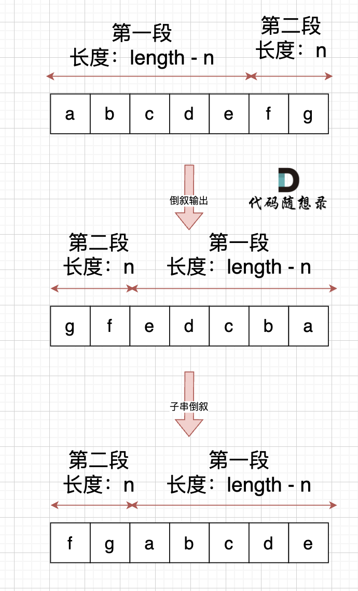

# 字符串

# 双指针

## 反转字符串

[leetcode.cn/problems/reverse-string/](https://leetcode.cn/problems/reverse-string/)

> 编写一个函数，其作用是将输入的字符串反转过来。输入字符串以字符数组 `s`​ 的形式给出。
>
> 不要给另外的数组分配额外的空间，你必须**[原地](https://baike.baidu.com/item/%E5%8E%9F%E5%9C%B0%E7%AE%97%E6%B3%95)**​**修改输入数组**、使用 O(1) 的额外空间解决这一问题。

```Java
class Solution {
    public void reverseString(char[] s) {
        int left = 0, right = s.length - 1;

        while (left < right) {
            char temp = s[left];
            s[left] = s[right];
            s[right] = temp;
            left++;
            right--;
        }
    }
}
```

## 反转字符串II

> 给定一个字符串 `s`​ 和一个整数 `k`​，从字符串开头算起，每计数至 `2k`​ 个字符，就反转这 `2k`​ 字符中的前 `k`​ 个字符。
>
> * 如果剩余字符少于 `k`​ 个，则将剩余字符全部反转。
> * 如果剩余字符小于 `2k`​ 但大于或等于 `k`​ 个，则反转前 `k`​ 个字符，其余字符保持原样。

```Java
class Solution {
    public String reverseStr(String s, int k) {
        char[] c = s.toCharArray();
        for (int i = 0; i < s.length(); i += 2 * k) {
            // 每次翻转[i, i + k)
            if (i + k <= s.length()) { // 注意写 < 还是 <=
                reverse(c, i, i + k);
                continue;
            }
            // 如果最后不足k个字符
            reverse(c, i, s.length());
        }
        return new String(c);	// 注意字符数组转字符串的方式
    }

    private void reverse(char[] c, int left, int right) {
        right--;
        while (left < right) {
            char temp = c[left];
            c[left] = c[right];
            c[right] = temp;
            left++;
            right--;
        }
    }
}
```

## 替换数字

> 给定一个字符串 *s*，它包含小写字母和数字字符，请编写一个函数，将字符串中的字母字符保持不变，而将每个数字字符替换为`number`​。
>
> 例如，对于输入字符串 `a1b2c3`​，函数应该将其转换为 `anumberbnumbercnumber`​。
>
> 对于输入字符串 `a5b`​，函数应该将其转换为 `anumberb`​
>
> 输入：一个字符串 s,s 仅包含小写字母和数字字符。
>
> 输出：打印一个新的字符串，其中每个数字字符都被替换为了`number`​
>
> 样例输入：`a1b2c3`​
>
> 样例输出：`anumberbnumbercnumber`​
>
> 数据范围：1 \<\= s.length \< 10000。

**数组填充类：先预先给数组扩容带填充后的大小，然后在从后向前进行操作**

1. 扩充数组到每个数字字符替换成`number`​之后的大小
2. 从后向前替换数字字符：双指针法

    1. *i* 指向新长度的末尾
    2. *j* 指向旧长度的末尾

```Java
import java.util.Scanner;

public class Main {
    private static Scanner sc;
    private static final String NUMBER = "number";
    public static void main(String[] args) {
        sc = new Scanner(System.in);
        String s = sc.nextLine();
        Main m = new Main();
        String result = m.convertDigitToNumber(s);
        System.out.println(result);
        sc.close();
    }
  
    private String convertDigitToNumber(String s) {
        int length = 0;
        for (int i = 0, size = s.length(); i < size; i++) {
            if (Character.isDigit(s.charAt(i))) {
                length += 6;
            } else {
                length += 1;
            }
        }
        char[] res = new char[length];
  
        for (int i = s.length() - 1, j = length - 1; i >= 0; i--) {
            if (Character.isDigit(s.charAt(i))) {
                for (int k = 5; k >= 0; k--) {
                    res[j] = NUMBER.charAt(k);
                    j--;
                }
            } else {
                res[j] = s.charAt(i);
                j--;
            }
        }
        return new String(res);
    }
}
```

在Java中这种方式的优点不明显，但是在其他语言中：

1. 不用申请新数组。
2. 从后向前填充元素，避免了从前向后填充元素时，每次添加元素都要将添加元素之后的所有元素向后移动的问题。

Java 也可以直接使用`StringBuilder`​。

## 反转字符串中的单词

[leetcode.cn/problems/reverse-words-in-a-string/description/](https://leetcode.cn/problems/reverse-words-in-a-string/description/)

> 给你一个字符串 `s`​ ，请你反转字符串中 **单词** 的顺序。
>
> **单词** 是由非空格字符组成的字符串。`s`​ 中使用至少一个空格将字符串中的 **单词** 分隔开。
>
> 返回 **单词** 顺序颠倒且 **单词** 之间用单个空格连接的结果字符串。
>
> **注意：** 输入字符串 `s`​中可能会存在前导空格、尾随空格或者单词间的多个空格。返回	的结果字符串中，单词间应当仅用单个空格分隔，且不包含任何额外的空格。

1. 双指针删除空格
2. 字符串整体反转
3. 每个单词反转

    1. 根据空格界定单词范围
    2. 双指针反转

```Java
class Solution {
    public String reverseWords(String s) {
        char[] c = s.toCharArray();

        // 删除多余空格，注意，每个单词之间要保留一个空格！
        int slow = 0, fast = 0;
        while (fast < c.length) {
            if (c[fast] != ' ') {
                if (slow != 0) {
                    c[slow++] = ' ';
                }
                while (fast < c.length && c[fast] != ' ') {
                    c[slow++] = c[fast++];
                }
            } else {
                fast++;
            }
        }  
        // 此时slow即为字符串新的长度

        // 整体反转字符串
        reverse(c, 0, slow);

        // 各自反转单词
        int left = 0, right = 0;
        while (left < slow) {
            while (right < slow && c[right] != ' ') {
                right++;
            }
            // 停止条件：1. right == slow  2. c[right] == ' '
            reverse(c, left, right);
            right++;
            left = right;
        }

        return new String(c, 0, slow);
    }

    // [left, right)
    private void reverse(char[] c, int left, int right) {
        int i = left, j = right - 1;
        while (i < j) {
            char temp = c[i];
            c[i] = c[j];
            c[j] = temp;
            i++;
            j--;
        }
    }
}
```

## 右旋字符串

> 字符串的右旋转操作是：把字符串尾部的若干个字符转移到字符串的前面。给定一个字符串 s 和一个正整数 k，将字符串中的后面 k 个字符移到字符串的前面，实现字符串的右旋转操作。
>
> 例如，对于输入字符串 "abcdefg" 和整数 2，函数应该将其转换为 "fgabcde"。

相当于字符串循环右移 k 位。可以整体反转后再局部反转

1. 整个字符串倒序
2. 根据k将字符串分为两个部分，将各个部分各自反转

​​

```Java
import java.util.Scanner;

public class Main {
    private static final Scanner sc = new Scanner(System.in);
  
    public static void main(String[] args) {
        int k = Integer.parseInt(sc.nextLine());
        String s = sc.nextLine();
  
        Main m = new Main();
        String result = m.reverseStr(k, s);
        System.out.println(result);
        sc.close();
    }
  
    private String reverseStr(int k, String s) {
        char[] cs = s.toCharArray();
        reverseRange(cs, 0, cs.length);
        reverseRange(cs, 0, k);
        reverseRange(cs, k, cs.length);
        return new String(cs);
    }
  
    private void reverseRange(char[] cs, int left, int right) {
        for (int i = left, j = right - 1; i < j; i++, j--) {
            char temp = cs[i];
            cs[i] = cs[j];
            cs[j] = temp;
        }
    }
}
```

# 字符串匹配

## KMP

> 给定一个 haystack 字符串和一个 needle 字符串，在 haystack 字符串中找出 needle 字符串出现的第一个位置 (从0开始)。如果不存在，则返回  -1。
>
> 示例 1: 输入: haystack \= "hello", needle \= "ll" 输出: 2
>
> 示例 2: 输入: haystack \= "aaaaa", needle \= "bba" 输出: -1

### 核心思路

**当出现字符串不匹配时，可以记录一部分之前已经匹配的文本内容，利用这些信息避免从头再去做匹配**

```vim
文本串：aabaabaaf
模式串：aabaaf
```

1. 先匹配 aabaab <- aabaaf，匹配失败
2. 下一次匹配从 aa(b)aa 开始
3. 这个()位置的确定，就是由**最长相等前后缀**决定的

    1. 设开始匹配的位置为`i`​，匹配失败的位置为`j`​，则文本串`[i, j)`​的子串都能和模式串`[0, j - i)`​的子串匹配
    2. 也就是文本串`[i, j)`​的任意前缀，肯定和模式串`[0, j - i)`​有匹配的前缀；后缀也是同理（因为这两者就是相等的）
    3. 于是找到模式串`[0, j - i)`​的**最长相等前后缀**（不存在长度则为0），如果非空，那么无论是前缀还是后缀，都能在文本串中有匹配子串（相当于把前缀挪到后缀的位置）

        1. 当匹配到这个位置的时候，如果存在最长相等前后缀，那么一定可以利用
    4. 能够证明，除了前缀和后缀位置，其他位置不可能与文本串实现完全匹配（可以局部匹配，但是不可能全部匹配）
    5. 所以下一次匹配，就让模式串从第三步中找到的后缀位置开始匹配即可

### 前缀表

* 前缀：包含首字母，不包含尾字母的所有连续子串
* 后缀：不包含首字母，包含尾字母的所有连续子串

如何求最长相等前后缀？——使用前缀表

```vim
例：寻找aabaaf的最长相等前后缀
a			0
aa a-a		1
aab 		0
aaba a-a	1
aabaa aa-aa	2
aabaaf		0

使用前缀表进行匹配
a a b a a f
0 1 0 1 2 0 -> next[]
如当匹配到f时，发现不匹配，则寻找f之前的子串（aabaa）的最长相等前后缀（为2）
即在子串后缀的后一位不匹配，找到与后缀相等的前缀的后一位继续匹配
a a b a a f
          |
->    a a b a a f

如何找到前缀的后一位？
即aabaa的最长相等前后缀的长度（要跳到前缀的后面 -> 获得前缀的后面一位的下标，即前缀的长度）
```

### next数组不同的实现方式

```vim
1. 不处理next[]
aabaabaaf
	 |
aabaaf
010120
->
aabaabaaf
   aabaaf
当匹配到f时，需要找到next[]中，f对应位置的前一位来进行跳转

2. next[]数组所有元素后移一位
   a a b a a f
-1 1 0 1 0 1 2
当匹配到f时，直接取next[]中f对应的位置进行跳转即可

3. next[]数组所有元素值-1
a  a  b a a  f
-1 0 -1 0 1 -1
当匹配到f时，需要找到next[]中，f对应位置的前一位，并+1来进行跳转
这种写法可以优化next[]的初始化，因为要确保在不右移的情况下[0]为-1，避免在[0]一直回退到[0]导致死循环

求next数组：
void getNext(int[] next, string s)
{
	初始化
	int i		指向后缀末尾位置
	int j = 0	指向前缀末尾位置，以及i之前（包括i）的子串的最长相等前后缀的长度
	next[0] = 0

	for (i = 1; i < s.size(); i++)
	{
		前缀末尾和后缀末尾不相同（j > 0: 初始位置不进行回退）
		while (j > 0 && s[i] != s[j])
		{
			j应该向前回退，去找更小长度的前缀（其实就是一个KMP匹配的递归，文本串为后缀，模式串为前缀）
			j要看next[]中前一位的值作为下标，进行跳转（循环不变量）
			而且这是一个连续回退的过程，要写while
			j = next[j - 1]
		}

		前后缀相同
		if (s[i] == s[j])
		{
			j++		j指向前缀末尾位置，以及i之前（包括i）的子串的最长相等前后缀的长度
		}
		更新next
		next[i] = j
	}
}
```

### 实现

```Java
/**
 * @Author: Zephyrtoria
 * @CreateTime: 2024-10-15
 * @Description: https://leetcode.cn/problems/find-the-index-of-the-first-occurrence-in-a-string/
 * @Version: 1.0
 */
public class Solution {
    private int[] next;

	// 匹配字符串
    public int strStr(String haystack, String needle) {
        getNext(needle);
        int i = 0, j = 0;
        while (i < haystack.length()) {
            if (j > 0 && haystack.charAt(i) != needle.charAt(j)) {
                j = next[j - 1];
                continue;
            } else if (haystack.charAt(i) == needle.charAt(j)) {
                j++;
            }
            if (j == needle.length()) {
                return i - j + 1;
            }
            i++;
        }
        return -1;
    }

	// 获取next[]
    private void getNext(String s) {
        int len = s.length();
        next = new int[len];

        int i, j = 0;
        next[0] = 0;
        for (i = 1; i < len; i++) {
            while (j > 0 && s.charAt(j) != s.charAt(i)) {
                j = next[j - 1];
            }
            if (s.charAt(j) == s.charAt(i)) {
                j++;
            }
            next[i] = j;
        }
    }
}

```

## 重复的子字符串

[leetcode.cn/problems/repeated-substring-pattern/](https://leetcode.cn/problems/repeated-substring-pattern/)

> 给定一个非空的字符串 `s`​ ，检查是否可以通过由它的一个子串重复多次构成。

### 移动匹配

如果`s`​可有重复的子字符串组成，那么它必然存在一组相同的前缀`m`​和后缀`n`​，而且这个`m`​和`n`​可以拼接成`s`​

1. 令`t = s + s`​（就是拼接`m`​和`n`​的过程）
2. 注意要先去掉t[0]和t[-1]（避免搜出原字符串）
3. 在`t`​中搜索`s`​

    如果能在`t`​中到`s`​，说明`s`​可由重复的子字符串组成

```Java
class Solution {
    public boolean repeatedSubstringPattern(String s) {
        String ss = s.substring(1) + s.substring(0, s.length() - 1);
        if (ss.contains(s)) {
            return true;
        }
        return false;
    }
}
```

### KMP

```vim
abababab

ab ab ab __		前缀
| \| \| \|
__ ab ab ab		后缀

所以最小单位为：ab
求出next[]
求出最小单位长度：len - max(next[])
判断原字符串长度能否被最小单位长度整除
```

如果`s`​由重复子串组成，那么组成`s`​的最小单位就是**最长相等前后缀**不包含的那一部分

```Java
class Solution {
    private int[] next;

    public boolean repeatedSubstringPattern(String s) {
        getNext(s);
        int unitLen = s.length() - next[s.length() - 1];
		// 最长相等前后缀存在，且字符串长度是最小单位的整数倍
        return next[s.length() - 1] != 0 && s.length() % unitLen == 0;
    }

    private void getNext(String pat) {
        next = new int[pat.length()];
        next[0] = 0;

        int j = 0;
        for (int i = 1; i < pat.length(); i++) {
            while (j > 0 && pat.charAt(i) != pat.charAt(j)) {
                j = next[j - 1];
            }
            if (pat.charAt(i) == pat.charAt(j)) {
                j++;
            }
            next[i] = j;
        }
    }
}
```

## 正则表达式匹配

## 语句压缩

> 你有一个句子，这个句子由 n 个仅由英文字母和数字组成的单词构成。但是你认为这个句子太长了，想把这个句子按照以下方式压缩成一个单词：
>
> 每一次取出句子中当前位于最左边的两个单词，如果能在第二个单词中找到一个前缀，使得这个前缀是第一个单词的一个后缀，那么就删去第二个单词中**最长**的满足这个条件的前缀后与第一个单词连接，找不到则直接与第一个单词连接，最后将得到的单词放回句子的最左边，直到这个句子中只剩下一个单词。
>
> 给出这个句子，输出对其进行压缩后得到的句子中仅剩的一个单词。

> 样例

Input

```plaintext
5
I want to order pizza
```

Output

```plaintext
Iwantorderpizza
```

Input

```plaintext
5
sample please ease in out
```

Output

```plaintext
sampleaseinout
```

> 使用KMP的思想来求最长相同前后缀长度

1. 交换两个字符串位置
2. 利用next数组来求得最长相等前后缀
3. 更新result

```cpp
#include <bits/stdc++.h>
using namespace std;

const int N = 1000010;
int n;
string s[N];

int getMaxLength(string& str) {
    int size = str.size();
    int* next = new int[size];

    next[0] = 0;
    int j = 0;
    for (int i = 1; i < size; i++) {
        while (j > 0 && str[i] != str[j]) {
            j = next[j - 1];
        }
        if (str[i] == str[j]) {
            j++;
        }
        next[i] = j;
    }
    return next[size - 1];
}

string solve() {
    string result = s[0];
    for (int i = 1; i < n; i++) {
        // aaa#aaa 主动添加井号来分隔两个字符串
        // result只需要比较添加的字符串长度范围
        string temp;
        if (result.size() < s[i].size()) {
            temp = s[i] + "#" + result;
        } else {
            temp = s[i] + "#" + result.substr(result.size() - s[i].size());
        }
        int next = getMaxLength(temp);
        result += s[i].substr(next);
    }
    return result;
}

int main(void) {
    cin >> n;
    for (int i = 0; i < n; i++) {
        cin >> s[i];
    }
    cout << solve() << endl;
    return 0;
}
```

‍
