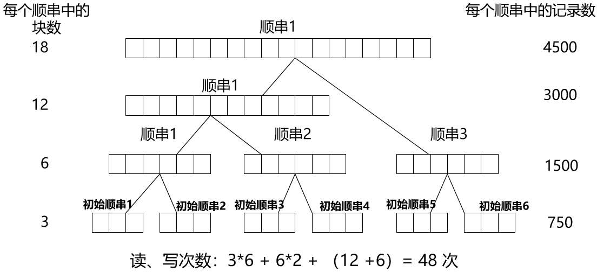

# 排序

# 排序

> 分类

* 内部排序：排序期间全部结点都存放在内存，并在内存中调整等待排序的结点的存放位置

  * 插入类

    * 插入排序
    * 希尔排序
  * 交换类

    * 冒泡排序
    * 快速排序
  * 选择类

    * 选择排序
    * 堆排序
  * 归并类

    * 归并排序
  * 分配类：不需要进行关键字之间的比较

    * 基数排序
    * 桶排序
* 外部排序：排序期间大部分结点存放在外存中，排序过程借助内存，调整那些存放在外存、等待排序的结点的存放位置

> 算法复杂度

|排序算法|平均时间<br />复杂度|最坏时间<br />复杂度|最好时间<br />复杂度|空间<br />复杂度|稳定性|算法思想|
| ------------| --------------| --------------| --------------| ----------| ------| ----------------------------------------------------------------------------------|
|冒泡排序|O(n2)|O(n2)|O(n)|O（1）|稳定|两两比较，位置不正确则交换。直到某次比较不发生交换， 可以用于单链表|
|简单选择<br />排序|O(n2)|O(n2)|O(n2)|O（1）|不稳定|选当前序列中最小的结点，和序列中的第一个交换。（未排序序列向后逐渐缩小）|
|插入排序|O(n2)|O(n2)|O(n)|O（1）|稳定|假设前面的序列已排序，后面的结点依次插入到正确的位置。（已排序序列向后逐渐扩大。）|
|希尔排序|取决于增量序列|O(n2)|O(n)|O（1）|不稳定|插入排序的扩展|
|归并排序|O (nlog2n)|O (nlog2n)|O (nlog2n)|O(n)|稳定||
|快速排序|O (nlog2n)|O(n2)|O (nlog2n)|O (1)|不稳定|注：此处空间复杂度不考虑递归调用堆栈的空间|
|堆排序|O (nlog2n)|O (nlog2n)|O (n)|O（1）|不稳定||
|基数排序|O（d*n）|O（d*n）|O（d*n）|O（r*d）|稳定|分配类|

> 稳定的排序和不稳定的排序

若序列中关键字值相等的结点经过某种排序方法进行排序之后，仍能保持它们在排序前的相对顺序，则称这种排序方法是**稳定**的；否则，称这种排序方法是不稳定的。

# 插入排序

基本思想:将一个记录插入到已排好顺序的序列中，形成一个新的、记录数增 1 的有序序列。折半插入排序和希尔排序是直接插入排序的两种改进。

## 直接插入排序

‍

## 折半插入排序

对直接插入排序的一种改进。当待排序序列较长时，如果采用折半查找的方法，可以更快地寻找插入位置，减少关键码的比较次数。

折半插入排序虽然可以减少关键码的比较次数，但是并不减少排序元素的移动次数。比较次数为 O(nlogn)，移动次数为 O(n^2)

## 希尔排序

在插入排序时，比较相邻的结点，一次比较最多把结点移动一个位置。如果对位置相隔较大距离的结点进行比较和插入，使得结点在比较后能够一次跨过较大的距离。这样处理可以把值较小的结点尽快往前移动。

# 堆排序

将待排序的记录看成是一个**完全二叉树**的顺序存储结构，利用完全二叉树中双亲结点和子结点之间的关系，在当前无序的序列中选择关键字最大（或最小）的记录。

> 堆（大根堆）的定义

* 假设二叉树 T 是一棵完全二叉树，如果树 T 中的任一结点的值**不小于**它的左子结点的值（如果左子结点存在），且**不小于**它的右子结点的值（如果右子结点存在），那么我们称树 T 是一个堆（heap）

  * 大根堆（大顶堆）：堆顶（根）元素是序列中 n 个元素的最大值
  * 小根堆（小顶堆）：堆顶（根）元素是序列中 n 个元素的最小值

允许有重复元素存在

# 选择排序

# 冒泡排序

# 桶排序

# 快速排序

思想：分治。把序列分成两部分（Partition）。

取待排序的结点序列中某个结点的值作为控制值（pivot,也称作 枢轴，支点），采用某种方法把这个结点放到适当的位置，并使得这个位置的前面的所有结点的值都**小于等于**这个控制值，后面的所有结点的值都**大于**这个控制值。接着再将这两部分独立排序。

引人注目的特点：

1. 只需要很少的辅助空间（原地排序）
2. 将长度为 N 的序列排序所需要的时间和 NlgN 成正比。

序列拆分（Partition）会根据所选轴点将序列拆分成两个子序列，进而确定轴点（pivot）在序列的最终位置。

1. 确定轴点 x：左边界/中间值/右边界/随机值
2. **调整区间**：划分出两个区间，让小于（等于）`x` ​的元素在 x 的一边，大于（等于）`x` ​的在另一边
3. 递归处理左右两端

## 算法复杂度

‍

## 调整区间（假设为升序）

### 暴力做法

1. 创建两个临时数组 `a[]`​,`b[]`​
2. 小于等于 `x` ​的存入 `a`​，大于 `x` ​的存入 `b`​
3. 合并 `a` ​和 `b`​

### 位置交换

1. 定义两个指针（用下标代替）`i` ​和 `j`​，`i` ​指向数组最左端 `l`​；`j` ​指向数组最右端 `r`​
2. 首先，对 `i` ​进行右移，判断 `i` ​所指元素是否小于 `x`​，若满足，则继续右移，直到 `i` ​所指元素大于等于 `x`​，停止移动
3. 接着，对 `j` ​进行左移，判断 `j` ​所指元素是否大于 `x`​，若满足，则继续左移，直到 `j` ​所指元素小于等于 `x`​，停止移动
4. 此时，交换 `i` ​和 `j` ​所指元素，交换完成后，`i` ​和 `j` ​各向中间移动一位
5. 重复以上步骤，直到 `i` ​和 `j` ​相遇，此时 `i` ​左侧的值一定小于等于 `x`​，`j` ​右侧的值一定大于等于 `x`​

```cpp
#include <iostream>

using namespace std;

const int N = 1e6 + 10;

int n;
int q[N];

void quick_sort(int q[] , int l, int r)
{
    if (l >= r)  //写成l == r也可以
        return;

    int i = l - 1, j = r + 1, x = q[l + r >> 1];
    while (i < j)
    {
        do i++; while (q[i] < x);
        do j--; while (q[j] > x);
        if (i < j) swap(q[i],q[j]);
    }
    quick_sort(q, l, j), quick_sort(q, j + 1, r);  //j->i-1,j+1->i
}
```

## 快速选择 O(n) 第 k 个数

​​

进行第一次排序后，可以通过判断 k 与左右部分的长度来判断第 k 大的数在左部分还是在右部分

1. k <= SL 递归 Left
2. k > SL 递归 Right，且 k = k - SL

```cpp
int quick_sort(int l, int r, int k)
{
    if (l == r) return q[l];

    int x = q[l + r >> 1], i = l - 1, j = r + 1;
    while (i < j)
    {
        do i++; while (q[i] < x);
        do j--; while (q[j] > x);
        if (i < j) swap(q[i],q[j]);
    }

    int sl = j - l + 1;  //+1视k从0开始还是1开始
    if (k <= sl) return quick_sort(l, j, k);  //k与sl进行比较，因为应该比较的是当前分治的范围
    return quick_sort(j + 1, r, k - sl);

}
```

# 归并排序

* 自顶向下：将序列拆分直到有序；然后使用归并算法得到排序结果。
* 自底向上：将序列看成多条有序子序列，并将子序列两两合并。

## 模板

## 逆序对的数量

<span data-type="text" id="">逆序对的数量</span>

# 基数排序

<span data-type="text" id="">MSD Radix Sort</span>

<span data-type="text" id="">LSD Radix Sort</span>

基数排序（ RADIX SORT ），通常的两种方法：

* 最高位优先排序（Most Significant Digit First, MSD）

  * 首先按关键词最高位排序，结果得到若干子序列。
  * 接着对每个子序列按关键字次高位排序。
  * 重复上述过程
* 最低位优先排序（Least Significant Digit First, LSD）

  * 首先按关键词最低位的值的大小把结点序列分成若干个子序列，再从小到大依次把各个子序列收集起来，产生一个新序列。
  * 对新的结点序列按次最低位，接着对每个堆按关键字次高位进行分配和收集。
  * 重复上述过程，最后可以得到排好序的结点序列

# 外部排序

待排序的记录数量大，无法一次性载入内存，整个排序过程必须借用外存分批读入内存。

1. 使用**置换-选择**排序产生 $m$ 个初始归并段（或称顺串，run，即有序子序列）
2. 根据归并路数 $k$ 和初始顺串数 $m$，根据**最佳归并树**确定归并方案
3. 使用 **k-路平衡归并**完成若干次归并

例：设有一个文件，内含4500个记录：A1，A2，…， A4500，现在要对该文件进行排序，但可占用的内存空间至多只能对750个记录进行排序。输入文件(被排序的文件)放在磁盘上，页块长为250个记录。

1. 首先每次对750条记录进行排序，得到6个顺串，并存放到磁盘上
2. 将可使用的内存空间分为3个页快，其中两个页块作为输入缓冲区，另一个页块用作输出缓冲区
3. 对顺串R1、R2进行合并：把每一个顺串的第一个页块读入输入缓冲区，从两个输入缓冲区的头部开始逐步比较记录中待排关键字的大小，将小的记录送入输出缓冲区

    1. 输出缓冲区被写满，则写入磁盘
    2. 输入缓冲区的数据被处理完，就把同一顺串中的下一页读入。

一遍扫描：文件中每一条记录被读、写一次（即从磁盘上读入内存一次和从内存写到磁盘一次），并在内存中参加一次归并

​​

$$
外部排序总时间= 产生初始归并段的时间(m*t_{IS})+外存信息读写时间(d*t_{IO})+内部归并所需时间(s*ut_{mg})
$$

* $u$：总的参加归并排序的记录的个数
* $m$：经过内部排序以后得到的初始顺串的个数
* $s$：归并的趟数
* $d$：读写外存的次数
* $t_{IS}$：由内部排序算法决定
* $ut_{mg}$：归并排序算法决定
* $t_{IO}$：值取决于外存设备，一般远大于tIS和tmg

> 改进

1. 增加归并段的个数 $k$——多路平衡归并

2. 减少初始归并段的个数 $m$——“置换-选择”算法（产生比内存可同时处理的记录数更长的初始顺串）

## 多路平衡归并

### 败者树

‍

## 置换-选择排序

1. 从输入文件读取记录到输入缓冲区；在工作区放入待排序的记录
2. 选择关键字最小的记录，记为MINIMAX
3. 将MINIMAX输出到输出缓冲区
4. 若输入缓冲区不空，从输入缓冲区读入下一个记录到工作区
5. 从工作区中所有关键字比MINIMAX大的记录中选出最小关键字记录，作为新的MINIMAX记录
6. 重复（3）-（5）直至工作区中选不出新的MINIMAX。到此得到一个初始归并段
7. 重复（2）-（6），直至输入文件处理完毕。
