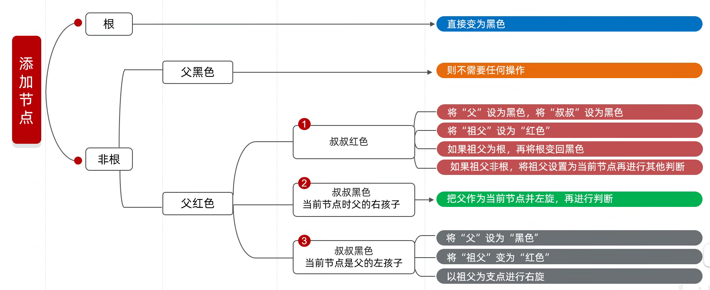

# 搜索

# 二叉搜索树

## 概念

二叉搜索树是一个有序树

* 若它的左子树不空，则左子树上所有结点的值均**小于**它的根结点的值
* 若它的右子树不空，则右子树上所有结点的值均**大于**它的根结点的值
* 它的左、右子树也分别为二叉排序树

或

* 对于一棵给定的二叉树，如果树中的结点的中序是排好序的，那么我们称该树是一棵二叉搜索树

​​

## 查找效率

假定 $k$ 在查找树中，查找 $k$ 所需要的比较次数：**从根结点到结点 k 的树枝长度** **$\lambda (k) + 1$**，因此，可以得到：

$$
MAX(二叉查找法)= max\{1+\lambda (k)|树T中的k\}
$$

$$
AVG(二叉查找法)=∑_{kofT}P(k)(1+λ(k))\ \ (P(k)为k的相对使用概率)
$$

若对于所有 $k$，它们的相对使用概率均相等，则有

$$
AVG(二叉查找法)=\frac{1}{n}∑_{kofT}(1+λ(k))
$$

显然，当树中结点尽量靠近树根时，$AVG(二叉查找法)$ 的值达到最小。当查找树退化成链接表时，$AVG$ 的值达到最大

### 最大查找时间

在查找树中，查找结点的最大查找时间：

* 最坏情况：树退化成链，$O(n)$
* 最好情况：除了最后一层，树满 $O（log_2n）$

为了使最大查找时间、平均查找时间达到最小，应使从根到其他结点的路径尽量短

### 特殊查找树

设二叉树 T 有 n 个结点，$i=⌊log_2(n+1)⌋，r=n-(2^i-1)$。

如果其中 $(2^i-1)$ 个结点放满第 $1$ 至 第 $i$ 层。

* 若 $r=0$，则树 $T$ 是一棵**完美二叉树**
* 若 $r>0$，且剩下的 $r$ 个结点**尽量靠左**地排列在第 $i+1$ 层上，则树 $T$ 是一棵**完全二叉树**
* 若 $r>0$，且剩下的 $r$ 个结点**随意分布**在第 $i+1$ 层，则称树 $T$ 是一棵**丰满二叉树**

若 $T$ 同时也是查找树，则称树 $T$ 是完美查找树、完全二叉查找树、丰满查找树

> 完美查找树

​​

> 完全二叉查找树

​​

> 丰满查找树

​​

### 查找次数

对于 $n$ 个结点的丰满查找树，如果树中所有结点都具有相同的使用概率 $1/n$

#### 丰满查找树

如果考虑所有结点的相对使用概率相等，则三种特殊查找树的平均查找次数相同，以丰满查找树为代表

$$
AVG(二叉查找法)=\frac{1}{n}∑_{kofT}(1+λk)\approx log_2n
$$

且当查找树未退化成线性链表时，有：

$$
MAX(二叉查找法)=log_2n
$$

### 退化成链表

$$
AVG(二叉查找法)=\frac{n+1}{2}
$$

$$
MAX(二叉查找法)=n
$$

## 二叉搜索树搜索

> 给定二叉搜索树（BST）的根节点 `root`​ 和一个整数值 `val`​。
>
> 你需要在 BST 中找到节点值等于 `val`​ 的节点。 返回以该节点为根的子树。 如果节点不存在，则返回 `null`​ 。

### 递归法

1. 当前值等于目标值：返回结果
2. 当前值小于目标值：递归右子树
3. 当前值大于目标值：递归左子树

```Java
class Solution {
    public TreeNode searchBST(TreeNode root, int val) {
        if (root == null) {
            return null;
        }
        if (root.val == val) {
            return root;
        } else if (root.val < val) {
            return searchBST(root.right, val);
        } else {
            return searchBST(root.left, val);
        }
    }
}
```

### 迭代法

```Java
class Solution {
    public TreeNode searchBST(TreeNode root, int val) {
        TreeNode cur = root;
        while (cur != null) {
            if (cur.val == val) {
                break;
            } else if (cur.val < val) {
                cur = cur.right;
            } else {
                cur = cur.left;
            }
        }
        return cur;
    }
}
```

## 插入结点

### 二叉搜索树中的插入操作

[leetcode.cn/problems/insert-into-a-binary-search-tree/descriptio...](https://leetcode.cn/problems/insert-into-a-binary-search-tree/description/)

> 给定二叉搜索树（BST）的根节点 `root`​ 和要插入树中的值 `value`​ ，将值插入二叉搜索树。 返回插入后二叉搜索树的根节点。 输入数据 **保证** ，新值和原始二叉搜索树中的任意节点值都不同。
>
> **注意**，可能存在多种有效的插入方式，只要树在插入后仍保持为二叉搜索树即可。 你可以返回 **任意有效的结果** 。

* 如果不考虑维持树的平衡，直接插入到搜索的终点即可
* 考虑树的平衡，则需要实现平衡树

以下不考虑树的平衡，直接根据二叉搜索树的性质进行插入

```Java
class Solution {
    public TreeNode insertIntoBST(TreeNode root, int val) {
        return insert(root, val);
    }

    private TreeNode insert(TreeNode root, int val) {
        if (root == null) {     // 找到插入结点位置
            return new TreeNode(val);
        }

        if (root.val > val) {
            root.left = insert(root.left, val);
        } else if (root.val < val) {
            root.right = insert(root.right, val);
        }
        return root;
    }
}
```

## 删除结点

### 删除二叉搜索树中的结点

[leetcode.cn/problems/delete-node-in-a-bst/description/](https://leetcode.cn/problems/delete-node-in-a-bst/description/)

> 给定一个二叉搜索树的根节点 **root**  和一个值 **key**，删除二叉搜索树中的 **key** 对应的节点，并保证二叉搜索树的性质不变。返回二叉搜索树（有可能被更新）的根节点的引用。
>
> 一般来说，删除节点可分为两个步骤：
>
> 1. 首先找到需要删除的节点；
> 2. 如果找到了，删除它。

1. 没有找到要删除的结点

   1. 继续递归，或走到 `null`​ ​返回
2. 左空，右空（叶子结点）

   1. 直接删除即可
3. 左非空，右空

   1. 父结点指向左子结点
4. 左空，右非空

   1. 父结点指向右子结点

   ​​
5. 左非空，右非空：有多种实现方法

   1. 左孩子或右孩子继位（会有不同的连法）

      假设是右孩子继位

      1. 删除父结点后，需要为父结点的左子树寻找新的父结点
      2. 可以令右孩子的左孩子（一直向左，最左的左孩子）成为左子树的父结点（因为在大小上是距离最近的）
      3. 将左子树移到右孩子的左孩子下方
   2. 使左子树的最大结点继位；使右子树的最小结点继位

      ​​

已经包含了删除 root 的情况​​

```Java
class Solution {
    public TreeNode deleteNode(TreeNode root, int key) {
        return delete(root, key);
    }

    private TreeNode delete(TreeNode root, int key) {
        if (root == null) {     // 没有找到需要删除的结点
            return null;
        }
        if (root.val == key) {  // 找到要删除的结点
            if (root.left == null && root.right == null) {  // 左空右空
                return null;    // 将父结点的子结点变为null
            } else if (root.left == null && root.right != null) {   // 左空右不空
                return root.right;
            } else if (root.left != null && root.right == null) {   // 左不空右空
                return root.left;
            } else {    // 左不空右不空，令右孩子继位
                TreeNode cur = root.right;
                while (cur.left != null) {
                    cur = cur.left;
                }
                cur.left = root.left;   // 变成了左空右不空
                return root.right;
            }
        } 
        // 递归找要删除的结点
        if (root.val < key) {
            root.right = delete(root.right, key);
        } else {
            root.left = delete(root.left, key);
        }
        return root;
    }
}
```

### 修剪二叉搜索树

[leetcode.cn/problems/trim-a-binary-search-tree/description/](https://leetcode.cn/problems/trim-a-binary-search-tree/description/)

> 给你二叉搜索树的根节点 `root`​ ，同时给定最小边界 `low`​ 和最大边界 `high`​。通过修剪二叉搜索树，使得所有节点的值在 `[low, high]` ​中。修剪树 **不应该** 改变保留在树中的元素的相对结构 (即，如果没有被移除，原有的父代子代关系都应当保留)。 可以证明，存在 **唯一的答案** 。
>
> 所以结果应当返回修剪好的二叉搜索树的新的根节点。注意，根节点可能会根据给定的边界发生改变。

```Java
class Solution {
    public TreeNode trimBST(TreeNode root, int low, int high) {
        return traversal(root, low, high);
    }

    private TreeNode traversal(TreeNode root, int low, int high) {
        if (root == null) {
            return null;
        }
        if (root.val < low) {   // 小于最小边界，要注意root的右子树可能还有结点不需要被删除
            return traversal(root.right, low, high);
        } else if (root.val > high) {   // 大于最大边界，root的左子树中可能还有结点不需要被删除
            return traversal(root.left, low, high);
        }
  
        root.left = traversal(root.left, low, high);	// 返回处理完毕后的左子树的根结点
        root.right = traversal(root.right, low, high);	// 返回处理完毕后的右子树的根结点
        return root;
    }
}
```

## 构造/转换树

### 将有序数组转换为二叉搜索树

[leetcode.cn/problems/convert-sorted-array-to-binary-search-tree/...](https://leetcode.cn/problems/convert-sorted-array-to-binary-search-tree/description/)

> 给你一个整数数组 `nums`​ ，其中元素已经按 **升序** 排列，请你将其转换为一棵**平衡二叉搜索树**。

因为已经升序排好了，所以直接二分进行构建即可

```Java
class Solution {
    public TreeNode sortedArrayToBST(int[] nums) {
        return halfBuild(nums, 0, nums.length - 1);
    }

    private TreeNode halfBuild(int[] nums, int left, int right) {
        if (left > right) {
            return null;
        }
        int mid = (left + right) / 2;
        TreeNode root = new TreeNode(nums[mid]);
        root.left = halfBuild(nums, left, mid - 1);
        root.right = halfBuild(nums, mid + 1, right);
        return root;
    }
}
```

### 把二叉搜索树转换为累加树

[leetcode.cn/problems/convert-bst-to-greater-tree/description/](https://leetcode.cn/problems/convert-bst-to-greater-tree/description/)

> 给出二叉  **搜索**  树的根节点，该树的节点值各不相同，请你将其转换为累加树（Greater Sum Tree），使每个节点 `node`​ 的新值等于原树中大于或等于 `node.val`​ 的值之和。

* 以**右根左**的后序遍历顺序进行遍历
* 记录总和

  * 定义全局变量
  * 用双指针

#### 全局变量解法

```Java
class Solution {
    private int sum;

    public TreeNode convertBST(TreeNode root) {
        sum = 0;
        return traversal(root);
    }

    private TreeNode traversal(TreeNode cur) {
        if (cur == null) {
            return null;
        }
  
        TreeNode root = new TreeNode();
        root.right = traversal(cur.right);
        sum += cur.val;
        root.val = sum;
        root.left = traversal(cur.left);
        return root;
    }
}
```

#### 双指针解法

```Java
class Solution {
    private TreeNode pre;
    public TreeNode convertBST(TreeNode root) {
        pre = null;
        return traversal(root);
    }

    private TreeNode traversal(TreeNode cur) {
        if (cur == null) {
            return null;
        }
  
        TreeNode root = new TreeNode(cur.val);
        root.right = traversal(cur.right);
        if (pre != null) {
            root.val += pre.val;
        }
        pre = root;
        root.left = traversal(cur.left);
        return root;
    }
}
```

## 双指针

### 验证二叉搜索树

[leetcode.cn/problems/validate-binary-search-tree/description/](https://leetcode.cn/problems/validate-binary-search-tree/description/)

> 给你一个二叉树的根节点 `root`​ ，判断其是否是一个有效的二叉搜索树。
>
> **有效** 二叉搜索树定义如下：
>
> * 节点的左子树
>
>   只包含  **小于**  当前节点的数。
> * 节点的右子树只包含 **大于** 当前节点的数。
> * 所有左子树和右子树自身必须也是二叉搜索树。

空结点也为二叉搜索树

若为二叉搜索树，则使用中序遍历得到的数组是有序的

#### 转化为数组

将中序遍历得到的结果转为数组进行有序判断

```Java
import java.util.ArrayList;
class Solution {
    private ArrayList<Integer> vec;
    public boolean isValidBST(TreeNode root) {
        vec = new ArrayList<>();
        inorder(root);
        for (int i = 1; i < vec.size(); i++) {
            if (vec.get(i - 1) >= vec.get(i)) {
                return false;
            }
        }
        return true;
    }

    private void inorder(TreeNode root) {
        if (root == null) {
            return;
        }
        inorder(root.left);
        vec.add(root.val);
        inorder(root.right);
    }
}
```

#### 在遍历时进行判断

要注意：根结点的值要比左子树的**所有结点**的值大，比右子树**所有节点**的值小

维护一个 `maxVal`​，即已经遍历过的结点中最大的值，因为按照中序遍历，如果是二叉搜索树，那么一定是升序的，`maxVal` ​单调递增
这样当出现一个小于等于 `maxVal` ​的值时，就说明不是二叉搜索树了

```Java
class Solution {
    private long maxVal;
    public boolean isValidBST(TreeNode root) {
        maxVal = Long.MIN_VALUE;    // 已经遍历过的结点中最大的值
        return inorder(root);
    }

    private boolean inorder(TreeNode cur) {
        if (cur == null) {
            return true;
        }
        boolean left = inorder(cur.left);
        if (maxVal < cur.val) {
            maxVal = cur.val;
        } else {
            return false;
        }
        boolean right = inorder(cur.right);
        return left && right;
    }
}
```

#### 双指针优化

上面的方法存在一个问题：现在的数据范围限制在了[Integer.MIN_VALUE， Integer.MAX_VALUE]上，可以使用 Long.MIN_VALUE 来作为 `maxVal` ​的初始值，但是如果数据范围扩展到 Long 的范围，那么就能用这个方法了。优化方法是当前结点和上一个结点进行比较，就不用关心数据范围了

```Java
class Solution {
    private TreeNode pre;   // 记录前一个遍历的结点
    public boolean isValidBST(TreeNode root) {
        pre = null;
        return inorder(root);
    }

    private boolean inorder(TreeNode cur) {
        if (cur == null) {
            return true;
        }

        boolean left = inorder(cur.left);
        if (pre != null && pre.val >= cur.val) {
            return false;
        }
        pre = cur;      // 更新前一个遍历的结点
        boolean right = inorder(cur.right);
        return left && right;
    }
}
```

### 二叉搜索树的最小绝对差

[leetcode.cn/problems/minimum-absolute-difference-in-bst/descript...](https://leetcode.cn/problems/minimum-absolute-difference-in-bst/description/)

> 给你一个二叉搜索树的根节点 `root`​ ，返回 **树中任意两不同节点值之间的最小差值** 。
>
> 差值是一个正数，其数值等于两值之差的绝对值。

* 暴力解法：使用中序遍历转变成数组，再计算相邻结点差值

* 双指针法：保留上一次遍历的结点，直接计算差值即可

```Java
class Solution {
    private TreeNode pre;
    private int result;
    public int minDiffInBST(TreeNode root) {
        pre = null;
        result = Integer.MAX_VALUE;
        inorder(root);
        return result;
    }

    private void inorder(TreeNode cur) {
        if (cur == null) {
            return;
        }
        inorder(cur.left);
        if (pre != null) {
            result = Math.min(result, cur.val - pre.val);
        }
        pre = cur;
        inorder(cur.right);
    }
}
```

### 二叉搜索树中的众数

[leetcode.cn/problems/find-mode-in-binary-search-tree/description...](https://leetcode.cn/problems/find-mode-in-binary-search-tree/description/)

> 给你一个含重复值的二叉搜索树（BST）的根节点 `root`​ ，找出并返回 BST 中的所有 [众数](https://baike.baidu.com/item/%E4%BC%97%E6%95%B0/44796)（即，出现频率最高的元素）。
>
> 如果树中有不止一个众数，可以按 **任意顺序** 返回。
>
> 假定 BST 满足如下定义：
>
> * 结点左子树中所含节点的值 **小于等于** 当前节点的值
> * 结点右子树中所含节点的值 **大于等于** 当前节点的值
> * 左子树和右子树都是二叉搜索树

* 如果没有空间复杂度要求，可以使用 Map 存储

  * 使用双指针优化 Map 存储
* 求频率，和根据频率找数值：需要两次遍历

  * 使用 `clear()` ​可以优化为一次遍历
  * 因为当出现更大的 `maxFreq` ​时，之前存储的结果一定不满足了，直接清空即可

```Java
import java.util.ArrayList;

class Solution {
    private ArrayList<Integer> results;
    private TreeNode pre;
    private int maxFreq;
    private int curFreq;

    public int[] findMode(TreeNode root) {
        results = new ArrayList<>();
        pre = null;
        maxFreq = curFreq = 1;

        inorder(root);
        int[] result = new int[results.size()];

        for (int i = 0; i < result.length; i++) {
            result[i] = results.get(i);
        }
        return result;
    }

    private void inorder(TreeNode cur) {
        if (cur == null) {
            return;
        }
		// 左
        inorder(cur.left);
		// 中
        if (pre != null) {
            if (pre.val == cur.val) {
                curFreq++;
            } else {
                curFreq = 1;
            }
        }
        pre = cur;		// 更新双指针
		// 更新结果集
        if (curFreq == maxFreq) {
            results.add(cur.val);
        } else if (curFreq > maxFreq) {
            results.clear();
            results.add(cur.val);
            maxFreq = curFreq;
        }
      	// 右
        inorder(cur.right);
    }
}
```

### 二叉搜索树的最近公共祖先

[leetcode.cn/problems/lowest-common-ancestor-of-a-binary-search-t...](https://leetcode.cn/problems/lowest-common-ancestor-of-a-binary-search-tree/description/)

> 给定一个二叉搜索树， 找到该树中两个指定节点的最近公共祖先。
>
> [百度百科](https://baike.baidu.com/item/%E6%9C%80%E8%BF%91%E5%85%AC%E5%85%B1%E7%A5%96%E5%85%88/8918834?fr=aladdin)中最近公共祖先的定义为：“对于有根树 T 的两个结点 p、q，最近公共祖先表示为一个结点 x，满足 x 是 p、q 的祖先且 x 的深度尽可能大（**一个节点也可以是它自己的祖先**）。

可以使用<span data-type="text" id="">二叉树的最近公共祖先</span>的写法

利用二叉搜索树的特性：

* 如果 `cur.val > p.val && cur.val > q.val`​：p 和 q 一定在 `cur` ​的左子树上
* 如果 `cur.val < p.val && cur.val < q.val`​：p 和 q 一定在 `cur` ​的右子树上
* 如果 `cur.val < p.val && cur.val > q.val || cur.val > p.val && cur.val < q.val`​：cur 为 p、q 的祖先

#### 递归法

```Java
class Solution {
    public TreeNode lowestCommonAncestor(TreeNode root, TreeNode p, TreeNode q) {
        return findAncestor(root, p, q);
    }

    private TreeNode findAncestor(TreeNode cur, TreeNode p, TreeNode q) {
        if (cur == null || cur == p || cur == q) {
            return cur;
        }

        if (cur.val > p.val && cur.val > q.val) {
            return findAncestor(cur.left, p, q);
        } else if (cur.val < p.val && cur.val < q.val) {
            return findAncestor(cur.right, p, q);
        } else {
            return cur;
        }
    }
}
```

#### 迭代法

```Java
class Solution {
    public TreeNode lowestCommonAncestor(TreeNode root, TreeNode p, TreeNode q) {
        TreeNode cur = root;
        while (cur != null && cur != p && cur != q) {
            if (cur.val > p.val && cur.val > q.val) {
                cur = cur.left;
            } else if (cur.val < p.val && cur.val < q.val) {
                cur = cur.right;
            } else {
                return cur;
            }
        }
        return cur;
    }
}
```

# 平衡二叉搜索树

## 平衡树

对于二叉查找树来说，丰满查找树最为有利。但对于丰满查找树进行结点的插入或删除后，很容易变成非丰满查找树

* 平衡度（平衡因子）：设 $k$ 是二叉树 T 的结点，$T_{kl}$ 和 $T_{kr}$ 分别是结点 $k$ 的左子树和右子树，我们称 $getHeight(T_{kr}) - getHeight(T_{kl})$ 为结点 $k$ 的平衡度。
* 平衡树：如果二叉树 $T$ 中每个结点 $k$ 的**平衡度的绝对值都小于等于 1**（即左子树和右子树的高度最多差 1），那么称 $T$ 是一棵平衡树。

​​

丰满树一定是平衡树，但平衡树不一定是丰满树

### 最小节点数

平衡树的最小结点数：

0. 高度 0：0
1. 高度 1：1
2. 高度 2：1+1+0=2
3. 高度 3：2+1+1=4
4. 高度 4：4+1+2=7
5. 高度 5：7+1+4=12

$$
结点数= 左子树结点数 + 1（根）+ 右子树结点数
$$

不妨设根结点的平衡度为-1，

则 $F(0)=0$，$F(1)=1$,

$$
F(h)=F(h-1)+1+F(h-2)（h>=2）
$$

​​

n 个结点的平衡树，最大高度是多少？<=> 高度为 h 的平衡树，最少有多少个结点？

最稀疏的平衡树，也称为 Fibonacci trees

斐波那契树的节点数加 1，等于斐波那契数列

## 平衡二叉搜索树

如果 T 即是平衡树，又是搜索树，那么称树 T 是平衡搜索树

平衡二叉搜索树：又被称为 AVL（Adelson-Velsky and Landis）树（或 BBT, Balanced Binary Tree），且具有以下性质：

* 是一棵空树或它的左右两个子树的高度差的绝对值不超过 1
* 左右两个子树都是一棵平衡二叉树

### 树的高度

平衡查找树树的高度决定**最坏情况下的查找效率**

$n$ 个结点的平衡树的高度， $h≤1.44log_2(n+2)−0.328$​

### Adelson 插入算法

三个步骤：插入，平衡（检查是否平衡），改组(旋转)

1. 插入：不考虑结点的平衡度，使用在查找树中插入新结点的算法，把新结点 $k$ 插入树中,同时置新结点平衡度 $\beta (k) = 0$
2. 平衡：调整平衡度，确定需要调整的范围——最小不平衡子树（子树的根为 $k_i$）

   子树高度改变，也改变了平衡因子，向上走的过程中的第一个平衡因子绝对值大于 1 的结点，就是最小不平衡子树的根

   1. 沿着树枝由插入的结点 $k$ 移向树根 $k_0$,并调整平衡度直至到达某个结点 $k_i$，或者到达树根 $k_0$(把 $k_0$ 看成 $k_i$ )  ，向上走，到达第一个平衡度不为 0 的，或者到达根
   2. 如果 $k$ 是从 $k_j(i<j<m)$ 左侧到达 $k_j$，则所有 $k$ 与 $k_j$ 之间一切结点 $k_j$ 的平衡度都改成-1
   3. 如果 $k$ 是从 $k_j(i<j<m)$ 右侧到达 kj，则所有 $k$ 与 $k_j$ 之间一切结点 $k_j$ 的平衡度都改成 +1
3. 改组：改变以 $k_i$ 为根的子树的形态，使得新子树的高度和插入前以 $k_i$ 为根的子树的高度相同，同时新子树是一棵平衡查找树

向上走的过程中的第一个平衡因子绝对值大于1的结点，就是最小不平衡子树的根

​​

在向上走的过程中，将插入的节点所在的子树视为插入的新节点，套用上面的模型即可

#### LL

​​

在结点 A 的左子树的左子树上插入新结点导致失去平衡

右旋转：

1. A 变为 B 的右子树
2. BR 变为 A 的左子树

#### LR

​​

在结点 A 的左子树的右子树上插入新结点失去平衡

B 先左旋转，A 再右旋转

1. B 变为 C 的左子树（CL 暂存）
2. CL 变为 B 的右子树
3. A 变为 C 的右子树（CR 暂存）
4. CR 变为 A 的左子树

#### RR

在结点 A 右子树的右子树上插入新结点失去平衡

​​

单向左旋转

1. A 变为 B 的左子树（BL 暂存）
2. BL 变为 A 的右子树

#### RL

在结点 A 右子树的左子树上插在新结点失去平衡

​​

B 先右旋转，A 再左旋转

1. B 变为 C 的右子树（CR 暂存）
2. CR 变为 B 的左子树
3. A 改为 C 的左子树（CL 暂存）
4. CL 改为 A 的右子树

### 删除

1. 保证真实要删除的结点 x，最多只有一个子结点
2. 删除结点 x

   1. x 的 parent 将指向 x 的指针指向 x 的**子结点**（当 x 是叶子结点时，x 的 parent 将指向 x 的指针置为 NULL）
   2. 从 x 的 parent 结点（记为 p）起，向树根方向不断检查平衡因子，需要时进行调整
   3. 设置布尔变量 shorten，初始为 true，直到某次调整后树的高度不减小，则为 false，停止向上的过程

三种情况：

1. p 的平衡因子为 0
2. p 的平衡因子为 1
3. p 的平衡因子为-1

#### 平衡因子为 0

​​

p 的平衡因子为 0，删除后平衡因子变为 1 或-1，高度不变，不需要向上调整

#### 平衡因子为 1

​​

p 的平衡因子为-1，删除左子树上的结点

删除后，平衡因子变为 0，但高度减 1，需要继续调整

继续向树根方向不断检查平衡因子，需要时进行调整，直到某次调整后树的高度不减小或到达树根

#### 平衡因子为-1

​​

## 红黑树

<span data-type="text" id="">红黑树</span> <span data-type="text" id="">Red-black BSTs</span>

红黑树是满足下述性质的二叉查找树

1. 每个结点或者为黑色、或者为红色
2. 根结点为黑色
3. 叶节点为黑色：每个空结点(空指针指向的是一个虚拟结点，称为空结点) 都为黑色
4. 如果一个结点是红色的，那么它的两个孩子都是黑色。（即，根到叶子的所有路径，不存在两个连续的红色节点）
5. 从一个节点 x 到一个 `null`​ 指针的每一条路径必须包含相同数目的黑色节点（该个数称为结点 x 的黑高度，记为 $bh(x)$，规定空结点的黑高度为 0，根结点的黑高度为红黑树的黑高度 ）

特点：**左根右、根叶黑、不红红、黑路同**

### 分析

* 任意一棵有 $n$ 个结点(空结点不计算在 $n$ 中)的红黑树的高度至多为 $2log_2(n+1)$。
* 红黑树的“平衡” ：任意左右子树的黑高度相等

  * 根到叶子的所有路径中，最长路径不会超过最短路径的 2 倍，使得红黑树在最坏的情况下，也能有 $O(log_2N)$ 的查找效率。
* 红黑树结点中还需要增加一个颜色域 `color` ​用于标识结点的颜色，一个指针域 `parent` ​用于存储其双亲结点的位置，采用二叉链表结构存储红黑树的左右孩子结点位置
* 维护红黑树的几个操作:

  * ​`LRotate(rbtree,x)`​:对树 rbtree 中结点 x 进行左旋操作
  * ​`RRotate(rbtree,x)`​: 对树 rbtree 中结点 x 进行右旋操作
  * ​`InsertAdjust(rbtree,x)`​: 对树 rbtree 中新插入的结点 x 进行调整
  * ​`DeleteAdjust(rbtree,x)`​: 对树 btree 中最后要删除的结点 x 进行删除调整，并释放该结点的空间。

### 插入

* 按照二叉查找树的规则，插入新节点，新节点默认为红色
* 检查插入后是否破坏了红黑树的结构，若是则需进行调整

​​

### 删除

红黑树的删除删除操作分成下面三种情况：

1. 空树：删除失败
2. 待删除关键字不在红黑树中：删除失败
3. 待删除关键字在红黑树中

   1. 红黑树首先是二叉查找树，因此先采用<span data-type="text" id="" style="background-color: var(--b3-font-background1);">二叉查找树的删除操作</span>删除关键字所在结点
   2. 然后查看是否破坏红黑树的 5 条性质，如果破坏，则进行调整。

### 实现

# 最佳查找树

## 推导

在具有 n 个结点的查找树中，假设被查找的结点 $k$ 都在查找树中。

用二叉查找法进行查找时：

$$
AVG（二叉查找法）= \sum_kp(k)(1+λ(k))
$$

如果考虑所有结点的相对使用概率相等，则有

$$
AVG（二叉查找法）=\frac{1}{n}\sum_k (1+λ(k))
$$

考虑更一般的情况：被查找的结点可能在树中或不在树中（有可能查找失败），并且使用概率不相同

* 树中的空指针：每个空指针上挂上外部附加结点。具有 $n$ 个结点的二叉树，经过扩充后，产生 $n+1$ 个外部结点
* 在查找时，如果查找的是**不在**查找树中的结点，则会终止于**外部结点**，故外部结点也称为失败结点
* 外部路径长度：由根结点到二叉树**所有外部结点的路径长度的总和**为二叉树的外部路径长度 $E_n$
* 内部路径长度：由根结点到二叉树的**所有内部结点的路径长度的总和**为二叉树的内部路径长度 $In$​
* 一棵具有 **$n$** **个内部结点**的二叉树：$E_n=I_n+2n$

​​​

对于由结点 $a_1,...,a_n$ 构成的所有可能的查找树（$p_i$ 为内部结点的查找概率，$q_i$ 为外部结点的查找概率）中，使

$$
\sum_{i=1}^np_i(1+λ(a_i))+\sum_{i=0}^nq_i(λ(b_i))
$$

取最小值的查找树就是 $a_1,...,a_n$ 的最佳查找树

所有查找或者成功，或者不成功，因此，

$$
\sum_{i=1}^np_i+\sum_{i=0}^nq_i=1
$$

## 构造最佳查找树

* 无论树的形态如何，中序序列一定是一样的。
* 开始和结束一定是查找失败的结点
* 一棵最佳查找树的所有子树都是最佳查找树。左子树，右子树都是最佳查找树

### 查找概率相同

当成功和不成功的查找都具有相同的查找概率时，

$$
AVG=\frac{1}{2n+1}(2I_n+3n)
$$

用**平分法**构造出来的丰满查找树就能使 In 达到最小

$$
AVG=\frac{1}{2n+1}(2I_n+3n)=O(log_2n)
$$

### 查找概率不同

使用 Huffman 算法

#### 最优二叉搜索树

> 设二叉搜索树的关键字按从小到大的顺序为 a1,a2,…,an⁡(∀i\<j,ai\<aj)，搜索频率表示为 q0,p1,q1,p2,q2,…,qn−1,pn,qn，其中 pi 表示搜索关键字是 ai 的频率，qi 表示搜索关键字在 ai−1 和 ai 之间的频率（这里我们令 a0\=−∞,an+1\=+∞）。定义搜索代价为这次搜索访问的结点个数，对于存在的关键字，代价为对应结点的深度（根为 1）；对于不存在的结点，代价为某个虚结点的深度。求代价的最小期望。
>
> **输入格式**
>
> 第一行一个整数 n⁡(1⩽n⩽103)，表示关键字个数。  
> 第二行 n 个数，表示 p1,p2,…,pn。  
> 第三行 n+1 个数，表示 q0,q1,…,qn。  
> 保证 0⩽pi,qi⩽1,∑pi+∑qi\=1。
>
> **输出格式**
>
> 输出一个数，表示最小期望。（要求误差在 10<sup>−5</sup> 内）

动态规划问题

设 $E[i][j]$ 表示从关键字  ****  **$a_i$** **到** **$a_j$**  ****  的最小期望搜索代价。

* 对于 $E[i][j]$，其值等于以某个根 $k$（$i \leq k \leq j$）为根时的搜索代价加上左右子树的期望值之和。
* 当 $i > j$ 时，定义 $E[i][j] = q_i$，表示搜索 $(a_{i-1}, a_i)$ 之间的虚结点的代价。

对于任意 $i \leq j$，可以枚举根节点 $k$，转移方程为：

$$
E[i][j] = \min_{k=i}^{j} \left\{ E[i][k-1] + E[k+1][j] + W[i][j] \right\}
$$

其中 $W[i][j]$ 表示从 $a_i$ 到 $a_j$ 的**所有频率之和**：

$$
W[i][j] = \sum_{l=i}^{j} p_l + \sum_{l=i-1}^{j} q_l
$$

* 当 $i = j$ 时，只有一个关键字 $a_i$，搜索代价为**其频率加上两边虚结点频率之和**：

  $$
  E[i][i] = p_i + q_{i-1} + q_i
  $$
* 当 $i > j$ 时，直接返回**虚结点的频率** $q_i$。

要求的是从 $a_1$ 到 $a_n$ 的最小期望搜索代价，即 $E[1][n]$。

```cpp
const int MAXN = 1010;
const double INF = 10e9;
double p[MAXN];
double q[MAXN];
double e[MAXN][MAXN], w[MAXN][MAXN];
int n;
double cost;
double optimalBst() {
    // 初始化只包括虚拟键的子树
    for (int i = 1; i <= n + 1; i++) {
        w[i][i - 1] = q[i - 1];
        e[i][i - 1] = q[i - 1];
    }

    // 动态规划，从下到上，从左到右
    for (int len = 1; len <= n; len++) {
        for (int i = 1; i <= n - len + 1; i++) {
            int j = i + len - 1;
            e[i][j] = INF;
            w[i][j] = w[i][j - 1] + p[j] + q[j];
            // 求最小代价的子树的根
            for (int k = i; k <= j; k++) {
                double temp = e[i][k - 1] + e[k + 1][j] + w[i][j];
                e[i][j] = min(e[i][j], e[i][k - 1] + e[k + 1][j] + w[i][j]);
            }
        }
    }
    return e[1][n];
}
```

# B-树&B+ 树

## 索引查找

* 索引：把一个关键码与其数据记录位置相关联
* 索引文件：用于记录这种“关键码——记录位置”联系的文件组织结构，其(key,pointer)二元组将每个关键码和一个指针关联，该指针指向主要数据库文件（也称为“主文件”）中的完整记录
* 索引技术是组织大型数据库的一种重要技术

  * 当数据库文件中的记录不按照关键码的顺序排列时（比如按照加入的顺序排列），需要对每一个记录建立一个索引项，这样建立的索引被称为**稠密索引**
  * 如果记录在磁盘中是按照关键码的顺序存放，则可以把记录分成多个组（块），对一组记录建立一个索引项，这种索引称为**稀疏索引**。稀疏索引项的指针指向这一组记录在磁盘中的起始位置
  * 可以对数据的不同字段建立索引
  * 输入顺序文件按照记录进入系统的顺序存储记录。输入顺序文件的结构相当于一个磁盘中未排序的线性表，因此不支持高效检索。考虑按照检索关键码的顺序存储记录，可是人们往往需要检索多个关键码，而记录在磁盘中的排列顺序只有一种。因此，事实上，仅仅改变记录在磁盘中的顺序，无法适应所有的检索。
  * 主码（即主关键码）是数据库中的每条记录的唯一标识。例如，高校教师信息的主码可能是职工工资号。关键码为方便讨论大多采用整数类型。辅码是数据库中可以出现重复值的码。例如，教师所在院系可以是高校教师信息的辅码。大多数检索都是利用辅码来完成的。辅码索引把一个辅码值与具有这个辅码值的每一条记录的主码值关联起来。
    索引文件并不需要重新排列记录在磁盘中的顺序。一个数据库可能有多个相关的索引文件，每个索引文件往往支持一个主码或辅码域，可以通过该索引文件高效访问主文件中相应记录。

### 线性索引

* 线性索引的索引文件被组织成一组简单的（key,pointer）对的序列
* 线性索引文件按照**关键码的顺序**进行排序；文件中的指针则指向存储在磁盘上的文件记录起始位置或者主索引中主码的起始位置
* 如果存在大量的数据库记录，那么索引文件可能会因为太大而无法整个存储到内存中，这样在一次检索过程中有可能多次访问磁盘，从而影响检索的效率

  * 引入二级索引：索引文件的索引

## B-树

<span data-type="text" id="">B-trees</span>

B-树是一种平衡的多叉树，优化了大块数据的查找，多用于数据库的索引

一棵 $m$ 阶 B-树是具备下列性质的树：

1. 每个结点的**子结点个数** $≤m$
2. 除根和叶子之外，每个结点的**子结点个数** $≥⌈m/2⌉$
3. 如果根结点不是叶子结点，则至少有两棵子树
4. 所有**叶子结点都出现在同一层上**，而且不带有信息
5. 具有 $k$ 个子结点的**非叶子结点含有** **$k-1$** **个键值**

叶子结点是终端结点，没有子结点，不带有信息。（可以看作实际上不在树中的“查找失败”的结点）

在 m 阶 B-树中，每个结点具有如下信息：

$(p_0, k_1, p_1, k_2, p _2,...,k_j,p_j)$ 其中：

* $j≤m-1$
* $k_i(1 \leq i \leq j)$ 是**键值**，所有的键值都是唯一的
* $p_i(0 \leq i \leq j)$ 是指向**该结点的子结点的指针**
* 结点中的键值是排好序的（约定升序或降序）

  * 如果按升序，有 $k_1<k_2<...<k_j$,那么 $p_0$ 指向一棵键值都**小于** $k_1$ 的子树的根结点
  * $p_i(0 \leq i \leq j)$ 指向一棵键值都在  ****  **$k_i$** **和** **$k_{i+1}$** **之间**的子树的根结点
  * $p_j$ 指向一棵键值都**大于** $k_j$ 的子树的根结点。

为便于查找、插入和删除，也可以在结点上附加信息，比如指明结点当前有多少个键值

### 查找

从根结点出发，沿**指针搜索结点**和**在结点内进行顺序**（或二分）查找两个过程交叉进行

* 树的查找类似二叉搜索树的查找，所不同的是 B 树每个结点上是多关键码的有序表，在到达某个结点时，先在有序表中查找，若找到，则查找成功
* 否则，到按照对应的指针信息指向的子树中去查找，当到达叶子结点时，则说明树中没有对应的关键码

取结点的次数，依赖于树的层数。如果叶子结点在第 t 层，非叶子结点的层次是 $（0～t-1）$，则需要取 $t$ 个结点

时间复杂度为：$O(log_mn)$ $m$ 阶 $n$ 个结点

#### 树高

|层次|最少的结点个数|
| ----| --------------|
|0|1|
|1|2|
|2|$2\lceil m/2 \rceil$<br />|
|3|$2\lceil m/2 \rceil ^2$<br />|
|……||
|t|$2\lceil m/2 \rceil ^{t - 1}$|

$$
N+1 \geq 2 \lceil m/2 \rceil ^{t−1} \Rightarrow t \geq 1+\log_{\lceil m/2 \rceil } \frac{N+1}{2}
$$

在含有 $N$ 个关键字的 B-树上进行查找，从根结点到关键字所在结点的路径上涉及的结点数（层数）不超过 $1+\log_{\lceil m/2 \rceil} \frac{N+1}{2}$

### 插入

* 先查找
* 要插入的键值不在树中，可以通过查找得到被插入结点的位置
* 被插入结点总是位于叶子层的上面一层

插入时考虑如下限制条件：

* 每个结点的子结点个数 $\leq m$
* 除根和叶子之外，每个结点的子结点个数 $\geq \lceil m / 2 \rceil$
* 达到 $m$，分裂
* 分裂以后，父结点增加键值和指针，也可能达到 $m$，则再分裂

则当我们把一个新键值插入到一棵 $m$ 阶 B-树，第 $t$ 层是叶子结点，新键值插入在第 $t-1$ 层

* 如果被插入的结点在插入前键值个数少于 $m-1$，则直接插入即可
* 如果被插入的结点在插入前键值个数为 $m-1$，则插入后键值共 $m$ 个

  * 那么需要把这 $m$ 个键值分裂为 $2$ 个结点
  * $(k_1,k_2,……,k_{\lceil m/2 \rceil −1}) \space\space (k_{\lceil m/2 \rceil+1},...,k_m)$
  * $k_{\lceil m/2 \rceil}$ 插入到父结点中，父结点指向被插入结点的指针 $p$ 改成 $(p,k_{\lceil m/2\rceil},p')$​
  * $p$ 指向分裂后的左面的结点，$p'$ 指向右面的结点
  * 如果一直分裂到根结点，则把根结点分裂成两个结点，中间的键值往上推，做为一个新的根，B-树长高一层

### 删除

1. 如果当前需要删除的key位于**非叶子结点**上，则用<span data-type="text" style="background-color: var(--b3-font-background1);">后继key（这里的后继key指后继记录的意思）覆盖要删除的key</span>，然后在后继key所在的子支中删除该后继key。此时后继key一定位于叶子结点上，这个过程和二叉搜索树删除结点的方式类似
2. 该结点key个数大于等于$\lceil m / 2 \rceil -1$，结束删除操作，否则执行第3步
3. 如果兄弟结点key个数大于$\lceil m/2 \rceil -1$，则<span data-type="text" style="background-color: var(--b3-font-background1);">父结点中的key下移</span>到该结点，<span data-type="text" style="background-color: var(--b3-font-background1);">兄弟结点中的一个key上移</span>，删除操作结束
4. 否则，将<span data-type="text" style="background-color: var(--b3-font-background1);">父结点中的key下移</span>与<span data-type="text" style="background-color: var(--b3-font-background1);">当前结点</span>及<span data-type="text" style="background-color: var(--b3-font-background1);">它的兄弟结点</span>中的key**合并**，形成一个新的结点。原父结点中的key的两个孩子指针就变成了一个孩子指针，指向这个新结点。然后当前结点的指针指向父结点，重复第2步。

有些结点可能有左兄弟，又有右兄弟，任意选择一个兄弟结点进行操作

# Trie 树

## 概述

Trie

Trie：单词查找树或字典树，利用字符串的公共前缀来减少查询时间。是一棵$m$次树（$m \geq 2$）

树中有两种结点

1. 分支结点

    1. 可以看做内部结点
2. 信息结点

    1. 可以把信息结点看做是叶子结点
    2. 除了存放键值，还存放包含键值有关的信息，例如该键值对应的记录的存放地址

### 插入

先查找，不在树中则插入

* 对应的link为空，直接在相应的位置插入新的信息结点（即叶子结点，带有相应信息存放的地址）
* 查找停止在信息节点上，但信息结点的值不是要插入的键值，则需要构造新的子树

### 删除

删除信息结点后，检查是否分支结点为根的子树只有一个信息结点，则可以将这个信息结点“向上”，删除冗余的分支结点

可添加附加信息：以该分支结点为根的子树当前有多少个信息结点

* 字符串独立存在，删除整个子树
* 字符串和其他字符串有公共前缀，保留公共前缀，删除独有的子树
* 字符串是其他字符串的前缀，修改结束标记

### 性能

* 时间复杂度

  * 所有字符串长度之和为$n$，构建字典树的时间复杂度为$O(n)$
  * 要查找的字符串长度为$k$，查找的时间复杂度为$O(k)$
* 空间复杂度

  * 字典树每个节点只存储一个字符，还要保存指向的子节点的指针，比较耗内存，空间复杂度较高

### 压缩字典树

压缩字典树(Compressed Trie)，若子节点都是单支树，压缩为1个节点，可以优化一定的空间，但是增加维护成本

​​
