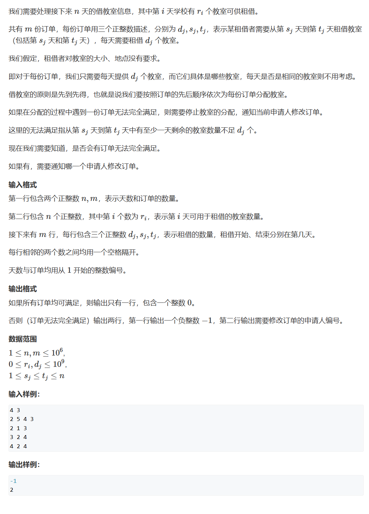
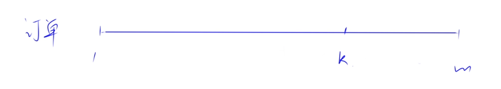
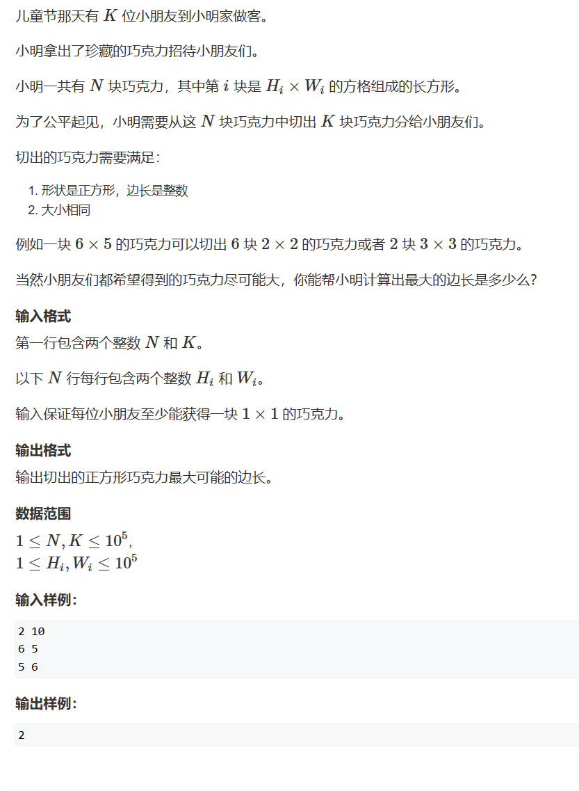
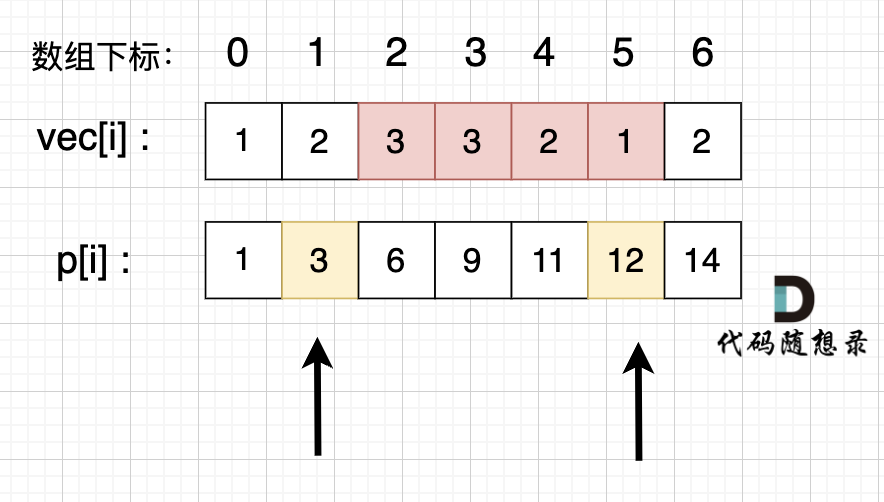
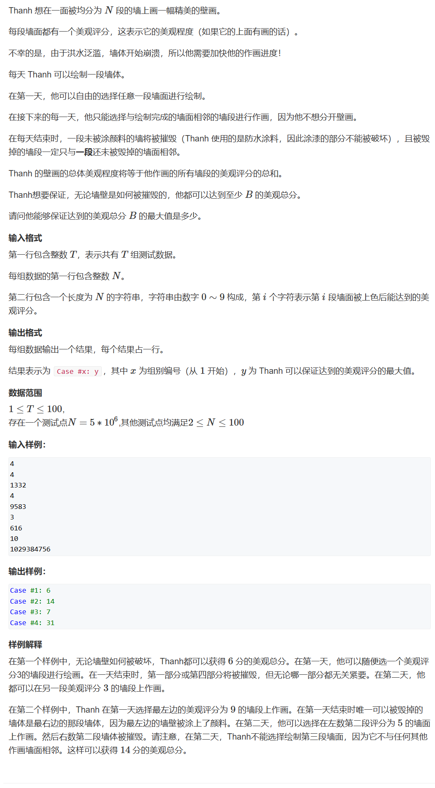

# 数组

# 大整数运算

高精度（大整数运算）

# 二分

> 在一个数组中寻找一个`target`​，如果找到返回对应下标，找不到返回`-1`​

## 易错点

1. while (le  **(&lt; ? &lt;= )**  ri)
2. right =  **(middle ? middle - 1)**

## 区间

1. 左闭右闭 [left, right]
2. 左闭右开 [left, right)
3. （左开右闭） (left, right]

对于区间的定义会影响边界条件的处理

### 循环不变量

要保证在整个循环过程中，对于区间的选取方式保持一致

### 左闭右闭

```vim
left = 0
right = numsize - 1

while (left ? right)  要确保进入循环的区间是合法的
比如当为[1, 1]时，区间合法吗？
合法，即当 left == right 时，进入循环的区间合法
所以写 while (left <= right)
{
	middle = (left + right) / 2
	注意，left和right如果在int范围内取值（而不是下标），则有可能导致middle在运算过程中越界，需要转换为long
	if (nums[middle] > target)  目标值小于所取的中间值，所以应该去更小的区间中寻找
	一般认为数组都是升序的，所以去左半部分寻找，接下来要更新左区间的右边界
	{
		right = middle ? middle - 1
		判断是middle还是middle - 1，也要坚持一开始的区间选取（左闭右闭）
		因为对于nums[middle]，它已经确定不等于目标值，所以下一次查找，我们就可以直接排除当前的这个middle
		所以应该写:
		right = middle - 1
	}
	else if (nums[middle] < target)  目标值大于所取的中间值，更新右区间的左边界
	{
		left = middle + 1  同理
	}
	else  目标值等于所取的中间值
	{
		return middle
	}
}
return -1
```

### 左闭右开

```vim
left = 0
right = numsize 左闭右开不包含right，所以应该多一位
while (left ? right)
左闭右开[left, right)，当left == right时，很明显这是一个不合法的区间
所以不能写<=
while (left < right)
{
	middle = (left + right) >> 1
	if (nums[middle] > target)
	{
		下一个搜索的区间，不包含这个middle，又由于这是一个左闭右开的区间
		所以，不需要-1：
		right = middle
	}
	else if
	{
		左闭，包含middle，所以要+1
		left = middle + 1
	}
	else
	{
		return middle
	}
}
```

## 整数二分模板

```Java
left = 1, right = n - 1;
while (left < right) {
	int mid = left + right >> 1;	// 用right = mid 不用+1
	if (check(mid)) right = mid;
	else left = mid + 1;
}
return left;		// left == right
---------------------------------------
left = 1, right = n - 1;
while (left < right) {
	int mid = left + right + 1 >> 1;	// 用left = mid 需要+1
	if (check(mid)) left = mid;
	else right = mid - 1;
}
return left;		// left == right
```

## 搜索区间

[leetcode.cn/problems/find-first-and-last-position-of-element-in-...](https://leetcode.cn/problems/find-first-and-last-position-of-element-in-sorted-array/description/)

```Java
class Solution {
    public int[] searchRange(int[] nums, int target) {
        if (!itemExist(nums, target)) {		// 先判断该元素是否存在
            return new int[]{-1, -1};
        }
        return new int[]{searchLeft(nums, target), searchRight(nums, target)};
    }

    private boolean itemExist(int[] nums, int target) {
        int left = 0, right = nums.length;
        while (left < right) {
            int mid = (left + right) >> 1;
            if (nums[mid] < target) {
                left = mid + 1;
            } else if (nums[mid] > target) {
                right = mid;
            } else {
                return true;
            }
        }
        return false;
    }


    private int searchLeft(int[] nums, int target) {
        int left = 0, right = nums.length - 1;
        while (left <= right) {
            int mid = (left + right) >> 1;
            // == 时还要继续搜左边
            if (nums[mid] >= target) {  // 如果存在元素，最后执行
                right = mid - 1;
            } else {
                left = mid + 1;
            }
        }
        // 如果元素存在，最后一定是由left指向元素位置，left - 1 = right
        return left;
    }

    private int searchRight(int[] nums, int target) {
        int left = 0, right = nums.length - 1;
        while (left <= right) {
            int mid = (left + right) >> 1;
            if (nums[mid] > target) {
                right = mid - 1;
            } else {  // 如果存在元素，最后执行
                left = mid + 1;
            }
        }
        // 如果元素存在，最后一定是由right指向元素位置，left - 1 = right
        return right;
    }
}

```

## 借教室（二分）

[www.acwing.com/problem/content/505/](https://www.acwing.com/problem/content/505/)

​​

* 由数据范围可得：至少需要$O(n)$或常数较小的$O(logn)$算法

​​

* 转换为判断性问题：现只考虑前$k$个订单是否满足
* 可以使用差分

然后再转为二分问题

* 对于1~m个订单，满足**二段性**​

  * 在某一个$k$选定时，在$k$之前的所有订单**都能**满足条件；在$k$之后的所有订单**不是都能**满足条件
  * 具备二段性则可以使用二分
* 找到最大的$k$，即最后一个能处理的订单，那么第$k+1$个订单不能处理
* 最后答案即为$k+1 $。若$k=m$则表示所有订单都能处理

```Java
/**
 * @Author: Zephyrtoria
 * @CreateTime: 2025-02-16
 * @Description:
 * @Version: 1.0
 */

import java.io.BufferedReader;
import java.io.IOException;
import java.io.InputStreamReader;

public class Main {
    private static final int N = 1000010;
    private static final int[] s = new int[N];
    private static final int[] t = new int[N];
    private static final int[] d = new int[N];
    private static final long[] r = new long[N];

    public static void main(String[] args) throws IOException {
        BufferedReader br = new BufferedReader(new InputStreamReader(System.in));
        String[] input = br.readLine().split(" ");
        int n, m;
        n = Integer.parseInt(input[0]);
        m = Integer.parseInt(input[1]);
        input = br.readLine().split(" ");
        for (int i = 1; i <= n; i++) {
            r[i] = Long.parseLong(input[i - 1]);
        }
        for (int i = 1; i <= m; i++) {
            input = br.readLine().split(" ");
            d[i] = Integer.parseInt(input[0]);
            s[i] = Integer.parseInt(input[1]);
            t[i] = Integer.parseInt(input[2]);
        }

        int result = binarySearch(n, m);
        if (result == m) {
            System.out.println(0);
        } else {
            System.out.println(-1);
            System.out.println(result + 1);
        }
    }

    private static int binarySearch(int n, int m) {
        // left从0开始，因为可能所有订单都不满足
        int left = 0, right = m;
        // 要找能够满足条件的最大的k
        while (left < right) {
            // left == mid就要上一位；right == mid就不用
            int mid = (left + right + 1) >> 1;
            if (isValid(n, mid)) {
                // 满足条件，找右区间
                // 又因为要找最大的k，所以不能写left = mid + 1，要保留
                left = mid;
            } else {
                // 不满足条件，找左区间
                right = mid - 1;
            }
        }
        return left;
    }

    private static boolean isValid(int n, int k) {
        long[] de = new long[N];
        for (int i = 1; i <= k; i++) {
            de[s[i]] += d[i];
            de[t[i] + 1] -= d[i];
        }
        long sum = 0;
        for (int i = 1; i <= n; i++) {
            sum += de[i];
            if (sum > r[i]) {
                return false;
            }
        }
        return true;
    }
}
```

## 切巧克力

[www.acwing.com/problem/content/1229/](https://www.acwing.com/problem/content/1229/)

​​

1. 利用二分，规定每次切割的最大边长为多少 $O(logn)$  

    1. 其实就相当于暴力枚举，但是二分比线性枚举效率更高
    2. 为何可以二分：二段性

        1. 若mid满足条件，那么比mid小的数一定**都**成立；比mid大的数**不都**成立 -> [mid, r]
        2. 若mid不满足条件，那么比mid小的数**不都**成立；比mid大的数**都不**成立 -> [l, mid - 1]
        3. 无论是mid满足条件还是不满足条件，都能将下次判断的区间变为1/2
2. 只能切割不能拼接，所以每个长方形的切割都是独立的 $O(n)$

$$
\sum _{i=0}^{n-1} \lfloor \frac{h_i}{mid} \rfloor *\lfloor \frac{w_i}{mid} \rfloor
$$

最后时间复杂度为$O(nlogn)$

```Java
import java.io.*;

public class Main {
    private static int N = 100010;
    private static int[] h = new int[N];
    private static int[] w = new int[N];
    private static int n, k;

    public static void main(String[] args) throws Exception {
        BufferedReader br = new BufferedReader(new InputStreamReader(System.in));
        String[] input = br.readLine().split(" ");
        n = Integer.parseInt(input[0]);
        k = Integer.parseInt(input[1]);

        for (int i = 0; i < n; i++) {
            input = br.readLine().split(" ");
            h[i] = Integer.parseInt(input[0]);
            w[i] = Integer.parseInt(input[1]);
        }

        int left = 1, right = N;
        while (left < right) {
            int mid = left + right + 1 >> 1;
            if (check(mid)) {
                // 数额大于等于k，找右半部分
                left = mid;
            } else {
                // 数额小于k，找左半部分
                right = mid - 1;
            }
        }

        System.out.println(left);
    }

    // 切边长为x能切出多少块
    private static boolean check(int x) {
        long sum = 0;
        for (int i = 0; i < n; i++) {
            // 可能会超出数据范围 10^5 * 10^5
            sum += (long)(h[i] / x) * (w[i] / x);
            if (sum >= k) {
                return true;
            }
        }
        return false;
    }
}
```

# 循环不变量

## 螺旋矩阵

> 模拟一个螺旋排列的正方形矩阵

### 易错点

* 边界点怎么处理

  * 是给当前这条边处理
  * 还是给下一条边处理

### 循环不变量

坚持一个规则处理所有边

* 左闭右开

  * 处理第一个节点
  * 但不处理最后一个节点

```vim
startX = 0, startY = 0  起始位置和终止位置都是随着循环不断改变的
offset = 1
count = 1;
int i, j
for (int t = n / 2; t > 0; t--)  只需要转n / 2圈，但是对于奇数，还存在最中心的一个点，所以要特殊操作
{
	向右移
	for (j = startY; j < n - offset; j++)
		nums[startX][j] = count++

	向下移
	for (i = startX; i < n - offset; i++)
		nums[i][j] = count++    此时j == n - offset

	向左移
	for ( ; j > startY; j--)    此时j == n - offset，不需要重新赋初值 
		nums[i][j] = count++

	向上移
	for ( ; i > startX; i--)  此时i == n - offset，也不需要赋初值。
		nums[i][j] = count++

	startX++, startY++
	offset++
}

if (n % 2 == 1)
{
	nums[startX][startY] = count++
}
```

# 双指针

## 移除元素

> 给定一个`val`​，删除数组中所有等于`val`​的元素，并返回新数组的长度。要求仅使用O(1)的额外空间。

### 数组的连续性

数组要求其中的元素是一个连续的状态，删除其中一个元素，代表后续的元素必须向前移动，覆盖要删除元素的位置。

删除后数组实际长度-1，但是在物理层面上数组的大小是没有改变的（capacity）

### 暴力实现

两层`for`​循环

1. 遍历数组元素
2. 更新数组

### 双指针 O(n)

可以将整个删除看成将**原数组复制到新数组**的一个过程，只不过这个过程中不把`val`​值复制过来

而双指针就是在此基础上实现**原地**操作：

* 快指针：指向原数组正在操作的位置
* 慢指针：指向新数组正在操作的位置

```vim
slow = 0
for (fast = 0; fast < nums.size; fast++)
{
	if (nums[fast] != val)  当不为需要删除的元素时，需要将原数组的元素复制到新数组中，也就是nums[slow] = nums[fast]
	{
		nums[slow] = nums[fast]
		slow++
	}
	当等于val时，则不需要进行复制，直接令快指针向下走即可，目标值就会被覆盖
}
return slow  最后结束的时候，slow指向新数组的“空”位置（虽然在物理层面上这个位置还有数据）
```

## 有序数组的平方

> 给定一个有序数组，返回所有数的平方构成的数组，并且这个返回的数组仍然是有序的。（原数组中包含负数）

### 暴力

求出每一位数的平方后进行排序。时间复杂度为O(n log n)

### 双指针

数组平方后，形成两个单调的子数组，左侧数组单调递减，右侧数组单调递增。

所以从原数组两侧开始，给新数组从最大索引位置开始进行赋值即可

```vim
int[] result
k = nums.size - 1  每次取值都是取得最大值，所以要从下标最大处开始

i = 0, j = nums.size - 1
while (i <= j)  如果不是i <= j，当i == j时，会直接退出循环，那么就会有一个元素遗漏
{
	if (nums[i] * nums[i] > nums[j] * nums[j])
	{
		result[k] = nums[i] * nums[i]
		k--, i++
	}
	else  两者相等时，取哪一个都可以
	{
		result[k] = nums[j] * nums[j]
		k--, j--
	}
}

return result
```

## 三数之和

> 给你一个整数数组 `nums`​ ，判断是否存在三元组 `[nums[i], nums[j], nums[k]]`​ 满足 `i != j`​、`i != k`​ 且 `j != k`​ ，同时还满足 `nums[i] + nums[j] + nums[k] == 0`​ 。请你返回所有和为 `0`​ 且不重复的三元组。
>
> **注意：** 答案中**不可以包含重复**的三元组。

> 难点

* 寻找三元组
* 三元组去重

因此使用哈希法会比较复杂

> 双指针法

1. 对数组进行排序（不可以对数组去重，因为允许存在相同的值，但不允许存在相同的下标）
2. ​`for i : 0 -> n - 1`​

    1. 使`left = i +1`​和`right = n - 1`​
    2. 判断`nums[i] + nums[left] + nums[right]`​与0的大小

        1. ​`>0`​right--
        2. ​`<0`​left++
        3. ​`=0`​加入结果集，而且双指针两侧要进行收缩
3. 对结果集去重：但是由于三元组，并不能直接去重，要在找三元组的同时完成去重

    1. 移动`i`​时，判断是否有`nums[i] = nums[i - 1]`​，如果有则跳过

        1. 是因为其后必定存在这样的集合，不需要再遍历（能想明白吗？）
    2. 对b和c去重，一定要放在收获结果之后

```vim
sort(nums)
List<Integer[]> result = new List<>()

for (int i = 0; i < nums.length; i++)
{
	if (nums[i] > 0)		// 已经排过序，后面的数一定都大于nums[i]，相加一定仍然>0
		return result
	// 对a进行去重
	if (i > 0 && nums[i] == nums[i - 1])
		continue;
	// 获取b和c
	left = i + 1, right = nums.length - 1		// 进行收缩
	while (left < right)	// 注意left和right相等时就要停止
	{
		sum = nums[i] + nums[left] + nums[right]
		// 移动left和right
		if (sum > 0)
			right--
		else if (sum < 0)
			left++
		else
		{
			result.add(new Integer[] {nums[i], nums[left], nums[right]}

			// 对b和c进行去重
			while (right > left && nums[left] == nums[left + 1])
				left++
			while (right > left && nums[right] == nums[right - 1])
				right--

			// 找到答案时，双指针同时收缩
			left++, right--
		}
	}
}
return result
```

## 四数之和

[leetcode.cn/problems/4sum/](https://leetcode.cn/problems/4sum/)

> 给你一个由 `n`​ 个整数组成的数组 `nums`​ ，和一个目标值 `target`​ 。请你找出并返回满足下述全部条件且**不重复**的四元组 `[nums[a], nums[b], nums[c], nums[d]]`​ （若两个四元组元素一一对应，则认为两个四元组重复）：
>
> * ​`0 <= a, b, c, d < n`​
> * ​`a`​、`b`​、`c`​ 和 `d`​ **互不相同**
> * ​`nums[a] + nums[b] + nums[c] + nums[d] == target`​

你可以按 **任意顺序** 返回答案 。

> 思路

在三数之和的基础上再嵌套一层循环即可

> 剪枝

通过`nums[k] > target`​来剪枝，但因为存在负数，所以需要特别判断`nums[k] > 0 && target > 0 && nums[k] > target`​（需要判断target > 0吗？-不需要，只需要`nums[k] > 0 && nums[k] > target`​）

```Java
import java.util.List;
import java.util.ArrayList;
import java.util.Arrays;

class Solution {
    public List<List<Integer>> fourSum(int[] nums, int target) {
        List<List<Integer>> result = new ArrayList<>();

        Arrays.sort(nums);
        for (int k = 0; k < nums.length; k++) {
            if (nums[k] > target && nums[k] > 0) {
                break;
            }
            if (k > 0 && nums[k] == nums[k - 1]) {
                continue;
            }

            for (int i = k + 1; i < nums.length; i++) {
                if (nums[k] + nums[i] > target && nums[k] + nums[i] > 0) {
                    break;
                }
                if (i > k + 1 && nums[i] == nums[i - 1]) {
                    continue;
                }

                int left = i + 1;
                int right = nums.length - 1;

                while (left < right) {
                    int sum = nums[k] + nums[i] + nums[left] + nums[right];

                    if (sum > target) {
                        right--;
                    } else if (sum < target) {
                        left++;
                    } else {
                        List<Integer> append = new ArrayList<>();
                        append.add(nums[k]); append.add(nums[i]); append.add(nums[left]); append.add(nums[right]);
                        result.add(append);

                        while (left < right && nums[left] == nums[left + 1]) {
                            left++;
                        }
                        while (left < right && nums[right] == nums[right - 1]) {
                            right--;
                        }
                        left++;
                        right--;
                    }
                }
            }
        }

        return result;
    }
}
```

# 滑动窗口

## 长度最小的子数组

> 给定一个数组，找到其总和大于等于`target`​的长度最小的子数组，并返回其长度

### 暴力

两层for循环

```vim
for (i = 0; i < n; i++)
{
	for (j = i + 1; j < n; j++)
	{

	}
}
```

### 双指针（滑动窗口）

使用两个指针来划定一个区间，这个区间就是一个滑动窗口

最重要的就是如何移动起始位置:

1. 不断向后移动终止位置，计算起始位置和终止位置之间的区间和
2. 当移动终止位置后发现区间和恰好大于等于`target`​，则停止，更新最小长度
3. 此时可以将起始位置向后移动，如果区间和仍然大于等于`target`​，那么继续更新，起始位置继续向后移动，直到区间和小于`target`​，再重复步骤1

```vim
int result = INF  注意返回值的初始化
int sum = 0

for (i = 0, j = 0; j < nums.size; j++)
{
	sum += nums[j]
	while (sum >= target)  要注意，不一定只出一个元素，是一个持续的过程
	{  而且并不需要加i < j，因为sum >= target本身就隐含了这个条件
		result = min(result, j - i + 1)  维护结果，这里要注意i++的位置
		sum -= nums[i]  维护滑动窗口
		i++  
	}
}
return (result == INF) ? 0 : result  如果不存在这样的区间要返回0
```

## 水果成篮

[leetcode.cn/problems/fruit-into-baskets/](https://leetcode.cn/problems/fruit-into-baskets/)

```Java
class Solution {
    public int totalFruit(int[] fruits) {
        int[] status = new int[fruits.length];

        int result = 0;
        int count = 0;
        for (int i = 0, j = 0; j < fruits.length; j++) {
            if (status[fruits[j]] == 0) count++;
            status[fruits[j]]++;

            while (count > 2) {
                status[fruits[i]]--;
                if (status[fruits[i]] == 0) {
                    count--;
                }
                i++;
            }
            result = Math.max(result, j - i + 1);
        }
        return result;
    }
}
```

## 最小覆盖子串

[leetcode.cn/problems/minimum-window-substring/](https://leetcode.cn/problems/minimum-window-substring/)

```Java
class Solution {
    public String minWindow(String s, String t) {
        if (s.length() < t.length()) {
            return "";
        }
        int result = 0x3f3f3f3f;
        int recordI = 0, recordJ = s.length();
        int[] status = new int[52];

        int count = 0;
        for (int i = 0, size = t.length(); i < size; i++) {
            int map = mapWord(t.charAt(i));
            if (status[map] == 0) {
                count++;
            }
            status[map]++;
        }

        for (int i = 0, j = 0, size = s.length(); j < size; j++) {
            int map = mapWord(s.charAt(j));
            status[map]--;
            // if this word is not contained by t, status[map] will be a negative and count will not be influenced.
            if (status[map] == 0) {
                count--;
            }

            while (count == 0) {
                if (result > j - i + 1) {
                    result = j - i + 1;
                    recordI = i;
                    recordJ = j;
                }
                map = mapWord(s.charAt(i));
                if (status[map] == 0) {  // note: this judge must before incrementing. Only words t contained will be a positive.
                    count++;
                }
                status[map]++;
                i++;
            }

        }
        if (result == 0x3f3f3f3f) {
            return "";
        }
        return s.substring(recordI, recordJ + 1);
    }

    private int mapWord(char c) {
        if (Character.isUpperCase(c)) {
            return c - 'A';
        } else {
            return c - 'a' + 26;
        }
    }
}

```

# 前缀和

## 区间和

前缀和的思想是重复利用计算过的子数组之和，从而降低区间查询需要累加计算的次数。

**前缀和 在涉及计算区间和的问题时非常有用**

​​

​`p[5] - p[1]`​ 就是 红色部分的区间和。

而 p 数组是我们之前就计算好的累加和，所以后面每次求区间和的之后 我们只需要 O(1) 的操作。

特别注意： 在使用前缀和求解的时候，要特别注意 求解区间。

如上图，如果我们要求 区间下标 [2, 5] 的区间和，那么应该是 p[5] - p[1]，而不是 p[5] - p[2]。

## 壁画

[www.acwing.com/problem/content/564/](https://www.acwing.com/problem/content/564/)

​​

```Java
/**
 * @Author: Zephyrtoria
 * @CreateTime: 2025-02-17
 * @Description:
 * @Version: 1.0
 */

import java.io.*;

public class Main {
    public static void main(String[] args) throws Exception {
        BufferedReader br = new BufferedReader(new InputStreamReader(System.in));
        String input = br.readLine();
        int T = Integer.parseInt(input);

        for (int t = 1; t <= T; t++) {
            input = br.readLine();
            int n = Integer.parseInt(input);
            input = br.readLine();
            int[] arr = new int[n + 1];
            int[] preSum = new int[n + 1];
            for (int i = 1; i <= n; i++) {
                arr[i] = input.charAt(i - 1) - '0';
                preSum[i] = preSum[i - 1] + arr[i];
            }

            int range = (n + 1) / 2;
            int maxValue = 0;
            for (int i = 1; i <= n - range + 1; i++) {
                maxValue = Math.max(maxValue, preSum[i + range - 1] - preSum[i - 1]);
            }
            System.out.printf("Case #%d: %d\n", t, maxValue);
        }
    }
}
```

# 差分

## 一维

## 二维

# 稀疏矩阵转置

Key-indexed Counting

‍
