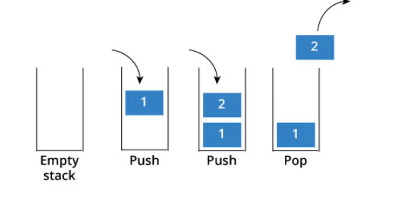

# 栈

# 基本概念

## FILO

​​

可以用来实现逆序

```Java
Stack<V> stack = new Stack<>();
stack.push(v);
stack.pop();
stack.peek();		// get top item
```

### 用栈实现队列

[leetcode.cn/problems/implement-queue-using-stacks/submissions/58...](https://leetcode.cn/problems/implement-queue-using-stacks/submissions/582726146/)

1. 使用两个栈`inStack`​和`outStack`​，一个用于接收入队元素，一个是出队元素集合
2. 当入栈时，直接进入`inStack`​
3. 当出栈时，若`outStack`​不为空，则直接从`outStack`​中弹出元素；若`outStack`​为空，则将`inStack`​中的元素弹入`outStack`​中，`outStack`​再弹出一个元素

即保证局部元素顺序一致

```Java
import java.util.Stack;

class MyQueue {
    private Stack<Integer> inStack;
    private Stack<Integer> outStack;

    public MyQueue() {
        inStack = new Stack<>();
        outStack = new Stack<>();
    }
  
    public void push(int x) {
        inStack.push(x);
    }
  

    public int pop() {
        int result = peek();
        outStack.pop();
        return result;
    }
  
    public int peek() {
        if (outStack.isEmpty()) {
            while (!inStack.isEmpty()) {
                outStack.push(inStack.pop());
            }
        }  
        return outStack.peek();
    }
  
    public boolean empty() {
        return inStack.isEmpty() && outStack.isEmpty();
    }
}

// 注：输入数据保证均为合法操作，所以没有非空判断
```

## 出栈顺序数

假设有n个顺序入栈，只要栈内有元素都可以出栈，则它们的出栈顺序有几种可能？——卡特兰数

$$
f(n)=\frac{C^n_{2n}}{n+1} \ \ \ (f(0)=1)
$$

# 表达式

## 前/中/后缀表达式转换

### 中->后/前入栈法

> **中缀转后缀**：从左到右扫描中缀表达式

1. 遇到**操作数直接将其写出**
2. 遇到**操作符则将其入栈**, 首先令其与栈顶运算符的优先级进行比较

    1. 当前运算符  **&gt;**  栈顶运算符：入栈
    2. 当前运算符  **&lt;=**  栈顶运算符：一直出栈，直到满足
    3. 栈底直接入栈, 栈顶全部出栈
    4. 左括号相当于栈底, 右括号相当于栈顶, 均直接入栈出栈

```cpp
#include <iostream>
using namespace std;

const int N = 100;
int getPriority(char i)
{
    switch (i)
    {
    case '+':
    case '-':
        return 1;
    case '*':
    case '/':
        return 2;
    }
    return -1;
}

// 返回操作符栈中可以到达的最大长度
int infixToPostFix(char infix[], char postFix[])
{
    char signs[N];
    int topSign = -1; // 符号堆栈
    int topPost = -1; // 结果数组
    int maxSize = 0;
    int i = 0; // 原数组

    while (infix[i] != '\0')
    {
        if ('0' <= infix[i] && infix[i] <= '9' || 'a' <= infix[i] && infix[i] <= 'z') // 数字直接写入结果数组
        {
            postFix[++topPost] = infix[i];
            i++;
        }
        else if (infix[i] == '(') // 左括号直接放入符号堆栈
        {
            signs[++topSign] = '(';
            if (topSign > maxSize)
                maxSize = topSign;
            i++;
        }
        else if (infix[i] == ')') // 如果遇到右括号，则将其与对应左括号之间的符号全部出栈
        {
            while (signs[topSign] != '(')
                postFix[++topPost] = signs[topSign--];
            topSign--; // 去掉左括号
            i++;
        }
        else // 假定输入全部合法，此处处理运算符
        {
            // 栈为空 || 栈顶为左括号 || 当前操作符优先级大于栈顶操作符，当前操作符入栈
            if (topSign == -1 || signs[topSign] == '(' ||  getPriority(infix[i]) > getPriority(signs[topSign]))
            {
                signs[++topSign] = infix[i];
                if (topSign > maxSize)
                    maxSize = topSign;
                i++;
            }
            else // 否则一直出栈，直到满足
			{
				while (topSign != -1 && signs[topSign] != '(' && getPriority(infix[i]) <= getPriority(signs[topSign]))
					postFix[++topPost] = signs[topSign--];
				signs[++topSign] = infix[i];
                if (topSign > maxSize)
                    maxSize = topSign;
                i++;
			}
        }
    }

    // 处理符号栈中的剩余符号
    while (topSign != -1)
        postFix[++topPost] = signs[topSign--];

    return maxSize + 1;
}

int main()
{
    char infix[] = "a+b-a*((c+d)/e-f)+g";
    char postFix[N];
    cout << infixToPostFix(infix, postFix) << endl;
    cout << postFix << endl;
    return 0;
}
```

> **中缀转前缀**： 则是**从右向左**, 注意**小于**栈顶优先级即出栈, 所得结果**逆序**

‍

### 后/前->中

### 前->后

1. 从后到前扫描
2. 遇到一运算符两子表达式形式同样符号前移, 中间子表达式后移

## 前/后缀表达式计算

### 前缀表达式计算

* 从后往前扫描

  * 数字入栈
  * 碰到操作符，则栈出两个数字

    * 先出的位于操作符左边
    * 后出的位于操作符右边

```cpp
double doMath(char c, double a, double b)
{
    switch (c)
    {
    case '+':
        return a + b;
    case '-':
        return a - b;
    case '*':
        return a * b;
    case '/':
        return a / b;
    }
    return 0;
}

double cal(char **arr, int count)
{
    stack<double> s;
    for (int i = count - 1; i >= 0; i--)
    {
        if (isdigit(arr[i][0]))
        {
            s.push(atof(arr[i]));
        }
        else
        {
            double a = s.top(); // left
            s.pop();
            double b = s.top(); // right
            s.pop();
            s.push(doMath(arr[i][0], a, b));
        }
    }
    return s.top();
}
```

### 后缀表达式计算

#### 处理输入、转换和计算

```cpp
#include <iostream>
#include <string>
#include <stack>
#include <vector>
using namespace std;

vector<string> split(string infix)
{
    vector<string> result;

    int count = 0;
    int size = infix.size();
    for (int i = 0; i < size; i++)
    {
        if ('0' <= infix[i] && infix[i] <= '9')
        {
            count = count * 10 + infix[i] - '0';
        }
        else
        {
            if (count != 0)
            {
                result.push_back(to_string(count));
                count = 0;
            }
            string temp;
            temp = infix[i];
            result.push_back(temp);
            if (i == 0 && infix[i] == '-' || infix[i] == '(' && infix[i + 1] == '-')
            {
                result.push_back("0");
            }
        }
    }
    // the end may be 0 (but should deal with "10")
    if (count > 0 || (infix[size - 1] == '0' && !('0' <= infix[size - 2] && infix[size - 2] <= '9')))
        result.push_back(to_string(count));

    return result;
}

int getPriority(string s)
{
    switch (s[0])
    {
    case '(':
        return 0;
    case '+':
    case '-':
        return 1;
    case '*':
    case '/':
        return 2;
    }
    return 0;
}

vector<string> infixToPostfix(vector<string> &infix)
{
    vector<string> result;
    stack<string> manifact;

    for (auto each : infix)
    {
        if ('0' <= each[0] && each[0] <= '9')
        {
            result.push_back(each);
        }
        else
        {
            if (each[0] == '(')
            {
                manifact.push("(");
            }
            else if (each[0] == ')')
            {
                while (manifact.top() != "(")
                {
                    result.push_back(manifact.top());
                    manifact.pop();
                }
                manifact.pop();
            }
            else
            {
                int priority = getPriority(each);
                if (manifact.empty() || manifact.top()[0] == '(' || priority > getPriority(manifact.top()))
                {
                    manifact.push(each);
                }
                else
                {
                    while (!manifact.empty() && manifact.top()[0] != '(' && priority <= getPriority(manifact.top()))
                    {
                        result.push_back(manifact.top());
                        manifact.pop();
                    }
                    manifact.push(each);
                }
            }
        }
    }

    while (!manifact.empty())
    {
        if (manifact.top() != "(")
            result.push_back(manifact.top());
        manifact.pop();
    }

    return result;
}

int doMath(vector<string> &postfix)
{
    stack<int> numbers;

    for (string each : postfix)
    {
        if ('0' <= each[0] && each[0] <= '9')
            numbers.push(stod(each));
        else
        {
            switch (each[0])
            {
            case '+':
            {
                int a = numbers.top();
                numbers.pop();
                int b = numbers.top();
                numbers.pop();
                numbers.push(b + a);
                break;
            }
            case '-':
            {
                int a = numbers.top();
                numbers.pop();
                int b = numbers.top();
                numbers.pop();
                numbers.push(b - a);
                break;
            }
            case '*':
            {
                int a = numbers.top();
                numbers.pop();
                int b = numbers.top();
                numbers.pop();
                numbers.push(b * a);
                break;
            }
            case '/':
            {
                int a = numbers.top();
                numbers.pop();
                int b = numbers.top();
                numbers.pop();
                numbers.push(b / a);
                break;
            }
            }
        }
    }
    return numbers.top();
}

int main(void)
{
    string infix;
    cin >> infix;

    auto splittedInfix = split(infix);

    auto postfix = infixToPostfix(splittedInfix);

    cout << doMath(postfix) << endl;
    return 0;
}
```

#### 求值

[leetcode.cn/problems/evaluate-reverse-polish-notation/descriptio...](https://leetcode.cn/problems/evaluate-reverse-polish-notation/description/)

> 给你一个字符串数组 `tokens`​ ，表示一个根据 [逆波兰表示法](https://baike.baidu.com/item/%E9%80%86%E6%B3%A2%E5%85%B0%E5%BC%8F/128437) 表示的算术表达式。
>
> 请你计算该表达式。返回一个表示表达式值的整数。
>
> **注意：**
>
> * 有效的算符为 `'+'`​、`'-'`​、`'*'`​ 和 `'/'`​ 。
> * 每个操作数（运算对象）都可以是一个整数或者另一个表达式。
> * 两个整数之间的除法总是 **向零截断** 。
> * 表达式中不含除零运算。
> * 输入是一个根据逆波兰表示法表示的算术表达式。
> * 答案及所有中间计算结果可以用 **32 位** 整数表示。

1. 从前向后遍历，遇到数字入栈
2. 遇到操作符，栈取出两个元素做运算，再放回
3. 结果即为栈中留存的元素

```Java
import java.util.Stack;

class Solution {
    public int evalRPN(String[] tokens) {
        Stack<Integer> stack = new Stack<>();
        for (String each : tokens) {
            int ch = each.charAt(0);
            if (each.length() == 1 && (ch == '+' || ch == '-' || ch == '*' || ch == '/')) {
                int num1 = stack.pop();
                int num2 = stack.pop();
                if (ch == '+') {
                    stack.push(num2 + num1);
                } else if (ch == '-') {
                    stack.push(num2 - num1);
                } else if (ch == '*') {
                    stack.push(num2 * num1);
                } else {
                    stack.push(num2 / num1);
                }
            } else {
                stack.push(Integer.parseInt(each));
            }
        }
        return stack.pop();
    }
}
```

# 出栈顺序合法判断

## 结论

* 入栈顺序是升序排列，任意数A后面比A小的数都是按照降序排列的
* 入栈顺序是降序排列，任意数A后面比A小的数都是按照升序排列的

## 尝试法

给定出栈顺序，升序入栈，入栈时判断是否需要出栈，否则继续入栈，是则出栈，最后判断能否满足出栈顺序

```cpp
static void GetAns(int n, std::string out_seq)
{
    // TODO
    Stack stack = Stack();
    int count = 1;	// 入栈元素
    for (int i = 0, size = out_seq.size(); i < size; i++)
    {
        while (count <= n && (stack.Empty() || stack.Top() != out_seq[i] - '0'))
        {
            stack.Push(count);
            count++;
        }
        // stack.Top() == out_seq[i] - '0'
        if (stack.Top() == out_seq[i] - '0')
            stack.Pop();
        else
        {
            std::cout << "no" << std::endl;
            return;
        }
    }
    std::cout << "yes" << std::endl;
}
```

# 对应匹配

## 有效的括号

[leetcode.cn/problems/valid-parentheses/description/](https://leetcode.cn/problems/valid-parentheses/description/)

> 给定一个只包括 `'('`​，`')'`​，`'{'`​，`'}'`​，`'['`​，`']'`​ 的字符串 `s`​ ，判断字符串是否有效。
>
> 有效字符串需满足：
>
> 1. 左括号必须用相同类型的右括号闭合。
> 2. 左括号必须以正确的顺序闭合。
> 3. 每个右括号都有一个对应的相同类型的左括号。

只有三种情况不满足：

1. 左括号多
2. 右括号多
3. 左右括号类型不匹配

```Java
import java.util.Stack;

class Solution {
    public boolean isValid(String s) {
        Stack<Character> stack = new Stack<>();
      	// 可以根据字符串长度做剪枝，因为这道题只有括号，若长度为奇数则一定不匹配
        for (int i = 0, size = s.length(); i < size; i++) {
            char c = s.charAt(i);
            // 遇到左括号，直接向栈里放入对应的右括号！可以避免比较时的配对
            if (c == '(') {
                stack.push(')');
            } else if (c == '[') {
                stack.push(']');
            } else if (c == '{') {
                stack.push('}');
            } else {
                // 遇到右括号，直接弹出栈顶元素进行比较就可以了，不用进行配对
                // 如果栈为空：左括号<右括号
				// 栈顶元素和当前元素不等：左括号和右括号类型不匹配
                if (stack.isEmpty() || stack.pop() != c) {
                    return false;
                }
            }
        }
        // 如果最后栈不为空，则说明仍有括号未匹配：左括号>右括号
        return stack.isEmpty();
    }
}
```

## 删除字符串中的所有相邻重复项

[leetcode.cn/problems/remove-all-adjacent-duplicates-in-string/de...](https://leetcode.cn/problems/remove-all-adjacent-duplicates-in-string/description/)

> 给出由小写字母组成的字符串 `s`​，**重复项删除操作**会选择两个相邻且相同的字母，并删除它们。
>
> 在 `s`​ 上反复执行重复项删除操作，直到无法继续删除。
>
> 在完成所有重复项删除操作后返回最终的字符串。答案保证唯一。

1. 遍历字符串
2. 若栈为空，或栈顶元素不等于当前元素，直接入栈
3. 若栈顶元素等于当前元素，既不入栈，同时栈顶元素出栈
4. 最后栈中元素反转即得。（可以将字符串直接作为栈进行操作）

```Java
class Solution {
    public String removeDuplicates(String s) {
        StringBuilder sb = new StringBuilder();
        int end = -1;
        for (int i = 0, size = s.length(); i < size; i++) {
            char c = s.charAt(i);
            if (end == -1 || sb.charAt(end) != c) {
                sb.append(c);
                end++;
            } else {
                sb.deleteCharAt(end--);
            }
        }
  
        return sb.toString();
    }
}
```

# 单调栈

## 每日温度

## 下一个更大元素I

## 下一个更大元素II

## 接雨水

## 柱状图中最大的矩形

‍
