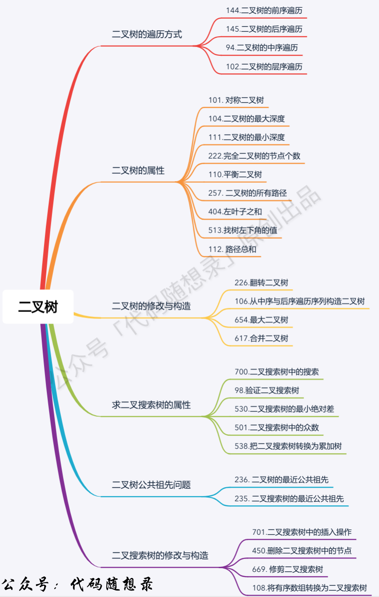
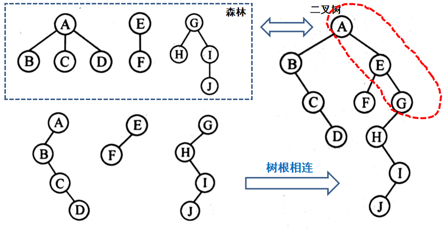
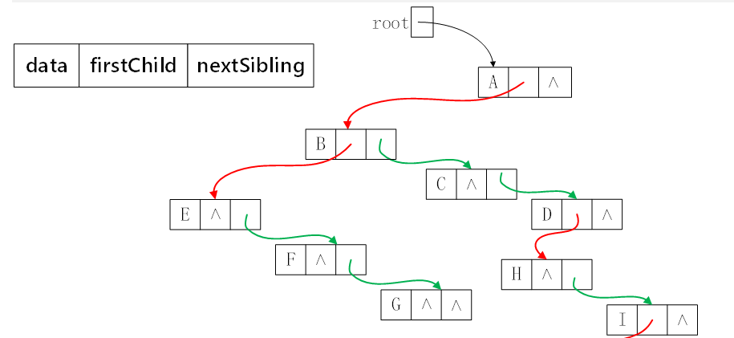
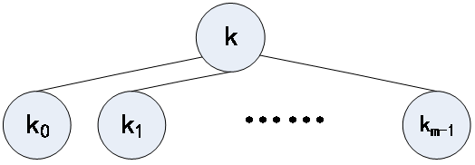
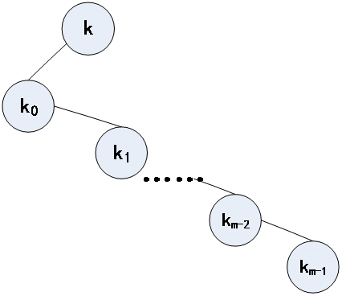

# 树

# 基本概念

​​

* 树
* 根
* 子树
* 子结点
* 父结点
* 结点的度：子结点或非空子树的个数
* 树的度：max{结点的度}
* 叶结点：结点的度为0
* 中间结点：结点的度不为0
* 兄弟结点
* 结点的层次：从顶向下（从0还是从1开始不一定）
* 结点的高度：叶结点高度为1，中间结点的高度为所有子结点最大高度 + 1
* 结点的深度：记根结点的深度为1，向下递增
* 树的高度（深度）：根节点的高度
* 有序树：左右结点不能交换顺序
* 森林：独立树的集合

# 二叉树

* 满二叉树 **a full binary tree**：由度为0的叶结点和度为2的中间结点构成的二叉树，树中没有度为1的结点
* 完全二叉树 **a complete tree**：对于一棵二叉树，除最后一层外，其他各层的结点个数都达到最大，最后一层则可从右向左连续缺若干个结点。

  * 有 *n* 个结点的完全二叉树，高度为$floor( log_{2}(n + 1) )$

  ​​
* 完美二叉树：每一层结点数目都达到了最大。

  ​​

## 特性

* *n*​*<sub>2</sub>*  = *n*​*<sub>0</sub>* - 1
* 第 *i* 层最多有：2*<sup>i - 1</sup>* 个结点
* 深度为 *d* 的二叉树最多有 2<sup>*d*</sup>  - 1个结点

## 存储方式

> 顺序存储

1. 结点编号：树根的索引为1；设结点的编号为𝑘 (𝑘≥1)

    1. 如果其左子树非空，则左子结点的编号为2𝑘
    2. 如果右子树非空，则右子结点为2𝑘+1
2. 顺序存放：用一组地址连续的存储单元存储二叉树的各个结点，以某种特殊的值表示不存在的结点。

> 链接存储

```Java
class Node <Val> {
	Val value;
	Node left;
	Node right;
	(Node parent;)
}
```

## 形态计数

> 不同形态二叉树计数

设有n个结点的不同二叉树数目为bn，那么：

* 挑选n个结点中的某一个作为根结点，

  * *i*（0 ≤ *i* ≤ n - 1）是根结点的左子树中结点的个数,
  * 剩下的(n - i - 1)个结点在根的右子树中，
* 此时二叉树的数目 b<sub>i</sub> * b<sub>n-i-1</sub>

  * b<sub>0</sub> = 1
  * b<sub>1</sub> = 1
  * b<sub>n</sub> = b<sub>0</sub>b<sub>n-1</sub> + b<sub>1</sub>b<sub>n-2</sub> +  … + b<sub>n-1</sub>b<sub>0</sub>

$$
b_{n} = \frac{C^{n}_{2n}}{(n + 1)}
$$

## 森林与二叉树

​​

## 序列化和反序列化

**序列化**：按某种遍历方案访问所有结点并依次输出结点数据，由此形成结点的线性序列（将树的非线性结构转换成线性结构，便于使用线性表或字符串等存储）

**反序列化**：根据线性序列重构原始的二叉树

### 按层次序的顺序存储

按层次从上到下、每一层从左到右依次存放在顺序存储空间（层次遍历序列）。

1. 如果 2k ≤ n，则结点 k 的左子结点是 2k，否则没有左子结点；
2. 如果 2k + 1 ≤ n ，则结点 k 的右子结点是2k + 1 ，否则没有右子结点。
3. 如果 k > 1，则结点 k 的父结点是 ⌊k / 2⌋。

## 表达式计算

## 哈夫曼树Huffman

寻找具有最小加权外部路径长度的二叉树

**Huffman树**：给定一组叶结点权重，由此构建的所有带权二叉树中，带权路径长度最小的二叉树称为哈夫曼树，又称为**最优二叉树**。

* Huffman树的非叶子结点的度均为2

  * 不一定是满二叉树
* 权重小的叶结点的层次**不小于**权重大的叶结点

1. 每次取最小和次小的两个元素，cost += 两元素之和
2. 再将两元素之和放入容器中，重复步骤1

# 遍历方式

前后序遍历并不仅限于二叉树，只要是有序树都可以；但中序遍历只能在二叉树中

对于普通树，前后序遍历确定即可唯一确定树；但是对于二叉树，只有前后序遍历不能唯一确定树

* DFS

  * 前序遍历（递归法，迭代法）
  * 中序遍历（递归法，迭代法）
  * 后序遍历（递归法，迭代法）
* BFS

  * 层次遍历（迭代法）

## 前序遍历 Preorder Traversal

先访问根结点，再递归访问所有子树

### 递归

1. 确定递归函数的参数和返回值
2. 确定终止条件
3. 确定单层递归的逻辑

```Java
import java.util.ArrayList;
import java.util.List;

class Solution {
    public List<Integer> preorderTraversal(TreeNode root) {
        List<Integer> result = new ArrayList<>();
        dfs(root, result);
        return result;
    }

    private void dfs(TreeNode cur, List<Integer> vec) {
        if (cur == null) {
            return;
        }

        vec.add(cur.val);
        dfs(cur.left, vec);
        dfs(cur.right, vec);
    }
}
```

### 迭代

访问结点 + 处理结点

1. 先将根节点输出
2. 将右子结点放入栈中
3. 将左子结点放入栈中
4. 出栈，重复

注意顺序：根左右。所以应该先将右子结点放入，再放入左子结点；出栈时可以实现左子结点先出栈，右子结点后出栈

```Java
import java.util.ArrayList;
import java.util.List;
import java.util.Stack;

class Solution {
    public List<Integer> preorderTraversal(TreeNode root) {
        List<Integer> result = new ArrayList<>();
        Stack<TreeNode> s = new Stack<>();

        s.push(root);
        while (!s.isEmpty()) {
            TreeNode cur = s.pop();
            if (cur == null) {
                continue;
            }
            result.add(cur.val);
            s.push(cur.right);
            s.push(cur.left);
        }
        return result;
    }
}
```

## 中序遍历 Inorder Traversal

只在二叉树中存在这种遍历方法，先访问左子结点，再访问根结点，最后访问右子结点

### 递归

```Java
import java.util.ArrayList;
import java.util.List;

class Solution {
    public List<Integer> inorderTraversal(TreeNode root) {
        List<Integer> result = new ArrayList<>();
        dfs(root, result);
        return result;
    }

    private void dfs(TreeNode cur, List<Integer> vec) {
        if (cur == null) {
            return;
        }

        dfs(cur.left, vec);
        vec.add(cur.val);
        dfs(cur.right, vec);
    }
}
```

### 迭代

访问结点 + 处理结点，两者顺序不同了

要使用栈来记录遍历顺序

1. 从根结点开始，一路向左，非空结点入栈
2. 当遇到了空结点（不管是向左找还是向右找），此时栈顶结点是最近访问过的结点，所以出栈，并继续访问这个结点的右结点

```Java
import java.util.List;
import java.util.ArrayList;
import java.util.Stack;

class Solution {
    public List<Integer> inorderTraversal(TreeNode root) {
        List<Integer> result = new ArrayList<>();
        Stack<TreeNode> s = new Stack<>();
        TreeNode cur = root;
  
        while (cur != null || !s.isEmpty()) {
            if (cur != null) {
                s.push(cur);
                cur = cur.left;			// 左
            } else {	// 如果进入到这里，说明cur == null且s不为空
                cur = s.pop();
                result.add(cur.val);	// 中
                cur = cur.right;		// 右
            }
        }
        return result;
    }
}
```

## 后序遍历 Postorder Traversal

先递归访问所有子树，再访问根结点

### 递归

```Java
import java.util.ArrayList;
import java.util.List;

class Solution {
    public List<Integer> postorderTraversal(TreeNode root) {
        List<Integer> result = new ArrayList<>();
        dfs(root, result);
        return result;
    }

    private void dfs(TreeNode cur, List<Integer> vec) {
        if (cur == null) {
            return;
        }

        dfs(cur.left, vec);
        dfs(cur.right, vec);
        vec.add(cur.val);
    }
}
```

### 迭代

1. 交换左右结点的入栈顺序：根左右 -> 根右左
2. 反转数组：根右左 -> 左右根

```Java
import java.util.ArrayList;
import java.util.List;
import java.util.Stack; 
class Solution {
    public List<Integer> postorderTraversal(TreeNode root) {
        List<Integer> result = new ArrayList<>();
        Stack<TreeNode> s = new Stack<>();

        s.push(root);
        while (!s.isEmpty()) {
            TreeNode cur = s.pop();
            if (cur == null) {
                continue;
            }
            result.add(cur.val);
            s.push(cur.left);
            s.push(cur.right);
        }  

        reverse(result);
        return result;
    }

    private void reverse(List<Integer> list) {
        for (int i = 0, j = list.size() - 1; i < j; i++, j--) {
            int temp = list.get(i);		// get(index)
            list.set(i, list.get(j));	// set(index, value)
            list.set(j, temp);
        }
    }
}
```

## 层序遍历

根据层次递增访问，从根结点开始，从上至下按层访问每个结点，并且每层结点按照从左到右的顺序进行处理

1. 使用队列，实现BFS
2. 如果只要求按顺序输出，就不需要二维数组了；但是有时需要区分各层元素，可以使用二维数组来存放

### 分层存储

[leetcode.cn/problems/binary-tree-level-order-traversal/submissio...](https://leetcode.cn/problems/binary-tree-level-order-traversal/submissions/580569032/)

```Java
import java.util.List;
import java.util.ArrayList;
import java.util.Queue;
import java.util.LinkedList;

class Solution {
    public List<List<Integer>> levelOrder(TreeNode root) {
        List<List<Integer>> result = new ArrayList<>();
        if (root == null) {
            return result;
        }

        Queue<TreeNode> q = new LinkedList<>();
        q.add(root);
        int size; // 记录每一层有多少个元素，用来决定队列每次要弹出多少个元素
        while (!q.isEmpty()) {
            size = q.size();
            List<Integer> vec = new ArrayList<>();
            while (size > 0) {
                size--;
                TreeNode cur = q.remove();
                vec.add(cur.val);
                if (cur.left != null) {
                    q.add(cur.left);
                }
                if (cur.right != null) {
                    q.add(cur.right);
                }
            }
            result.add(vec);
        }
        return result;
    }
}
```

### 锯齿状分层遍历

# 遍历应用

## 二叉树的所有路径

[leetcode.cn/problems/binary-tree-paths/description/](https://leetcode.cn/problems/binary-tree-paths/description/)

> 给你一个二叉树的根节点 `root`​ ，按 **任意顺序** ，返回所有从根节点到叶子节点的路径。
>
> **叶子节点** 是指没有子节点的节点。

前序遍历：要带着当前结点的信息遍历子结点

```Java
import java.util.List;
import java.util.ArrayList;
class Solution {
    private List<String> results;
    public List<String> binaryTreePaths(TreeNode root) {
        results = new ArrayList<>();
        dfs(root, new ArrayList<>());
        return results;
    }

    private void dfs(TreeNode cur, List<Integer> arr) {
        if (cur.left == null && cur.right == null) {
            StringBuilder sb = new StringBuilder();
            for (int i = 0; i < arr.size(); i++) {
                sb.append(arr.get(i));
                sb.append("->");
            }
			// 当前结点不要忘记处理
            sb.append(cur.val);
            results.add(sb.toString());
            return;
        }

        arr.add(cur.val);
        if (cur.left != null) {
            dfs(cur.left, arr);
        }
        if (cur.right != null) {
            dfs(cur.right, arr);
        }
        arr.remove(arr.size() - 1);
    }
}
```

## 路径总和

[leetcode.cn/problems/path-sum/](https://leetcode.cn/problems/path-sum/)

> 给你二叉树的根节点 `root`​ 和一个表示目标和的整数 `targetSum`​ 。判断该树中是否存在 **根节点到叶子节点** 的路径，这条路径上所有节点值相加等于目标和 `targetSum`​ 。如果存在，返回 `true`​ ；否则，返回 `false`​。

优化：

1. sum可以传入targetSum，进行减操作
2. 对result进行判断，提早结束递归

```Java
import java.util.List;
import java.util.ArrayList;
class Solution {
    public boolean hasPathSum(TreeNode root, int targetSum) {
        if (root == null) {
            return false;
        }
        return getPath(root, targetSum - root.val);
    }

    private boolean getPath(TreeNode cur, int target) {
        if (cur.left == null && cur.right == null) {
            if (0 == target) {
                return true;
            }
            return false;
        }
        if (cur.left != null) {
            if (getPath(cur.left, target - cur.left.val)) {
                return true;
            }
        }
        if (cur.right != null) {
            if (getPath(cur.right, target - cur.right.val)) {
                return true;
            }
        }
        return false;
    }
}
```

[leetcode.cn/problems/path-sum-ii/description/](https://leetcode.cn/problems/path-sum-ii/description/)

> 找路径
>
> 给你二叉树的根节点 `root`​ 和一个整数目标和 `targetSum`​ ，找出所有 **从根节点到叶子节点** 路径总和等于给定目标和的路径。

```Java
import java.util.List;
import java.util.ArrayList;
class Solution {
    private int target;
    private List<List<Integer>> results;
    public List<List<Integer>> pathSum(TreeNode root, int targetSum) {
        results = new ArrayList<>();
        target = targetSum;
        getPath(root, 0, new ArrayList<>());
        return results;
    }

    private void getPath(TreeNode cur, int sum, List<Integer> path) {
        if (cur == null) {
            return;
        }

        sum += cur.val;
        path.add(cur.val);
        if (cur.left == null && cur.right == null) {
            if (sum == target) {
                results.add(new ArrayList(path));
            }
            path.remove(path.size() - 1);
            return;
        }
        getPath(cur.left, sum, path);
        getPath(cur.right, sum, path);
        path.remove(path.size() - 1);
    }
}
```

## 左叶子之和

[leetcode.cn/problems/sum-of-left-leaves/description/](https://leetcode.cn/problems/sum-of-left-leaves/description/)

> 给定二叉树的根节点 `root`​ ，返回所有左叶子之和。

```Java
class Solution {
    public int sumOfLeftLeaves(TreeNode root) {
        return getSum(root);
    }

    private int getSum(TreeNode cur) {
        if (cur == null) {
            return 0;
        }
        if (cur.left == null && cur.right == null) {
            return  0;
        }
        // 首先要是叶子结点，再是左叶子，需要通过父结点判断
        int result = getSum(cur.left);
        if (cur.left != null && cur.left.left == null && cur.left.right == null) {
            result = cur.left.val;
        }
        if (cur.right != null) {
            result += getSum(cur.right);
        }
        return result;
    }
}
```

## 找树左下角的值

[leetcode.cn/problems/find-bottom-left-tree-value/description/](https://leetcode.cn/problems/find-bottom-left-tree-value/description/)

> 给定一个二叉树的 **根节点** `root`​，请找出该二叉树的 **最底层 最左边** 节点的值。

使用层次遍历比较简单

递归实现：前中后序都一样，因为根的部分不需要进行处理

1. 找深度最大的叶子结点
2. 优先遍历左侧结点即可找到最左边的值

```Java
class Solution {
    private int maxDepth;
    private int result;
    public int findBottomLeftValue(TreeNode root) {
        maxDepth = -1;
        dfs(root, 0);
        return result;
    }

    private void dfs(TreeNode cur, int depth) {
        if (cur.left == null && cur.right == null) {
            if (depth > maxDepth) {
                maxDepth = depth;
                result = cur.val;
            }
            return;
        }

        if (cur.left != null) {
            dfs(cur.left, depth + 1);
        }
        if (cur.right != null) {
            dfs(cur.right, depth + 1);
        }
    }
}
```

# 树的属性

## 求树的高度/深度

* 高度：**后序**，在子结点的基础上+1
* 深度：**前序**，在父结点的基础上+1

### 二叉树的最大深度

[leetcode.cn/problems/maximum-depth-of-binary-tree/description/](https://leetcode.cn/problems/maximum-depth-of-binary-tree/description/)

> 给定一个二叉树 `root`​ ，返回其最大深度。
>
> 二叉树的 **最大深度** 是指从根节点到最远叶子节点的最长路径上的节点数。

* 空树：0
* 仅有根结点：1
* 有子树：`max(maxDepth(left), maxDepth(right)) + 1`​

> DFS：后序遍历

```Java
class Solution {
    public int maxDepth(TreeNode root) {
        if (root == null) {
            return 0;
        }  
        return Math.max(maxDepth(root.left), maxDepth(root.right)) + 1;
		/*
		int leftDepth = maxDepth(root.left);		// 左
		int rightDepth = maxDepth(root.right);		// 右
		return Math.max(leftDepth, rightDepth) + 1;	// 根
		*/
    }
}
```

> BFS

```Java
import java.util.Queue;
import java.util.LinkedList;

class Solution {
    public int maxDepth(TreeNode root) {
        if (root == null) {
            return 0;
        }
        int depth = 0;
        Queue<TreeNode> q = new LinkedList<>();
        q.add(root);
        int size;
        while (!q.isEmpty()) {
            size = q.size();
            depth++;
            while (size > 0) {
                size--;
                TreeNode cur = q.remove();
                if (cur.left != null) {
                    q.add(cur.left);
                }
                if (cur.right != null) {
                    q.add(cur.right);
                }
            }
        }
        return depth;
    }
}
```

### N叉树的最大深度

[leetcode.cn/problems/maximum-depth-of-n-ary-tree/description/](https://leetcode.cn/problems/maximum-depth-of-n-ary-tree/description/)

> 给定一个 N 叉树，找到其最大深度。
>
> 最大深度是指从根节点到最远叶子节点的最长路径上的节点总数。

```Java
class Solution {
    public int maxDepth(Node root) {
        if (root == null) {
            return 0;
        }
        int result = 0;
        for (Node each : root.children) {
            result = Math.max(maxDepth(each), result);
        }
        return result + 1;
    }
}
```

### 二叉树的最小深度

[leetcode.cn/problems/minimum-depth-of-binary-tree/description/](https://leetcode.cn/problems/minimum-depth-of-binary-tree/description/)

> 给定一个二叉树，找出其最小深度。
>
> 最小深度是从根节点到最近叶子节点的最短路径上的节点数量。
>
> **说明：** 叶子节点是指没有子节点的节点。

后序遍历，从下层搜集信息返回上层

|左|右|结果|
| ------| ------| ------------------------------|
|空|非空|1 + right|
|非空|空|1 + left|
|空|空|1 + min(left, right) = 1 + 0|
|非空|非空|1 + min(left, right)|

```Java
class Solution {
    public int minDepth(TreeNode root) {
        return getHeight(root);
    }

    private int getHeight(TreeNode cur) {
        if (cur == null) {
            return 0;
        }

        int left = getHeight(cur.left);     // 左
        int right = getHeight(cur.right);   // 右
        // 根
        if (cur.left == null && cur.right != null) {
            return 1 + right;
        } else if (cur.left != null && cur.right == null) {
            return 1 + left;
        } else {
            return 1 + Math.min(left, right);
        }
    }
}
```

> 简化版

```Java
class Solution {
    public int minDepth(TreeNode root) {
        return getHeight(root);
    }

    private int getHeight(TreeNode cur) {
        if (cur == null) {
            return 0;
        }
        if (cur.left == null && cur.right != null) {
            return 1 + getHeight(cur.right);
        } else if (cur.left != null && cur.right == null) {
            return 1 + getHeight(cur.left);
        } else {
            return 1 + Math.min(getHeight(cur.left), getHeight(cur.right));
        }
    }
}
```

## 求结点数量

* 空树：0
* 非空树：`countNode(left) + countNode(right) + 1`​

### 任意二叉树的结点个数

任意遍历均可

```Java
class Solution {
    public int countNodes(TreeNode root) {
        return getNodes(root);
    }

    private int getNodes(TreeNode cur) {
        if (cur == null) {
            return 0;
        }
        return getNodes(cur.left) + getNodes(cur.right) + 1;	// 后序遍历
    }
}
```

### 完全二叉树的结点个数

[leetcode.cn/problems/count-complete-tree-nodes/description/](https://leetcode.cn/problems/count-complete-tree-nodes/description/)

> 给你一棵 **完全二叉树** 的根节点 `root`​ ，求出该树的节点个数。
>
> [完全二叉树](https://baike.baidu.com/item/%E5%AE%8C%E5%85%A8%E4%BA%8C%E5%8F%89%E6%A0%91/7773232?fr=aladdin) 的定义如下：在完全二叉树中，除了最底层节点可能没填满外，其余每层节点数都达到最大值，并且最下面一层的节点都集中在该层最左边的若干位置。若最底层为第 `h`​ 层，则该层包含 `1~2`​<sup>​`h`​</sup>​ 个节点。

可以使用普通二叉树的解法，也可以从完全二叉树的定义入手

* 只有最底层可能没填满
* 判断子树是否为完美二叉树，可由公式计算结点个数

  * 完美二叉树：判断左子树的左侧结点数和右子树的右侧结点数是否相同（根据完全二叉树的性质）
  * 叶子结点是完美二叉树

```Java
class Solution {
    public int countNodes(TreeNode root) {
        return getNodes(root);
    }

    private int getNodes(TreeNode cur) {
        // 终止不仅要判断是否为空，还需要判断是否为完美二叉树
        if (cur == null) {
            return 0;
        }
        // 判断是否为完美二叉树
        TreeNode left = cur.left;
        TreeNode right = cur.right;
        int leftDepth = 0, rightDepth = 0;
        while (left != null) {
            left = left.left;
            leftDepth++;
        }
        while (right != null) {
            right = right.right;
            rightDepth++;
        }
		// 如果是完美二叉树，直接用公式
        if (leftDepth == rightDepth) {
            return (2 << leftDepth) - 1;
        }

        return getNodes(cur.left) + getNodes(cur.right) + 1;
    }
}
```

## 求叶子结点数量

* 空树：0
* 仅有根结点：1
* 有子树：`getLeaves(left) + getLeaves(right)`​

## 复制二叉树

1. 复制根
2. 复制left
3. 复制right

## 判断相同的树

[leetcode.cn/problems/same-tree/description/](https://leetcode.cn/problems/same-tree/description/)

> 给你两棵二叉树的根节点 `p`​ 和 `q`​ ，编写一个函数来检验这两棵树是否相同。
>
> 如果两个树在结构上相同，并且节点具有相同的值，则认为它们是相同的。

和**对称二叉树**一样，可以使用双指针的思路

```Java
class Solution {
    public boolean isSameTree(TreeNode p, TreeNode q) {
        return compare(p, q);
    }

    private boolean compare(TreeNode p, TreeNode q) {
        if (p == null && q == null) {
            return true;
        } else if (p != null && q == null || p == null && q != null) {
            return false;
        } else {
            return p.val == q.val && compare(p.left, q.left) && compare(p.right, q.right);
        }
    }
}
```

# 树的构造

构造类的题要用**前序**遍历，先处理根，再处理子结点

## 双亲存储法

* 编号:从根结点（编号为0 )开始，  
  按从上到下的层次顺序， 每一层按从左到右的顺序， 递增地依次给每一个结点一个编号。
* 存储:用数组`tree[n]`​来表示树的顺序存储，数组每个元素是一个结构体， 它包含两个成员 data 和 parent; data 存储一个结点的值，parent 存储该结点的双亲结点在该数组中的下标。根结点`tree[root].parent=-1`​

​​

反向还原

1. 将父结点为 *i* 的结点存到二维数组 `prts[i][last]`​中（下面代码中使用了可变长数组的数组）
2. 进行BFS，建立结点关系

```cpp
struct Node {
	int val_;
	vector<Node*> son_;
}

Tree::Tree() {
    size_ = 0;

    vector<int> prts[N];
    int v, prt;
    while (cin >> v >> prt) {
        if (prt == -1) {
            root_ = new Node{v};
        } else {
            prts[prt].push_back(v);
        }
        size_++;
    }

    queue<Node*> q;
    q.push(root_);
    while (!q.empty()) {
        Node* cur = q.front();
        q.pop();

        prt = cur->data_;
        for (int i = 0; i < prts[prt].size(); i++) {
            Node* newNode = new Node{prts[prt][i]};
            cur->son_.push_back(newNode);
            q.push(newNode);
        }
    }
}
```

## 孩子兄弟表示法

​​

## 括号表示

给定树的括号表示，如何建立一棵按标准形式存储的度为m的树？

$$
A(B(E,F,G),C,D(H,I(J)))
$$

```cpp
#include <iostream>
#include <stack>
using namespace std;
const int MAXN = 10;

typedef struct mTreeNode
{
    char data;
    struct mTreeNode **child;
} Node;

Node *initNode(char a, int m)
{
    Node *p = new Node{a};
    p->child = new Node *[m];
    return p;
}

Node *buildTree(char a[], int left, int right, int m)
{
    if (left > right)
        return nullptr;

    if (left == right) // single character
        return initNode(a[left], m);

    Node *root = initNode(a[left], m);
    // 递归切分

    int childNo = 0;
    int i = left + 2, j = right - 1; // 去除最外层括号
    stack<char> s;

    int k = i;
    char ch = a[i];
    while (k <= j)
    {
        switch (ch)
        {
        case '(':
            s.push(ch);
            break;
        case ')':
            s.pop();
            break;
        case ',':
            if (s.empty())
            {
                root->child[childNo++] = buildTree(a, i, k - 1, m);
                i = k + 1;
            }
            break;
        }
        ch = a[++k];
    }
    root->child[childNo] = buildTree(a, i, j, m); // last child
    return root;
}
```

## 树的二叉链表表示

> 把任意次树转换成二叉树(形态)

​​

​​

> 还原

注意每一层的结点顺序是反的

```cpp
TreeNode* convert(BiTreeNode* cur, TreeNode* pre) {
    if (cur == nullptr) {
        return nullptr;
    }

    TreeNode* tn = new TreeNode;
    tn->data = cur->data;

    if (cur->right != nullptr) {
        TreeNode* b = convert(cur->right, pre);
        pre->son.push_back(b);
    }
    if (cur->left != nullptr) {
        TreeNode* c = convert(cur->left, tn);
        tn->son.push_back(c);
    }

    return tn;
}
```

## 根据遍历结果构造二叉树

### 中序后序构造二叉树

[leetcode.cn/problems/construct-binary-tree-from-inorder-and-post...](https://leetcode.cn/problems/construct-binary-tree-from-inorder-and-postorder-traversal/)

> 给定两个整数数组 `inorder`​ 和 `postorder`​ ，其中 `inorder`​ 是二叉树的中序遍历， `postorder`​ 是同一棵树的后序遍历，请你构造并返回这颗 *二叉树* 。

1. 后序数组为0 -> null
2. 后续数组最后一个元素为**根结点**
3. 寻找**根结点**在**中序**数组中的位置做切割

    1. 左区间为左子树
    2. 右区间为右子树
4. 根据切割的左、右区间，在**后序**数组中寻找（找对应个数）
5. 递归处理左区间、右区间（分治）

默认无重复元素，不然无法正确切割

```Java
class Solution {
    public TreeNode buildTree(int[] inorder, int[] postorder) {
        return buildHelper(inorder, 0, inorder.length - 1, postorder, 0, postorder.length - 1);
    }

    private TreeNode buildHelper(int[] inorder, int il, int ir, int[] postorder, int pl, int pr) {
        if (il > ir) {
            return null;
        }
        TreeNode root = new TreeNode(postorder[pr]);
        int cur = 0;
        while (il + cur <= ir && inorder[il + cur] != postorder[pr]) {
            cur++;
        }
        root.left = buildHelper(inorder, il, il + cur - 1, postorder, pl, pl + cur - 1);
        root.right = buildHelper(inorder, il + cur + 1, ir, postorder, pl + cur, pr - 1);
        return root;
    }
}
```

前序和中序也是一样的思路

> **优化**：使用哈希表提前映射下标，减少查询的消耗

```Java
class Solution {
    private HashMap<Integer, Integer> inorderMap;
    public TreeNode buildTree(int[] inorder, int[] postorder) {
        inorderMap = new HashMap<>();
        for (int i = 0; i < inorder.length; i++) {
            inorderMap.put(inorder[i], i);
        }
        return buildHelper(inorder, 0, inorder.length - 1, postorder, 0, postorder.length - 1);
    }

    private TreeNode buildHelper(int[] inorder, int il, int ir, int[] postorder, int pl, int pr) {
        if (il > ir) {
            return null;
        }
        if (il == ir) {
            return new TreeNode(postorder[pr], null, null);
        }
        TreeNode root = new TreeNode(postorder[pr]);
        int dif = inorderMap.get(postorder[pr]) - il;
        root.left = buildHelper(inorder, il, il + dif - 1, postorder, pl, pl + dif - 1);
        root.right = buildHelper(inorder, il + dif + 1, ir, postorder, pl + dif, pr - 1);
        return root;
    }
}
```

### 前序后序构造二叉树

## 最大二叉树

[leetcode.cn/problems/maximum-binary-tree/description/](https://leetcode.cn/problems/maximum-binary-tree/description/)

> 给定一个不重复的整数数组 `nums`​ 。 **最大二叉树** 可以用下面的算法从 `nums`​ 递归地构建:
>
> 1. 创建一个根节点，其值为 `nums`​ 中的最大值。
> 2. 递归地在最大值 **左边** 的 **子数组前缀上** 构建左子树。
> 3. 递归地在最大值 **右边** 的 **子数组后缀上** 构建右子树。
>
> 返回 *​`nums`​*​ *构建的*  ***最大二叉树***  。

```Java
class Solution {
    public TreeNode constructMaximumBinaryTree(int[] nums) {
        return BuildHelper(nums, 0, nums.length - 1);
    }

    private TreeNode BuildHelper(int[] nums, int ml, int mr) {
        if (ml > mr) {
            return null;
        }
        int maxValue = 0;
        int maxIndex = ml;
        for (int i = ml; i <= mr; i++) {
            if (maxValue < nums[i]) {
                maxValue = nums[i];
                maxIndex = i;
            }
        }
        return new TreeNode(maxValue, BuildHelper(nums, ml, maxIndex - 1), BuildHelper(nums, maxIndex + 1, mr));
    }
}
```

# 树的修改

## 翻转二叉树

[leetcode.cn/problems/invert-binary-tree/description/](https://leetcode.cn/problems/invert-binary-tree/description/)

给你一棵二叉树的根节点 `root`​ ，翻转这棵二叉树，并返回其根节点。

​​

### DFS

```Java
class Solution {
    public TreeNode invertTree(TreeNode root) {
        invert(root);
        return root;
    }

    private void invert(TreeNode cur) {
        if (cur == null) {
            return;
        }
		// 前序形式，改为后序也可；中序需要两次对左子树处理
        TreeNode temp = cur.left;
        cur.left = cur.right;
        cur.right = temp;

        invert(cur.left);
        invert(cur.right);
    }
}
```

### BFS

```Java
import java.util.*;
class Solution {
    public TreeNode invertTree(TreeNode root) {
        if (root == null) {
            return null;
        }
        Queue<TreeNode> q = new LinkedList<>();
        q.add(root);
        int size;
        while (!q.isEmpty()) {
            size = q.size();
            while (size > 0) {
                size--;
                TreeNode cur = q.remove();
                swapNode(cur);
                if (cur.left != null) {
                    q.add(cur.left);
                }
                if (cur.right != null) {
                    q.add(cur.right);
                }
            }
        }
        return root;
    }
    private void swapNode(TreeNode cur) {
        TreeNode temp = cur.left;
        cur.left = cur.right;
        cur.right = temp;
    }
}
```

## 合并二叉树

[leetcode.cn/problems/merge-two-binary-trees/](https://leetcode.cn/problems/merge-two-binary-trees/)

> 给你两棵二叉树： `root1`​ 和 `root2`​ 。
>
> 想象一下，当你将其中一棵覆盖到另一棵之上时，两棵树上的一些节点将会重叠（而另一些不会）。你需要将这两棵树合并成一棵新二叉树。合并的规则是：如果两个节点重叠，那么将这两个节点的值相加作为合并后节点的新值；否则，**不为** null 的节点将直接作为新二叉树的节点。
>
> 返回合并后的二叉树。
>
> **注意:**  合并过程必须从两个树的根节点开始。

同步遍历两个二叉树（双指针）

1. 全为空

    1. 返回null
2. 其中一个为空

    1. 直接返回另一个非空结点
3. 都不为空

    1. 递归

```Java
class Solution {
    public TreeNode mergeTrees(TreeNode root1, TreeNode root2) {
        if (root1 == null) {	// 已经包含了root1和root2同时为空的情况
            return root2;
        } else if (root2 == null) {
            return root1;
        }
        return new TreeNode(root1.val + root2.val, mergeTrees(root1.left, root2.left), mergeTrees(root1.right, root2.right));
    }
}
```

# 判断特殊树

## 满二叉树

判断是否有度为1的结点

```cpp
bool BinaryTree::Is_Full_Tree(BiNODE* node) {
    if (node == nullptr) {
        return false;
    }
    queue<BiNODE*> q;
    q.push(node);
    while (!q.empty()) {
        BiNODE* cur = q.front();
        q.pop();
        if (cur == nullptr) {
            continue;
        }
        if (cur->lchild == nullptr && cur->rchild != nullptr || cur->rchild == nullptr && cur->lchild != nullptr) {
            return false;
        }
        q.push(cur->lchild);
        q.push(cur->rchild);
    }
    return true;
}
```

## 完全二叉树

1. 有右子结点但无左子结点一定不是完全二叉树
2. 当遍历到只有左子结点，或两个子结点都不存在的结点，在这个结点之后不应该再出现有子结点的结点

```cpp
bool BinaryTree::Is_Complete_Tree(BiNODE* node) {
    if (node == nullptr) {
        return false;
    }
    queue<BiNODE*> q;
    q.push(node);
    bool noChild = false;
    while (!q.empty()) {
        BiNODE* cur = q.front();
        q.pop();
        if (cur == nullptr) {
            continue;
        }
        if (cur->lchild == nullptr && cur->rchild != nullptr) {
            return false;
        }

        if (noChild && cur->lchild != nullptr) {
            return false;
        }
        if (cur->lchild == nullptr || cur->rchild == nullptr) {
            noChild = true;
        }

        q.push(cur->lchild);
        q.push(cur->rchild);
    }
    return true;
}
```

## 完美二叉树

根据树高和结点数判断：深度（高度）为 *d* (≥1)的二叉树是完美二叉树的**充分必要条件**是  
树中有 2*<sup>d</sup>*−1 个结点。

```cpp
bool BinaryTree::Is_Perfect_Tree(BiNODE* node) {
    if (node == nullptr) {
        return false;
    }
    int size = Size_Of_Tree(GetRoot());
    int height = Height_Of_Tree(GetRoot());
	// 以下代码等同于 int sum = pow(2, height) - 1
    int a = 1;
    int sum = 0;
    for (int i = 0; i < height; i++) {
        sum += a;
        a *= 2;
    }

    return size == sum;
}
```

## 平衡二叉树

[leetcode.cn/problems/balanced-binary-tree/description/](https://leetcode.cn/problems/balanced-binary-tree/description/)

**平衡二叉树** 是指该树所有结点的左右子树的高度相差不超过 1。

```Java
class Solution {
    public boolean isBalanced(TreeNode root) {
        return getHeight(root) != -1;
    }

    private int getHeight(TreeNode root) {
        if (root == null) {
            return 0;
        }

        int left = getHeight(root.left);	// 左
        if (left == -1) {
            return -1;
        }
        int right = getHeight(root.right);	// 右
        if (right == -1) {
            return -1;
        }
  
        if (Math.abs(left - right) > 1) {
            return -1;
        }
        return Math.max(left, right) + 1;	// 根
    }
}
```

## 对称二叉树

[leetcode.cn/problems/symmetric-tree/description/](https://leetcode.cn/problems/symmetric-tree/description/)

> 给你一个二叉树的根节点 `root`​ ， 检查它是否轴对称。

1. 可以转换成**二叉树翻转之后是否和原来的二叉树相同**
2. 从遍历角度：相当于同时遍历左右两个子树（双指针的感觉）

    1. 左树的left结点要与右树的right结点相同
    2. 左树的right结点要与右树的left结点相同

|左|右|Result|
| ----------------| ----------------| --------|
|空|空|true|
|空|非空|false|
|非空|空|false|
|非空（值不同）|非空（值不同）|false|
|非空（值相同）|非空（值相同）|true|

```Java
class Solution {
    public boolean isSymmetric(TreeNode root) {
        return compare(root.left, root.right);
    }

    private boolean compare(TreeNode left, TreeNode right) {
        if (left == null && right == null) {
            return true;
        } else if (left == null && right != null || left != null && right == null) {
            return false;
        } else {
            return left.val == right.val && compare(left.left, right.right) && compare(left.right, right.left);
        }
    }
}
```

实质上应该是**后序遍历**

* 左树：左右中
* 右树：右左中

# 二叉树公共祖先

## 二叉树的最近公共祖先

[leetcode.cn/problems/lowest-common-ancestor-of-a-binary-tree/des...](https://leetcode.cn/problems/lowest-common-ancestor-of-a-binary-tree/description/)

> 给定一个二叉树, 找到该树中两个指定节点的最近公共祖先。
>
> [百度百科](https://baike.baidu.com/item/%E6%9C%80%E8%BF%91%E5%85%AC%E5%85%B1%E7%A5%96%E5%85%88/8918834?fr=aladdin)中最近公共祖先的定义为：“对于有根树 T 的两个节点 p、q，最近公共祖先表示为一个节点 x，满足 x 是 p、q 的祖先且 x 的深度尽可能大（**一个节点也可以是它自己的祖先**）。”

二叉树只能从上向下遍历，不能从p、q开始向上，但是**后序遍历**可以实现将下层的结果向上层传递

* 如果p不为q的祖先结点（或相反）

  * 终止条件：为空，或判断当前结点是否为p或q
  * 因为要找最近公共祖先，所以p和q一定分别位于这个结点的左右子树当中
* 如果p为q的祖先结点（或相反）

  * 实际上这种情况的处理和之前的处理是重合的
  * 因为p为q的祖先结点时，当遇到p时直接返回p，q一定在p下面，不需要再去遍历寻找q了，否则就是第一种情况

```Java
class Solution {
    public TreeNode lowestCommonAncestor(TreeNode root, TreeNode p, TreeNode q) {
        return postorder(root, p, q);
    }

    private TreeNode postorder(TreeNode cur, TreeNode p, TreeNode q) {
        if (cur == null || cur == p || cur == q) {
            return cur;
        }
        TreeNode left = postorder(cur.left, p, q);
        TreeNode right = postorder(cur.right, p, q);
        if (left != null && right != null) {
            // 左右子树都不为空，则说明当前结点为最近公共祖先
            return cur;
        } else if (left != null && right == null) {
            // 左子树中出现目标值，右子树中没有目标值
            return left;
        } else if (left == null && right != null) {
            // 左子树中没有目标值，右子树中出现目标值
            return right;
        } else {
            // 两侧子树都没有目标值
            return null;
        }
    }
}
```
