# 编程思维与实践

# 数组元素作为函数的传入参数

```c
#include <stdio.h>
#include <string.h>

#define MAXNUM 10
#define MAXNAME 20
struct Member {
    char insurance[MAXNUM];
    struct {
        char fname[MAXNAME];
        char mname[MAXNAME];
        char lname[MAXNAME];
    };
};

void M_input(struct Member M);

int main(void)
{
    struct Member M_list[2];
    int i;
    for (i = 0; i < 2 ;i++)
    {
        M_input(M_list[i]);
    }
    show(M_list);

    return 0;
}

void M_input(struct Member M)
{
    printf("Enter the insurance number.\n");
    s_gets(M.insurance,MAXNUM);
    printf("Enter the first name.\n");
    s_gets(M.fname,MAXNAME);
    printf("Enter the middle name.\n");
    s_gets(M.mname,MAXNAME);
    printf("Enter the last name.\n");
    s_gets(M.lname,MAXNAME);
}
```

在`M_input()`​中，M的值都是正常的，但一但回到主函数则M会失去值。

因为`M_input()`​传入的是`M_list`​的值

‍

# 数值溢出

​`INT_MAX + 1 = INT_MIN`​，而不是`0`​

‍

# 二分法算平方根

注意`0<x<1`​和`x>=1`​两种情况

‍

# malloc()申请指向数组的指针

```c
int (*input)[2];
input = (int(*)[2])malloc(sizeof(int[2]) * N);
```

# 最小公倍数和最大公因数

最大公因数用辗转相除法

```c
int GCD(int a, int b)
{
    if (b == 0)
        return a;
    else
        return GCD(b,a%b);
}
```

不用考虑a,b的大小关系，因为会被调整回来

​`a * b = GCD * LCM`​

由此可以得出最小公倍数

# 子数组查找

注意控制访问空的情况和下标越界

```c++
int strIndex(char s[], char t[])
{
    int i,j,k;
    for (i = 0; s[i]; i++)
    {
        for (j = i, k = 0; t[k] && s[j] == t[k]; j++, k++)
            ;
        if (k > 0 && t[k] == 0)
            return i;
    }
    return -1;
}
```

# 字符串与数值转换

```c
#include <ctype.h>
#include <stdio.h>

double a2f(char s[]);

int main(void)
{
    char s[10];
    fgets(s,10,stdin);
    printf("%lf",a2f(s));
    return 0;
}

double a2f(char s[])
{
    int sign = 1,i,pow = 1,flag = 0;
    double ret_val = 0;
    for (i = 0; s[i]; i++)
    {
        if (s[i] == '-')  //注意负数的处理！！！
        {
            sign = -1;
            continue;
        }
        if (s[i] == '.') flag = 1;
        if (isdigit(s[i]))
        {
            if (flag)
            {
                ret_val = ret_val * 10 + s[i] - '0';
                pow *= 10;  
            }
            else ret_val = ret_val * 10 + s[i] - '0';
        }
  
    }
    return 1.0*sign*ret_val/pow;
}
```

```c
#include <stdio.h>

double atof(char s[]) {
    // TODO: your function definition
    double ret_val = 0;
    double times = 0;
    int flag = 1,tmp = 0;
    double sign_z = 1,sign_f = 1;
  
    for (int i = 0; s[i]; i++)
    {
        if ('0' <= s[i] && s[i] <= '9')
        {
            ret_val = ret_val * 10.0 + (double)(s[i] - '0');
            if (!flag) times -= 1;
        }
        else if (s[i] == 'e' || s[i] == 'E')
        {
            for (int j = i + 1; s[j]; j++)
            {
                if (s[j] == '-') sign_f = -1;
                if ('0' <= s[j] && s[j] <= '9') tmp = tmp * 10 + s[j] - '0';
            }
            tmp *= sign_f;
            times += tmp;
            break;
        }
        else if (s[i] == '.')
            flag = 0;
        else if (s[i] == '-')
            sign_z = -1;
    }

    if (times < 0)
    {
        while (times++ != 0) ret_val *= 0.1;
    }
    else
    {
        while (times-- != 0) ret_val *= 10;
    }

    return ret_val * sign_z;
}
```

# 幻方问题

注意取模的操作

```c
#include <iostream>
using namespace std;

const int N = 39;
int q[N][N] {0};

void show(int n)
{
    for (int i = 0; i < n; i++)
    {
        for (int j = 0; j < n; j++)
        {
            if (j != n - 1)
                printf("%d ",q[i][j]);
            else 
                printf("%d",q[i][j]);
        }
        puts("");
    }
}

int main(void)
{
    int n;
    cin >> n;
    int count = 1;
    int i = 0, j = n >> 1;
    while (count <= n * n)
    {
        int tmpi = (i - 1 + n) % n, tmpj = (j + 1 + n) % n;
        q[i][j] = count++;
        if (q[tmpi][tmpj] != 0)
        {
            i = (i + 1 + n) % n;
        }
        else
        {
            i = (i - 1 + n) % n;
            j = (j + 1 + n) % n;
        }
    }

    show(n);

    return 0;
}
```

# 递归转二进制

注意传入数据是否为unsigned类型

```c
#include <stdio.h>
#include <string.h> 

int i2b(long long x, char s[])
{
    static int p = 0;
    unsigned long long n = (unsigned long long)x;
    if (n >> 1) i2b(n >> 1, s);
    s[p++] = (n & 1) + '0';
    s[p] = '\0';  //注意实时处理末尾
    return p;
}

int main()
{
    long long x;
    char s[65];
    scanf("%lld",&x);
    int ans = i2b(x,s);
    printf("%d\n%s\n",ans,s);
    return 0;
}
```

# 未知输入数据个数

## 数值

```cpp
do
{
    scanf("%d", &choices[i]);
    i++;
} while (getchar() != '\n');
```

## 字符串

```cpp
while (scanf("%s", str) != EOF)
```

# 成绩排名

```cpp
int cmp(const void * a, const void * b)
{
    int * pa, * pb;
    pa = (int*)a, pb = (int*)b;

    while (*pa != -1 && *pb != -1 && *pa == *pb)
    {
        pa++;
        pb++;
    }
    return *pa < *pb;
}
```

# 回文素数

1. 位数为偶数的数只有11为回文素数，其他都不是
2. 偶数除了2都不是素数

```cpp
#include <stdio.h>
#include <stdlib.h>
#include <math.h>

int is_circle(int x)
{
    if (10 <= x && x <= 99) if (x == 11) return 1; else return 0;
    if (1000 <= x && x <= 9999 || 100000 <= x && x <= 999999 || 10000000 <= x && x <= 99999999)
        return 0;
    int st[12];
    int i = 11, j, tmpx = x;
    while (tmpx)
    {
        st[i--] = tmpx % 10;
        tmpx /= 10;
    }

    i++;
    for (j = 11; i != j; i++, j--)
    {
        if (st[j] != st[i]) return 0;
    }
    return 1;
}

int is_prime(int x)
{
    int m = (int)sqrt(x) + 1, i;
    for (i = 2; i < m; i++)
    {
        if (x % i == 0) return 0;
    }
    return 1;
}

int main(void)
{
    int a, b, i;
    scanf("%d %d", &a, &b);

    if (!(a & 1)) a++;
    for (i = a; i <= b; i += 2)
    {
        if (is_circle(i))
        {
            if (is_prime(i)) printf("%d\n", i);
            else continue;
        }
        else continue;
    }
    return 0;
}
```

# 运行过程中会出现int类型运算结果超出数据范围！！！

​`typedef long long LL;`​

# C的指针运用

对一个double/int类型的变量，可以使用char*来访问每一个字节的数据

注意二维数组转化成 chat(*)[n]

# 比较年月日

将年月日映射成int，方便比较

# 其他题

​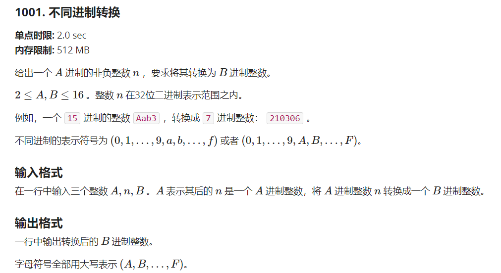​

```C
#include <stdio.h>
#include <ctype.h>
#include <string.h>

#define N 40
const char MAP[] = "0123456789ABCDEF";
int cnt = 0;

void solve(int a, int b, char str[])
{
    char ret_val[N];
    int res = 0;
        for (int i = 0; str[i]; i++)
        {
            int add;
            if (isalpha(str[i]))
                add = str[i] - 'A' + 10;
            else add = str[i] - '0';
            res = res * a + add;
        }
  
    while (res)
    {
        ret_val[cnt++] = MAP[res % b];
        res /= b;
    }
    if (!cnt) ret_val[cnt++] = '0';

    for (int i = cnt - 1; i >= 0; i--)
        printf("%c", ret_val[i]);
}

int main(void)
{
    int a, b;
    char str[N];
    memset(str, 0, sizeof(str));

    scanf("%d %s %d", &a, str, &b);

    for (int i = 0 ; str[i]; i++)
    {
        if (isalpha(str[i]))
            str[i] = toupper(str[i]);
    }

    solve(a, b, str);

    return 0;
}
```

​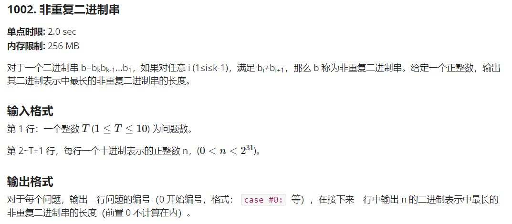​

```C
#include <stdio.h>
#include <string.h>

#define read(X) scanf("%d", &X)
#define N 40
char str[N];

int to2(int x)
{
    int cnt = 0;
    while (x)
    {
        str[cnt++] = x % 2 + '0';
        x /= 2;
    }
    return cnt;
}

int main(void)
{
    int T;
    read(T);

    for (int t = 0; t < T; t++)
    {
        int x;
        int length;
        read(x);
        memset(str, 0, sizeof(str));
        length = to2(x);

        int res = 1, cnt = 1;
        for (int i = 1; i < length; i++)
        {
            if (str[i] == str[i - 1])
            {
                res = (res < cnt ? cnt : res);
                cnt = 1;
            }
            else
                cnt++;
        }
        if (res < cnt) res = cnt;
        printf("case #%d:\n%d\n", t, res);
    }

    return 0;
}
```

​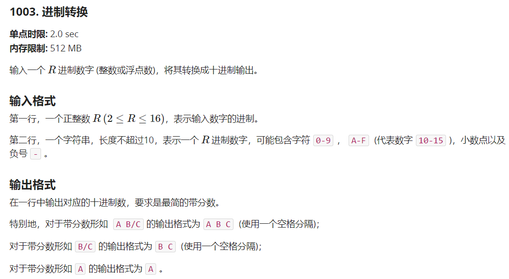​

```C
#include <stdio.h>
#include <ctype.h>

typedef long long LL;
#define N 20
char str[N];
char z[N], f[N];
LL z_num, f_num;
int z_cnt, f_cnt;

int solve(int r)
{
    int signal = 1;

    for (LL i = 0, swit = 0; str[i]; i++)
    {
        if (str[i] == '-')
        {
            signal = -1;
            continue;
        }
        if (str[i] == '.')
        {
            swit = 1;
            continue;
        }

        if (swit)
            f[f_cnt++] = str[i];
        else
            z[z_cnt++] = str[i];
    }

    return signal;
}

LL gcd(LL a, LL b)
{
    return b ? gcd(b, a % b) : a;
}

LL tonum(int r, char a[], int cnt)
{
    LL res = 0;
    for (int i = 0; i < cnt; i++)
    {
        int val;
        if (isalpha(a[i])) val = a[i] - 'A' + 10;
        else val = a[i] - '0';
        res = res * r + val;
    }
    return res;
}

int main(void)
{
    int r;
    scanf("%d %s", &r, str);

    int signal = solve(r);
    z_num = tonum(r, z, z_cnt);
    f_num = tonum(r, f, f_cnt);

    LL dig = 1;
    if (f_num)
    {
      
        for (LL i = 0; i < f_cnt; i++)
            dig = dig * r;
        LL son = gcd(dig, f_num);
        while (son != 1)
        {
            f_num /= son;
            dig /= son;
            son = gcd(dig, f_num);
        }
    }

    if (signal == -1) 
        printf("-");

    if (!z_num && f_num)
    {
        printf("%lld %lld", f_num, dig);
    }
    else if (!f_num && z_num)
    {
        printf("%lld", z_num);
    }
    else if (z_num && f_num)
    {
        printf("%lld %lld %lld", z_num, f_num, dig);
    }
    else
        printf("0");

    return 0;
}
```

​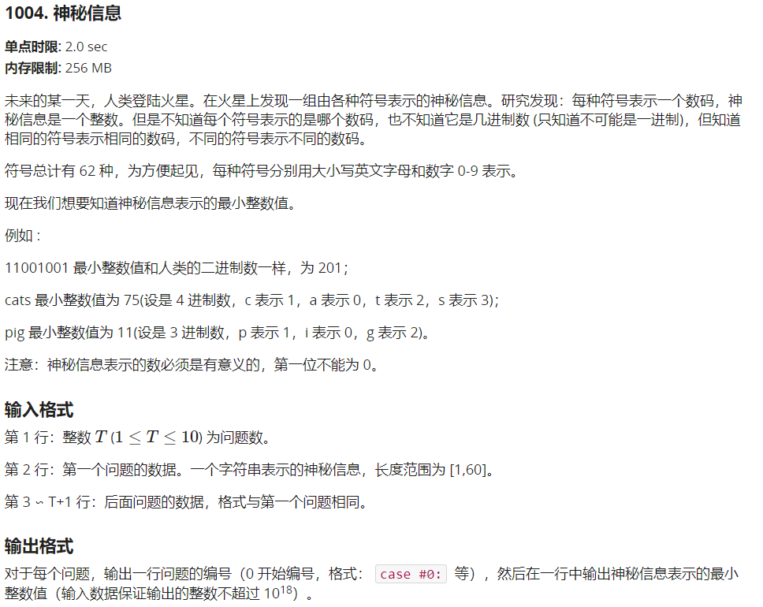​

```C
#include <stdio.h>
#include <string.h>
#include <ctype.h>

#define read(X) scanf("%d", &X)
#define N 70
char str[N];
int quanzhi[N];
typedef long long LL;

int mapin(int x)
{
    if (isupper(x))
        return x - 'A' + 36;
    else if (islower(x))
        return x - 'a' + 10;
    else
        return x - '0';   
}

LL solve(void)
{
    int r = 1;
    for (int i = 0, flag = 0; str[i]; i++)
    {
        int m = mapin(str[i]);
        if (quanzhi[m] != -1)
            continue;
        else
        {
            if (r == 2 && flag == 0)
            {
                quanzhi[m] = 0;
                flag = 1;
            }
            else
                quanzhi[m] = r++;
        }
    }

    LL res = 0;
    for (int i = 0; str[i]; i++)
    {
        res = res * r + quanzhi[mapin(str[i])];
    }
    return res;
}

int main(void)
{
    int T;
    read(T);

    for (int t = 0; t < T; t++)
    {
        memset(str, 0, sizeof(str));
        memset(quanzhi, -1, sizeof(quanzhi));
        scanf("%s", str);

        LL val = solve();
        printf("case #%d:\n", t);
        printf("%lld\n", val);

    }

    return 0;
}
```

​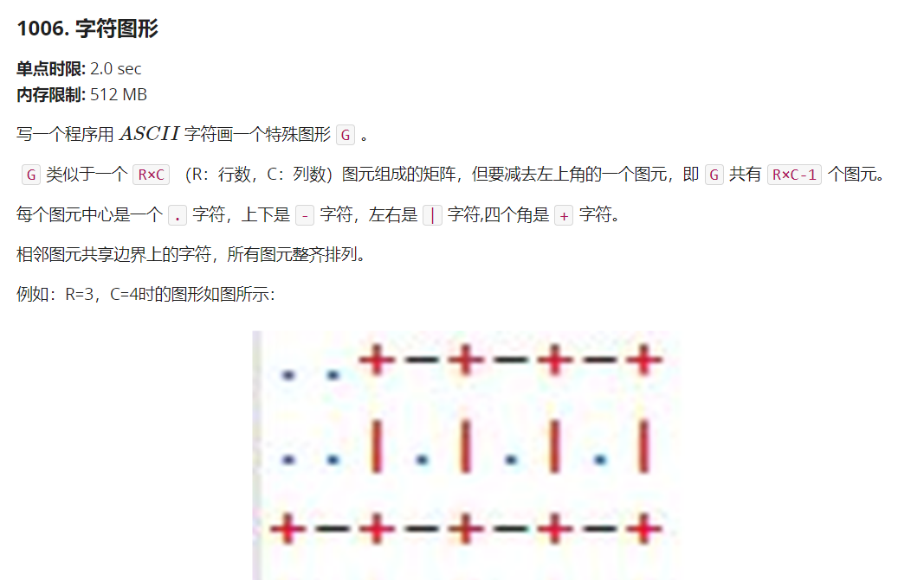​

```C
#include <stdio.h>
#include <string.h>

#define N 30
char q[N][N];
const char MAP[] = "+-|.";


int main(void)
{
    int r, c;
    scanf("%d %d", &r, &c);

    for (int i = 0, row = r * 2 + 1; i < row; i++)
    {
        int flag_r, flag_j;
        if (i & 1) flag_r = 2;
        else flag_r = 0;
        for (int j = 0, col = c * 2 + 1, flag_j = 0; j < col; j++)
        {
            q[i][j] = MAP[flag_j + flag_r];
            flag_j = 1 - flag_j;
        }
    }

    q[0][0] = q[0][1] = q[1][0] = '.';

    for (int i = 0, row = r * 2 + 1; i < row; i++)
    {
        for (int j = 0, col = c * 2 + 1; j < col; j++)
            printf("%c", q[i][j]);
        puts("");
    }

    return 0;
}
```

​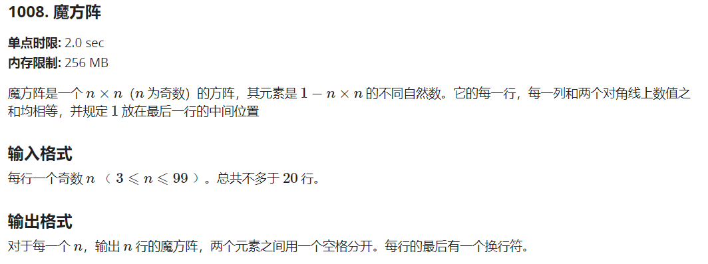​

```C
#include <stdio.h>
#include <string.h>

#define N 110
int q[N][N];

void solve(int n)
{
    int cnt = 1, bond = n * n;
    int i = n - 1, j = n / 2;
    while (cnt <= bond)
    {
        int tmp_i, tmp_j;
        int flag = 1;
        q[i][j] = cnt++;

        tmp_i = (i + 1) % n, tmp_j = (j + n - 1) % n;
        while (q[tmp_i][tmp_j])
        {
            tmp_i = (i - flag + n) % n;
            tmp_j = j;
            flag++;
        }
        i = tmp_i, j = tmp_j;
    }
}

int main(void)
{
    int n;
    while (scanf("%d", &n) != EOF)
    {
        memset(q, 0, sizeof(q));
        solve(n);
        for (int i = 0; i < n; i++)
        {
            for (int j = 0; j < n; j++)
                printf("%d ", q[i][j]);
            puts("");
        }

    }
    return 0;
}
```

​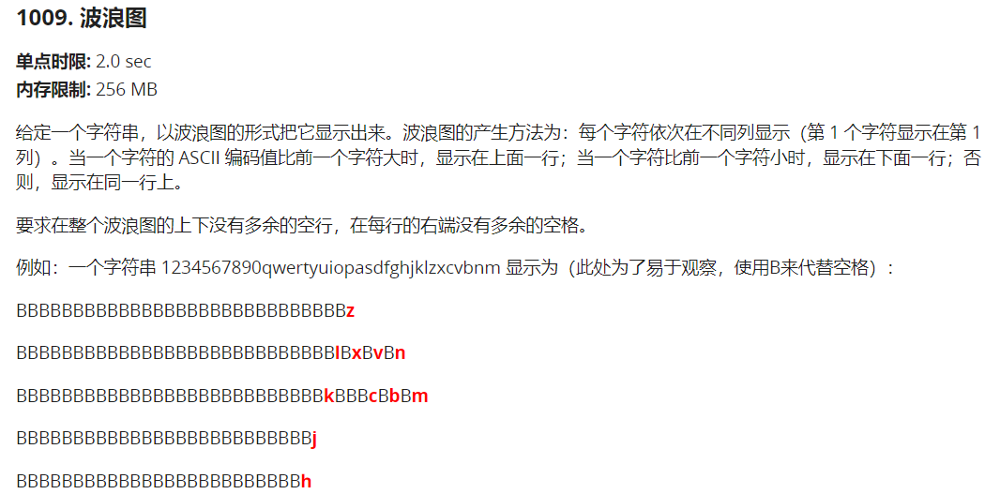​

```C
#include <stdio.h>
#include <string.h>
#include <stdlib.h>

#define N 100
typedef struct point{
    int idx;
    int loc;
    char ch;
} point;
char str[N];

int cmp(const void * a, const void * b)
{
    point pa = *(point*)a, pb = *(point*)b;

    if (pa.idx == pb.idx)
        return pa.loc - pb.loc;
    return pa.idx - pb.idx;
}

int main(void)
{
    while ((scanf("%s", str)) != EOF)
    {
        int loc, cnt;
        int len = strlen(str);
        point * p = (point*)malloc(sizeof(point) * len);
        char res[N];

        p[0].idx = 0, p[0].loc = 0;
        p[0].ch = str[0];
        loc = 1;
        for (int i = 1; i < len; i++)
        {
            int idx;
            if (str[i] == p[i - 1].ch)
                idx = p[i - 1].idx;
            else if (str[i] > p[i - 1].ch)
                idx = p[i - 1].idx - 1;
            else
                idx = p[i - 1].idx + 1;

            p[i].ch = str[i];
            p[i].idx = idx;
            p[i].loc = loc;
            loc++;
        }

        qsort(p, len, sizeof(p[0]), cmp);

        cnt = 0;
        while (cnt < len)
        {
            int index = p[cnt].idx;
            for (int j = 0; j < len; j++)
                res[j] = ' ';

            while (p[cnt].idx == index && cnt < len)
            {
                res[p[cnt].loc] = p[cnt].ch;
                cnt++;
            }

           for (int j = 0; j < len; j++)
                printf("%c", res[j]);
            puts("");
        }

        free(p);
    }
    return 0;
}

```

​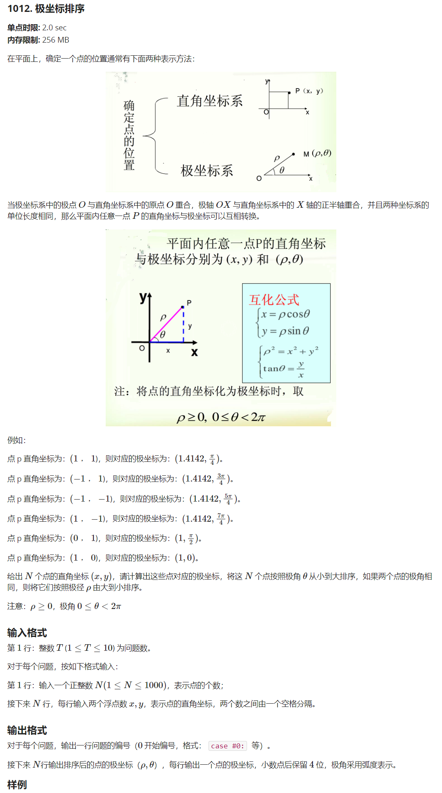​

```C
#include <stdio.h>
#include <math.h>
#include <string.h>
#include <stdlib.h>

#define N 1010
#define read(X) scanf("%d", &X)
#define eps 1e-8
#define PI2 8 * atan(1)
typedef struct{
    double x, y, r, e;
} POINT;
POINT q[N];

int cmp(const void * a, const void * b)
{
    POINT pa = *(POINT*)a, pb = *(POINT*)b;
    if (fabs(pa.e - pb.e) < eps)
    {
        if (fabs(pa.r - pb.r) < eps)
            return -1;
        else if (pa.r - pb.r > eps)
            return -1;
        else
            return 1;
    }
    else if (pa.e - pb.e > eps)
        return 1;
    else
        return -1;
}
int main(void)
{
    int T;
    read(T);

    for (int t = 0; t < T; t++)
    {   
        int n;
        read(n);
        for (int i = 0; i < n; i++)
            scanf("%lf %lf", &q[i].x, &q[i].y);
      
        for (int i = 0; i < n; i++)
        {
            q[i].r = sqrt(pow(q[i].x, 2) + pow(q[i].y, 2));
            q[i].e = atan2(q[i].y, q[i].x);
            if (q[i].e < 0) q[i].e = PI2 + q[i].e;
        }

        qsort(q, n, sizeof(q[0]), cmp);

        printf("case #%d:\n", t);
        for (int i = 0; i < n; i++)
        {
            printf("(%.4f,%.4f)\n", q[i].r, q[i].e);
        }
    }
    return 0;
}
```

​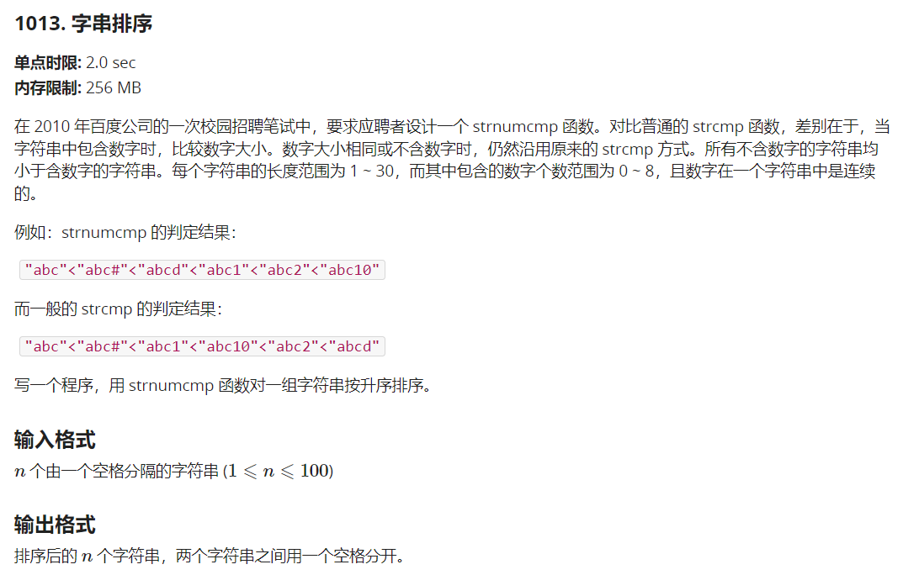​

```C
#include <stdio.h>
#include <stdlib.h>
#include <string.h>

#define N 110
#define M 50

typedef struct sentence{
    int num;
    char str[M];
} sentence;

sentence s[N];
char str[M];
int cnt;

int cmp(const void * a, const void * b)
{
    sentence sa = *(sentence*)a, sb = *(sentence*)b;
    if (sa.num == sb.num)
    {
        return strcmp(sa.str, sb.str);
    }
    return sa.num - sb.num;
}

int main(void)
{
    while ((scanf("%s", str)) != EOF)
    {
        int res = 0, flag = 0;
        for (int i = 0, len = strlen(str); i < len; i++)
        {
            if ('0' <= str[i] && str[i] <= '9')
            {
                flag = 1;
                res = res * 10 + str[i] - '0';
            }
        }
        if (flag) s[cnt].num = res;
        else s[cnt].num = -1;
        strcpy(s[cnt].str, str);
        cnt++;
    }

    qsort(s, cnt, sizeof(s[0]), cmp);

    for (int i = 0; i < cnt; i++)
    {
        printf("%s ", s[i].str);
    }

    return 0;
}

```

​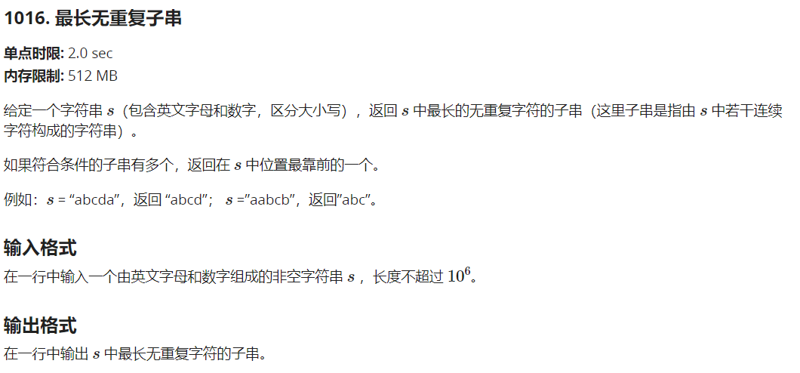​

```C
#include <stdio.h>
#include <stdlib.h>
#include <string.h>
#include <ctype.h>

#define N 1000010
#define M 100
char str[N];
int st[M];

int mapIn(char ch)
{
    if (isdigit(ch))
        return ch - '0';
    else if (isupper(ch))
        return ch - 'A' + 10;
    else
        return ch - 'a' + 36;

}

void solve(char str[])
{
    int maxLoc, maxLength;

    maxLoc = 0, maxLength = 1;
    int i, j, len;

    i = j = 0;
    len = strlen(str);
    while (j < len)
    {
        while (st[mapIn(str[j])])
        {
            st[mapIn(str[i])] = 0;
            i++;
        }
        st[mapIn(str[j])] = 1;
        j++;
        if (j - i > maxLength)
        {
            maxLength = j - i;
            maxLoc = i;
        }
    }

    for (int w = 0; w < maxLength; w++)
        printf("%c", str[w + maxLoc]);

}


int main(void)
{
    scanf("%s", str);

    solve(str);

    return 0;
}

```

​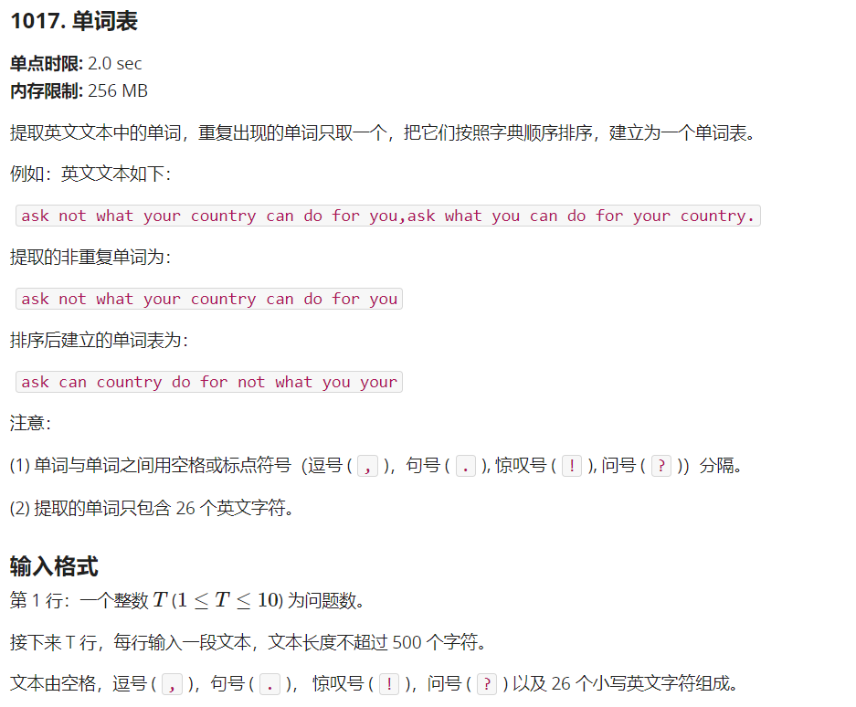​

```C
#include <stdio.h>
#include <string.h>
#include <stdlib.h>

#define N 510
char strings[N][N];
const char MAP[] = " ,.?!";


int issplit(char ch)
{
    for (int i = 0; i < 5; i++)
        if (ch == MAP[i])
            return 1;
    return 0;
}

int cmp(const void * a, const void * b)
{
    return strcmp(*(char(*)[N])a, (*(char(*)[N])b));
}

int unique(int n)
{
    int i, j;
    for (i = 0, j = i; j < n; i++)
    {
        while (!strcmp(strings[i], strings[j]) && j < n)
        {
            j++;
        }
        if (j < n) strcpy(strings[i + 1], strings[j]);
    }
    return i;
}

int main(void)
{
    int T;
    scanf("%d", &T);
    getchar();

    for (int t = 0; t < T; t++)
    {
        int cnt = 0, len = 0;
        char ch;
        memset(strings, 0, sizeof(strings));
        while ((ch = getchar()) != '\n')
        {
            if (issplit(ch))
            {
                if (len)
                {
                    strings[cnt++][len] = '\0';
                    len = 0;
                }
            }
            else
                strings[cnt][len++] = ch;

        }
        if (len) strings[cnt++][len] = '\0';

        qsort(strings, cnt, sizeof(strings[0]), cmp);

        cnt = unique(cnt);

        printf("case #%d:\n", t);
        for (int i = 0; i < cnt; i++)
        {
            printf("%s ",strings[i]);
        }
        puts("");

    }
    return 0;
}

```

​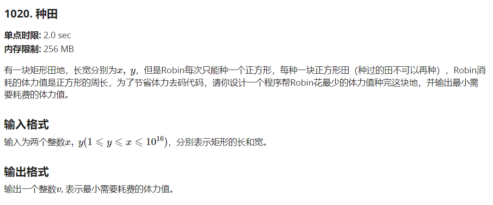​

```C
#include <stdio.h>
#include <string.h>

typedef long long LL;

int main(void)
{
    LL x, y;
    scanf("%lld %lld", &x, &y);

    LL c = 0;

    while (y > 0)
    {
        LL time = x / y;
        c += time * 4 * y;
        x = x % y;
        if (x < y)
        {
            LL t = x;
            x = y;
            y = t;
        }
    }
    printf("%lld", c);

    return 0;
}
```

​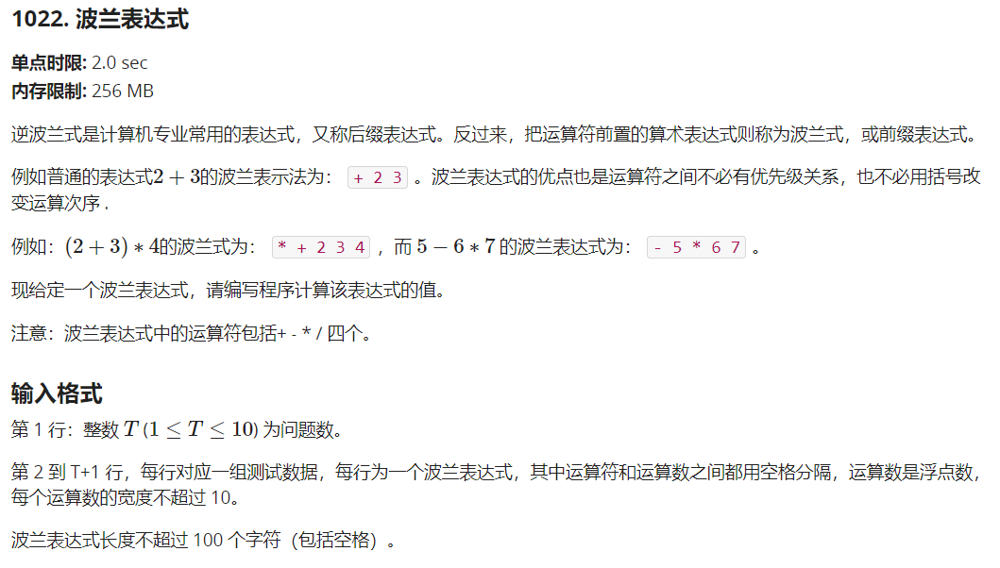​

```C
#include <stdio.h>
#include <string.h>
#include <stdlib.h>
#include <ctype.h>

#define read(X) scanf("%d", &X)
#define N 110
#define M 15
double stack[N];
int top = 0;
char str[N][M];

double calculate(double a, double b, char c)
{
    switch (c)
    {
        case '+': return b + a;
        case '-': return b - a;
        case '*': return b * a;
        case '/': return b / a;
    }
}

int main(void)
{
    int T;
    read(T);
    getchar();

    for (int t=  0; t <T; t++)
    {
        int cnt = 0;

        do{
            scanf("%s", str[cnt++]);
        } while (getchar() != '\n');

        top = 0;
        for (int i = cnt - 1; i >= 0; i--)
        {
            if (isdigit(str[i][0]))
            {
                stack[top++] = atof(str[i]);
            }
            else
            {
                double a = stack[--top];
                double b = stack[--top];
                stack[top++] = calculate(b, a , str[i][0]);
            }
        }

        printf("case #%d:\n", t);
        printf("%.6f\n", stack[0]);
    }

    return 0;
}

```

​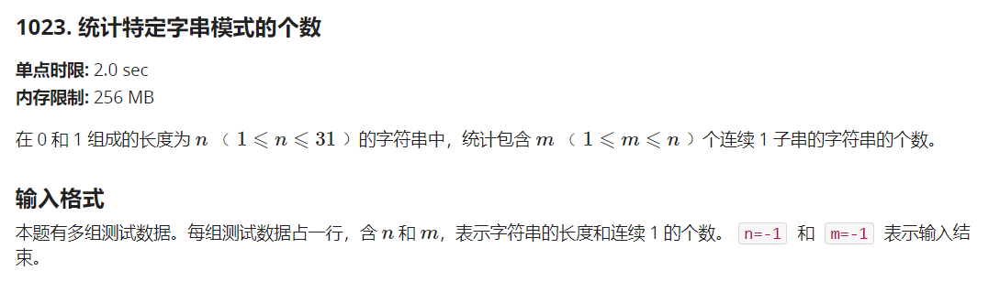​

```C
#include <stdio.h>
#include <string.h>
#include <stdlib.h>

#define N 40
int f[N][N];

int power(int a, int b)
{
    int res = 1;
    while (b)
    {
        if (b & 1) res = res * a;
        a = a * a;
        b >>= 1;
    }
    return res;
}

int dfs(int n, int m)
{
    if (n < m) return 0;
    if (n == m) return 1;

    f[n][m] = 2 * dfs(n - 1, m) - dfs(n - m - 1, m) + power(2, n - m - 1);

    return f[n][m];
}

int main(void)
{
    int n, m;
    memset(f, -1, sizeof(f));

    while ((scanf("%d %d", &n, &m)) && n != -1 && m != -1)
    {
        printf("%d\n", dfs(n, m));
    }

    return 0;
}
```

​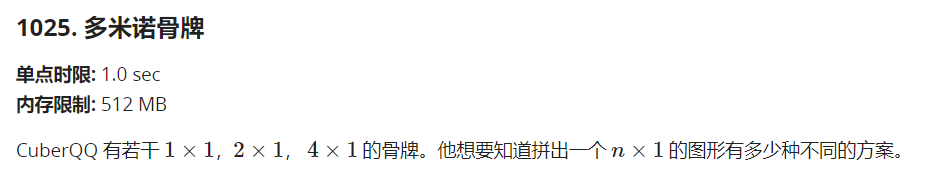​

```C
#include <stdio.h>
#include <stdlib.h>
#include <string.h>

#define N 510

typedef struct BIGInt{
    int num[N];
    int len;
    int sign;
} BIGInt;
typedef long long LL;

BIGInt res[N];
const int init[4] = {1, 2, 3, 6};

BIGInt addBigInt(BIGInt a, BIGInt b)
{
    int t = 0, i;
    BIGInt ret;
    for (i = 0; i < a.len || i < b.len; i++)
    {
        if (i < a.len) t += a.num[i];
        if (i < b.len) t += b.num[i];
        ret.num[i] = t % 10;
        t /= 10;
    }
    if (t) ret.num[i++] = 1;
    ret.len = i;

    return ret;
}

void solve(int n)
{
    for (int i = 5; i <= n; i++)
    {
        res[i] = addBigInt(addBigInt(res[i - 1], res[i - 2]), res[i - 4]);
    }
}

void outputBigInt(int n)
{
    for (int i = res[n].len - 1; i >= 0; i--)
        printf("%d", res[n].num[i]);
    puts("");
}

int main(void)
{
    int n;
    scanf("%d", &n);

    for (int i = 1; i <= 4; i++)
    {
        res[i].num[0] = init[i - 1];
        res[i].len = 1;
    }
  
    if (n > 4)
        solve(n);
  
    outputBigInt(n);

    return 0;
}
```

​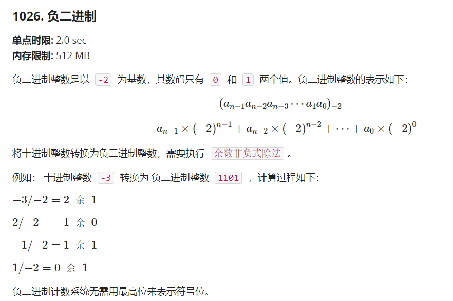​

```C
#include <stdio.h>
#include <string.h>

#define N 110
#define M 500
int A[N];
char a[N];
int res[M];
const int b = 2;
int cnt = 0, len = 0;

void add(int w)
{
    int t = w;
    for (int i = 0; i < len; i++)
    {
        t += A[i];
        A[i] = t % 10;
        t /= 10;
        if (!t) break;
    }
    if (t) A[len++] = 1;
}

void divide(void)
{
    int tmp[N];
    int t = 0, j = 0;
    for (int i = len - 1; i >= 0; i--)
    {
        t = t * 10 + A[i];
        tmp[j++] = t / b;
        t %= b;
    }
    len = j;

    for (int i = 0, j = len - 1; i < len; i++, j--)
        A[i] = tmp[j];

    while (len > 1 && A[len - 1] == 0) len--;

}

void solve(int signal)
{
    //注意0
    do
    {
        if (A[0] % 2 == 1)
        {
            res[cnt++] = 1;  //负二进制
            if (signal < 0) add(1);  //负数加一
        }
        else res[cnt++] = 0;

        divide();
        signal = -signal;
    } while (!(len == 1 && A[0] == 0));
}

int main(void)
{
    int signal = 1;
    char * ap;
    scanf("%s", a);
  
    len = strlen(a);
    ap = a;
    if (a[0] == '-')
    {
        signal = -1;
        ap = a + 1;
        len--;
    }

    for (int i = len - 1, j = 0; i >= 0; i--, j++)
        A[j] = ap[i] - '0';

    solve(signal);

    for (int i = cnt - 1; i >= 0; i--)
        printf("%d", res[i]);
    printf("\n");

    return 0;
}
```

​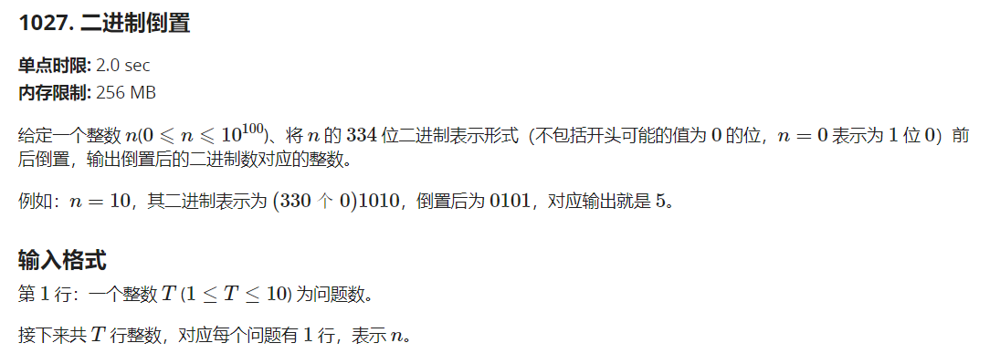​

```C
#include <stdio.h>
#include <string.h>
#include <stdlib.h>

#define N 110
#define M 350
typedef struct bigInt{
	int number[N];
	int len;
} bigInt;
char str[N];

bigInt divBigInt(bigInt A, int b, int * r)
{
	bigInt resBigInt;
	int t = 0;
	int cnt = 0;
	int tmpNumber[N];
	for (int i = A.len - 1; i >= 0; i--)
	{
		t = t * 10 + A.number[i];
		tmpNumber[cnt++] = t / 2;
		t %= 2;
	}
	*r = t;
	for (int i = 0, j = cnt - 1; i < cnt; i++, j--)
		resBigInt.number[i] = tmpNumber[j];

	while (cnt > 1 && resBigInt.number[cnt - 1] == 0) cnt--;

	resBigInt.len = cnt;

	return resBigInt;
}

bigInt mulBigInt(bigInt A, int b)
{
	bigInt res;
	int t = 0, i;
	for (i = 0; t || i < A.len; i++)
	{
		if (i < A.len) t = t + A.number[i] * b;
		res.number[i] = t % 10;
		t /= 10;
	}
	res.len = i;
	return res;
}

bigInt addBigInt(int x, bigInt A)
{
	int t = x;
	for (int i = 0; i < A.len; i++)
	{
		t += A.number[i];
		A.number[i] = t % 10;
		t /= 10;
		if (!t) break;
	}
	if (t) A.number[A.len++] = 1;
	return A;
}

void showBigInt(bigInt A)
{
	for (int i = A.len - 1; i >= 0; i--)
		printf("%d", A.number[i]);
	puts("");
}

int main(void)
{
	int T;
	scanf("%d", &T);
	for (int t = 0; t < T; t++)
	{
		bigInt bi;
		bigInt res;
		int to2[M] = {0};
		int len;
		int rest, cnt = 0, start;
	
		//input
		scanf("%s", str);
		len = strlen(str);
		for (int i = len - 1, j = 0; i >= 0; i--, j++)
			bi.number[j] = str[i] - '0';
		bi.len = len;

		//to2
		while (!(bi.number[0] == 0 && bi.len == 1))
		{
			bi = divBigInt(bi, 2, &rest);
			to2[cnt++] = rest;
		}
		while (cnt > 0 && to2[cnt - 1] == 0) cnt--;
		for (start = 0; start < cnt && to2[start] == 0; start++) ;

		res.number[0] = 0;
		res.len = 1;
		for (int i = start; i < cnt; i++)
		{
			if (to2[i])
				res = addBigInt(1, mulBigInt(res, 2));
			else
				res = mulBigInt(res, 2);
		}
		printf("case #%d:\n", t);
		showBigInt(res);
	}

	return 0;
}
```

​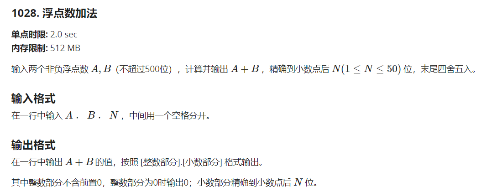​

```C
#include <stdio.h>
#include <string.h>
#include <stdlib.h>

#define N 1010
#define POINT 500
typedef struct
{
	int lowLimit, highLimit, nums[N];
} NUM;
// lowLimit (Decimal POINT Integer) highLimit

int MIN(int a, int b)
{
	if (a < b)
		return a;
	return b;
}

int MAX(int a, int b)
{
	if (a > b)
		return a;
	return b;
}

NUM read()
{
	NUM res = {POINT - 1, POINT, {0}};
	char str[N];
	scanf("%s", str);

	int point = 0;
	int len = strlen(str);
	while (str[point] != '.' && point < len)
		point++;

	if (point != 0) // 整数部分不为空
	{
		for (int i = point - 1; i >= 0; i--) // 存整数
			res.nums[res.highLimit++] = str[i] - '0';
	}
	else
		res.nums[res.highLimit++] = 0;

	for (int i = point + 1; i < len; i++)
		res.nums[res.lowLimit--] = str[i] - '0';

	while (res.highLimit > POINT + 1 && res.nums[res.highLimit - 1] == 0)
		res.highLimit--;
	return res;
}

NUM add(NUM a, NUM b, int n)
{
	NUM res = {POINT - 1, POINT, {0}};

	int start = MIN(a.lowLimit, b.lowLimit);
	int end = MAX(a.highLimit, b.highLimit);
	res.lowLimit = start, res.highLimit = end;

	int t = 0;
	for (; start < end; start++)
	{
		if (start < a.highLimit)
			t += a.nums[start];
		if (start < b.highLimit)
			t += b.nums[start];
		res.nums[start] = t % 10;
		t /= 10;
	}
	if (t)
		res.nums[res.highLimit++] = 1;

	// 四舍五入
	if (res.nums[POINT - n - 1] >= 5)
	{
		t = 1;
		for (int i = POINT - n; i < res.highLimit; i++)
		{
			t += res.nums[i];
			res.nums[i] = t % 10;
			t /= 10;
			if (t == 0)
				break;
		}
	}
	res.lowLimit = POINT - n - 1;
	return res;
}

void show(NUM a)
{
	for (int i = a.highLimit - 1; i > a.lowLimit; i--)
	{
		if (i == POINT - 1)
			printf(".");
		printf("%d", a.nums[i]);
	}
}
int main(void)
{
	NUM A, B;
	int n;
	A = read();
	B = read();
	scanf("%d", &n);

	NUM C = add(A, B, n);
	show(C);
	return 0;
}
```

​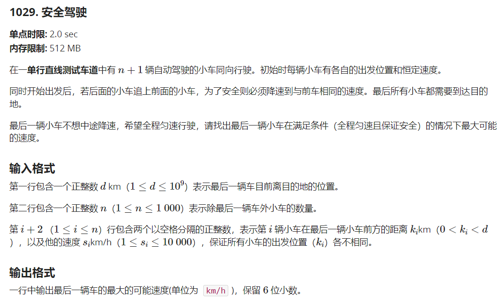​

```C
#include <stdio.h>
#include <stdlib.h>

#define N 1010
#define read(X) scanf("%d", &X)
typedef struct{
    double k, s;
} car;
car q[N];

int cmp(const void * a, const void * b)
{
    car ca = *(car*)a, cb = *(car*)b;
    if (ca.k > cb.k)
        return 1;
    return -1;
}

double lastCarReach(int d, int n)
{
    double resTime = q[0].k / q[0].s;
    for (int i = 1; i < n; i++)
    {
        double x = q[i].k / q[i].s;
        if (resTime < x) resTime = x;
    }
    return resTime;
}

int main(void)
{
    int d, n;
    double time;
    read(d), read(n);

    for (int i = 0; i < n; i++)
    {
        double x;
        scanf("%lf %lf", &x, &q[i].s);
        q[i].k = d - x;
    }

    qsort(q, n, sizeof(q[0]), cmp);

    time = lastCarReach(d, n);

    printf("%.6f\n", d / time);

    return 0;
}
```

​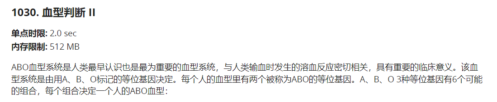​

​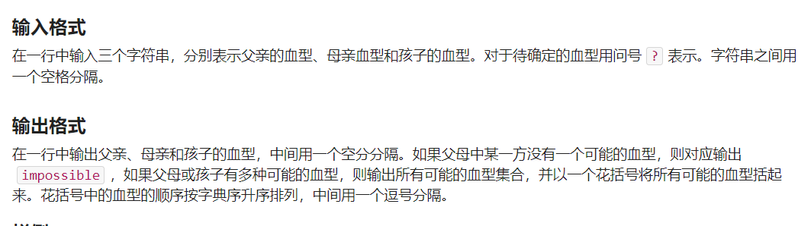​

```C
#include <stdio.h>
#include <string.h>
#include <stdlib.h>

#define N 20

const char MAPIN[][3] = {"", "A", "B", "AB", "O"};

int ANS_ABO[4][4];

int cmp(const void *a, const void *b)
{
	return strcmp((char *)a, (char *)b);
}

int compare(char p[])
{
	if (!strcmp(p, "A"))
		return 1;
	else if (!strcmp(p, "B"))
		return 2;
	else if (!strcmp(p, "AB"))
		return 3;
	else
		return 4;
}

void setting(int c1, int c2)
{
	if (c1 == 1)
		ANS_ABO[0][1] = ANS_ABO[0][3] = 1;
	else if (c1 == 2)
		ANS_ABO[0][2] = ANS_ABO[0][3] = 1;
	else if (c1 == 3)
		ANS_ABO[0][1] = ANS_ABO[0][2] = 1;
	else
		ANS_ABO[0][3] = 1;

	if (c2 == 1)
		ANS_ABO[1][0] = ANS_ABO[3][0] = 1;
	else if (c2 == 2)
		ANS_ABO[2][0] = ANS_ABO[3][0] = 1;
	else if (c2 == 3)
		ANS_ABO[1][0] = ANS_ABO[2][0] = 1;
	else
		ANS_ABO[3][0] = 1;
}

int P2S(char output[][3])
{
	int res = 0;
	if (ANS_ABO[1][1] || ANS_ABO[1][3] || ANS_ABO[3][1])
		strcpy(output[res++], MAPIN[1]);

	if (ANS_ABO[2][2] || ANS_ABO[2][3] || ANS_ABO[3][2])
		strcpy(output[res++], MAPIN[2]);

	if (ANS_ABO[1][2] || ANS_ABO[2][1])
		strcpy(output[res++], MAPIN[3]);

	if (ANS_ABO[3][3])
		strcpy(output[res++], MAPIN[4]);
	return res;
}

void setting2(int c, int s)
{
	if (c == 1)
		ANS_ABO[0][1] = ANS_ABO[0][3] = 1;
	else if (c == 2)
		ANS_ABO[0][2] = ANS_ABO[0][3] = 1;
	else if (c == 3)
		ANS_ABO[0][1] = ANS_ABO[0][2] = 1;
	else
		ANS_ABO[0][3] = 1;

	if (s == 1)
		ANS_ABO[1][1] = ANS_ABO[1][3] = ANS_ABO[3][1] = 1;
	else if (s == 2)
		ANS_ABO[2][2] = ANS_ABO[2][3] = ANS_ABO[3][2] = 1;
	else if (s == 3)
		ANS_ABO[1][2] = ANS_ABO[2][1] = 1;
	else
		ANS_ABO[3][3] = 1;
}

int S2P(char output[][3])
{
	int res = 0;
	for (int i = 1; i <= 3; i++)
	{
		for (int j = 1; j <= 3; j++)
		{
			ANS_ABO[i][0] |= ANS_ABO[i][j] & ANS_ABO[0][j];
		}
	}
	if (ANS_ABO[1][0] || ANS_ABO[3][0])
		strcpy(output[res++], MAPIN[1]);
	if (ANS_ABO[2][0] || ANS_ABO[3][0])
		strcpy(output[res++], MAPIN[2]);
	if (ANS_ABO[1][0] || ANS_ABO[2][0])
		strcpy(output[res++], MAPIN[3]);
	if (ANS_ABO[3][0])
		strcpy(output[res++], MAPIN[4]);
	return res;
}

void solve(char p1[], char p2[], char son[])
{
	char output[4][3];
	if (!strcmp(son, "?")) // 亲推子
	{
		int c1 = compare(p1), c2 = compare(p2);
		setting(c1, c2);
		for (int i = 1; i <= 3; i++)
		{
			for (int j = 1; j <= 3; j++)
			{
				ANS_ABO[i][j] = ANS_ABO[i][0] & ANS_ABO[0][j];
			}
		}

		int cnt = P2S(output);
		qsort(output, cnt, sizeof(output[0]), cmp);
		printf("%s %s ", p1, p2);
		printf("{");
		for (int i = 0; i < cnt; i++)
			printf("%s%c", output[i], (i == cnt - 1) ? '}' : ',');
	}
	else // 亲子推亲
	{
		if (!strcmp(p1, "?"))
		{
			int c = compare(p2), s = compare(son);
			setting2(c, s);
			int cnt = S2P(output);
			qsort(output, cnt, sizeof(output[0]), cmp);
			if (cnt)
			{
				printf("{");
				for (int i = 0; i < cnt; i++)
					printf("%s%c", output[i], (i == cnt - 1) ? '}' : ',');
			}
			else
				printf("impossible");
			printf(" %s %s", p2, son);
		}
		else
		{
			int c = compare(p1), s = compare(son);
			setting2(c, s);
			int cnt = S2P(output);
			qsort(output, cnt, sizeof(output[0]), cmp);
			printf("%s ", p1);
			if (cnt)
			{
				printf("{");
				for (int i = 0; i < cnt; i++)
					printf("%s%c", output[i], (i == cnt - 1) ? '}' : ',');
			}
			else
				printf("impossible");
			printf(" %s", son);
		}
	}
}

int main(void)
{
	char p1[3], p2[3], son[3];
	scanf("%s %s %s", p1, p2, son);

	solve(p1, p2, son);

	return 0;
}
```

​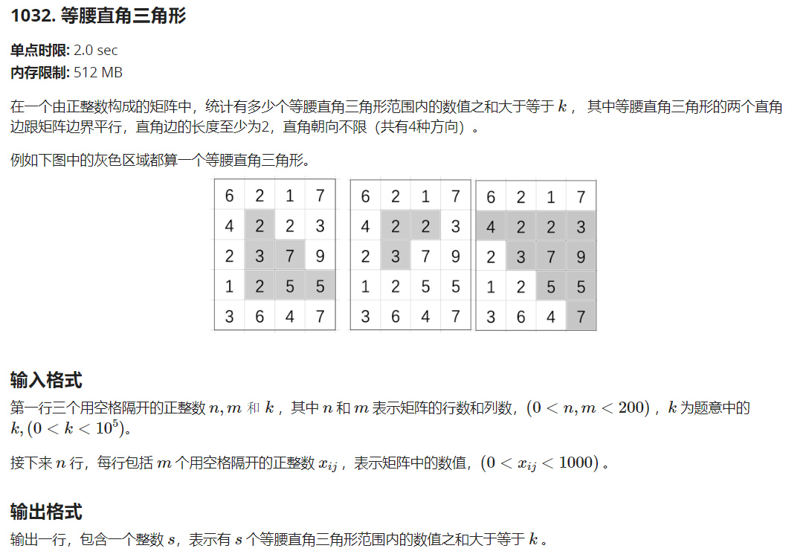​

```C
#include <stdio.h>

int main()
{
	int n, m, k, ans = 0;
	scanf("%d %d %d", &n, &m, &k);
	int matrix[201][201] = {0};
	int presum[201][201] = {0}; // presum[i][j]代表对matrix[i][1]~matrix[i][j]求和

	for (int i = 1; i <= n; i++)
	{
		for (int j = 1; j <= m; j++)
		{
			scanf("%d", &matrix[i][j]);
			presum[i][j] = presum[i][j - 1] + matrix[i][j]; // 前缀和
		}
	}

	int len = (n > m ? m : n);	 // min

	//点向4个方向延伸，注意，每次选取的点应该是一个锐角的顶点，而不是直角顶点
	for (int i = 1; i <= n; i++)
	{
		for (int j = 1; j <= m; j++)
		{
			int tmp = matrix[i][j];
			for (int L = 2; L <= len; L++) // 必须形成三角形
			{
				if (i - L + 1 >= 1 && j - L + 1 >= 1)  //向上和向左延伸
					tmp = tmp + presum[i - L + 1][j] - presum[i - L + 1][j - L];  //把这个点上方一行加入tmp
				else
					break;
				if (tmp >= k)
					ans++;
			}
		}
	}

	for (int i = 1; i <= n; i++)
	{
		for (int j = 1; j <= m; j++)
		{
			int tmp = matrix[i][j];
			for (int L = 2; L <= len; L++)
			{
				if (i - L + 1 >= 1 && j + L - 1 <= m)  //向上和向右延伸
					tmp = tmp + presum[i - L + 1][j + L - 1] - presum[i - L + 1][j - 1];
				else
					break;
				if (tmp >= k)
					ans++;
			}
		}
	}

	for (int i = 1; i <= n; i++)
	{
		for (int j = 1; j <= m; j++)
		{
			int tmp = matrix[i][j];
			for (int L = 2; L <= len; L++)
			{
				if (i + L - 1 <= n && j - L + 1 >= 1)  //点向下和向左延伸
					tmp = tmp + presum[i + L - 1][j] - presum[i + L - 1][j - L];
				else
					break;
				if (tmp >= k)
					ans++;
			}
		}
	}

	for (int i = 1; i <= n; i++)
	{
		for (int j = 1; j <= m; j++)
		{
			int tmp = matrix[i][j];
			for (int L = 2; L <= len; L++)
			{
				if (i + L - 1 <= n && j + L - 1 <= m)  //点向下和向右延伸
					tmp = tmp + presum[i + L - 1][j + L - 1] - presum[i + L - 1][j - 1];
				else
					break;
				if (tmp >= k)
					ans++;
			}
		}
	}

	printf("%d\n", ans);
	return 0;
}
```

​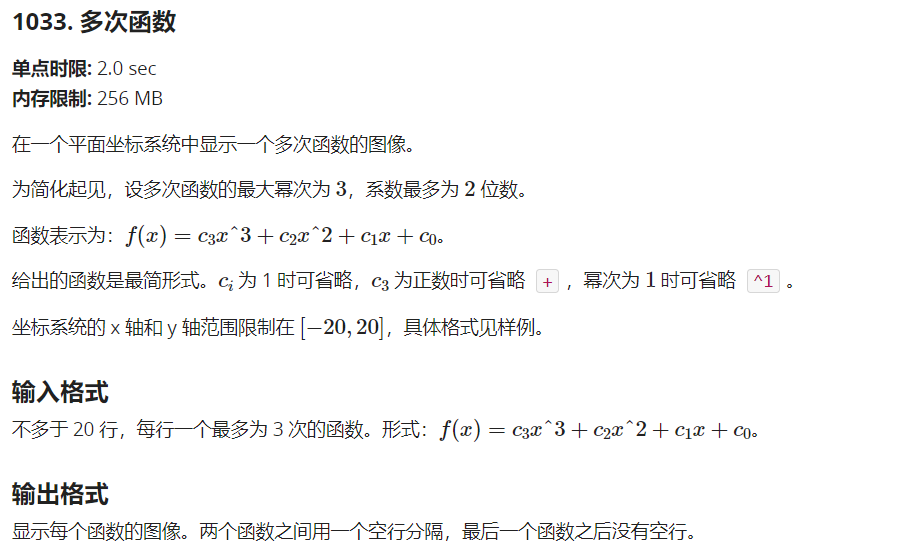​

```C
#include <stdio.h>
#include <string.h>
#include <ctype.h>

int abs(int y)
{
	if (y < 0)
		return -y;
	return y;
}

void readpoly(char *p, int *co)
{
	while (*p)
	{
		int sign = 1, coef = 0, dim = 0;
		if (*p == '+')
			p++;
		else if (*p == '-')
		{
			sign = -1;
			p++;
		}

		while (isdigit(*p))
		{
			coef = coef * 10 + *p - '0';
			p++;
		}

		if (*p != 'x')
		{
			co[0] = coef * sign;
			return;
		}
		else
		{
			if (coef == 0)
				coef = 1;
			p++;
		}

		if (*p == '^')
		{
			p++;
			while (isdigit(*p))
			{
				dim = dim * 10 + *p - '0';
				p++;
			}
		}
		else
			dim = 1;
		co[dim] = coef * sign;
	}
}

int main(void)
{
	char fx[101], graph[50][50];
	int col[50], flag = 0;
	int x, y;
	while (scanf("%s", fx) != EOF)
	{
		// 解析函数式
		memset(col, 0, sizeof(col));
		char *p = fx + 5;
		readpoly(p, col);

		// 初始化坐标系
		memset(graph, '.', sizeof(graph));
		for (int i = 0; i < 41; i++)
		{
			graph[i][41] = '\0';
			graph[i][20] = '|';
			graph[20][i] = '-';
		}
		graph[20][20] = '+';
		graph[0][20] = '^';
		graph[20][40] = '>';

		// 设置点
		for (x = -20; x <= 20; x++)
		{
			y = col[0] + col[1] * x + col[2] * x * x + col[3] * x * x * x;
			if (abs(y) <= 20)
				graph[20 - y][x + 20] = '*';
		}

		// 画图像
		if (flag++ > 0)
			printf("\n"); // 图像之间的间隔
		for (int i = 0; i < 41; i++)
			printf("%s\n", graph[i]);
	}
	return 0;
}
```

​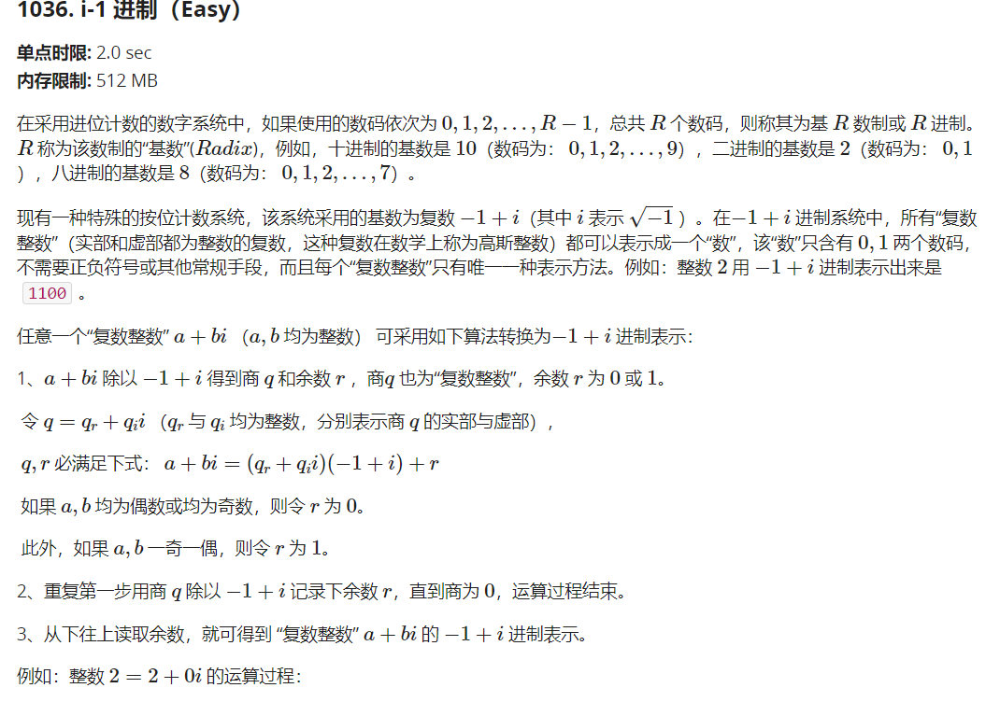​

​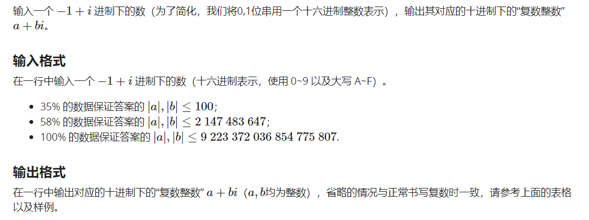​

```C
#include <stdio.h>
#include <string.h>
#include <ctype.h>

#define N 100
typedef long long LL;
const int MAP_A[] = {0, 1, -1, 0, 0, 1, -1, 0, 2, 3, 1, 2, 2, 3, 1, 2};
const int MAP_B[] = {0, 0, 1, 1, -2, -2, -1, -1, 2, 2, 3, 3, 0, 0, 1, 1};
char str[N];

int mapIn(char c)
{
    if (isdigit(c))
        return c - '0';
    else
        return c - 'A' + 10;
}

void solve(char str[])
{
    LL a, b;
    int flag = 0;
    a = b = 0;
    for (int i = 2, len = strlen(str); i < len; i++)
    {
        a *= -4;
        b *= -4;
        a += MAP_A[mapIn(str[i])];
        b += MAP_B[mapIn(str[i])];
    }

    if (a)
    {
        printf("%lld", a);
        flag = 1;
    }

    if (b && flag)  //a != 0
    {
        if (b == 1) printf("+i");
        else if (b == -1) printf("-i");
        else printf("%+lldi", b);
    }
    else if (b && !flag)  //a == 0
    {
        if (b == 1) printf("i");
        else if (b == -1) printf("-i");
        else printf("%lldi", b);
    }
    else if (!b && !flag)
        printf("0");
}

int main(void)
{   
    scanf("%s", str);
  
    solve(str);

    return 0;
}

```

​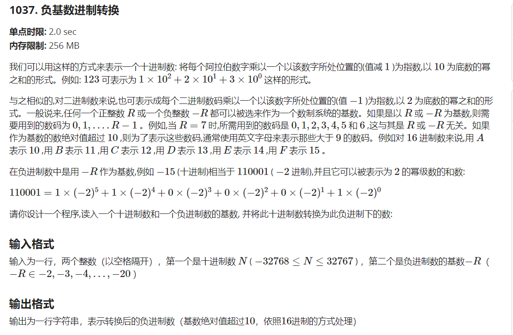​

```C
#include <stdio.h>
#include <string.h>

#define N 100
char ans[N];
const char MAP[] = "0123456789ABCDEFGHIJKLMNOPQRSTUVWXYZ";

int main(void)
{
    int a, k, cnt = 0;
    scanf("%d %d", &a, &k);

    do
    {
        int tmp = a % k;
        if (tmp >= 0)
        {
            ans[cnt++] = MAP[tmp];
            a = a / k;
        }
        else
        {
            ans[cnt++] = MAP[tmp - k];
            a = a / k + 1;
        }
    } while (a);

    for (int i = cnt - 1; i >= 0; i--)
        printf("%c", ans[i]);
    return 0;
}
```

​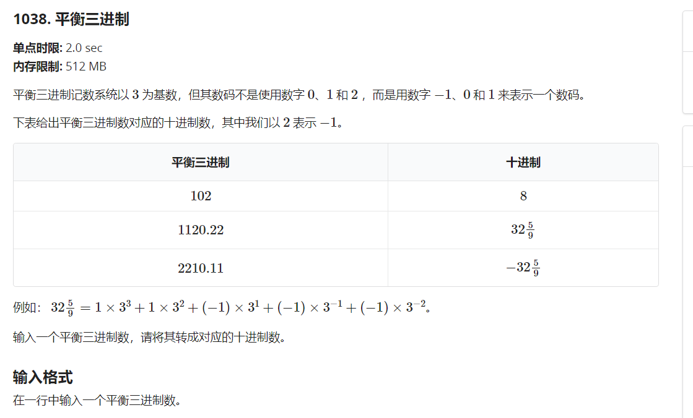​

```C
#include <stdio.h>
#include <string.h>

#define N 40
char str[N];
typedef long long LL;

LL to10(int start, int end)
{
    LL integer = 0;
    for (int i = start; i < end; i++)
    {
        integer *= 3;
        if (str[i] == '1') integer += 1;
        else if (str[i] == '2') integer -= 1;
    }
    return integer;
}

LL gcd(LL a, LL b)
{
    return b ? gcd(b, a % b) : a;
}

LL howPow(int start, int end)
{
    LL res = 1;
    for (int i = start; i < end; i++)
        res *= 3;
    return res;
}

int judge(LL * a)
{
    LL integer = *a;
    if (integer > 0) return 1;
    else if (integer == 0) return 0;
    else
    {
        *a = -integer;
        return -1;
    }
}

int main(void)
{
    scanf("%s", str);
    LL integer, decimal, pow;
    int signalD, signalI, len = strlen(str), point = 0;
    while (str[point] != '.' && point < len) point++;

    integer = to10(0, point);
    decimal = to10(point + 1, len);

    signalD = judge(&decimal);

    if (decimal)
    {
        int g;
        pow = howPow(point + 1, len);
        g = gcd(decimal, pow);
        decimal /= g;
        pow /= g;
    }

    signalI = judge(&integer);

    if (signalI == 0)
    {
        if (signalD < 0)
            printf("-");
        else if (signalD == 0)
            printf("0");
    }
    else if (signalI > 0)
    {
        if (signalD < 0)
        {
            integer--;
            decimal = pow - decimal;
        }
    }
    else
    {
        if (signalD > 0)
        {
            integer--;
            decimal = pow - decimal;
        }
        printf("-");
    }
  
    if (integer)
        printf("%lld ", integer);

    if (signalD)
        printf("%lld %lld", decimal, pow);

    return 0;
}
```

​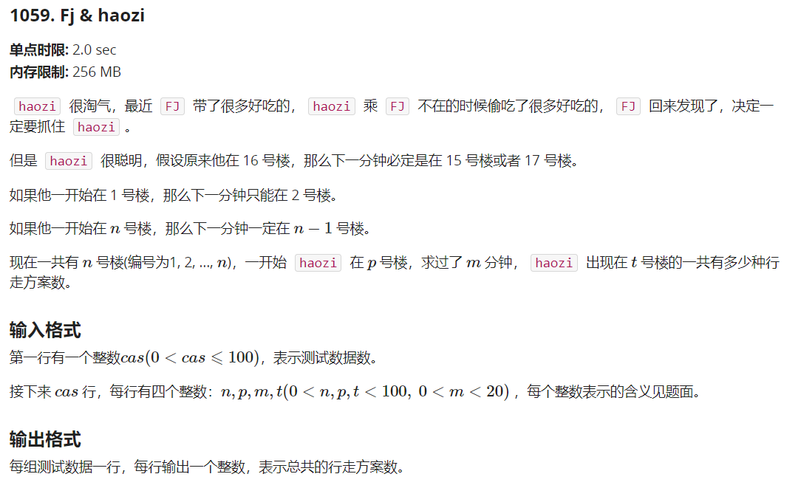​

```C
#include <stdio.h>
#include <string.h>

#define N 110
#define M 30
typedef long long LL;
LL f[M][N];

int main(void)
{
	int T;
	scanf("%d", &T);

	while (T--)
	{
		int n, p, m, t;
		scanf("%d%d%d%d", &n, &p, &m, &t);
		memset(f, 0 ,sizeof(f));

		//m == 1
		if (p - 1 >= 1) f[1][p - 1] = 1;
		if (p + 1 <= n) f[1][p + 1] = 1;

		for (int i = 2; i <= m; i++)
		{
			for (int j = 1; j <= n; j++)
			{
				if (j + 1 <= n) f[i][j] += f[i - 1][j + 1];
				if (j - 1 >= 1) f[i][j] += f[i - 1][j - 1];
			}
		}

		printf("%lld\n", f[m][t]);
	}
	return 0;
}
```

​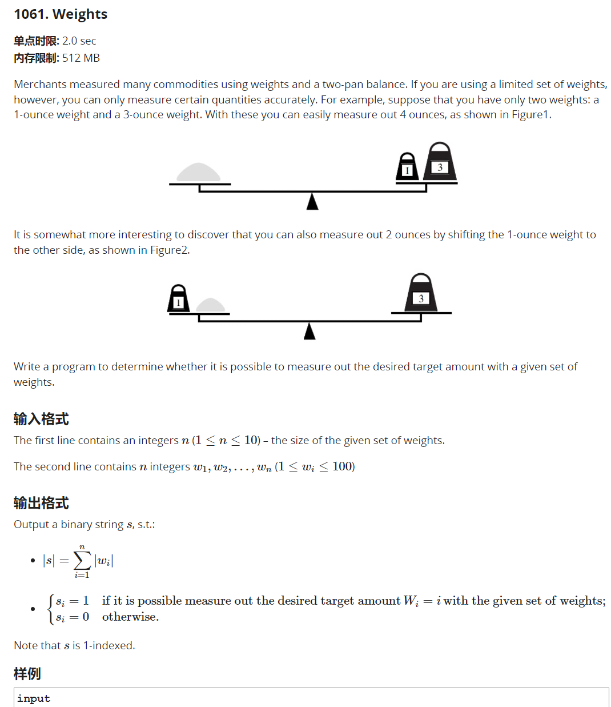​

```C
#include <stdio.h>
#include <stdlib.h>

#define N 15
#define M 2000
int f[M];
int w[N];
int n;

int max(int a, int b)
{
	if (a >= b)
		return a;
	return b;
}

int main()
{
	int total = 0;
	scanf("%d", &n);
	for (int i = 1; i <= n; i++)
	{
		scanf("%d", &w[i]);
		total += w[i];
	}

	f[0] = 1;
	for (int i = 1; i <= n; i++)
	{
		for (int j = total; j >= w[i]; j--)
		{
			f[j] = max(f[j], f[j - w[i]]);
		}
	}

	for (int i = 1; i <= n; i++)
	{
		for (int j = w[i]; j <= total; j++)
		{
			f[j - w[i]] = max(f[j - w[i]], f[j]);
		}
	}

	for (int i = 1; i <= total; i++)
		printf("%d", f[i]);

	return 0;
}
```

​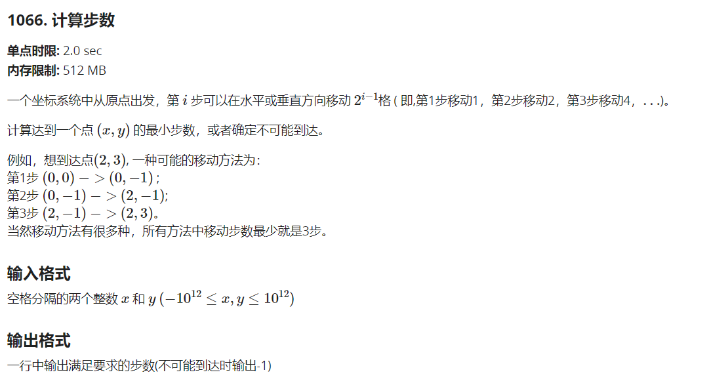​

```C
#include <stdio.h>
#include <string.h>
#include <stdlib.h>

typedef long long LL;

LL ABS(LL x) {
	if (x < 0) return -x;
	return x;
}

int main() {
	LL x, y;
	scanf("%lld %lld", &x, &y);

	x = ABS(x), y = ABS(y);  //坐标轴对称，全部放到第一象限讨论

	int ans = 0;
	//平衡二进制思维，逐步确定每一位
	while (1) {  //每次都除以2，相当于每次都对坐标轴进行一个等比缩放，每次只需要判断是否正好处于，或者是只需要走一步就能到达
		if (x == 0 && y == 0) break;  //(0, 0)点
		ans++;
		if (ABS(x + y) == 1) break;  //走一步可以到达
		if (x % 2 == y % 2) {  //x,y奇偶性相同，说明不可走到，x+y为偶数则不可到达
			printf("-1");
			return 0;
		}
		if (x % 2) {  //调整，保证x为偶数，y为奇数
			LL temp = x;
			x = y;
			y = temp;
		}

		x >>= 1;  //缩放坐标轴

		//t1和t2相差1，一奇一偶
		LL t1 = (y - 1) / 2, t2 = (y + 1) / 2;
		if (x % 2 != t1 % 2) y = t1;
		else y = t2;
	}
	printf("%d", ans);
	return 0;
}
```

​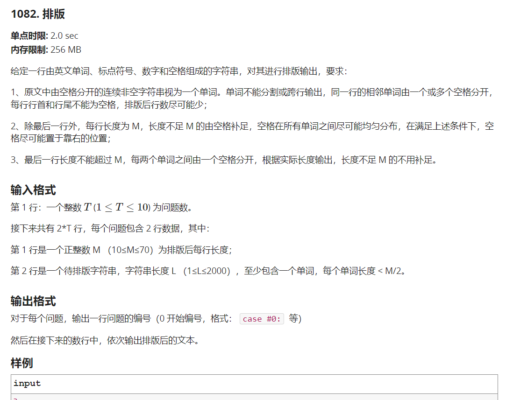​

```C
#include <stdio.h>
#include <stdlib.h>
#include <string.h>

#define N 2010
#define MAXLEN 40
#define M 100

typedef struct {
    char str[MAXLEN];
    int blank;
} string;
string q[M];

char * trim(char str[])
{
    int len = strlen(str);
    int i, j;

    i = 0;
    while (str[i] == ' ') i++;

    j = len - 1;
    while (str[j] == ' ' || str[j] == '\n') j--;

    str[j + 1] = '\0';
    return str + i;
}

void solve(int m)
{
    char inputString[N], *trimmedString;
    int location, lenTrimmed, curLen, cnt;
    fgets(inputString, N, stdin);
    trimmedString = trim(inputString);

    location = curLen = cnt = 0;
    lenTrimmed = strlen(trimmedString);
    do{
        char tmpString[MAXLEN];
        int tmpLen;
        sscanf(trimmedString + location, "%s", tmpString);
        tmpLen = strlen(tmpString);
        for (location += tmpLen; trimmedString[location] == ' '; location++) ;

        if (curLen + tmpLen > m)
        {
            int add, rest;
            rest = m - curLen + q[cnt - 1].blank;
            q[cnt - 1].blank = 0;
            add = rest / (cnt - 1);
            rest %= cnt - 1;

            for (int i = cnt - 2; i >= 0; i--) q[i].blank += add;
            for (int i = cnt - 2; i >= 0 && rest; i--, rest--) q[i].blank++;

            for (int i = 0; i < cnt; i++)
            {
                printf("%s", q[i].str);
                for (int j = 0; j < q[i].blank; j++)
                    printf(" ");
            }
            puts("");

            curLen = cnt = 0;
        }

        curLen += tmpLen;
        if (curLen < m)  //curLen + 1 <= m
            q[cnt].blank = 1;
        else q[cnt].blank = 0;
        curLen += q[cnt].blank;

        strcpy(q[cnt].str, tmpString);
        cnt++;
    } while (location < lenTrimmed);
    for (int i = 0; i < cnt; i++)
    {
        printf("%s%c", q[i].str, (i == cnt - 1) ? '\n' : ' ');
    }

}

int main(void)
{
    int T;
    scanf("%d", &T);
    for (int t = 0; t < T; t++)
    {
        int m;
        scanf("%d", &m);
        getchar();

        printf("case #%d:\n", t);
        solve(m);
    }

    return 0;
}
```

​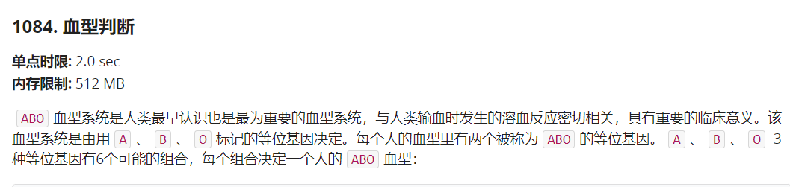​

​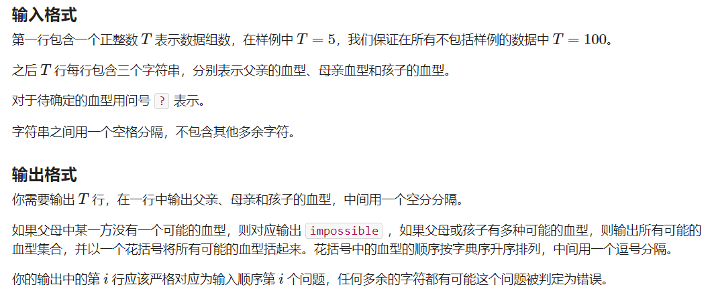​

```C
#include <stdio.h>
#include <string.h>
#include <stdlib.h>

#define N 20

const char MAPIN[][4] = {"", "A+", "B+", "AB+", "O+", "A-", "B-", "AB-", "O-"};

int ANS_ABO[4][4];
int ANS_PH[3][3];

int cmp(const void *a, const void *b)
{
	return strcmp((char *)a, (char *)b);
}

int cmpAlpha(char p[])
{
	if (p[0] == 'A' && p[1] == 'B')
		return 3;
	else if (p[0] == 'A')
		return 1;
	else if (p[0] == 'B')
		return 2;
	else
		return 4;
}

int cmpSign(char p[])
{
	int end = strlen(p) - 1;
	if (p[end] == '+')
		return 1;
	else
		return 2;
}

void setting(int c1, int c2, int s1, int s2)
{
	if (c1 == 1)
		ANS_ABO[0][1] = ANS_ABO[0][3] = 1;
	else if (c1 == 2)
		ANS_ABO[0][2] = ANS_ABO[0][3] = 1;
	else if (c1 == 3)
		ANS_ABO[0][1] = ANS_ABO[0][2] = 1;
	else
		ANS_ABO[0][3] = 1;

	if (c2 == 1)
		ANS_ABO[1][0] = ANS_ABO[3][0] = 1;
	else if (c2 == 2)
		ANS_ABO[2][0] = ANS_ABO[3][0] = 1;
	else if (c2 == 3)
		ANS_ABO[1][0] = ANS_ABO[2][0] = 1;
	else
		ANS_ABO[3][0] = 1;

	if (s1 == 1)
		ANS_PH[0][1] = ANS_PH[0][2] = 1;
	else
		ANS_PH[0][2] = 1;

	if (s2 == 1)
		ANS_PH[1][0] = ANS_PH[2][0] = 1;
	else
		ANS_PH[2][0] = 1;
}

int P2S(char output[][4])
{
	int res = 0;
	if (ANS_ABO[1][1] || ANS_ABO[1][3] || ANS_ABO[3][1])
	{
		if (ANS_PH[1][1] || ANS_PH[1][2] || ANS_PH[2][1])
			strcpy(output[res++], MAPIN[1]);
		if (ANS_PH[2][2])
			strcpy(output[res++], MAPIN[5]);
	}

	if (ANS_ABO[2][2] || ANS_ABO[2][3] || ANS_ABO[3][2])
	{
		if (ANS_PH[1][1] || ANS_PH[1][2] || ANS_PH[2][1])
			strcpy(output[res++], MAPIN[2]);
		if (ANS_PH[2][2])
			strcpy(output[res++], MAPIN[6]);
	}

	if (ANS_ABO[1][2] || ANS_ABO[2][1])
	{
		if (ANS_PH[1][1] || ANS_PH[1][2] || ANS_PH[2][1])
			strcpy(output[res++], MAPIN[3]);
		if (ANS_PH[2][2])
			strcpy(output[res++], MAPIN[7]);
	}
	if (ANS_ABO[3][3])
	{
		if (ANS_PH[1][1] || ANS_PH[1][2] || ANS_PH[2][1])
			strcpy(output[res++], MAPIN[4]);
		if (ANS_PH[2][2])
			strcpy(output[res++], MAPIN[8]);
	}
	return res;
}

void setting2(int c, int s, int s1, int s2)
{
	if (c == 1)
		ANS_ABO[0][1] = ANS_ABO[0][3] = 1;
	else if (c == 2)
		ANS_ABO[0][2] = ANS_ABO[0][3] = 1;
	else if (c == 3)
		ANS_ABO[0][1] = ANS_ABO[0][2] = 1;
	else
		ANS_ABO[0][3] = 1;

	if (s == 1)
		ANS_ABO[1][1] = ANS_ABO[1][3] = ANS_ABO[3][1] = 1;
	else if (s == 2)
		ANS_ABO[2][2] = ANS_ABO[2][3] = ANS_ABO[3][2] = 1;
	else if (s == 3)
		ANS_ABO[1][2] = ANS_ABO[2][1] = 1;
	else
		ANS_ABO[3][3] = 1;

	if (s1 == 1)
		ANS_PH[0][1] = ANS_PH[0][2] = 1;
	else
		ANS_PH[0][2] = 1;

	if (s2 == 1)
		ANS_PH[1][1] = ANS_PH[1][2] = ANS_PH[2][1] = 1;
	else
		ANS_PH[2][2] = 1;
}

int S2P(char output[][4])
{
	int res = 0;
	for (int i = 1; i <= 3; i++)
	{
		for (int j = 1; j <= 3; j++)
		{
			ANS_ABO[i][0] |= ANS_ABO[i][j] & ANS_ABO[0][j];
		}
	}

	for (int i = 1; i <= 2; i++)
	{
		for (int j = 1; j <= 2; j++)
			ANS_PH[i][0] |= ANS_PH[i][j] & ANS_PH[0][j];
	}

	if (ANS_ABO[1][0] || ANS_ABO[3][0])
	{
		//if (ANS_PH[1][0])
			strcpy(output[res++], MAPIN[1]);
		if (ANS_PH[2][0])
			strcpy(output[res++], MAPIN[5]);
	}
	if (ANS_ABO[2][0] || ANS_ABO[3][0])
	{
		//if (ANS_PH[1][0])
			strcpy(output[res++], MAPIN[2]);
		if (ANS_PH[2][0])
			strcpy(output[res++], MAPIN[6]);
	}
	if (ANS_ABO[1][0] || ANS_ABO[2][0])
	{
		//if (ANS_PH[1][0])
			strcpy(output[res++], MAPIN[3]);
		if (ANS_PH[2][0])
			strcpy(output[res++], MAPIN[7]);
	}
	if (ANS_ABO[3][0])
	{
		//if (ANS_PH[1][0])
			strcpy(output[res++], MAPIN[4]);
		if (ANS_PH[2][0])
			strcpy(output[res++], MAPIN[8]);
	}
	return res;
}

void solve(char p1[], char p2[], char son[])
{
	char output[8][4];
	if (!strcmp(son, "?")) // 亲推子
	{
		int c1 = cmpAlpha(p1), c2 = cmpAlpha(p2);
		int s1 = cmpSign(p1), s2 = cmpSign(p2);
		setting(c1, c2, s1, s2);
		for (int i = 1; i <= 3; i++)
			for (int j = 1; j <= 3; j++)
				ANS_ABO[i][j] = ANS_ABO[i][0] & ANS_ABO[0][j];

		for (int i = 1; i <= 2; i++)
			for (int j = 1; j <= 2; j++)
				ANS_PH[i][j] = ANS_PH[i][0] & ANS_PH[0][j];

		int cnt = P2S(output);
		qsort(output, cnt, sizeof(output[0]), cmp);
		printf("%s %s ", p1, p2);
		if (cnt == 1)
			printf("%s", output[0]);
		else
		{
			printf("{");
			for (int i = 0; i < cnt; i++)
				printf("%s%c", output[i], (i == cnt - 1) ? '}' : ',');
		}
	}
	else // 亲子推亲
	{
		if (!strcmp(p1, "?"))
		{
			int c = cmpAlpha(p2), s = cmpAlpha(son);
			int s1 = cmpSign(p2), s2 = cmpSign(son);
			setting2(c, s, s1, s2);

			int cnt = S2P(output);
			qsort(output, cnt, sizeof(output[0]), cmp);
			if (cnt)
			{
				if (cnt == 1)
					printf("%s", output[0]);
				else
				{
					printf("{");
					for (int i = 0; i < cnt; i++)
						printf("%s%c", output[i], (i == cnt - 1) ? '}' : ',');
				}
			}
			else
				printf("impossible");
			printf(" %s %s", p2, son);
		}
		else
		{
			int c = cmpAlpha(p1), s = cmpAlpha(son);
			int s1 = cmpSign(p1), s2 = cmpSign(son);
			setting2(c, s, s1, s2);
			int cnt = S2P(output);
			qsort(output, cnt, sizeof(output[0]), cmp);
			printf("%s ", p1);
			if (cnt)
			{
				if (cnt == 1)
					printf("%s", output[0]);
				else
				{
					printf("{");
					for (int i = 0; i < cnt; i++)
						printf("%s%c", output[i], (i == cnt - 1) ? '}' : ',');
				}
			}
			else
				printf("impossible");
			printf(" %s", son);
		}
	}
}

int main(void)
{
	char p1[4], p2[4], son[4];
	int T;
	scanf("%d", &T);
	while (T--)
	{
		memset(ANS_ABO, 0, sizeof(ANS_ABO));
		memset(ANS_PH, 0, sizeof(ANS_PH));
		scanf("%s %s %s", p1, p2, son);
		solve(p1, p2, son);
		puts("");
	}

	return 0;
}
```

​​

```C
#include <stdio.h>
#include <stdlib.h>
#include <string.h>

char * convert(char Octal[])
{
	char * decimal;
	int numbers = 0;
	int len = strlen(Octal) - 1;
	decimal = (char*)malloc(200);
	for (; len != 1; len--)
	{
		int digit = Octal[len] - '0';
		int j = 0;
		int temp;
		do {
			if (j < numbers)
				temp = digit * 10 + decimal[j] - '0';
			else
				temp = digit * 10;
			decimal[j++] = temp / 8 + '0';
			digit = temp % 8;
		} while (digit != 0 || j < numbers);
		numbers = j;
	}
	decimal[numbers] = '\0';
	return decimal;
}

int main(void)
{
	int T;
	scanf("%d", &T);

	for (int t = 0; t < T; t++)
	{
		char Octal[60];
		char * res;
		scanf("%s", Octal);
		res = convert(Octal);
		printf("case #%d:\n", t);
		printf("0.%s\n", res);
	}
	return 0;
}
```

​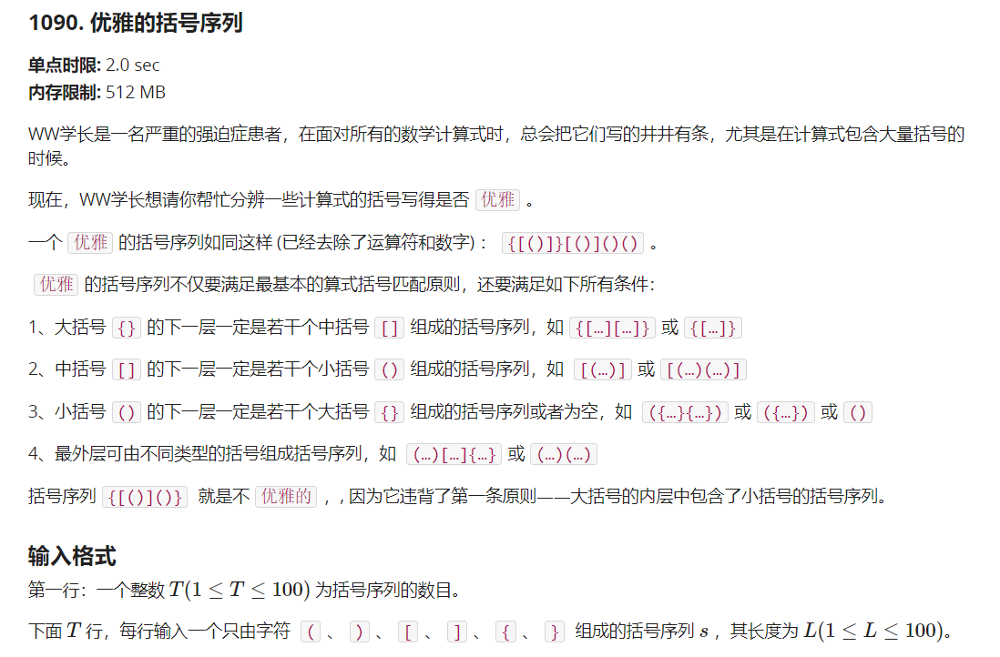​

```C
#include <stdio.h>
#include <string.h>

#define outer 0		   // 外层状态
#define paren 1		   // 小括号状态
#define brack 2		   // 中括号状态
#define brace 3		   // 大括号状态
#define filled_brack 4 // 表示中括号内填充小括号
#define filled_brace 5 // 表示大括号内填充中括号
#define MAXN 510

int judge(char str[])
{
	int len = strlen(str), states[MAXN], top = 0;
	states[top] = outer;
	for (int i = 0; i < len; i++)
	{
		int state = states[top];
		char ch = str[i];
		switch (state)
		{
		case outer:
		{
			if (ch == '(')
				states[++top] = paren;
			else if (ch == '[')
				states[++top] = brack;
			else if (ch == '{')
				states[++top] = brace;
			else
				return 0;
			break;
		}
		case paren:
		{
			if (ch == '{')
				states[++top] = brace;
			else if (ch == ')')
			{
				top--;
				if (states[top] != outer)
					states[top] = filled_brack;
			}
			else
				return 0;
			break;
		}
		case brack:
		case filled_brack:
		{
			if (ch == '(')
				states[++top] = paren;
			else if (ch == ']')
			{
				if (state == brace)
					return 0;
				top--;
				if (states[top] != outer)
					states[top] = filled_brace;
			}
			else
				return 0;
			break;
		}
		case brace:
		case filled_brace:
		{
			if (ch == '[')
				states[++top] = brack;
			else if (ch == '}')
			{
				if (state == brace)
					return 0;
				top--;
			}
			else
				return 0;
			break;
		}
		}
	}
	return states[top] == outer;
}

int main()
{
	int T;
	scanf("%d", &T);
	while (T--)
	{
		char str[101] = {0};
		scanf("%s", str);
		printf(judge(str) ? "Yes\n" : "No\n");
	}
	return 0;
}
```

​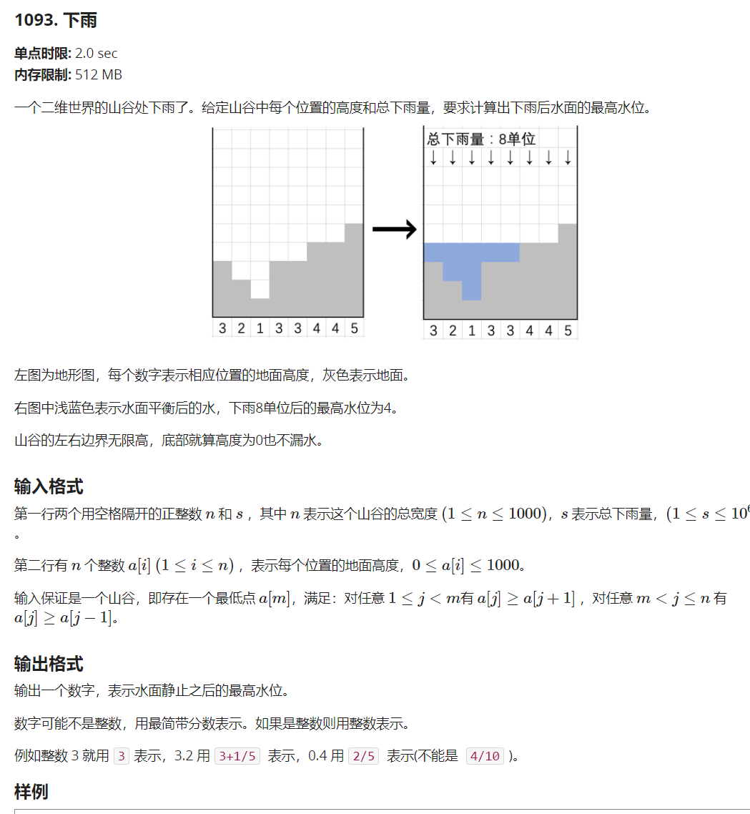​

```C
#include <stdio.h>
#include <stdlib.h>
#include <math.h>
#include <string.h>

#define N 1111
#define INF 1000009

int gcd(int a, int b)
{
	return (b == 0) ? a : gcd(b, a % b);
}

int cmp(const void *a, const void *b)
{
	return *(int *)a - *(int *)b;
}

void solve()
{
	int n, s;
	int a[N];
	scanf("%d %d", &n, &s);
	for (int i = 0; i < n; i++)
		scanf("%d", &a[i]);

	// 排序，令最后一层高度为无穷大
	qsort(a, n, sizeof(int), cmp);
	a[n] = INF;

	int ans_int, ans_fz, ans_fm;
	for (int i = 1; i <= n; i++)
	{
		int c = (a[i] - a[i - 1]) * i; // INF不能取太大
		if (s < c)
		{
			ans_int = a[i - 1] + s / i;
			ans_fz = s % i;
			ans_fm = i;
			break;
		}
		else
			s -= c;
	}
	int g = gcd(ans_fz, ans_fm);
	ans_fz /= g;
	ans_fm /= g;

	//只有分数
	if (ans_int == 0 && ans_fz > 0)
		printf("%d/%d", ans_fz, ans_fm);
	else
	{
		printf("%d", ans_int);
		if (ans_fz > 0)
			printf("+%d/%d", ans_fz, ans_fm);
	}
	printf("\n");
}

int main()
{
	solve();
	return 0;
}

```

​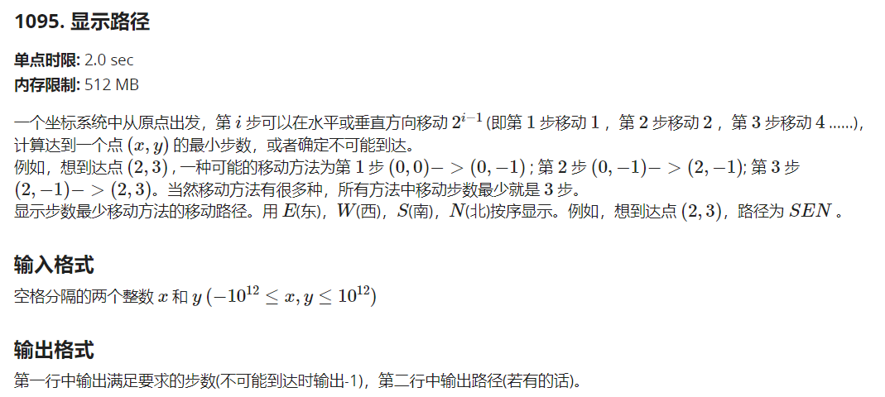​

```C
#include <stdio.h>
#include <string.h>
#include <stdlib.h>

typedef long long LL;

void Path(LL x, LL y)
{
	int steps = 0;
	LL dist = llabs(x) + llabs(y);
	int bits[64] = {0};

	for (int i = 63; i >= 0; i--) //|x| + |y|的二进制表示,steps表示最高位置
	{
		if (dist & (1LL << i))
		{
			bits[i] = 1;
			if (!steps)
				steps = i;
		}
	}

	for (int i = steps - 1; i >= 0; i--) // 将|x| + |y|表示成2 ^ i之和
	{
		if (!bits[i])
		{
			bits[i--] = 1;
			while (!bits[i])
				bits[i--] = -1;
			bits[i] = -1;
		}
	}

	LL temp = llabs(x);
	int Xbits[64] = {0};
	for (int i = 0; i <= steps; i++)
	{
		if (temp % (1LL << (i + 1)))
		{
			Xbits[i] = 1;
			temp -= bits[i] * (1LL << i);
			if (!temp)
				break;
		}
	}

	for (int i = 0; i <= steps; i++) //(x,y)不在第一象限，调整bits数组
	{
		if (Xbits[i] && x + llabs(x) == 0)
			bits[i] *= -1;
		if (!Xbits[i] && y + llabs(y) == 0)
			bits[i] *= -1;
	}

	char path[50] = {0};
	int cnt = 0;
	for (int i = 0; i <= steps; i++)
	{
		if (!Xbits[i]) // bits中相应第i项为y的表示项
		{
			if (bits[i] == -1)
				path[cnt++] = 'S';
			else
				path[cnt++] = 'N';
		}
		else // bits中相应第i项为x的表示项
		{
			if (bits[i] == -1)
				path[cnt++] = 'W';
			else
				path[cnt++] = 'E';
		}
	}

	printf("%d\n", steps + 1);
	printf("%s\n", path);
}

int main()
{
	LL x, y;
	scanf("%lld %lld", &x, &y);
	LL dist = llabs(x) + llabs(y);

	if (dist == 0)
	{
		printf("0\n");
		return 0;
	}
	else if (dist % 2 == 0)
	{
		printf("-1\n");
		return 0;
	}

	Path(x, y);
	return 0;
}
```

​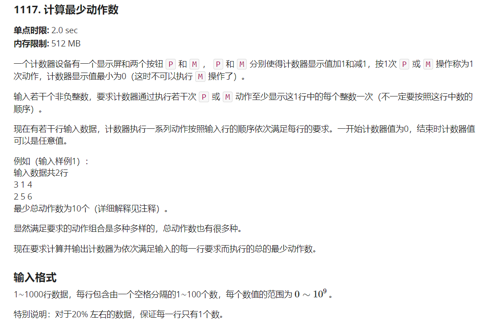​

```C
#include <stdio.h>
#include <string.h>

typedef long long LL;

LL MIN(LL a, LL b)
{
	return a < b ? a : b;
}

LL MAX(LL a, LL b)
{
	return a > b ? a : b;
}

LL LLABS(LL x)
{
	return x > 0 ? x : -x;
}

int main(void)
{
	LL Lmin, Rmin, startmax, startmin;
	Lmin = Rmin = startmax = startmin = 0;

	LL linemax = -1, linemin = 1LL << 31;
	char c;
	LL a;

	while (scanf("%lld%c", &a, &c) != EOF)
	{
		linemin = MIN(linemin, a);
		linemax = MAX(linemax, a);
		if (c == '\n')
		{
			LL m = MIN(Lmin + LLABS(startmin - linemax), Rmin + LLABS(startmax - linemax)) + linemax - linemin;
			LL n = MIN(Lmin + LLABS(startmin - linemin), Rmin + LLABS(startmax - linemin)) + linemax - linemin;
			Lmin = m;
			Rmin = n;
			startmax = linemax, startmin = linemin;
			linemax = -1, linemin = 1LL << 31;
		}
	}

	printf("%lld\n", MIN(Lmin, Rmin));
	return 0;
}
```

​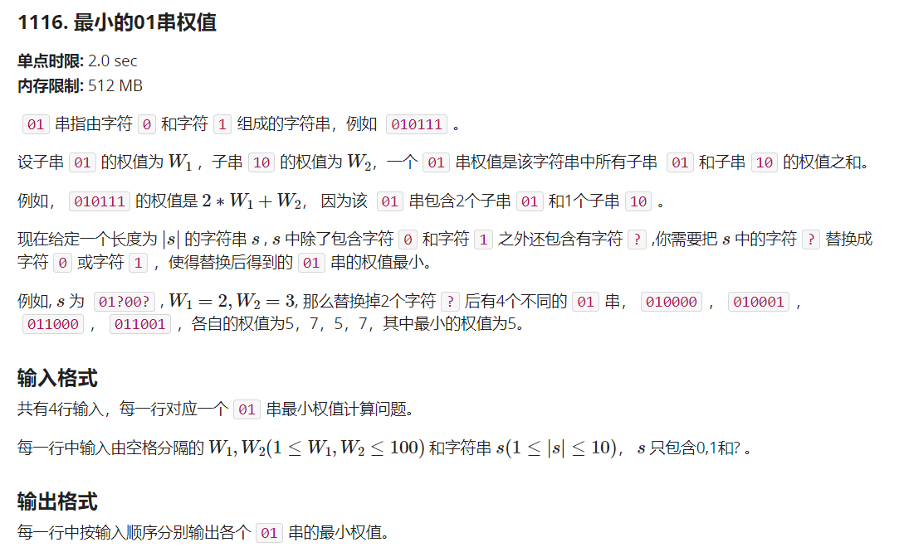​

```C
#include <stdio.h>
#include <stdlib.h>
#include <string.h>

#define N 12
#define M 2000

int w1, w2;
char str[N];
int ret[M], cnt;

int min(int a, int b)
{
    return (a < b) ? a : b;
}

int answer(char str[], int n)
{
    int res = 0;
    for (int i = 1; i < n; i++)
    {
        if (str[i] > str[i - 1])
            res += w1;
        else if (str[i] < str[i  - 1])
            res += w2;
    }
    return res;
}

void dfs(int u, int n, char str[])
{
    if (!strchr(str, '?'))
    {
        ret[cnt++] = answer(str, n);
        return;
    }

    int res;
    for (int i = u; i < n; i++)
    {
        if (str[i] == '?')
        {
            str[i] = '0';
            dfs(i + 1, n, str);
            str[i] = '1';
            dfs(i + 1, n, str);
            str[i] = '?';
        }
    }
}

int main(void)
{
    for (int t = 0; t < 4; t++)
    {
        scanf("%d %d %s", &w1, &w2, str);
        cnt = 0;
        int res = 0x3f3f3f3f;
        dfs(0, strlen(str), str);

        for (int i = 0; i < cnt; i++)
        {
            if (res > ret[i]) res = ret[i];
        }
        printf("%d\n", res);
    }

    return 0;
}

```

​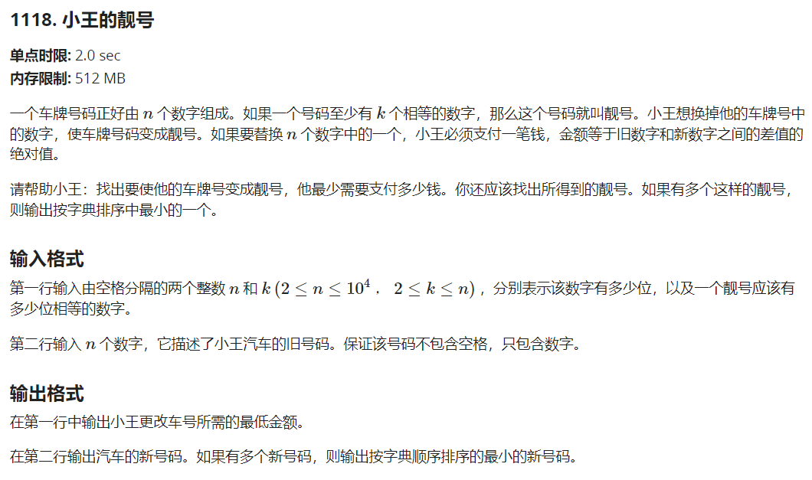​

```C
#include <stdio.h>
#include <string.h>
#include <stdlib.h>

#define N 20010
char input[N];
char tmp[N];
char resNumber[N];
int n, k;

int solve(char number[], int c)
{
    int cnt = 0, res = 0;
    for (int i = 0; i < n; i++)
        if (tmp[i] == c + '0')
            cnt++;
    if (cnt >= k) return 0;

    for (int j = 1; j <= 9; j++)
    {
        if (c + j <= 9)
        {
            for (int i = 0; i < n; i++)
            {
                if (tmp[i] == c + j + '0')
                {
                    res += j;
                    tmp[i] = c + '0';
                    cnt++;

                    if (cnt >= k) return res;
                }
            }
        }

        if (c - j >= 0)
        {
            for (int i = n - 1; i >= 0; i--)
            {
                if (tmp[i] == c - j + '0')
                {
                    res += j;
                    tmp[i] = c + '0';
                    cnt++;

                    if (cnt >= k) return res;
                }
            }
        }
    }
}

int min(int a, int b)
{
    return (a < b) ? a : b;
}

int main(void)
{
    scanf("%d %d %s", &n, &k, input);

    int cost = 0x3f3f3f3f;
    for (int i = 0; i <= 9; i++)
    {
        memcpy(tmp, input, n);
        int tmpcost = solve(tmp, i);
        if (cost > tmpcost)
        {
            cost = tmpcost;
            memcpy(resNumber, tmp, n);
        }
    }
    printf("%d\n%s\n", cost, resNumber);
    return 0;
}

```

​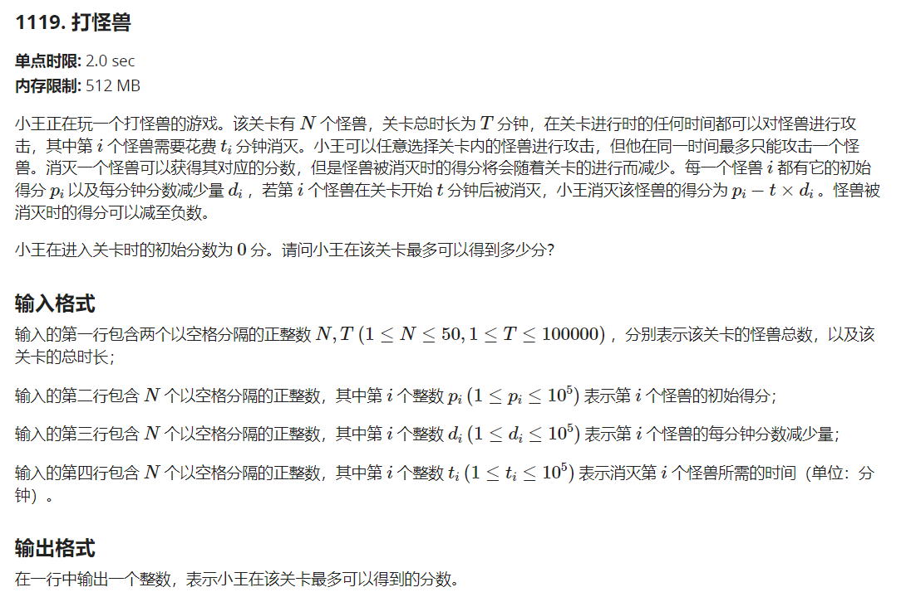​

```C
#include <stdio.h>
#include <string.h>
#include <stdlib.h>

#define N 60
#define M 100010
#define read(X) scanf("%lld", &X)
#define MAX(A, B) A > B ? A : B
typedef long long LL;
typedef struct point{
	LL p, d, t;
} monster;
LL f[N][M];
monster m[N];

int cmp(const void * a, const void * b)
{
	monster ma = *(monster*)a, mb = *(monster*)b;
	LL ca = ma.d * mb.t, cb = mb.d * ma.t;
	if (ca > cb) return -1;
	else if (ca < cb) return 1;
	return 0;
}

int main(void)
{
	int n, T;
	scanf("%d %d", &n, &T);
	for (int i = 1; i <= n; i++)
		read(m[i].p);
	for (int i = 1; i <= n; i++)
		read(m[i].d);
	for (int i = 1; i <= n; i++)
		read(m[i].t);

	qsort(m + 1, n, sizeof(m[0]), cmp);

	for (int i = 1; i <= n; i++)
	{
		for (int j = T; j >= 0; j--)
		{
			if (j - m[i].t >= 0) f[i][j] = f[i - 1][j - m[i].t] + m[i].p - j * m[i].d;
			f[i][j] = MAX(f[i][j], f[i - 1][j]);
		}
	}

	LL res = 0;
	for (int i = 0; i <= T; i++)
		res = MAX(res, f[n][i]);
	printf("%lld", res);
	return 0;
}
```

​​

```C
#include <stdio.h>

typedef long long LL;

LL SQRT(LL n)
{
	LL left = 0, right = 1000000001;
	while (left + 1 < right)
	{
		LL mid = left + (right - left) / 2;
		if (mid * mid > n)
			right = mid;
		else
			left = mid;
	}
	return left;
}

void solve(LL n, LL *x, LL *y)
{
	LL sqt = SQRT(n);
	if (sqt & 1) // n的平方根为奇数
	{
		*x = sqt / 2;
		*y = sqt / 2 + 1;
		if (n > sqt * (sqt + 1))
		{
			*x = *x - sqt;
			*y = *y - (n - sqt * (sqt + 1));
		}
		else
			*x = *x - (n - sqt * sqt);
	}
	else // n的平方根为偶数
	{
		*x = -sqt / 2;
		*y = -sqt / 2;
		if (n > sqt * (sqt + 1))
		{
			*x = *x + sqt;
			*y = *y + (n - sqt * (sqt + 1));
		}
		else
			*x = *x + (n - sqt * sqt);
	}
}

int main(void)
{
	LL n;
	scanf("%lld", &n);
	LL x, y;
	solve(n, &x, &y);
	printf("(%lld,%lld)\n", x, y);
	return 0;
}
```

​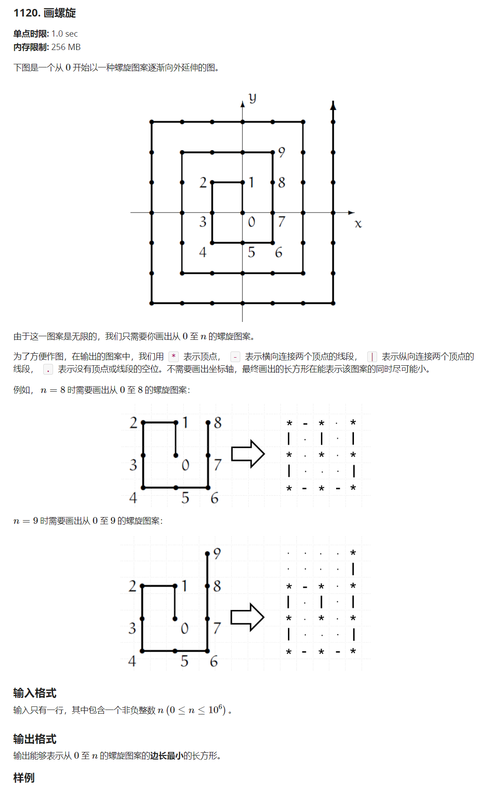​

```C
#include <stdio.h>
#include <string.h>
#include <stdlib.h>

#define N 3000
char map[N][N];

int min(int a, int b)
{
    return (a > b) ? b : a;
}

int max(int a, int b)
{
    return (a > b) ? a : b;
}

int SQRT(int x)
{
    int l = 0, r = 1001;
    while (l < r)
    {
        int mid = l + r >> 1;
        if (mid * mid >= x) r = mid;
        else l = mid + 1;
    }
    return l;
}

int main()
{
    int n;
    scanf("%d", &n);
    memset(map, '.', sizeof(map));

    int x = N / 2, y = N / 2;
    int mode = 0; //o up, 1 left, 2 down, 3 right
    int up = x, left = y, down = x, right = y;

    map[x][y] = '*';
    for (int i = 1; i <= n; i++)
    {
        if (mode == 0)
        {
            map[--x][y] = '|';
            x--;
            up = min(up, x);
        }
        else if (mode == 1)
        {
            map[x][--y] = '-';
            y--;
            left = min(left, y);
        }
        else if (mode == 2)
        {
            map[++x][y] = '|';
            x++;
            down = max(down, x);
        }
        else
        {
            map[x][++y] = '-';
            y++;
            right = max(right, y);
        }
        map[x][y] = '*';


        int sql = SQRT(i);
        if (sql * sql == i || sql * (sql - 1) == i)
        {
            mode = (mode + 1) % 4;
        }
    }

    for (int i = up; i <= down; i++)
    {
        for (int j = left; j <= right; j++)
        {
            printf("%c", map[i][j]);
        }
        puts("");
    }

    return 0;
}

```

​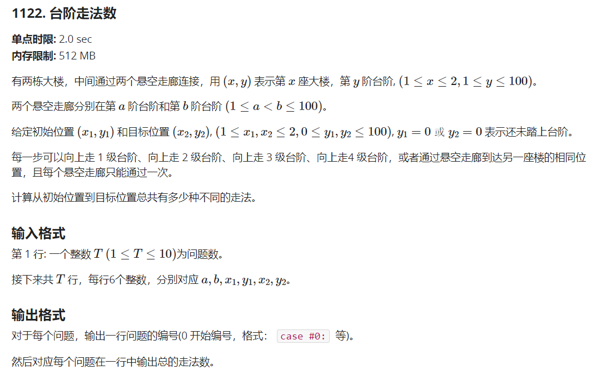​

```C
#include <stdio.h>
#include <string.h>
#include <stdlib.h>

#define N 150
typedef long long LL;

typedef struct
{
	int len, nums[N];
} BIGINT;

BIGINT ans[N];

BIGINT int2INT(LL x)
{
	BIGINT res = {0, {0}};
	while (x)
	{
		res.nums[res.len++] = x % 10;
		x /= 10;
	}
	return res;
}

BIGINT add(BIGINT a, BIGINT b)
{
	BIGINT res = {0, {0}};
	int t = 0;
	for (int i = 0; i < a.len || i < b.len; i++)
	{
		if (i < a.len)
			t += a.nums[i];
		if (i < b.len)
			t += b.nums[i];
		res.nums[res.len++] = t % 10;
		t /= 10;
	}
	if (t)
		res.nums[res.len++] = 1;
	return res;
}

BIGINT mul(BIGINT a, BIGINT b)
{
	if (a.len == 0 || b.len == 0)
		return int2INT(0);
	BIGINT res = {a.len + b.len, {0}};

	for (int i = 0; i < a.len; i++)
	{
		int t = 0, k, j;
		for (j = 0; j < b.len; j++)
		{
			t = a.nums[i] * b.nums[j] + t + res.nums[i + j];
			res.nums[i + j] = t % 10;
			t /= 10;
		}
		k = i + j;
		while (t > 0)
		{
			t = t + res.nums[k];
			res.nums[k] = t % 10;
			t = t / 10;
			k++;
		}
	}
	if (res.nums[res.len - 1] == 0)
		res.len--;
	return res;
}

void show(BIGINT a)
{
	for (int i = a.len - 1; i >= 0; i--)
	{
		printf("%d", a.nums[i]);
	}
	puts("");
}

BIGINT solve(int x)
{
	if (x < 0)
		return int2INT(0);
	if (ans[x].len > 0 || x == 0)
		return ans[x];

	ans[x] = add(add(add(solve(x - 1), solve(x - 2)), solve(x - 3)), solve(x - 4));
	return ans[x];
}

int main(void)
{
	int T;
	scanf("%d", &T);

	ans[0] = int2INT(1);
	ans[1] = int2INT(1);
	ans[2] = int2INT(2);
	ans[3] = int2INT(4);
	ans[4] = int2INT(8);

	for (int t = 0; t < T; t++)
	{
		int a, b, x1, y1, x2, y2;
		BIGINT res = {1, {0}};
		scanf("%d%d%d%d%d%d", &a, &b, &x1, &y1, &x2, &y2);

		if (x1 == x2)
		{
			res = add(res, solve(y2 - y1));
			res = add(res, mul(solve(a - y1), mul(solve(b - a), solve(y2 - b))));
		}
		else
		{
			res = add(res, mul(solve(a - y1), solve(y2 - a)));
			res = add(res, mul(solve(b - y1), solve(y2 - b)));
		}
		printf("case #%d:\n", t);
		show(res);
	}

	return 0;
}
```

‍
