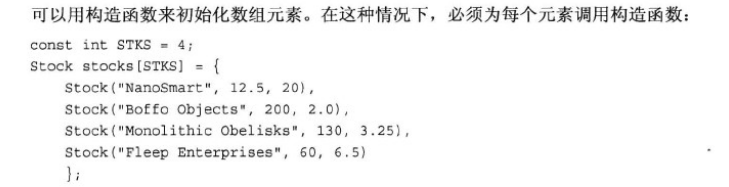
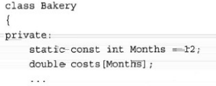
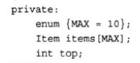
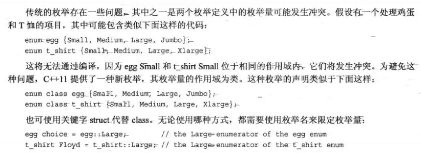

# C++ Primer Plus

sizeof(数组名) 将得到整个数组中的字节数

‍

原始 (raw) 字符串

```Cpp
int main() {
    cout << R"(\n'""')";
    return 0;
}

\n'""'
```

# 复合类型

## new & delete

```cpp
#include <iostream>
using namespace std;

int main(void)
{
    int *pt = new int;
    delete pt;

    int *ps = new int[100];
    delete[] ps;

    // delete should couple with new
    // the [] must remain same
    return 0;
}
```

# 函数

## 内联函数

用于提高运算速度

```cpp
#include <iostream>
using namespace std;

inline int square(int x) { return x * x; }

int main(void)
{
    for (int i = 0; i < 9; i++)
    {
        cout << square(i) << endl;
    }
    return 0;
}
```

## 引用变量

```cpp
#include <iostream>
using namespace std;


int main(void)
{
    int a = 10;
    int & b = a;  // a和b指向相同的值和内存单元
	int * c = &a;  // a == b == *c  &a == &b == c
    cout << a << endl;
    cout << b << endl;
    return 0;
}

10
10
```

只能通过初始化声明来设置引用，但不能通过赋值来设置

### 引用用做函数参数

可以避开按值传递的限制，也避免使用指针的繁琐、

必须传入变量，而不能传入表达式

如果一定要传入表达式，可能会创建临时变量进行使用，原来的数据也不会受影响（新的版本下不允许传入表达式）

```cpp
#include <iostream>
using namespace std;

void swapr(int &a, int &b);
void swapp(int *a, int *b);
void swapv(int a, int b); // can not swap the values

int main(void)
{
    int a = 10;
    int &b = a;
    cout << a << endl;
    cout << b << endl;
    return 0;
}

void swapr(int &a, int &b)
{
    int temp = a;
    a = b;
    b = temp;
}

void swapp(int *a, int *b)
{
    int temp = *a;
    *a = *b;
    *b = temp;
}

void swapv(int a, int b)
{
    // can not swap the values
    int temp = a;
    a = b;
    b = temp;
}
```

### 返回引用

```cpp
#include <iostream>
using namespace std;

int &sum(int &a, int &b)
{
    a += b;
    return a;
}

int main(void)
{
    int a = 10;
    int b = 2;
    cout << a << endl;
    sum(a, b) = 14;  // 返回一个引用则可以作为变量
    cout << a << endl;
    return 0;
}

10
14
```

应该避免返回函数终止时不再存在的内存单元引用。

为了避免这种问题：

1. 传入一个行使返回功能的引用
2. 创建指针，返回解引用后的指针

    1. 需要delete

## 默认参数

```cpp
#include <iostream>
using namespace std;

char *left(const char *str, int n = 1);

int main(void)
{
    char str[] = "12345";
    char *s1 = left(str, 3);
    char *s2 = left(str);
    cout << s1 << endl; // 在函数原型处设置默认参数
    cout << s2 << endl; // 如果不传入参数则使用默认参数
    delete s1;
    delete s2;
    return 0;
}

char *left(const char *str, int n)
{
    char *res = new char[n + 1];
    int i;
    for (i = 0; i < n && str[i]; i++)
        res[i] = str[i];
    while (i <= n)
        res[i++] = '\0';
    return res;
}
```

## 函数重载

### 函数特征标

如果两个函数的参数数目和类型相同，同时参数的排列顺序也相同，则它们的特征标相同

* 变量名不影响
* 类型引用和类型本身视为同一个特征标
* 不区分const和非const

  * 但如果同时写了包含const和不包含const的同名函数，则会根据传入的参数是否为const进行匹配
  * 将非const值传给const变量是合法的；反之则为非法

注意：是特征标使得函数可以进行重载，修改函数返回类型但是特征标一致，是不能重载的

```cpp
long a(int x, int y);
double a(int x, int y);  // 报错
double a(double x, int y);  // 可以
```

## 函数模板

```cpp
#include <iostream>
using namespace std;

template <typename T> // template <class AnyType>  早期版本写法，功能一致
void mySwap(T &a, T &b);  // 注意STL库中有swap()方法

int main(void)
{
    int a = 10;
    int b = 5;
    cout << a << " " << b << endl;
    mySwap(a, b);
    cout << a << " " << b << endl;

    return 0;
}

template <typename T>
void mySwap(T &a, T &b)
{
    T temp;
    temp = a;
    a = b;
    b = temp;
}
```

函数模板不能缩短可执行程序，只是由程序自行生成多个版本的函数

# 类与对象

* 决定数据对象需要的内存数量
* 决定如何解释内存中的位
* 决定可使用数据对象执行的操作或方法

* 类声明：以数据成员的方式描述数据部分，以成员函数（方法）的方式描述公有接口
* 类方法定义：描述如何实现类成员函数

将接口（类定义）放在头文件中，将实现放在源代码文件中

## 类定义

```cpp
// stockOO.h
#ifndef STOCKOO_H_
#define STOCKOO_H_

#include <string>

class Stock {
    private :
    std::string company;
    long shares;
    double share_val;
    double total_val;
    void set_tot() {
        total_val = shares * share_val;
    }

    public:
    void acquire(const std::string & co, long n, double pr);
    void buy(long num, double price);
    void sell(long num, double price);
    void update(double price);
    void show();
};

#endif
```

## 访问控制

|关键字|访问范围|
| -----------| ----------------------------------------|
|private|只能通过公有成员函数或友元函数进行访问|
|protected||
|public|可直接访问|

如果不使用关键字`private`​会默认为`private`​

## 实现成员函数

* 定义成员函数时，使用`::`​来标识函数所属的类

  * 允许不同类拥有同名的成员函数
  * 在本类的其他成员函数中不必使用作用域解析运算符
* 类方法可以访问类的`private`​组件

```cpp
// stockOO.cpp
#include <iostream>
#include "stockOO.h"

void Stock::acquire(const std::string &co, long n, double pr)
{
    // TODO
}
```

### 内联函数

定义位于类声明中的函数都将自动成为内联函数，如`Stock::set_tot()`​

或者可以在类实现部分使用`inline`​

内联函数要求每个使用它们的文件中都有对其的定义，确保内联定义对多文件程序中的所有文件都可用；可以将内联定义放在定义类的头文件中

## 构造函数

在创建对象时，自动进行初始化调用的方法

```cpp
#ifndef STOCKOO_H_
#define STOCKOO_H_

#include <string>

class Stock
{
private:
    std::string company;
    long shares;
    double share_val;
    double total_val;
    void set_tot()
    {
        total_val = shares * share_val;
    }

public:
    Stock(const std::string &co, long n = 0, double pr = 0.0);
    void acquire(const std::string &co, long n, double pr);
    void buy(long num, double price);
    void sell(long num, double price);
    void update(double price);
    void show();
};

#endif
```

```cpp
// stockOO.cpp
#include <iostream>
#include <string>
#include "stockOO.h"

Stock::Stock(const std::string &co, long n, double pr)
{
    company = co;
    if (n < 0)
    {
        std::cerr << "Number of shares cna't be nagative \n";
        shares = 0;
    }
    else
        shares = n;
    share_val = pr;
    set_tot();
}
```

与Java不同，参数名不能与类成员相同，为了避免混乱，可以：

1. 在数据成员名中使用`m_`​前缀
2. 在成员名中使用`_`​后缀

### 显式调用

```cpp
#include <iostream>
#include "stockOO.h"

int main()
{
    Stock a = Stock("aaa", 60, 2.5);
    a.show();
}
```

### 隐式调用

```cpp
#include <iostream>
#include "stockOO.h"

int main()
{
    Stock a("aaa", 60, 2.5);
    a.show();
}
```

### 使用new

```cpp
#include <iostream>
#include "stockOO.h"

int main()
{
    Stock *a = new Stock("aaa", 60, 2.5);
    (*a).show();
    delete a;
}
```

### 默认构造函数

在未提供显式初始值时，用来创建对象的构造函数

​`Stock::Stock() {}`​

如果显式定义了一个有参构造函数，则不会隐式定义无参构造函数

1. 给已有构造函数提供函数默认值
2. 或重载构造函数

    1. 在无参构造函数中进行合法默认值的设置

## 析构函数

用构造函数创建对象后，程序负责跟踪该对象直到其过期为止。对象过期时，程序将自动调用一个特殊的成员函数——析构函数，以完成清理工作

如果构造函数中使用new来分配内存，则需要析构函数使用delete来释放

析构函数要求没有函数参数

```cpp
#ifndef STOCKOO_H_
#define STOCKOO_H_

#include <string>

class Stock
{
private:
    std::string company;
    long shares;
    double share_val;
    double total_val;
    void set_tot()
    {
        total_val = shares * share_val;
    }

public:
	Stock();
    Stock(const std::string &co, long n = 0, double pr = 0.0);
    ~Stock();
    void show();
};

#endif
```

```cpp
// stockOO.cpp
#include <iostream>
#include <string>
#include "stockOO.h"

Stock::Stock(const std::string &co, long n, double pr)
{
    company = co;
    if (n < 0)
    {
        std::cerr << "Number of shares cna't be nagative \n";
        shares = 0;
    }
    else
        shares = n;
    share_val = pr;
    set_tot();
}

Stock::~Stock()
{
    // 进行delete操作，但没有使用过new，所以此时不需要
    std::cout << "Stock end" << std::endl;
}

void Stock::show()
{
    using namespace std;
    cout << company << " " << shares << " "
         << share_val << " " << total_val << endl;
}
```

类对象过期时会自动调用析构函数

## const

如果类定义中存在以`const`​修饰的成员变量，在实现成员方法时，由于实现代码无法确保调用对象不被修改，编译器将拒绝函数调用，所以应该将这类函数使用`const`​声明

```cpp
void show() const;

void Stock::show() const {}
```

## this

每个成员函数都有一个`this`​**指针**，`this`​指针指向调用对象

如果方法需要引用整个调用对象，可以使用`*this`​

```cpp
Stock &Stock::compareTo(Stock that)
{
    if (that.total_val <= this->total_val)
        return *this;
    else
        return that;
}
```

## 对象数组

​​

可以只为部分元素使用构造方法，剩余的会自动调用无参构造

## 类作用域

* 在类中定义的名称（类数据成员名、类成员函数名）的作用域都为整个类

  * 在不同类中使用相同的类成员名不会引起冲突
  * 不能从外部直接访问类的成员对象

使用类成员名时，需要根据上下文使用：

* ​`.`​
* ​`->`​ 使用对象指针的时候要使用
* ​`::`​

### 常量(static)

1. 使用`static`​创建一个常量，将被所有对象共享

​​

2. 使用枚举变量创建

​​

但是枚举变量只能创建整型类型的数据

### 作用域内枚举

​​

## ADT

* 私有部分必须表明数据存储的方式
* 公有接口应该隐藏数据表示，而以通用的术语来表达

## 共享类方法

​`类名.方法();`​

## 运算符重载

## 友元函数
