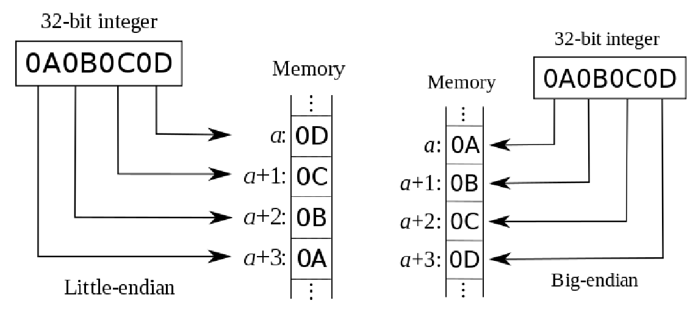
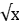
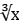

# C Primer Plus

# 数据

## 基本数据类型

先声明再使用

声明数据实际上有两个作用

1. 需占内存的大小, 能表示的数据范围
2. 允许的操作种类

### 整数int

#### 修饰词

short (int) `%hd`

long (int)  `%ld` `%lo` `%lx` 要把一个较小的数看做long，在数后面加 ***l*** 或 ***L***（建议使用L）

long long (int) `%lld`

unsigned (int) `%u`

#### 可移植类型

`<stdint.h>`

`<inttypes.h>`

### 浮点数float

#### 存储中的表示

首位作为符号位，一部分作为值（尾数）部分，另一部分作为指数部分，根据指数部分的大小使小数点移动，因此称为“浮点数”

#### 声明形式

1.14

5.e-2

.45E-6

作为一个整体，不要在其中加入空格

注：`NaN`为浮点数

#### 修饰词

float `%f`​ 后面8位：127+C 最后23位：M-1, 丢弃小数点

double `%lf`​ `%le`​ `%la`​ a表示十六进制的浮点数 后面11位：1023+C 最后52位：M-1,丢弃小数点

long double `%Lf` （注意是大写的L，且只有一个）

#### 浮点数的上溢和下溢&#x20;

精度不足导致的数据丢失

### 字符型char

实际上的字符是以数值形式存储的，由于输出时上下文的区别会输出字符或数值

### 其他

#### 布尔值\_Bool&#x20;

值为true或false 

一般表达式的真值为`int`​类型

或 `<stdbool.h>` 使用bool，值为true和false

#### 复数\_Complex

#### 虚数\_Imaginary

## 派生数据类型

### 指针 \*

#### 声明/初始化

```c
int *num; //一个指向整型的指针
float *ft[10]; //一个含有10个指针的数组，每个指针指向一个float
int board[8][9];//一个二维数组
int **ptr;//一个指向指针的指针，该指针指向一个整数
int (* rusks)[10];//一个指针，指向一个有10个元素的数组
int * oof[3][4];//一个数组，每个元素都是一个指向整数的指针
int (* uuf)[3][4];//一个指向二维数组的指针
int (* uof[3])[4];//声明一个含有三个指针的数组，每个指针指向一个含有4个整数的数组
```

不要把一个整数(例外:0)赋值给一个指针变量

0/NULL常用于表示一个指针变量暂未指向一个变量

指针必须指向同类型元素，但可以这样：

```cpp
int a = 5;
void * p = &a;
```

优先级：`[]`​=`()`​>`*`​

#### 操作

##### ++/--/

自身递增/递减，移向下一个元素（如果是数组），因此指针的类型和数组才需要对应，因为要移动对应的字节数

##### +n/-n

向后n个/前n个元素移动

##### 指针相减

得到两个指针相距的元素个数

##### \*

解引用，得到指针所指地址的内容，注意不要解引用没有初始化的指针！

##### &

取地址，得到存放指针的地址，即指向指针的指针

#### 指向多维数组的指针

```c
int (*pz)[2]; //pz指向一个含2个int的数组
int *px[2]; //px是一个含有两个指针的数组，指针指向int
int pc[2][3]; //pc是一个含有两个指针的数组，每个指针指向一个含有3个int的数组
```

### 数组

#### 定义

由数据类型**相同**的一系列元素组成

#### 声明/初始化

```c
int num[42] = {[1] = 6}; //指定位置初始化，若有特定位置被初始化则其他未操作位置都会为0
char st[114] = {'s','k','a','d','i','\0'}; //若如st已创建内容，则可省略`[]`中的数值，会为数组自动分配相应的大小
char *s[10]; //一个指向数组的指针，该数组含10个元素
```

数组的下标从`0`开始，到`SIZE-1`

数组的名称即为一个指向数组首元素的指针

可以用负数表示下标，即往回走

#### 变长数组（VLA）

可以先获取n（如输入），再创建数组

因为数组需要划分一个连续的空间，所以原本会在程序运行前为数组分配空间防止它扰乱进程，新版的C可以在运行过程中创建数组

但还是推荐使用malloc()

```c
int example(int n , int m , int st[n][m]); //传参数时要把n,m放前面，或者略去所有形参，用*代替[]中的参数
```

#### 多维数组

传给函数时需要以`ar[][n][m]`的格式

```c
int num[4][2]; //num是一个拥有4个元素的数组，每一个元素都是一个含有2个int的数组，即num存着4个地址
```

#### 遍历数组

```c
int main(void)
{
	int i,n=10;
	int num[10];
	for (i = 0 ; i < n ; i++)
			printf("%d ",num[i]); //使用[]来获取数组内的值（指针表示法）
	
	for (i = 0 ; i < n ; i++)
			printf("%d ",*(num+i)); //使用*来获取数组内的值（数组表示法）
	return 0;
}
```

传参时，可以传**数组**，也可以传入数组的**首元素的指针**和**末元素的指针**

#### 复合字面量

相当于创建一个没有名称的数据（匿名数据），可以在给函数传数据的时候用，就可以不用再声明一个数据了

```c
(int [2]){10,20}
int *pt1;
pt1 = (int[2]){10,20};
```

### 字符串

#### 本质

是一个char类型的数组，且以`'\0'`结尾，因此必须为数组多留一位来存放`'\0'`

#### 定义

##### 字符串常量(string constant)

双引号`""`括起来的内容，也叫字符串字面量(string literal)

编译器会自动加入`\0`在末尾

如果字符串字面量之间没有间隔或用空白字符分割，会视为一个

```c
char a[50] = "hello " "world";
//等价于
char b[50] = "hello world";
```

##### char类型数组

其他未初始化的位置默认为`\0`

```c
const char m1[40] = {'h','e','l','l','o'};  //不是一个字符串，只是一个char数组
const char m2[40] = {'h','e','l','l','o','\0'}; //结尾必须有'\0'才是字符串
const char m3[40] = "hello";  //更加简便，会自动添加'\0'
```

##### 指向char的指针

```c
const char * pt = "hello";
//基本等价于
const char ar[] = "hello";
```

##### 数组和指针的区别

pt的值可以改变（指针前后移动或指向另一个字符串），但ar的值不可改变（不能进行自增自减，数组名不是变量，但可以进行指针加法操作）

编译器使用内存中的一个副本来表示所有完全相同的字符串字面量

```c
char * p1 = "hello";
p1[0] = "c";
printf("hello");
printf("\n %s","hello");
//理论上会输出：
//cello
//cello
//但实际上没有输出，可能是编译器区别，所以如果打算修改字符串，就不要用指针指向字符串字面量
```

#### I/O

##### fgets()

见`文件`

##### gets\_s

与fgets基本相同，但是只能从stdin中读取，所以只需两个参数，且会舍弃换行符

`gets_s(words,STLEN)`

##### s\_gets

```c
char *s_gets(char st[],int n) //读取一行字符串
{
	char *ret_val,*find;
	ret_val = fgets(st,n,stdin);
	if (ret_val)
	{
		find = strchr(st,'\n');
		if (find)
			*find = '\0';
		else
			while (getchar() != '\n')
				continue;
	}
	return ret_val;
}
```

##### scanf()

##### puts()

##### fputs()

##### printf()

#### 字符串函数

##### strlen()

`size_t strlen(const char *_Str)`

获取字符串长度，不包括`\0`

##### strcat() / strncat()

`char *strcat(char *__restrict__ _Dest, const char *__restrict__ _Source)`

`char *strncat(char *__restrict__ _Dest, const char *__restrict__ _Source, size_t _Count)`

将Source拼接到Dest上，会将Dest末尾的`\0`删去，Count指定Source的长度

返回Dest

##### strcmp() / strncmp

`int strcmp(const char *_Str1, const char *_Str2)`

`int strncmp(const char *_Str1, const char *_Str2, size_t _MaxCount)`

比较字符串在机器排序中的先后（如AASCII码），相等返回`0`

不相等的情况下，视为Str1-Str2，会得到正值或负值

MaxCount表示最多会比较到的长度

##### strcpy / strncpy()

`char *strcpy(char *__restrict__ _Dest, const char *__restrict__ _Source)`

`char *strncpy(char *__restrict__ _Dest, const char *__restrict__ _Source, size_t _Count)`

将Source的内容拷贝到Dest中，要注意不要溢出，返回Dest

Count指定Source拷贝的长度

##### sprintf()

`int sprintf(char *__restrict__ _Dest, const char *__restrict__ _Format, ...)`

将多个元素合成一个字符串，Dest为目标字符串，打印结果会进入Dest中而不是屏幕上

##### strchr() / strrchr()

`char *strchr(const char *_Str, int _Val)`

返回字符串中首次(包含'\0）出现Val的地址，不存在则返回`NULL`

`char *strrchr(const char *_Str, int _Ch)`

返回字符串中最后一次（包含'\0'）出现Ch的地址，不存在则返回`NULL`

##### strpbrk()

`char *strpbrk(const char *_Str, const char *_Control)`

如果Str中包含Control中的任意字符，则函数返回指向Str首元素的指针

不包含则返回`NULL`

##### strstr()

`char *strstr(const char *_Str, const char *_SubStr)`

返回Str中SubStr出现的首位置，未出现则返回`NULL`​

#### 字符串与数值转换

##### atoi()atof()atol()

字符串转为int/double/long

如果字符串是以数字开头的字母数字混合字符串，则会取开头的数字直到字母

##### strtol()strtoul()strtod()

字符串转为long/unsigned long/double

可以识别和报告字符串中而的首字符是否是数字

### 结构

#### 创建

```c
struct book  //struct为关键字，book为标记
{
	char title[MAX];
	char author[MAX];
	float value;
};  //不要忘了分号

struct book library;  //声明一个book类型变量，变量名为library
struct book *pt;  //声明一个指向book的指针
//如果这个结构只需用到一次，可以：
struct  //无需结构标记
{
	char title[MAX];
	char author[MAX];
	float value;
} library;

//初始化
struct book library = {
	"Golden Age",
	"Ji Ci",
	11.45
}; //可以不用换行，仅仅是为了增加可读性

//指定初始化
struct book library = {
	.value = 11.45;  //也可以单独为其中一个成员赋值，而其他成员保持空的状态
	.title = "Golden Age",
	.author = "Ji Ci"
};  //若多次对同一个成员进行赋值，最后一次会成为最终的结果

struct book library[10] = {
	[2]={
        .foclen = 500,
        .fstop = 2,
        .brand = "Remarkata"
    }
};//为一个结构数组中的其中一个元素初始化，其他初始化为0，字符串为空
```

#### 访问成员

结构成员运算符——`.`​相当于下标的作用（可以看成是Python中的字典）

​`library.title  library.value`​

#### 结构数组

​`struct book library[NUM]`​生成一个book类型变量的数组

​`library[count].title`​类似格式进行访问

#### 嵌套结构

```c
struct city
{
	int population;
	struct book library;
};
//访问
struct city ShangHai;
printf("%s",ShangHai.library.title);
```

#### 指向结构的指针

```c
struct book * pt;
pt = &library;  //注意，与数组不同，结构名不代表其地址
printf("%f",pt -> value);  //指针使用->来访问成员
printf("%s",(*pt).title);  //先将pt解引用得到library，再使用结构的访问成员的方式来访问，注意()是必须的，"."的优先级高于"*"
```

#### 向函数传递结构的信息

##### 传递结构本身

```c
void show(const struct book);
……
	show(libaray);  //注意结构名本身不代表结构的地址
……
void show(const struct book library)
{
	printf("%s is written by %s and values %f", library.title , library.author , library.value);
}
//使用传递结构本身可能会导致程序运行速度变慢
//而且当需要改变结构所含的值时，函数需要返回结构
```

##### 传递结构指针

```c
void show(const struct book * pt);  //pt可省略
……
	show(&libaray);  //注意结构名本身不代表结构的地址
……
void show(const struct book * pt)
{
	printf("%s is written by %s and values %f", pt->title , pt->author , pt->value);
}
```

##### 传递结构成员

单独的将结构的成员的值提取出来向结构传递

#### 赋值

如果两个结构类型相同，则可以直接进行赋值（不是只给地址）

也可以在进行初始化的时候直接赋其另一个相同类型的值

#### 在结构内使用指针

```c
//需要使用malloc()为指针分配空间，不能让指针空指
struct namect
{
	char * fname;
	char * lname;
};
……
struct namect * YY;
YY -> fname = (char *)malloc(strlen(temp)+1);  //sizeof(char)(=1)可以省去
strcpy(YY -> fname , temp);  //malloc()处理字符串常规操作
……
free(YY -> fname);
```

#### 结构的复合字面量

```c
reader = (struct book) {"Arknight","Ocean Cat","10.10"}
```

#### 匿名结构

```c
struct person
{
	int id;
	struct {char first[20] ; char last[20]};
};
//访问
struct ZYY;
……
puts(ZYY.first);  //可以直接访问二级成员
```

#### 伸缩型数组成员

```c
struct flex
{
	int count;
	double scores[];  //放在最后一个，作为伸缩型数组成员
}

struct flex * pt;
pt = malloc(sizeof(struct flex) + 5 * sizeof(double));  
//在struct flex（不含scores）的基础上再有一个含5个元素的double数组
```

不应该声明`struct flex`​变量，而是应该声明对应的指针，再使用`malloc()`​为其创建空间

使用含伸缩型数组的结构时：

1）不能直接进行拷贝（直接拷贝会略去伸缩型数组而把其他的元素拷贝）,如果确实要拷贝使用`memcpy()`​

2）不要把结构直接传递给函数，应该传递指针

3）不要使用带有伸缩型数组的结构作为数组，或者是其他结构的成员。

#### 保存结构到文件中

​`fwrite(&library , sizeof(struct book) , 1 , pbooks);`​

虽然使用起来比较方便，但是由于各个系统（甚至同一系统不同编译器）的二进制表示法不一定相同，所以可移植性很差

### 联合

#### 创建

```c
union hold
{
	int d;
	float f;
	double lf;
};
//联合的字节数会根据包含的最大的字节数确定
//把结构看作“和”，那就可以把联合看作“或”。联合在一个时间只能是它包含数据类型的其中一个，即只能存储一个值
```

#### 使用

```c
union hold fit;
fit.d = 1;  //fit选择int类型
fit.f = 2.0; //fit选择float类型
fit.lf = 6.4; //fit选择double类型
```

```c
//模拟实现一个选择
struct company……
struct person……
//比如一辆出租车，是属于个人还是公司，对于每个从属会有不同的属性，可以用union实现一个“选择”的功能
union owner
{
	struct company companyown;
	struct person personown;
};
```

#### 匿名联合

```c
struct car_data
{
	……
	union
	{
		struct company companyown;
		struct person personown;
	};
};
```

### 枚举

#### 创建

​`enum spectrum{red , orange , yellow , green , blue , violet};`

​`enum spectrum color;`​

相当于把这些符号常量作为标识符（但又不完全是）来使用，称为枚举符

#### enum常量

会给enum中的枚举符逐个赋值，默认从0开始递增，也可以赋值

```c
enum spectrum {red , orange = 100 , yellow , green , blue = 1000 , violet};
//red == 0 , orange == 100 , yellow == 101 , green == 102 , blue == 1000 , violet == 1001
```

#### 使用

枚举类型的目的只是为了提高程序的可读性和可维护性，但枚举类型只能在内部使用，要用字符串进行比较来确定值

```c
enum spectrum {red , orange = 100 , yellow , green , blue = 1000 , violet};
const char * colors [] = {"red","orange"……};
……
if (strcmp(choice,colors[color]) == 0)
```

## 高级数据类型

AcWing

MOOC《数据结构》

## typedef

示例

```c
typedef unsigned char BYTE;  //BYTE == unsigned char
typedef char * STRING;
STRING a,b; //== char *a,*b;  如果用#define STRING char *  则会变成char * a,b;
//define 是单纯的文本替换；typedef 是打包
typedef struct complex{……} COMPLEX;
COMPLEX x;
```

---

# 运算符

一个表达式的操作数类型可能不相同，但其结果均具有确定的数据类型和值

## 优先级

|优先级|运算符|描述|
| --------| ---------------------------------| -------------------------------------------------------------------------------|
|1|[] -> .|数组下标、结构体/联合体成员选择、结构体/联合体指针的成员选择|
|2|++ -- - ! ~ + (type) * & sizeof|后缀/前缀增减、负号、逻辑非、按位取反、正号、类型转换、取地址、取内容、求大小|
|3|* / %|乘法、除法、取模|
|4|+ -|加法、减法|
|5|<< >>|左移、右移|
|6|< <= > >=|小于、小于等于、大于、大于等于|
|7|== !=|等于、不等于|
|8|&|按位与|
|9|^|按位异或|
|10|​`\|`​|按位或|
|11|&&|逻辑与|
|12|​`\|\|`​|逻辑或|
|13|? :|条件运算符（三目运算符）|
|14|= += -= *= /= %= &= ^=|= <<= >>=|
|15|,|逗号运算符（从左到右顺序执行）|

## 基本运算符

### + 加

### - 减/取负

### = 赋值 左值 = 右值

\+=  -=  \*=  /=  %=

### \* 乘

### / 除 整数/整数仍为整数

## 其他运算符

### `sizeof()`&#x20;

以字节为单位返回运算对象的大小，返回类型为`size_t`

输出时要用`%zd`，老版本用`%u`或`%lu`

### %

求模，只能用于整数

被模数的符号决定了结果的符号

`a%b`可以用`a - (a/b)*b`替换

### ++/--

递增/递减，前缀为**先加再用**；后缀为**先用再加**

### (type)

强制类型转换，注意可能会丢失精度

### &

取地址运算符

### *

间接运算符，即解引用，获取一个地址上的值

## 关系运算符

|==|等于|
| :-| :-------|
|<|小于|
|<=|小于等于|
|>|大于|
|>=|大于等于|
|!=|不等于|

## 逻辑运算符

### && 与

当左侧判断为false时，不会再判断右侧

### || 或

当左侧判断为true时，不会在判断右侧

### ! 非

a 等价于 a != 0

!a 等价于 a == 0

## 优先级和结合律

|()||
| :---------------| :-|
|- + ++ -- sizeof|→|
|\* / %|←|
|+ -|→|
|< <= > >=|→|
|== !=|→|
|=|←|

---

# I/O

## 转换说明(conversion specification)

|%a %A|浮点数、十六进制数、p计数法|
| :------| :---------------------------------------------------------------------|
|%d %i|有符号十进制整数|
|%c|单个字符|
|%e %E|浮点数，e计数法（区别在于e的大小写）|
|%f|浮点数（十进制）输入必须lf对应double，f对应float；输出时可以都用f/lf|
|%g %G|根据值自动选择%f或%e|
|%o|无符号八进制整数|
|%x %X|无符号十六进制整数|
|%p|指针|
|%s|字符串|
|%u|无符号十进制整数|
|%%|百分号|

### 意义

因为计算机中的数据全部都是以一系列01存储，不同的转换说明将取不同的字节数，并进行不同的输出，也就是所谓的“上下文”

## 输入

### scanf()

#### 函数原型

`int scanf(const char *__restrict__ _Format, ...)`&#x20;

来自`<stdio.h>`

#### 输入格式

输入格式要与`""`中填写的格式一致，例如写了"%d,%d"，输入也要是**数字，数字**

#### 返回值

返回输入成功的项的个数，可以用来判断输入是否成功

#### 转换修饰符

|\*|抑制赋值，会跳过对应的输入，可以用在读取文件中的特定列|
| :---| :-------------------------------------------------------------|
|数字|最大字段宽度，输入达到最大字段宽度处停止，或第一次遇到空白字符|

```cpp
int main(void)
{   
    char c,d;
    scanf("%3c%c", &c, &d);
    printf("%c %c\n", c, d);
    return 0;
}

//abcd
//a d
```

#### 特点

1\)会无视空白字符，所以要记得清除

```c
void eatline(void)
{
	while (getchar() != '\n')
		continue;
}
```

2\)读到与要求输入类型不同的值会停止读入，这些值就会留在缓冲区，要注意清除

3\)如果带多个转换说明，会在第一个出错处停止读入输入

### getchar()

#### 函数原型

`int getchar(void)`

#### 作用

从缓冲区读入一个字符，返回它的字符码，需要赋值给变量

注意当scanf()与getchar()混用时，要注意空白符号，scanf()会跳过空白符号，但最后一次处理过后会有空白符号残留在缓冲区中，再次使用getchar()时要注意清除

## 输出

### printf()

#### 函数原型

`int printf(const char *__restrict__ _Format, ...)`

来自` <stdio.h>`

#### 转换修饰符

|标记|见下|
| :----------| :-------------------------------------------------------------------------------------------------------------------------|
|数字|最小字宽度，若不满足会用空格填充；若超出则会相应扩充（可以认为无效）|
|.数字|1）%f %e：小数点后的精度，自带四舍五入    2)%g：有效数字最大位数   3）%s：待打印字符最大数量   4）整型：待打印数字最小位数|
|h hh   `%hd` `%hhd`|h表示`short int` 或`unsigned short int`；hh表示`signed char`或`unsigned char`|
|j   `%jd`|表示`intmax_`​*​`t`​*​*或*​*​`unint`​*​`mat_t`|
|l ll L   `%ld` `%llu` `%Lf`|表示`(unsigned) long int` ；`unsigned long long int`； `long double`|
|t   `%td`|表示`ptrdiff_t`的值，是两个指针的差值|
|z   `%zd`|表示`size_t`的值，是sizeof的返回类型|
|\*     `%*d`|用程序来指定字段宽度，需要传入两个参数，前者为字段宽度，后者为输出值|

#### 标记

|-|向左对齐|
| :---| :-------------------------------------------|
|+|添加正负号|
|空格|根据正负在数值前添加空格或负号，保持长度一致|
|##|转换结果形式 `%#o`|
|0|用0填充字段宽度|

### putchar()

#### 函数原型

`int putchar(int _Ch)`

来自`<stdio.h>`

#### 作用

输出一个给定字符到stdout，只能输出字符，不能输出数值或浮点数（字符形式的数字可以）

### puts()

#### 函数原型

`int puts(const char *_Str)`

#### 作用

输出给定字符串，自动添加`\n`

---

# 控制语句

## 循环

### for

for (在循环前执行 ; 在每次循环前判断 ; 在循环结束后执行)

每一个`;`内可以用`,`（逗号运算符）来执行多条语句，也可以空着

### while

while () 在每次循环前若`()`中的条件为真则执行

### do {} while;&#x20;

先执行命令，再判断while() 是否满足，即保证至少有一次执行

注意有`;`结尾

## 选择

### if/else if/else

只会执行其中一条

else总是与前面最近的尚无else配对的同一个块中的if配对

### switch

```c
switch ()
{
	case '':
	default:
}
```

视作简化版的if，速度更快，但只接受单个字符或者数字，不接受浮点数

注意：进入一个case后会一直向下执行，会执行到其他case中去以及default，所以要加`break`​来停止，可以利用这个性质叠加多个case达到取范围的效果

### ?:

​`(statement) ? ret_val1 : ret_val2`​两个返回值必须是**同一类型**，向高位靠齐

任何一个表达式均具有确定的数据类型和值

多个在一起无括号，则从右向左结合

---

# 函数/多文件

## 函数的创建及使用

```c
void read(char st[],int n); //函数原型(function prototype)，可省略形参名称 void read(char [],int);

int main(void) //无传入参数写void
{
……
	read(st,n);  //函数调用(function call)
	return 0; // 函数返回
}

void read(char st[],int n)  //函数定义(function definition)
{
……  //变量归函数私有（具体见存储类别）
}
```

## 函数指针

### 创建

```c
char (* frump)(int); //指向函数的指针，这个函数的返回类型为char
char (* frump[3])(int); //一个内含3个指针的数组，每个指针都指向范围类型为char的函数
```

声明时，必须声明指针指向的函数类型（函数签名，即返回类型和形参类型）

```c
void ToUpper(char *); //无返回值，参数为char *
void (*pt) (char *); //与ToUpper()对应的指针，直接把函数名称换成指针形式就好
pt = ToUpper;
```

### 作用

可以通过为函数传递指向函数的指针来控制使用什么函数

```c
(*pt)(str);
pt(str);
```

两种方法都可以

1）pt指向ToUpper，*pt就是ToUpper

2）由于函数名是指针，那么指针和函数名可以互换使用，pt(str)就是ToUpper(str)

## 变量的存储类别

### 五种存储类别

|存储类别|存储期|作用域|链接|声明方式|
| :-----------| :-----| :-----| :---| :-----------------|
|自动|自动|块|无|块内|
|寄存器|自动|块|无|块内，register|
|静态外部链接|静态|文件|外部|所有函数外|
|静态内部链接|静态|文件|内部|所有函数外，static|
|静态无链接|静态|块|无|块内，static|

#### 自动变量

可以使用`auto`来标识（最好不要用，会和c++冲突）

进入该变量声明所在的块时变量存在，在退出该块时变量消失

#### 寄存器变量

用`register`请求使用寄存器来存放变量，可以使程序运行速度更快，但不能对该变量使用地址运算符（`&`）

而且可声明为寄存器变量的数据类型有限，因为寄存器可能没有足够大的空间

#### 静态外部链接

使用`extern`来声明

```c
extern int a; //如果要用别的文件的变量，则必须要加extern进行声明，声明后才可使用
int b; //定义式声明，只可初始化一次，且必须在定义时初始化，默认生成的就是具有静态外部链接的变量
int c;

int main(void)
{
	extern int b; //引用式声明，可选的声明，删去也可以
	int c; //会创建一个与外部的c不同的变量c，即块作用域中的变量会隐藏文件作用域中的同名变量
……
}
```

#### 静态内部链接

```c
static int a; //只会在当前这个源文件以及头文件中生效
int main(void)
```

#### 静态无链接

使用`static`提供静态存储期

```c
void trystatic(void) //调用该函数多次
{
	int fade = 1;
	static int stay = 1;
	printf("fade = %d , stay = %d\n",fade++,stay++);
} //结果fade不断重置，但stay只会被初始化一次
```

### 存储期

#### 静态存储器

在程序执行期间一直存在

#### 线程存储期

从声明到线程结束时都存在

#### 自动存储期

程序进入定义这些变量的块时，为这些变量分配内存；退出这个块时，释放这些内存

#### 动态分配存储期

用`malloc()`或`calloc()`分配内存，用`free()`释放内存

### 作用域

块作用域

文件作用域

### 链接

外部链接：多个翻译单元（同一个项目下的所有文件）全局作用域

内部链接：一个翻译单元内（一个源文件以及其他头文件）文件作用域

无链接：一个源文件内

## 类型限定符

### 恒常性const

```c
const int *pt1; //pt指向一个不可被改变的指，但pt可以指向他处
int * const pt2; //pt不能被改变，但可以改变pt指向的指
const int * const pt3; //pt不能被改变切pt指向一个不可被改变的值
```

### 易变性volatile

非变量所在的程序（代理）可以改变该变量的值

```c
volatile int looc1;
volatile int * ploc; //ploc指向一个可以被改变的值
```

### restrict

用`register`​请求使用寄存器来存放变量，可以使程序运行速度更快，但不能对该变量使用地址运算符（`&`​）

而且可声明为寄存器变量的数据类型有限，因为寄存器可能没有足够大的空间

## 内存分配函数

### malloc()

#### 基本使用

```c
//void *malloc(size_t _Size)  void*代表一个任意类型的指针，所以要用强制类型变换来修改
#include <stdlib.h>
double * ptd;
ptd = (double*)malloc(10 * sizeof(double)); //创建一个含有10个double的数组
```

#### 多维数组

```c
//T9.c Enter the number of how many words you want to input,and then enter your words
int main(void)
{
    int size;
    char **pt;
    char *st;
    ……
    while (scanf("%d",&size) == 1 && size > 0)
    {
        ……
        pt = (char**)malloc(size * sizeof(char*));  //多维数组的使用
        input_words(pt,size);
        show_words(pt,size);
        puts("How many words do you wish to enter ( <1 to quit): ");
    }
    return 0;
}

void input_words(char *pt[] , int size)
{
    ……
    char temp[256];
    for (i = 0 ; i < size ; i++)
    {
        scanf("%255s",temp);
        length = strlen(temp) + 1;
        pt[i] = (char*)malloc(length * sizeof(char));  //存入字符串
        if (pt[i] == NULL)
            exit(EXIT_FAILURE);
        else
            strcpy(pt[i],temp);
    }
}

void show_words(char *pt[] , int size)
{
    int i;
    for (i = 0 ; i < size ; i++)
    {
        puts(pt[i]);
        free(pt[i]);  //注意使用完毕后要解除使用，避免内存泄漏
    }
    free(pt);
    pt = NULL;  //防止空指
}
```

### calloc()

(void*) calloc(size,sizeof())

相当于把`*`​换成`,`​

### free()

释放内存，不要忘了写

## 多源代码文件

### 头文件

自行编译的头文件

把函数原型和已定义的字符常量放在头文件中

注意重复引用的设置

数组不能重复声明

```c
#include "myhead.h"
```

---

# 文件

## 文本模式和二进制模式

所有文件的内容都以二进制形式存储，若文件使用二进制编码的字符表示文本则为**文本文件**；若文件中的二进制值表示机器语言代码或数值数据则为**二进制文件**

读取文本文件时，阅读器会将二进制进行**映射**，，从而不同的阅读器打开含有相同二进制值的文件会显示不同的结果

## 命令行参数

### 写法

```c
int main(int argc , char *argv[])
```

使用cmd命令面板或者windowshell运行程序时，在可执行程序后面加上字符串，则这些字符串就会被读入（以空格为分界）

用`" "`把用空格分开的字符串包裹，则视其为一个字符串

### 参数

argc代表传入字符串的个数（此处将程序名也视为一个字符串，也就是程序名算作第一个）

argv存储每个字符串对应的地址，只要`argv[n]`就能访问

## 重定向

### 输入

`./test < data.txt` (windowshell)

`test < data.txt` (cmd)

### 输出

`./test > data.txt` (windowshell)

`test > data.txt` (cmd)

## 标准I/O&#x20;

### fopen()

#### 函数原型

`FILE *fopen(const char *__restrict__ _Filename, const char *__restrict__ _Mode)`

来自`<stdio.h>`

需要将fopen返回的FILE指针赋给声明的FILE指针，方便使用

#### 模式(Mode)字符串

|"r"|只读|
| :------------------------------------------------| :-----------------------------------------------------------------------------------------------------------|
|"w"|只写，会删去原有数据，文件不存在则新建|
|"a"|只写，不会删去原有数据，可在文件末尾添加内容，文件不存在则新建|
|"r+"|更新，可读写|
|"w+"|更新，可读写，会删去原有数据，文件不存在则新建|
|"a+"|更新，可读写，只可以从末尾添加，不会删去原有数据，文件不存在则新建|
|"rb" "wb" "ab" rb+" "r+b" "wb+" "w+b" "ab+" "a+b"|以二进制模式打开|
|"wx" "wbx" "w+x" "wb+x" "w+bx"|如果文件已经存在或者以独占模式打开文件，则返回失败（就是一定会创建新的，如果以前存在过就不会操作，防止误删）|

### fclose()

#### 函数原型

`int fclose(FILE *_File)`

来自`<stdio.h>`

#### 作用

关闭一个已经打开的文件，若关闭成功返回`0`

### getc()

#### 函数原型

`int getc(FILE *_File)`

来自`<stdio.h>`

#### 作用

从文件中读取单个字符

### putc()

#### 函数原型

`int putc(int _Ch, FILE *_File)`

来自`<stdio.h>`

#### 作用

写入一个字符到文件中

### 指向标准文件的指针

|标准输入|stdin|键盘|
| :-------| :-----| :-----|
|标准输出|stdout|显示器|
|标准错误|stderr|显示器|

## 文本文件I/O&#x20;

### fprintf()

#### 函数原型

`int fprintf(FILE *__restrict__ _File, const char *__restrict__ _Format, ...)`

### fscanf()

#### 函数原型

`int fscanf(FILE *__restrict__ _File, const char *__restrict__ _Format, ...)`

### fgets()

#### 函数原型

`char *fgets(char *__restrict__ _Buf, int _MaxCount, FILE *__restrict__ _File)`

#### 作用

从文件读取一行长度最大为**MaxCount-1**（需要存放`\0`）的字符串（即读到`\n`停止），会读取\n，读取成功返回该字符串指针

### fputs()

#### 函数原型

`int fputs(const char *__restrict__ _Str, FILE *__restrict__ _File)`

#### 作用

向文件中输入字符串，不会额外添加`\n`

## 二进制I/O

### fread()

#### 函数原型

`size_t fread(void *__restrict__ _DstBuf, size_t _ElementSize, size_t _Count, FILE *__restrict__ _File)`

#### 作用

与fwrite()数据流方向相反

### fwrite()

#### 函数原型

`size_t fwrite(const void *__restrict__ _Str, size_t _Size, size_t _Count, FILE *__restrict__ _File)`

#### 作用

把二进制数据写入文件

返回成功写入项的数目

**Str**待写入数据块地址 void表示数据类型不定（但都是指针）

**Size**待写入数据块大小（B）

**Count**待写入数据块数量

**File**待写入文件

```c
char buffer[256];
fwrite(buffer, 256, 1, fp);
double earning[10];
fwrite(earning, sizeof(double), 10, fp);
```

## 随机访问

### rewind()

#### 函数原型

`void rewind(FILE *_File)`

#### 作用

返回文件开始处(比如用了fscanf())

### fseek()

#### 函数原型

`int fseek(FILE *_File, long _Offset, int _Origin)`

#### 作用

可将文件看作数组，可以在fopen()打开的文件中移动到任意位置

fseek(待查找文件 , 偏移量 , 起始点)

从起始点移动**偏移量**的位置

注意偏移量需要long类型的数据，如果输入常数需要在数值后面加L（因为小写的l与1较难区别）

移动正常会返回`0`，错误会`-1`

##### 起始点模式

|SEEK\_SET|文件起始|
| :-------| :-------|
|SEEK\_CUR|当前位置|
|SEEK\_END|文件末尾|

### ftell()

#### 函数原型

`long ftell(FILE *_File)`

#### 作用

返回参数指向文件的当前位置距离文件开始处的字节数

适用于以二进制模式打开的文件

### fgetpos()

#### 函数原型

`int fgetpos(FILE *__restrict__ _File, fpos_t *__restrict__ _Pos)`

#### 作用

因为fseek()只能获取long范围内的文件长度，对于超大文件不适用，所以引入fgetpos()以及`fpos_t`

调用函数时，它把**fpos**​**t**类型的值放在pos指向的位置上，该值描述了文件中的当前位置距离文件开头的字节数

如果成功，函数返回`0`；失败返回非0

### fsetpos()

#### 函数原型

`int fsetpos(FILE *_File, const fpos_t *_Pos)`

#### 作用

调用该函数时，使用pos指向位置上的**fpos**​**t**类型值来设置文件指针指向偏移该值后指定的位置

成功返回0；失败返回非0

在调用该函数前，应该先用fgetpos()获取pos

## 其他标准I/O

### ungetc()

#### 函数原型

`int ungetc(int _Ch, FILE *_File)`

#### 作用

把**ch**指定的字符放回输入流中（即下一次调用输入会获取该字符）

### fflush()

#### 函数原型

`int fflush(FILE *_File)`

#### 作用

引起输出缓冲区中所有未写入数据被发送到指定输出文件中（即**刷新缓冲区**）

有时printf()需要输出缓冲区满才会输出，导致程序运行过程中不显示

所以需要fflush()强制刷新缓冲区，使得缓冲区中的内容输出

### setvbuf()

#### 函数原型

`int setvbuf(FILE *__restrict__ _File, char *__restrict__ _Buf, int _Mode, size_t _Size)`

#### 作用

创建一个供标准I/O函数替换使用的缓冲区（相当于独立开辟一个新区来操作文件）

操作成功返回`0`

**File**指向文件

**Buf**指向创建的区域，若为`NULL`，则会自行分配

**Mode**选择创建模式

**Size**创建的缓冲区的大小，单位为B

##### Mode

|\_IOFBF|完全缓冲（在缓冲区满时刷新）|
| :-----| :---------------------------------|
|\_IOLBF|行缓冲（缓冲区满或输入换行时刷新）|
|\_IONBF|无缓冲|

### feof()

#### 函数原型

`int feof(FILE *_File)`

#### 作用

检测上一次输入是否到达文件结尾，是返回非零值；否，返回`0`

### ferror()

#### 函数原型

`int ferror(FILE *_File)`

#### 作用

若读写出现错误，返回非零值；否，返回`0`

## 代码示例

```c
//T5.c change the 13.5 programme to command-line agrument method
#include <stdio.h>
#include <stdlib.h>
#include <string.h>
#define BUFSIZE 4096

void append(FILE *source , FILE *dest);
char * s_gets(char st[] , int n);

int main(int argc, char * argv[])
{
    FILE *fa , *fs;
    int files = 0;
    int count = 2;

    if (argc > 2)
    {
        if ((fa = fopen(argv[1],"a+")) == NULL)
        {
            fprintf(stderr,"Can't open %s\n",argv[1]);
            exit(EXIT_FAILURE);
        }
        if ((setvbuf(fa,NULL,_IOFBF,BUFSIZE)) != 0)
        {
            fputs("Can't create output buffer\n",stderr);
            exit(EXIT_FAILURE);
        }
        while (argv[count])
        {
            if (strcmp(argv[1],argv[count]) == 0)
                fputs("Can't append file to itself\n",stderr);
            else if ((fs = fopen(argv[count],"r")) == NULL)
                fprintf(stderr,"Can't open %s\n",argv[count]);
            else
            {
                if (setvbuf(fs,NULL, _IOFBF , BUFSIZE) != 0)
                {
                    fputs("Can't create input buffer\n",stderr);
                    continue;
                }
                append(fs,fa);
                if (ferror(fs) != 0)
                    fprintf(stderr,"Error in reading file &s.\n",argv[count]);
                if (ferror(fa) != 0)
                    fprintf(stderr,"Error in writing file %s.\n",argv[1]);
                fclose(fs);
                printf("File %s appended.\n" , argv[count]);
                count++;
                files++;
                puts("Next file");
            }
        }
    }
    printf("Done appending. %d files appended.\n",argc-2);
    rewind(fa);
    printf("%s contents: \n",argv[1]);
    while ((ch = getc(fa)) != EOF)//output the source file
        putchar(ch);
    puts("Done displaying.");
    fclose(fa);

    return 0;
}

void append(FILE *source , FILE *dest)
{
    size_t bytes;
    static char temp[BUFSIZE];
    while ((bytes = fread(temp,sizeof(char),BUFSIZE,source)) > 0)
        fwrite(temp,sizeof(char),bytes,dest);
}

char * s_gets(char st[] , int n)
{
    char * ret_val , *find;
    ret_val = fgets(st,n,stdin);
    if (ret_val)
    {
        find = strchr(st,'\n');
        if (find)
            *find = '\0';
        else
            while (getchar() != '\n')
                continue;
    }
    return ret_val;
}
```

需要注意的是要判断对文件的各个操作是否成功

---

# 位操作

## 进制

### 二进制

位

字节

八位组（8B）

高价位（7） 低阶位（0）

从低字节到高字节为`小端顺序`​，相反则为`大端顺序`​

​​

#### 有符号整数

符号量：最高位代表符号

二进制原码

二进制反码

二进制补码

### 八进制

0（零）   `%o`​   `%#o`​（显示前缀）

### 十进制

`%d`​

### 十六进制

0x/0X   `%x`​   `%#x`​/`%#X `​（显示前缀）

## C按位运算符

### 按位取反~

~(11010010) 

->00101101

### 按位与&

(10010011) & (00111101)

->00010001

#### 掩码

|MASK|0000,0011<br />||
| ------| ----------------------------------------| ----------------------|
|FLAG|  1001,0110||
|OUT|  0000,0010||

FLAG & MASK

MASK对应为1的位，FALG会出原本的值

#### 关闭位（清空位）

|MASK|0000,1111||
| ------| --------------------------------------| ----------------------|
|FLAG|1011,0110||
|OUT|0000,1001||

FLAG & ~(MASK)

#### 检查位

​`if ((flag & mask) == mask)`​

只检查mask为1的位置

### 按位或|

(10010011) | (00111101)

->10111111

#### 打开位（设置位）

|MASK|0000,1111||
| ------| --------------------------------------| ----------------------|
|FLAG|1011,0110||
|OUT|1011,1111||

FLAG | MASK

### 按位异或^

(10010011)^(00111101)

->10101110

#### 切换位

|MASK|0000,1111||
| ------| --------------------------------------| ----------------------|
|FLAG|1011,0110||
|OUT|1011,1001||

FLAG ^ MASK

切换MASK对应为1的位

##### 选择性切换

```c
//切换x的后i位，可以通过if来切换指定的位置
int invert_end(int num, int bits)
{
    int x = 0;
    int bitval = 1;
    int n,i;
    scanf("%d",&n);
    for (i = 0 ; i < n ; i++)
    {
        x ^= bitval;
        bitval <<= 1;
    }
    return x;
}
```

### 移位

#### 左移

用0填充空位，本身不变（需要赋值）

相当于*2（不溢出的情况下）

#### 右移

注意操作时将至转换成**unsigned**

对于`无符号类型`​，用0填充

对于`有符号类型`​，结果取决于机器，全都用0填充为`逻辑位移`​；用符号位填充为`算术位移`​

相当于/2（非负且不溢出的情况下）

#### 例:  从整数 x 的二进制表示中取出从第p位（最右边为第0位）开始的n位

​`(x>>(p+1-n)) & ~(~0<<n)`​

~ > <</>> >  & > ^ > |

## 位字段

### 创建

```c
struct {
	unsigned int a : 1;
	unsigned int b : 2;
	unsigned int c : 4;
	unsigned int d : 8;
} p;
```

通过`p.a p.b`​访问或赋值

要确保所赋的值不超过字段可容纳的范围

如果声明的总位数超过一个`unsigned int`​(32B)会用到下一个`unsigned int`​的位置，但一个字段不允许跨越边界

所以要填充这样的“洞”

```c
struct {
	unsigned int a : 1;
	unsigned int   : 2;
……
}
```

### 实例

```c
#include <stdio.h>
#include <stdbool.h>

//style of lines
#define SOLID 0
#define DOTTED 1
#define DASHED 2

//三原色
#define BLUE 4
#define GREEN 2
#define RED 1

//mixed colors
#define BLACK 0
#define YELLOW (RED | GREEN)
#define MAGENTA (RED | BLUE)
#define CYAN (GREEN | BLUE)
#define WHITE (RED | GREEN | BLUE)

const char * colors[8] = {"black","red","green","yellow","blue","magenta","cyan","white"};

struct box_props
{
    bool opague : 1;
    unsigned int fill_color : 3;
    unsigned int : 4;
    bool show_border : 1;
    unsigned int border_color : 3;
    unsigned int border_style : 2;
    unsigned int : 2;
};

void show_setting(const struct box_props * pb);

int main(void)
{
    struct box_props box = {true , YELLOW , true , GREEN , DASHED};
    printf("Original box setting:\n");
    show_setting(&box);
  
    box.opague = false;
    box.fill_color = WHITE;
    box.border_color = MAGENTA;
    box.border_style = SOLID;

    printf("\nModified box setting:\n");
    show_setting(&box);
    return 0;
}

void show_setting(const struct box_props * pb)
{
    printf("Box is %s.\n",(pb -> opague == true)?"opague":"transparent");
    printf("The fill color is %s.\n",colors[pb -> fill_color]);
    printf("Border %s'\n",(pb -> show_border == true)?"shown":"not shown");
    printf("The border color is  %s.\n",colors[pb -> border_color]);
    printf("The border style is ");
    switch (pb -> border_style)
    {
        case SOLID: printf("solid.\n"); break; 
        case DOTTED: printf("dotted.\n"); break;
        case DASHED: printf("dashed.\n"); break;
        default: printf("unknown type.\n"); break;
    }
}

```

---

# 预处理

## 翻译程序

### 映射字符

编译器把源代码中出现的字符映射到原字符集，该过程处理`多字节字符`​和`三字节字符`​

### 删去实际换行

定位并删去实际输入的换行转换成一个逻辑行

### 划分文本

把文本划分成预处理记号序列、空白序列、注释序列，编译器会用空格代替每条注释

### 预处理

查找#号并进行

## 宏定义`#define`​

预处理器只会处理一行，所以指令的长度仅限一行

### 定义明示常量

​`#define a 10`​​

#### 重定义常量

有需求用const吧

const 会创建一个占据数据空间的**变量**

#define 不会占据空间，只是单纯的文本替换

```c
#define S 2 * 3
#define S 3 * 3 //可行
#define S 2*3 //不可行，需要用#undef取消S的定义
```

### 宏

​`a`​被称为`宏`​，代表值的宏称为`类对象宏`​，代表函数的宏称为`类函数宏`​

​`10`​所在部分称为`替换列表`​或`替换体`​

从宏变为最终替换文本的过程称为`宏展开`​​

宏不会占用内存（因为是文本的替换）

### 替换表达式

注意，预处理器不做计算，不对表达式求值，只进行替换

#### 宏参数

为了避免替换后导致的运算顺序问题，建议用括号括上每个变量以及整个表达式

​`((X) * (X))`​

##### 用宏参数创建字符串

```c
#define PSQR(X) printf("The square of X is %d.\n",((X)*(X)));
//若X=8,输出为：The square of X is 64
#define PSQR(X) printf("The square of " #X " is %d.\n",((X)*(X))); //会进行拼接
//若X=8,输出为：The square of 8 is 64 ，字符串化
```

##### 预处理黏合剂

​`##`​拥有强大的替换能力

```c
#include <stdio.h>

#define XNAME(n) x ## n //若n=4，则宏展开结果为"x4"
#define PRINT_XN(n) printf("x" #n " = %d \n",x ## n)

int main(void)
{
    int XNAME(1) = 14; //become int x1 = 14;
    int XNAME(2) = 20; //become int x2 = 20;
    int x3 = 30;
    PRINT_XN(1);  //become printf("x1 = %d\n",x1);
    PRINT_XN(2);
    PRINT_XN(3);
    return 0;
}
/*
x1 = 14 
x2 = 20
x3 = 30
*/
```

#### 记号

可以把宏的替换体看作是`记号型字符串`​而不是`字符型字符串`​

编译器会把`2*2`​看成一个记号

把`2 * 2`​看成3个记号

很复杂，别管了

### 变参宏

通过把宏参数列表中最后的参数写成省略号（即三个点`...`​），这样预定义宏`__VA_ARGS__`​可用在替换部分中

```c
#define PR(...) printf(__VA_ARGS__)
PR("A");
PR("B","C","D");
/*
ABCD
*/
```

注意省略号只能代替最后的宏参数

### 换行写法

```c
#define OW "jjjjjjjj\  //在末尾加反斜杠，且第二行要与第一行左对齐（就是第二行顶格写）
iki"
```

## 取消宏定义#undef

```c
#define LIMIT 42
#undef LIMIT
```

将取消`LIMIT`​的定义，使它能被重新定义为新值。

即使原来没有定义`LIMIT`​也可以取消定义，如果想使用一个名称，又不确定之前是否已经用过，为安全起见可以用`#undef`​来取消改名字的定义

### 定义的概念

```c
#define LIMIT 42 //defined
#define GOOD //defined
int a; //undefined
#undef GOOD //undefined
```

宏的作用域从它在文件中的声明处开始，直到用`#undef`​取消宏或者文件结束，若宏通过头文件引入则开始位置取决于`#include`​的位置

## 条件编译

### `#ifdef #else #endif`​

```c
#ifdef MAVIS //如果MAVIS已经被定义，则执行#else或#endif之前的所有指令（先出现哪个就停在哪里）
	#include "horse.h"
	#define STABLES 5
#else  //如果MAVIS未被定义，则执行#else和#endif之间的所有指令（可以不存在）
	#include "cow.h"
	#define STABLES 15
#endif //必须存在
```

可以不仅仅是写在程序开头，可以用在程序中间部分，方便调试程序

```c
#ifdef CHECKING
	printf("aaa");
#endif
```

### `#ifndef`​

```c
#ifndef CHECK
#define CHECK
//other things
#endif
```

### `#if #elif`​

```c
#if SYS == 1   //#if后面跟整型常量表达式
#include "head.h"
#elif SYS == 2
#include "otherhead.h"
#else
#include "morehead.h"
#endif
```

#### defined

```c
#if defined (YMCA)
	#include "YMCA.h"
......
#endif
```

## 文件包含`#include`​

```c
#include <stdio.h>
#include "myhead.h" //优先查找当前文件夹
#include "/tools/C/Test_C/head.h" //从制定文件夹中查找
```

### 通常的习惯

可执行代码放在源代码文件中

头文件存放函数原型、常量、结构声明、类型定义

## 预定义宏

|宏|含义|
| ------| --------------------------------------------------------------|
|​`__DATA__`​|预处理日期（"Mmm dd yyyy"形式的字符串字面量，如Oct 26 2023）|
|​`__FILE__`​|表示当前源代码文件名的字符串字面量|
|​`__LINE__`​|表示当前源代码文件中行号的整型常量|
|​`__STDC__`​|设置为1时，表示实现遵循C标准|
|​`__STDC_HOSTED__`​|本机环境设置为1；否为0|
|​`__STDC_VERSION__`​|支持C99标准则设置为199901L；支持C11标准，设置为201112L|
|​`__TIME__`​|翻译代码的时间（"hh:mm:ss"）|

```c
#include <stdio.h>

void why_me(void);
int main(void)
{
    printf("The file is %s\n",__FILE__);
    printf("The date is %s\n",__DATE__);
    printf("The time is %s\n",__TIME__);
    printf("The version is %ld\n",__STDC_VERSION__);
    printf("This is line %d\n",__LINE__);
    printf("This fucction is %s\n",__func__);
    printf("\n");
    why_me();

    return 0;
}

void why_me(void)
{
    printf("This function is %s\n",__func__);
    printf("This is line %d\n",__LINE__);
}
```

```c
//output
The file is test.c
The date is Oct 26 2023
The time is 10:48:44
The version is 201710
This is line 10
This fucction is main

This function is why_me
This is line 21
```

## 其他指令

### `#line`​和`#error`​

​`#line`​重置`__LINE__`​和`__FILE__`​宏报告的行号和文件名

```c
#line 1000
#line 10 "cool.c"
```

​`#error`​让预处理器发出一条错误信息，该消息包含指令中的文本

```c
#if __STDC_VERSION__ != 201112L
#error Not C11
#endif
```

### `#pragma`​

​`#pragma`​把编译器指令放入源代码中，例如：

```c
#pragma c9x on
```

用处不大  

## 泛型选择

指没有特定类型，但是一旦指定一种类型就可以转换成指定类型的代码

```c
_Generic(x , int: 0, float: 1, double: 2, default: 3) 
//x匹配哪一项整个泛型选择表达式就是哪一个值。注以下 \ 为换行标识符
#define MYTYPE(X) _Generic((X),\
	int: "int",\
	float: "float",\
	double: "double",\
	default: "other"\
)
//MYTYPE(1) 将返回"int"
//可以使用自建的变量，这样子可操作空间将大大增加
```

## 内联函数

---

# 库

## `<stdlib.h>`​

### rand()

生成一个随机数，但是是伪随机，可以用srand()更改“种子”

```c
#include <stdio.h>
#include <stdlib.h>
#include <time.h>

int main(void)
{
    int a;
    srand((unsigned int) time(0));
    a = rand();
    for (int i = 0 ; i < 10 ; i++)
    {
        printf("%d\n",a);
        a = rand();  //若要生成1~n范围的数字，可以写成 a = rand() % n + 1;
    }
    return 0;
}
```

### exit() atexit()

exit()会退出整个程序（main()结束时会隐式调用），可在括号内放入结束代码`EXIT_SUCCESS`​ `EXIT_FAILURE`​

atexit()接受一个函数指针，注册该函数，在使用`exit()`​退出时会调用该函数

atexit()创建对应的函数列表（至少能存放32个），最后调用exit()时会执行这些函数

需要注意执行顺序与列表中的函数顺序相反（栈）

atexit()注册的函数应该不带任何参数且返回类型为`void`​

```c
#include <stdlib.h>
……
	atexit(myfuct);
	exit(EXIT_FAILURE);

……
```

### qsort()

快速排序

#### 原型及参数

​`void qsort(void *_Base, size_t _NumOfElements, size_t _SizeOfElements, int (*_PtFuncCompare)(const void *, const void *))`​

第一个参数为指针，指向待排序数组的首元素

第二个参数时待排序项的数目

第三个参数显式指明待排序数组中每个元素的大小（因为第一个参数将指针转换为`void`​了，所以需要另外传入元素大小）

第四个参数为一个指向函数的指针，用于确定升序还是降序

#### 使用例

```c
#include <stdlib.h>
......
int mycomp(const void * p1 , const void * p2);
......
	qsort(ar,NUM,sizeof(double),mycomp);//会改变ar
......
int mycomp(const void * p1 , const void * p2)//从小到大
{
//要使用指向double的指针来访问这两个值
	const double * a1 = (const double * )p1;
	const double * a2 = (const double * )p2;//需要强制转换

	if (*a1 < *a2)
		return -1;
	else if (*a1 == *a2)
		return 0;
	else
		return 1;
}
```

## `<limits.h>`

提供了各种**int**类型的大小范围

## `<float.h>`

提供了**float**类型的大小范围

​`DBL_MAX`​ double最大绝对值，大于该值为`上溢`​

​`DBL_MIN`​ double最小绝对值，小于该值为`下溢`​（会表示为0）

## `<math.h>`

提供了各种数学运算公式

|原型|描述|
| -----------------------------------| ----------------------------------------------------|
|double acos(double x)|返回余弦值为x的角度（0~π）|
|double asin(double x)|返回正弦值为x的角度（-π/2~π/2）|
|double atan(double x)|返回正切值为x的角度（-π/2~π/2）|
|double atan2(double y , double x)|返回正切值为y/x的角度（-π~π）|
|double cos(double x)|返回x的余弦值，弧度|
|double sin(double x)|返回x的正弦值，弧度|
|double tan(double x)|返回x的正切值，弧度|
|double exp(double x)|返回$e^x$|
|double log(double x)|返回$lnx$<br />|
|double log10(double x)|返回$lgx$|
|double pow(double x, double y)|返回$x^y$|
|double sqrt(double x)|返回​​|
|double cbrt(double x)|返回​​|
|double ceil(double x)|返回$⌈x⌉$|
|double fabs(double x)|返回$\|x\|$|
|double floor(double x)|返回$[x]$或$⌊x⌋$|

### 三角问题

​`atan()`​无法区分角度相同但方向相反的线，用`atan2()`​可以解决这个问题

所有三角函数返回的值的单位都是弧度，视情况转换成角度

```c
#define pi 4 * atan(1)  //the pi
```

### 类型变体

在原函数名后面加上`f`​或`l`​后缀，函数接收值的类型会发生改变

​`sqrtf()`​为float版本

​`sqrtl()`​为long double 版本

使用`泛型宏`​来确定使用哪个版本的函数

```c
#define SQRT(X) _Generic((X),long double : sqrtl , default : sqrt , float : sqrtf)(X)
//SQRT(X);
```

### `<tgmath.h>`​

定义了泛型类型宏，如`sqrt()`​宏展开为`sqrtf()`​ `sqrt()`​ `sqrtl()`​

### `<complex.h>`​

支持复数运算

相关函数在函数名前加`c`​

​`csqrt()`​

## `<ctype.h>`​

提供了各种判断、处理字符的函数

### 字符测试函数

若符合则返回`真`

|isalnum()|字母或数字|
| :---------| :---------------------------------------------------------------------------------|
|isalpha()|字母|
|isblank()|标准空白字符（空格、水平制表符、换行符）或本地指定为空白的字符|
|iscntrl()|控制字符|
|isdigit()|数字|
|isgraph()|除空格以外的可打印字符|
|islower()|小写字母|
|isprint()|可打印字符|
|ispunct()|标点符号（除空格和字母和数字以外的可打印字符）|
|isspace()|空白字符（空格、换行符、换页符、回车符、垂直制表符、水平制表符、本地定义空白字符）|
|isupper()|大写字母|
|isxdigit()|十六进制数字符|

### 字符映射函数

|tolower()|大写改小写，原本为小写则不变|
| :--------| :---------------------------|
|toupper()|小写改大写，原本为大写则不变|

## `<assert.h>`​

​`assert()`​接受一个整型表达式作为参数，如果为非零，assert()宏就在`stderr`​中写入错误信息，并调用`abort()`​终止程序

会显示失败的测试、包含测试的文件名和行号

### _Static_assert

可以在编译时检查assert()表达式

assert()会导致正在运行的程序终止

_Static_assert()会导致程序无法通过编译

_Static_assert()接受一个整型常量表达式（和assert()不同，给assert()的可以是一个表达式，在程序运行时编译）和一个字符串

```c
#include <stdio.h>
#include <limits.h>
_Static_assert(CHAR_BIT == 16, "16-bit char falselt assumed");
//接收的第一个参数需要能在编译的时候就能运行（即不需要做计算）
int main(void)
{
    puts("char is 16 bits.");
    return 0;
}
```

输出即为错误信息

`test.c:3:1: error: static assertion failed: "16-bit char falselt assumed"  _Static_assert(CHAR_BIT == 16, "16-bit char falselt assumed");`​

## `<string.h>`​

### memcpy()和memmove()

#### 函数原型

​`void *memcpy(void *__restrict__ _Dst, const void *__restrict__ _Src, size_t _Size)`​

​`void *memmove(void *_Dst, const void *_Src, size_t _Size)`​

#### 作用

两个函数的作用都是将Source数组的内容拷贝给Dest数组

不同的是memcpy()指定的是restrict，需要保证两个数组在内存区域中没有重叠

memmove()没有这个问题

#### 参数

Size需要字节数，如10*sizeof(double)

## `<stdarg.h>`​

提供可变参数

1. 提供一个使用省略号的函数原型（至少有一个形参和一个省略号）
2. 在函数定义中创建一个va_list类型的变量
3. 用宏把该变量初始化为一个参数列表
4. 用宏访问参数列表
5. 用宏完成清理工作

```c
void f1(int n,...);//valid
int f2(const char *s , int k , ...);//valid
char f3(char c1 , ... , char c2);//invalid
oduble f4(...);//invalid
```

用`parmN`​描述省略号前的一个形参，传递给该形参的实际参数时省略号部分代表的参数数量

```c
f1(2 , 200 , 400);
f1(4 , 13 , 42 , 76 , 100);

double sum(int lim, ...)
{
	va_list ap;  //声明一个存储参数的对象
	...
	va_start(ap,lim); //使用在<stdarg.h>中的宏，把参数列表拷贝到va_list类型的变量中
	//va_start(va_list , parmN);
...
```

### 访问参数列表

```c
double tic;
int toc;
...
tic = va_arg(ap,double);
toc = va_arg(ap,int);
```

​`va_arg()`​接受两个参数，一个va_list变量和一个类型名，每次调用va_arg()时会返回参数列表中的下一个参数。表示类型的参数指定了返回值的类型

传入的参数类型必须与宏参数的类型相匹配，否则可能报错

### 清理

​`va_end(ap)`​

释放动态分配用于存储参数的内存

### 拷贝

​`va_copy(ap_copy,ap_source)`​

### 使用例

```c
#include <stdio.h>
#include <stdarg.h>

double sum(int lim , ...);

int main(void)
{
    double s,t;
    s = sum(3,1.1,2.5,13.3);
    t = sum(6,1.1,2.1,13.1,4.1,5.1,6.1);
    printf("return value for sum(3,1.1,2.5,13.3):     %g\n",s);
    printf("return value for sum(6,1.1,2.1,13.1,4.1,5.1,6.1):     %g\n",t);
    return 0;
}

double sum(int lim , ...)
{
    va_list ap;
    int i;
    double tot = 0;
    va_start(ap , lim);
    for (i = 0 ; i < lim ; i++)
        tot += va_arg(ap,double);
    va_end(ap);

    return tot;
}
```

‍

‍
