# 网络层：控制平面

# 概述

控制平面作为一种网络范围的逻辑，不仅控制沿着从源主机到目的主机的端到端路径间的路由器如何转发数据报，而且控制网络层组件和服务如何配置和管理

转发表（在基于目的地转发的场景中）和流表（在通用转发的场景中）是连接网络层的数据平面和控制平面的首要元素

在本章中，将学习这些转发表和流表是如何计算、维护和安装的，完成这些工作有两种可能的方式

* 每路由器控制

  * 图显示了在每台路由器中运行一种路由选择算法的情况，每台路由器中都包含转发和路由选择功能
  * 每台路由器有一个路由选择组件，用于与其他路由器中的路由选择组件通信，以计算其转发表的值
  * 这种每路由器控制的方法 在因特网中已经使用了几十年。OSPF 和 BGP 协议都是基于这种每路由器的方法进行控制的。

  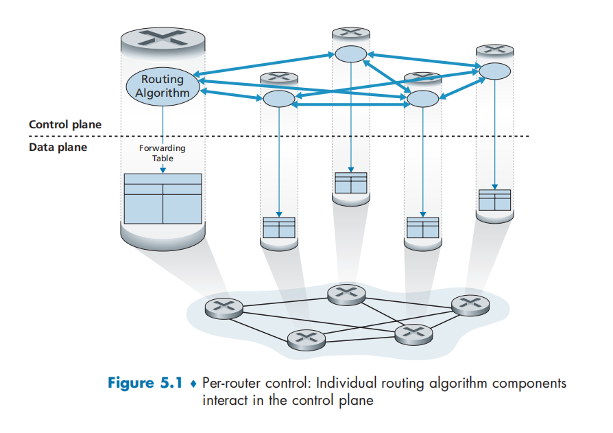​
* 逻辑集中式控制

  * 图显示了逻辑集中式控制器计算并分发转发表以供每台路由器使用的情况
  * 通用的“匹配加动作”抽象允许执行传统的 IP 转发以及其他功能（负载共享、防火墙功能和 NAT）  的丰富集合，而这些功能先前是在单独的中间盒中实现的
  * 该控制器经一种定义良好的协议与每台路由器中的一个**控制代理（CA）** 进行交互，以配置和管理该路由器的转发表

    * CA 一般具有最少的功能，其任务是与**控制器通信并且按控制器命令行事**
    * 这些 CA 既不能直接相互交互，也**不能主动参与计算转发表**。这是每路由器控制和逻辑集中式控制之间的关键差异

  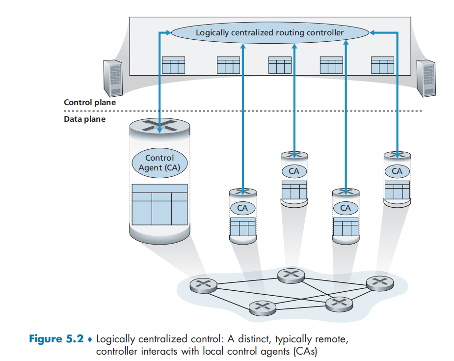​

# 路由选择算法

**路由选择算法** **（routing algorithm）** ，其目的是从发送方到接收方的过程中确定一条通过路由器网络的好的路径（等价于路由）

* 一条好路径指具有最低开销的路径
* 无论网络控制平面采用每路由器控制方法，还是采用逻辑集中式控制方法，必定总是存在一条定义良好的一连串路由器，使得分组能够从发送主机到达接收主机

使用图来描述路由选择问题：

​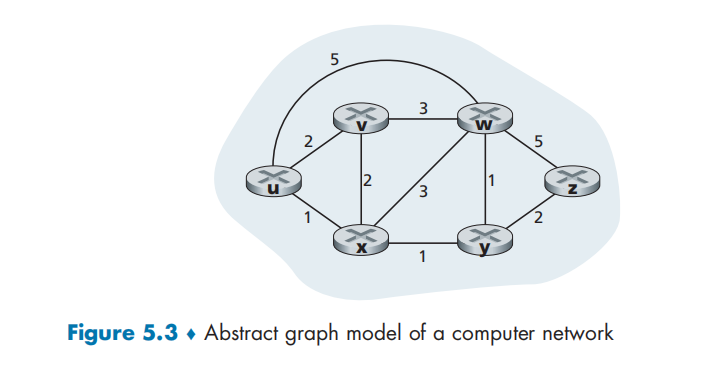​

* $(graph)G=(N，E)$ 是 一 个 $N$ 个节点和 $E$ 条边的集合，其中每条边是取自 $N$ 的一对节点
* 在网络层路由选择的环境中，图中的节点表示路由器，这是做出分组转发决定的点；连接这些节点的边表示这些路由器之间的物理链路；每条边还有一个值表示它的开销

  * 通常， 一条边的开销可反映出对应链路的物理长度（例如一条越洋链路的开销可能比一条短途陆地链路的开销高），它的链路速度，或与该链路相关的金钱上的开销
  * 用 $c(x，y)$ 表示节点 $x$ 和 $y$ 间边的开销
  * $(x，y)∈E$，节点 $y$ 也被称为节点 $x$ 的**邻居（neighbor）**
* 给定任何两个节点 $x$ $y$，  通常在这两个节点之间有许多条路径，每条路径都有一个开销。这些路径中的一条或多条是**最低开销路径** **（least-cost path）**

  * 若在图中的所有边具有相同的开销，则最低开销路径就是**最短路径** **（shortest path）**

## 分类

> 根据算法是集中式还是分散式来划分：

* **集中式路由选择算法** **（centralized routing algorithm）**

  * 用**完整的、全局性**的网络知识计算出从源到目的地之间的最低开销路径
  * 该算法以所有节点之间的连通性及所有链路的开销为输入。要求该算法在真正开始计算以前，要获得这些信息
  * 计算本身可在某个场点进行，或在每台路由器的路由选择组件中重复进行
  * 这里的主要区别在于，集中式算法具有关于连通性和链路开销方面的**完整信息**。具有全局状态信息的算法常被称作**链路状态（Link State， LS）算法**  **，**  因为该算法必须知道网络中每条链路的开销
* **分散式路由选择算法** **（decentralized routing algorithm）**

  * 路由器以迭代、分布式的方式计算出最低开销路径
  * **没有**节点拥有关于所有网络链路开销的完整信息
  * 每个节点仅有与其**直接相连链路的开销知识**即可开始工作。然后，通过迭代计算过程以及与相邻节点的信息交换， 一个节点逐渐计算出到达某目的节点或 一组目的节点的最低开销路径
  * 其中一种算法称为**距离向量（Distance-Vector， DV）算法**。之所以叫作 DV 算法，是因为每个节点维护到网络中所有其他节点的开销（距离）估计的向量。
  * 这种分散式算法，通过相邻路由器之间的交互式报文交换，也许更为天然地适合那些**路由器直接交互**的控制平面

> 根据算法是静态的还是动态的进行划分：

* **静态路由选择算法**（static routing algorithm）

  * 路由随时间的变化非常缓慢，通常是人工进行调整（如人为手工编辑一条链路开销）
* **动态路由选择算法**（dynamic routing algorithm）

  * 随着网络流量负载或拓扑发生变化而改变路由选择路径。
  * 一个动态算法可周期性地运行或直接响应拓扑或链路开销的变化而运行
  * 虽然动态算法易于对网络的变化做出反应，但也更容易受诸如路由选择循环、路由振荡之类问题的影响

> 根据算法是负载敏感的还是负载迟钝的进行划分：

* **负载敏感算法**（load-sensitive algorithm）

  * 链路开销会动态地变化以反映出底层链路的当前拥塞水平。如果当前拥塞的一条链路与高开销相联系，则路由选择算法趋向于绕开该拥塞链路来选择路由
* **负载迟钝的**（load-insensitive）

  * 因为某条链路的开销不明确地反映其当前（或最近）的拥塞水平
  * 当今的因特网路由选择算法（如 RIP、OSPF 和 BGP）  都是**负载迟钝的**

## 链路状态路由选择算法 LS

* 在链路状态算法中，网络拓扑和所有的链路开销都是已知的

  * 实践中这是通过让每个节点向网络中所有其他节点广播链路状态分组来完成的，其中每个链路状态分组包含它所连接的链路的标识和开销
  * 在实践中经常由**链路状态广播**（link state broadcast）算法来完成
  * 节点广播的结果是所有节点都具有该网络的统一 、完整的视图
  * 于是每个节点都能够像其他节点一样，运行 LS 算法并计算出相同的最低开销路径集合
* **Dijkstra 算法**计算从某节点（源节点，我们称之为 $u$）到网络中所有其他节点的最低开销路径

  * Dijkstra 算法是迭代算法，其性质是经算法的第 $k$ 次迭代后，可知道到 $k$ 个目的节点的最低开销路径，在到所有目的节点的最低开销路径之中，这 $k$ 条路径具有 $k$ 个最低开销
* 当 LS 算法终止时，对于每个节点，我们都得到从源节点沿着它的最低开销路径的前一节点。对于每个前一节点，我们又有它的前一节点，以此方式我们可以构建从源节点到所有目的节点的完整路径

  ​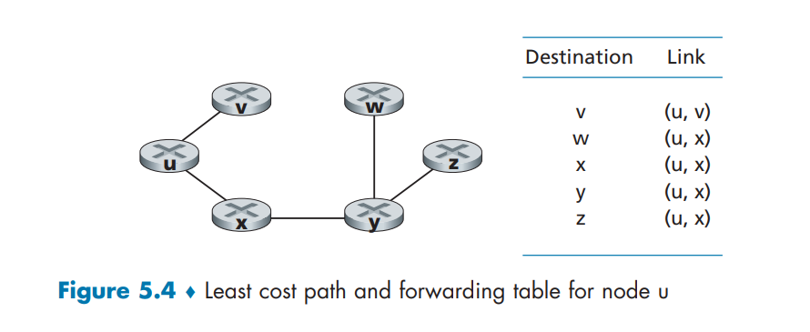​

## 距离向量路由选择算法 DV

* **距离向量**（Distance-Vector，DV）算法是一种迭代的、异步的和分布式的算法

  * 分布式的：每个节点都要从一个或多个直接相连邻居接收某些信息，执行计算，然后将其计算结果分发给邻居
  * 迭代的：此过程一直要持续到邻居之间无更多信息要交换为止。(此算法是自我终止的，即没有计算应该停止的信号，它就停止了)
  * 异步的：它不要求所有节点相互之间步伐一致地操作

记 $d_x(y)$ 为点 x 到点 y 的最低路径开销

Bellman-Ford

$$
d_x(y) = min_v\{\ c(x,v) + d_v(y) \}
$$

* 在 DV 算法中，当节点 x 发现它的直接相连的链路开销变化或从某个邻居接收到一个距离向量的更新时，它就更新其距离向量估计值
* 但是为了一个给定的目的地 y 而更新它的转发表，节点 x 真正需要知道的不是到 y 的最短路径距离，而是沿着最短路径到 y 的 下一跳路由器邻居节点$v^*(y)$​
* 节点具有的唯一信息是它到直接相连邻居的链路开销和它从这些邻居接收到的信息

  * 每个节点等待来自任何邻居的更新，当接收到一个更新时计算它的新距离向量并向它的邻居分布其新距离向量

​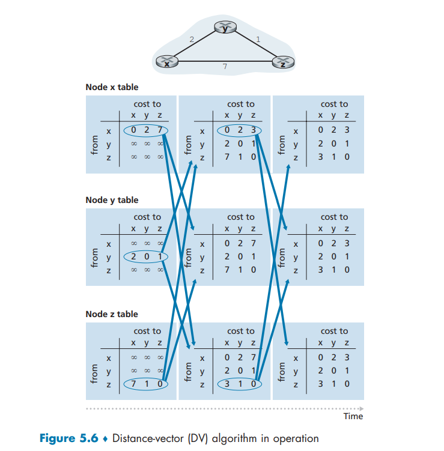​

### **链路开销改变与链路故障**

当一个运行 DV 算法的节点检测到从它自己到邻居的链路开销发生变化时，它就更新其距离向量，并且如果最低开销路径的开销发生了变化，向邻居通知其新的距离向量

* 在 $t_0$ 时 刻 ，y 检测到链路开销变化，更新其距离向量，并通知其邻居这个变化，因为最低开销路径的开销已改变
* 在 $t_1$ 时 刻 ，z 收到来自 y 的更新报文并更新了其距离表。它计算出到 x 的新最低开销，它向其邻居发送了它的新距离向量
* 在 $t_2$ 时 刻 ，y 收到来自 z 的更新并更新其距离表。y 的最低开销未变，因此 y 不发送任何报文给 z。该算法进入静止状态

因此，对于该 DV 算法只需两次迭代就到达了静止状态

**路由选择环路**（routing loop），即为到达 x，y 通过 z 路由，z 又通过 y 路由。目的地为 x 的分组在 $t_1$ 时刻到达 y 或 z 后，将在这两个节点之间不停地（或直到转发表发生改变为止）来回反复

### 增加毒性逆转

以上描述的特定循环的场景可以通过使用一种称为**毒性逆转**（poisoned reverse） 的技术而加以避免

* 如果 z 通过 y 路由选择到目的地 x，  则 z 将通告 y，  它（即 z）到 x 的距离是无穷大

## LS 与 DV 的比较

DV 和 LS 算法采用互补的方法来解决路由选择计算问题

* DV 算法，每个节点仅与它的**直接相连**的邻居交谈，但它为其邻居提供了从它自己到网络中（它所知道的）所有其他节点的最低开销估计
* LS 算法需要全局信息

记 $V$ 是节点（路由器）的集合，而 $E$ 是边（链路）的集合

* 报文复杂性

  * LS 算法要求每个节点都知道网络中每条链路的开销。 这就要求要发送 $O(|V|*|E|)$ 个报文

    * 而且无论何时一条链路的开销改变时，必须向所有节点发送新的链路开销
  * DV 算法要求在每次迭代时，在两个直接相连邻居之间交换报文

    * 算法收敛所需时间依赖于许多因素。当链路开销改变时，DV 算法仅当在新的链路开销导致与该链路相连节点的最低开销路径发生改变时，才传播已改变的链路开销
* 收敛速度

  * LS：要求 $O(|V|*|E|)$ 个报文的 $O(|V|^2)$ 算法
  * DV 算法收敛较慢，且在收敛时会遇到路由选择环路，还会遭遇无穷计数的问题
* 健壮性：如果一台路由器发生故障、行为错乱或受到蓄意破坏时

  * 对于 LS 算法，路由器能够向其连接的链路（而不是其他链路）广播不正确的开销

    * 作为 LS 广播的一部分，一个节点也可损坏或丢弃它收到的任何 LS 广播分组
    * 但是 一个 LS 节点仅计算自己的转发表；其他节点也自行执行类似的计算
    * 这就意味着在 LS 算法下，路由计算在某种程度上是分离的，提供了一定程度的健壮性
  * 在 DV 算法下，一个节点可向任意或所有目的节点通告其不正确的最低开销路径

    * 每次迭代时，在 DV 算法中一个节点的计算会传递给它的邻居，然后在下次迭代时再间接地传递给邻居的邻居
    * 在此情况下，DV 算法中一个不正确的节点计算值会扩散到整个网络

# 因特网中自治系统内部的路由选择

将路由器组织进**自治系统**（Autonomous System，AS） 来解决规模问题和管理自治问题

* 每个 AS 由一组通常处在相同管理控制下的路由器组成
* 在相同 AS 中的路由器都运行相同的路由选择算法并且有彼此的信息
* 在一个自治系统内运行的路由选择算法叫作**自治系统内部****路由选择协议**（intra-autonomous system routing protocol）

## 开放最短路优先 OSPF

OSPF 路由选择及其关系密切的协议 IS-IS 都被广泛用于因特网的 AS 内部路由选择

* OSPF 是一种链路状态协议，它使用洪泛链路状态信息和 Dijkstra 最低开销路径算法
* 使用 OSPF，一台路由器构建了一幅关于整个自治系统的完整拓扑图。每台路由器在本地运行 Dijkstra 的最短路径算法，以确定一个以自身为根节点到所有子网的最短路径树（LS算法）
* 使用 OSPF 时，路由器向自治系统内所有其他路由器广播路由选择信息，而不仅仅是向其相邻路由器广播

  * 每当一条链路的状态发生变化时（如开销的变化或连接/中断状态的变化），路由器就会广播链路状态信息
  * 即使链路状态未发生变化，它也要周期性地 （至少每隔 30 min 一次）广播链路状态
* OSPF 通告包含在 OSPF 报文中

  * 该 OSPF 报文直接由 IP 承载，对 OSPF 其上层协议的值为 89
  * OSPF 协议必须自己实现诸如可靠报文传输、链路状态广播等功能
  * OSPF 协议还要检查链路正在运行（通过向相连的邻居发送 HELLO 报文），并允许 OSPF 路由器获得相邻路由器的网络范围链路状态的数据库

> 优点

* 安全

  * 能够鉴别 OSPF 路由器之间的交换（如链路状态更新）
  * 使用鉴别，仅有受信任的路由器能参与一个 AS 内的 OSPF 协议，因此可防止恶意入侵者将不正确的信息注入路由器表内（在默认状态下，路由器间的 OSPF 报文是未被鉴别的并能被伪造）

    * 能够配置两类鉴别，即简单的和 MD5 的
    * 使用简单的鉴别，每台路由器配置相同的口令。当一台路由器发送一个 OSPF 分组，它以明文方式包括了口令
    * MD5 鉴别基于配置在所有路由器上的共享秘密密钥。对发送的每个 OSPF 分组，路由器对附加了秘密密钥的 OSPF 分组内容计算 MD5 散列值。然后路由器将所得的散列值包括在该 OSPF 分组中。 接收路由器使用预配置的秘密密钥计算出该分组的 MD5 散列值，并与该分组 携带的散列值进行比较，从而验证了该分组的真实性。在 MD5 鉴别中也使用了序号对重放攻击进行保护
* 多条相同开销的路径

  * 当到达某目的地的多条路径具有相同的开销时，OSPF 允许使用多条路径（当存在多条相等开销的路径时，无须仅选择单一的路径来承载所有的流量）
* 对单播与多播路由选择的综合支持

  * 多播 OSPF（MOSPF）提供对 OS-PF 的简单扩展，以便提供多播路由选择
  * MOSPF 使用现有的 OSPF 链路数据库， 并为现有的 OSPF 链路状态广播机制增加了一种新型的链路状态通告
* 支持在单个 AS 中的层次结构

  * 一个 OSPF 自治系统能够层次化地配置多个区域
  * 每个区域都运行自己的 OSPF 链路状态路由选择算法，区域内的每台路由器都向该区域内的所有其他路由器广播其链路状态
  * 在每个区域内，一台或多台区域边界路由器负责为流向该区域以外的分组提供路由选择
  * 最后，在 AS 中只有一个 OSPF 区域配置成主干区域

    * 主干区域的主要作用是为该 AS 中其他区域之间的流量提供路由选择
    * 该主干总是包含本 AS 中的所有区域边界路由器，并且可能还包含了一些非边界路由器
    * 在 AS 中的区域间的路由选择要求分组先路由到一个区域边界路由器（区域内路由选择），然后通过主干路由到位于目的区域的区域边界路由器， 进而再路由到最终目的地

# ISP 之间的路由选择：BGP

OSPF 是一个 AS 内部路由选择协议。当在**相同 AS 内**的源和目的地之间进行分组选路时，分组遵循的路径完全由 AS 内路由选择协议所决定。

然而，当分组跨越多个 AS 进行路由时，需要一个**自治系统间****路由选择协议** （inter-autonomous system routing protocol）。因为 AS 间路由选择协议涉及多个 AS 之间的协调，所以 AS 通信必须运行相同的 AS 间路由选择协议。在因特网中，所有的 AS 运行相同的 AS 间路由选择协议，称为**边界网关协议**（Broder Gateway Protocol，BGP）

## BGP 的作用

考虑一个 AS 和在该 AS 中的任意一个路由器

* 每台路由器具有一张转发表，该转发表在将到达分组转发到出路由器链路的过程中起着主要作用
* 对于位于相同 AS 中的目的地而言，在路由器转发表中的表项由 AS 内部路由选择协议所决定
* 而对于位于该 AS 外部的目的地，就要使用 BGP

  * 在 BGP 中，分组并不是路由到一个特定的目的地址，相反是路由到 CIDR 化的前缀，其中每个前缀表示一个子网或一个子网的集合

作为一种 AS 间的路由选择协议，BGP 为每台路由器提供了一种完成以下任务的手段：

* **从邻居 AS 获得前缀的可达性信息**

  * BGP 允许每个子网向因特网的其余部分通告它的存在
  * BGP 确保在因特网中的所有 AS 知道该子网
  * 如果没有 BGP 的话，每个子网将是隔离的孤岛，即它们孤独地存在，不为因特网其余部分所知和所达
* **确定到该前缀的“最好的”路由**

  * 一台路由器可能知道两条或更多条到特定前缀的不同路由。为了确定最好的路由，该路由器将本地运行一个 **BGP 路由选择过程**（使用它经过相邻的路由器获得的前缀可达性信息）
  * 该最好的路由将基于策略以及可达性信息来确定

## 通告 BGP 路由信息

对于每个 AS， 每台路由器要么是一台**网关路由器**（gateway router），要么是一台内部路由器（internal router）。

* 网关路由器是一台位于 AS 边缘的路由器，它直接连接到在其他 AS 中的一台或多台路由  器
* 内部路由器仅连接在它自己 AS 中的主机和路由器

​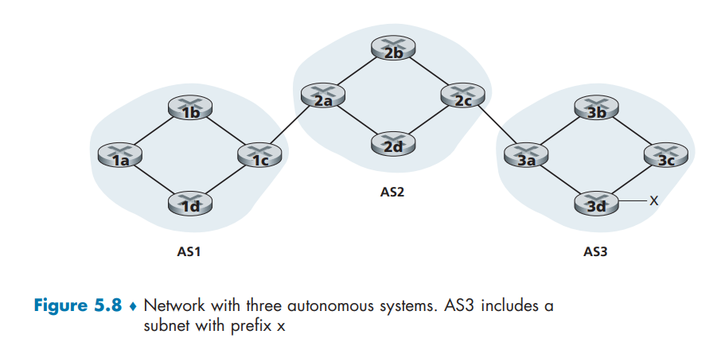​

向图 5-8 中显示的所有路由器通告对于前缀 x 的可达性信息

1. AS3 向 AS2 发送一个 BGP 报文，告知 x 存在并且位于 AS3 中；将该报文表示为 `AS3 x`​
2. 然后 AS2 向 AS1 发送一个 BGP 报文， 告知 x 存在并且能够先通过 AS2 然后进入 AS3 进而到达 x;  将该报文表示为 `AS2 AS3 x`​
3. 以这种方式，每个自治系统不仅知道 x 的存在，而且知道通向 x 的自治系统的路径

​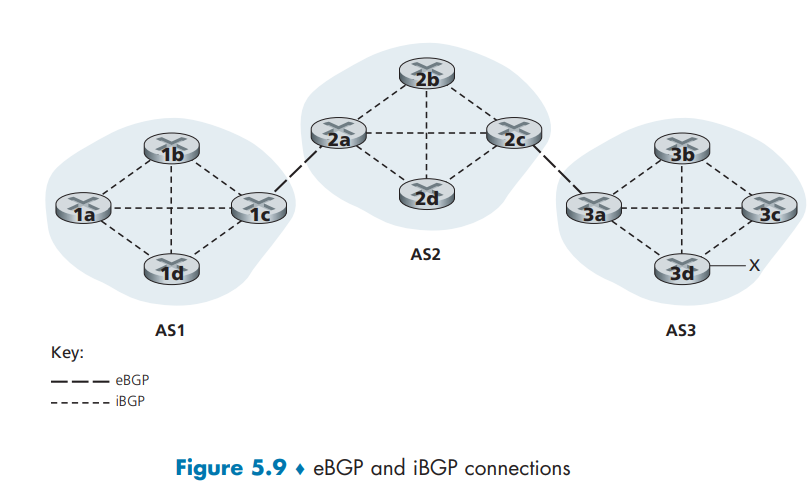​

* 在 BGP 中，每对路由器通过使用 179 端口的半永久 TCP 连接交换路由选择信息
* 每条直接连接以及所有通过该连接发送的 BGP 报文，称为 BGP 连接 （BGP connection）

  * 跨越两个 AS 的 BGP 连接称为外部 BGP（eBGP）连接
  * 在相同 AS 中的两台路由器之间的 BGP 会话称为内部 BGP（iBGP）连接
* 对于直接连接在不同 AS 中的网关路由器的每条链路而言，通常有一条 eBGP 连接
* 在每个 AS 中的路由器之间还有多条 iBGP 连接

  * iBGP 连接并不总是与物理链路对应

为了传播可达性信息，使用了 iBGP 和 eBGP 会话。向 AS1 和 AS2 中的所有路由器通告前缀 x 的可达性信息：

1. 网关路由器 3a 先向网关路由器 2c 发送一个 eBGP 报文 `AS3 x`​
2. 网关路由器 2c 然后向 AS2 中的所有其他路由器（包括网关路由器 2a）发送 iBGP 报 文 `AS3 x`​
3. 网关路由器 2a 接下来向网关路由器 1c 发送一个 eBGP 报文 `AS2 AS3 x`​
4. 最后，网关路由器 1c 使用 iBGP 向 AS1 中的所有路由器发送报文 `AS2 AS3 x`​
5. 在这个过程完成后，在 AS1 和 AS2 中的每个路由器都知道了 x 的存在并且也都知道了通往 x 的 AS 路径

在真实的网络中，从某个给定的路由器到某个给定的目的地可能有多条不同的路径，每条通过了不同的 AS 序列

## 确定最好的路由

从一个给定的路由器到一个目的子网可能有多条路径。事实上，因特网中的路由器常常接收到很多不同的可能路径的可达性信息。 一台路由器如何在这些路径之间进行选择（并且再相应地配置它的转发表）

​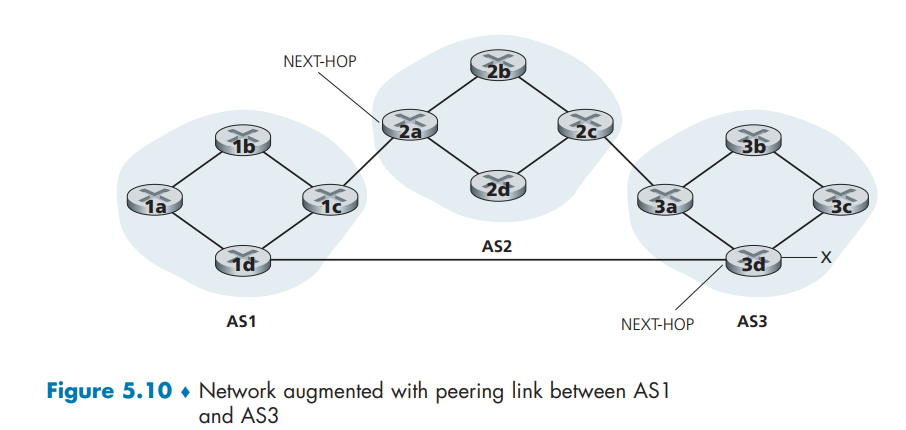​

当路由器通过 BGP 连接通告前缀时，它在前缀中包括一些 **BGP** **属性**（BGP attribute）

* 前缀及其属性称为**路由** （route）

  * 两个较为重要的属性是 AS-PATH 和 NEXT-HOP
* AS-PATH 属性包含了通告已经通过的 AS 的列表

  * 为了生成 AS-PATH 的值，当一个前缀通过某 AS 时，该 AS 将其 ASN 加入 AS-PATH 中的现有列表
  * 例如，在图 5-10 中，从 AS1 到子网 x 有两条路：其中一条使用 AS-PATH `AS2 AS3`​;而另一条使用 AS-PATH `AS3`​
  * BGP 路由器还使用 AS-PATH 属性来检测和防止通告环路：如果一台路由器在路径列表中看到包含了它自己的 AS， 它将拒绝该通告
* NEXT-PATH 在 AS 间和 AS 内部路由选择协议之间提供关键链路方面具有作用

  * NEXT-HOP 是 AS-PATH **起始的路由器接口**的 IP 地址
  * 如图 5-10 中所指示的那样，对于从 AS1 通过 AS2 到 x 的路由  “AS2 AS3 x”，其属性 NEXT-HOP 是路由器 2a 左边接口的 IP 地址。

    对于从 AS1 绕过 AS2 到 x 的路由 `AS3 x`​，其 NEXT-HOP 属性是路由器 3d 最左边接口的 IP 地址。总的说来， 在这个假想的例子中，AS1 中的每台路由器都知道了到前缀 x 的两台 BGP 路由：

    路由器 2a 的最左侧接口的 IP 地址：`AS2 AS3;x`​

    路由器 3d 的最左侧接口的 IP 地址：`AS3;x`​

    这里，每条 BGP 路由包含 3 个组件：`NEXT-HOP ASPATH;目的前缀`​
  * 在实践中， 一 条 BGP 路由还包括其他属性
  * NEXT-HOP 属性是不属于 AS1 的某路由器的 IP 地址，然而，包含该 IP 地址的子网直接连接到 AS

### 热土豆路由选择

‍

### 路由器选择策略

‍

# SDN 控制平面

SDN 体系结构具有 4 个关键特征

* **基于流的转发**

  * SDN 控制的交换机的分组转发工作，能够基于传输层、网络层或链路层首部中任意数量的首部字段值进行；传统方法中 IP 数据报的转发仅依据数据报的目的 IP 地址进行
  * 分组转发规则被精确规定在交换机的流表中
  * SDN 控制平面的工作是计算、管理和安装所有网络交换机中的流表项
* **数据平面与控制平面分离**

  * 数据平面由网络交换机组成，交换机是相对简单（但快速）的设备，该设备在它们的流表中执行“匹配加动作”的规则
  * 控制平面由服务器以及决定和管理交换机流表的软件组成
* **网络控制功能**：位于数据平面交换机外部

  * 与传统的路由器不同，软件在服务器上执行，该服务器与网络交换机截然分开且与之远离
  * 如在图 5-14 中所示，控制平面自身由两个组件组成：

    * 一个 SDN 控制器（或网络操作系统）

      * 维护准确的网络状态信息

        * 例如，远程链路、交换机和主机的状态
      * 为运行在控制平面中的网络控制应用程序提供这些网络状态信息

        * 这些应用程序通 过这些方法能够监视、编程和控制下面的网络设备
        * 实践中控制器仅是逻辑上集中的，通常在几台服务器上实现，这些服务器提供协调的、可扩展的性能和高可用性
    * 若干网络控制应用程序
* **可编程的网络**

  * 通过运行在控制平面中的网络控制应用程序，该网络是可编程的
  * 这些应用程序代表了 SDN 控制平面的“智力”，使用了由 SDN 控制器提供的 API 来定义和控制网络设备中的数据平面
  * 例如，一个路由选择网络控制应用程序可以决定源和目的地之间的端到端路径（例如，通过使用由 SDN 控制器维护的节点状态和链路状态信息，执行 Dijkstra 算法）

    另一个网络应用程序可以执行访问控制，即决定交换机阻挡哪个分组

    还有一个应用程序可以用执行服务器负载均衡的方式转发分组

​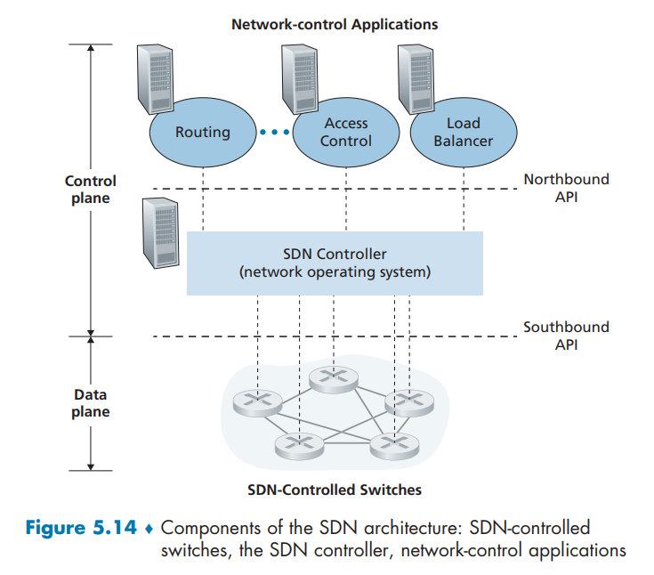​

SDN 表示了一种意义重大的网络功能的“分类”，即数据平面交换机、SDN 控制器和网络控制应用程序是分离的实体，该实体可以由不同的厂商和组织机构所提供

这与 SDN 之前模式形成了鲜明对照，在 SDN 之前模式中，交换机/路由器（连同其嵌入的控制平面软件和协议实现）是一个整体，它是垂直、综合的，并且由单一的厂商所销售

## SDN 控制平面

SDN 控制平面大体划分为两个部分，即 SDN 控制器和 SDN 网络控制应用程序

### SDN 控制器

* 通信层：SDN 控制器和受控网络设备之间的通信

  * 如果 SDN 控制器要控制远程 SDN 使能的交换机、主机或其他设备的运行，需要一个协议来传送控制器与 这些设备之间的信息
  * 设备必须能够向控制器传递本地观察到的事件（例如，一个报文指示一条附属链路已经激活或停止，一个设备刚刚加入了网络，或一个心跳指示某设备已经启动和运行），这些事件向 SDN 控制器提供该网络状态的最新视图
  * 这个协议构成了控制器体系结构的最底层
  * 控制器和受控设备之间的通信跨越了一个接口，它现在被称为控制器的“南向”接口
* 网络范围状态管理层

  * 由 SDN 控制平面所做出的最终控制决定（例如配置所有交换机的流表以取得所希望的端到端转发，实现负载均衡，或实现一种特定的防火墙能力），将要求控制器具有有关网络的主机、链路、交换机和其他 SDN 控制设备的最新状态信息
  * 交换机的流表包含计数器，其值也可以由网络控制应用程序很好地使用，这些值应当为应用程序所用
  * 控制平面的终极目标是**决定用于各种受控设备的流表**，控制器可以维护这些表的拷贝
  * 这些信息都构成了由 SDN 控制器维护的网络范围“状态”的例子
* 对于网络控制应用程序层的接口

  * 控制器通过它的“北向”接口与网络控制应用程序交互
  * 该 API 允许网络控制应用程序在状态管理层之间读/写网络状态和流表

    * 当状态改变事件出现时，应用程序能够注册进行通告
  * 可以提供不同类型的 API

​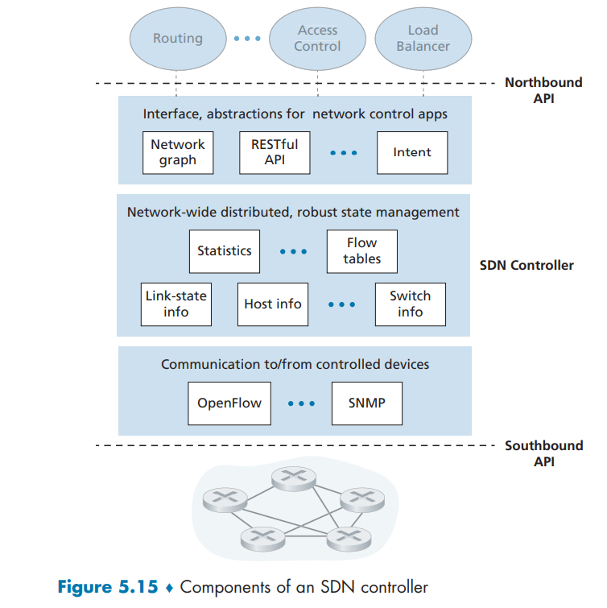​

SDN 控制器被认为是“逻辑上集中”的，即该控制器可以被外部视为一个单一、整体的服务（例如，从 SDN 控制设备和外部的网络控制应用程序的角度看）。然而，出于故障容忍、高可用性或性能等方面的考虑，在实践中这些服务和用于保持状态信息的数据库一般通过分布式服务器集合实现

## OpenFlow 协议

## 数据平面和控制平面交互的例子

# ICMP：因特网控制报文协议

* 因特网控制报文协议 （ICMP），被主机和路由器用来彼此沟通**网络层**的信息
* ICMP 最典型的用途是**差错报告**

  * 例如，当运行一个 HTTP 会话时，会遇到一些诸如“目的网络不可达”之类的错误报文
  * 这种报文就来源于 ICMP。在某个位置，IP 路由器不能找到一条通往 HTTP 请求中所指定的主机的路径，该路由器就会向主机生成并发出一个 ICMP 报文以指示该错误
* ICMP 通常被认为是 IP 的一部分，但从体系结构上讲它位于 IP 之上，因为 ICMP 报文是承载在 IP 分组中的

  * 即 ICMP 报文是作为 IP 有效载荷承载的，就像 TCP 与 UDP 报文段作为 IP 有效载荷被承载那样
  * 当一台主机收到一个指明上层协议为 ICMP 的 IP 数据报时（**上层协议编码为 1**），它分解出该数据报的内容给 ICMP， 就像分解出一个数据报的内容给 TCP 或 UDP 一样。
* ICMP 报文有一个**类型字段**和一个**编码字段**，并且包含引起该 ICMP 报文首次生成的 **IP 数据报的首部和前 8 个字节**（以便发送方能确定引发该差错的数据报）

  * 并不仅是用于通知差错情况
* ping 程序发送一个 ICMP 类型 8 编码 0 的报文到指定主机

  * 看到回显（echo）请求，目的主机发回一个类型 0 编码 0 的 ICMP 回显回答
  * 大多数 TCP/IP 实现直接在操作系统中支持 ping 服务器，即该服务器不是一个进程。客户程序需要能够指示操作系统产生一个类型 8 编码 0 的 ICMP 报文
* 另一个 ICMP 报文是**源抑制报文**

  * 这种报文在实践中很少使用。其最初目的是执行拥塞控制，即使得拥塞的路由器向一台主机发送一个 ICMP 源抑制报文，以强制该主机减小其发送速率
  * TCP 在传输层有自己的拥塞控制机制，不需要利用网络层中的反馈信息，如 ICMP 源抑制报文

|ICMP 类型|编码|描述|
| ---------| ----| --------------------------|
|0|0|回显回答（对 ping 的回答）|
|3|0|目的网络不可达|
|3|1|目的主机不可达|
|3|2|目的协议不可达|
|3|3|目的端口不可达|
|3|6|目的网络未知|
|3|7|目的主机未知|
|4|0|源抑制（拥塞控制）|
|8|0|回显请求|
|9|0|路由器通告|
|10|0|路由器发现|
|11|0|TTL 过期|
|12|0|IP 首部损坏|

# 网络管理和 SNMP

网络管理包括了硬件、软件和人类元素的设置、综合和协调，以监视、测试、轮询、配置、分析、评价和控制网络及网元资源，用合理的成本满足实时性、运营性能和服务质量的要求

## 网络管理框架

​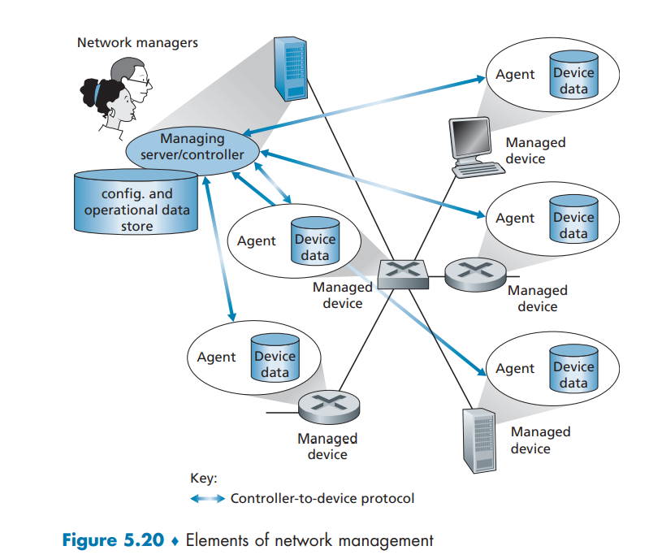​

* **管理服务器**（managing server）是一个应用程序，通常有人的参与，并运行在网络运营中心（NOC）的集中式网络管理工作站上

  * 管理服务器是执行网络管理活动的地方，它控制网络管理信息的收集、处理、分析和/或显示。正是在这里，发起控制网络行为的动作，人类网络管理员与网络设备打交道
* **被管设备**（managed device）是网络装备的一部分（包括它的软件），位于被管理的网络中

  * 被管设备可以是一台主机、路由器、交换机、中间盒、调制解调器、温度计或其他联网的设备
  * 在一个被管设备中，有几个**被管对象**（managed object）

    * 被管设备中硬件的实际部分（例如，一块网络接口卡只是一台主机或路由器的一个组件）
    * 用于这些硬件及软件组件的配置参数（例如，像 OSPF 这样的 AS 内部路由选择协议）
* 一个被管设备中的每个被管对象的关联信息收集在**管理信息库**（Management Information Base，MIB） 中

  * 这些信息的值可供管理服务器所用（并且在许多场合下能够被设置）
  * 一个 MIB 对象可以是：

    * 一个计数器，例如由于 IP 数据报首部差错而由路由器丢弃的 IP 数据报的数量，或一台主机接收到的 UDP 报文段的数量
    * 运行在一台 DNS 服务器上的软件版本的描述性信息
    * 一个特定设备功能是否正确的状态信息
    * 到一个目的地的路由选择路径的特定协议的信息
  * MIB 对象由称为 SMI（Structure of Management Information）的数据描述语言所定义

    * 使用形式化定义语言可以确保网络管理数据的语法和语义是定义良好的和无二义性的
  * 相关的 MIB 对象被收集在 MIB 模块（module）中
* 在每个被管设备中还驻留有**网络管理代理**（network management agent）

  * 它是运行在被管设备中的一个进程，该进程与管理服务器通信，在管理服务器的命令和控制下在被管设备中采取本地动作
* 网络管理框架的最后组件是**网络管理协议**（network management protocol）

  * 该协议运行在管理服务器和被管设备之间
  * 允许管理服务器查询被管设备的状态，并经过其代理间接地在这些设备上采取行动
  * 代理能够使用网络管理协议向管理服务器通知异常事件（如组件故障或超过了性能阈值）
  * 网络管理协议自己不能管理网络。恰恰相反，它为网络管理员提供了一种能力，使他们能够管理 （“监视、测试、轮询、配置、分析、评价和控制”）网络

## 简单网络管理协议

**简单网络管理协议**（Simple Network Management Protocol）是一个应用层协议

* 用于在管理服务器和代表管理服务器执行的代理之间**传递网络管理控制和信息报文**
* SNMP 最常使用的是请求响应模式，其中 SNMP 管理服务器向 SNMP 代理发送一个请求，代理接收到该请求后，执行某些动作，然后对该请求发送一个回答

  * 请求通常用于查询（检索）或修改（设置）与某被管设备关联的 MIB 对象值
* SNMP 第二个常被使用的是代理向管理服务器发送的一种非请求报文，该报文称为**陷阱报文**（trap message）

  * 陷阱报文用于通知管理服务器，一个异常情况（例如一个链路接口启动或关闭）已经导致了 MIB 对象值的改变

|**SNMPv2** **PDU 类型**|**发送方-接收方**|**描述**|
| --------------| -----------------------------| ------------------------------------------------------------------------------------------|
|GetRequest|管理者到代理|取得一个或多个 MIB 对象实例值|
|GetNextRequest|管理者到代理|取得列表或表格中下一个 MIB 对象实例值|
|GetBulkRequest|管理者到代理|以大数据块方式取得值，例如大表中的值|
|InformRequest|管理者到管理者|向不能访问的远程管理实体通知 MIB 值|
|SetRequest|管理者到代理|设置一个或多个 MIB 对象实例的值|
|Response|代理到管理者或管理者 到管理者|对 GetRequest，GetNextRequest，GetBulkRequest，SetRequest PDU，或 InformRequest 产生的响应|
|SNMPv2-Trap|代理到管理者|向管理者通知一个异常事件|

表中显示了 SNMPv2 定义的 7 种类型的报文，这些报文一般称为**协议数据单元**（PDU）

​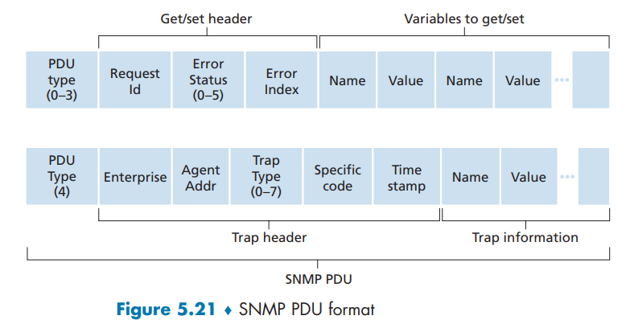​

‍
