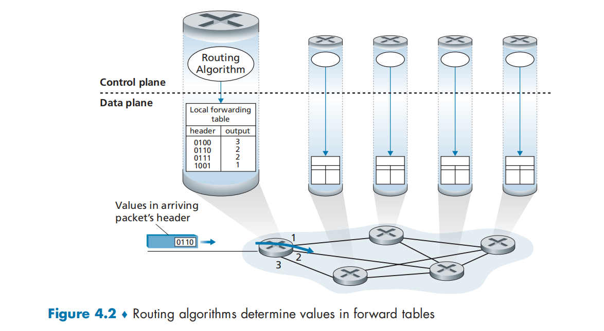
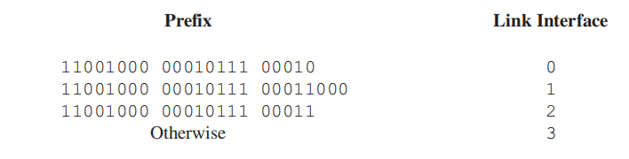
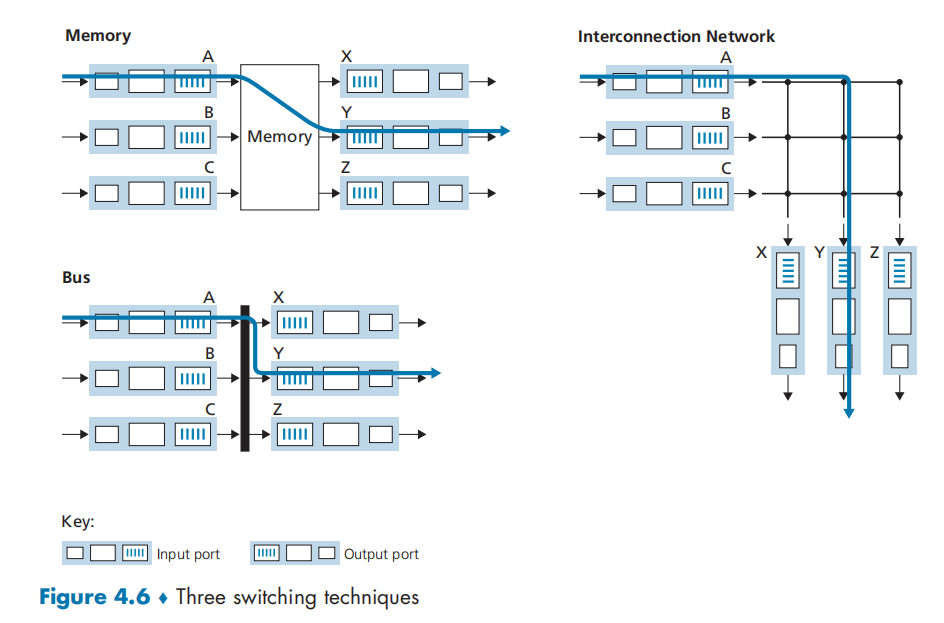
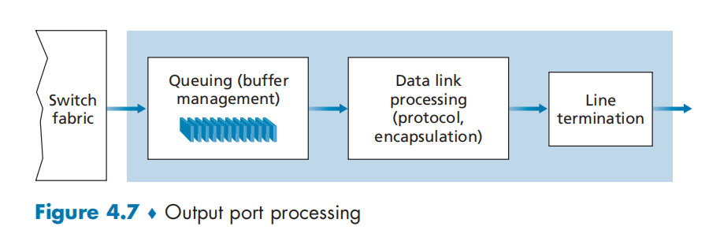
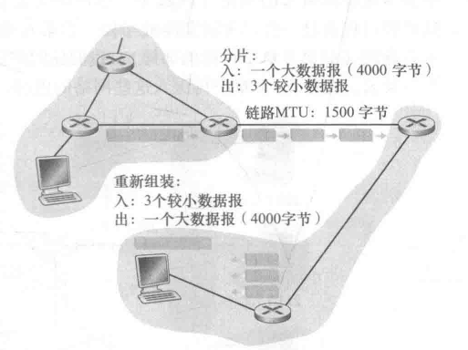
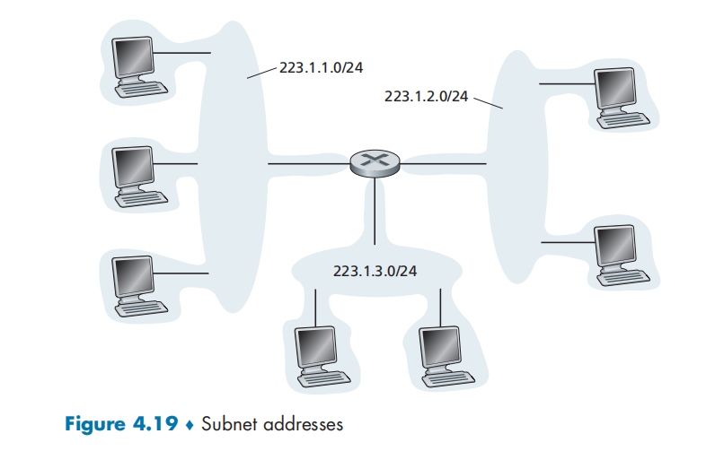

# 网络层：数据平面

# 概述

在网络中的每一台主机和路由器中都有一个网络层部分

数据平面功能决定到达路由器输入链路的数据报（网络层的分组），如何转发到该路由器的输出链路

* 导论

  * 数据平面：每台路由器的功能
  * 控制平面：网络范围的逻辑
* 路由器组成
* IP

  * 数据报格式
  * 分片
  * IPv4 地址
  * NAT：网络地址转换
  * IPv6
* 通用转发和 SDN

  * 匹配
  * 行动
  * OpenFlow 的运行示例

## 网络层服务

* 在发送主机和接收主机对之间传送**段** **（segment）**
* 在发送端将段封装到数据报中
* 在接收端，将段上交给传输层实体网络层协议存在于**每一个**主机和路由器
* 路由器检查每一个经过它的数据报的头部

​​

现有 H1 和 H2 两台主机在这两台主机之间的路径上有几台路由器，H1 向 H2 发送信息：

* H1 中的网络层取得来自于 H1 传输层的报文段，将每个报文段封装成一个数据报，然后向相邻路由器 R1 发送该数据报
* H2 中的网络层接收来自相邻路由器 R2 的数据报，提取出传输层报文段，并将其向上交付给 H2 的传输层

每台路由器：

* 数据平面：**从其输入链路向其输出链路转发数据报**

  * 本地，每个路由器的功能
* 控制平面：**协调本地的路由器转发动作** **，使得数据报沿着源和目的地主机之间的路由器路径进行端到端传送**

  * 全局，网络范围内的逻辑

路由器具有截断的协议栈：没有网络层以上的部分——路由器不运行应用层和传输层协议

## 转发和路由选择

网络层的作用：将分组从一台发送主机移动到一台接收主机，需要使用两种网络层功能

* **转发** **（forwarding）/交换**：将分组从一个输入链路接口转移到适当的输出链路接口的路由器本地动作

  * 当一个分组到达路由器的一条输入链路时，该路由器必须将该分组移动到适当的输出链路
  * 转发是在**数据平面**中实现的唯一功能
  * 分组可能被路由器阻挡来源于（已知的恶意主机），或经由多条出链路发送
  * 是一个局部功能，使用硬件实现
* **路由选择** **（routing）** ：确定分组从源到目的地所采取的端到端路径的网络范围处理过程

  * 当分组从发送方流向接收方时，网络层必须决定这些分组所采用的路由或路径
  * **路由选择算法** **（routing algorithm）** ：计算这些路径的算法
  * 路由选择在网络层的**控制平面**中实现
  * 是一个全局功能，通常用软件实现

### 转发表

每台网络路由器都有一个**转发表** **（forwarding table）**

* 路由器检查到达分组首部的一个或多个字段值，进而使用这些首部值在其转发表中的索引，通过这种方法来转发分组

  * 这些值对应存储在转发表项中的值，指出了该分组将被转发至哪个输出链路接口

### 传统方法配置转发表

* 路由选择算法运行在每台路由器中
* 在一台路由器中的路由选择算法与在其他路由器中的路由选择算法通信，以计算出它的转发表中的值
* 这种通信根据路由选择协议交换包含路由选择信息的路由选择报文执行

​​

### SDN 方法配置转发表

**软件定义网络** **（Software-Defined Networking， SDN）** ：

* **远程控制器**计算和分发转发表以供每台路由器所使用

  * 远程控制器可能是现在具有高可靠性和冗余的远程数据中心中，并由 ISP 或第三方管理
  * 路由器和远程控制器通过交换包含转发表和其他路由选择信息的报文进行通信
* 数据平面的组件与传统方式是相同的
* 控制平面的路由选择功能与物理的路由器是分离的

  * 路由选择设备仅执行转发
  * 远程控制器计算并分发转发表
* 软件定义：计算转发表并于路由器交互的控制器是用软件实现的

​​

## 网络服务模型

**网络服务模型（network service model）** ：定义了分组在发送端系统与接收端系统之间的端到端运输特性，可能有以下服务：

* 确保交付：该服务确保分组最终将到达目的地
* 具有时延上界的确保交付：该服务不仅确保分组的交付，而且在特定的主机到主机时延上界内交付
* 有序分组交付：该服务确保分组以它们发送的顺序到达目的地
* 确保最小带宽：该服务模仿在发送主机和接收主机之间的一条以特定比特率传输的链路的行为。只要发送主机以低于该特定比特率的速率传输比特，则所有分组最终都会交付到目的主机
* 安全性：网络层能够在源加密所有数据报并在目的地解密这些分组，从而对所有传输层的报文段提供机密性

### 尽力而为服务

因特网的网络层提供了单一的服务，称为**尽力而为服务**（best-effort service）

* 传送的分组不能保证按照发送顺序被接收
* 不能保证最终交付
* 不能保证端到端时延
* 不能保证有最小带宽

尽管这个服务模型看上去没有提供任何服务，但因特网的基本尽力而为服务模型与适当带宽供给相结合已经被证明足够好

### ATM 网络体系结构

* 确保按序时延
* 有界时延
* 确保最小带宽

### 集成服务体系结构

* 提供端到端时延保证
* 无拥塞通信

## 分组交换机

分组交换机：指一台通用分组交换设备根据分组首部字段中的值，从输入链路接口到输出链路接口转移分组。分组交换机分为两类：

* **链路层交换机（link-layer switch）** ：基于链路层帧中的字段值做出转发决定
* **路由器（router）** ：基于网络层数据报中的首部字段值做出转发决定

# 路由器工作原理

​​

## 核心部件

转发功能：

* 输入端口（input port）

  * 在路由器中执行终结**入物理链路**的物理层功能（Input port 中最左侧方框和 Output port 中最右侧方框）
  * 与位于入链路远端的数据链路层交互来执行数据链路层功能（Input port 和 Output port 的中间方框）
  * 执行查找功能（Input port 最右侧方框），通过查询转发表决定路由器的输出端口，到达的分组通过路由器的交换结构转发到输出端口
  * 控制分组从输入端口转发到路由选择处理器
* 交换结构

  * 交换结构将路由器的输入端口连接到它的输出端口。这种交换结构完全包含在路由器之中（一个网络路由器中的网络）
* 输出端口 （output port）

  * 输出端口存储从交换结构接收的分组并通过执行必要的链路层和物理层功能在输出链路上传输这些分组
  * 当一条链路时双向的（承载两个方向的流量）时候，输出端口通常与该链路的输入端口成对出现在同一线路卡上
* 路由选择处理器

  * 执行**控制平面功能**和网络管理功能
  * 在传统路由器中，执行路由选择协议，维护路由选择表与关联链路状态信息，并为该路由器计算转发表
  * 在 SDN 路由器中，路由选择处理器负责与远程控制器通信，目的是接收由远程控制器计算的转发表项，并在该路由器的输入端口安装这些表项

路由器的输入端口、输出端口和交换结构几乎都是使用硬件实现的

* 数据平面以纳秒时间尺度运行，路由器的控制功能以毫秒或秒时间尺寸运行
* 控制功能包括：

  * 执行路由协议
  * 对上线或下线的连接链路进行响应
  * 与远程控制器通信（在 SDN 场合）
  * 执行管理功能
* 因而**控制平面**的功能通常用软件实现并在路由选择处理器（通常为 CPU）上执行

## 输入端口处理

​​

* 输入端口的线路端接功能，与链路层处理实现了用于各个输入链路的物理层和链路层
* 在这一部分，路由器使用转发表来查找输出端口，使得到达的分组能经过交换结构转发到该输出端口
* 转发表是由**路由选择处理器**计算和更新的：

  * 使用路由选择协议与其他网络路由器中的路由选择处理器进行交互
  * 或接收来自远程 SDN 控制器的内容进行更新转发表
* 使用在每个输入端口的影子副本转发决策能在每个输入端口本地做出，无须基于每个分组调用集中式路由选择处理器，避免了集中式处理的瓶颈

## 基于目的地转发

一个入分组基于该分组的目的地址交换到输出端口，在 32-bits 的 IP 地址情况下，如果为每个目的地址分配一个表项，则会存在 40 亿以上个地址，不可行

​​

根据目的地址的范围来进行分配，于是没有必要有 40 亿个表项

​​

更进一步，可以使用前缀来匹配（而不是数值）

* 路由器用分组目的地址的**前缀** **（prefix）** 与该表中的表项进行匹配

  * 如果存在一个匹配项，则该路由器向匹配上的链路转发分组
* 当有多个匹配时，路由器使用**最长前缀匹配规则** **（longest prefix matching rule）** 来选择链路
* 在 G 比特的速率下，这种查找必须在纳秒级别上执行

  * 对大型转发表使用超出简单线性搜索的技术：快速查找算法
  * 减少内存访问时间：

    * DRAM
    * SRAM
    * **三态内容可寻址存储器（Tenary Content Address Memory， TCAM）**

      TCAM 在基本常数时间内返回对该地址的转发表项内容
* 一旦通过查找确定了某分组的输出端口，则该分组就能够发送进入交换结构

  * （在某些设计中）如果来自其他输入端口的分组当前正在使用更改交换结构，该分组可能会在进入交换结构时被暂时阻塞
  * 一个被阻塞的分组必须在输入端口处排队，并等待被调度通过交换结构
* 在输出端口中，查找是最为重要的动作，但也需要进行：

  * 物理层和链路层处理
  * 检查分组的版本号、校验和与寿命字段，并重写后两个字段
  * 更新用于网络管理的计数器（如接收到 IP 数据报的数目）

## 交换

**交换结构**位于一台路由器的核心部位，通过交换结构，分组才能从一个输入端口**交换** **（转发）** 到一个输出端口中

​​

三种交换技术：

* 经内存交换

  * 最简单、最早的路由器是传统的计算机，在输入端口与输出端口之间的交换是在 CPU（路由选择处理器）的直接控制下完成的。两个端口的功能和 I/O 设备类似。

    * 分组到达输入端口时，该端口会先通过中断方式向路由选择处理器发出信号。于是该分组从输入端口处被复制到处理器内存中。
    * 路由选择处理器从其首部提取目的地址，在转发表中查找适当的输出端口，并将该分组复制到输出端口的缓存中
    * 在这种技术实现下，设内存带宽最多每秒可写进或读出内存 *B* 个分组，则总的转发吞吐量必然小于 *B*/2
  * 而且不能同时转发两个分组，因为经过共享系统总线一次技能执行一个内存读/写
  * 许多现代路由器通过内存进行交换，但是与早期路由器的主要差别在于目的地址的查找和将分组存储（交换）进适当的内存存储位置是由*输入线路卡*来处理的
* 经总线交换

  * 输入端口经一根共享总线将分组直接传送到输出端口不需要路由选择器的干预

    * 输入端口为分组预先计划一个交换机内部标签（首部），指示本地输出端口，使分组在**总线**上传送和传输到输出端口
    * 该分组能被所有输出端口收到，但只有与该标签匹配的端口才能保存该分组，然后标签在输出端口被去除
    * 因此只有一个分组能跨越总线

      * 如果多个分组同时到达路由器，每个位于不同的输出端口，除了一个分组外所有其他分组必须等待
    * 因为每个分组必须跨过单一总线，所以路由器的交换带宽受总线速率的限制
* 经互联网络交换

  * 使用一个复杂的互联网络，克服单一、共享式总线带宽的限制
  * 纵横式交换机：一种由 2*N* 条总线组成的互联网络

    * 连接 *N* 个输入端口与 *N* 个输出端口
    * 垂直的总线和水平的总线的交叉点可以通过交换结构控制器（交换结构的一部分），在任何时候开启或闭合

      * 当分组到达端口 A 且需要转发到端口 Y 时，交换机控制器闭合总线 A 和 Y 的交叉点，端口 A 在总线 A 上发送分组，则仅有总线 Y 能够接收
    * **非阻塞的** **（non-blocking）** ：当输入和输出端口都不相同时，能够并行转发多个分组
  * 更复杂的互联网络使用**多级交换元素**，使来自不同输入端口的分组通过交换结构同时朝着相同的输出端口前行

## 输出端口处理

​​

输出端口处理已经存放在输出端口内存中的分组并将其发送到输出链路上

* 选择和取出排队的分组进行传输
* 执行所需的链路层和物理层传输功能

## 排队

* 在输入端口和输出端口都可能形成分组队列。
* 队列的产生的位置和程度将取决于流量负载、交换结构的相对速率和线路速率
* 随着队列的增长，路由器的缓存空间被耗尽时，会出现**丢包**

设

$$
输入线路速度 = 输出线路速度 = R_{line}
$$

存在 *N* 个输入端口和 *N* 个输出端口。

若交换结构传送速率 *R*​switch 比 *R*​line 快 *N* 倍，则只会在输入端口出现微不足道的排队

在最坏情况下，所有输入线路都在接收分组且所有的分组都被转发到相同的输出端口，每批 *N* 个分组能够在下一批分组到达前通过交换结构处理完毕

### 输入排队

如果交换结构不能快得使所有到达分组无时延地通过它传送，则在输入端口也将出现分组排队，到达的分组必须加入输入端口队列中，以等待通过交换结构传送到输出端口

​​

输入排队交换机中的**线路前部（Head-Of-the-Line， HOL）阻塞**

* 当左上角和左下角队列同时要发往右上角的输出端口时，若交换结构决定先发送左上角的队列，那么左下角的队列需要等待
* 但是左下角的队列中存在发往另外输出端口的分组，即使另外的输出端口是无竞争的，这个分组仍然被阻塞了

### 输出排队

接下来考虑在交换机的输出端口出现排队。假定 Rswitch 比 Ri 快 N 倍，并且到达 N 个输入端口的每个端口的分组，其目的地是相同的输出端口  
在这种情况下，在向输出链路发送一个分组的时间内，将有 N 个新分组到达该输出端口（N 个输入端口中的每一个都到达 1 个）  
因为输出端口在一个单位时间（该分组的传输时间）内仅能传输一个分组，这 N 个到达分组必须排队（等待）经输出链路传输  
在正好传输 N 个分组（这些分组是前面正在排队的）之一的时间中，可能又到达 N 个分组，等等。所以，分组队列能够在输出端口形成，即使交换结构比端口线路速率快 N 倍。最终，排队的分组数量能够变得足够大，耗尽输出端口的可用内存

当没有足够的内存来缓存一个入分组时，就必须做出决定：**主动队列管理**（Active Queue Management， AQM）算法

* **弃尾** **drop-tail**：丢弃达到的分组
* 删除一个或多个已排队的分组为新来的分组腾出空间
* **随机早期检测** （Random Early Detection， RED） 算法是得到最广泛研究和实现的 AQM 算法之一

​​

* 每个分组都是发往最上侧的输出端口

  * 假定线路速度相同，交换机以 3 倍于线路速度的速度运行，一个时间单位（即接收或发送一个分组所需的时间）以后，所有三个初始分组都被传送到输出端口，并排队等待传输。
  * 在下一个时间单位中， 这三个分组中的一个将通过输出链路发送出去。在这个例子中，又有两个新分组已到达交换机的入端；这些分组之一要发往最上侧的输出端口。  
    这样的后果是，输出端口的**分组调度**（packet scheduler）在这些排队分组中选择一个分组来传输

* 需要路由器缓存来吸收流量负载的波动，缓存长度的经验方法为：

$$
缓存数量(B)=RTT * 链路容量(C)
$$

## 分组调度

* 如果链路当前正忙于传输另一个分组，到达链路输出队列的分组要排队等待传输
* 如果没有足够的缓存空间来容纳到达的分组，队列的分组丢弃策略则确定该分组是否将被丢弃（丢失）或者从队列中去除其他分组以便为到达的分组腾出空间

### 先进先出

​​

**先进先出** （First-In-First-Out， FIFO）

* 调度规则按照分组到达输出链路队列的次序来选择分组在链路上传输
* 分组的到达由上部时间线上带编号的箭头来指示，用编号指示了分组到达的次序。各个分组的离开表示在下部时间线的下面。分组在服务中（被传输）花费的时间是通过这两个时间线之间的阴影矩形来指示的。

  ​​

### 优先权排队

**优先权排队**（priority queuing）

* 到达输出链路的分组被分类放入输出队列中的优先权类
* 每个优先权类通常都有自己的队列。当选择一个分组传输时，优先权排队规则将从队列为非空（也就是有分组等待传输）的最高优先权类中传输一个分组。
* 在同一优先权类的分组之间的选择通常以 FIFO 方式完成。

​​

* 在**非抢占式优先权排队**（non-preemptive priority queuing）规则下，一旦分组开始传输，就不能打断

  ​​

### 循环和加权公平排队

**循环排队规则**  （round robin queuing discipline）

* 分组像使用优先权排队那样被分类。然而，在类之间不存在严格的服务优先权，循环调度器在这些类之间轮流提供服务
* **保持工作排队**（work-conserving queuing）规则在有（任何类的）分组排队等待传输时，不允许链路保持空闲。当寻找给定类的分组但是没有找到时，保持工作的循环规则将立即检查循环序列中的下一个类。

  ​​

​​

**加权公平排队**（Weighted Fair Queuing， WFQ）

* WFQ 调度器以循环的方式为各个类提供服务
* WFQ 也是一种保持工作排队规则，因此在发现一个空的类队列时，它立即移向服务序列中的下一个类
* WFQ 和循环排队的不同之处在于：

  * 每个类在任何时间间隔内可能收到不同数量的服务。
  * 具体而言，每个类 *i* 被分配一个权 *w*​*i*。 使用 WFQ 方式，在类 *i* 有分组要发送的任何时间间隔中，第 *i* 类将确保接收到的服务部分等于 *w*​*i*  / （Σ*w*​*j*）
  * 式中分母中是计算所有有分组排队等待传输的类别得到的
  * 在最坏的情况下，即使所有的类都有分组排队，第 *i* 类仍然保证分配到带宽的 *w*​*i*  / （Σ*w*​*j*）部分。即对于一条传输速率为 *R* 的链路，第 *i* 类总能获得至少为 R * *w**i*  / （Σ*w**j*）的吞吐量。

# 网际协议

## IPv4

### IPv4 数据报格式

网络层分组被称为**数据报**

​​

关键字段：

* 版本（号）Version

  * 这 4 比特规定了数据报的 IP 协议版本
  * 通过查看版本号，路由器能够确定如何解释 IP 数据报的剩余部分。不同的 IP 版本使用不同的数据报格式
* 首部长度 Header length

  * 因为一个 IPv4 数据报可包含一些**可变数量**的选项（这些选项包括在 IPv4 数据报首部中），故需要用这 4 比特来确定 IP 数据报中**载荷**（例如在这个数据报中被封装的传输层报文段）实际开始的地方
  * 大多数 IP 数据报不包含选项， 所以一般的IP数据报具有 20 字节的首部
* 服务类型 Type of service

  * 服务类型 （TOS） 比特包含在 IPv4 首部中，以便使不同类型的 IP 数据报（例如，一些特别要求低时延、高吞吐量或可靠性的数据报）能相互区别开来
  * 例如，将实时数据报（如用于 IP 电话应用）与非实时流量（如 FTP）区分开
  * 提供特定等级的服务是一个由网络管理员对路由器确定和配置的策略问题
* 数据报长度 Datagram length

  * 这是 **IP 数据报的总长度（首部加上数据）** ，以字节计
  * 该字段长为 16 比特，所以 IP 数据报的理论最大长度为 65535 字节，但数据报很少有超过 1500 字节的
  * 该长度说明了 IP 数据报能容纳最大长度的以太网帧的载荷字段
* 标识、标志、片偏移

  * 这三个字段与所谓 IP 分片有关。新版本的 IP （ 即 IPv6） 不允许在路由器上对分组分片。
* **寿命**

  * 寿命（Time-To-Live，TTL） 字段用来确保数据报不会永远（如由于长时间的路由选择环路）在网络中循环
  * **每当一台路由器处理数据报时，该字段的值减 1**
  * 若 TTL 字段减为 0，则该数据报必须**丢弃**
* 协议

  * 该字段通常仅当一个 IP 数据报到达其最终目的地时才会有用
  * 该字段值指示了 IP 数据报的数据部分应交给**哪个特定的传输层协议**。例如，值为 6 表明数据部分要交给 TCP，  而值为 17 表明数据要交给 UDP。

    * 在 IP 数据报中的协议号所起的作用，类似于传输层报文段中端口号字段所起的作用
    * 协议号是将网络层与传输层绑定到一起的黏合剂，而端口号是将传输层和应用层绑定到一起的黏合剂。
* 首部检验和

  * 首部检验和用于帮助路由器检测收到的 IP 数据报中的比特错误

    * 将首部中的每 2 个字节当作一个数，用反码算术对这些数求和。该和的反码（被称为因特网检验和）存放在检验和字段中
    * 路由器要对每个收到的 IP 数据报计算其首部检验和。路由器一般会丢弃检测出错误的数据报
    * 在每台路由器上必须重新计算检验和并再次存放到原处，因为 TTL 字段以及可能的选项字段会改变。
* 源和目的 IP 地址

  * 当某源生成一个数据报时，它在源 IP 字段中插入它的 IP 地址，在目的 IP 地址字段中插入其最终目的地的地址
  * 通常源主机通过 DNS 查找来决定目的地址
* 选项

  * 选项字段允许 IP 首部被扩展
* 数据（有效载荷）

  * 在大多数情况下，IP 数据报中的数据字段包含要交付给目的地的传输层报文段（TCP 或 UDP）。然而，该数据字段也可承载其他类型的数据，如 ICMP 报文

一个 IP 数据报有**总长为 20 字节**的首部（假设无选项）。

如果数据报承载一个 TCP 报文段，则每个（无分片的）数据报共承载**总长 40 字节的首部**（20 字节的 IP 首部加上 20 字节的 TCP 首部）以及应用层报文。

### IPv4 数据报分片

一个链路层帧能承载的最大数据量叫作**最大传送单元**（Maximum Transmission Unit， MTU）。

因为每个 IP 数据报封装在链路层帧中从一台路由器传输到下一台路由器，故链路层协议的 MTU 严格地限制着 IP 数据报的长度

分片：

* 当从某条链路收到一个 IP 数据报，通过检查转发表确定出链路，发现该条出链路的 MTU 比该 IP 数据报的长度要小，此时就要将 IP 数据报中的数据分片成两个或更多个较小的 IP 数据报，用**单独的链路层帧**封装这些较小的 IP 数据报，然后通过输出链路发送这些帧。每个这些较小的数据报都称为**片（fragment）**
* 片在其到达目的地传输层以前需要重新组装

  * 当一台目的主机从相同源收到一系列数据报时，它需要确定这些数据报中的某些是否是一些原来较大的数据报的片
  * 如果某些数据报是这些片的话，则它必须进一步确定何时收到了最后一片，并且如何将这些接收到的片拼接到一起以形成初始的数据报
* 设计者将标识、标志和片偏移字段放在 IP 数据报首部中

  * 当生成一个数据报时，发送主机在为该数据报设置源和目的地址的同时贴上标识号
  * 发送主机通常将它发送的每个数据报的标识号加 1
  * 当某路由器需要对一个数据报分片时，形成的每个数据报（即片）具有初始数据报的源地址、目的地址与标识号
  * 当目的地从同一发送主机收到一系列数据报时，它能够检查数据报的标识号以确定哪些数据报实际上是同一较大数据报的片
  * 最后一个片的标志比特 MF 被设为 0， 而所有其他片的标志比特被设为 1。
  * 为了让目的主机确定是否丢失了一个片（且能按正确的顺序重新组装片），使用偏移字段 offset 指定该片应放在初始 IP 数据报的哪个位置

​​

图示了一个例子。 一个 4000 字节的数据报（**20 字节 IP 首部**加上 **3980 字节 IP 有效载荷**）到达一台路由器，且必须被转发到一条 MTU 为 1500 字节的链路上。这就意味着初始数据报中 3980 字节数据必须被分配为 3 个独立的片（其中的每个片也是一个 IP 数据报）。

偏移量（offset）为`已装载荷/8`​，MTU 有效长度为 8 的倍数的部分，不满 8 的倍数的部分不会被使用

### IPv4 编址

一台主机通常只有一条链路连接到网络；当主机中的 IP 想发送一个数据报时，它就在该链路上发送。主机与物理链路之间的边界叫作接口（interface）

现在考虑一台路由器及其接口

因为路由器的任务是从链路上接收数据报并从某些其他链路转发出去，路由器必须拥有两条或更多条链路与它连接。路由器与它的任意一条链路之间的边界也叫作接口。一台路由器因此有多个接口，每个接口有其链路。

因为每台主机与路由器都能发送和接收 IP 数据报，IP 要求每台主机和路由器接口拥有自己的 IP 地 址。因此，从技术上讲， **一个 IP 地址与一个接口相关联**，而不是与包括该接口的主机或路由器相关联。

#### IP 地址

* 每个 IP 地址长度为 32 比特（等价为 4 字节），因此总共有 232 个（或大约 40 亿个） 可能的 IP 地址。这些地址通常按**点分十进制记法**（dotted-decimal notation）  书写，即地址中的每个字节用它的十进制形式书写，各字节间以句点隔开
* 在全球因特网中的每台主机和路由器上的每个接口，都必须有一个全球唯一的 IP 地址。这些地址不能随意地自由选择。一个接口的 IP 地址的一部分需要由其连接的子网来决定。

​​

#### 子网

* 如图：左上侧的 3 台主机以及它们连接的路由器接口，都有一个形如 223.1.1.xxx 的 IP 地址。

  * 这就是说，在它们的 IP 地址中，最左侧的 24 比特是相同的，这 4 个接口也通过一个并不包含路由器的网络互联起来。
  * 该网络可能由一个以太网 LAN 互联，在此情况下，这些接口将通过一台以太网交换机互联或者通过一个无线接入点互联

​​

* 互联这 3 个主机接口与 1 个路由器接口的网络形成一个**子网**（subnet）

  * IP 编址为这个子网分配一个地址 223.1.1.0/24，其中的 /24 记法，称为**子网掩码** **（network mask）** ，指示 32 比特中的最左侧 24 比特定义了子网地址
  * 任何其他要连到 223.1.1.0/24 网络的主机都要求其地址具 有 223.1.1.xxx  的形式

​​

* 一个子网是 223.1.9.0/24，用于连接路由器 R1 与 R2 的接口；另外一个子网是 223.1.8.0/24，用于连接路由器 R2 与 R3 的接口；第三个子网是 223.1.7.0/24，用于连接路由器 R3 与 R1 的接口。
* 为了确定子网，分开主机和路由器的每个接口，产生几个隔离的网络岛，使用接口端接这些隔离的网络的端点。这些隔离的网络中的每一个都叫作一个**子网** （subnet）
* 一个具有多个以太网段和点对点链路的组织（如一个公司或学术机构）将具有多个子网，在给定子网上的所有设备都具有相同的子网地址

#### 地址分配策略：无分类编制

因特网的地址分配策略被称为**无类别域间路由选择** **（Classless Interdomain Routing，**​**CIDR** **）**

* 当使用子网寻址时，32 比特的 IP 地址被划分为两部分，并且也具有点分十进制数形式 a.b.c.d/x， 其中 x 指示了地址的第一部分中的比特数。
* 形式为 a.b.c.d/x 的地址的 x 最高比特构成了 IP 地址的网络部分，并且经常被称为该地址的**前缀**（prefix或网络前缀）。

  * 一个组织通常被分配一块连续的地址，即具有相同前缀的一段地址
  * 在这种情况下，该组织内部的设备的 IP 地址将共享共同的前缀
  * 当该组织外部的一台路由器转发一个数据报，且该数据报的目的地址位于该组织的内部时，仅需要考虑该地址的前面 x 比特。这相当大地减少了在这些路由器中转发表的长度，因为形式为 a.b.c.d/x 的单一表项足以将数据报转发到该组织内的任何目的地
* 实践原则

  ​​

  * 假设一个 ISP（称之为 Fly-By-Night-ISP） 向外界通告，它应该发送所有地址的前 20 比特与 200.23.16.0/20 相符的数据报。
  * 外界的其他部分不需要知道在地址块 200.23.16.0/20 内实际上还存在其他组织，其中每个组织有自己的子网
  * 这种使用单个网络前缀通告多个网络的能力通常称为**地址聚合** （address aggregation），也称为**路由聚合**（route aggregation） 或**路由摘要** （route summarization）

  ​​

一个地址的剩余 32-x 比特可认为是用于区分该组织内部设备的，其中的所有设备具有相同的网络前缀。当该组织内部的路由器转发分组时，才会考虑这些比特。

#### 分类编址

在 CIDR 被采用之前，IP  地址的网络部分被限制为长度为 8、16 或 24 比特，这是一种称为**分类编址**（classful addressing）的编址方案

具有 8、16 和 24 比特子网地址 的子网分别被称为 A、B 和 C 类网络。

#### 广播地址

当一台主机发出一个目的地址为 `255.255.255.255`​ 的数据报时，该报文会交付给同一个网络中的所有主机。路由器也会有选择地向邻近的子网转发该报文（虽然通常不这样做）。

每个子网使用它的最后一个IP地址作为广播地址

## 地址分配

### 获取一块地址

为了获取一块 IP 地址用于一个组织的子网内，某网络管理员也许首先会与他的 ISP 联系，该 ISP 可能会从已分给它的更大地址块中提供一些地址。

IP 地址由*因特网名字和编号分配机构* （Internet Corporation for Assigned Names and Numbers，  ICANN）[ICANN  2016]管理，管理规则基于 [RFC 7020]。

非营利的 ICANN 组织 [NTIA 1998]的作用不仅是分配 IP 地址，还管理 DNS 根服务器。它还有一项容易引起争论的工作，即分配域名与解决域名纷争。

### DHCP 动态主机配置协议

某组织一旦获得了一块地址，它就可为本组织内的主机与路由器接口逐个分配 IP 地址。

系统管理员通常手工配置路由器中的 IP 地址 （常常在远程通过网络管理工具进行配置）。主机地址也能手动配置，但是这项任务目前更多的是使用**动态主机配置协议**  **（Dynamic Host Configuration， DHCP）**  来完成

* DHCP 允许主机自动获取（被分配）一个 IP 地址
* 网络管理员能够配置 DHCP，  以使某给定主机每次与网络连接时能得到 一个相同的 IP 地址，或者某主机将被分配一个临时的 IP 地址 （temporary IP address），每次与网络连接时该地址也许是不同的
* 除了主机 IP 地址分配外，DHCP 还允许一台主机得知其他信息，例如它的子网掩码、它的第一跳路由器地址（常称为**默认网关**）与它的本地 DNS 服务器的地址

由于 DHCP 具有将主机连接进一个网络的网络相关方面的自动能力，故它又常被称为**即插即用协议** **（plug-and-play protocol）** 或**零配置（zeroconf）** 协议

* DHCP 是一个客户-服务器协议。客户通常是新到达的主机，它要获得包括自身使用的 IP 地址在内的网络配置信息

  ​​
* 在最简单场合下，每个子网将具有一台 DHCP 服务器
* 如果在某子网中没有服务器，则需要一个 DHCP 中继代理（通常是一台路由器），这个代理知道用于该网络的 DHCP 服务器的地址

对于一台新到达的主机而言，DHCP 协议是一个 4 个步骤的过程：

1. DHCP 服务器发现 DHCP Discover

   * 一台新到达的主机的首要任务是发现一个要与其交互的 DHCP 服务器
   * 这可通过使用 **DHCP** **发现报文** （DHCP discover message） 来完成，客户在 UDP 分组中向端口 67 发送该发现报文。该 UDP 分组封装在一个 IP 数据报中。
   * DHCP 客户生成包含 DHCP 发现报文的 IP 数据报，其中使用广播目的地址 **255.255.255.255** 并且使用“本主机”源 IP 地址 **0.0.0.0** 。DHCP 客户将该 IP 数据报传递给链路层，链路层然后将该帧广播到所有与该子网连接的节点
2. DHCP 服务器提供 DHCP Offer

   * DHCP 服务器收到一个 DHCP 发现报文时，用 **DHCP 提供报文** **（DHCP offer message）**  向客户做出响应，该报文向该子网的所有节点广播，仍然使用 IP 广播地址 **255.255.255.255**（因为上一步使用源 IP 地址为 0.0.0.0，服务器还未知客户 IP 地址）
   * 在子网中可能存在几个 DHCP 服务器
   * 每台服务器提供的报文包含有收到的发现报文的事务 ID 、向客户推荐的 IP 地址、网络掩码以及 I**P 地址租用期 （address lease time）** ，即 IP 地址有效的时间量
   * 服务器租用期通常设置为几小时或几天
3. DHCP 请求 DHCP Request

   * 新到达的客户从一个或多个服务器提供中选择一个，并向选中的服务器提供用 DHCP 请求报文 （DHCP request message） 进行响应，回显配置的参数
4. DHCP ACK

   * 服务器用 **DHCP ACK 报文** **（DHCP ACK message）**  对 DHCP 请求报文进行响应，证实所要求的参数。
   * 一旦客户收到 DHCP  ACK 后，交互便完成了，并且该客户能够在租用期内使用 DHCP 分配的 IP 地址。因为客户可能在该租用期超时后还希望使用这个地址，所以 DHCP 还提供了一种机制以允许客户更新它对一个 IP 地址的租用。

​​

从移动性角度看，DHCP 有非常严重的缺陷。每当节点连到一个新子网，要从 DHCP 得到一个新的 IP 地址，当一个移动节点在子网之间移动时，就不能维持与远程应用之间的 TCP 连接。

## NAT 网络地址转换

**网络地址转换**（Network Address Translation， NAT）

* **专用网络**  **（private network）**  或**具有专用地址的地域**  **（realm with private address）** 是指其地址仅对该网络中的设备有意义的网络

  * 在一个给定家庭网络中的设备能够使用 10.0.0.0/24 编址彼此发送分组。然而，转发到家庭网络之外进入更大的全球因特网的分组显然不能使用这些地址（作为源地址或作为目的地址），因为有数十万的网络使用着这块地址。这就是说，10.0.0.0/24 地址仅在给定的网络中才有意义
  * 当向或从全球因特网发送或接收分组时如何处理编址问题呢，地址在何处才必须是唯一的呢?答案在于NAT
* NAT 路由器对外界的行为就如同一个具有单一 IP 地址的单一设备

  * 所有离开家庭路由器流向更大因特网的报文都拥有一个源 IP 地址 138.76.29.7，且所有进入家庭的报文都拥有同一个目的 IP 地址 138.76.29.7
  * 从本质上讲，NAT 使能路由器对外界隐藏了家庭网络的细节
  * 在通常的情况下，路由器从 ISP 的 DHCP 服务器得到它的地址，并且路由器运行一个 DHCP 服务器，为位于 NAT-DHCP 路由器控制的家庭网络地址空间中的计算机提供地址
* 如果从广域网到达 NAT 路由器的所有数据报都有相同的目的 IP 地址，NAT 路由器使用一张 **NAT 转换表**（NAT translation table），并且在表项中包含了端口号及其 IP 地址

​​

* 假设一个用户坐在家庭网络主机 10.0.0.1 后，请求 IP 地址为 128.119.40.186 的某台 Web 服务器（端口 80）上的 一 个 Web 页面
* 主机 10.0.0.1 为其指派了（任意）源端口号 3345 并将该数据报发送到 LAN 中
* NAT 路由器收到该数据报，为该数据报生成一个新的源端口号 5001，将源 IP 替代为其广域网一侧接口的 IP 地 址 138.76.29.7，且将源端口 3345 更换为新端口 5001
* 当生成一个新的源端口号时，NAT 路由器可选择任意一个**当前未在** NAT 转换表中的源端口号（因为端口号字段为 16 比特长，NAT 协议可支持超过 60000 个并行使用路由器广域网一侧单个 IP 地址的连接!）。路由器中的 NAT 也在它的 **NAT 转换表**中增加一表项
* Web 服务器并不知道刚到达的包含 HTTP 请求的数据报已被 NAT 路由器进行了改装，它会发回一个响应报文，其目的地址是 NAT 路由器的 IP 地址，其目的端口是 5001
* 当该报文到达 NAT 路由器时，路由器使用目的 IP 地址与目的端口号从 NAT 转换表中检索出家庭网络浏览器使用的适当 IP 地 址 （10.0.0.1）和目的端口号（3345）。于是，路由器重写该数据报的目的 IP 地址与目的端口号，并向家庭网络转发该数据报

NAT 已成为因特网的一个重要组件，成为所谓**中间盒** ，运行在网络层并具有与路由器十分不同的功能。中间盒并不执行传统的数据报转发，而是执行诸如 NAT、流量流的负载均衡、流量防火墙等功能

## IPv6

### IPv6 数据报格式

​​

IPv6 中引入的最重要的变化显示在其数据报格式中

* 扩大的地址容量

  * IPv6 将 IP 地址长度从 **32 比特**增加到 **128 比特**。这就确保全世界将不会用尽 IP 地址。
  * 除了单播与多播地址以外，IPv6 还引入了一种称为**任播地址** **（anycast address）** 的新型地址，这种地址可以使数据报交付给一组主机中的任意一个。（例如，这种特性可用于向一组包含给定文档的镜像站点中的最近一个发送 HTTP GET 报文。）
* 简化高效的 40 字节首部

  * 许多 IPv4 字段已被舍弃或作为选项。因而所形成的 40 字节定长首部允许路由器更快地处理 IP 数据报。
  * 一种新的选项编码允许进行更灵活的选项处理。
* 流标签

  * IPv6 有一个流（flow）定义，该字段可用于“给属于特殊流的分组加上标签，这些特殊流是发送方要求进行特殊处理的流，如一种非默认服务质量或需要实时服务的流。
  * 例如，音频与视频传输就可能被当作一个流。另一方面，更为传统的应用（如文件传输和电子邮件）就不可能被当作流。由高优先权用户（如某些为使其流量得到更好服务而付费的用户）承载的流量也有可能被当作一个流。

IPv6 数据报的结构更简单、更高效

* 版本

  * 该 4 比特字段用于标识 IP 版本号。IPv6 将该字段值设为 6
  * 将该字段值置为 4 并不能创建一个合法的 IPv4 数据报
* 流量类型

  * 该 8 比特字段与在 IPv4 中的 TOS 字段的含义相似
* 流标签

  * 如上面讨论的那样，该 20 比特的字段用于标识一条数据报的流，能够对一条流中的某些数据报给出**优先权**，或者它能够用来对来自某些应用（例如 IP 话音）的数据报给出更高的优先权，以优于来自其他应用（例如 SMTP 电子邮件） 的数据报
* 有效载荷长度

  * 该 16 比特值作为一个无符号整数，给出了 IPv6 数据报中跟在**定长的 40 字节数据报首部**后面的字节数量。
* 下一个首部

  * 该字段标识数据报中的内容（数据字段）需要交付给哪个协议（如 TCP 或 UDP）。该字段使用与 IPv4 首部中协议字段相同的值。
* 跳限制

  * 转发数据报的每台路由器将对该字段的内容减 1
  * 如果跳限制计数达到 0，则该数据报将被丢弃
* 源地址和目的地址
* 数据

  * IPv6 数据报的有效载荷部分
  * 当数据报到达目的地时，该有效载荷就 从 IP 数据报中移出，并交给在下一个首部字段中指定的协议处理

在 IPv4 数据报中出现的几个字段在 IPv6 数据报中已不复存在：

* 分片/重新组装

  * IPv6 **不允许**在**中间路由器**上进行分片与重新组装。这种操作只能在**源与目的地执行**
  * 如果路由器收到的 IPv6 数据报因太大而不能转发到出链路上的话，则路由器丢掉该数据报，并向发送方发回一个 **“分组太大”的 ICMP 差错报文**
  * 于是发送方能够使用较小长度的 IP 数据报重发数据
  * 分片与重新组装是一个耗时的操作，将该功能从路由器中删除并放到端系统中，大大加快了网络中的 IP 转发速度
* 首部检验和

  * 因为因特网层中的传输层（如 TCP 与 UDP） 和数据链路层（如以太网）协议执行了检验操作，IP 设计者大概觉得在网络层中具有该项功能实属多余，所以将其去除。
  * 再次强调的是，快速处理 IP 分组是关注的重点。在讨论 IPv4 时，由于 IPv4 首部中包含有一个 TTL 字段（类似于 IPv6 中的 跳限制字段），所以在每台路由器上都需要重新计算 IPv4 首部检验和。就像分片与重新组装一样，在 IPv4 中这也是一项耗时的操作。
* 选项

  * 选项字段不再是标准 IP 首部的一部分了。但它并没有消失，而是可能出现在 IPv6 首部中由“下一个首部”指出的位置上
  * 就像 TCP 或 UDP 协议首部能够是 IP 分组中的“下一个首部”一样，选项字段也能是“下一个首部”。 删除选项字段使得 IP 首部成为定长的 40 字节

## 从 IPv4 迁移到 IPv6

在实践中已经得到广泛采用的 IPv4 到 IPv6 迁移的方法包括**建隧道**  **（tunneling）**

​​

* 假定两个 IPv6 节点（如图 4-27 中的 B 和 E） 要使用 IPv6 数据报进行交互，但 们是经由中间 IPv4 路由器互联的。
* 我们将两台 IPv6 路由器之间的中间 IPv4 路由器的集合称为一个**隧道** **（tunnel）** ， 如图 4-27 所示。借助于隧道，在隧道发送端的 IPv6 节点（如 B）可将**整个 IPv6 数据报**放到一个 IPv4 数据报的数据（有效载荷）字段中
* 于是，该 IPv4 数据报的地址设为指向隧道接收端的 IPv6 节点（在此例中为 E），再发送给隧道中的第一个节点（在此例中为 C） 。隧道中的中间 IPv4 路由器在它们之间为该数据报提供路由，就像对待其他数据报一样，完全不知道该 IPv4 数据报自身就含有一个完整的 IPv6 数据报
* 隧道接收端的 IPv6 节点最终收到该 IPv4 数据报（它是该 IPv4 数据报的目的地），并确定该 IPv4 数据报含有一个 IPv6 数据报（通过观察在 IPv4 数据报中的**协议号字段是 41**，指示该 IPv4 有效载荷是 IPv6 数据报），从中取出 IPv6 数据报，然后再为该 IPv6 数据报提供路由，就好像它是从一个直接相连的 IPv6 邻居那里接收到该 IPv6 数据报一样

# 通用转发和 SDN

第二层交换机和第三层路由器等中间盒的剧增，而且每种都有自己特殊的硬件、软件和管理界面，无疑给许多网络操作员带来了十分头疼的大麻烦。然而，近期**软件定义网络**的进展已经预示并且正在提出一种统一的方法，以一种现代、简洁和综合方 式，提供多种网络层功能以及某些链路层功能。

基于目的地转发的特征总结为两个步骤：

* 查找目的 IP 地址：匹配
* 将分组发送到有特定输出端口的交换结构：动作

现在考虑一种更有意义的通用“匹配加动作”范式，其中

* 能够对协议栈的多个首部字段进行“匹配”，这些首部字段是与不同层次的不同协议相关联的
* “动作”能够包括：

  * 将分组转发到一个或多个输出端口（基于目的地转发）
  * 跨越多个通向服务的离开接口进行负载均衡分组（负载均衡）
  * 重写首部值（NAT）
  * 有意识地阻挡/丢弃某个分组（防火墙）
  * 为进一步处理和动作而向某个特定的服务器发送一个分组（DPI）

​​

在通用转发中，一张**匹配加动作表**将基于目的地的转发表一般化了

因为能够使用网络层和/或链路层源和目的地址做出转发决定，所以显示在图中的转发设备更为准确地描述为“分组交换机”，而不是第三层“路由器”或第二层 “交换机”。

* 图 4-28 显示了位于每台分组交换机中的一张匹配加动作表，该表由远程控制器计算、 安装和更新
* 虽然在各台分组交换机中的控制组件可以相互作用，但实践中通用匹配加动作能力是通过计算、安装和更新这些表的**远程控制器**实现的

匹配加动作转发表在 OpenFlow 中称为**流表**（flow table），它的每个表项包括：

* 首部字段值的集合

  * 入分组将与之匹配。
  * 与基于目的地转发的情况一样，基于硬件匹配在 TCAM 内存中执行得最为迅速 （TCAM 内存中可能有上百万条地址表项）。
  * 匹配不上流表项的分组将被丢弃或发送到远程控制器做更多处理。在实践中，为了性能或成本原因，一个流表可以由多个流表实现，这里只关注单一流表的抽象。
* 计数器集合

  * 当分组与流表项匹配时更新计数器
  * 这些计数器可以包括已经与该表项匹配的分组数量，以及自从该表项上次更新以来的时间。
* 当分组匹配流表项时所采取的动作集合

  * 这些动作包括：将分组转发到给定的输出端口，丢弃该分组、复制该分组和将它们发送到多个输出端口，和/或重写所选的首部字段。

## 匹配

​​

图 4-29 显示了 11 个分组首部字段和入端口 ID， 该 ID 能被 OpenFlow 1.0 中的匹配加动作规则所匹配。

* 到达一台分组交换机的一个链路层（第二层）帧将 包含一个网络层（第三层）数据报作为其有效载荷，该载荷通常依次将包含一个传输层 （第四层）报文段
* OpenFlow 的匹配抽象允许对来自三个层次的协议首部所选择的字段进行匹配

  * 显示在图 4-29 中的源和目的 MAC 地址是与帧的发送和接收接口相关联的链路层地址
  * 通过基于以太网地址而不是 IP 地址进行转发
* OpenFlow 使能的设备能够等价于路由器（第三层设备）转发数据报以及交换机（第二层设备）转发帧
* 以太网类型字段对应于较高层协议（例如 IP），利用该字段分解该帧的载荷，并且 VLAN 字段与所谓虚拟局域网相关联
* 入端口是指**分组交换机上接收分组的输入端口**。
* 流表项也可以有通配符。例如，在一个流表中 IP 地址 `128.119.*.*` ​将匹配其地址的前 16 比特为 `128.119` ​的任何数据报所对应的地址字段。每个流表项也具有相应的优先权。如果一个分组匹配多个流表项，选定的匹配和对应的动作将是其中有最高优先权的那个。
* 并非一个 IP 首部中的所有字段都能被匹配。例如 OpenFlow 并不允许基于 TTL 字段或数据报长度字段的匹配

## 动作

每个流表项都有零个或多个动作列表，这些动作决定了应用于与流表项匹配的分组的处理。如果有多个动作，它们以在表中规定的次序执行

其中最为重要的动作为：

* 转发

  * 一个入分组可以转发到一个特定的物理输出端口，广播到所有端口（分组到达的端口除外），或通过所选的端口集合进行多播。
  * 该分组可能被封装并发送到用于该设备的远程控制器。该控制器则可能（或可能不）对该分组采取某些动作，包括安装新的流表项，以及可能将该分组返回给该设备以在更新的流表规则集合下进行转发。
* 丢弃

  * 没有动作的流表项表明某个匹配的分组应当被丢弃
* 修改字段

  * 在分组被转发到所选的输出端口之前，分组首部 10 个字段（图 4-29 中显示的除 IP 协议字段外的所有第二、三、四层的字段）中的值可以重写
