# 计算机网络概述

# 什么是因特网

​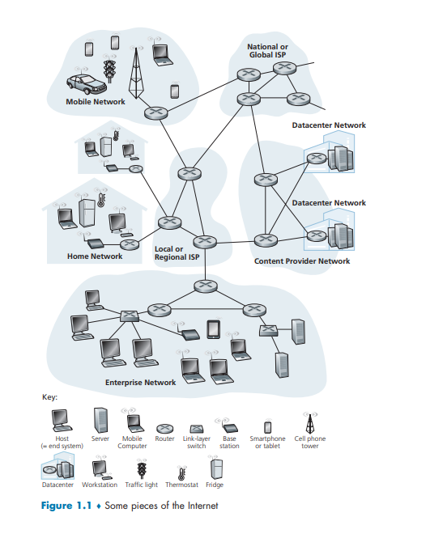​

## 具体构成描述

计算机网络是用通信设备和线路将分散在不同地点的有独立功能的多个计算机系统互相连接起来，并按照网络协议进行数据通信，实现资源共享的计算机集合

* 多个计算机：为用户提供服务
* 一个通信子网：通信设备和线路
* 一系列协议：保证数据通信

因特网是一个世界范围的计算机网络，即它是一个互联了遍及全世界数十亿计算设备的网络。所有这些设备都称为主机（host）或端系统（end system）

* 端系统通过**通信链路** **（communication link）** 和**分组交换机** **（packet switch）** 连接到一起

  * 通信链路由不同类型的物理媒体组成

    * 这些物理媒体包括同轴电缆、铜线、光纤和无线电频谱
    * 不同的链路能够以不同的速率传输数据，链路的**传输速率**（transmission rate）以比特/秒 （bit/s，或 bps）度量
    * 当一台端系统要向另一台端系统发送数据时，发送端系统将数据分段，并为每段加上首部字节。由此形成的信息包称为**分组**（packet）。这些分组通过网络发送到目的端系统，在那里被装配成初始数据。
  * 分组交换机从它的一条入通信链路接收到达的分组，并从它的一条出通信链路转发该分组

    * 在当今的因特网中，两种最著名的类型是**路由器** **（router）**  和**链路层交换机** **（link-layer switch）**

      * 链路层交换机通常用于接入网中
      * 路由器通常用于网络核心中
    * 从发送端系统到接收端系统，一个分组所经历的一系列通信链路和分组交换机称为通过该网络的**路径** **（route 或 path）**
* 端系统通过**因特网服务提供商**（Internet Service Provider，ISP）接入因特网

  * 每 个 ISP 自身就是一个由多台分组交换机和多段通信链路组成的网络。
  * 各 ISP 为端系统提供了各种不同类型的网络接入，包括如线缆调制解调器或 DSL 那样的住宅宽带接入、 高速局域网接入和移动无线接入。
  * 因特网将端系统彼此互联，为端系统提供接入的 ISP 也必须互联

    * 较低层的 ISP 通过国家的、国际的较高层 ISP 互联起来
    * 较高层 ISP 是由通过高速光纤链路互联的高速路由器组成的
    * 无论是较高层还是较低层 ISP 网络，它们每个都是独立管理的，运行着 IP 协议，遵从一定的命名和地址规则
* 端系统、分组交换机和其他因特网部件都要运行一系列**协议**  **（protocol）**

  * 这些协议控制因特网中信息的接收和发送。
  * TCP（Transmission Control Protocol，传输控制协议）和 IP（Internet Protocol，网际协议）是因特网中两个最为重要的协议

    * IP 协议定义了在路由器和端系统之间发送和接收的分组格式
    * 因特网的主要协议统称为 TCP/IP
* **因特网标准**（Internet  standard） 由因特网工程任务组 （Internet Engineering Task Force，IETF）研发。IETF 的标准文档称为**请求评论**（Request For Comment，RFC）

## 服务描述

从为应用程序提供服务的基础设施的角度来描述因特网

* 涉及多个相互交换数据的端系统的应用程序，被称为**分布式应用程序** （distributed application）
* 因特网应用程序运行在端系统上，并不运行在网络核心中的分组交换机中
* 运行在一个端系统上的应用程序怎样才能指令因特网向运行在另一个端系统上的软件发送数据呢?

  * 与因特网相连的端系统提供了一个**套接字接口**（socket interface），

    * 该接口规定了运行在一个端系统上的程序请求因特网基础设施向运行在另一个端系统上的特定目的地程序交付数据的方式。
    * 因特网套接字接口是一套发送程序必须遵循的规则集合，因此因特网能够将数据交付给目的地

## 什么是协议

​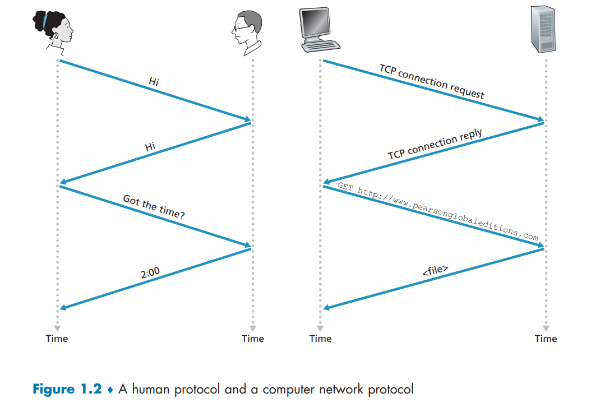​

在人类协议中，有我们发送的特定报文，也有我们根据接收到的应答报文或其他事件（例如在某个给定的 时间内没有回答）采取的动作。显然，发送和接收的报文，以及这些报文发送和接收或其 他事件出现时所采取的动作，这些在一个人类协议中起到了核心作用

### 网络协议

在因特网中，涉及两个或多个远程通信实体的所有活动都受协议的制约

**协议**（protocol）定义了在两个或多个通信实体之间交换的报文的格式和顺序，以及报文发送和/或接收一条报文或其他事件所采取的动作。协议规范了网络中所有信息发送和接收过程

三要素：

* 语法

  * 数据与控制信息的结构或格式
  * 信号电平
* 语义

  * 需要发出何种控制信息
  * 完成何种动作以及做出何种响应
  * 差错控制
* 时序

  * 事件顺序
  * 速度匹配

# 网络边缘

## 端系统

* 通常把与因特网相连的计算机和其他设备称为端系统，因为它们位于因特网的边缘，故而得名
* 端系统也称为主机（host），因为它们容纳（即运行）应用程序
* 应用模型

  * **客户**（client）/**服务器**（server）

    * 客户发送请求，接收服务器响应
  * 对等（peer-peer，P2P）

    * 通信在对等实体之间直接进行

## 接入网络

接入网是指将端系统物理连接到其**边缘路由器** **（edge router）** 的网络。边缘路由器是端系统到任何其他远程端系统的路径上的第一台路由器

### 家庭接入

#### DSL

​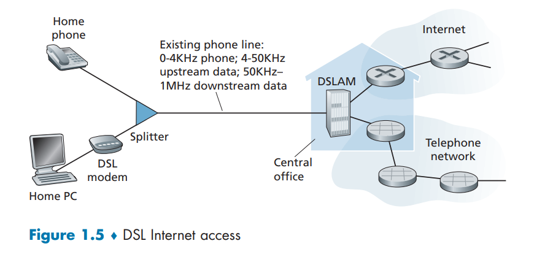​

宽带住宅接入有两种最流行的类型：**数字用户线** （Digital Subscriber Line， DSL）  和电缆

* 每个用户的 DSL 调制解调器使用现有的电话线（即双绞铜线）与位于电话公司的本地中心局 （CO）中的数字用户线接入复用器 （DSLAM） 交换数据。
* 家庭的 DSL 调制解调器得到数字数据后将其转换为高频音，以通过电话线传输给本地中心局
* 来自许多家庭的模拟信号在 DSLAM 处被转换回数字形式。
* 家庭电话线同时承载了数据和传统的电话信号，它们用不同的频率（FDM 频分多路复用）进行编码：

  * 高速下行信道，位于 50kHz 到 1MHz 频段
  * 中速上行信道，位于 4kHz 到 50kHz 频段
  * 普通的双向电话信道，位于 0 到 4kHz 频段

  这种方法使单根 DSL 线路看起来就像有 3 根单独的线路一样，因此一个电话呼叫和一个因特网连接能够同时共享 DSL 链路
* 在用户一侧，一个分配器把到达家庭的数据信号和电话信号分隔开，并将数据信号转发给 DSL 调制解调器
* 在电话公司一侧，在本地中心局中，DSLAM 把数据和电话信号分隔开，并将数据送往因特网
* DSL 标准定义了多个传输速率，包括 12Mbps 下行和 1 .8Mbps 上行传输速率，以及 55Mbps 下行和 15Mbps 上行传输速率

  * 因为这些上行速率和下行速率是不同的，所以这种接入被称为是*不对称的*

#### 电缆

​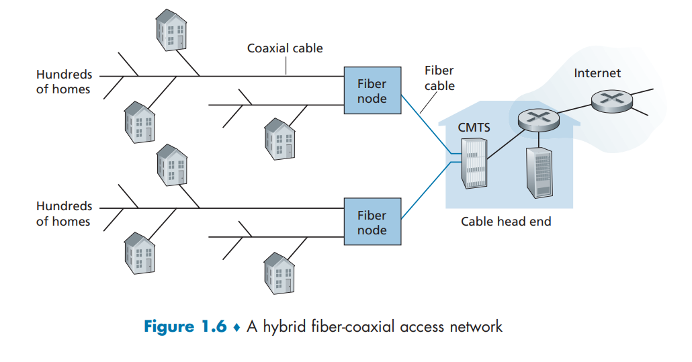​

* DSL 利用电话公司现有的本地电话基础设施，而**电缆因特网接入**（cable Internet access） 利用了有线电视公司现有的有线电视基础设施
* 光缆将电缆头端连接到地区枢纽，从这里使用传统的同轴电缆到达各家各户和公寓。每个地区枢纽通常支持 500～5000 个家庭。因为在这个系统中应用了光纤和同轴电缆，所以它经常被称为混合光纤同轴电缆（Hybrid Fiber Coax，HFC） 系统
* 电缆因特网接入需要特殊的调制解调器，这种调制解调器称为电缆调制解调器（cable  modem）

  * 如同 DSL 调制解调器，电缆调制解调器通常是一个外部设备，通过一个以太网端口连接到家庭 PC
  * 在电缆头端，电缆调制解调器端接系统（Cable Modem Termination System，CMTS）与 DSL 网络的 DSLAM 具有类似的功能，即将来自许多下行家庭中的电缆调制解调器发送的模拟信号转换回数字形式。
  * 电缆调制解调器将 HFC 网络划分为下行和上行两个信道。如同 DSL，  接入通常是不对称的，下行信道分配的传输速率通常比上行信道的高。

#### FTTH

​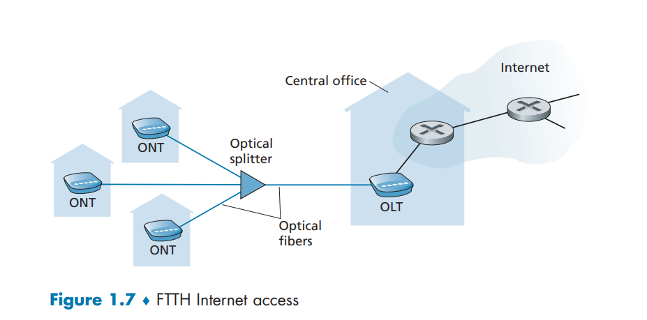​

尽管 DSL 和电缆网络当前代表了超过 85% 的美国住宅宽带接入，但一种提供更高速率的新兴技术是光纤到户 （Fiber To The Home，FTTH）

* 从本地中心局到家庭有几种有竞争性的光纤分布方案

  * 最简单的光纤分布网络称为直接光纤，从本地中心局到每户设置一根光纤
  * 更为一般的是，从中心局出来的每根光纤实际上由许多家庭共享，直到相对接近这些家庭的位置，该光纤才分成每户一根光纤。

    * 进行这种分配有两种有竞争性的光纤分布体系结构：

      * 主动光纤网络（Active Optical Network， AON）

        * AON 本质上就是交换因特网
      * 被动光纤网络（Passive Optical Network， PON）

### 企业接入

#### 以太网

​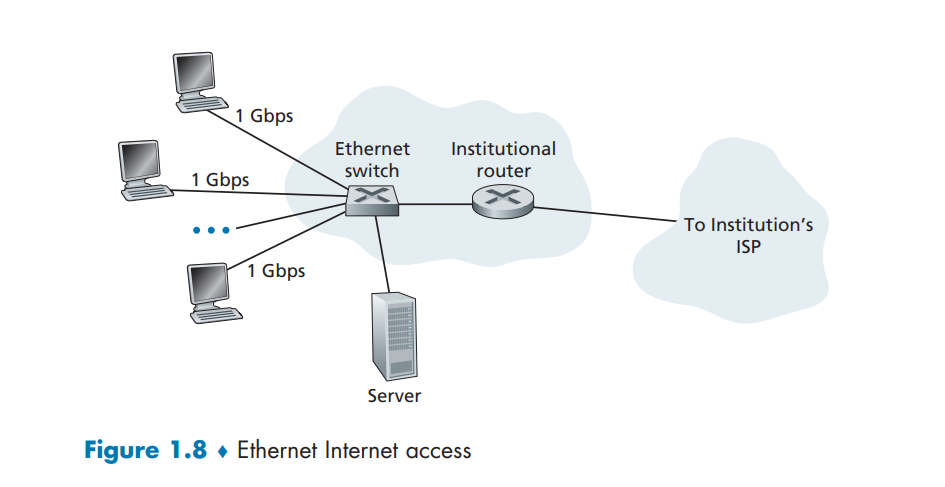​

​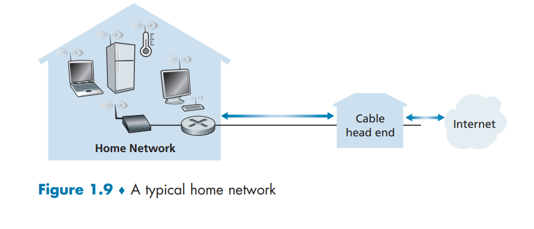​

* 主要用于公司、高校、企业等组织机构
* 典型传输速率：10 Mbps, 100Mbps, 1Gbps, 10Gbps
* 目前，端系统通常直接连接以太网交换机（switch）

### 广域无线接入

3G，4G，5G

## 物理媒体

一个比特当从源到目的地传输时，通过一系列“发射器-接收器”对。对于每个发射器-接收器对，通过跨越一种**物理媒体**（physical medium）传播电磁波或光脉冲来发送该比特。

* 该物理媒体可具有多种形状和形式，并且对沿途的每个发射器-接收器对而言不必具有相同的类型
* 物理媒体的例子包括双绞铜线、同轴电缆、多模光纤缆、陆地无线电频谱和卫星无线电频谱
* 物理媒体分成两种类型

  * **导引型媒体**（guided media）

    * 对于导引型媒体，电波沿着固体媒体前行，如光缆、双绞铜线或同轴电缆
  * **非导引型媒体**（unguided media）

    * 对于非导引型媒体，电波在空气或外层空间中传播，例如在无线局域网或数字卫星频道中

### 双绞铜线

* 双绞线由两根绝缘的铜线组成，每根大约 1mm 粗，以规则的螺旋状排列着
* 这两根线被绞合起来，以减少邻近类似的双绞线的电气干扰
* 通常许多双绞线捆扎在一起形成一根电缆，并在这些双绞线外面覆盖上保护性防护层
* 一对电线构成了一个通信链路
* **无屏蔽双绞线**（Unshielded Twisted Pair，UTP） 常用在建筑物内的计算机网络中，即用于局域网（LAN）中。
* 目前局域网中的双绞线的数据速率从 10Mbps 到 10Gbps。所能达到的数据传输速率取决于线的粗细以及传输方和接收方 间的距离

### 同轴电缆

* 与双绞线类似，同轴电缆由两个铜导体组成，但是这两个导体是同心的而不是并行的
* 借助于这种结构及特殊的绝缘体和保护层，同轴电缆能够达到较高的数据传输速率
* 同轴电缆在电缆电视系统中相当普遍
* 同轴电缆能被用作导引型**共享媒体**（shared medium）

  * 特别是，许多端系统能够直接与该电缆相连，每个端系统都能接收由其他端系统发送的  内容

### 光纤

* 光纤是一种细而柔软的、能够导引光脉冲的媒体，每个脉冲表示一个比特。
* 一根光纤能够支持极高的比特速率，高达数十甚至数百 Gbps。
* 它们不受电磁干扰，长达 100km 的光缆信号衰减极低，并且很难窃听。
* 这些特征使得光纤成为长途导引型传输媒体，特别是跨海链路

### 陆地无线电信道

* 无线电信道承载电磁频谱中的信号。它不需要安装物理线路，并具有穿透墙壁、提供与移动用户的连接以及长距离承载信号的能力
* 无线电信道的特性极大地依赖于传播环境和信号传输的距离。
* 环境上的考虑取决于路径损耗和遮挡衰落（即当信号跨距离传播和绕过/通过阻碍物体时信号强度降低）、多径衰落（由于干 扰对象的信号反射）以及干扰（由于其他传输或电磁信号）。

### 卫星无线电信道

* 一颗通信卫星连接地球上的两个或多个微波发射器/接收器，它们被称为地面站。
* 该卫星在一个频段上接收传输，使用一个转发器再生信号，并在另一个频率上发射信号。通信中常使用两类卫星： **同步卫星** （geostationary satellite）和近地轨道 （Low-Earth Orbiting，LEO）卫星

# 网络核心

网络核心，即由互联因特网端系统的**分组交换机**和**链路**构成的网状网络

核心功能：路由、转发

​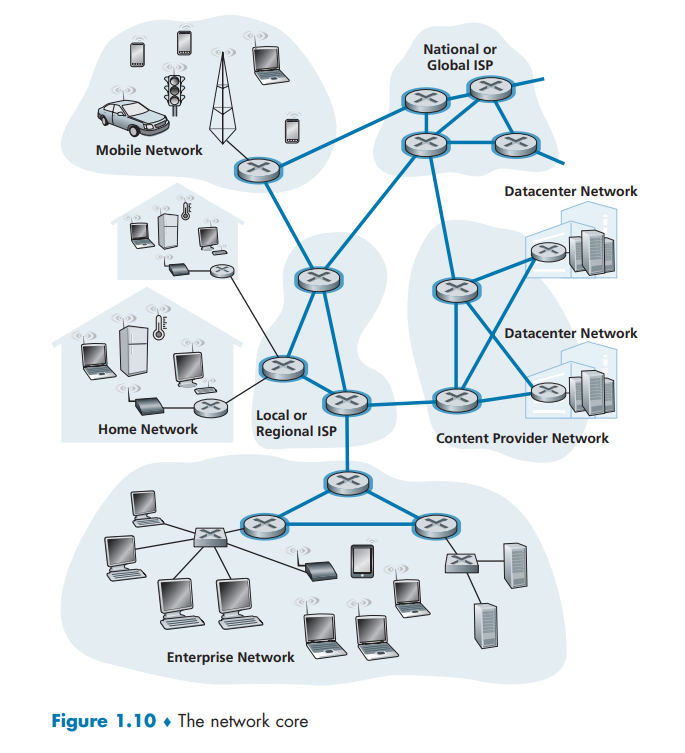​

通过网络链路和交换机移动数据有两种基本方法：**电路交换**（circuit switching）和**分组交换**（packet switching）

## 分组交换

在各种网络应用中，端系统彼此交换**报文**（message）——报文交换

* 报文能够包含协议设计者需要的任何东西。

  * 可以执行一种控制功能
  * 也可以包含数据
* 为了从源端系统向目的端系统发送一个报文，源将长报文划分为较小的数据块，称之为**分组**（packet）
* 在源和目的地之间，每个分组都通过通信链路和**分组交换机**（packet switch）传送

  * 交换机主要有两类 **：**​**路由器**（router）和**链路层交换机**（link-layer switch）
  * 分组以等于该链路最大传输速率的速度传输通过通信链路。

    * 设某源端系统或分组交换机经过一条链路发送一个 L 比特的分组，链路的传输速率为 R 比特/秒，则传输该分组的 时间为 $L/R$ 秒 。

### 存储转发传输

多数分组交换机在链路的输入端使用**存储转发传输**（store-and-forward transmission）机制

* 在交换机能够开始向输出链路传输该分组的第一个比特之前，必须接收到整个分组
* 一台路由器通常有多条繁忙的链路，它的任务就是把一个入分组交换到一条出链路

​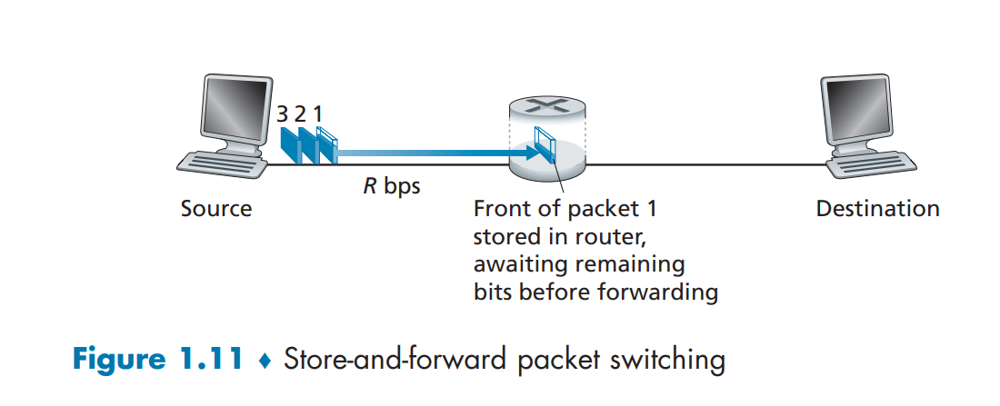​

* 如图，分组 1 的前沿已经到达了路由器。因为该路由器应用了存储转发机制，所以此时它还不能传输已经接收的比特，而是必须先缓存（即“存储”）该分组的比特。仅当路由器已经接收完了该分组的所有比特后，它才能开始向出链路传输（即“转发”）该分组
* 源在时刻 0 开始传输，在时刻 $L/R$ 秒，因为该路由器刚好接收到整个分组，所以它能够朝着目的地向出链路开始传输分组；在时刻 $2L/R$， 路由器已经传输了整个分组，并且整个分组已经被目的地接收。所以，总时延是 $2L/R$

1. 通过由 N 条速率均为 R 的链路组成的路径（在源和目的地之间有 $N-1$ 台路由器），从源到目的地发送一个分组

$$
d_{端到端} = N\frac{L}{R}
$$

2. 通过由 N 条速率均为 R 的链路组成的路径（在源和目的地之间有 $N-1$ 台路由器），从源到目的地发送 p 个分组

$$
d_{端到端} = (N + P - 1)\frac{L}{R}
$$

### 排队时延和分组丢失

* 每台分组交换机有多条链路与之相连
* 对于每条相连的链路，该分组交换机具有一个**输出缓存**（output buffer，也称为输出队列 （output queue）），它用于存储路由器准备发往那条链路的分组
* 如果到达的分组需要传输到某条链路，但发现该链路正忙于传输其他分组，该到达分组必须在输出缓存中等待

  * 因此，除了存储转发时延以外，分组还要承受输出缓存的**排队时延** **（queuing delay）**
  * 这些时延是变化的，变化的程度取决于网络的拥塞程度
* 因为缓存空间的大小是有限的， 一个到达的分组可能发现该缓存已被其他等待传输的分组完全充满了

  * 在此情况下，将出现分组丢失 **（**​**丢包** **，packet loss）** ，到达的分组或已经排队的分组之一将被丢弃

### 转发表和路由选择协议

* 路由器从与它相连的一条通信链路得到分组，然后向与它相连的另一 条通信链路转发该分组。但是路由器怎样决定它应当向哪条链路进行转发呢?

  * 不同的计算机网络实际上是以不同的方式完成分组转发的

​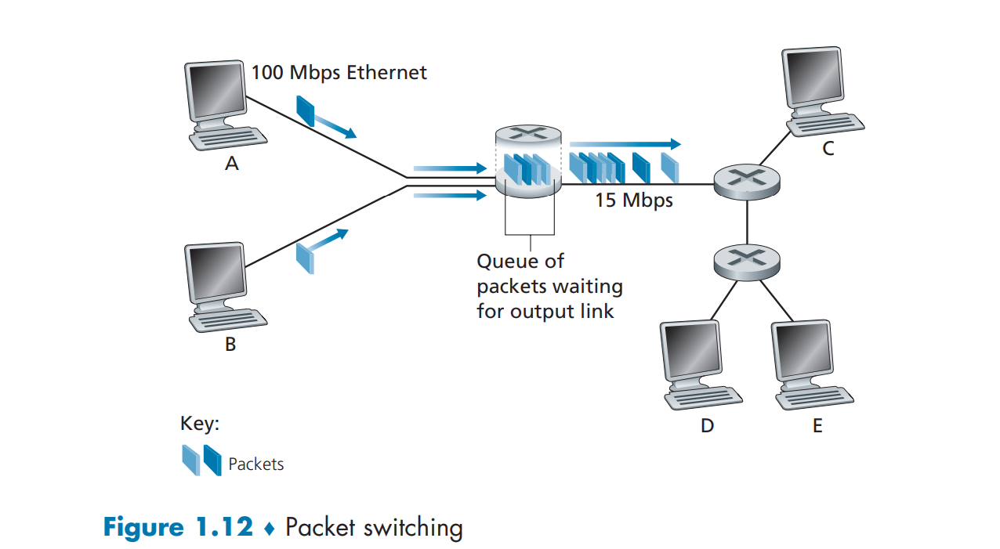​

* 在因特网中，每个端系统具有一个称为 IP 地址的地址。当源主机要向目的端系统发送一个分组时，源在该分组的首部包含了目的地的 IP 地址
* 当一个分组到达网络中的路由器时，路由器检查该分组的目的地址的一部分，并向一台相邻路由器转发该分组。
* 每台路由器具有一个**转发表**（forwarding table），用于将目的地址（或目的地址的一部分）映射成为输出链路

  * 当某分组到达一台路由器时，路由器检查该地址，并用这个目的地址搜索其转发表，以发现适当的出链路。路由器则将分组导向该出链路
  * 因特网具有一些特殊的**路由选择协议**（routing protocol），用于自动地设置这些转发表

    * 一个路由选择协议可以决定从每台路由器到每个目的地的最短路径，并使用这些最短路径结果来配置路由器中的转发表

## 电路交换

* 电路交换网络中，在端系统间通信会话期间，预留了端系统间沿路径通信所需要的资源（缓存，链路传输速率）

  * 在分组交换网络中，这些资源则不是预留的；会话的报文按需使用这些资源，其后果可能是不得不等待（即排队）接入通信线路
* 在发送方能够发送信息之前，该网络必须在发送方和接收方之间建立一条连接

  * 该连接被称为一条**电路**（circuit）
  * 当网络创建这种电路时，它也在连接期间在该网络链路上预留了恒定的传输速率（表示为每条链路传输容量的一部分）

    * 既然已经为该发送方-接收方连接预留了带宽， 则发送方能够以确保的**恒定速率**向接收方传送数据

​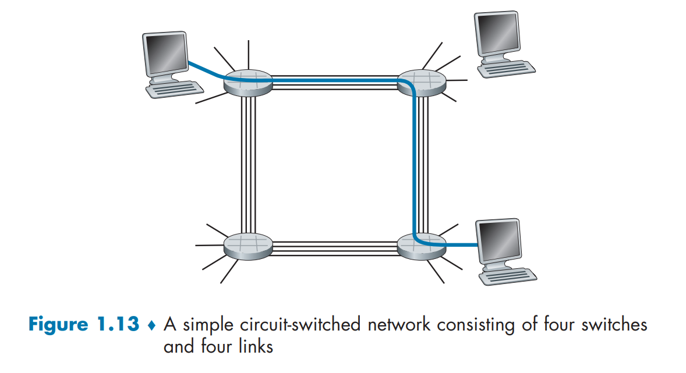​

* 如图，在这个网络中，用 4 条链路互联了 4 台电路交换机。这些链路中的每条都有 4 条电路，因此每条链路能够支持 4 条并行的连接。每台主机都与一台交换机直接相连
* 当两台主机要通信时，该网络在两台主机之间创建一条专用的**端到端连接**（end-to-end connection）

  * 网络必须在两条链路的每条上先预留一条电路
  * 在这个例子中，这条专用的端到端连接使用第一条链路中的第二条电路和第二条链路中的第四条电路
  * 因为每条链路具有 4 条电路，对于由端到端连接所使用的每条链路而言，该连接在连接期间获得链路总传输容量的 1/4

### 电路复用

链路中的电路是通过**频分复用**（Frequency-Division Multiplexing，FDM）或**时分复用** （Time-Division Multiplexing，TDM） 来实现的

​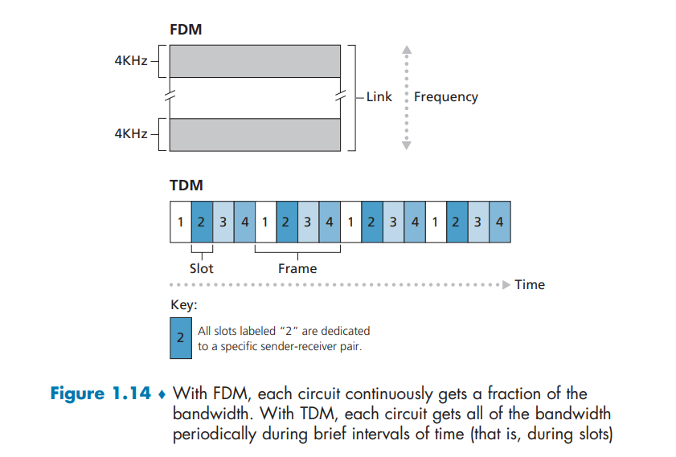​

#### FDM

频分多路复用

* 对于 FDM， 链路的频谱由跨越链路创建的所有连接共享
* 在连接期间链路为每条连接专用一个频段。在电话网络中，这个频段的宽度通常为 4kHz （即每秒 4000 周期）

  * 该频段的宽度称为**带宽**（band-width）

#### TDM

时分多路复用

* 对于一条 TDM 链路，时间被划分为固定期间的帧，并且每个帧又被划分为固定数量的时隙
* 当网络跨越一条链路创建一条连接时，网络在每个帧中为该连接指定一个时隙

  * 这些时隙专门由该连接单独使用，一个时隙（在每个帧内）可用于传输该连接的数据
* 一条电路的传输速率等于帧速率乘以一个时隙中的比特数量

  * 如果链路每秒传输 8000 个帧，每个时隙由 8 个比特组成，则每条电路的传输速率是 64kbps

#### CDM

码分多路复用

* 广泛应用于无线链路共享(如蜂窝网,卫星通信等)
* 每个用户分配一个来自正交(orthogonal)码组的mbit 码片序列(chipping sequence)
* 各用户使用相同频率载波，利用各自码片序列编码数据

### 分组交换与电路交换的对比

* 电路交换不考虑需求，而预先分配了传输链路的使用，这使得已分配而并不需要的链路时间未被利用
* 分组交换按需分配链路使用。链路传输能力将在所有需要在链路上传输分组的用户之间逐分组地被共享

## 网络的网络

### 网络结构 1

* 用单一的全球传输 ISP 互联所有接入 ISP
* 假想的全球传输 ISP 是一个由路由器和通信链路构成的网络，该网络不仅跨越全球，而且至少具有一台路由器靠近数十万接入 ISP 中的每一个
* 接入 ISP 被认为是客户（customer），  而全球传输 ISP 被认为是提供商（provider）

### 网络结构 2

* 它由数十万接入 ISP 和多个全球传输 ISP 组成
* 这些全球传输 ISP 之间必须是互联的

  * 不然的话，与某个全球传输 ISP 连接的接入 ISP 将不能与连接到其他全球传输 ISP 的接入 ISP 进行通信
* 网络结构 2 是一种两层的等级结构，其中全球传输提供商位于顶层，而接入 ISP 位于底层

### 网络结构 3

* 在任何给定的区域，可能有一个区域 ISP（regional ISP），区域中的接入 ISP 与之连接。
* 每个区域 ISP 则与**第一层** ISP（tier-1 ISP） 连接。

  * 第一层 ISP 类似于假想的全球传输 ISP，  尽管它不是在世界上每个城市中都存在，但它确实存在
* 不仅有多个竞争的第一层 ISP， 而且在一个区域可能有多个竞争的区域 ISP
* 在这样的等级结构中，每个接入 ISP 向其连接的区域 ISP 支付费用， 并且每个区域 ISP 向它连接的第一层 ISP 支付费用。（一个接入 ISP 也能直接与第一层 ISP 连接，这样它就向第一层 ISP 付费）

  * 因此，在这个等级结构的每一层，都有客户一提供商关系。注意，第一层 ISP 不向任何人付费，因为它们位于该等级结构的顶部
  * 在某些区域，可能有较大的区域 ISP（可能跨越整个国家），该区域中较小的区域 ISP 与之相连，较大的区域 ISP 则与第一层 ISP 连接

### 网络结构 4

在等级化网络结构 3 上增加存在点（Point of Presence，PoP）、多宿、对等和因特网交换点

* PoP 存在于等级结构的所有层次，但底层（接入 ISP） 等级除外

  * 一个 PoP 只是提供商网络中的一台或多台路由器 （在相同位置）群组，其中客户 ISP 能够与提供商 ISP 连接
  * 对于要与提供商 PoP 连接的客户网络，它能从第三方电信提供商租用高速链路将它的路由器之一直接连接到位于该 PoP 的一台路由器
* 任何 ISP（除了第一层 ISP）可以选择**多宿**（multi-home），

  * 可以与两个或更多提供商 ISP 连接。例如，一个接入 ISP 可能与两个区域 ISP 多宿，既可以与两个区域 ISP 多宿，也可以与一个第一层 ISP 多宿
  * 当一个 ISP 多宿时，即使它的提供商之 一出现故障，它仍然能够继续发送和接收分组。
* 位于相同等级结构层次的邻近一对 ISP 能够对等（peer）

  * 能够直接将它们的网络连到一起，使它们之间的所有流量经直接连接而不是通过上游的中间 ISP 传输
  * 当两个 ISP 对等时，通常不进行结算，即任一个 ISP 不向其对等付费。如第一层 ISP 也与另一个第一层 ISP 对等，它们之间无结算
* 第三方公司能够创建一个**因特网交换点** （Internet Exchange Point，IXP）

  * IXP 是一个汇合点，多个 ISP 能够在这里一起对等

### 网络结构 5

​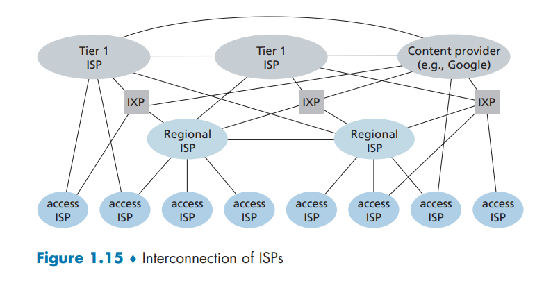​

通过在网络结构 4 顶部增加**内容提供商网络** （content provider network） 构建而成

* 专用网络通过与较低层 ISP 对等（无结算），尝试“绕过”因特网的较高层，采用的方式可以是直接与它们连接，或者在 IXP 处与它们连接
* 因为许多接入 ISP 仍然仅能通过第一层网络的传输到达，所以网络也与第一层 ISP 连接，并就与这些 ISP 交换的流量向它们付费

  * 通过创建自己的网络，内容提供商不仅减少了向顶层 ISP 支付的费用，而且对其服务最终如何交付给端用户有了更多的控制

# 分组交换网中的时延、丢包和吞吐量

## 时延概述

分组从一台主机（源）出发，通过一系列路由器传输，在另一台主机（目的地）中结束它的历程。当分组从一个节点（主机或路由器）沿着这条路径到后继节点（主机或路由器），该分组在沿途的每个节点经受了几种不同类型的时延。这些时延最为重要的是：

* **节点处理时延**（nodal processing delay）
* **排队时延**（queuing delay）
* **传输时延**（transmission delay）
* **传播时延**（propagation delay）

这些时延总体累加起来是**节点总时延**（total nodal delay）

### 处理时延

​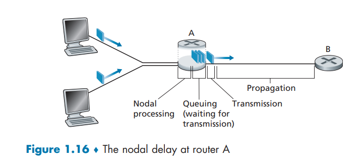​

当分组从上游节点到达路由器 A 时，路由器 A 检查该分组的首部以决定它的适当出链路，并将该分组导向该链路

* 检查分组首部和决定将该分组导向何处所需要的时间是**处理时延**的一部分
* 处理时延也能够包括其他因素

  * 如检查比特级别的差错所需要的时间，该差错出现在从上游节点向路由器 A 传输这些分组比特的过程中。
* 高速路由器的处理时延通常是微秒或更低的数量级
* 在这种节点处理之后，路由器将该分组引向通往路由器 B 链路之前的队列

### 排队时延

* 在队列中，当分组在链路上等待传输时，它经受**排队时延**
* 一个特定分组的排队时延长度将取决于先前到达的，正在排队等待向链路传输的分组数量

  * 如果该队列是空的，并且当前没有其他分组正在传输，则该分组的排队时延为 0
  * 如果流量很大，并且许多其他分组也在等待传输，该排队时延将很长
* 到达分组期待发现的分组数量是到达该队列的流量的强度和性质的函数
* 实际的排队时延可以是毫秒到微秒量级

### 传输时延

* 分组以先到先服务方式传输，仅当所有已经到达的分组被传输后，才能传输刚到达的分组
* 用 L 比特表示该分组的长度，用 R bps（即 b/s）表示从路由器 A 到路由器 B 的链路传输速率

  * 例如，对于一条 10Mbps 的以太网链路，速率 R=10Mbps;  对于 100Mbps 的以太网链路，速率 R=100 Mbps。
* **传输时延**是 $L/R$

  * 这是将所有分组的比特推向链路（即传输）所需要的时间
* 实际的传输时延通常在毫秒到微秒量级。

### 传播时延

* 一旦一个比特被推向链路，该比特需要向路由器 B 传播。从该链路的起点到路由器 B 传播所需要的时间是**传播时延**
* 该比特以该链路的传播速率传播。该传播速率取决于该链路的物理媒体（即光纤、双绞铜线等）
* 传播时延等于两台路由器之间的距离除以传播速率

  * 即传播时延是 $d/s$​

    * 其中 $d$ 是路由器 A 和路由器 B 之间的距离，$s$ 是该链路的传播速率。
* 一旦该分组的最后一个比特传播到节点 B， 该比特及前面的所有比特被存储于路由器 B
* 整个过程将随着路由器 B 执行转发而持续下去
* 在广域网中，传播时延为毫秒量级

### 比较传输时延和传播时延

* 传输时延是路由器推出分组所需要的时间，它是分组长度和链路传输速率的函数，而与两台路由器之间的距离无关
* 传播时延是一个比特从一台路由器传播到另一台路由器所需要的时间，它是两台路由器之间距离的函数，而与分组长度或链路传输速率无关

### 节点总时延

令 $d_{proc}$、$d_{queue}$、$d_{trans}$、$d_{prop}$  分别表示处理时延、排队时延、传输时延和传播时延，

则节点的总时延由下式给定：

$$
d_{nodat}=d_{proc}+d_{queue}+d_{trans}+d_{prop}
$$

## 排队时延和丢包

### 排队时延

* 排队时延对不同的分组可能是不同的

  * 例如，如果 10 个分组同时到达空队列，传输的第一个分组没有排队时延，而传输的最后一个分组将经受相对大的排队时延（这时它要等待其他 9 个分组被传输）
  * 因此，当表征排队时延时，人们通常使用统计量来度量，如平均排队时延、 排队时延的方差和排队时延超过某些特定值的概率
* 排队时延的大小取决于流量到达该队列的速率、链路的传输速率和到达流量的性质，即流量是**周期性到达**还是以**突发形式**到达

  * 令 $a$ 表示分组到达队列的平均速率 （$a$ 的单位是分组/秒，即 pkt/s）
  * $R$ 是传输速率，即从队列中推出比特的速率（以 bps 即 b/s 为单位）
  * 假定所有分组都是由 $L$ 比特组成的，则比特到达队列的平均速率是 $La$ bps
  * 假定该队列非常大，因此它基本能容纳无限数量的比特
  * 比率 $La/R$ 被称为**流量强度**（traffic intensity）

    * 如果 $La/R>1$，则比特到达队列的平均速率超过从该队列传输出去的速率。在这种情况下，该队列趋向于无限增加，并且排队时延将趋向无穷大

      * 因此，流量工程中设计系统时流量强度不能大于 1
    * 如果 $La/R≤1$。这时，到达流量的性质影响排队时延

      * 例如，如果分组周期性到达，即每 $L/R$ 秒到达一个分组，则每个分组将到达一个空队列中，不会有排队时延
      * 如果分组以突发形式到达，则可能会有很大的平均排队时延。例如，假定每 $(L/R)N$ 秒同时到达 $N$ 个分组。则传输的第一个分组没有排队时延； 传输的第二个分组就有 $L/R$ 秒的排队时延；更为一般地，第 $n$ 个传输的分组具有 $(n-1)L/R$ 秒的排队时延
  * 通常，到达队列的过程是随机的，即到达并不遵循任何模式，分组之间的时间间隔是随机的。在这种更为真实的情况下，量 $La/  R$ 通常不足以全面地表征时延的统计量

    * 如果流量强度接近于 0，则几乎没有分组到达并且到达间隔很大，那么到达的分组将不可能在队列中发现别的分组。因此，平均排队时延将接近 0
    * 当流量强度接近 1 时，当到达速率超过传输能力（由于分组到达速率的波动）时将存在时间间隔，在这些时段中将形成队列。当到达速率小于传输能力时， 队列的长度将缩短
    * 无论如何，随着流量强度接近 1， 平均排队长度变得越来越长

    ​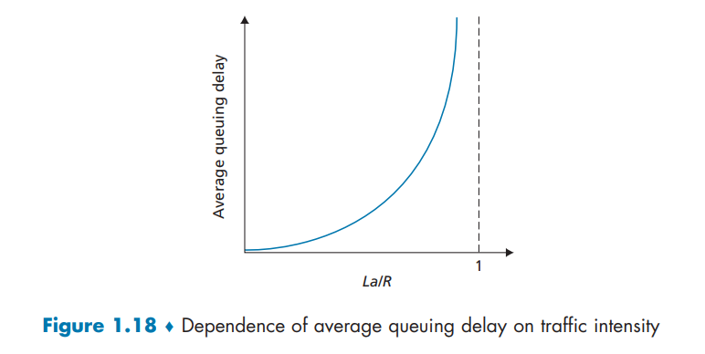​
  * 随着流量强度接近于 1，平均排队时延迅速增加。该强度的少量增加将导致时延大比例增加

### 丢包

* 在现实中，一条链路前的队列只有有限的容量
* 随着流量强度接近 1，排队时延并不真正趋向无穷大。相反，到达的分组将发现一个满的队列

  * 由于没有地方存储这个分组，路由器将丢弃（drop）该分组，即该分组将会丢失（lost），即**丢包**
* 丢失的分组可能基于端到端的原则重传，以确保所有的数据最终从源传送到了目的地

## 端到端时延

假定在源主机和目的主机之间有 $N-1$ 台路由器，该网络此时是无拥塞的（排队时延忽略不计），在每台路由器和源主机上的处理时延是 $d_{proc}$，每台路由器和源主机的输出速率是 $R$ bps，每条链路的传播时延是 $d_{prop}$

节点时延累加起来，得到端到端时延：

$$
d_{end-end}=N(d_{proc}+d_{trans}+d_{prop})
$$

同样，式中 $d_{trans}=L/R$， 其中 $L$ 是分组长度

## 吞吐量

### 端到端

考虑从主机 A 到主机 B 跨越计算机网络传送一个大文件

* 在任何时间瞬间的**瞬时吞吐量**（instantaneous throughput）是主机 B 接收到该文件的速率（以 bps 计）。
* 如果该文件由 $F$ 比特组成，主机 B 接收到所有 $F$ 比特用去 $T$ 秒，则文件传送的**平均吞吐量**（average throughput）是 $F/T$ bps

​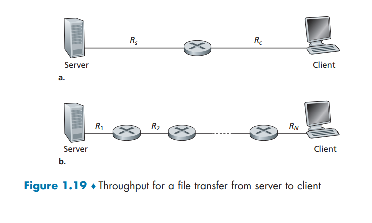​

图显示了服务器和客户这两个端系统，它们由两条通信链路和一台路由器相连。考虑从服务器传送一个文件到客户的吞吐量。令 $R_s$ 表示服务器与路由器之间的链路速率；$R_c$ 表示路由器与客户 之间的链路速率。假定在整个网络中只有从该服务器到客户的比特在传送

* 可以想象比特是流体，通信链路是管道。

  * 显然，这台服务器不能以快于 $R_s$ bps 的速率通过其链路注入比特
  * 这台路由器也不能以快于 $R_c$ bps 的速率转发比特
* 如果 $R_s<R_c $

  * 则在给定的吞吐量 $R$ bps 的情况下，由该服务器注入的比特将顺畅地通过路由器“流动”，并以速率 $R_s$ bps 到达客户
* 如果 $R_c < R_s$​

  * 则该路由器将不能像接收速率那样快地转发比特。在这种情况下，比特将以 $R_c$ 速率离开该路由器，从而得到端到端吞吐量 $R_c$
  * 还要注意的是，如果比特继续以速率 $R_s$ 到达路由器，继续以 $R_c$ 离开路由器的话，在该路由器中等待传输给客户的比特将不断积压
* 因此，对于这种简单的两链路网络，其吞吐量是 $min\{R_s,R_c\}$ 即**瓶颈链路**（bottleneck link）的传输速率

  * 在决定了吞吐量之后，现在近似地得到从服务器到客户传输一个 $F$ 比特的大文件所需要的时间是 $\frac{F}{min\{R_c,R_s\}}$
* 对于有 $N$ 条链路的网络，服务器到客户的文件传输吞吐量是 $min\{R_1,R_2,...,R_n\}$

### 因特网服务器到客户

​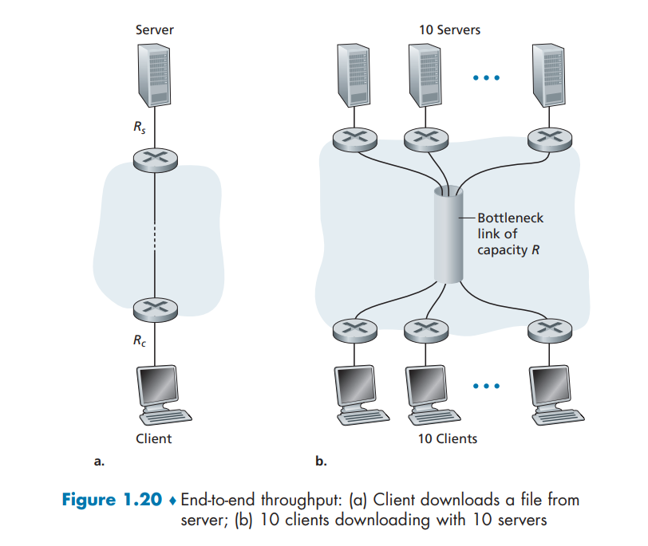​

> 一台服务器和一个客户，从服务器向客户传送一个文件的吞吐量

* 服务器以速率为 $R_s$ 的接入链路与网络相连，且客户以速率为 $R_c$ 的接入链路与网络相连
* 假定在通信网络核心中的所有链路具有非常高的传输速率，即该速率比 $R_s$ 和 $R_c$ 要高得多
* 假定在整个网络中发送的比特都是从该服务器到该客户
* 在这个例子中，因为计算机网络的核心就像一个粗大的管子，所以比特从源向目的地的流动速率仍是 $R_s$ 和 $R_c$ 中的最小者，即吞吐量 =$min\{R_s,R_c\}$

> 多台服务器和多个客户，同时传送文件

* 其中有 10 台服务器和 10 个客户与某计算机网络核心相连。在这个例子中，同时发生 10 个下载，涉及 10 个客户-服务器对。假定这 10 个下载是网络中当时的唯一流量
* 如图所示，在核心中有一条所有 10 个下载通过的链路。将这条链路 $R$ 的传输速率表示为 $R$
* 假定所有服务器接入链路具有相同的速率 $R_s$， 所有客户接入链路具有相同的速率 $R_c$，  并且核心中除了速率为 $R$ 的一条共同链路之外的所有链路，它们的传输速率都比 $R_s$、$R_c$ 和 $R$ 大得多
* 如果该公共链路的速率 $R$ 很大，则每个下载的吞吐量将仍然是 $min\{R_s,R_c\}$
* 如果该公共链路的速率与 $R_s$ 和 $R_c$ 有相同量级，这时每个下载的瓶颈可能不再位于接入网中，而是位于核心中的共享链路了，即 $min\{R_s,R_c,R/n\}$，其中 $n$ 为下载数量

# 协议层次以及服务模型

## 分层的体系结构

网络体系结构是从功能上描述计算机网络结构

* 计算机网络体系结构简称网络体系结构(Network Architecture)是分层结构
* 每层遵循某个/些网络协议完成本层功能
* 计算机网络体系结构是计算机网络的各层及其协议的集合
* 体系结构是一个计算机网络的功能层次及其关系的抽象定义

### 协议分层

* 为了给网络协议的设计提供一个结构，网络设计者以**分层**（layer）的方式组织协议以及实现这些协议的网络硬件和软件，每个协议属于这些层次之一
* 某层向上一层提供的**服务**（service），即**服务模型**（service model）
* 一个协议层能够用软件、硬件或两者的结合来实现
* 一个第 n 层协议也分布在构成该网络的端系统、分组交换机和其他组件中，即第 n 层协议的不同部分常常位于这些网络组件的各部分中
* 各层的所有协议被称为**协议栈**（protocol stack）

  * 因特网的协议栈由 5 个层次组成：物理层、链路层、网络层、传输层和应用层

​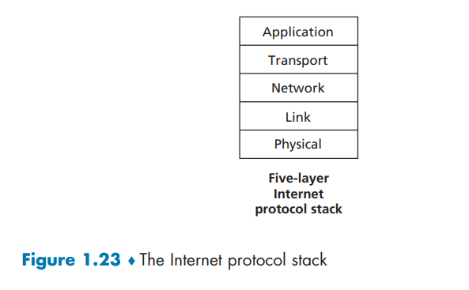​

* 实体(entity)表示任何可发送或接收信息的硬件或软件进程
* 协议是控制两个对等实体进行通信的规则的集合
* 任一层实体需要使用下层服务，遵循本层协议，实现本层功能，功能是水平的，同时向上层提供服务，服务是“垂直的”
* 下层协议的实现对上层的服务用户是透明的
* 同系统的相邻层实体间通过接口，即服务访问点 SAP(ServiceAccess Point)进行交互 ，交换原语，请求和提供的特定服务

#### 应用层

* 应用层是网络应用程序及它们的应用层协议存留的地方，支持用户通过用户代理（如浏览器）或网络接口使用网络服务
* 因特网的应用层包括许多协议，例如

  * HTTP：提供了 Web 文档的请求和传送
  * SMTP：提供了电子邮件报文的传输
  * FTP：提供两个端系统之间的文件传送
* 应用层协议分布在多个端系统上，而一个端系统中的应用程序使用协议与另一个端系统中的应用程序交换信息分组。把这种位于应用层的信息分组称为**报文 （message）**

#### 传输层

* 因特网的传输层在应用程序端点之间传送应用层报文
* 在因特网中，有两种运输协议，即 TCP 和 UDP， 利用其中的任一个都能运输应用层报文

  * TCP 向它的应用程序提供了**面向连接的服务**

    * 这种服务包括了应用层报文向目的地的确保传递和流量控制（即发送方/接收方速率匹配）
    * TCP 也将长报文划分为短报文，并提供拥塞控制机制，因此当网络拥塞时，源抑制其传输速率。
  * UDP 协议向它的应用程序提供**无连接服务**

    * 这是一种不提供不必要服务的服务，没有可靠性，没有流量控制，也没有拥塞控制。
* 传输层的分组称为**报文段**（segment）
* 功能

  * 分段与重组
  * SAP寻址

    * 确保将完整报文提交给正确进程，也称为端口
  * 连接控制
  * 流量控制
  * 差错控制

#### 网络层

* 网络层负责将称为**数据报**（datagram）的网络层分组从一台主机移动到另一台主机
* 在一台源主机中的传输层协议（TCP 或 UDP）向网络层递交传输层报文段和目的地址
* 因特网的网络层包括网际协议 IP

  * 该协议定义了在数据报中的各个字段以及端系统和路由器如何作用于这些字段
  * IP 仅有一个，所有具有网络层的因特网组件必须运行 IP
* 因特网的网络层也包括决定路由的路由选择协议

  * 它根据该路由将数据报从源传输到目的地
  * 因特网具有许多路由选择协议
* 功能

  * 路由
  * 转发

#### 链路层

* 因特网的网络层通过源和目的地之间的一系列路由器路由数据报。为了将分组从一个节点（主机或路由器）移动到路径上的下一个节点，网络层必须依靠该链路层的服务
* 在每个节点，网络层将数据报下传给链路层，链路层沿着路径将数据报传递给下一个节点。在该下一个节点，链路层将数据报上传给网络层
* 由链路层提供的服务取决于应用于该链路的特定链路层协议

  * 某些协议基于链路提供可靠传递，从传输节点跨越一条链路到接收节点

    * 这种可靠的传递服务不同于 TCP 的可靠传递服务，TCP 提供从一个端系统到另一个端系统的可靠交付
* 链路层的例子包括以太网、WiFi 和电缆接入网的 DOCSIS 协议

  * 因为数据报从源到目的地传送通常需要经过几条链路，一个数据报可能被沿途不同链路上的不同链路层协议处理

    * 例如，一个数据报可能被一段链路上的以太网和下一段链路上的 PPP 所处理
    * 网络层将受到来自每个不同的链路层协议的不同服务
* 链路层分组称为**帧** **（frame）**
* 功能

  * 负责结点-结点数据传输
  * 组帧（framing）
  * 物理寻址
  * 流量控制
  * 差错控制
  * 访问接入控制

#### 物理层

* 链路层的任务是将整个帧从一个网络元素移动到邻近的网络元素，物理层的任务是将该帧中的一个个比特从一个节点移动到下一个节点
* 在这层中的协议仍然是链路相关的，并且进一步与该链路（例如，双绞铜线、单模光纤）的实际传输媒体相关

  * 例如，以太网具有许多物理层协议：一个是关于双绞铜线的，另一个是关于同轴电缆的，还有是关于光纤的，等等。
  * 在每种场合中，跨越这些链路移动一个比特是以不同的方式进行的
* 传输模式

  * 单工：只支持信号在一个方向上传输（正向或反向），任何时候不能改变信号的传输方向
  * 半双工：允许信号在两个方向上传输，但某一时刻只允许信号在一个信道上单向传输
  * 全双工：允许数据同时在两个方向上传输，即有两个信道，因此允许同时进行双向传输

### TCP/IP参考模型

* 应用层、运输层、网际层、网络接口层

### OSI 模型

* 在 20 世纪 70 年代后期，国际标准化组织 （ISO）提出计算机网络围绕 7 层来组织，称为开放系统互连（OSI）模型
* OSI 参考模型的 7 层是：应用层、表示层、会话层、传输层、网络层、数据链路层和物理层

  * 这些层次中，5 层的功能大致与它们名字类似的因特网对应层的功能相同

#### 表示层

* 对话控制（dialog controlling）
* 同步

  * 在数据流中插入同步点

#### 会话层

* 处理两个系统间交换信息的语法和语义问题
* 数据表示转化

  * 转换为主机独立的编码
* 加密/解密
* 压缩/解压缩

## 封装

​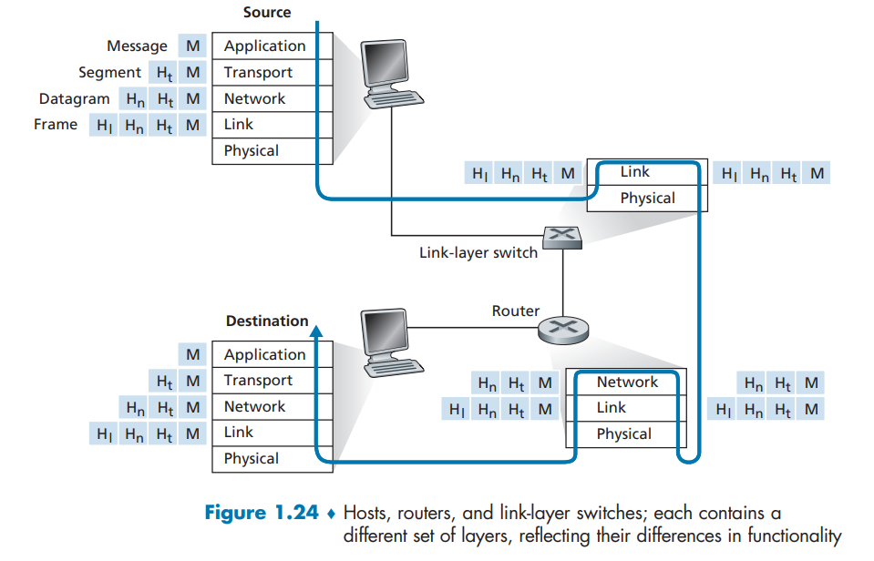​

如图：数据从发送端系统的协议栈向下，沿着中间的链路层交换机和路由器的协议栈上上下下，然后向上到达接收端系统的协议栈

* 与端系统类似，路由器和链路层交换机以多层次的方式组织它们的网络硬件和软件
* 但路由器和链路层交换机并不实现协议栈中的所有层次。

封装（encapsulation） ：

* 在发送主机端， 一个**应用层报文**（application-layer message）M 被传送给传输层
* 在最简单的情况下，传输层收取到报文并附上附加信息（所谓传输层首部信息 Ht），  该首部将被接收端的传输层使用。应用层报文和传输层首部信息一道构成了**传输层报文段** （transport-layer segment）

  * 传输层报文段因此封装了应用层报文
  * 附加的信息也许包括了下列信息：

    * 地址（Address）: 标识发送端/接收端
    * 允许接收端传输层向上向适当的应用程序交付报文的信息
    * 差错检测位信息，该信息让接收方能够判断报文中的比特是否在途中已被改变
    * 协议控制（Protocol control）：实现协议功能的附加信息，如: 优先级（priority）、服务质量（QoS）、和安全控制等
* 传输层向网络层传递该报文段，网络层增加了如源和目的端系统地址等网络层首部信息 Hn，生成了**网络层数据报**（network-layer datagram）
* 该数据报接下来被传递给链路层，链路层增加它自己的链路层首部信息并生成**链路层帧**（link-layer frame）

在每一层，一个分组具有两种类型的字段：**首部字段**和**有效载荷字段**（payload field）

有效载荷通常是来自上一层的分组

‍
