# 链路层和局域网

# 概述

在两台主机之间，数据报跨越一系列通信链路传输，一些是有线链路，而一些是无线链路

在链路层的讨论中，将看到两种截然不同类型的链路层信道。

* 第一种类型是**广播信道**

  * 这种信道用于连接有线局域网、卫星网和混合光纤同轴电缆（Hybrid Fiber Coaxial cable， HFC） 接入网中的多台主机。
  * 因为许多主机与相同的广播信道连接，需要所谓的媒体访问协议来协调帧传输。
  * 在某些场合中，可以使用**中心控制器**来协调传输。
* 第二种类型的链路层信道是**点对点通信链路**

  * 这在诸如长距离链路连接的两台路由器之间，或用户办公室计算机与它们所连接的邻近以太网交换机之间等场合经常能够发现。

## 术语

* Node: 将运行链路层协议（第 2 层）协议的任何设备均称为节点 （node）

  * 节点包括主机、路由器、交换机和 WiFi 接入点
* Link: 把沿着通信路径连接相邻节点的通信信道称为链路（link）

  * 为了将一个数据报从源主机传输到目的主机，数据报必须通过沿端到端路径上的各段链路传输

​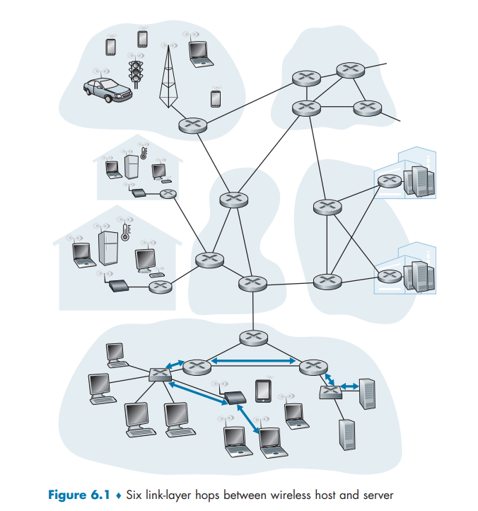​

显示在图 6-1 下部的公司网络中，考虑从无线主机之一向服务器之一发 送一个数据报。

该数据报将实际通过 6 段链路：

1. 发送主机与 WiFi 接入点之间的 WiFi 链路
2. 接入点和链路层交换机之间的以太网链路
3. 链路层交换机与路由器之间的链路
4. 两台路由器之间的链路
5. 路由器与链路层交换机之间的链路
6. 交换机和服务器之间的以太网链路

在通过特定的链路时，传输节点将数据报封装在**链路层帧**中，并将该帧传送到链路中

## 链路层提供的服务

任一链路层的基本服务都是将数据报通过单一通信链路从一个节点移动到相邻节点，但所提供的服务细节能够随着链路层协议的不同而变化。链路层协议能够提供的可能服务包括：

* **成帧（framing）** 

  * 在每个网络层数据报经链路传送之前，几乎所有的链路层协议都要将其用链路层帧封装起来
  * 一个帧由一个数据字段和若干首部字段组成，其中网络层数据报就插在数据字段中
  * 帧的结构由链路层协议规定
* **链路接入**

  * **媒体访问控制（Medium Access Control，MAC）** 协议规定了帧在链路上传输的规则
  * 对于在链路的一端仅有一个发送方、链路的另一端仅有一个接收方的点对点链路，MAC 协议比较简单（或者不存在），即无论何时链路空闲，发送方都能够发送帧
  * 当多个节点共享单个广播链路时，即所谓多路访问问题，MAC 协议用于协调多个节点的帧传输
* **可靠交付**

  * 当链路层协议提供可靠交付服务时，它保证无差错地经链路层移动每个网络层数据报
  * 某些传输层协议（例如 TCP）  也提供可靠交付服务。与传输层可靠交付服务类似，链路层的可靠交付服务通常是通过**确认**和**重传**取得的
  * 链路层可靠交付服务通常用于**易于产生高差错率的链路**，例如**无线链路**，其目的是本地（也就是在差错发生的链路上）纠正一个差错，而不是通过传输层或应用层协议迫使进行端到端的数据重传
  * 然而，对于低比特差错的链路，包括光纤、同轴电缆和许多双绞铜线链路，链路层可靠交付可能会被认为是一种不必要的开销。由于这个原因，许多**有线的链路层**协议不提供可靠交付服务
* **差错检测和纠正**

  * 当帧中的一个比特作为 1 传输时，接收方节点中的链路层硬件可能不正确地将其判断为 0，反之亦然。这种比特差错是由信号衰减和电磁噪声导致的。因为没有必要转发一个有差错的数据报，所以许多链路层协议提供一种机制来检测这样的比特差错
  * 通过让发送节点在帧中**包括**​**差错检测比特**，让接收节点进行差错检查，以此来完成这项工作
  * 因特网的传输层和网络层也提供了有限形式的差错检测，即**因特网检验和**
  * 链路层的差错检测通常更复杂，并且用硬件实现。差错纠正类似于差错检测，区别在于接收方不仅能检测帧中出现的比特差错，而且能够准确地确定帧中的差错出现的位置（并因此纠正这些差错）

## 链路层实现

* 链路层的主体部分是在**网络适配器**（network adapter）中实现的，网络适配器有时也称为**网络接口卡**（Network Interface Card，NIC）
* 位于网络适配器核心的是**链路层控制器**，该控制器通常是一个实现了许多链路层服务（成 帧、链路接入、差错检测等）的专用芯片

因此，链路层控制器的许多功能是用硬件实现的。

* 在发送端：控制器取得了由协议栈较高层生成并存储在主机内存中的数据报，在链路层帧中封装该数据报（填写该帧的各个字段），然后遵循链路接入协议将该帧传进通信链路中。
* 在接收端：控制器接收了整个帧，抽取出网络层数据报。如果链路层执行差错检测，则需要发送控制器在该帧的首部设置差错检测比特，由**接收控制器**执行差错检测

​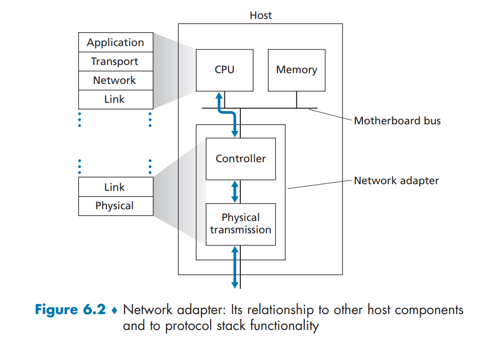​

尽管大部分链路层是在硬件中实现的，但部分链路层是在运行于主机 CPU 上的软件中实现的

* 链路层的软件组件实现了高层链路层功能，如组装链路层寻址信息和激活控制器硬件。
* 在接收端，链路层软件响应控制器中断（例如，由于一个或多个帧的到达），处理差错条件和将数据报向上传递给网络层。

所以，链路层是硬件和软件的结合体，即此处是协议栈中软件与硬件交接的地方。

# 差错检测和纠正技术

**比特级差错检测和纠正** （bit-level error detection and correction）：对从一个节点发送到另一个物理上连接的邻近节点的链路层帧中的比特损伤进行检测和纠正

* 在发送节点，为了保护比特免受差错，使用差错检测和纠正比特 （Error-Detection and-Correction，EDC） 来增强数据 D

  * 通常，要保护的数据不仅包括从网络层传递下来需要通过链路传输的数据报，而且包括链路帧首部中的链路级的寻址信息、序号和其他字段
* 链路级帧中的 D 和 EDC 都被发送到接收节点。
* 在接收节点，接收到比特序列 D '和 EDC'。

  * 因传输中的比特翻转，D '和 EDC '可能与 初始的 D 和 EDC 不同
  * 接收方的挑战是在它只收到 D'和 EDC'的情况下，确定 D'是否和初始的 D 相同

  ​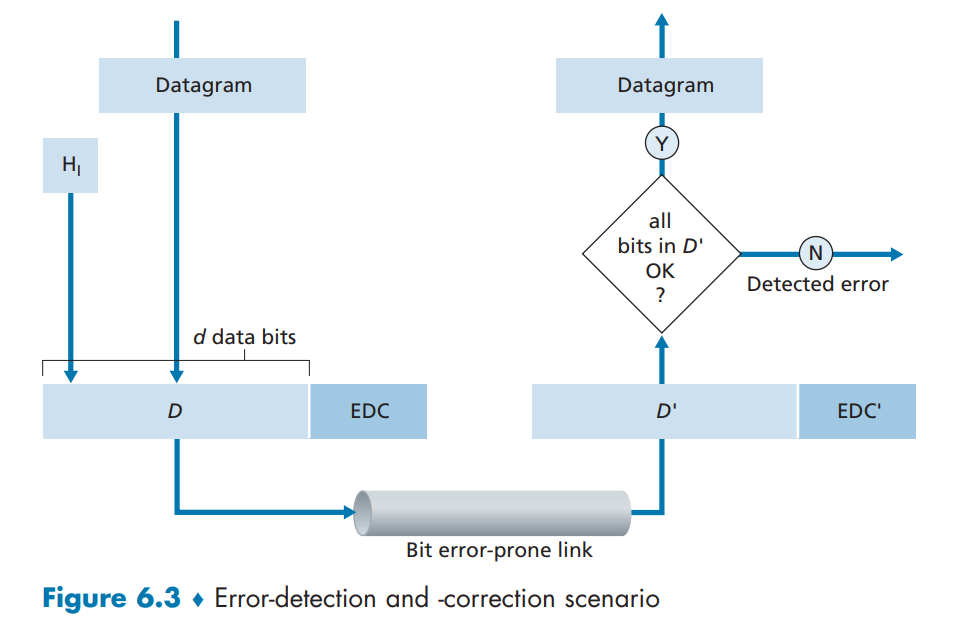​
* 差错检测和纠正技术可能有**未检出比特差错** （undetected bit error），接收方可能无法知道接收的信息中包含着比特差错

  * 因此要选择一个差错检测方案，使得这种事件发生的概率很小。 一般而言，差错检测和纠错技术越复杂 （即那些具有未检测出比特差错概率较小的技术），导致的开销就越大，这就是意味着需要更多的计算量及更多的差错检测和纠错比特。

三种差错检测技术：

* 奇偶校验：用来描述差错检测和纠正背后隐含的基本思想
* 检验和方法：通常更多地应用于传输层
* 循环冗余检测：通常更多地应用在适配器中的链路层

## 奇偶校验

差错检测最简单的方式就是用单个**奇偶校验位**  **（parity bit）**

​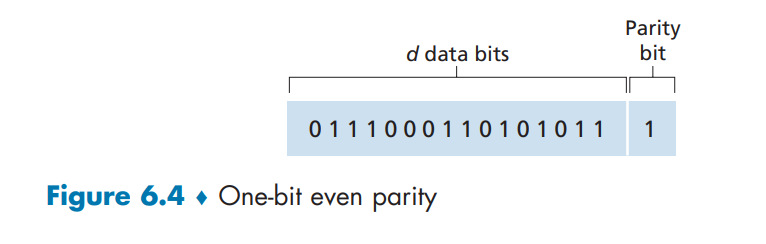​

> 假设在图 6-4 中要发送的信息 D 有 d 比特。

* 在偶校验方案中，发送方只需**包含一个附加的比特**，选择它的值，使得这 d+1 比特（初始信息加上一个校验比特）中 1 的总数是**偶数**。
* 对于奇校验方案，选择校验比特值使得有**奇数个** 1

> 采用单个奇偶校验位方式

* 接收方只需要数接收的 d+1 比特中 1 的数目即可。
* 如果在采用偶校验方案中发现了奇数个值为 1 的比特，接收方知道至少出现了一个比特差错。更精确的说法是，出现了奇数个比特差错。
* 但是如果出现了偶数个比特差错，这将导致一个**未检出的差错**。如果比特差错的概率小，而且比特之间的差错可以被看作是独立发生的， 在一个分组中多个比特同时出错的概率将是极小的。在这种情况下，单个奇偶校验位是足够的了。
* 然而，测量已经表明了差错经常以“突发”方式聚集在一起，而不是独立地 发生。在突发差错的情况下，使用单比特奇偶校验保护的一帧中未检测出差错的概率能够达到 50%

### 二维奇偶校验

​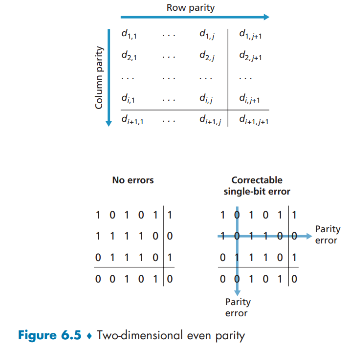​

这里 D 中的 d 个比特被划分为 i 行 j 列。对每行和每列计算奇偶值。产生的 i+j+1 奇偶比特构成了链路层帧的差错检测比特。

* 假设在初始 d 比特信息中出现了单个比特差错。使用这种**二维奇偶校验**  （two-dimensional parity） 方案，包含比特值改变的列和行的校验值都将会出现差错。
* 因此接收方不仅可以检测到出现了单个比特差错的事实，而且还可以利用存在奇偶校验差错的列和行的索引来实际识别发生差错的比特并纠正它

接收方检测和纠正差错的能力被称为**前向纠错**（Forward Error Correction，FEC）。这些技术通常用于如音频 CD 这样的音频存储和回放设备中。在网络环境中，FEC 技术可以单独应用，或与链路层 ARQ（自动重传）技术一起应用

## 校验和方法

在检验和技术中，图 6-4 中的 d 比特数据被作为一个 k 比特整数的序列处理。

* 一个简单检验和方法就是将这 k 比特整数加起来，并且用得到的和作为差错检测比特。

  * **因特网检验和**（Internet checksum）就基于这种方法，即数据的字节作为 16 比特的整数对待并求和。这个和的反码形成了携带在报文段首部的因特网检验和。
* 接收方通过对接收的数据（包括检验和）的和取反码，并且检测其结果是否为**全 1 比特**来检测检验和。如果这些比特中有任何比特是 0，就可以指示出差错

## 循环冗余检测

现今的计算机网络中广泛应用的差错检测技术基于**循环冗余检测**（ Cyclic Redundancy Check，CRC）编码。CRC 编码也称为**多项式编码** （polynomial code），因为该编码能够将要发送的比特串看作为系数是 0 和 1 一个多项式，对比特串的操作被解释为多项式算术

CRC 编码操作如下

* 考虑 d 比特的数据 D，   发送节点要将它发送给接收节点
* 发送方和接收方首先必须协商一个 r+1 比特模式，称为**生成多项式**（generator），表示为 G

  * 要求 G 的最高有效位的比特（最左边）是 1
* 对于一个给定的数据段 D，发送方要选择 r 个附加比特 R，并将它们附加到 D 上，使得得到的 d+r 比特模式（被解释为一个二进制数）用模 2 算术恰好能被 G 整除
* 用 CRC 进行差错检测：接收方用 G 去除接收到的 d+r 比特。

  * 如果**余数为非零**，接收方知道出现了差错；否则认为数据正确而被接收
  * 所有 CRC 计算采用模 2 算术来做，在加法中不进位，在减法中不借位。加法和减法是相同的，而且这两种操作等价于操作数的按位异或（XOR）

    模二乘除法与普通乘除法一样演算，唯一的区别是，模二乘法在部分积相加时按模二加，模二除法部分余数相减时按模二减。

    ​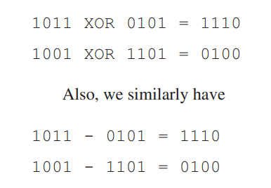​

### CRC 算法

实际应用时，发送方和接收方按以下方式通信：

1. 发送方和接收方在通信前，约定好一个预设整数作为除数。
2. 发送方在发送前根据原始数据和约定好的除数进行模二除法运算生成余数（即 CRC 码），然后将其附加到原始数据后面一起发送给接收方。
3. 接收方收到后将其模二除以约定好的除数，当且仅当余数为 0 时接收方认为没有差错。

给定 D 和 R， D*2r `XOR`​ R 产生如图 6-6 所示的 d+r 比特模式

​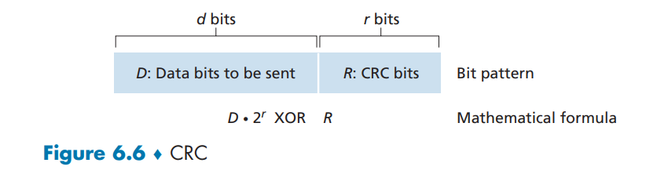​

假设要传输的原始数据为 1101011011B，发送方和接收方在通信前约定好的除数为 10011B。

* 由于除数 10011B 是五位数（5bit），那么假设余数（即 CRC 码）为四位数（4bit）。
* 因为现在余数未知，所以在进行模二除法运算前先将余数设为 0000B，即待发送的数据为 1101011011 0000B。下面开始进行模二除法运算来确定余数（即 CRC 码）：

  ​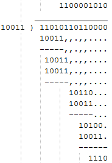​

  * 可见余数（即 CRC 码）为 1110B，因此发送方实际发送的是 11010110111110B。
* 接收方在接收后需要将其模二除以 10011B 来进行 CRC 校验：

  ​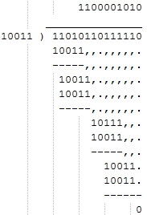​

  可见余数为 0，因此本次通信没有差错

国际标准已经定义了 8、12、16 和 32 比特生成多项式 G 。CRC-3232 比特的标准被多种链路级 IEEE 协议采用， 使用的一个生成多项式是：

$$
GCRC_-32 =100000100110000010001110110110111
$$

每个 CRC 标准都能检测

* 小于 r+1 比特的突发差错
* 在适当的假设下，长度大于 r+1 比特的突发差错以概率 1-0.5'被检测到
* 任何奇数个比特差错

# 多路访问链路和协议

* **点对点链路** **（point-to-point link）**  由链路一端的单个发送方和链路另一端的单个接收方组成

  * 许多链路层协议都是为点对点链路设计的，如**点对点协议**  **（point-to-point protocol，**​**PPP** **）**  和**高级数据链路控制 （high-level data link control，**​**HDLC** **）**
* **广播链路** **（broadcast link）** ，它能够让多个发送和接收节点都连接到**相同的、单一的、共享的**广播信道上

  * 当任何一个节点传输一个帧时，信道广播该帧，每个其他节点都收到一个副本

**多路访问问题（multiple access problem）** ：如何协调多个发送和接收节点对一个共享广播信道的访问

**多路访问协议 （multiple access protocol）** ：节点通过这些协议来规范它们在共享的广播信道上的传输行为

* 因为所有的节点都能够传输帧，所以多个节点可能会同时传输帧。当发生这种情况 时，所有节点同时接到多个帧，传输的帧在所有的接收方处**碰撞** （collide）了。通常，当碰撞发生时，没有一个接收节点能够有效地获得任何传输的帧，碰撞帧的信号纠缠在一起。
* 因此，涉及此次碰撞的所有帧都丢失了，在碰撞时间间隔中的广播信道被浪费了。显然，如果许多节点要频繁地传输帧，许多传输将导致碰撞，广播信道的大量带宽将被浪费掉。
* 当多个节点处于活跃状态时，为了确保广播信道执行有用的工作，以某种方式协调活跃节点的传输是必要的。这种协调工作由多路访问协议负责。

能够将任何多路访问协议划分为 3 种类型

1. **信道划分协议** **（channel partitioning protocol）**
2. **随机接入协议** **（random access protocol）**
3. **轮流协议** **（taking-turns protocol）**

在理想情况下，对于速率为 R bps 的广播信道，多路访问协议应该具有以下所希望的特性：

1. 当仅有一个节点发送数据时，该节点具有 R bps 的吞吐量
2. 当有 M 个节点发送数据时，每个节点吞吐量为 R/M bps。

   1. 这不必要求 M 个节点中的每一个节点总是有 R/M 的瞬间速率，而是每个节点在一些*适当定义的时间间隔*内应该有 R/M 的**平均传输速率**。
3. 协议是分散的，不会因为某主节点故障而使整个系统崩溃。
4. 协议是简单的，使实现不昂贵。

## 信道划分协议

### TDM 时分多路复用

假设一个支持 N 个节点的信道且信道的传输速率为 R bps​​

* TDM 将时间划分为**时间帧** （time frame）， 并进一步划分每个时间帧为 N 个**时隙** （slot）
* 然后把每个时隙分配给 N 个节点中的一个。无论何时某个节点在有分组要发送的时候，它在循环的 TDM 帧中指派给它的时隙内传输分组比特。

  * 通常，选择的时隙长度应使一个时隙内能够传输单个分组
* 每个节点在每个帧时间内得 到了专用的传输速率 R/N bps
* 然而有两个主要缺陷：

  * 节点被限制于 R/N bps 的平均速率，即使它是唯一有分组要发送的节点
  * 节点必须总是等待它在传输序列中的轮次，即使它是唯一一个有帧要发送的节点

​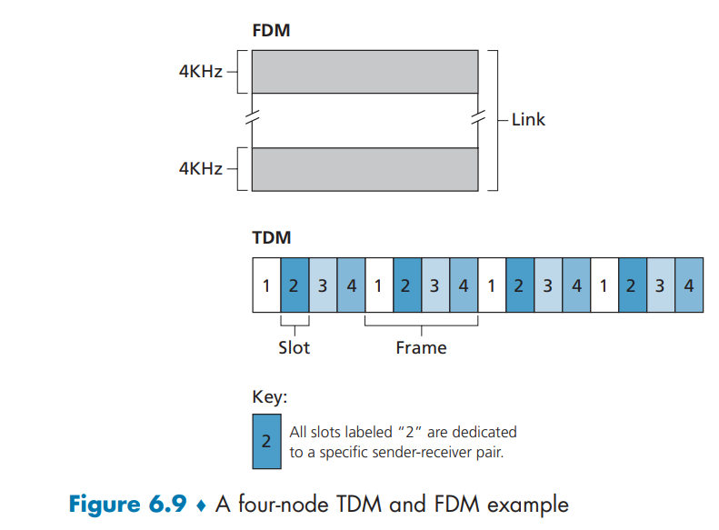​

### FDM 频分多路复用

* FDM 将 R bps 信道划分为不同的频段（每个频段具有 R/N 带宽），并把每个频率分配给 N 个节点中的一个。
* 因此 FDM 在单个较大的 R bps 信道中创建了 N 个较小的 R/N bps 信道
* FDM 也有 TDM 同样的优点和缺点。它避免了碰撞，在 N 个节点之间公平地划分了带宽。然而，FDM 也有 TDM 所具有的主要缺点，也就是限制一个节点只能使用 R/N 的带宽，即使当它是唯一一个有分组要发送的节点时。

### CDMA 码分多址

* TDM 和 FDM 分别为节点分配时隙和频率，而 CDMA 对每个节点分配一种**不同的编码**。
* 每个节点用它唯一的编码来对它发送的数据进行编码。

  * 如果精心选择这些编码，CDMA 网络具有一种奇妙的特性，即不同的节点能够**同时传输**，并且它们各自相应的接收方仍能**正确接收**发送方编码的数据比特（假设接收方知道发送方的编码），而不在乎其他节点的干扰传输

## 随机接入协议

在随机接入协议中：

* 一个传输节点总是以信道的**全部速率**（即 R bps） 进行发送。
* 当有碰撞时，涉及碰撞的每个节点**反复地重发**它的帧，到该帧无碰撞地通过为止。
* 但是当一个节点经历一次碰撞时，它不会立刻重发该帧。相反，它在重发该帧之前等待一个**随机时延**。

  * 涉及碰撞的每个节点**独立**地选择随机时延。
  * 因为该随机时延是独立地选择的，所以会出现下述现象：这些节点之一所选择的时延充分小于其他碰撞节点的时延，并因此能够无碰撞地将它的帧在信道中发出。

### 时隙 ALOHA 协议

> 假设

* 所有帧由 L 比特组成。
* 时间被划分成长度为 L/R 秒的时隙（这就是说，一个时隙等于传输一帧的时间）。
* 节点只在时隙起点开始传输帧。
* 节点是同步的，每个节点都知道时隙何时开始。
* 如果在一个时隙中有两个或者更多个帧碰撞，则所有节点在该时隙结束之前检测到该碰撞事件。

> 令 p 是一个概率，即一个在 0 和 1 之间的数。在每个节点中，时隙 ALOHA 的操作是简单的：

* 当节点有一个新帧要发送时，它等到**下一个时隙开始**并在该时隙传输整个帧。
* 如果没有碰撞，该节点成功地传输它的帧，从而不需要考虑重传该帧。

  * 如果该节点有新帧，它能够为传输准备一个新帧。
* 如果有碰撞，该节点**在时隙结束之前**检测到这次碰撞。该节点以**概率 p** 在后续的每个时隙中重传它的帧，直到该帧被无碰撞地传输出去。

> 优点

* 与信道划分不同，当某节点是唯一活跃的节点时 （一个节点如果有帧要发送就认为它是活跃的），时隙 ALOHA 允许该节点以全速 R 连续传输。
* 时隙 ALOHA 也是高度分散的，因为每个节点检测碰撞并独立地决定什么时候重传。
* 时隙 ALOHA 也是一 个极为简单的协议。

> 存在多个活跃节点时

* 一部分时隙将有碰撞，因此将被“浪费”掉了。而时隙的另一部分将是空闲的，因为所有活跃节点由于概率传输策略会节制传输
* 唯一“未浪费的”时隙是那些刚好有一个节点传输的时隙

  * 刚好有一个节点传输的时隙称为一个**成功时隙** （successful slot）
* 时隙多路访问协议的**效率** （efficiency）定义为：当有大量的活跃节点且每个节点总有大量的帧要发送时，长期运行中成功时隙的份额

  * 如果不使用某种形式的访问控制，而且每个节点都在每次碰撞之后立即重传，这个效率将为零。
  * 时隙 ALOHA 增加了它的效率，使之大于零

#### 效率计算

​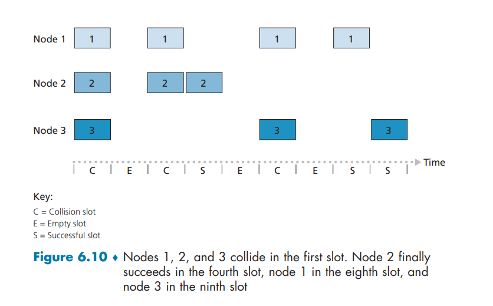​

* 假设每个节点试图在每个时隙以概率 $p$ 传输一帧（即假设每个节点总有帧要发送，而且节点对新帧和已经经历一次碰撞的帧都以概率 $p$ 传输）
* 假设有 $N$ 个节点
* 则一个给定时隙是成功时隙的概率为只有一个节点传输，而余下的 $N-1$ 个节点不传输的概率

  * 一个给定节点传输的概率是 $p$
  * 剩余节点不传输的概率是 $(1-  p)^{N-1}$
  * 因此，一个给定节点成功传送的概率是 $p(1-p)^{N-1}$
  * 因为有 $N$ 个节点，任意一个节点成功传送的概率是 $Np(1-p)^{N-1}$
* 因此，当有 N 个活跃节点时，时隙 ALOHA 的效率是 $Np(1-p)^{N-1}$

  * 当 N 趋于无穷时，这个协议的最大效率为 $1/e=0.37$。当有大量节点有很多帧要传输时，最多有 37% 的时隙做有用的工作

​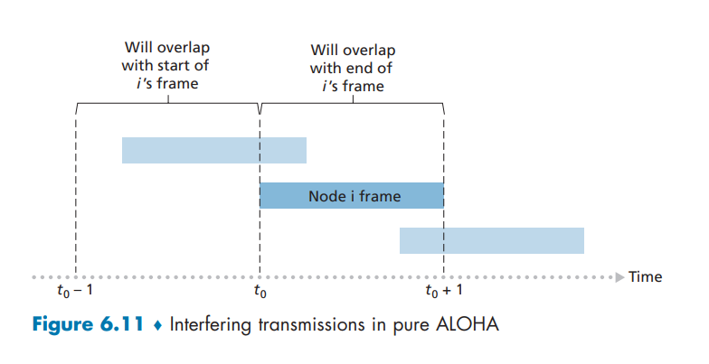​

### 纯 ALOHA 协议

* 时隙 ALOHA 协议要求所有的节点同步它们的传输，以在每个时隙开始时开始传输
* 在纯 ALOHA 中

  * 当一帧首次到达（即一个网络层数据报在发送节点从网络层传递下来），节点立刻将该帧完整地传输进广播信道
  * 如果一个传输的帧与一个或多个传输经历了碰撞，这个节点将立即（在完全传输完它的碰撞帧之后）以概率 p 重传该帧
  * 否则，该节点等待一个帧传输时间。在此等待之后，它以概率 p 传输该帧，或者以概率 1-p 在另一个帧时间等待（保持空闲）
* 假设该帧在时刻 $t_0$ 开始传输。

  * 如图，为了使该帧能成功地传输，在时间间隔 $[t_0-1,t_0]$ 中不能有其他节点开始传输
  * 这种传输将与节点 $i$ 的帧传输起始部分相重叠
  * 所有其他节点在这个时间间隔不开始传输的概率是 $(1-p)^{N-1}$
  * 类似地，当节点 $i$ 在传输时，其他节点不能开始传输，因为这种传输将与节点 $i$ 传输的后面部分相重叠。所有其他节点在这个时间间隔不开始传输的概率也是 $(1-p)^{N-1}$
  * 因此，一个给定的节点成功传输一次的概率是 $p(1-p)^{2(N-1)}$
  * 通过与时隙 ALOHA 情况一样来取极限，我们求得纯 ALOHA 协议的最大效率仅为 $1/(2e)$，刚好是时隙 ALOHA 的一半​​

### 载波侦听多路访问 CSMA

在时隙和纯 ALOHA 中，一个节点传输的决定独立于连接到这个广播信道上的其他节点的活动。特别是， 一个节点不关心在它开始传输时是否有其他节点碰巧在传输，而且即使有另一个节点开始干扰它的传输也不会停止传输

**载波侦听多路访问**（Carrier Sense Multiple Access，CSMA）和具有**碰撞检测**的 CSMA（CSMA with Collision Detection，CSMA/CD）协议族

* **载波侦听**（carrier sensing）：一个节点在传输前先听信道。如果来自另一个节点的帧正向信道上发送，节点则等待直到检测到一小段时间没有传输，然后开始传输
* **碰撞检测**（collision detection）：当一个传输节点在传输时一直在侦听此信道。如果它检测到另一个节点正在传输**干扰帧**，它就停止传输，在重复“侦听-当空闲时传输”循环之前等待一段随机时间

​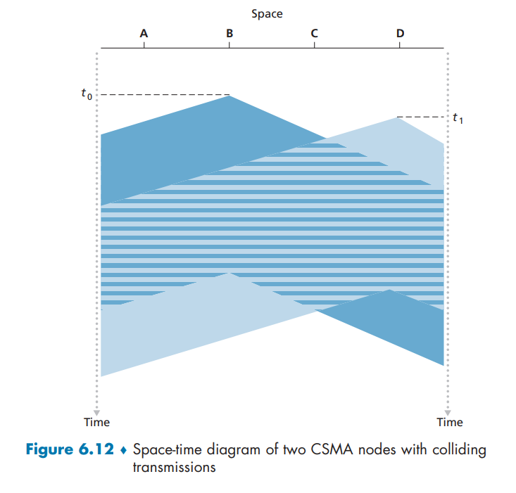​

图显示了连接到一个线状广播总线的 4 个节点（A 、B 、C 、D）的时空图。

* 横轴表示每个节点在空间的位置；纵轴表示时间。
* 在时刻 $t_0$ 节点 B 侦听到信道是空闲的，因为当前没有其他节点在传输。因此节点 B 开始传输，沿着广播媒体在两个方向上传播它的比特
* 图中 B 的比特随着时间的增加向下传播，这表明 B 的比特沿着广播媒体传播所实际需要的时间不是零（虽然以接近光的速度）
* 在时刻 $t_1(t_1>t_0)$，节点 D 有一个帧要发送。尽管节点 B 在时刻 $t_1$ 正在传输，但 B 传输的比特还没有到达 D，  因此 D 在 $t_1$ 侦听到信道空闲。根据 CSMA 协议，从而 D 开始传输它的帧
* 一个短暂的时间之后，B 的传输开始在 D **干扰** D 的传输。从图中可以看出，显然广播信道的端到端**信道传播时延** （channel propagation delay） （信号从一个节点传播到另一个节点所花费的时间）在决定其性能方面起着关键的作用。

  * 该传播时延越长，载波侦听节点能够侦听到网络中另一个节点已经开始传输的机会就越小

### 具有碰撞检测的载波侦听多路访问 CSMA/CD

* 在图 6-12 中，节点没有进行碰撞检测：即使已经出现了碰撞，B 和 D 都将继续完整地传输它们的帧。
* 当某节点执行碰撞检测时，一旦它检测到碰撞将立即停止传输。图 6-13 表示了和图 6-12 相同的情况，只是这两个节点在检测到碰撞后很短的时间内都**放弃**了它们的传输
* 在多路访问协议中加入碰撞检测，通过不传输一个无用的、（由来自另一个节点的帧干扰）损坏的帧，将有助于改善协议的性能

​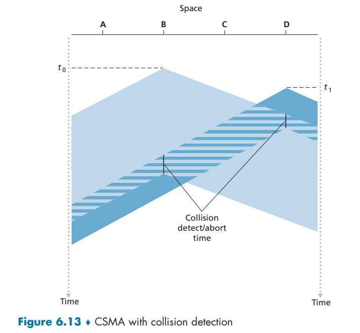​

从与广播信道相连的适配器（在节点中）的角度总结 CSMA/CD 协议的运行：

1. 适配器从网络层获得一条数据报，准备链路层帧，并将其放入帧适配器缓存中
2. 如果适配器侦听到信道空闲（即无信号能量从信道进入适配器），它开始传输帧。如果适配器侦听到信道正在忙，它将等待，直到侦听到没有信号能量时才开始传输帧
3. 在传输过程中，适配器监视来自其他使用该广播信道的适配器的信号能量的存在
4. 如果适配器传输整个帧而未检测到来自其他适配器的信号能量，该适配器就完成了该帧。如果适配器在传输时检测到来自其他适配器的信号能量，它**中止传输**（即停止了传输帧）
5. 中止传输后，适配器等待一个随机时间量，然后返回步骤 2

   1. 等待一个随机（而不是固定）的时间量的需求是明确的，如果两个节点同时传输帧，然后这两个节点等待相同固定的时间量，它们将持续碰撞下去
   2. 如果时间间隔大而碰撞节点数量小，在重复“侦听-当空闲时传输”的步骤前，节点很可能等待较长的时间（使信道保持空闲）。如果时间间隔小而碰撞节点数量大，很可能选择的随机值将几乎相同，传输节点将再次碰撞。希望的时间间隔应该这样：当碰撞节点数量较少时，时间间隔较短；当碰撞节点数量较大时，时间间隔较长
   3. 以太网以及 DOCSIS 电缆网络多路访问协议中的**二进制指数后退**（binary exponential backoff）算法

      1. 当传输一个给定帧时，在该帧经历了一连串的 $n$ 次碰撞后，节点随机地从 $\{0,1,2,… ,2^n - 1\}$ 中选择 一 个 $K$ 值，$n$  能够取的最大值在 10 以内
      2. 因此，一个帧经历的碰撞越多，$K$ 选择的间隔越大
      3. 对于以太网，一个节点等待的实际时间量是 $K ·512$ 比特时间（即发送 512 比特进入以太网所需时间量的 $K$ 倍 ）

例如：假设一个适配器首次尝试传输一个帧，并在传输中它检测到碰撞

* 该节点以概率 0.5 选择 $K=0$，以概率 0.5 选择 $K=1$

  * 如果该节点选择 $K=0$，  则它立即开始侦听信道
  * 如果这个适配器选择 $K=1$，  它在开始“侦听-当空闲时传输”周期前等待 512 比特时间（例如对于 100Mbps 以太网来说为 5.12μs）
* 在第 2 次碰撞之后，从 $\{0,1,2,3\}$ 中等概率地选择 $K$
* 在第 3 次碰撞之后，从 $\{0,1,2,3,4,5,6,7\}$  中等概率地选择 $K$
* 在 10 次或更多次碰撞之后，从 $\{0,1,2, … ,1023\}$ 中等概率地选择 $K$
* 因此从中选择 $K$ 的集合长度随着碰撞次数呈指数增长；正是由于这个原因，该算法被称为二进制指数后退

每次适配器准备传输一个新的帧时，它要运行 CSMA/CD 算法。不考虑近期过去的时间内可能已经发生的任何碰撞。因此，当几个其他适配器处于指数后退状态时，有可能一个具有新帧的节点能够立刻插入一次成功的传输

#### CSMA/CD 效率

当只有一个节点有一个帧发送时，该节点能够以信道全速率进行传输。然而，如果很多节点都有帧要发送，信道的有效传输速率可能会小得多

将 CSMA/CD 效率（efficiency of CSMA/CD）定义为：当有大量的活跃节点，且每个节点有大量的帧要发送时，帧在信道中**无碰撞地传输的那部分时间**在长期运行时间中所占的份额

令 $d_{prop}$ 表示信号能量在任意两个适配器之间传播所需的最大时间。令 $d_{trans}$ 表示传输一个最大长度的以太网帧的时间。可得效率的近似值

$$
效率=\frac{1}{1+5d_{prop}/d_{trans}}
$$

* 当 $d_{prop}$ 接近 0 时，效率接近 1：如果传播时延是 0，碰撞的节点将立即中止而不会浪费信道
* 当 $d_{trans}$ 变得很大时，效率也接近于 1：因为当一个帧取得了信道时，它将占有信道很长时间；因此 信道在大多数时间都会有效地工作

## 轮流协议

多路访问协议的两个理想特性是：

1. 当只有一个节点活跃时，该活跃节点具有 $R$ bps 的吞吐量
2. 当有 $M$ 个节点活跃时，每个活跃节点的吞吐量接近 $R/M$ bps

   ALOHA 和 CSMA 协议具备第一个特性，但不具备第二个特性。因此设计了轮流协议

轮流协议 （taking-turns protocol）

* **轮询协议**（polling protocol）
* **令牌传递协议**（token-passing protocol）

### 轮询协议

* 轮询协议要求这些节点之一要被指定为主节点

  * 主节点以循环的方式轮询 （poll）每个节点，主节点能够通过观察在信道上是否缺乏信号，来决定一个节点何时完成了帧的发送
  * 主节点首先向节点 1 发送一个报文，告诉它（节点 1）能够传输的帧的最多数量
  * 在节点 1 传输了某些帧后，主节点告诉节点 2 它（节点 2）能够传输的帧的最多数量
  * 上述过程以这种方式继续进行，主节点以循环的方式轮询了每个节点。
* 轮询协议消除了困扰随机接入协议的碰撞和空时隙，这使得轮询取得高得多的效率
* 但是它也有一些缺点

  * 第一个缺点是该协议引入了**轮询时延**，即通知一个节点“它可以传输”所需的时间

    * 例如，如果只有一个节点是活跃的，那么这个节点将以小于 $R$ bps 的速率传输，因为每次活跃节点发送了它最多数量的帧时，主节点必须依次轮询每一个非活跃的节点
  * 第二个缺点可能更为严重，就是如果主节点有故障，整个信道都变得不可操作

### 令牌传递协议

* 在这种协议中没有主节点。一个称为令牌 （token）的小的特殊帧在节点之间以某种固定的次序进行交换

  * 例如，节点 1 可能总是把令牌发送给节点 2，节点 2 可能总是把令牌发送给节点 3，而节点 N 可能  总是把令牌发送给节点 1
  * 当一个节点收到令牌时，仅当它有一些帧要发送时，它才**持有**这个令牌；否则，它立即向下一个节点转发该令牌
  * 当一个节点收到令牌时，如果它确实有帧要传输，它发送最大数目的帧数，然后把令牌转发给下一个节点
  * 令牌传递是分散的，并有很高的效率
* 但是它也有自己的一些问题

  * 一个节点的故障可能会使整个信道崩溃
  * 或者如果一个节点偶然忘记了释放令牌，则必须调用某些恢复步骤使令牌返回到循环中来

# 交换局域网

​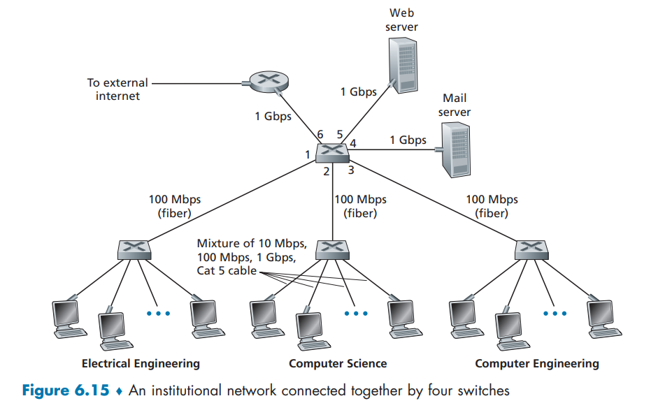​

图 6-15 显示了一个交换局域网连接了 3 个部门，两台服务器和一台与 4 台交换机连接的路由器。

* 这些交换机运行在链路层
* 它们交换链路层帧（而不是网络层数据报）
* 不识别网络层地址
* 不使用如 RIP 或 OSPF 这样的路由选择算法来确定通过第二层交换机网络的路径

## 链路层寻址和 ARP

### MAC 地址

* 并不是主机或路由器具有链路层地址，而是它们的**适配器**（即网络接口，网卡）具有链路层地址

  * 具有多个网络接口的主机或路由器将具有与之相关联的多个链路层地址，就像它也具有与之相关联的多个 IP 地址一样
* 链路层交换机并不具有与它们的接口（这些接口是与主机和路由器相连的）相关联的链路层地址

  * 因为链路层交换机的任务是在主机与路由器之间承载数据报
  * 交换机透明地执行该项任务，即主机或路由器不必明确地将帧寻址到其间的交换机
* 链路层地址有各种不同的称呼：**LAN 地址**（LAN address）、**物理地址**（physical address）或 **MAC 地址**（MAC address）
* 对于大多数局域网（包括以太网和 802.11 无线局域网） 而言，MAC 地址长度为 6 字节，共有 248 个可能的 MAC 地址

  * 这些 6 个字节地址通常用十六进制表示法，地址的每个字节被表示为一对十六进制数
* MAC 地址被设计为永久的

  * 但用软件改变一块适配器的 MAC 地址现在是可能的
* MAC 地址的一个有趣性质是没有两块适配器具有相同的地址

  * IEEE 在管理着该 MAC 地址空间。当一个公司要生产适配器时，它支付象征性的费用购买组成 224 个地址的一块地址空间
  * IEEE 分配这块 24 个地址的方式是： 固定一个 MAC 地址的前 24 比特，让公司自己为每个适配器生成后 24 比特的唯一组合
* 适配器的 MAC 地址具有扁平结构（这与层次结构相反），而且不论适配器到哪里用都不会变化。带有以太网接口的便携机总具有同样的 MAC 地址，无论该计算机位于何方

  * 与之形成对照的是，IP 地址具有层次结构（即一个网络部分和一个主机部分），当主机移动时，主机的 IP 地址需要改变，即改变它所连接到的网络
* 当某适配器要向某些目的适配器发送一个帧时，发送适配器将目的适配器的 MAC 地址插入到该帧中，并将该帧发送到局域网上
* 交换机可以将一个入帧广播到它的所有接口

  * 因此一块适配器可以接收一个并非向它寻址的帧
  * 当适配器接收到一个帧时，将检查该帧中的**目的 MAC 地址**是否与它自己的 MAC 地址匹配

    * 如果匹配，该适配器提取出封装的数据报，并将该数据报沿协议栈向上传递
    * 如果不匹配，该适配器丢弃该帧，而不会向上传递该网络层数据报
    * 所以，仅当收到该帧时，才会中断目的地
* 有时某发送适配器的确要让局域网上所有其他适配器来接收并处理它打算发送的帧

  * 在这种情况下，发送适配器在该帧的目的地址字段中插入一个特殊的 **MAC 广播地址**（broadcast address）
  * 对于使用 6 字节地址的局域网（例如以太网和 802.11）来说，广播地址是 48 个连续的 1 组成的字符串（即以十六进制表示法表示的 FF-FF-FF-FF-FF-FF）

​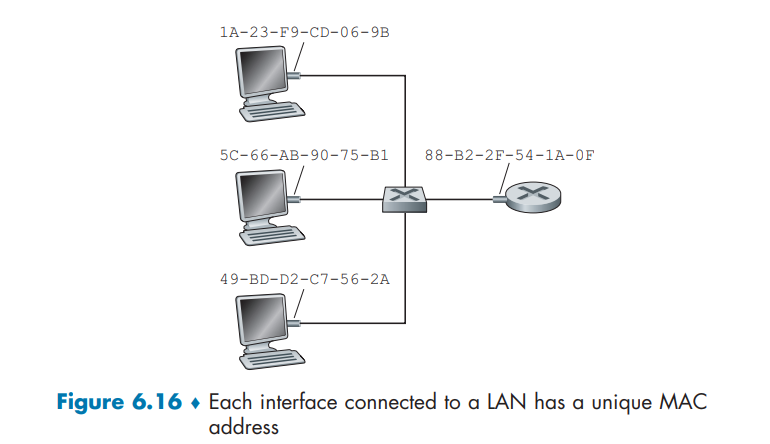​

### 地址解析协议 ARP

因为存在网络层地址（例如，因特网的 IP 地址）和链路层地址（即 MAC 地址），所以需要在它们之间进行转换。这是**地址解析协议**（Address Resolution Protocol，ARP）的任务

​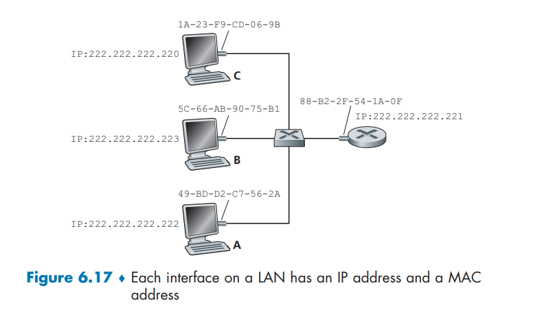​

考虑如图所示的网络。在这个例子中，每台主机和路由器有一个单一的 IP 地址和单一的 MAC 地址。假设交换机广播所有帧：无论何时交换机在一个接口接收一个帧，它将在其所有其他接口上转发该帧。假设 IP 地址为 222.222.222.220 的主机要向主机 222.222.222.222 发送 IP 数据

* 在本例中，源和目的均位于相同的子网中

  * 为了发送数据报，该源必须要向它的适配器不仅提供 IP 数据报，而且要提供目的主机 222.222.222.222 的 MAC 地址
  * 然后发送适配器将构造一个包含目的地的 MAC 地址的链路层帧，并把该帧发送进局域网
  * 发送主机使用 ARP 确定目的主机的 MAC 地址
* 在发送主机中的 ARP 模块将取在相同局域网上的任何 IP 地址作为输入，然后返回相应的 MAC 地址

  * ARP 将一个 IP 地址解析为一个 MAC 地址
  * 在很多方面它和 DNS 类似，DNS 将主机名解析为 IP 地址
  * 这两种解析器之间的一个重要区别是，DNS 为在因特网中任何地方的主机解析主机名，而 ARP 只为在**同一个子网**上的主机和路由器接口解析 IP 地址
* 每台主机或路由器在其内存中具有一个 ARP 表 （ARP table），这张表包含 IP 地址到 MAC 地址的映射关系

  ​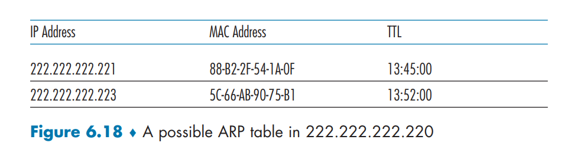​

  * 该 ARP 表也包含一个寿命 （TTL）值，它指示了从表中删除每个映射的时间
  * 这张表不必为该子网上的每台主机和路由器都包含一个表项
  * 某些可能从来没有进入到该表中，某些可能已经过期
  * 从一个表项放置到某 ARP 表中开始，一个表项通常的过期时间是 20 分钟
* 现在假设主机 222.222.222.220 要发送一个数据报，该数据报要 IP 寻址到子网上另一台主机或路由器。发送主机需要获得给定 IP 地址的目的主机的 MAC 地址

  * 如果发送方的 ARP 表具有该目的节点的表项，这个任务是很容易完成的
  * 如果 ARP 表中当前没有该目的主机的表项。假设 222.222.222.220 要向 222.222.222.222 发送数据报。在这种情况下，发送方用 **ARP 协议**来解析这个地址

    * 首先，发送方构造一个称为 **ARP 分组**（ARP packet）的特殊分组
    * 一个 ARP 分组有几个字段，包括发送和接收 IP 地址及 MAC 地址
    * ARP 查询分组和响应分组都具有相同的格式
  * 222.222.222.220 向它的适配器传递一个 **ARP 查询分组**，并且指示适配器应该用 MAC 广播地址（即 FF-FF-FF-FF-FF-FF）来发送这个分组

    * ARP 查询分组的目的是询问子网上所有其他主机和路由器，以确定对应于要解析的 IP 地址的那个 MAC 地址
    * 适配器在链路层帧中封装这个 ARP 分组，用广播地址作为帧的目的地址，并将该帧传输进子网中
    * 包含该 ARP 查询的帧能被子网上的所有其他适配器接收到，并且（由于广播地址）每个适配器都把在该帧中的 ARP 分组向上传递给 ARP 模块
  * 这些 ARP 模块中的每个都检查它的 IP 地址是否与 ARP 分组中的目的 IP 地址相匹配。与之匹配的一个给查询主机发送回一个带有所希望映射的 ARP 响应分组

    * 然后查询主机 222.222.222.220 能够更新它的 ARP 表，并发送它的 IP 数据报，该数据报封装在一个链路层帧中，并且该帧的目的 MAC 就是对先前 ARP 请求进行响应的主机或路由器的 MAC 地址
* 查询 ARP 报文是在广播帧中发送的，而响应 ARP 报文在一个标准帧中发送
* ARP 是即插即用的，一个 ARP 表是自动建立的，不需要系统管理员来配置。并且如果某主机与子网断开连接，它的表项最终会从留在子网中的节点的表中删除掉
* 一个 ARP 分组封装在链路层帧中，因而在体系结构上位于链路层之上。然而， 一个 ARP 分组具有包含链路层地址的字段，因而可认为是链路层协议，但它也包含网络层地址，因而也可认为是为网络层协议。所以，可能最好把 ARP 看成是跨越链路层和网络层边界两边的协议

### 发送数据报到子网之外

​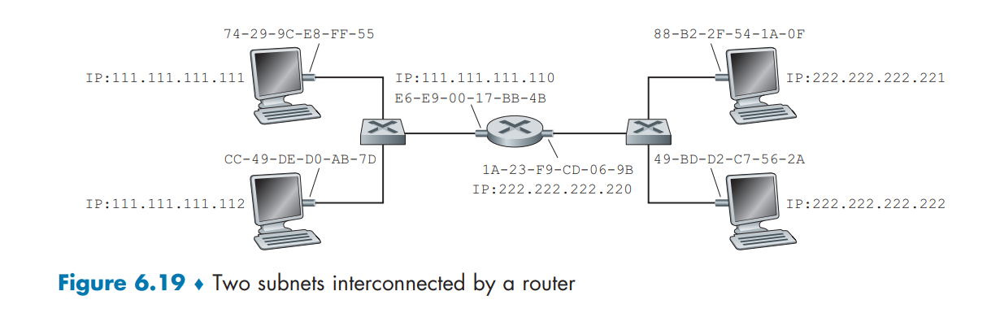​

当子网中的某主机要向子网之外（也就是跨越路由器的另一个子网）的主机发送网络层数据报

假设主机 111.111.111.111 要向主机 222.222.222.222 发送一个 IP 数据报

* 发送主机向它的适配器传递数据报。但是，发送主机还必须向它的适配器指示一个适当的目的 MAC 地址

  * 注意，如果取这个 MAC 地址为主机 222.222.222.222 的适配器地址，即 49-BD-D2-C7-56-2A，那么子网 1 上所有的适配器都不会费心将该 IP 数据报传递到它的网络层，因为该帧的目的地址与子网 1 上所有适配器的 MAC 地址都将不匹配
* 该数据报必须首先发送给路由器接口 111.111.111.110，它是通往最终目的地路径上的第一跳路由器的 IP 地址

  * 因此，对于该帧来说，适当的 MAC 地址是路由器接口 111.111.111.110 的适配器地址，即 E6-E9-00-17-BB-4B
  * 但发送主机怎样获得 111.111.111.110 的 MAC 地址呢?当然是通过使用 ARP!
  * 一旦发送适配器有了这个 MAC 地址，它创建一个帧（包含了寻址到 222.222.222.222 的数据报），并把该帧发送到子网 1 中
  * 在子网 1 上的路由器适配器看到该链路层帧是向它寻址的，因此把这个帧传递给路由器的网络层。该 IP 数据报终于被成功地从源主机移动到这台路由器
* 路由器现在必须决定该数据报要被转发的正确接口，这是通过查询路由器中的转发表来完成的

  * 转发表告诉这台路由器该数据报要通过路由器接口 222.222.222.220 转发
  * 然后该接口把这个数据报传递给它的适配器，适配器把该数据报封装到一个新的帧中，并且将帧发送进子网 2 中
* 这时，该帧的目的 MAC 地址是最终目的地 MAC 地址。路由器最后用 ARP 获得目的地 MAC 地址

## 以太网

* 初始的以太局域网使用同轴电缆总线来互联节点。以太网的总线拓扑实际上从 20 世纪 80 年代到 90 年代中期一直保持不变。使用总线拓扑的以太网是一种广播局域网，即所有传输的帧传送到与该总线连接的所有适配器并被其处理
* 到了 20 世纪 90 年代后期，大多数公司和大学使用一种基于集线器的星形拓扑以太网安装替代了它们的局域网。在这种安装中，主机（和路由器）直接用双绞对铜线与一台集线器相连

  * **集线器** （hub）是一种物理层设备，它作用于各个比特而不是作用于帧。当表示一个 0 或一个 1 的比特到达一个接口时，集线器只是重新生成这个比特，将其能量强度放大，并将该比特向其他所有接口传输出去
  * 因此，采用基于集线器的星形拓扑的以太网也是一个广播局域网，即无论何时集线器从它的一个接口接收到一个比特，它向其所有其他接口发送该比特的副本。特别是，如果某集线器同时从两个不同的接口接收到帧，将出现一次碰撞，生成该帧的节点必须重新传输该帧
* 在 21 世纪初，以太网又经历了一次重要的革命性变化。以太网安装继续使用星形拓扑，但是位于中心的集线器被**交换机**（switch）所替代

### 以太网帧结构

考虑从一台主机向另一台主机发送一个 IP 数据报，且这两台主机在相同的以太局域网上。设发送适配器（即适配器 A） 的 MAC 地址是 AA-AA-AA-AA-AA-AA，接收适配器（即适配器 B）的 MAC 地址是 BB-BB-BB-BB-BB-BB。发送适配器在一个以太网帧中封装了一个 IP 数据报，并把该帧传递到物理层。接收适配器从物理层收到这个帧，提取出 IP 数据报，并将该 IP 数据报传递给网络层

帧最小长度为64字节，当数据帧到达网卡时，在物理层上网卡要先去掉前导同步码和帧开始定界符，然后对帧进行CRC检验，如果帧校验和错，就丢弃此帧

* 数据字段（46～1500 字节）

  * 这个字段承载了 IP 数据报
  * 以太网的**最大传输单元 （MTU）** 是 1500 字节。这意味着如果 IP 数据报超过了 1500 字节，则主机必须将该数据报**分片**
  * 数据字段的最小长度是 46 字节。这意味着如果 IP 数据报小于 46 字节，数据报必须被填充到 46 字节。

    * 当采用填充时，传递到网络层的数据包括 IP 数据报和填充部分
    * 网络层使用 IP 数据报首部中的长度字段来去除填充部分。
* 目的地址（6 字节）

  * 这个字段包含目的**适配器的 MAC 地址**，即 BB-BB-BB-BB-  BB-BB
  * 当适配器 B 收到一个以太网帧，帧的目的地址无论是 BB-BB-BB-BB-BB- BB， 还是 MAC 广播地址，它都将该帧的数据字段的内容传递给网络层
  * 如果它收到了具有其他 MAC 地址的帧，则丢弃
* 源地址（6 字节）

  * 这个字段包含了传输该帧到局域网上的适配器的 MAC 地址，在本例中为 AA-AA-AA-AA-AA-AA
* 类型字段（2 字节）

  * 类型字段允许以太网**复用多种网络层协议**
  * 主机能够使用除了 IP 以外的其他网络层协议。事实上，一台给定的主机可以支持多种网络层协议，以对不同的应用采用不同的协议
  * 因此，当以太网帧到达适配器 B，  适配器 B 需要知道它应该将数据字段的内容传递给哪个网络层协议（即分解）。
  * IP 和其他链路层协议都有它们各自的、标准化的类型编号
  * 此外，ARP 协议也有自己的 类型编号，并且如果到达的帧包含 ARP 分组（即类型字段的值为十六进制的 0806），则该 ARP 分组将被多路分解给 ARP 协议
  * 该类型字段和网络层数据报中的协议字段、传输层报文段的端口号字段相类似；所有这些字段都是为了把一层中的某协议与上一层的某协议结合起来
* CRC（4 字节）

  * CRC（循环冗余检测）字段的目的是使得接收适配器（适配器 B）检测帧中是否引入了差错
* 前同步码 （8 字节）

  * 以太网帧以一个 8 字节的前同步码 （Preamble） 字段开始
  * 该前同步码的前 7 字节的值都是 10101010;最后一个字节是 10101011
  * 前同步码字段的前 7 字节用于“唤醒”接收适配器，并且将它们的时钟和发送方的时钟同 步。

    * 为什么这些时钟会不同步呢?记住适配器 A 的目的是根据以太局域网类型的不同，分别以 10Mbps、100Mbps 或者 1Gbps 的速率传输帧。
    * 因此适配器 A 不会以精确的额定速率传输帧；相对于额定速率总有一 些漂移，局域网上的其他适配器不会预先知道这种漂移
    * 接收适配器只需通过锁定前同步码的前 7 字节的比特，就能够锁定适配器 A 的时钟
  * 前同步码的第 8 个字节的最后两个比特（第一个出现的两个连续的 1）警告适配器 B“重要内容”就要到来了

​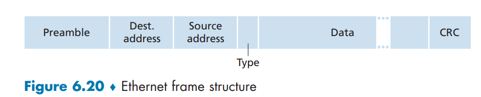​

* 所有的以太网技术都向网络层提供无连接服务

  * 当适配器 A 要向适配器 B 发送一个数据报时，适配器 A 在一个以太网帧中封装该数据报，并且把该帧发送到局域网上，没有先与适配器 B 握手
* 以太网技术都向网络层提供不可靠服务

  * 当适配器 B 收到一个来自适配器 A 的帧，它对该帧执行 CRC 校验，但是当该帧通过 CRC 校验时它不发送确认帧
  * 而当该帧没有通过 CRC 校验时它也不发送否定确认帧，适配器 B 只是丢弃该帧
  * 因此，适配器 A 根本不知道它传输的帧是否到达了 B 并通过了 CRC 校验
  * 在链路层缺乏可靠的传输有助于使得以太网简单和便宜。但是它也意味着传递到网络层的数据报流能够有间隙
* 由于丢弃了以太网帧而存在间隙，主机 B 上的应用是否会看见这个间隙取决于该应用是使用 UDP 还是使用 TCP

  * 如果应用使用的是 UDP，则主机 B 中的应用的确会看到数据中的间隙
  * 如果应用使用的是 TCP，  则主机 B 中的 TCP 将不会确认包含在丢弃帧中的数据，从而引起主机 A 的 TCP 重传

    * 当 TCP 重传数据时，数据最终将回到曾经丢弃它的以太网适配器

### 以太网技术

* 以太网具有许多版本，如 10BASE-T、10BASE-2、100BASE-T、1000BASE-LX 和 10GBASE-T

  * 首字母缩写词的第一 部分指该标准的速率：10、100、1000 或 10G， 分别代表 10Mbps、100Mbps、1000Mbps   （或 1Gbps） 和 10Gbps 以太网
  * “BASE” 指基带以太网，这意味着该物理媒体仅承载以太网流量

    * 几乎所有的 802.3 标准都适用于基带以太网
  * 首字母缩写词的最后一部分指物理媒体本身

    * 以太网是链路层也是物理层的规范，并且能够经各种物理媒体（包括同轴电缆、铜线和光纤）承载
    * 一般而言，“T”   指双绞铜线
* 以太网最初被构想为一段同轴电缆

  * 早期的 10BASE-2 和 10BASE-5 标准规定了在两种类型的同轴电缆之上的 10Mbps 以太网，每种标准都限制在 500 米长度之 内。通过使用**转发器** （repeater）   能够得到更长的运行距离，而转发器是一种物理层设备， 它能在输入端接收信号并在输出端再生该信号

​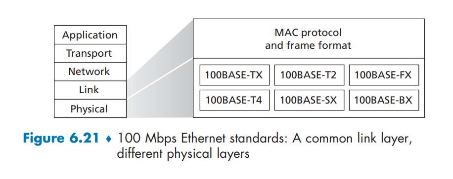​

## 链路层交换机

* 交换机的任务是接收入链路层帧并将它们转发到出链路
* 交换机自身对子网中的主机和路由器是**透明的** （transparent）

  * 某主机/路由器向另一个主机/路由器寻址一个帧（而不是向交换机寻址该帧），顺利地将该帧发送进局域网，并不知道某交换机将会接收该帧并将它转发到另一个节点
  * 这些帧到达该交换机的任何输出接口之一的速率可能暂时会超过该接口的链路容量

    * 为了解决这个问题，交换机输出接口设有缓存，这非常类似于路由器接口为数据报设有缓存

### 交换机转发和过滤

* **过滤** （filtering）

  * 决定一个帧应该转发到某个接口还是应当将其丢弃的交换机功能
* **转发** （forwarding）

  * 决定一个帧应该被导向哪个接口，并把该帧移动到那些接口的交换机功能
* 交换机的过滤和转发借助于**交换机表**（switch table） 完成

  * 该交换机表包含某局域网上某些主机和路由器的，但不必是全部的表项
  * 交换机表中的一个表项包含：

    * 一个 MAC 地址
    * 通向该 MAC 地址的交换机接口
    * 表项放置在表中的时间

​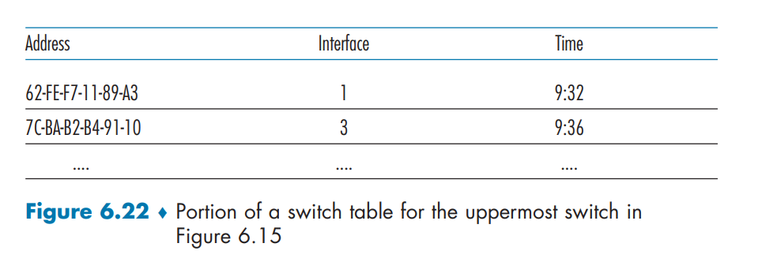​

假定目的地址为 DD-DD-DD-DD-DD-DD 的帧从交换机接口 x 到达。交换机用 MAC 地址 DD-DD-DD-DD-DD-DD 索引它的表。有 3 种可能的情况：

1. 表中没有对应 DD-DD-DD-DD-DD-DD 的表项

   1. 在这种情况下，交换机向除接口 x 外的所有接口前面的输出缓存转发该帧的副本
   2. 即如果没有对于目的地址的表项，交换机广播该帧
2. 表中有一个表项将 DD-DD-DD-DD-DD-DD 与接口 x 联系起来

   1. 在这种情况下，该帧从包括适配器 DD-DD-DD-DD-DD-DD 的局域网网段到来，这意味着该帧已经在包含目的地的局域网网段广播过了
   2. 无须将该帧转发到任何其他接口，交换机通过丢弃该帧执行过滤功能即可
3. 表中有一个表项将 DD-DD-DD-DD-DD-DD 与接口 y≠x 联系起来

   1. 在这种情况下，该帧需要被转发到与接口 y 相连的局域网网段
   2. 交换机通过将该帧放到接口 y 前面的输出缓存完成转发功能

只要交换机的表是完整和准确的，该交换机无须任何广播就向着目的地转发帧

### 自学习

交换机的表是自动、动态和自治地建立的，即没有来自网络管理员或来自配置协议的任何干预。 即交换机是**自学习**（self-learning）的：

1. 交换机表初始为空
2. 对于在每个接口接收到的每个入帧，该交换机在其表中存储：

   1. 在该帧源地址字段中的 MAC 地址
   2. 该帧到达的接口
   3. 当前时间

   交换机以这种方式在它的表中记录了发送节点所在的局域网网段。如果在局域网上的每个主机最终都发送了一个帧，则每个主机最终将在这张表中留有记录
3. 如果在一段时间（**老化期** **（aging time）** ） 后，交换机没有接收到以该地址作为源地址的帧，就在表中删除这个地址

   1. 以这种方式，如果一台 PC 被另一台 PC（具有不同的适配器）代替，原来 PC 的 MAC 地址将最终从该交换机表中被清除掉

​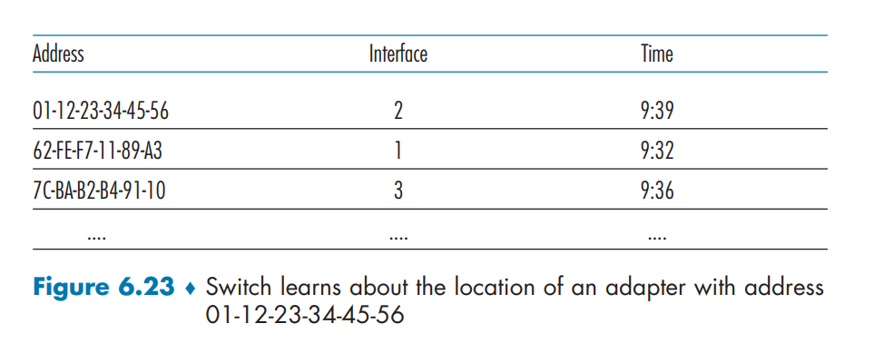​

* 交换机是**即插即用设备** （plug-and-play device）

  * 它们不需要网络管理员或用户的干预
  * 要安装交换机的网络管理员除了将局域网网段与交换机的接口相连外，不需要做其他任何事
  * 管理员在安装交换机或者当某主机从局域网网段之一被去除时，他没有必要配置交换机表
* 交换机是双工的，这意味着任何交换机接口能够同时发送和接收

### 链路层交换机的性质

* 消除碰撞

  * 在使用交换机（不使用集线器）构建的局域网中，没有因碰撞而浪费的带宽
  * 交换机缓存帧不会在网段上同时传输多于一个帧
  * 就像使用路由器一样，交换机的最大聚合带宽是该交换机所有接口速率之和
  * 因此，交换机提供了比使用广播链路的局域网高得多的性能改善
* 异质的链路

  * 交换机将链路彼此隔离，因此局域网中的不同链路能够以不同的速率运行并且能够在不同的媒体上运行
* 管理

  * 除了提供强化的安全性，交换机也易于进行网络管理
  * 例如，如果一个适配器工作异常并持续发送以太网帧（称为快而含糊的（jabbering）适配器），交换机能够检测到该问题，并在内部断开异常适配器
  * 交换机也收集带宽使用的统计数据、碰撞率和流量类型，并使这些信息为网络管理者使用。这些信息能够用于调试和解决问题，并规划该局域网在未来应当演化的方式

### 交换机与路由器的比较

* 路由器是使用网络层地址转发分组的存储转发分组交换机
* 交换机也是一个存储转发分组交换机，但它和路由器是根本不同的，因为它用 MAC 地址转发分组
* 交换机是第二层的分组交换机，而路由器是第三层的分组交换机

  * 使用“匹配加动作”的现代交换机能够转发基于帧的目的 MAC 地址的第二层帧，也能转发使用数据报目的 IP 地址的第三层数据报

​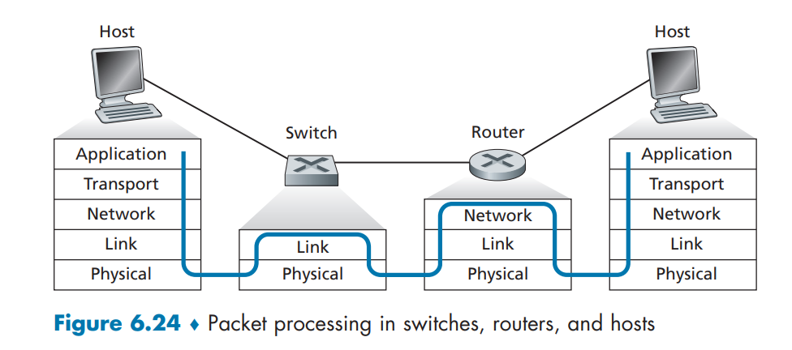​

> 交换机的优缺点

* 交换机是即插即用的
* 交换机还具有相对高的分组过滤和转发速率
* 交换机必须处理高至第二层的帧，而路由器必须处理高至第三层的数据报
* 为了防止广播帧的循环，交换网络的活跃拓扑限制为一棵生成树（运行 STP 算法）
* 一个大型交换网络将要求在主机和路由器中有大的 ARP 表，这将生成可观的 ARP 流量和处理量
* 交换机对于广播风暴并不提供任何保护措施，即如果某主机出了故障并传输出没完没了的以太网广播帧流，该交换机将转发所有这些帧， 使得整个以太网的崩溃

> 路由器的优缺点

* 网络寻址通常是分层次的（不像 MAC 寻址那样是扁平的），即使当网络中存在冗余路径时，分组通常也不会通过路由器循环。

  * 当路由器表被误配置时，分组可能循环；但是 IP 用一个特殊的报文首部字段来限制循环
  * 所以，分组就不会被限制到一棵生成树上，并可以使用源和目的地之间的最佳路径
* 因为路由器没有生成树限制，所以允许以丰富的拓扑结构构建因特网
* 路由器对第二层的广 播风暴提供了防火墙保护
* 路由器最重要的缺点就是它们不是即插即用的，即路由器和连接到它们的主机都需要人为地配置 IP 地址
* 而且路由器对每个分组的处理时间通常比交换机更长

  * 因为它们必须处理高达第三层的字段

​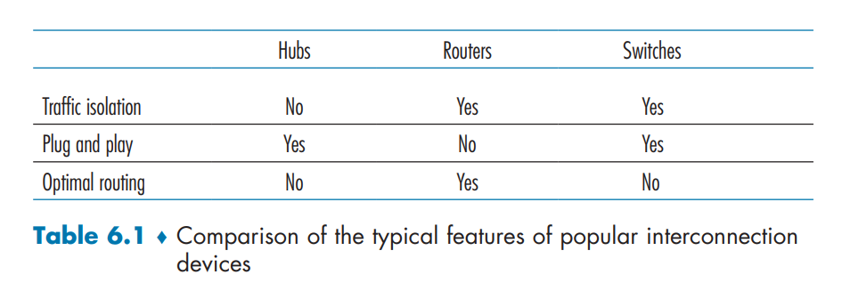​

* 通常，由几百台主机组成的小网络通常有几个局域网网段。对于这些小网络，交换机就足够了

  * 因为它们不要求 IP 地址的任何配置就能使流量局部化并增加总计吞吐量
* 在由几千台主机组成的更大网络中，通常在网络中（除了交换机之外）还包括路由器

  * 路由器提供了更健壮的流量隔离方式和对广播风暴的控制，并在网络的主机之间使用更“智能的”路由

## 虚拟局域网

现代机构的局域网常常是配置为等级结构的，每个工作组（部门）有自己的交换局域网，经过一个交换机等级结构与其他工作组的交换局域网互联

这样配置有三个缺点：

* 缺乏流量

  * 隔离该等级结构把组流量局域化到一个单一交换机中，但广播流量（例如携带 ARP 和 DHCP 报文或那些目的地还没有被自学习交换机学习到的帧）仍然必须跨越整个机构网络
  * 限制这些广播流量的范围将改善局域网的性能
  * 为了安全/隐私的目的也可能希望限制局域网广播流量
* 交换机的无效使用

  * 如果该机构不止有 3 个组，而是有 10 个组，则将要求有 10 个第一级交换机
  * 如果每个组都较小，比如说少于 10 个人，则单台 96 端口的交换机将足以容纳每个人，但这台单一的交换机将不能提供流量隔离
* 管理用户

  * 如果一个雇员在不同组间移动，必须改变物理布线，以将该雇员连接到不同的交换机上。属于两个组的雇员将使问题更为困难

**虚拟局域网（Virtula Local Network， VLAN）**

* 支持 VLAN 的交换机允许经一个单一的物理局域网基础设施定义多个虚拟局域网
* 在一个 VLAN 内的主机彼此通信，仿佛它们（并且没有其他主机）与交换机连接
* 在一个基于端口的 VLAN 中，交换机的端口（接口）由网络管理员划分为组

  * 每个组构成一个 VLAN，  在每个 VLAN 中的端口形成一个广播域（即来自一个端口的广播流量仅能到达该组中的其他端口）

​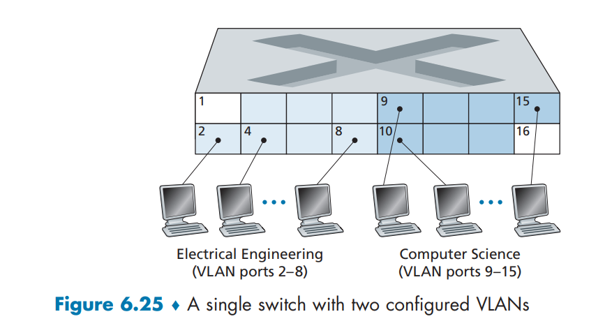​

图 6-25 显示了具有 16 个端口的单一交换机。端口 2～8 属于电气工程系 （EE）VLAN， 而端口 9～15 属于计算机科学系 （CS）VLAN（端口 1 和 16 未分配）。这个 VLAN 解决了上面提到的所有困难，即 EE VLAN 帧和 CS VLAN 帧彼此隔离，图 6- 15 中的两台交换机已由一台交换机替代，并且在交换机端口 8 的用户加入计算机科学系时，网络操作员只需重新配置 VLAN 软件，使得端口 8 与 CS VLAN 相关联即可。

> VLAN 交换机配置和操作的方法：

* 网络管理员使用交换机管理软件声明一个端口属于某个给定的 VLAN（其中未声明的端口属于一个默认的 VLAN）
* 在交换机中维护一张端口到 VLAN 的映射表
* 交换机软件仅在属于相同 VLAN 的端口之间交付帧

​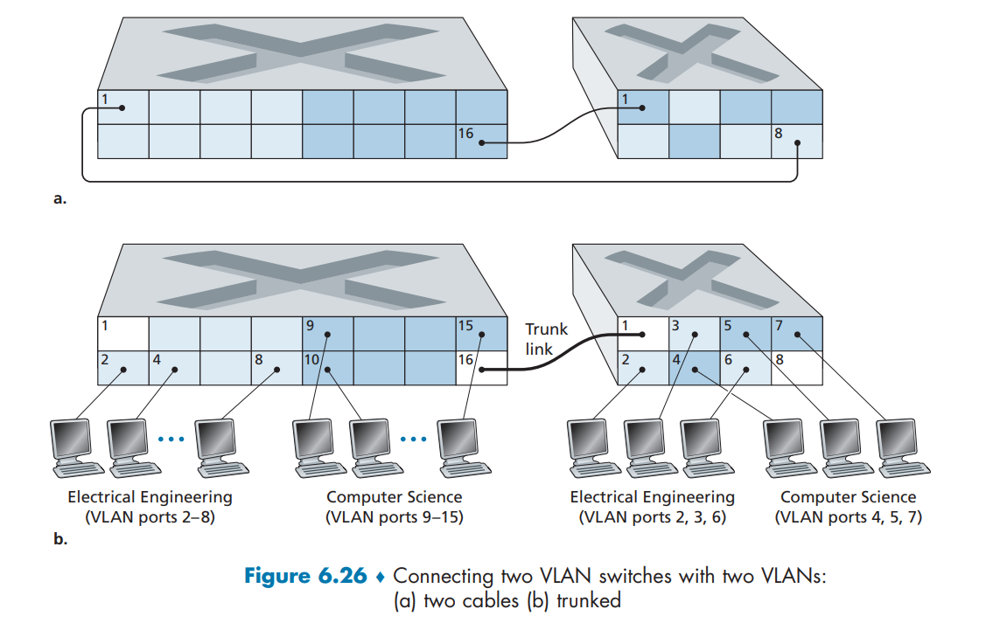​

> 来自电子工程系的流量怎样才能发送到计算机科学系：

* 将VLAN 交换机的一个端口与一台外部的路由器相连，并且将该端口配置为属于EE VLAN 和 CS VLAN

  * 在此情况下，即使电子工程系和计算机科学系共享相同的物理交换机，其逻辑配置看起来仿佛是电子工程系和计算机科学系具有分离的经路由器连接的交换机。
  * 从电子工程系发往计算机科学系的数据报将首先跨越EE VLAN到达路由器，然后由该路由器转发跨越CS VLAN到达CS 主机

> 两台交换机应当如何互联：

* 在每台交换机上定义一个属于 CS VALN的端口（对EE VLAN 也类似处理），并且如图6-26a 所示将这两个端口彼此互联起来

  * 这种解决方案不具有扩展性，因为在每台交换机上N 个 VLAN将要求N 个端口直接互联这两台交换机
* 一种更具扩展性互联VLAN 交换机的方法称为**VLAN 干线连接** （VLAN trunking）

  * 在图6-26b 所示的VLAN干线方法中，每台交换机上的一个特殊端口（左侧交换机上的端口 16，右侧交换机上的端口1）被配置为**干线端口**，以互联这两台VLAN交换机
  * 该干线端口属于所有 VLAN，  发送到任何VLAN的帧经过干线链路转发到其他交换机
  * 但这会引起另外的问题： 一个交换机怎样知道到达干线端口的帧属于某个特定的VLAN呢?

    * IEEE 定义了一种扩展的以太网帧格式——802.1Q，  用于跨越VLAN干线的帧
    * 如图6-27中所示， 802.1Q 帧由标准以太网帧与加进首部的4字节VLAN 标签 （VLAN tag） 组成，而VLAN 标签承载着该帧所属的VLAN 标识符
    * VLAN 标签由在VLAN 干线发送侧的交换机加进帧中，解析后并由在VLAN干线接收侧的交换机删除
    * VLAN 标签自身由一个2字节的标签**协议标识符** （Tag Protocol Identifier，TPID） 字段（具有固定的十六进制值81-00） 、一个2字节的标签控制信息字段（包含一个12比特的VLAN标识符字段）和一个3比特优先权字段（具有类似于IP 数据报TOS字段的目的）组成

​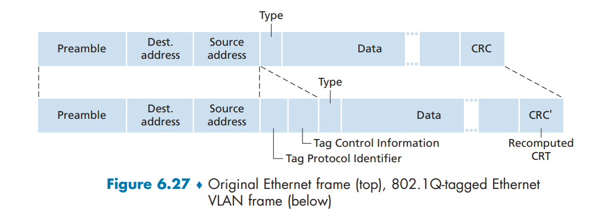​

# 链路虚拟化：网络作为链路层

# 数据中心网络

# Web 页面请求历程

‍
