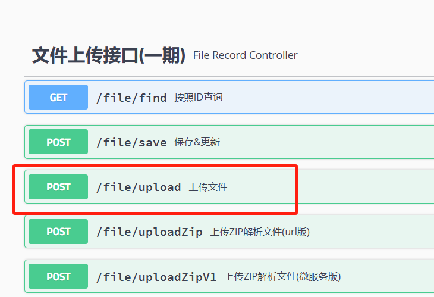
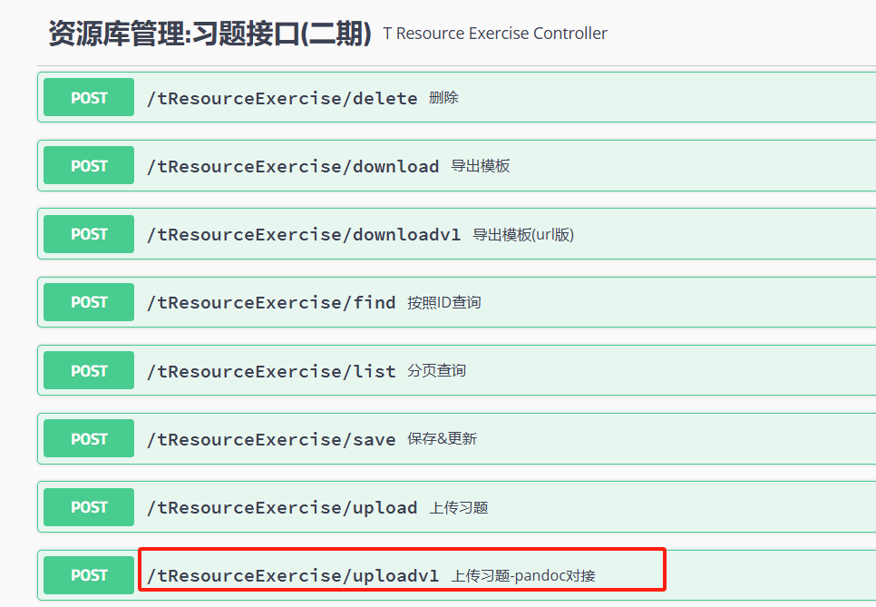
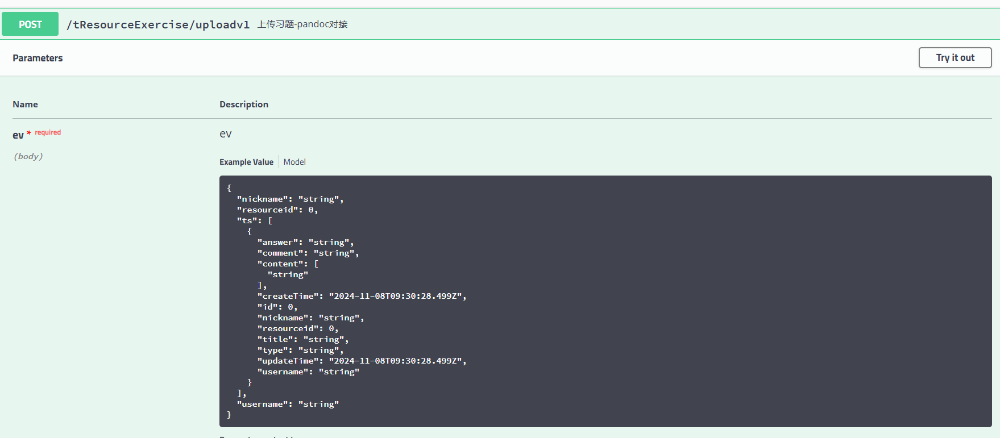

# 智能教材开发

# 习题导入

## 需求

1. 通过pandoc工具，解析习题，开源语言建议Python
2. 习题中图片，上传至文件微服务接口，见C列图（测试环境服务地址：http://172.23.135.209:8095/swagger-ui.html#/） szjc szjc
3. 公式按照MD的格式存储
4. 解析后数据直接返回给前端，不用调用微服务（按照现有产品逻辑调整，数据格式见D列数据）
5. 上传习题中字段可以不传：createTime、updateTime

​​

​​

​​

-

## 第一次组会

1. 前端

文件流

URL

定义接口，给前端

2. 导入

图片回显URL

公式md格式写入

-> html

3. 上传

Flask

## 第二次组会

### 进度

1. 实现word文档转为markdown并返回给前端
2. 实现图片的提取，但是还没有实现图片的上传功能

### Q

1. 图片上传的JSON串格式一定要满足吗？
2. Python使用的库，在服务器上要怎么使用
3. Python怎么接入业务

## 第三次组会

### 待解决

* [X] image上传
* [ ] 题目解析

  * [ ] 多媒体
  * [X] 按行、多行
  * [X] 封装
* [X] 题目返回

### 进度

1. image可以正常上传
2. 文本解析实现

    1. 存在兼容性问题

### Issue

1. 代码提交
2. 图片URL插入
3. 增加出错定位机制
4. 增强兼容性

    1. 粗体黑体标题
5. 框架优化

### 图片返回信息

```json
{
'code': 200, 
'message': '操作成功', 
'data': {	'id': 35413, 
			'url': 'https://aibook.ecnu.edu.cn/oss/szjc/1732069312501-1a5a5d35-b25e-4ad1-8777-6351ac1728f2-IMAGE_ID1.png', 
			'filename': 'IMAGE_ID1.png', 
			'bucket': 'szjc', 
			'type': 1, 
			'createTime': '2024-11-20 10:21:52', 
			'updateTime': '2024-11-20 10:21:52', 
			'size': 14350, 
			'suffix': 'png'
		}
}

```

## 第四次组会

### 已实现

1. 图片链接插入
2. 基本的报错功能

    1. 检查格式
    2. 检查是否有答案、解析、题目冗余
    3. 重复选项

### 可能存在的问题

1. 是先发送图片，再进行解析，可能会浪费服务器资源

# 服务器上载测试

## 代码克隆

```bash
git clone -b tooldev http://219.228.60.151:3000/di-edu/szjc-outsource.git
```

wulvsheng

77SHiJPVk8GwJex

## 文件传输测试

```bash
curl -X 'POST' 'http://172.23.148.113:8001/upload' -H 'accept: application/json' -H 'Content-Type: multipart/form-data' -F 'file=@HasError.docx;type=application/vnd.openxmlformats-officedocument.wordprocessingml.document'
```

‍
