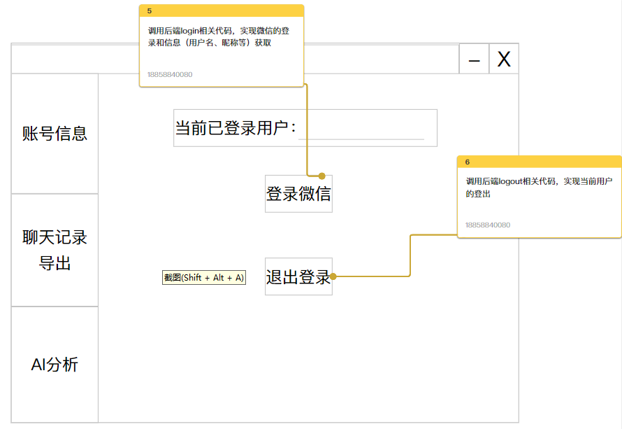

# 微信助手

# 前端页面部分

## 概览

​​

## 页面展示

1. 边栏切换主页面显示

    1. 账号信息
    2. 聊天记录导出
    3. AI分析
2. 顶栏，默认
3. 主页面

    1. 账号信息页面

        1. 显示当前已登录用户
        2. 登录微信按钮

            1. 登录界面
            2. 自动获取
            3. 手动输入
        3. 退出登录按钮
    2. 聊天记录导出页面

        1. 聊天记录导出按钮
        2. *聊天记录导出特定格式按钮
    3. AI分析页面

        1. *情感分析

# 前后端接口

后端可以按照这个架构来：

* project

  * dao （数据库）

    * WeChatDao.py

      实现读取微信数据的功能

      * 用户信息
      * 聊天记录
  * service （前后端交互）

    * WeChatService.py

      * 调用dao的函数获取信息
  * view （前端）

## 账号信息页面

‍
