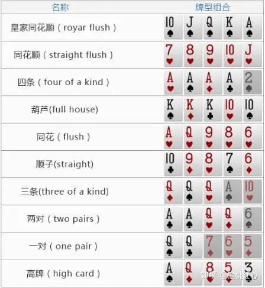

# 德州扑克

# 游戏内容

在“德州扑克”游戏中，你将拿到2张只有你能使用的手牌。然后，在桌上发5张公共牌(依次发出3张翻牌，1张转牌，1张河牌)，每个人都可以将这5张公共牌与自己的2张手牌进行组合，从这7张牌中选出最好的5张牌。如果所有的下注回合结束，到了最后摊牌的时刻，玩家就会亮出他们的牌，拥有组合后最大的5张牌的玩家将赢得底池里所有的筹码。

## 获胜条件

赢一手扑克有两种方法:

(1)bluff(“诈唬”、“偷鸡”)通过下注或加注迫使对手弃牌。

(2)你在摊牌时有更大的牌（在所有的投注回合结束后，有两名或更多的玩家亮出他们的牌)。通常情况下，你需要选出最好的5张牌。

​​

## 游戏流程

### 盲注

在每手牌发牌之前，按钮左边的玩家必须下注一个小盲，而小盲左边的玩家必须下注一个大盲。这些“盲注”是强制下注

### 翻牌前

投下盲注后，每个玩家将收到2张正面朝下的牌。顺序是小盲拿到第一张牌，然后按顺时针方向为其余玩家发牌。翻前从大盲的左侧(通常被称为“枪口”或UTG)开始行动，该玩家可以有3种选择:

平跟Limp(与大盲下注一致)

加注Raise(加注至大于或等于2倍大盲的金额)

弃牌Fold(弃牌，不损失筹码)

游戏按顺时针方向从一个玩家到下一个玩家进行，每个玩家可跟注前一个玩家的下注，也可以选择加注或弃牌。

### 翻牌

发出三张牌公共牌，称为“翻牌”。如前所述，所有玩家都可以同时使用这些公共牌与自己手牌组合出最好的5张牌。

游戏继续进行一轮下注，从按钮位左侧第一个仍然有牌在手的玩家开始。

第一个行动的玩家可以过牌(check)或下注(bet)。

如果其他玩家已经下注，那么你可以:

跟注Call(匹配其下注的大小)

加注Raise(将当前下注的大小增加至少2倍-或补足之前和当前下注之间的差额)

弃牌Fold(放弃你的手牌和之前的下注，无需投入任何额外的筹码)

注意：下注通常出于以下三个原因：

A.价值下注(Value Bet)：引诱弱牌跟注，赢得更多利益价值。价值下注也有保护的作用，防止对手轻易的抽中牌而反超。

B.半诈唬(Semi-Bluff)：当你听牌时(抽花或者抽顺)，可以进行下注

增加底池大小，当你抽中时将赢得更大的底池

迫使你的对手现在弃牌，直接赢得当前底池

C.炸唬、偷鸡(Bluff)：明知道牌力弱于对手，仍然下注或加注，期望对手弃牌。

### 转牌

翻牌的下注完成后，将发出另外一张公共牌，称为“转牌”。在场玩家可将2张手牌和4张公共牌进行组合，从而组合出最大的5张牌。

再次进行下注，从庄家按钮左侧第一个未弃牌的玩家开始，按顺时针方向依次进行，当所有剩余玩家都行动后，下注回合结束(每个玩家投入底池的金额必须相等)。

### 河牌

现在发第五张公共牌，也就是最后一张公共牌，我们称之为“河牌”。现已发出了所有可用的牌(2张手牌及5张公共牌)，还在场玩家必须确定自己最大的5张牌(具体大小请参照文章开头的图表)。

接下来进行最后一轮下注，下注完成后，就到了摊牌的时刻。

### 摊牌

摊牌时，玩家依次展示他们的牌，组成最大5张牌的玩家获胜，获得底池中所有的筹码，按钮位(庄位)将移至左手边下一名玩家，然后开始下一手牌。

注意: 关于摊牌的顺序有以下特定规则

A、如果最后一轮下注所有人都过牌(check)，那么按钮左侧的玩家将第一个摊牌，然后顺时针依次摊牌(如果你的手牌已经无法获胜，也可以选择直接将牌面朝下扔进底池(Muck)，以免向对手暴露更多信息，如果你无法判断自己牌的大小，最好还是亮出你的牌，让荷官来判断谁赢。)

B、如果有人下注(或加注)然后被跟，那么则由最后一个下注(或加注)的玩家先摊牌，顺时针依次摊牌。

C、虽然这些是摊牌的规则，但是有时候如果玩家认为自己的手牌一定能获胜，他可以立刻翻牌，这也是可以接受的。

## 特殊情况

### All In

玩家全押只能赢取自己筹码量那部分筹码， 例如，玩家1在转牌下注$50，而玩家2仅剩$35， 如果玩家2跟注，则将玩家1下注的$50中拿出$35放入底池的”主池”(main pot)中，而剩余的$15将分两种情况:

(a)如果是玩家1与玩家2两个人单挑，则将$15返还给玩家1;

(b)将$15放入“边池”(side pot)，未弃牌且还有筹码的玩家将争夺边池中的筹码。全押后，玩家2无法从边池中赢得任何筹码。

如果两名玩家单挑，其中一名全押，另一名玩家跟注或全押，将省略之后的下注回合 ，直接发完5张牌然后摊牌比大小。现金局中，这种情况也可以提前摊牌，然后2名玩家协商发多次(run it twice)来降低波动；这种情况必须是2名玩家的全押，必须2人都同意发多次(一般2-5次)，从全押的时刻开始，把剩余的公共牌发出多次，按赢的次数比例分底池。

# 核心功能

## 视图

牌面的设计，图案、颜色

胜利、失败界面

## 玩家/人机操作

玩家可以通过在控制台键入指令进行操作

### 选择操作

当回合内轮到自己操作时，通过控制台输入数字选择操作

### 下注

选择该操作后，可以输入数字来代表下注金额

### Check

选择该操作后，可以跳过当前下注，由下家行动

### All In

选择该操作后，将自己所有筹码压入筹码池，程序进行All In判断

### 弃牌

选择该操作后，退出当前这局游戏，同时已经下注的所有筹码不再返回

### 计算权值（人机操作）

通过牌型出现的概率计算获胜期望值，来决定人机的下一步操作

## 控制器操作

### 发牌

给每名玩家发两张牌，要求随机且每张牌唯一

### 翻牌

在第一轮下注完成后发出三张牌到“桌面”上并显示

在第二轮下注完成后发出一张牌到“桌面”上并显示

在第三轮下注完成后发出一张牌到“桌面”上并显示

### 点数判断

1. 根据牌型决定胜负
2. 当牌型一致时根据点数大小决定胜负
3. 当以上两项一致时判平局

### 筹码分配

游戏开始时初始化每名玩家的筹码

一局游戏结束后根据胜负将筹码池中的筹码进行分配

### All In

当有玩家选择了All In操作后，进入All In判断。玩家全押只能赢取自己筹码量那部分筹码， 例如，玩家1在转牌下注$50，而玩家2仅剩$35， 如果玩家2跟注，则将玩家1下注的$50中拿出$35放入底池的”主池”(main pot)中，而剩余的$15将分两种情况:

1. 如果是玩家1与玩家2两个人单挑，则将$15返还给玩家1;
2. 将$15放入“边池”(side pot)，未弃牌且还有筹码的玩家将争夺边池中的筹码。全押后，玩家2无法从边池中赢得任何筹码。

如果两名玩家单挑，其中一名全押，另一名玩家跟注或全押，将省略之后的下注回合 ，直接发完5张牌然后摊牌比大小。现金局中，这种情况也可以提前摊牌，然后2名玩家协商发多次(run it twice)来降低波动；这种情况必须是2名玩家的全押，必须2人都同意发多次(一般2-5次)，从全押的时刻开始，把剩余的公共牌发出多次，按赢的次数比例分底池。

# 可行性

## 技术应用

### 界面

控制台

## 数据设计

### 玩家Player

​`long money`​表示当前玩家拥有的筹码数额

​`String[] cards`​表示玩家当前手上的牌

​`long power`​表示人机计算的权值

### 控制器Controller

​`int flag`​表示当前轮到的玩家

​`int round`​表示当前轮次

​`int gameTimes`​表示已经进行的游戏次数

​`int button`​表示庄家

​`String[] restCards`​表示剩余的牌

​`String[] CommunityCards`​表示已经翻开的牌

​`long pot`​表示筹码池中的筹码数额

## 逻辑描述

### 点数判断

​​

### 加注

输入加注数额，该数额不能大于现有筹码数，也不能小于前一个玩家的加注数额

### 发牌

控制器进行发牌

不能发出重复的牌

‍

# 流程

1. 确定庄家、大盲、小盲位置
2. 大盲、小盲强制下注
3. 控制器为每位玩家发两张牌
4. 循环：第一轮：从小盲下一位玩家开始；其他轮：从庄家下一位玩家开始

    1. 下注：则必须满足 前一名玩家下注金额 <= 当前玩家下注金额 <= 当前玩家拥有的筹码数
    2. 直到仍然在场的人下注的金额全部相同，才进行下一轮
5. 控制器发牌
6. 回到第4步，直到发了5张牌
7. 判断胜利

‍

分整场游戏，一局游戏、一回合、一轮

1. 玩家人数选择（选择，存放）
2. 开始游戏，分配基础筹码数，确定庄家、大盲、小盲
3. 强制下注
4. 发牌给玩家（怎么，防止重复，图形展示）
5. 循环操作，可能会有多轮操作（如果有人弃牌？），判断是否能进入下一回合（怎么），以及AI实现（怎么）
6. 进入新回合，控制器发牌到桌面，重复直到一局游戏结束
7. 分配筹码，庄家、大盲、小盲顺位移动，进入下一局游戏或者选择退出游戏
8. 开始下一局游戏，筹码继承上一局

‍

用随机数，先不算权值
